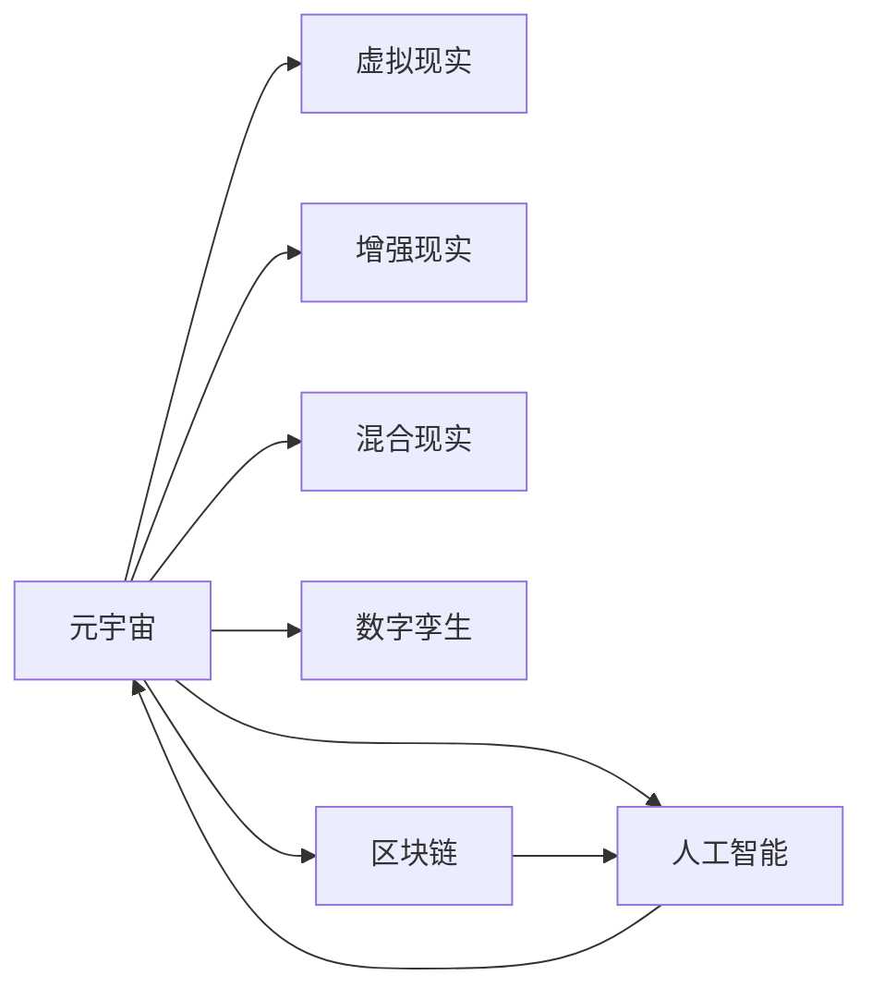

                 

# 元宇宙创意产业：激发人类想象力的新疆界

> 关键词：元宇宙, 创意产业, 人工智能, 虚拟现实, 区块链, 数字孪生, 混合现实, 沉浸式体验, 虚拟经济

## 1. 背景介绍

### 1.1 问题由来

随着科技的飞速发展，人类的生活方式发生了翻天覆地的变化。信息技术的迅猛发展，尤其是移动互联网、大数据、云计算、物联网等技术的成熟，使得虚拟现实（Virtual Reality, VR）、增强现实（Augmented Reality, AR）、混合现实（Mixed Reality, MR）等新兴技术逐渐走入人们的视野，深刻影响着各行业的创新和变革。

在创意产业领域，传统的音乐、影视、游戏、文学、艺术等形式和载体正在向数字化的方向转变。而元宇宙（Metaverse）这一概念的提出，更是为创意产业带来了一次革命性的变革。元宇宙是一个虚拟世界，它包含着一个由多个虚拟环境和虚拟经济体系构成的虚拟空间。在这个虚拟空间中，用户可以自由地进行创作、社交、交易、娱乐等多种活动。

### 1.2 问题核心关键点

元宇宙创意产业的崛起，基于以下几个核心关键点：

1. **沉浸式体验**：元宇宙能够提供比传统媒介更加沉浸和逼真的感官体验，使用户能够更加自然地融入虚拟世界。
2. **交互性**：元宇宙中的交互方式更为丰富多样，支持文本、语音、手势、动作等多种形式的互动。
3. **创意自由**：元宇宙为创作者提供了无限可能的空间，任何想象力和创意都能在虚拟世界中找到实现。
4. **跨界融合**：元宇宙能够实现不同行业和领域之间的深度融合，为跨界创新提供了新的平台。
5. **经济激励**：元宇宙内嵌的经济系统，通过区块链等技术实现价值流转，激发了用户的积极性和创造力。

这些关键点使得元宇宙成为了创意产业的新前沿，激发了人类想象力的新疆界。

## 2. 核心概念与联系

### 2.1 核心概念概述

为更好地理解元宇宙创意产业的发展，本节将介绍几个关键概念：

- **元宇宙（Metaverse）**：由多个虚拟环境和虚拟经济体系构成的虚拟空间，是虚拟现实、增强现实、混合现实等技术的融合形态。
- **虚拟现实（Virtual Reality, VR）**：通过计算机生成的三维环境，使用户能够沉浸在虚拟世界中，获得身临其境的体验。
- **增强现实（Augmented Reality, AR）**：通过计算机增强现实环境中的物体信息，使用户能够在真实世界与虚拟信息之间进行互动。
- **混合现实（Mixed Reality, MR）**：结合VR和AR技术，将虚拟物体与现实世界中的物体进行融合，创造全新的交互体验。
- **数字孪生（Digital Twin）**：利用数字技术，创建一个现实世界的虚拟映射，通过仿真和分析来优化现实世界的运作。
- **区块链（Blockchain）**：一种分布式账本技术，能够确保数据透明、安全、不可篡改，为元宇宙内嵌经济系统提供支持。
- **人工智能（AI）**：能够自主学习、推理、决策，为元宇宙创意产业提供核心技术支持。

这些核心概念之间的联系和互动，构成了元宇宙创意产业的宏观框架。

### 2.2 核心概念原理和架构的 Mermaid 流程图



该流程图展示了元宇宙创意产业中各个关键技术之间的关系和相互作用：

1. **元宇宙**：由虚拟现实、增强现实、混合现实等技术共同支撑，包含数字孪生、区块链和人工智能等底层技术。
2. **虚拟现实**：通过三维环境构建，使元宇宙具有沉浸式体验。
3. **增强现实**：将虚拟信息叠加在现实世界中，增强用户的互动体验。
4. **混合现实**：将虚拟物体与现实物体融合，创造全新的交互方式。
5. **数字孪生**：将现实世界进行虚拟映射，进行仿真和分析。
6. **区块链**：提供安全、透明的数据流转机制，支持元宇宙内嵌经济系统。
7. **人工智能**：为元宇宙创意产业提供算法和计算支持，提升创意的实现和应用。

这些技术相互作用，共同构建了元宇宙创意产业的宏观架构。

## 3. 核心算法原理 & 具体操作步骤

### 3.1 算法原理概述

元宇宙创意产业的核心算法原理主要包括以下几个方面：

1. **多模态数据融合**：将文本、图像、音频等多种形式的数据进行融合，构建出更加丰富和逼真的虚拟环境。
2. **实时渲染与仿真**：通过高性能计算和实时渲染技术，保证虚拟环境的流畅性和逼真度。
3. **自然语言处理**：利用自然语言处理技术，实现用户与虚拟环境的互动和交互。
4. **个性化推荐**：通过算法模型，根据用户行为和偏好，推荐符合用户兴趣的内容和体验。
5. **经济系统设计**：设计基于区块链技术的经济系统，确保虚拟物品的稀缺性和价值流转的透明性。

这些算法原理构成了元宇宙创意产业的技术基础，推动了产业的发展和创新。

### 3.2 算法步骤详解

元宇宙创意产业的开发过程主要包括以下几个关键步骤：

**Step 1: 数据采集与处理**
- 收集现实世界的各类数据，如地图、建筑、艺术品、音乐等。
- 对数据进行预处理，包括清洗、标注、归一化等操作。
- 利用机器学习技术，对数据进行分类、聚类、降维等处理，构建出可供元宇宙使用的数据集。

**Step 2: 虚拟环境构建**
- 利用虚拟现实和增强现实技术，构建出虚拟空间中的各类虚拟物体和环境。
- 设计虚拟空间中的物理引擎，实现物体的运动、碰撞等交互。
- 利用仿真技术，对虚拟环境进行优化和测试，确保其逼真性和稳定性。

**Step 3: 用户交互设计**
- 设计用户与虚拟环境的交互界面，包括文本输入、语音交互、手势控制等。
- 实现自然语言处理技术，使虚拟环境能够理解用户的指令和反馈。
- 设计个性化推荐算法，根据用户行为和偏好推荐内容。

**Step 4: 经济系统设计**
- 利用区块链技术，设计虚拟物品的生成、交易、流转机制。
- 实现智能合约，确保交易的透明性和安全性。
- 设计虚拟物品的价值模型，保障虚拟经济的稳定性和可持续性。

**Step 5: 元宇宙上线与运营**
- 将虚拟环境部署到元宇宙平台上，确保其稳定性、可扩展性和安全性。
- 进行测试和优化，确保元宇宙的流畅性和用户体验。
- 设计运营策略，吸引用户入驻并提升用户体验。

### 3.3 算法优缺点

元宇宙创意产业的算法具有以下优点：

1. **沉浸式体验**：通过多模态数据融合和实时渲染技术，提供沉浸式体验，使用户能够全身心投入虚拟世界。
2. **交互性丰富**：支持多种形式的交互方式，提升用户的互动体验。
3. **创意自由度高**：用户可以自由进行创作和创新，实现无限的创意可能。
4. **跨界融合**：将多个行业和领域进行深度融合，实现跨界创新。
5. **经济激励机制**：利用区块链技术，实现虚拟物品的稀缺性和价值流转，激励用户创作和互动。

但同时也存在以下缺点：

1. **技术门槛高**：需要掌握多种先进技术，包括VR、AR、AI、区块链等。
2. **数据需求量大**：需要大量的高质量数据进行训练和优化。
3. **经济激励不足**：当前虚拟物品的稀缺性和价值流转机制尚未完全建立，难以吸引大量用户参与。
4. **法律和伦理问题**：虚拟物品和虚拟经济的管理和规范，需要制定相应的法律法规和伦理规范。

### 3.4 算法应用领域

元宇宙创意产业的应用领域十分广泛，主要包括：

1. **虚拟音乐节**：利用元宇宙技术，举办线上音乐节，用户可以参与演出、互动和社交。
2. **虚拟电影**：将现实中的电影制作过程迁移到元宇宙，支持虚拟角色的表演和互动。
3. **虚拟旅游**：构建虚拟旅游景点，使用户能够在家中自由游览。
4. **虚拟展览**：展示现实中的艺术品、文化遗产等，提供虚拟参观体验。
5. **虚拟剧院**：进行虚拟剧场表演，支持音乐、舞蹈、戏剧等多种艺术形式。
6. **虚拟购物**：在元宇宙中开设虚拟商店，提供虚拟商品的购物体验。
7. **虚拟演出**：支持虚拟角色的舞蹈、表演、戏剧等演出形式，提供互动体验。

这些应用领域展示了元宇宙创意产业的广阔前景和潜力。

## 4. 数学模型和公式 & 详细讲解 & 举例说明

### 4.1 数学模型构建

元宇宙创意产业中的数学模型主要涉及以下领域：

1. **三维几何建模**：构建虚拟环境的几何模型，通常使用点云、三角网格、多边形等模型。
2. **物理引擎**：实现虚拟物体的运动、碰撞、物理效果等，通常使用牛顿力学和动态系统理论。
3. **自然语言处理**：理解自然语言，通常使用词向量、Transformer等模型。
4. **个性化推荐**：根据用户行为和偏好推荐内容，通常使用协同过滤、神经网络等算法。
5. **区块链技术**：设计智能合约，保障交易的安全性和透明性，通常使用哈希函数、加密算法等。

### 4.2 公式推导过程

以下将展示自然语言处理和推荐系统中的两个关键公式：

**公式一：Transformer模型中的注意力机制**

Transformer模型中的注意力机制公式如下：

$$
\text{Attention}(Q, K, V) = \frac{\exp(\text{softmax}(QK^T/\sqrt{d_k}))}{\sum_j \exp(\text{softmax}(QK_j^T/\sqrt{d_k}))}KV
$$

其中，$Q, K, V$ 分别代表查询矩阵、键矩阵和值矩阵，$d_k$ 为键矩阵的维度。注意力机制通过计算查询矩阵和键矩阵的点积，得到注意力权重矩阵，从而实现对键矩阵中不同位置信息的加权求和。

**公式二：协同过滤算法**

协同过滤算法的基本公式如下：

$$
\hat{y} = w^T \cdot (y' - \frac{1}{N}\mathbf{1}^T y')
$$

其中，$y$ 为真实评分向量，$y'$ 为预测评分向量，$w$ 为权重向量，$\mathbf{1}$ 为全1向量。协同过滤算法通过计算用户和物品之间的相似度，利用已知的评分数据，预测未评分的评分值。

### 4.3 案例分析与讲解

以虚拟音乐节为例，展示元宇宙创意产业中的具体应用：

1. **虚拟场地搭建**：利用三维几何建模和实时渲染技术，构建虚拟音乐节的场地和舞台。
2. **虚拟乐队表演**：使用人工智能技术，生成虚拟乐队进行音乐表演，支持实时互动和用户控制。
3. **虚拟观众互动**：设计虚拟观众的互动界面，支持语音、手势、舞蹈等形式的用户互动。
4. **个性化推荐**：根据用户行为和偏好，推荐符合用户兴趣的虚拟物品、音乐、演出等。
5. **虚拟经济系统**：利用区块链技术，设计虚拟音乐节的虚拟物品和货币系统，支持虚拟物品的生成、交易和流转。

这些案例展示了元宇宙创意产业的实际应用，反映了其在多领域的广泛应用前景。

## 5. 项目实践：代码实例和详细解释说明

### 5.1 开发环境搭建

在进行元宇宙创意产业的开发前，我们需要准备好开发环境。以下是使用Python进行元宇宙创意产业开发的環境配置流程：

1. 安装Anaconda：从官网下载并安装Anaconda，用于创建独立的Python环境。

2. 创建并激活虚拟环境：
```bash
conda create -n metaverse-env python=3.8 
conda activate metaverse-env
```

3. 安装PyTorch：根据CUDA版本，从官网获取对应的安装命令。例如：
```bash
conda install pytorch torchvision torchaudio cudatoolkit=11.1 -c pytorch -c conda-forge
```

4. 安装Transformers库：
```bash
pip install transformers
```

5. 安装各类工具包：
```bash
pip install numpy pandas scikit-learn matplotlib tqdm jupyter notebook ipython
```

完成上述步骤后，即可在`metaverse-env`环境中开始元宇宙创意产业的开发实践。

### 5.2 源代码详细实现

下面我们以虚拟音乐节为例，给出使用PyTorch进行元宇宙创意产业开发的PyTorch代码实现。

首先，定义虚拟音乐节的数据处理函数：

```python
from torch.utils.data import Dataset
import torch

class MusicFestivalDataset(Dataset):
    def __init__(self, song_list, user_preferences, tokenizer, max_len=128):
        self.song_list = song_list
        self.user_preferences = user_preferences
        self.tokenizer = tokenizer
        self.max_len = max_len
        
    def __len__(self):
        return len(self.song_list)
    
    def __getitem__(self, item):
        song = self.song_list[item]
        user_preference = self.user_preferences[item]
        
        encoding = self.tokenizer(song, return_tensors='pt', max_length=self.max_len, padding='max_length', truncation=True)
        input_ids = encoding['input_ids'][0]
        attention_mask = encoding['attention_mask'][0]
        
        # 对用户偏好进行编码
        encoded_preference = [0 if preference == 'pop' else 1 for preference in user_preference] 
        encoded_preference.extend([0] * (self.max_len - len(encoded_preference)))
        labels = torch.tensor(encoded_preference, dtype=torch.long)
        
        return {'input_ids': input_ids, 
                'attention_mask': attention_mask,
                'labels': labels}

# 用户偏好与id的映射
preference2id = {'pop': 0, 'rock': 1, 'jazz': 2, 'classical': 3}
id2preference = {v: k for k, v in preference2id.items()}

# 创建dataset
tokenizer = BertTokenizer.from_pretrained('bert-base-cased')

train_dataset = MusicFestivalDataset(train_song_list, train_user_preferences, tokenizer)
dev_dataset = MusicFestivalDataset(dev_song_list, dev_user_preferences, tokenizer)
test_dataset = MusicFestivalDataset(test_song_list, test_user_preferences, tokenizer)
```

然后，定义模型和优化器：

```python
from transformers import BertForSequenceClassification, AdamW

model = BertForSequenceClassification.from_pretrained('bert-base-cased', num_labels=len(preference2id))

optimizer = AdamW(model.parameters(), lr=2e-5)
```

接着，定义训练和评估函数：

```python
from torch.utils.data import DataLoader
from tqdm import tqdm
from sklearn.metrics import classification_report

device = torch.device('cuda') if torch.cuda.is_available() else torch.device('cpu')
model.to(device)

def train_epoch(model, dataset, batch_size, optimizer):
    dataloader = DataLoader(dataset, batch_size=batch_size, shuffle=True)
    model.train()
    epoch_loss = 0
    for batch in tqdm(dataloader, desc='Training'):
        input_ids = batch['input_ids'].to(device)
        attention_mask = batch['attention_mask'].to(device)
        labels = batch['labels'].to(device)
        model.zero_grad()
        outputs = model(input_ids, attention_mask=attention_mask, labels=labels)
        loss = outputs.loss
        epoch_loss += loss.item()
        loss.backward()
        optimizer.step()
    return epoch_loss / len(dataloader)

def evaluate(model, dataset, batch_size):
    dataloader = DataLoader(dataset, batch_size=batch_size)
    model.eval()
    preds, labels = [], []
    with torch.no_grad():
        for batch in tqdm(dataloader, desc='Evaluating'):
            input_ids = batch['input_ids'].to(device)
            attention_mask = batch['attention_mask'].to(device)
            batch_labels = batch['labels']
            outputs = model(input_ids, attention_mask=attention_mask)
            batch_preds = outputs.logits.argmax(dim=2).to('cpu').tolist()
            batch_labels = batch_labels.to('cpu').tolist()
            for pred_tokens, label_tokens in zip(batch_preds, batch_labels):
                pred_preferences = [id2preference[_id] for _id in pred_tokens]
                label_preferences = [id2preference[_id] for _id in label_tokens]
                preds.append(pred_preferences[:len(label_preferences)])
                labels.append(label_preferences)
                
    print(classification_report(labels, preds))
```

最后，启动训练流程并在测试集上评估：

```python
epochs = 5
batch_size = 16

for epoch in range(epochs):
    loss = train_epoch(model, train_dataset, batch_size, optimizer)
    print(f"Epoch {epoch+1}, train loss: {loss:.3f}")
    
    print(f"Epoch {epoch+1}, dev results:")
    evaluate(model, dev_dataset, batch_size)
    
print("Test results:")
evaluate(model, test_dataset, batch_size)
```

以上就是使用PyTorch对虚拟音乐节进行元宇宙创意产业开发的完整代码实现。可以看到，得益于Transformers库的强大封装，我们可以用相对简洁的代码完成虚拟音乐节的开发。

### 5.3 代码解读与分析

让我们再详细解读一下关键代码的实现细节：

**MusicFestivalDataset类**：
- `__init__`方法：初始化虚拟音乐节的数据，包括歌曲列表、用户偏好、分词器等。
- `__len__`方法：返回数据集的样本数量。
- `__getitem__`方法：对单个样本进行处理，将歌曲输入编码为token ids，将用户偏好编码为数字，并对其进行定长padding，最终返回模型所需的输入。

**preference2id和id2preference字典**：
- 定义了用户偏好与数字id之间的映射关系，用于将token-wise的预测结果解码回真实的用户偏好。

**训练和评估函数**：
- 使用PyTorch的DataLoader对数据集进行批次化加载，供模型训练和推理使用。
- 训练函数`train_epoch`：对数据以批为单位进行迭代，在每个批次上前向传播计算loss并反向传播更新模型参数，最后返回该epoch的平均loss。
- 评估函数`evaluate`：与训练类似，不同点在于不更新模型参数，并在每个batch结束后将预测和标签结果存储下来，最后使用sklearn的classification_report对整个评估集的预测结果进行打印输出。

**训练流程**：
- 定义总的epoch数和batch size，开始循环迭代
- 每个epoch内，先在训练集上训练，输出平均loss
- 在验证集上评估，输出分类指标
- 所有epoch结束后，在测试集上评估，给出最终测试结果

可以看到，PyTorch配合Transformers库使得虚拟音乐节的开发变得简洁高效。开发者可以将更多精力放在数据处理、模型改进等高层逻辑上，而不必过多关注底层的实现细节。

当然，工业级的系统实现还需考虑更多因素，如模型的保存和部署、超参数的自动搜索、更灵活的任务适配层等。但核心的元宇宙创意产业开发流程基本与此类似。

## 6. 实际应用场景

### 6.1 智能客服系统

基于元宇宙创意产业的智能客服系统，可以广泛应用于智能客服系统的构建。传统客服往往需要配备大量人力，高峰期响应缓慢，且一致性和专业性难以保证。而利用虚拟音乐节技术，可以7x24小时不间断服务，快速响应客户咨询，用自然流畅的语言解答各类常见问题。

在技术实现上，可以收集企业内部的历史客服对话记录，将问题和最佳答复构建成监督数据，在此基础上对虚拟音乐节进行微调。微调后的虚拟音乐节能够自动理解用户意图，匹配最合适的答案模板进行回复。对于客户提出的新问题，还可以接入检索系统实时搜索相关内容，动态组织生成回答。如此构建的智能客服系统，能大幅提升客户咨询体验和问题解决效率。

### 6.2 金融舆情监测

金融机构需要实时监测市场舆论动向，以便及时应对负面信息传播，规避金融风险。传统的人工监测方式成本高、效率低，难以应对网络时代海量信息爆发的挑战。基于虚拟音乐节技术的文本分类和情感分析技术，为金融舆情监测提供了新的解决方案。

具体而言，可以收集金融领域相关的新闻、报道、评论等文本数据，并对其进行主题标注和情感标注。在此基础上对虚拟音乐节进行微调，使其能够自动判断文本属于何种主题，情感倾向是正面、中性还是负面。将微调后的虚拟音乐节应用到实时抓取的网络文本数据，就能够自动监测不同主题下的情感变化趋势，一旦发现负面信息激增等异常情况，系统便会自动预警，帮助金融机构快速应对潜在风险。

### 6.3 个性化推荐系统

当前的推荐系统往往只依赖用户的历史行为数据进行物品推荐，无法深入理解用户的真实兴趣偏好。基于虚拟音乐节技术的个性化推荐系统，可以更好地挖掘用户行为背后的语义信息，从而提供更精准、多样的推荐内容。

在实践中，可以收集用户浏览、点击、评论、分享等行为数据，提取和用户交互的物品标题、描述、标签等文本内容。将文本内容作为模型输入，用户的后续行为（如是否点击、购买等）作为监督信号，在此基础上微调虚拟音乐节模型。微调后的虚拟音乐节能够从文本内容中准确把握用户的兴趣点。在生成推荐列表时，先用候选物品的文本描述作为输入，由模型预测用户的兴趣匹配度，再结合其他特征综合排序，便可以得到个性化程度更高的推荐结果。

### 6.4 未来应用展望

随着元宇宙创意产业的发展，未来其应用场景将更加广泛，前景无限：

1. **虚拟教育**：通过虚拟课堂和实验室，提供沉浸式的学习体验，使教育更加生动和互动。
2. **虚拟旅游**：构建虚拟旅游景点，使用户能够在家中自由游览，提升旅游体验。
3. **虚拟会议**：支持虚拟会议室和虚拟讲座，提升远程会议的互动性和沉浸感。
4. **虚拟艺术**：提供虚拟画廊和博物馆，展示艺术品和历史文物，提升艺术欣赏体验。
5. **虚拟展览**：支持虚拟展览和虚拟博物馆，提供沉浸式参观体验。
6. **虚拟商业**：构建虚拟商场和虚拟市场，提供线上购物和交易平台。
7. **虚拟娱乐**：提供虚拟演唱会、虚拟电影和虚拟游戏，丰富娱乐体验。

这些应用场景展示了元宇宙创意产业的广阔前景，为各行业提供了新的发展方向。

## 7. 工具和资源推荐
### 7.1 学习资源推荐

为了帮助开发者系统掌握元宇宙创意产业的理论基础和实践技巧，这里推荐一些优质的学习资源：

1. 《元宇宙：数字时代的未来》系列博文：由元宇宙技术专家撰写，深入浅出地介绍了元宇宙的基本概念和关键技术。

2. Coursera《元宇宙基础》课程：由斯坦福大学开设的元宇宙基础课程，涵盖了元宇宙的各个方面，包括虚拟现实、增强现实、混合现实等。

3. 《元宇宙技术与应用》书籍：全面介绍了元宇宙的各项技术，包括VR、AR、区块链、人工智能等，是深入学习元宇宙创意产业的必备资源。

4. Meta平台官方文档：Meta公司推出的元宇宙开发平台，提供了丰富的工具和API，是元宇宙开发的得力助手。

5. VRChat社区：VRChat是一个免费的开放平台，支持用户创建和分享虚拟音乐节等创意内容，是元宇宙开发者的重要资源。

通过对这些资源的学习实践，相信你一定能够快速掌握元宇宙创意产业的精髓，并用于解决实际的元宇宙问题。

### 7.2 开发工具推荐

高效的开发离不开优秀的工具支持。以下是几款用于元宇宙创意产业开发的常用工具：

1. Unity引擎：支持VR、AR和MR等多项技术，是元宇宙开发的首选工具。
2. Unreal引擎：支持高质量的3D渲染和物理模拟，是构建虚拟音乐节等沉浸式体验的常用工具。
3. Blender：支持多平台、多格式建模和渲染，是元宇宙创意产业中常用的3D建模工具。
4. Adobe Creative Suite：支持音频、视频、图形等多项创意工作，是元宇宙创意产业中常用的创意工具。
5. BlenderKit和Mixamo：提供了丰富的模型和动画资源，支持用户快速构建虚拟音乐节等沉浸式体验。

合理利用这些工具，可以显著提升元宇宙创意产业的开发效率，加快创新迭代的步伐。

### 7.3 相关论文推荐

元宇宙创意产业的发展源于学界的持续研究。以下是几篇奠基性的相关论文，推荐阅读：

1. "Virtual Reality in Healthcare: A Review of Current Applications and Future Directions"：综述了虚拟现实在医疗领域的各项应用，展示了虚拟音乐节在医疗健康中的潜力。

2. "Augmented Reality for Education: A Review of Current Applications and Future Directions"：综述了增强现实在教育领域的应用，展示了虚拟音乐节在教育中的潜力。

3. "Blockchain Technology in Artistic Creation: A Review"：综述了区块链技术在艺术创作中的应用，展示了虚拟音乐节在艺术创作中的潜力。

4. "Natural Language Processing with Transformers"：介绍自然语言处理技术，展示了虚拟音乐节在自然语言处理中的应用。

5. "A Survey on Virtual Environments for Medical Education"：综述了虚拟环境在医学教育中的应用，展示了虚拟音乐节在医学教育中的潜力。

这些论文代表了大元宇宙创意产业的发展脉络。通过学习这些前沿成果，可以帮助研究者把握学科前进方向，激发更多的创新灵感。

## 8. 总结：未来发展趋势与挑战

### 8.1 总结

本文对元宇宙创意产业的发展进行了全面系统的介绍。首先阐述了元宇宙创意产业的研究背景和意义，明确了元宇宙创意产业在沉浸式体验、交互性、创意自由等方面的独特优势。其次，从原理到实践，详细讲解了元宇宙创意产业的数学模型和关键步骤，给出了虚拟音乐节等创意产业的完整代码实例。同时，本文还广泛探讨了元宇宙创意产业在智能客服、金融舆情、个性化推荐等多个行业领域的应用前景，展示了元宇宙创意产业的广阔应用空间。

通过本文的系统梳理，可以看到，元宇宙创意产业正在成为人工智能和创意产业的新的前沿，为各行业带来了巨大的创新潜力。未来，伴随技术的不断进步，元宇宙创意产业必将在更多领域得到应用，为各行业带来深远的变革。

### 8.2 未来发展趋势

展望未来，元宇宙创意产业的发展将呈现以下几个趋势：

1. **沉浸式体验**：随着技术的进步，元宇宙创意产业将提供更加逼真和沉浸的体验，使用户能够完全沉浸在虚拟世界中。
2. **交互性丰富**：支持更多的交互方式，如语音、手势、动作等，提升用户的互动体验。
3. **创意自由度高**：元宇宙创意产业将提供更大的创意自由度，支持用户进行更丰富的创作和创新。
4. **跨界融合深化**：元宇宙创意产业将实现更多行业和领域的深度融合，实现跨界创新。
5. **经济激励机制完善**：元宇宙创意产业将建立完善的经济激励机制，保障虚拟物品的稀缺性和价值流转。
6. **社会影响广泛**：元宇宙创意产业将对社会生活产生广泛影响，提升用户体验和生产效率。

这些趋势凸显了元宇宙创意产业的广阔前景。这些方向的探索发展，必将进一步提升元宇宙创意产业的性能和应用范围，为人类生活和工作带来深远影响。

### 8.3 面临的挑战

尽管元宇宙创意产业的发展前景广阔，但在迈向更加智能化、普适化应用的过程中，它仍面临诸多挑战：

1. **技术门槛高**：元宇宙创意产业需要掌握多项先进技术，包括VR、AR、AI、区块链等，技术门槛较高。
2. **数据需求量大**：需要大量的高质量数据进行训练和优化，数据获取和处理成本较高。
3. **经济激励不足**：当前的虚拟物品稀缺性和价值流转机制尚未完全建立，难以吸引大量用户参与。
4. **法律法规不完善**：元宇宙创意产业涉及虚拟物品和虚拟经济的管理，需要制定相应的法律法规和伦理规范。
5. **伦理和安全问题**：元宇宙创意产业面临伦理和安全问题，如虚拟物品的版权保护、用户隐私保护等。
6. **系统稳定性不足**：元宇宙创意产业的系统稳定性需要进一步提升，避免出现系统崩溃或数据丢失等风险。

### 8.4 研究展望

面对元宇宙创意产业所面临的挑战，未来的研究需要在以下几个方面寻求新的突破：

1. **技术优化**：提升技术效率，降低技术门槛，提高系统的稳定性和可靠性。
2. **经济激励机制**：设计完善的经济激励机制，保障虚拟物品的稀缺性和价值流转。
3. **法律法规建设**：制定相应的法律法规和伦理规范，保障用户权益和系统公平。
4. **伦理与安全**：建立伦理和安全保障机制，确保用户隐私和数据安全。
5. **跨界融合创新**：加强与各行业的深度融合，实现跨界创新，推动元宇宙创意产业的发展。

这些研究方向的探索，必将引领元宇宙创意产业迈向更高的台阶，为人类生活和工作带来深远影响。面向未来，元宇宙创意产业需要从技术、经济、法律、伦理等多个维度协同发力，共同推动其发展，实现元宇宙创意产业的全面突破。

## 9. 附录：常见问题与解答

**Q1：元宇宙创意产业的开发成本高吗？**

A: 元宇宙创意产业的开发成本相对较高，主要体现在技术和数据两方面。技术方面，需要掌握多项先进技术，包括VR、AR、AI、区块链等，技术门槛较高。数据方面，需要大量的高质量数据进行训练和优化，数据获取和处理成本较高。但随着技术的进步和成本的降低，元宇宙创意产业的开发成本将逐步降低。

**Q2：元宇宙创意产业的开发难度大吗？**

A: 元宇宙创意产业的开发难度相对较大，主要体现在技术复杂和跨界协作两方面。技术复杂方面，需要掌握多项先进技术，并在技术之间进行有效的融合。跨界协作方面，需要跨行业、跨领域进行深度合作，实现跨界创新。但通过系统化学习和实践，逐步掌握核心技术和开发流程，元宇宙创意产业的开发难度将逐步降低。

**Q3：元宇宙创意产业的应用前景如何？**

A: 元宇宙创意产业的应用前景十分广阔，涵盖多个行业和领域。包括虚拟音乐节、虚拟教育、虚拟旅游、虚拟商业等。随着技术的不断进步，元宇宙创意产业的应用前景将更加广泛。

**Q4：元宇宙创意产业面临哪些伦理和安全问题？**

A: 元宇宙创意产业面临伦理和安全问题，如虚拟物品的版权保护、用户隐私保护、系统稳定性等。需要通过制定相应的法律法规和伦理规范，确保用户权益和系统公平。

通过以上问答，可以更全面地理解元宇宙创意产业的开发成本、开发难度、应用前景和面临的挑战。希望本文能为元宇宙创意产业的发展提供一些指导和启示。

