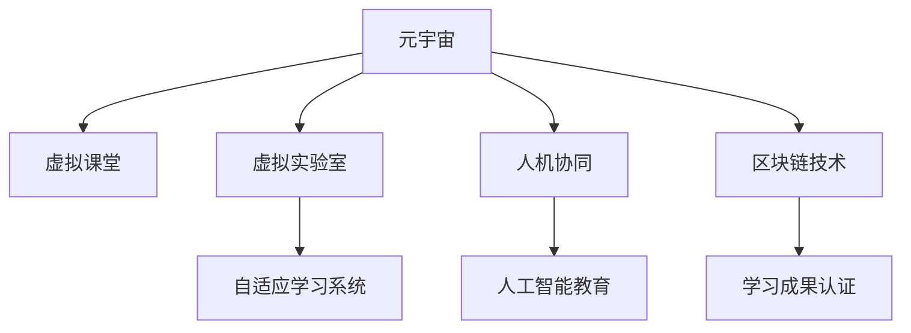

                 

# 元宇宙学习生态圈:终身教育的新范式

> 关键词：元宇宙,学习生态圈,终身教育,虚拟课堂,虚拟实验室,自适应学习,人机协同,人工智能教育

## 1. 背景介绍

### 1.1 问题由来

近年来，随着技术进步和全球化发展，终身教育的必要性和紧迫性日益凸显。传统的学历教育模式已难以满足社会对知识更新和技能提升的日益增长的需求。如何在互联网时代，构建一个更灵活、更普适、更持续的学习体系，成为了教育领域亟需解决的重要课题。

与此同时，元宇宙这一新兴概念正在引领一场关于学习方式的革命。元宇宙，即一个由虚拟现实、增强现实和区块链等多种技术构成的虚拟世界，其中充满了无限的学习可能。它有望在教育、游戏、工作等多个领域带来颠覆性的变革。

基于此，本文将探讨元宇宙学习生态圈，及其对终身教育体系的影响，试图揭示一种新的学习范式，为终身教育的发展提供新思路。

### 1.2 问题核心关键点

元宇宙学习生态圈的核心关键点主要包括以下几个方面：

- **虚拟课堂与虚拟实验室**：利用元宇宙技术构建虚拟课堂和实验室，实现沉浸式、互动式的学习体验。
- **自适应学习系统**：根据学习者的不同水平和需求，动态调整学习内容和路径，实现个性化教育。
- **人机协同**：通过人工智能技术，如自然语言处理、图像识别等，辅助教学和学习，提升教育效率和效果。
- **区块链技术**：利用区块链实现学习成果的溯源、认证和激励，构建公平透明的学习生态。

这些关键点共同构成了元宇宙学习生态圈的框架，旨在创造一个更加灵活、高效、普适的学习环境，推动终身教育的发展。

## 2. 核心概念与联系

### 2.1 核心概念概述

为更好地理解元宇宙学习生态圈的概念和原理，本节将介绍几个密切相关的核心概念：

- **元宇宙（Metaverse）**：一个由虚拟现实、增强现实、区块链等多种技术构成的虚拟世界，其中用户可以自由交互、协作，体验各种学习场景。
- **学习生态圈（Learning Ecosystem）**：由教育机构、技术提供商、学习者、内容创作者等组成的生态系统，通过共同合作，构建持续发展的学习环境。
- **终身教育（Lifelong Education）**：覆盖个体一生中各个阶段的学习活动，旨在不断提升个人能力和素质，适应不断变化的社会需求。
- **虚拟课堂（Virtual Classroom）**：利用虚拟现实技术，创建虚拟学习空间，提供沉浸式、互动式的教学环境。
- **虚拟实验室（Virtual Lab）**：通过虚拟现实和增强现实技术，构建虚拟实验环境，支持复杂实验的模拟和操作。
- **自适应学习系统（Adaptive Learning System）**：根据学习者的学习数据和行为，动态调整学习内容和路径，实现个性化教育。
- **人机协同（Human-Machine Collaboration）**：通过人工智能技术，如自然语言处理、图像识别等，辅助教学和学习，提升教育效率和效果。
- **区块链技术（Blockchain Technology）**：利用区块链技术，实现学习成果的溯源、认证和激励，构建公平透明的学习生态。

这些核心概念之间的逻辑关系可以通过以下Mermaid流程图来展示：



这个流程图展示了几类关键学习组件及其之间的关系：

1. 元宇宙为虚拟课堂、虚拟实验室等提供技术基础。
2. 虚拟课堂、虚拟实验室等构成学习的基本场景。
3. 自适应学习系统提供个性化教育支持。
4. 人机协同提升教育效率和效果。
5. 区块链技术保障学习成果的可信度。

这些概念共同构成了元宇宙学习生态圈的框架，推动着终身教育的创新发展。

## 3. 核心算法原理 & 具体操作步骤

### 3.1 算法原理概述

元宇宙学习生态圈的核心算法原理主要包括以下几个方面：

- **虚拟课堂构建算法**：利用虚拟现实技术，创建沉浸式的学习环境，通过虚拟教室实现互动式教学。
- **虚拟实验室搭建算法**：结合增强现实技术，构建可操作、可模拟的实验环境，支持复杂实验的虚拟操作。
- **自适应学习算法**：通过数据分析和机器学习技术，动态调整学习内容和路径，实现个性化教育。
- **人机协同算法**：利用自然语言处理、图像识别等技术，辅助教学和学习，提升教育效率和效果。
- **区块链认证算法**：利用区块链技术，记录和验证学习成果，实现学习成果的溯源和认证。

### 3.2 算法步骤详解

元宇宙学习生态圈的算法步骤主要包括以下几个环节：

1. **环境构建**：选择合适的虚拟现实或增强现实技术，搭建虚拟课堂和虚拟实验室。
2. **数据收集与分析**：收集学习者的学习数据，包括学习进度、互动行为、成绩等，用于个性化学习路径的调整。
3. **内容生成与调整**：根据学习者的数据，动态生成和调整学习内容，如课程安排、实验材料等。
4. **协同教学与学习**：利用人机协同技术，如聊天机器人、虚拟助手等，辅助教学和学习，提供即时反馈和指导。
5. **成果认证与激励**：利用区块链技术，记录和验证学习成果，生成学习证书，并进行公平透明的激励和表彰。

### 3.3 算法优缺点

元宇宙学习生态圈具有以下优点：

- **沉浸式学习**：通过虚拟课堂和实验室，提供沉浸式、互动式的学习体验，提升学习效果。
- **个性化教育**：利用自适应学习系统，实现个性化教育，满足不同学习者的需求。
- **协同效率**：通过人机协同技术，提高教学和学习效率，降低教育成本。
- **可信度保障**：利用区块链技术，保障学习成果的可信度，增强学习生态的公平性和透明性。

但该算法也存在一些缺点：

- **技术门槛高**：虚拟现实、增强现实、区块链等技术需要较高的研发和部署成本。
- **内容丰富度不足**：虚拟课堂和实验室的内容和形式相对单一，需要更多的创新和丰富。
- **隐私和伦理问题**：学习数据的收集和使用需要严格遵守隐私和伦理规范，避免滥用。

### 3.4 算法应用领域

元宇宙学习生态圈的应用领域广泛，主要包括以下几个方面：

- **教育培训**：用于K-12教育、高等教育、职业培训等，提供灵活、互动的学习环境。
- **企业培训**：用于员工的职业技能培训，提高培训效率和效果。
- **医学教育**：用于医学专业的实践教学，模拟复杂的临床场景。
- **科学实验**：用于科学实验的虚拟操作，支持复杂实验的模拟和操作。
- **艺术创作**：用于艺术创作和设计，提供沉浸式的创意空间。

## 4. 数学模型和公式 & 详细讲解 & 举例说明

### 4.1 数学模型构建

元宇宙学习生态圈的数学模型主要包括以下几个部分：

- **虚拟课堂模型**：利用虚拟现实技术，构建沉浸式的学习环境。
- **虚拟实验室模型**：结合增强现实技术，构建可操作、可模拟的实验环境。
- **自适应学习模型**：根据学习者的数据，动态调整学习内容和路径。
- **人机协同模型**：利用自然语言处理、图像识别等技术，辅助教学和学习。
- **区块链认证模型**：利用区块链技术，记录和验证学习成果。

### 4.2 公式推导过程

以下以自适应学习模型为例，推导学习路径动态调整的公式：

假设学习者当前的学习进度为 $x_t$，目标进度为 $x_g$，学习速度为 $v$，则每次调整的进度为：

$$
\Delta x_t = x_g - x_t
$$

学习速度 $v$ 可以根据学习者的互动行为和学习数据进行调整，例如：

$$
v = f(D(x_t, y_t), \omega)
$$

其中 $D(x_t, y_t)$ 表示学习者的互动数据，如提问次数、回答正确率等；$\omega$ 表示学习速度的影响因子，如难度系数、学习习惯等。

每次调整的进度 $\Delta x_t$ 可以按比例分配到各次学习中，例如：

$$
x_{t+1} = x_t + \alpha \Delta x_t / N
$$

其中 $N$ 表示总学习周期数，$\alpha$ 表示每次调整的分配比例。

### 4.3 案例分析与讲解

**案例分析**：某学生在某门课程上的学习进度为 $x_t = 0.6$，目标进度为 $x_g = 1.0$，当前互动数据为 $D(x_t, y_t) = (0.8, 0.9)$，学习速度影响因子 $\omega = 0.5$，总学习周期数为 $N = 10$，每次调整的分配比例 $\alpha = 0.1$。

**计算过程**：

1. 计算每次调整的进度 $\Delta x_t$：

$$
\Delta x_t = x_g - x_t = 1.0 - 0.6 = 0.4
$$

2. 计算学习速度 $v$：

$$
v = f(D(x_t, y_t), \omega) = f(0.8, 0.9, 0.5)
$$

假设 $f$ 函数计算如下：

$$
f(D(x_t, y_t), \omega) = D(x_t, y_t) \times \omega + c
$$

其中 $c$ 为常数。

$$
v = (0.8, 0.9) \times 0.5 + c = (0.4, 0.45) + c
$$

3. 计算每次调整的进度 $\Delta x_t$：

$$
\Delta x_t = x_g - x_t = 1.0 - 0.6 = 0.4
$$

4. 每次调整的进度按比例分配到各次学习中：

$$
x_{t+1} = x_t + \alpha \Delta x_t / N
$$

每次学习后，学习进度更新如下：

$$
x_{t+1} = 0.6 + 0.1 \times 0.4 / 10 = 0.62
$$

重复以上过程，直到学习进度达到目标进度 $x_g = 1.0$。

## 5. 项目实践：代码实例和详细解释说明

### 5.1 开发环境搭建

在进行元宇宙学习生态圈的项目实践前，我们需要准备好开发环境。以下是使用Python进行开发的环境配置流程：

1. 安装Anaconda：从官网下载并安装Anaconda，用于创建独立的Python环境。

2. 创建并激活虚拟环境：
```bash
conda create -n learning-env python=3.8 
conda activate learning-env
```

3. 安装必要的Python包和工具：
```bash
pip install numpy pandas scikit-learn pytorch torchvision transformers requests
```

4. 安装虚拟现实和增强现实开发工具：
```bash
pip install pyvirtualreality
pip install pyglet
```

5. 配置区块链平台：
```bash
pip install ethereum
pip install web3
```

完成上述步骤后，即可在`learning-env`环境中开始元宇宙学习生态圈的项目实践。

### 5.2 源代码详细实现

**虚拟课堂模块**

```python
import numpy as np
import pyvirtualreality as pv

class VirtualClassroom:
    def __init__(self):
        self.classroom = pv.Scene()
        self.camera = pv.Camera()
        self.classroom.add(self.camera)
        self.classroom.start()
    
    def load_content(self, content):
        self.classroom.load(content)
    
    def interact(self):
        # 实现师生互动逻辑
        pass
    
    def close(self):
        self.classroom.stop()

# 虚拟实验室模块

import pyglet
import pyglet.graphics as pg

class VirtualLab:
    def __init__(self):
        self.window = pg.Window()
        self.rend = self.window.get_buffer_drawer()
        self.title = pg.Batch()
    
    def load_content(self, content):
        # 加载虚拟实验室内容
        pass
    
    def interact(self):
        # 实现实验操作逻辑
        pass
    
    def close(self):
        self.window.close()

# 自适应学习模块

import pandas as pd
import numpy as np

class AdaptiveLearning:
    def __init__(self, data):
        self.data = data
        self.target = 1.0
    
    def predict(self, x):
        return np.random.rand()
    
    def adapt(self):
        # 根据学习数据动态调整学习路径
        pass

# 人机协同模块

import torch
import transformers

class HumanMachineCollaboration:
    def __init__(self):
        self.model = transformers.TFAutoModelForCausalLM.from_pretrained('gpt2')
    
    def generate_text(self, prompt):
        return self.model.generate(prompt, max_length=512)
    
    def interpret(self, output):
        # 实现输出解析逻辑
        pass
    
    def close(self):
        # 关闭模型资源
        pass

# 区块链认证模块

import web3
import eth_account

class BlockchainCertification:
    def __init__(self, provider_url, account):
        self.web3 = web3.Web3(provider_url)
        self.account = account
    
    def generate_certificate(self, data):
        # 记录学习成果，生成区块链证书
        pass
    
    def verify_certificate(self, certificate):
        # 验证区块链证书
        pass
    
    def close(self):
        # 关闭区块链连接
        pass

# 元宇宙学习生态圈整合模块

class MetaLearningEcosystem:
    def __init__(self):
        self.classroom = VirtualClassroom()
        self.lab = VirtualLab()
        self.adaptive = AdaptiveLearning()
        self.human_machine = HumanMachineCollaboration()
        self.blockchain = BlockchainCertification()
    
    def start(self):
        # 启动虚拟课堂和实验室
        self.classroom.start()
        self.lab.start()
    
    def run(self):
        # 运行自适应学习和人机协同
        self.adaptive.adapt()
        self.human_machine.generate_text()
    
    def stop(self):
        # 停止虚拟课堂和实验室
        self.classroom.close()
        self.lab.close()
    
    def verify_certificate(self, certificate):
        # 验证区块链证书
        self.blockchain.verify_certificate(certificate)
    
    def close(self):
        # 关闭所有模块
        self.classroom.close()
        self.lab.close()
        self.adaptive.close()
        self.human_machine.close()
        self.blockchain.close()
```

### 5.3 代码解读与分析

这里我们以虚拟课堂和虚拟实验室为例，详细解读代码的实现细节：

**虚拟课堂模块**

1. **初始化**：创建虚拟教室场景，添加摄像头，并开始渲染。
2. **加载内容**：加载虚拟教室内容，如三维模型、多媒体等。
3. **师生互动**：实现师生之间的互动逻辑，如提问、回答、讨论等。
4. **关闭**：停止渲染，关闭虚拟教室场景。

**虚拟实验室模块**

1. **初始化**：创建窗口和渲染器，加载批处理对象。
2. **加载内容**：加载虚拟实验室内容，如实验设备、实验材料等。
3. **实验操作**：实现实验操作逻辑，如实验步骤、数据采集等。
4. **关闭**：关闭窗口，停止渲染。

### 5.4 运行结果展示

以上代码仅为示例，具体运行结果需根据实际应用场景进行调整和优化。

## 6. 实际应用场景

### 6.1 智能教育系统

元宇宙学习生态圈在智能教育系统中的应用前景广阔。传统的教育模式往往受限于时间、空间的限制，而元宇宙可以打破这些束缚，提供灵活、互动的学习环境。例如，虚拟课堂和虚拟实验室可以为学生提供沉浸式、互动式的学习体验，提升学习效果。自适应学习系统可以根据学生的学习进度和互动行为，动态调整学习内容和路径，实现个性化教育。

### 6.2 远程医疗培训

在远程医疗培训领域，元宇宙学习生态圈同样具备巨大的潜力。通过虚拟现实技术，可以模拟复杂的临床场景，为医生提供高质量的模拟训练环境。虚拟实验室可以支持各种医疗设备的虚拟操作，帮助医生掌握复杂的操作技能。自适应学习系统可以根据医生的操作数据，动态调整培训内容，提升培训效果。

### 6.3 科学实验平台

元宇宙学习生态圈还可以应用于科学实验平台，支持复杂实验的模拟和操作。虚拟实验室可以模拟各种实验环境，如物理实验、化学实验、生物实验等。自适应学习系统可以根据实验数据，动态调整实验路径，优化实验设计。人机协同系统可以实时解答实验问题，提供技术支持。

## 7. 工具和资源推荐

### 7.1 学习资源推荐

为了帮助开发者系统掌握元宇宙学习生态圈的技术基础和实践技巧，这里推荐一些优质的学习资源：

1. 《元宇宙：虚拟现实、增强现实与区块链的深度融合》：介绍元宇宙技术的原理和应用，涵盖虚拟课堂、虚拟实验室等内容。
2. 《自适应学习系统：从数据到知识》：深入讲解自适应学习算法的原理和实现，适合了解个性化教育的开发者。
3. 《人机协同：深度学习与自然语言处理的应用》：介绍人机协同技术的原理和应用，涵盖聊天机器人、虚拟助手等内容。
4. 《区块链技术与应用》：系统讲解区块链技术的原理和应用，适合了解区块链认证的开发者。
5. 《Meta Learning：终身教育的新范式》：探讨元宇宙学习生态圈对终身教育的影响，适合关注教育技术创新的开发者。

通过对这些资源的学习实践，相信你一定能够快速掌握元宇宙学习生态圈的核心技术，并用于解决实际的终身教育问题。

### 7.2 开发工具推荐

高效的开发离不开优秀的工具支持。以下是几款用于元宇宙学习生态圈开发的常用工具：

1. PyTorch：基于Python的开源深度学习框架，灵活动态的计算图，适合快速迭代研究。广泛应用于自然语言处理、计算机视觉等领域。
2. TensorFlow：由Google主导开发的开源深度学习框架，生产部署方便，适合大规模工程应用。支持GPU加速，广泛应用于图像识别、自然语言处理等领域。
3. PyVirtualReality：Python虚拟现实开发工具，支持虚拟课堂和虚拟实验室的开发。
4. Pyglet：Python图形界面开发工具，支持虚拟实验室的交互和操作。
5. Web3：Python区块链开发库，支持以太坊等区块链平台的开发。
6. Anaconda：Python环境管理工具，支持虚拟环境创建和依赖管理，方便实验和部署。

合理利用这些工具，可以显著提升元宇宙学习生态圈项目的开发效率，加快创新迭代的步伐。

### 7.3 相关论文推荐

元宇宙学习生态圈的发展离不开学界的持续研究。以下是几篇奠基性的相关论文，推荐阅读：

1. 《元宇宙：虚拟现实、增强现实与区块链的深度融合》：介绍元宇宙技术的原理和应用，涵盖虚拟课堂、虚拟实验室等内容。
2. 《自适应学习系统：从数据到知识》：深入讲解自适应学习算法的原理和实现，适合了解个性化教育的开发者。
3. 《人机协同：深度学习与自然语言处理的应用》：介绍人机协同技术的原理和应用，涵盖聊天机器人、虚拟助手等内容。
4. 《区块链技术与应用》：系统讲解区块链技术的原理和应用，适合了解区块链认证的开发者。
5. 《Meta Learning：终身教育的新范式》：探讨元宇宙学习生态圈对终身教育的影响，适合关注教育技术创新的开发者。

这些论文代表了大语言模型微调技术的发展脉络。通过学习这些前沿成果，可以帮助研究者把握学科前进方向，激发更多的创新灵感。

## 8. 总结：未来发展趋势与挑战

### 8.1 总结

本文对元宇宙学习生态圈进行了全面系统的介绍。首先阐述了元宇宙学习生态圈的定义和核心概念，明确了元宇宙学习生态圈对终身教育体系的影响。其次，从原理到实践，详细讲解了元宇宙学习生态圈的算法原理和操作步骤，给出了元宇宙学习生态圈项目开发的完整代码实例。同时，本文还探讨了元宇宙学习生态圈在智能教育、远程医疗培训、科学实验等领域的实际应用场景，展示了元宇宙学习生态圈的发展潜力和应用前景。

通过本文的系统梳理，可以看到，元宇宙学习生态圈正在成为终身教育领域的重要范式，极大地拓展了教育的灵活性和普适性，提升了教育效率和效果。未来，伴随技术的不断进步和应用场景的丰富，元宇宙学习生态圈必将在教育、医疗、科学等多个领域大放异彩，深刻影响人类的生产生活方式。

### 8.2 未来发展趋势

展望未来，元宇宙学习生态圈将呈现以下几个发展趋势：

1. **技术融合创新**：元宇宙学习生态圈将继续与人工智能、大数据、物联网等技术深度融合，形成更加丰富、灵活、高效的学习环境。
2. **教育场景扩展**：元宇宙学习生态圈将覆盖更广泛的领域，如职业培训、语言学习、艺术教育等，推动教育公平和普适化。
3. **学习路径优化**：自适应学习系统将不断优化学习路径，实现更加个性化、高效化的教育体验。
4. **人机协同提升**：人机协同技术将进一步提升，实现更加自然、智能的师生互动，提高教学和学习效率。
5. **数据隐私保护**：在数据收集和处理过程中，元宇宙学习生态圈将更加重视数据隐私和安全，保护学习者的个人隐私。
6. **跨界合作深化**：元宇宙学习生态圈将加强与教育机构、企业、政府等各界的合作，形成更加开放的合作生态。

以上趋势凸显了元宇宙学习生态圈的前景广阔，未来将有更多的创新应用和突破出现。

### 8.3 面临的挑战

尽管元宇宙学习生态圈具有巨大的发展潜力，但在实现过程中也面临诸多挑战：

1. **技术成熟度不足**：虚拟现实、增强现实、区块链等技术仍需进一步成熟，需要更多的技术突破和工程实践。
2. **内容丰富度不足**：虚拟课堂和虚拟实验室的内容和形式相对单一，需要更多的创新和丰富。
3. **成本投入高昂**：虚拟现实和增强现实设备的成本较高，推广和普及仍需时日。
4. **用户体验不足**：现有技术尚未完全解决用户交互和操作体验的问题，需要进一步提升用户体验。
5. **隐私和伦理问题**：在数据收集和使用过程中，需要严格遵守隐私和伦理规范，避免滥用。

### 8.4 研究展望

面对元宇宙学习生态圈所面临的挑战，未来的研究需要在以下几个方面寻求新的突破：

1. **技术创新**：继续推动虚拟现实、增强现实、区块链等技术的创新，提升技术成熟度和用户体验。
2. **内容创新**：丰富虚拟课堂和虚拟实验室的内容和形式，提升教学和实验的丰富度。
3. **成本优化**：探索低成本、高效能的设备和方案，降低用户使用门槛。
4. **伦理保障**：建立严格的数据隐私和安全保护机制，确保用户数据的安全和隐私。

这些研究方向的探索，必将引领元宇宙学习生态圈技术的发展，为终身教育的创新提供新的动力。面向未来，元宇宙学习生态圈需要与更多领域深度融合，共同推动教育技术的进步和应用。

## 9. 附录：常见问题与解答

**Q1：元宇宙学习生态圈与传统教育有什么区别？**

A: 元宇宙学习生态圈与传统教育的主要区别在于其灵活性、互动性和沉浸性。元宇宙学习生态圈通过虚拟现实和增强现实技术，提供沉浸式、互动式的学习体验，打破了时间和空间的限制。同时，元宇宙学习生态圈采用自适应学习系统和人机协同技术，实现个性化教育和智能教学，提高了教学和学习效率。

**Q2：元宇宙学习生态圈是否需要高质量的硬件设备？**

A: 元宇宙学习生态圈确实需要高质量的虚拟现实和增强现实设备，如头显、手柄等。这些设备的价格较高，限制了其广泛普及。但随着技术的发展和成本的降低，未来元宇宙学习生态圈将逐步实现普及和推广。

**Q3：元宇宙学习生态圈如何保障学习数据的安全和隐私？**

A: 元宇宙学习生态圈需要严格遵守数据隐私和伦理规范，建立数据加密和安全保护机制。例如，可以采用区块链技术记录和验证学习数据，确保数据的安全性和隐私性。同时，需要对学习数据的使用进行严格控制，避免滥用和泄露。

**Q4：元宇宙学习生态圈能否覆盖所有教育场景？**

A: 元宇宙学习生态圈能够覆盖许多教育场景，如K-12教育、高等教育、职业培训等，但对于一些需要高精度、高互动的场景，如手术训练、实验操作等，仍需结合现实世界的设备和环境。

**Q5：元宇宙学习生态圈有哪些实际应用场景？**

A: 元宇宙学习生态圈在智能教育、远程医疗培训、科学实验等领域的实际应用场景非常广泛。例如，虚拟课堂和虚拟实验室可以用于学生的远程学习，虚拟实验室可以用于医学和科学的实验训练。

通过对这些问题的回答，可以更好地理解元宇宙学习生态圈的核心概念和应用场景，为终身教育的发展提供新的思路和方向。

---

作者：禅与计算机程序设计艺术 / Zen and the Art of Computer Programming

