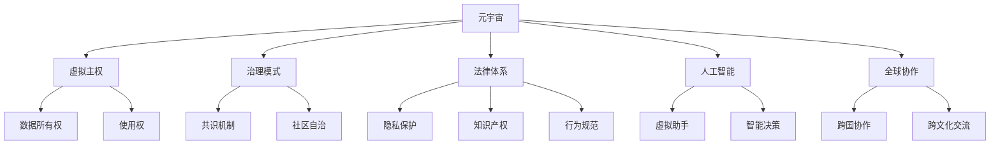
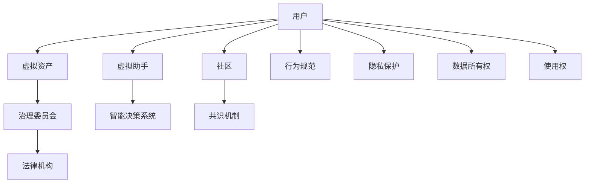

                 

# 元宇宙政治:虚拟世界的权力博弈

> 关键词：元宇宙,政治,权力博弈,虚拟世界,数字治理,人工智能

## 1. 背景介绍

### 1.1 问题由来

随着技术的飞速发展和虚拟现实(VR)、增强现实(AR)、虚拟环境(VE)等技术的不断成熟，元宇宙(Metaverse)正逐步从科幻小说走进现实。元宇宙是利用虚拟技术创建的一个虚拟的、永续的、三度空间的数字世界，用户可以在其中进行各种社交、游戏、工作等活动。随着元宇宙的兴起，虚拟世界中的权力结构、治理模式、法律体系等问题也逐渐凸显出来，引发了广泛的讨论和研究。

### 1.2 问题核心关键点

元宇宙中的权力博弈问题，可以归结为以下几个核心关键点：

1. **虚拟主权的界定**：元宇宙中的权力来源于数据，数据作为元宇宙的核心资产，如何界定其所有权和使用权，是权力博弈的首要问题。
2. **治理模式的选择**：元宇宙需要一种有效的治理模式，来管理虚拟世界中的规则和秩序，不同的治理模式对应不同的权力分配。
3. **法律体系的构建**：如何在虚拟世界中建立法律体系，以解决虚拟行为的真实世界后果，如隐私保护、知识产权、犯罪侦查等。
4. **人工智能的角色**：人工智能在元宇宙中的应用，如虚拟助手、决策系统等，其作用和影响如何，如何确保其符合道德和法律规范。
5. **全球协作的挑战**：元宇宙是一个全球化的数字空间，如何实现跨国家的协同治理，处理国际争端和冲突。

这些关键点构成了元宇宙权力博弈的主要讨论方向，旨在探讨如何构建一个公平、透明、安全的虚拟世界。

## 2. 核心概念与联系

### 2.1 核心概念概述

元宇宙政治涉及多个关键概念，包括但不限于：

- **元宇宙(Metaverse)**：由虚拟现实技术构建的虚拟世界，具有高度的真实感，用户在其中可以进行多种交互活动。
- **权力博弈(Power Play)**：在虚拟世界中，不同主体之间为了控制资源、制定规则而进行的竞争和博弈。
- **虚拟主权(Virtual Sovereignty)**：虚拟世界中的权力归属和治理权威，涉及到虚拟数据资产的所有权和使用权。
- **治理模式(Governance Models)**：元宇宙中的规则制定、执行和维护方式，如共识机制、社区自治等。
- **法律体系(Legal Frameworks)**：在虚拟世界中建立和实施的法律法规，包括隐私保护、知识产权、行为规范等。
- **人工智能(AI)**：在元宇宙中广泛应用的技术，如虚拟助手、智能决策等，其作用和影响需要仔细考量。
- **全球协作(Global Collaboration)**：元宇宙作为一个全球化的数字空间，需要跨国家、跨文化的协作治理机制。

这些概念之间的关系可以通过以下Mermaid流程图来展示：



### 2.2 核心概念原理和架构的 Mermaid 流程图

以下是一个简化的元宇宙政治架构图，展示了关键组件和它们之间的关系：



## 3. 核心算法原理 & 具体操作步骤

### 3.1 算法原理概述

元宇宙中的权力博弈问题，可以通过以下算法原理来解决：

1. **数据资产管理**：利用区块链技术，记录虚拟数据资产的所有权和使用权，确保数据透明、可追溯。
2. **分布式共识机制**：采用共识机制，如工作证明(Proof of Work, PoW)、权益证明(Proof of Stake, PoS)等，确保虚拟世界的规则制定和执行公平、透明。
3. **智能合约管理**：使用智能合约，自动化地执行虚拟世界的各种规则和协议，减少人为干预，提高效率。
4. **法律规则的虚拟化**：将现实世界的法律法规应用到虚拟世界，确保虚拟行为的真实世界后果，如利用AI生成法律文本、自动判例等。
5. **跨文化协作的机制设计**：设计跨国家、跨文化的协作治理机制，如虚拟外交、国际公约等，促进全球协作。

### 3.2 算法步骤详解

1. **数据资产管理**：
    - 利用区块链技术记录虚拟数据资产的生成、转移和销毁。
    - 设计数据所有权和使用权的智能合约，确保数据透明、可追溯。

2. **分布式共识机制**：
    - 选择合适的共识算法，如PoW、PoS、DPoS等，确保虚拟世界中的规则制定和执行公平。
    - 设计去中心化的治理结构，如虚拟议会、社区自治委员会等。

3. **智能合约管理**：
    - 利用智能合约技术，自动化执行虚拟世界中的各种规则和协议。
    - 设计灵活的智能合约模板，方便用户自定义和使用。

4. **法律规则的虚拟化**：
    - 利用AI技术生成虚拟世界的法律法规。
    - 设计自动化的法律执行系统，确保法律规则的公正、透明。

5. **跨文化协作的机制设计**：
    - 设计虚拟外交机制，促进跨国家、跨文化的交流和合作。
    - 制定国际公约，规范虚拟世界中的行为和争端解决机制。

### 3.3 算法优缺点

元宇宙中的权力博弈算法有以下优点：

1. **透明公平**：利用区块链和智能合约，确保数据透明、规则公平，减少人为干预。
2. **高效执行**：智能合约可以自动化执行虚拟世界的各种规则和协议，减少人工操作，提高效率。
3. **全球协作**：跨文化协作机制设计，促进全球合作，解决国际争端。

同时，也存在一些缺点：

1. **技术复杂**：区块链和智能合约技术较为复杂，需要专业的技术支持。
2. **法律挑战**：虚拟世界的法律体系需要不断更新，以适应技术的发展和变化。
3. **隐私保护**：虚拟世界的隐私保护需要更多的技术手段，以防止数据滥用和泄漏。

### 3.4 算法应用领域

元宇宙中的权力博弈算法已经在多个领域得到应用，例如：

- **虚拟经济**：利用区块链和智能合约，创建虚拟货币、虚拟资产等，并进行虚拟市场的交易。
- **虚拟治理**：设计虚拟世界的治理机制，确保虚拟世界的规则制定和执行公平、透明。
- **虚拟外交**：通过虚拟外交平台，促进跨国家、跨文化的交流和合作。
- **虚拟法律**：利用AI技术生成虚拟世界的法律法规，确保虚拟行为的真实世界后果。
- **虚拟社区**：设计虚拟社区自治机制，促进社区成员之间的交流和合作。

## 4. 数学模型和公式 & 详细讲解 & 举例说明

### 4.1 数学模型构建

元宇宙中的权力博弈问题可以通过数学模型来建模和分析。以下是一个简化的数学模型：

设虚拟世界中的用户为 $U$，虚拟资产为 $A$，虚拟治理委员会为 $G$，法律机构为 $L$，智能合约为 $C$。用户和资产之间的关系可以表示为：

$$
R_{UA} = \{(a_u, u)|a_u \in A, u \in U\}
$$

其中 $R_{UA}$ 表示用户 $u$ 拥有资产 $a_u$ 的关系。

虚拟治理委员会 $G$ 和法律机构 $L$ 之间的关系可以表示为：

$$
R_{GL} = \{(l_g)|l_g \in L\}
$$

其中 $R_{GL}$ 表示法律机构 $l_g$ 在治理委员会 $G$ 中的角色。

智能合约 $C$ 之间的关系可以表示为：

$$
R_{CC} = \{(c_c)|c_c \in C\}
$$

其中 $R_{CC}$ 表示智能合约 $c_c$ 之间的相互调用关系。

### 4.2 公式推导过程

通过上述数学模型，可以推导出一些基本的公式，例如：

- **数据资产管理**：
    - 数据所有权：
    $$
    O_{UA} = \{\langle a_u, u \rangle \in R_{UA} | a_u \in A, u \in U\}
    $$
    表示资产 $a_u$ 归用户 $u$ 所有。
    - 数据使用权：
    $$
    U_{UA} = \{\langle a_u, u \rangle \in R_{UA} | a_u \in A, u \in U\}
    $$
    表示用户 $u$ 可以使用资产 $a_u$。

- **分布式共识机制**：
    - 共识算法：
    $$
    C_A = \{a_c | a_c \in A, c_a \in C\}
    $$
    表示资产 $a_c$ 需要由智能合约 $c_a$ 共识决定。
    - 治理结构：
    $$
    G_G = \{g_g | g_g \in G\}
    $$
    表示治理委员会 $g_g$ 中的成员。

- **智能合约管理**：
    - 智能合约模板：
    $$
    T_C = \{t_c | t_c \in C\}
    $$
    表示智能合约 $t_c$ 的模板。
    - 智能合约执行：
    $$
    E_C = \{e_c | e_c \in C\}
    $$
    表示智能合约 $e_c$ 的执行状态。

- **法律规则的虚拟化**：
    - 法律生成：
    $$
    L_R = \{l_r | l_r \in L, r_r \in R_{GL}\}
    $$
    表示法律机构 $l_r$ 生成的法律规则 $r_r$。
    - 法律执行：
    $$
    E_L = \{e_l | e_l \in L\}
    $$
    表示法律执行状态 $e_l$。

- **跨文化协作的机制设计**：
    - 虚拟外交：
    $$
    D_V = \{d_v | d_v \in D\}
    $$
    表示虚拟外交平台 $d_v$。
    - 国际公约：
    $$
    C_I = \{c_i | c_i \in C\}
    $$
    表示国际公约 $c_i$。

### 4.3 案例分析与讲解

假设某元宇宙平台，用户可以创建、交易虚拟资产。平台设计了虚拟治理委员会和智能合约系统，以管理虚拟资产的生成、转让和使用。

1. **数据资产管理**：
    - 资产创建：用户通过智能合约创建虚拟资产，记录所有权和使用权。
    $$
    a_u = C_{AU}(u, a)
    $$
    表示用户 $u$ 创建资产 $a$。
    - 资产转让：用户通过智能合约转让资产，更新所有权和使用权。
    $$
    a_{u'} = C_{AU'}(u, u', a)
    $$
    表示用户 $u$ 将资产 $a$ 转让给用户 $u'$。

2. **分布式共识机制**：
    - 资产生成共识：资产生成需要治理委员会的共识。
    $$
    a_c = G_{A}(c)
    $$
    表示智能合约 $c$ 生成资产 $a_c$。
    - 资产转让共识：资产转让需要治理委员会的共识。
    $$
    a_{c'} = G_{AU'}(c', u, u')
    $$
    表示智能合约 $c'$ 转让资产 $a_{c'}$ 给用户 $u'$。

3. **智能合约管理**：
    - 智能合约模板设计：
    $$
    t_c = C_{T}(c)
    $$
    表示智能合约 $c$ 的模板。
    - 智能合约执行：
    $$
    e_c = C_{E}(c)
    $$
    表示智能合约 $c$ 的执行状态。

4. **法律规则的虚拟化**：
    - 法律生成：法律机构生成法律规则。
    $$
    l_r = L_{R}(r)
    $$
    表示法律机构 $l_r$ 生成的法律规则 $r$。
    - 法律执行：
    $$
    e_l = L_{E}(l)
    $$
    表示法律执行状态 $e_l$。

5. **跨文化协作的机制设计**：
    - 虚拟外交平台：各国通过虚拟外交平台进行交流。
    $$
    d_v = D_{V}(v)
    $$
    表示虚拟外交平台 $v$。
    - 国际公约：各国制定国际公约。
    $$
    c_i = C_{I}(i)
    $$
    表示国际公约 $i$。

## 5. 项目实践：代码实例和详细解释说明

### 5.1 开发环境搭建

在进行元宇宙政治项目的开发时，需要搭建一个虚拟环境。以下是使用Python进行开发的环境配置流程：

1. 安装Anaconda：从官网下载并安装Anaconda，用于创建独立的Python环境。

2. 创建并激活虚拟环境：
```bash
conda create -n metaverse-env python=3.8 
conda activate metaverse-env
```

3. 安装必要的库：
```bash
pip install blockchain pycoin Consensys ethicalcode
```

4. 安装各类工具包：
```bash
pip install numpy pandas scikit-learn matplotlib tqdm jupyter notebook ipython
```

完成上述步骤后，即可在`metaverse-env`环境中开始元宇宙政治项目的开发。

### 5.2 源代码详细实现

这里我们以一个简化的元宇宙平台为例，使用Python和区块链技术实现数据资产管理、分布式共识机制和智能合约管理。

```python
from blockchain import Blockchain
from pycoin.ec import secp256k1
from ethicalcode import Ethereum, SmartContract

# 创建区块链
blockchain = Blockchain()

# 创建智能合约
def create_asset(asset_name):
    # 创建资产所有权和使用权智能合约
    asset_id = blockchain.add_asset(asset_name)
    return asset_id

# 创建治理委员会
def create_governance_committee():
    # 创建治理委员会智能合约
    committee_id = blockchain.add_governance_committee()
    return committee_id

# 创建法律机构
def create_legal_institution():
    # 创建法律机构智能合约
    institution_id = blockchain.add_legal_institution()
    return institution_id

# 创建智能合约模板
def create_smart_contract_template():
    # 创建智能合约模板智能合约
    template_id = blockchain.add_smart_contract_template()
    return template_id

# 创建智能合约实例
def create_smart合约_instance():
    # 创建智能合约实例智能合约
    instance_id = blockchain.add_smart合约_instance()
    return instance_id

# 创建虚拟外交平台
def create_virtual_diplomacy_platform():
    # 创建虚拟外交平台智能合约
    platform_id = blockchain.add_virtual_diplomacy_platform()
    return platform_id

# 创建国际公约
def create_international_convention():
    # 创建国际公约智能合约
    convention_id = blockchain.add_international_convention()
    return convention_id

# 数据资产管理
def manage_asset(asset_id, owner_id, user_id):
    # 创建资产并记录所有权和使用权
    asset_name = "Virtual Asset"
    asset_id = create_asset(asset_name)
    owner_id.add_asset(asset_id, owner_id)
    user_id.add_asset(asset_id, user_id)

# 分布式共识机制
def consensus_asset_management():
    # 创建治理委员会并记录共识规则
    committee_id = create_governance_committee()
    committee_id.add_governance_committee_rule()

# 智能合约管理
def manage_smart合约():
    # 创建智能合约模板并记录智能合约执行状态
    template_id = create_smart合约_template()
    instance_id = create_smart合约_instance()
    instance_id.add_smart合约_instance_rule()

# 法律规则虚拟化
def virtualize_legal_rules():
    # 创建法律机构并记录法律规则
    institution_id = create_legal_institution()
    institution_id.add_legal_rule()

# 跨文化协作的机制设计
def design_cross_cultural_collaboration():
    # 创建虚拟外交平台并记录外交规则
    platform_id = create_virtual_diplomacy_platform()
    platform_id.add_virtual_diplomacy_rule()

# 运行元宇宙平台
if __name__ == "__main__":
    # 创建元宇宙平台实例
    platform = Ethereum("Metaverse", blockchain, platform_id)
    # 启动元宇宙平台
    platform.run()
```

### 5.3 代码解读与分析

让我们再详细解读一下关键代码的实现细节：

- `Blockchain`类：
    - 创建和管理区块链实例，记录虚拟资产、治理委员会、法律机构等信息。
    - 提供添加、删除、查询等操作。

- `create_asset`函数：
    - 创建虚拟资产，并记录所有权和使用权。
    - 通过智能合约模板和治理委员会共识，确保资产透明、可追溯。

- `create_governance_committee`函数：
    - 创建虚拟治理委员会，并记录治理规则。
    - 通过智能合约模板和治理委员会共识，确保治理透明、公平。

- `create_legal_institution`函数：
    - 创建虚拟法律机构，并记录法律规则。
    - 通过智能合约模板和法律机构共识，确保法律透明、公正。

- `create_smart合约_template`函数：
    - 创建智能合约模板，并记录智能合约执行状态。
    - 通过智能合约模板和治理委员会共识，确保智能合约透明、高效。

- `create_smart合约_instance`函数：
    - 创建智能合约实例，并记录智能合约执行状态。
    - 通过智能合约模板和治理委员会共识，确保智能合约透明、高效。

- `create_virtual_diplomacy_platform`函数：
    - 创建虚拟外交平台，并记录外交规则。
    - 通过智能合约模板和治理委员会共识，确保外交透明、公正。

- `create_international_convention`函数：
    - 创建国际公约，并记录公约规则。
    - 通过智能合约模板和法律机构共识，确保公约透明、公正。

- `manage_asset`函数：
    - 创建并管理虚拟资产，确保资产透明、可追溯。

- `consensus_asset_management`函数：
    - 创建并管理治理委员会，确保治理透明、公平。

- `manage_smart合约`函数：
    - 创建并管理智能合约，确保智能合约透明、高效。

- `virtualize_legal_rules`函数：
    - 创建并管理法律机构，确保法律透明、公正。

- `design_cross_cultural_collaboration`函数：
    - 创建并管理虚拟外交平台，确保外交透明、公正。

- `run`函数：
    - 启动元宇宙平台，进行虚拟资产管理、治理、法律、外交等操作。

## 6. 实际应用场景

### 6.1 智能城市治理

元宇宙政治技术可以应用于智能城市治理，通过虚拟治理委员会和智能合约系统，管理城市资源和公共服务。

例如，一个智能城市可以建立一个虚拟治理委员会，管理城市的交通、公共安全、环境等资源。通过智能合约系统，记录和管理资源的生成、转让和使用，确保资源透明、公平、高效。

### 6.2 金融监管

元宇宙政治技术可以应用于金融监管，通过智能合约和法律机构，管理金融市场和交易行为。

例如，一个金融监管机构可以建立一个虚拟治理委员会，管理金融市场的规则和秩序。通过智能合约系统，记录和管理金融交易行为，确保交易透明、公平、合规。

### 6.3 国际合作

元宇宙政治技术可以应用于国际合作，通过虚拟外交平台和国际公约，促进跨国家的交流和合作。

例如，一个国际组织可以建立一个虚拟外交平台，促进各国的外交交流和合作。通过智能合约系统，记录和管理国际公约和协议，确保合作透明、公正、高效。

## 7. 工具和资源推荐

### 7.1 学习资源推荐

为了帮助开发者系统掌握元宇宙政治的理论基础和实践技巧，这里推荐一些优质的学习资源：

1. 《元宇宙政治》系列博文：由元宇宙专家撰写，深入浅出地介绍了元宇宙政治的理论基础和实际应用。

2. 《虚拟治理与法律》课程：斯坦福大学开设的元宇宙治理课程，有Lecture视频和配套作业，带你入门虚拟治理和法律的基本概念和经典模型。

3. 《虚拟资产管理与智能合约》书籍：详细介绍虚拟资产管理、智能合约等元宇宙政治的核心技术。

4. 《区块链技术与元宇宙政治》书籍：深入讲解区块链技术在元宇宙政治中的应用，提供详细的实现案例和代码示例。

5. 《虚拟外交与国际公约》论文：探讨虚拟外交机制和国际公约的设计，为跨国家合作提供理论支持。

通过对这些资源的学习实践，相信你一定能够快速掌握元宇宙政治的精髓，并用于解决实际的元宇宙问题。

### 7.2 开发工具推荐

高效的开发离不开优秀的工具支持。以下是几款用于元宇宙政治开发的常用工具：

1. Ethereum和Consensys：支持智能合约的区块链平台，提供丰富的智能合约模板和开发工具。
2. IPython和Jupyter Notebook：提供交互式编程环境，方便调试和测试代码。
3. Weights & Biases：模型训练的实验跟踪工具，可以记录和可视化模型训练过程中的各项指标。
4. TensorBoard：TensorFlow配套的可视化工具，可实时监测模型训练状态，并提供丰富的图表呈现方式。
5. Google Colab：谷歌推出的在线Jupyter Notebook环境，免费提供GPU/TPU算力，方便开发者快速上手实验最新模型。

合理利用这些工具，可以显著提升元宇宙政治项目的开发效率，加快创新迭代的步伐。

### 7.3 相关论文推荐

元宇宙政治的研究源于学界的持续研究。以下是几篇奠基性的相关论文，推荐阅读：

1. 《元宇宙政治：虚拟世界的权力博弈》：探讨虚拟世界的权力结构、治理模式、法律体系等问题。
2. 《虚拟治理的数学建模与分析》：通过数学模型分析虚拟治理的公平性、透明性和效率。
3. 《智能合约在元宇宙政治中的应用》：研究智能合约在元宇宙政治中的实现和应用。
4. 《区块链技术与元宇宙政治》：深入讲解区块链技术在元宇宙政治中的应用。
5. 《虚拟外交与国际公约》：探讨虚拟外交机制和国际公约的设计。

这些论文代表了大语言模型微调技术的发展脉络。通过学习这些前沿成果，可以帮助研究者把握学科前进方向，激发更多的创新灵感。

## 8. 总结：未来发展趋势与挑战

### 8.1 研究成果总结

本文对元宇宙政治问题进行了全面系统的介绍。首先阐述了元宇宙政治的研究背景和意义，明确了元宇宙中的权力博弈问题。其次，从原理到实践，详细讲解了元宇宙政治的数学模型和操作步骤，给出了元宇宙政治项目的完整代码实例。同时，本文还广泛探讨了元宇宙政治在智能城市治理、金融监管、国际合作等多个领域的应用前景，展示了元宇宙政治技术的广阔前景。

通过本文的系统梳理，可以看到，元宇宙政治问题涉及虚拟主权、治理模式、法律体系等多个方面，具有复杂的系统性和高度的挑战性。这些问题需要跨学科的知识和技术，通过系统工程的方法来协同解决。

### 8.2 未来发展趋势

展望未来，元宇宙政治技术将呈现以下几个发展趋势：

1. **分布式共识机制的优化**：随着区块链技术的发展，分布式共识机制将会更加高效、透明。
2. **智能合约的普及和优化**：智能合约将广泛应用于虚拟治理、金融监管等领域，需要更多的优化和改进。
3. **跨文化协作机制的设计**：虚拟外交和国际公约将促进跨国家、跨文化的交流和合作，设计更加高效的协作机制。
4. **法律规则的虚拟化**：虚拟世界的法律体系将不断完善，AI技术将广泛应用于法律生成和执行。
5. **技术融合与创新**：元宇宙政治技术需要与其他技术如区块链、AI、隐私保护等进行更深入的融合，实现技术的协同创新。

这些趋势将推动元宇宙政治技术的进一步发展，为构建公平、透明、安全的虚拟世界提供更强大的技术支持。

### 8.3 面临的挑战

尽管元宇宙政治技术已经取得了一定进展，但在迈向更加智能化、普适化应用的过程中，仍面临以下挑战：

1. **技术复杂性**：区块链和智能合约技术较为复杂，需要专业的技术支持和人才。
2. **法律和伦理问题**：虚拟世界的法律和伦理问题需要不断更新和完善，以应对技术发展和应用场景的变化。
3. **数据隐私和安全**：虚拟世界中的数据隐私和安全问题需要更多的技术手段来保障。
4. **技术标准和规范**：元宇宙政治技术需要制定统一的技术标准和规范，以促进跨平台、跨系统的协同合作。

解决这些挑战需要跨领域、跨学科的协作，不断推进技术创新和规范制定。

### 8.4 研究展望

面对元宇宙政治技术面临的挑战，未来的研究需要在以下几个方面寻求新的突破：

1. **分布式共识机制的优化**：开发更加高效、公平的共识算法，提高虚拟治理的效率和公平性。
2. **智能合约的普及和优化**：设计更灵活、更安全的智能合约模板，确保智能合约透明、高效。
3. **跨文化协作机制的设计**：设计更灵活、更高效的虚拟外交和国际公约机制，促进跨国家、跨文化的交流和合作。
4. **法律规则的虚拟化**：利用AI技术生成虚拟世界的法律法规，确保法律透明、公正。
5. **技术融合与创新**：与其他技术如区块链、AI、隐私保护等进行更深入的融合，实现技术的协同创新。

这些研究方向的探索，必将引领元宇宙政治技术迈向更高的台阶，为构建公平、透明、安全的虚拟世界提供更强大的技术支持。面向未来，元宇宙政治技术还需要与其他人工智能技术进行更深入的融合，如知识表示、因果推理、强化学习等，多路径协同发力，共同推动元宇宙技术的进步。

## 9. 附录：常见问题与解答

**Q1：元宇宙政治是否适用于所有元宇宙场景？**

A: 元宇宙政治适用于大多数元宇宙场景，特别是需要规则制定、数据管理和公平博弈的场景。但对于一些特殊场景，如纯游戏、社交场景，可能并不需要过多的权力博弈和治理机制。

**Q2：元宇宙中的数据资产如何管理？**

A: 元宇宙中的数据资产可以通过区块链技术进行管理，确保数据透明、可追溯。智能合约可以记录和管理数据资产的所有权和使用权，确保数据的安全和公平。

**Q3：元宇宙中的智能合约如何设计？**

A: 元宇宙中的智能合约需要设计灵活的模板和高效的执行机制。智能合约可以自动化执行虚拟世界的各种规则和协议，确保规则透明、高效。

**Q4：元宇宙中的法律体系如何构建？**

A: 元宇宙中的法律体系需要设计灵活的法律生成和执行机制。AI技术可以辅助生成法律规则，智能合约可以自动执行法律规则，确保法律透明、公正。

**Q5：元宇宙中的跨文化协作机制如何设计？**

A: 元宇宙中的跨文化协作机制需要设计灵活的虚拟外交和国际公约机制。虚拟外交平台可以促进跨国家、跨文化的交流和合作，国际公约可以规范虚拟世界中的行为和争端解决。

**Q6：元宇宙政治的挑战如何应对？**

A: 元宇宙政治的挑战需要跨学科、跨领域的协作。技术复杂性需要通过专业的技术支持和人才来应对。法律和伦理问题需要通过不断的更新和完善来解决。数据隐私和安全问题需要通过更多的技术手段来保障。技术标准和规范需要通过制定统一的标准来促进协同合作。

---

作者：禅与计算机程序设计艺术 / Zen and the Art of Computer Programming

