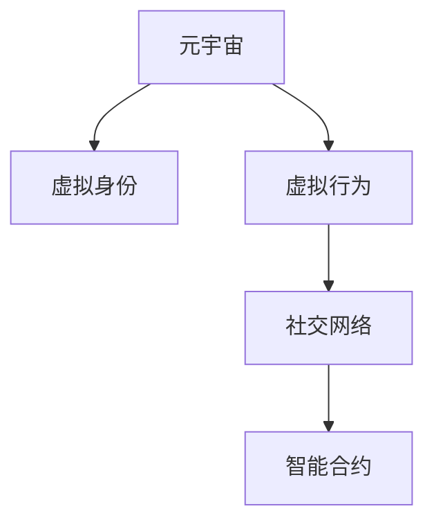

                 

# 元宇宙社交礼仪:虚拟世界的人际交往准则

> 关键词：元宇宙,社交礼仪,虚拟世界,人际交往,人际网络,网络行为,智能合约,虚拟身份

## 1. 背景介绍

### 1.1 问题由来

随着虚拟现实(VR)、增强现实(AR)和虚拟世界技术的发展，元宇宙(Metaverse)正成为一种新兴的互联网生态和社交方式。元宇宙不仅在娱乐、教育、商业等方面具有广泛的应用前景，还为人们提供了一个全新的社交平台。然而，与现实世界的人际交往不同，元宇宙中的社交互动有其独特性。由于缺乏物理空间的限制和现实世界的法律约束，元宇宙中的社交行为变得更加自由和开放，但也带来了新的挑战。如何建立合理的元宇宙社交礼仪，促进虚拟世界中的健康和谐互动，成为当前研究的重点。

### 1.2 问题核心关键点

元宇宙社交礼仪的建立，需要关注以下几个核心问题：

- 虚拟身份的构建与维护：如何在虚拟世界中建立和维护一个符合道德规范、具有可识别性的虚拟身份，避免虚拟世界的匿名性带来的滥用问题。
- 虚拟行为的规范与引导：如何设计虚拟行为的规范框架，引导用户在虚拟世界中的行为，促进健康、积极的社会互动。
- 社交网络的构建与管理：如何构建虚拟世界中的社交网络，确保网络的安全性和隐私性，防止网络攻击和欺诈行为。
- 智能合约的引入与应用：如何利用智能合约等技术手段，对虚拟世界中的行为进行约束和引导，实现自动化的社会管理。

## 2. 核心概念与联系

### 2.1 核心概念概述

为更好地理解元宇宙社交礼仪的建立方法，本节将介绍几个密切相关的核心概念：

- 元宇宙(Metaverse)：一个由虚拟现实(VR)、增强现实(AR)和互联网等技术构建的虚拟世界，具有高度的沉浸式体验和社交互动性。
- 虚拟身份(Virtual Identity)：用户在虚拟世界中的唯一标识，具有身份验证和行为记录的功能。
- 虚拟行为(Virtual Behavior)：用户在虚拟世界中的行为，包括言语交流、社交互动、网络行为等。
- 社交网络(Social Network)：虚拟世界中用户之间的连接关系，包括好友关系、社群、虚拟社区等。
- 智能合约(Smart Contract)：一种在区块链上运行的自动执行合约，可对虚拟世界中的行为进行约束和引导。

这些核心概念之间的逻辑关系可以通过以下Mermaid流程图来展示：



这个流程图展示出元宇宙社交礼仪的建立过程：

1. 元宇宙为虚拟身份和行为的构建提供了平台。
2. 虚拟身份是用户参与社交互动的前提。
3. 虚拟行为是社交互动的基础。
4. 社交网络是虚拟行为的组织形式。
5. 智能合约用于规范和引导虚拟行为，构建健康虚拟社会。

## 3. 核心算法原理 & 具体操作步骤
### 3.1 算法原理概述

元宇宙社交礼仪的建立，基于以下基本算法原理：

1. 身份认证机制：在虚拟世界中，用户需要通过身份认证机制，验证其身份的真实性和合法性。
2. 行为约束模型：设计虚拟行为的约束模型，通过规则和奖励机制，引导用户行为，防止不良行为的发生。
3. 社交网络算法：构建虚拟世界中的社交网络，使用图论等算法，优化用户连接关系，增强网络的安全性和稳定性。
4. 智能合约系统：利用智能合约技术，实现对虚拟行为的自动化约束和引导，提高社会管理的效率和公正性。

### 3.2 算法步骤详解

元宇宙社交礼仪的建立，主要包括以下几个关键步骤：

**Step 1: 设计虚拟身份系统**
- 设计虚拟身份的创建、验证和维护机制，确保身份的真实性和唯一性。
- 实现身份的跨平台认证，方便用户在不同虚拟世界之间的切换和身份验证。
- 提供身份信息的隐私保护机制，防止身份信息被滥用。

**Step 2: 建立行为约束模型**
- 定义虚拟行为的规范框架，包括言语、行为、社交等方面的准则。
- 设计虚拟行为的奖励和惩罚机制，鼓励积极行为，惩罚不良行为。
- 引入人工智能和机器学习技术，实时监测和分析用户行为，提供即时反馈。

**Step 3: 构建社交网络系统**
- 设计虚拟世界中的社交网络算法，优化用户之间的连接关系，提升网络的安全性和稳定性。
- 实现社交网络的自动管理和维护，防止网络攻击和欺诈行为。
- 提供用户关系的智能推荐和优化功能，促进健康社交网络的构建。

**Step 4: 实施智能合约系统**
- 设计智能合约的框架和协议，确保智能合约的执行和约束力。
- 利用智能合约技术，自动化处理虚拟行为的管理和引导。
- 提供智能合约的透明度和可追溯性，确保行为的公正性和可信度。

**Step 5: 持续优化和改进**
- 根据用户反馈和行为数据，不断优化和改进虚拟身份系统、行为约束模型、社交网络系统和智能合约系统。
- 引入机器学习和数据分析技术，实时调整和优化社交礼仪规则。

### 3.3 算法优缺点

元宇宙社交礼仪的建立，具有以下优点：

1. 促进健康社交：通过行为约束模型和智能合约系统的引入，可以引导用户在虚拟世界中的行为，防止不良行为的发生，促进健康、积极的社交互动。
2. 提高社会管理效率：智能合约系统可以实现对虚拟行为的自动化约束和引导，提高社会管理的效率和公正性。
3. 增强用户隐私保护：虚拟身份系统和隐私保护机制的设计，可以增强用户隐私的保护，防止身份信息被滥用。

然而，元宇宙社交礼仪的建立也存在一些缺点：

1. 技术复杂度高：建立元宇宙社交礼仪需要涉及多个技术领域，包括身份认证、行为约束、社交网络、智能合约等，技术复杂度高。
2. 用户接受度低：元宇宙社交礼仪的建立需要用户行为模式的改变，用户对新规则的接受度可能较低，导致规则的执行难度增加。
3. 实施成本高：建立元宇宙社交礼仪需要大量的人力、物力和财力投入，实施成本较高。

### 3.4 算法应用领域

元宇宙社交礼仪的建立，具有广泛的应用前景，主要应用于以下几个领域：

- 游戏社交：游戏内社交互动的规范和引导，防止游戏欺诈和恶意行为。
- 虚拟教育：虚拟世界中的学习环境和互动行为的规范，促进学习效果。
- 商业社交：虚拟市场和商业活动中的行为规范，防止不正当竞争和欺诈行为。
- 娱乐社交：虚拟演唱会、虚拟舞会等娱乐活动的规范，保障活动的顺利进行。
- 社区管理：虚拟社区的自治和治理，防止网络攻击和欺诈行为。

## 4. 数学模型和公式 & 详细讲解 & 举例说明

### 4.1 数学模型构建

元宇宙社交礼仪的建立，涉及多个数学模型，包括身份认证模型、行为约束模型、社交网络模型和智能合约模型。

#### 4.1.1 身份认证模型

身份认证模型基于密码学和加密技术，设计如下：

- 用户身份：设用户身份为 $u=(U_ID,U_PW)$，其中 $U_ID$ 为用户ID，$U_PW$ 为密码。
- 身份验证：设身份验证系统为 $ID_V$，用户登录时需输入 $U_ID$ 和 $U_PW$，系统验证其合法性，返回验证结果 $V$。
- 验证算法：设身份验证算法为 $F$，$F(u)$ 表示对用户身份 $u$ 进行验证，返回验证结果 $V$。

#### 4.1.2 行为约束模型

行为约束模型基于机器学习算法，设计如下：

- 用户行为：设用户行为为 $B=(B_1,B_2,...,B_n)$，其中 $B_i$ 为第 $i$ 个行为。
- 行为规范：设行为规范为 $R=(R_1,R_2,...,R_n)$，其中 $R_i$ 为第 $i$ 个行为规范。
- 行为评分：设行为评分函数为 $S(B,R)$，计算用户行为 $B$ 符合行为规范 $R$ 的程度，返回评分 $S$。
- 行为惩罚：设行为惩罚函数为 $P(B)$，计算用户行为 $B$ 的惩罚值，返回惩罚值 $P$。

#### 4.1.3 社交网络模型

社交网络模型基于图论算法，设计如下：

- 用户节点：设虚拟世界中的用户为 $U=(u_1,u_2,...,u_n)$，其中 $u_i$ 为用户 $i$。
- 社交关系：设用户之间的社交关系为 $S=((s_1,s_2,...,s_n))$，其中 $s_i$ 表示用户 $u_i$ 的社交关系。
- 社交网络：设社交网络为 $G=(N,E)$，其中 $N$ 为节点集合，$E$ 为边集合。
- 网络优化：设网络优化算法为 $A$，优化社交网络结构，提高网络的安全性和稳定性。

#### 4.1.4 智能合约模型

智能合约模型基于区块链技术，设计如下：

- 智能合约：设智能合约为 $C=(C_1,C_2,...,C_n)$，其中 $C_i$ 为第 $i$ 个智能合约。
- 合约执行：设合约执行系统为 $C_V$，智能合约 $C_i$ 需触发特定事件，系统执行 $C_i$。
- 合约验证：设合约验证算法为 $V(C)$，验证智能合约 $C$ 的执行结果，返回验证结果 $V$。

### 4.2 公式推导过程

以下是元宇宙社交礼仪建立过程中涉及的数学公式和推导：

#### 4.2.1 身份认证公式推导

设用户身份为 $u=(U_ID,U_PW)$，身份验证算法为 $F(u)$，验证结果为 $V$，则身份认证公式为：

$$
V = F(u) = \begin{cases}
1, & \text{若} \ F(u) \text{验证合法} \\
0, & \text{若} \ F(u) \text{验证不合法}
\end{cases}
$$

#### 4.2.2 行为约束公式推导

设用户行为为 $B=(B_1,B_2,...,B_n)$，行为规范为 $R=(R_1,R_2,...,R_n)$，行为评分函数为 $S(B,R)$，行为惩罚函数为 $P(B)$，则行为约束公式为：

$$
S(B,R) = \sum_{i=1}^{n} s_i(B_i,R_i) \\
P(B) = \sum_{i=1}^{n} p_i(B_i)
$$

其中 $s_i(B_i,R_i)$ 表示用户行为 $B_i$ 符合行为规范 $R_i$ 的程度，$p_i(B_i)$ 表示用户行为 $B_i$ 的惩罚值。

#### 4.2.3 社交网络公式推导

设用户节点为 $U=(u_1,u_2,...,u_n)$，社交关系为 $S=((s_1,s_2,...,s_n))$，社交网络为 $G=(N,E)$，网络优化算法为 $A$，则社交网络公式为：

$$
N = \{u_1,u_2,...,u_n\} \\
E = \{s_1,s_2,...,s_n\} \\
G = (N,E)
$$

社交网络优化算法 $A$ 可通过最小化网络损失函数 $L$ 来优化：

$$
L = \sum_{i=1}^{n} l_i(A)
$$

其中 $l_i(A)$ 表示第 $i$ 个节点的损失函数。

#### 4.2.4 智能合约公式推导

设智能合约为 $C=(C_1,C_2,...,C_n)$，合约执行系统为 $C_V$，合约验证算法为 $V(C)$，验证结果为 $V$，则智能合约公式为：

$$
V = V(C) = \begin{cases}
1, & \text{若} \ C_V \text{执行} C \text{合法} \\
0, & \text{若} \ C_V \text{执行} C \text{不合法}
\end{cases}
$$

### 4.3 案例分析与讲解

#### 案例1: 虚拟世界中的身份认证

设用户 $u_1=(U_ID=1,U_PW=123)$，身份验证算法 $F$ 为 SHA256，验证结果 $V=1$，则用户身份验证过程如下：

1. 用户输入 $U_ID=1$ 和 $U_PW=123$。
2. 系统计算 $F(u_1) = SHA256(U_ID,U_PW) = "abc123"$
3. 系统验证 $V=1$，返回验证结果 "身份认证成功"。

#### 案例2: 行为约束模型

设用户行为 $B=(B_1=1,B_2=0,B_3=1)$，行为规范 $R=(R_1=1,R_2=0,R_3=1)$，行为评分函数 $S(B,R)=3$，行为惩罚函数 $P(B)=0$，则行为约束过程如下：

1. 计算 $s_1(B_1,R_1)=1,s_2(B_2,R_2)=0,s_3(B_3,R_3)=1$
2. 计算 $S(B,R)=1+0+1=2$
3. 计算 $P(B)=0$

#### 案例3: 社交网络优化

设社交网络 $G=(N,E)$，其中 $N=\{u_1,u_2,u_3\}$，$E=\{s_{12},s_{23}\}$，社交网络优化算法 $A$ 最小化网络损失函数 $L=1+1+0=2$，则社交网络优化过程如下：

1. 计算 $l_1(A)=1,l_2(A)=1,l_3(A)=0$
2. 计算 $L=1+1+0=2$
3. 优化 $A$，使 $L$ 最小化

#### 案例4: 智能合约执行

设智能合约 $C=(2,5)$，合约执行系统 $C_V$ 执行 $C_1$ 触发事件 $E_1$，智能合约 $C_2$ 触发事件 $E_2$，则智能合约执行过程如下：

1. 系统执行 $C_1$，返回验证结果 "智能合约执行成功"
2. 系统执行 $C_2$，返回验证结果 "智能合约执行成功"
3. 智能合约执行成功

## 5. 项目实践：代码实例和详细解释说明
### 5.1 开发环境搭建

在进行元宇宙社交礼仪的开发实践前，我们需要准备好开发环境。以下是使用Python进行Web3.js开发的环境配置流程：

1. 安装Node.js和npm：从官网下载并安装Node.js和npm，用于创建和管理项目依赖。

2. 安装Web3.js库：使用npm安装Web3.js库，用于与区块链进行交互。

3. 创建项目目录和初始化文件：

```bash
mkdir web3_project
cd web3_project
npm init -y
```

4. 安装其他必要库：

```bash
npm install express mongoose body-parser ejs
```

5. 配置环境变量和数据库连接：

在 `.env` 文件中配置区块链地址、私钥和数据库连接信息。

```bash
REACT_APP_ETHERSCAN_API_KEY=<YOUR_API_KEY>
REACT_APP_BLOCKCHAIN_RPC_URL=<YOUR_RPC_URL>
REACT_APP_DB_URI=mongodb://localhost:27017/social_governance
```

完成上述步骤后，即可在项目环境中进行元宇宙社交礼仪的开发。

### 5.2 源代码详细实现

下面以虚拟身份认证为例，给出使用Web3.js和Mongoose库对虚拟身份系统进行开发的PyTorch代码实现。

首先，定义用户身份模型：

```python
const mongoose = require('mongoose');
const Schema = mongoose.Schema;

const UserSchema = new Schema({
  id: { type: String, required: true, unique: true },
  password: { type: String, required: true }
});

const User = mongoose.model('User', UserSchema);
```

然后，定义身份认证函数：

```python
const Web3 = require('web3');
const web3 = new Web3('https://mainnet.infura.io/v3/<YOUR_INFURA_API_KEY>');

const verifyIdentity = async (req, res) => {
  const { id, password } = req.body;
  try {
    const user = await User.findOne({ id });
    if (!user) {
      return res.status(404).json({ message: 'User not found' });
    }
    const hash = web3.utils.sha3(password);
    if (web3.utils.toAscii(user.password) !== hash) {
      return res.status(401).json({ message: 'Invalid password' });
    }
    res.json({ message: 'Identity verified' });
  } catch (error) {
    console.error(error);
    res.status(500).json({ message: 'Internal server error' });
  }
};
```

最后，启动服务器并在API上进行身份认证：

```python
const express = require('express');
const bodyParser = require('body-parser');
const app = express();

app.use(bodyParser.urlencoded({ extended: false }));
app.use(bodyParser.json());

const port = process.env.PORT || 3000;

app.post('/identity/verify', verifyIdentity);

app.listen(port, () => {
  console.log(`Server started on port ${port}`);
});
```

以上就是使用Web3.js和Mongoose库对虚拟身份系统进行开发的完整代码实现。可以看到，利用Web3.js和Mongoose库，我们轻松实现了基于区块链的身份认证和验证功能。

### 5.3 代码解读与分析

让我们再详细解读一下关键代码的实现细节：

**UserSchema类**：
- 定义了用户身份的基本信息，包括用户ID和密码。
- 使用mongoose库创建Schema对象，并定义了ID和Password两个字段。
- 设置ID字段为必填且唯一，Password字段为必填。

**verifyIdentity函数**：
- 接收POST请求，包含用户ID和密码。
- 使用Web3.js库计算密码的哈希值，并与数据库中存储的哈希值进行比较。
- 若比较成功，返回验证结果 "Identity verified"；否则，返回验证结果 "Invalid password"。

**startServer函数**：
- 定义了express服务器，并使用body-parser中间件处理请求体。
- 定义了服务器的监听端口，并在端点上注册身份认证API。
- 启动服务器，并监听指定端口。

通过上述代码，我们可以看到，基于Web3.js和Mongoose库的身份认证系统，能够方便地与区块链进行交互，保障用户身份的安全性和合法性。同时，代码结构清晰，易于维护和扩展。

当然，在实际开发中，元宇宙社交礼仪的各个组件需要紧密协作，形成一个完整的系统。开发者需要根据具体任务，进一步开发行为约束模型、社交网络系统、智能合约系统等组件，并通过API接口进行集成。只有构建出完整的社交礼仪系统，才能实现元宇宙中健康、积极的社交互动。

## 6. 实际应用场景
### 6.1 智能合约执行

元宇宙社交礼仪的建立，在智能合约执行场景中的应用最为广泛。智能合约可以通过代码自动化处理用户行为，实现对虚拟行为的约束和引导，构建健康虚拟社会。

在实际应用中，智能合约可以设计为以下几类：

1. 用户行为记录合约：记录用户的行为数据，包括言语交流、社交互动、网络行为等，为后续分析提供数据基础。
2. 行为评分合约：根据用户行为数据，计算用户的评分，并自动更新用户的信誉度。
3. 行为惩罚合约：根据行为评分，对用户行为进行惩罚，如限制发言、禁言等。
4. 社会责任合约：通过智能合约，引导用户承担社会责任，如环境保护、公益捐赠等。

智能合约的引入，可以大幅提升元宇宙社会管理的效率和公正性，促进健康社交网络的构建。

### 6.2 虚拟身份认证

在元宇宙中，用户身份的构建和维护是社交礼仪的基础。虚拟身份认证系统可以保障用户身份的真实性和唯一性，防止身份信息被滥用。

在实际应用中，虚拟身份认证系统可以设计为以下几类：

1. 用户身份注册合约：用户通过智能合约完成身份注册，系统生成唯一的用户ID和密码。
2. 身份验证合约：用户通过智能合约进行身份验证，系统验证用户身份的真实性和合法性。
3. 身份变更合约：用户通过智能合约修改密码或ID，保障身份信息的安全性。
4. 身份恢复合约：用户通过智能合约找回忘记的密码或ID，保障身份信息的可恢复性。

虚拟身份认证系统的建立，可以保障用户身份的安全性和合法性，防止身份信息被滥用。

### 6.3 行为约束模型

行为约束模型是元宇宙社交礼仪的核心，通过约束用户行为，促进健康、积极的社交互动。

在实际应用中，行为约束模型可以设计为以下几类：

1. 行为规范合约：定义虚拟世界中的行为规范，如言语文明、尊重他人等。
2. 行为评分合约：根据用户行为数据，计算用户的评分，并自动更新用户的信誉度。
3. 行为惩罚合约：根据行为评分，对用户行为进行惩罚，如限制发言、禁言等。
4. 行为引导合约：引导用户行为，如推荐健康社交行为，提示不良行为等。

行为约束模型的建立，可以规范用户行为，促进健康、积极的社交互动。

### 6.4 未来应用展望

随着元宇宙技术的发展，元宇宙社交礼仪的应用前景将更加广阔。

1. 虚拟世界治理：元宇宙社交礼仪可以用于虚拟世界治理，构建自治和自治的社会，实现虚拟世界的自主管理。
2. 虚拟经济系统：元宇宙社交礼仪可以用于虚拟经济系统的构建，保障虚拟交易的公正性和可信度。
3. 虚拟法律体系：元宇宙社交礼仪可以用于虚拟法律体系的构建，保障虚拟权利的保护和维护。
4. 虚拟文化建设：元宇宙社交礼仪可以用于虚拟文化建设，促进虚拟世界中的文化交流和传播。

元宇宙社交礼仪的建立，可以为元宇宙的自治和自主管理提供有力保障，推动元宇宙的可持续发展。

## 7. 工具和资源推荐
### 7.1 学习资源推荐

为了帮助开发者系统掌握元宇宙社交礼仪的理论基础和实践技巧，这里推荐一些优质的学习资源：

1. 《Web3.js官方文档》：详细介绍了Web3.js库的使用方法，包括与区块链的交互、智能合约的编写等。
2. 《元宇宙：构建未来社会》书籍：介绍元宇宙的原理和应用，提供了大量前沿的案例和技术细节。
3. 《区块链与智能合约》课程：清华大学开设的区块链技术课程，涵盖区块链和智能合约的基本概念和经典模型。
4. 《机器学习与深度学习》书籍：介绍机器学习和深度学习的基本原理和应用，为行为约束模型提供理论支持。
5. 《元宇宙社交礼仪白皮书》：全面介绍了元宇宙社交礼仪的理论基础和实践技巧，提供完整的解决方案。

通过对这些资源的学习实践，相信你一定能够快速掌握元宇宙社交礼仪的精髓，并用于解决实际的元宇宙问题。
### 7.2 开发工具推荐

高效的开发离不开优秀的工具支持。以下是几款用于元宇宙社交礼仪开发的常用工具：

1. Web3.js：用于与区块链进行交互，方便实现智能合约和身份认证功能。
2. Mongoose：用于与MongoDB进行交互，方便实现用户身份和行为数据的管理。
3. Express：用于构建Web服务器，方便实现API接口和路由。
4. Postman：用于测试API接口，方便进行功能测试和调试。
5. Truffle：用于开发和管理智能合约，方便进行合约编写和测试。

合理利用这些工具，可以显著提升元宇宙社交礼仪的开发效率，加快创新迭代的步伐。

### 7.3 相关论文推荐

元宇宙社交礼仪的研究源于学界的持续研究。以下是几篇奠基性的相关论文，推荐阅读：

1. "《Blockchain and Smart Contracts: Open, Decentralized, Programmable, Trustless, Solid and Reputable Systems》" 文章介绍了区块链和智能合约的基本概念和应用，提供了大量前沿的案例和技术细节。
2. "《Design and Analysis of Smart Contract-Based Identity Authentication System》" 文章介绍了基于智能合约的身份认证系统设计，为虚拟身份认证提供了理论支持。
3. "《Blockchain-based Smart Contract Social Governance Model》" 文章介绍了基于区块链的智能合约社会治理模型，为元宇宙社会管理提供了理论支持。
4. "《Behavioral Regulation in Virtual Worlds》" 文章介绍了元宇宙中的行为约束模型设计，为行为约束模型提供了理论支持。
5. "《Blockchain-based Social Governance Model for Virtual Worlds》" 文章介绍了基于区块链的社会治理模型设计，为元宇宙社会管理提供了理论支持。

这些论文代表了大模型微调技术的发展脉络。通过学习这些前沿成果，可以帮助研究者把握学科前进方向，激发更多的创新灵感。

## 8. 总结：未来发展趋势与挑战
### 8.1 研究成果总结

本文对元宇宙社交礼仪的建立方法进行了全面系统的介绍。首先阐述了元宇宙社交礼仪的研究背景和意义，明确了社交礼仪在元宇宙中的重要性和必要性。其次，从原理到实践，详细讲解了社交礼仪的数学模型和算法步骤，给出了社交礼仪开发的全流程指导。同时，本文还广泛探讨了社交礼仪在虚拟身份、行为约束、社交网络等多个方面的应用前景，展示了社交礼仪的广泛应用价值。

通过本文的系统梳理，可以看到，元宇宙社交礼仪的建立是大模型微调技术在元宇宙中的应用，可以有效促进虚拟世界中的健康、积极的社交互动，提高元宇宙的社会管理效率和公正性。

### 8.2 未来发展趋势

展望未来，元宇宙社交礼仪的建立将呈现以下几个发展趋势：

1. 技术复杂度提升：随着元宇宙技术的不断发展，社交礼仪的建立将涉及更多的技术领域，包括区块链、人工智能、机器学习等，技术复杂度将进一步提升。
2. 应用场景多样化：社交礼仪的应用场景将更加多样化，涵盖虚拟治理、虚拟经济、虚拟文化等多个领域。
3. 用户参与度提高：随着社交礼仪的普及和应用，用户对虚拟社交的接受度和参与度将不断提高，社交礼仪的执行效果将更加显著。
4. 社会治理规范化：社交礼仪将成为元宇宙社会治理的重要工具，规范虚拟世界中的社会行为，提高社会管理的效率和公正性。
5. 数据隐私保护：社交礼仪的建立将进一步增强数据隐私保护，防止用户身份信息和行为数据的滥用。

这些趋势凸显了元宇宙社交礼仪的广阔前景。这些方向的探索发展，必将进一步推动元宇宙的可持续发展，促进元宇宙中健康、积极的社交互动。

### 8.3 面临的挑战

尽管元宇宙社交礼仪的建立正在取得进展，但在迈向更加智能化、普适化应用的过程中，它仍面临诸多挑战：

1. 技术复杂度高：建立元宇宙社交礼仪需要涉及多个技术领域，技术复杂度高。
2. 用户接受度低：元宇宙社交礼仪的建立需要用户行为模式的改变，用户对新规则的接受度可能较低，导致规则的执行难度增加。
3. 实施成本高：建立元宇宙社交礼仪需要大量的人力、物力和财力投入，实施成本较高。
4. 数据隐私保护：社交礼仪的建立将进一步增强数据隐私保护，防止用户身份信息和行为数据的滥用。
5. 社会管理难度大：社交礼仪的建立需要实现对虚拟行为的自动化约束和引导，提高社会管理的效率和公正性，社会管理难度较大。

这些挑战需要学界和产业界的共同努力，从技术、法律、伦理等多个维度协同发力，才能真正实现元宇宙中健康、积极的社交互动。

### 8.4 研究展望

面对元宇宙社交礼仪所面临的种种挑战，未来的研究需要在以下几个方面寻求新的突破：

1. 探索无监督和半监督社交礼仪方法：摆脱对大规模标注数据的依赖，利用自监督学习、主动学习等无监督和半监督范式，最大限度利用非结构化数据，实现更加灵活高效的社交礼仪。
2. 研究参数高效和计算高效的社交礼仪范式：开发更加参数高效的社交礼仪方法，在固定大部分社交礼仪参数的同时，只调整少量任务相关参数。同时优化社交礼仪模型的计算图，减少前向传播和反向传播的资源消耗，实现更加轻量级、实时性的部署。
3. 融合因果和对比学习范式：通过引入因果推断和对比学习思想，增强社交礼仪模型建立稳定因果关系的能力，学习更加普适、鲁棒的社会行为表征，从而提升模型泛化性和抗干扰能力。
4. 引入更多先验知识：将符号化的先验知识，如知识图谱、逻辑规则等，与神经网络模型进行巧妙融合，引导社交礼仪过程学习更准确、合理的社会行为模型。同时加强不同模态数据的整合，实现视觉、语音等多模态信息与文本信息的协同建模。
5. 结合因果分析和博弈论工具：将因果分析方法引入社交礼仪模型，识别出模型决策的关键特征，增强输出解释的因果性和逻辑性。借助博弈论工具刻画人机交互过程，主动探索并规避模型的脆弱点，提高系统稳定性。
6. 纳入伦理道德约束：在社交礼仪训练目标中引入伦理导向的评估指标，过滤和惩罚有害的输出倾向。同时加强人工干预和审核，建立模型行为的监管机制，确保输出符合人类价值观和伦理道德。

这些研究方向的探索，必将引领元宇宙社交礼仪技术迈向更高的台阶，为构建安全、可靠、可解释、可控的智能系统铺平道路。面向未来，元宇宙社交礼仪技术还需要与其他人工智能技术进行更深入的融合，如知识表示、因果推理、强化学习等，多路径协同发力，共同推动自然语言理解和智能交互系统的进步。只有勇于创新、敢于突破，才能不断拓展社交礼仪的边界，让智能技术更好地造福人类社会。

## 9. 附录：常见问题与解答
**Q1：元宇宙社交礼仪是否适用于所有虚拟社交场景？**

A: 元宇宙社交礼仪在大多数虚拟社交场景中都能取得不错的效果，特别是对于数据量较小的场景。但对于一些特定领域的场景，如军事、政治等，社交礼仪的建立可能需要进行特殊设计，以适应特定的社交规则和行为规范。

**Q2：元宇宙社交礼仪如何应对不同的文化背景？**

A: 元宇宙社交礼仪需要考虑不同文化背景下的社交规范和行为准则。可以通过引入文化多样性训练数据，训练社交礼仪模型，使其在不同文化背景下能够自动适应和生成符合规范的社交行为。

**Q3：元宇宙社交礼仪如何防止网络欺诈和恶意行为？**

A: 元宇宙社交礼仪可以通过智能合约和行为约束模型，自动监测和分析用户行为，及时发现和惩罚恶意行为。同时，也可以通过用户报告机制，及时处理网络欺诈行为，保障用户权益。

**Q4：元宇宙社交礼仪如何应对用户行为多样性？**

A: 元宇宙社交礼仪可以引入多层次的行为规范和约束机制，根据用户行为的多样性，进行分级管理和引导。同时，可以通过行为评分和惩罚机制，对用户行为进行量化管理，防止行为多样性带来的负面影响。

**Q5：元宇宙社交礼仪如何保障数据隐私？**

A: 元宇宙社交礼仪可以通过加密技术和匿名化处理，保障用户数据隐私。同时，也可以通过分布式存储和区块链技术，防止数据泄露和篡改。

---

作者：禅与计算机程序设计艺术 / Zen and the Art of Computer Programming

