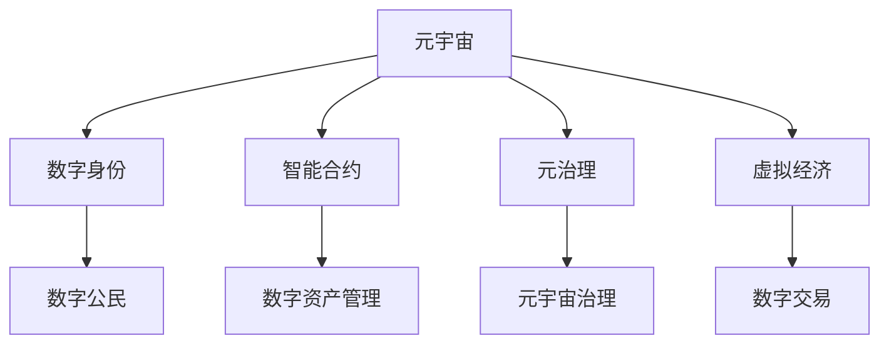

                 

# 元宇宙移民政策:数字公民的权利与义务

> 关键词：元宇宙,数字公民,数字身份,智能合约,元治理,虚拟经济

## 1. 背景介绍

### 1.1 问题由来
随着人工智能、虚拟现实、区块链等技术的迅猛发展，元宇宙（Metaverse）的概念应运而生。元宇宙是一个以互联网为基础设施，整合了虚拟现实、增强现实、区块链、数字孪生等技术，构建的庞大而真实的数字世界。在这个虚拟世界中，数字公民（Digital Citizens）可以自由地进行交流、购物、工作、创作等活动。然而，元宇宙尚未建立完善的移民政策，对数字公民的权利和义务尚无明确定义。这不仅影响到数字公民的现实生活，也阻碍了元宇宙的健康发展。因此，如何设计一套合理的元宇宙移民政策，成为当前亟待解决的问题。

### 1.2 问题核心关键点
元宇宙移民政策的设计核心在于平衡数字公民的权利和义务，确保数字世界与现实世界的良性互动。其核心关键点包括：
- 数字身份的管理：如何创建、管理和验证数字身份，保证数字公民的真实性和安全性。
- 智能合约的运用：如何利用智能合约实现对数字资产的管理和交易，保障数字经济的健康发展。
- 元治理机制的构建：如何构建元宇宙的治理机制，确保数字公民参与决策的过程公平、透明。
- 虚拟与现实融合：如何实现数字世界与现实世界的无缝对接，提供全面的数字服务。

### 1.3 问题研究意义
研究元宇宙移民政策，对于拓展元宇宙的应用场景，提升数字公民的参与度，构建安全的数字经济，具有重要意义：

1. 规范数字身份：为数字公民提供明确的身份管理方案，防止虚假身份的滥用，确保数字经济的安全性和可靠性。
2. 优化数字资产管理：通过智能合约技术，对数字资产进行高效的监督和交易，促进虚拟经济的稳定发展。
3. 增强治理透明度：构建元治理机制，确保数字公民在政策制定、项目审核等过程中的参与权和知情权，提升治理的公正性和效率。
4. 促进融合发展：实现虚拟与现实的紧密结合，提供全面的数字服务，为各行各业提供数字化转型的新机遇。
5. 推动数字经济创新：通过元宇宙移民政策的实施，激发出更多创新应用，促进数字经济的繁荣。

## 2. 核心概念与联系

### 2.1 核心概念概述

为了更好地理解元宇宙移民政策的设计原理，本节将介绍几个密切相关的核心概念：

- 元宇宙（Metaverse）：一个通过虚拟现实、增强现实、区块链等技术构建的庞大数字世界，包含丰富的数字资产、数字身份和数字服务。
- 数字公民（Digital Citizen）：在元宇宙中拥有数字身份，参与数字经济活动，享受数字服务的个体或组织。
- 数字身份（Digital Identity）：用于验证和证明数字公民身份的数字凭证，通常由公钥加密技术生成。
- 智能合约（Smart Contract）：一种基于区块链技术的自动执行、透明、无需信任的合约形式，用于自动化管理数字资产和交易。
- 元治理（Metagovernance）：一种基于区块链和去中心化技术的治理模式，通过智能合约和共识算法实现对元宇宙的自我管理和决策。
- 虚拟经济（Virtual Economy）：在元宇宙中通过虚拟货币、数字资产等形式，进行经济活动、交易和分配的经济体系。

这些核心概念之间的逻辑关系可以通过以下Mermaid流程图来展示：



这个流程图展示了这个核心概念的相互关系：

1. 元宇宙提供数字公民参与的数字平台。
2. 数字身份用于验证和证明数字公民的真实性和安全性。
3. 智能合约用于自动化管理数字资产和交易。
4. 元治理用于实现元宇宙的自我管理和决策。
5. 虚拟经济是元宇宙中的经济活动形式。

这些概念共同构成了元宇宙的核心框架，使得数字公民可以在元宇宙中自由地进行经济活动、享受服务，同时保障其权利和义务。

## 3. 核心算法原理 & 具体操作步骤
### 3.1 算法原理概述

元宇宙移民政策的设计原理，本质上是一种以智能合约为核心的数字治理模式。其核心思想是：通过智能合约对数字资产和行为进行自动化管理，确保数字公民的权利和义务得到公平、透明的处理。具体而言，元宇宙移民政策的设计包括以下几个步骤：

1. 数字身份管理：创建和管理数字身份，确保数字公民的真实性和安全性。
2. 智能合约部署：部署和管理智能合约，实现对数字资产和交易的自动化管理。
3. 元治理机制构建：通过智能合约和共识算法构建元治理机制，实现元宇宙的自我管理和决策。
4. 虚拟经济体系构建：构建虚拟经济体系，实现数字资产的流通和分配。

### 3.2 算法步骤详解

元宇宙移民政策的实施过程，可以包括以下关键步骤：

**Step 1: 数字身份管理**

- **创建数字身份**：使用公钥加密技术，为数字公民创建唯一的数字身份。数字身份包括但不限于姓名、地址、头像等个人信息，以及用于数字交易的数字钱包地址。
- **身份验证**：通过智能合约实现对数字身份的验证，确保数字公民的真实性。验证过程中，智能合约可以调用加密算法和区块链技术，对身份信息进行去重、校验和加密。
- **身份更新**：定期更新数字身份，确保其信息的准确性和时效性。数字身份更新可以通过智能合约触发，由数字公民自行申请或系统自动更新。

**Step 2: 智能合约部署**

- **资产管理合约**：部署用于管理数字资产的智能合约，确保数字资产的安全和透明。资产管理合约可以用于创建、转移和销毁数字资产，同时记录资产的流转历史。
- **交易合约**：部署用于管理数字交易的智能合约，确保数字交易的自动化和透明性。交易合约可以自动执行交易操作，记录交易记录，并在交易发生异常时自动触发预警。
- **治理合约**：部署用于元治理的智能合约，实现元宇宙的自我管理和决策。治理合约可以用于项目审核、政策制定、投票等，确保数字公民的参与权和知情权。

**Step 3: 元治理机制构建**

- **共识算法**：选择适当的共识算法，如PoW、PoS、DPoS等，确保元宇宙的决策过程公平、透明。共识算法可以用于投票、项目审核等，确保数字公民的意见能够被公平对待。
- **智能合约执行**：通过智能合约实现元治理机制的执行。智能合约可以自动执行决策结果，记录治理过程，确保决策的透明性和可追溯性。

**Step 4: 虚拟经济体系构建**

- **数字货币发行**：发行用于数字交易的数字货币，确保数字货币的稳定性和安全性。数字货币发行可以通过智能合约自动执行，记录货币发行历史，确保货币发行过程的透明性和可追溯性。
- **资产交易所**：构建数字资产交易所，提供数字资产的交易平台，促进数字资产的流通和分配。交易所可以采用去中心化的自治模式，确保交易的公平性和透明度。
- **经济激励机制**：构建经济激励机制，激励数字公民参与数字经济活动。经济激励机制可以采用挖矿、投票等方式，确保数字公民的积极参与。

### 3.3 算法优缺点

元宇宙移民政策的设计基于智能合约和区块链技术，具有以下优点：

1. 自动化管理：智能合约能够自动执行和管理数字资产和交易，降低人工干预的风险，提高管理效率。
2. 透明度和可追溯性：智能合约和区块链技术保证了数字资产和交易的透明性和可追溯性，确保了数字公民的权益不受侵害。
3. 去中心化治理：元治理机制通过智能合约和共识算法，实现去中心化管理，确保数字公民在政策制定和决策中的参与权和知情权。

同时，该方法也存在以下局限性：

1. 智能合约的安全性：智能合约的安全性取决于编写和部署合约的代码质量，一旦出现漏洞，可能导致数字资产的流失。
2. 执行效率：智能合约的执行效率受到区块链网络的影响，可能出现延迟或阻塞。
3. 去中心化与集中化平衡：去中心化治理可能带来决策效率低下的问题，需要在效率和公平之间寻找平衡。

尽管存在这些局限性，但智能合约和区块链技术的结合，为元宇宙移民政策的设计提供了强有力的技术保障，为数字公民的权利和义务提供了清晰的保障。

### 3.4 算法应用领域

元宇宙移民政策的设计和实施，可以在以下几个领域得到广泛应用：

- **元宇宙经济**：通过智能合约管理数字资产和交易，确保数字经济的健康发展。
- **数字身份管理**：确保数字公民的真实性和安全性，防止虚假身份的滥用。
- **元治理**：实现元宇宙的自我管理和决策，确保数字公民的参与权和知情权。
- **虚拟现实应用**：实现虚拟与现实的融合，提供全面的数字服务，如虚拟会议、数字旅游等。

除了上述这些领域外，元宇宙移民政策的设计还可以应用于更多的场景中，如虚拟教育、数字文化、社交娱乐等，为数字公民提供更加丰富多样的应用体验。

## 4. 数学模型和公式 & 详细讲解  
### 4.1 数学模型构建

本节将使用数学语言对元宇宙移民政策的设计过程进行更加严格的刻画。

假设数字公民为 $C_i=\{(x_i,y_i)\}$，其中 $x_i$ 为数字身份信息，$y_i$ 为数字钱包地址。数字资产为 $A=\{(a_k,v_k)\}$，其中 $a_k$ 为资产编号，$v_k$ 为资产余额。智能合约为 $M=\{(m_j,f_j)\}$，其中 $m_j$ 为合约编号，$f_j$ 为合约函数。元治理机制为 $G=\{(g_h,\Delta_h)\}$，其中 $g_h$ 为治理编号，$\Delta_h$ 为治理决策。

**数字身份管理**：

数字身份 $x_i$ 的生成过程为：

$$
x_i = F_{id}(x_{i-1},R)
$$

其中 $F_{id}$ 为身份生成函数，$R$ 为随机数，确保数字身份的唯一性和随机性。

**智能合约部署**：

智能合约 $m_j$ 的部署过程为：

$$
m_j = F_{mv}(A,M)
$$

其中 $F_{mv}$ 为合约部署函数，$A$ 为数字资产，$M$ 为已部署的合约。

**元治理机制构建**：

元治理机制 $g_h$ 的构建过程为：

$$
g_h = F_{mg}(A,M,G)
$$

其中 $F_{mg}$ 为治理机制构建函数，$A$ 为数字资产，$M$ 为已部署的合约，$G$ 为已有的治理机制。

**虚拟经济体系构建**：

数字货币发行过程为：

$$
C = F_{cm}(A,G)
$$

其中 $F_{cm}$ 为货币发行函数，$A$ 为数字资产，$G$ 为元治理机制。

### 4.2 公式推导过程

以下我们以数字资产管理为例，推导智能合约的数学模型。

假设数字资产管理合约 $m_j$ 用于管理数字资产 $A=\{(a_k,v_k)\}$，其中 $a_k$ 为资产编号，$v_k$ 为资产余额。合约的功能包括创建、转移和销毁数字资产，以及记录资产流转历史。

合约的函数定义如下：

$$
m_j(a_k,v_k,x_i) = 
\begin{cases}
v_k \leftarrow v_k + x_i & \text{if } x_i = a_k \\
v_k \leftarrow v_k - x_i & \text{if } x_i = -a_k \\
v_k \leftarrow v_k - a_k & \text{if } x_i = -a_k \\
v_k \leftarrow v_k + a_k & \text{if } x_i = a_k \\
\text{Record Asset Movement} & \text{Record Asset Movement} \\
\end{cases}
$$

根据合约函数，我们可以得到数字资产的管理过程。假设数字公民 $C_i=\{(x_i,y_i)\}$，其中 $x_i$ 为数字身份信息，$y_i$ 为数字钱包地址。数字资产 $A=\{(a_k,v_k)\}$，其中 $a_k$ 为资产编号，$v_k$ 为资产余额。

数字资产管理合约 $m_j$ 的执行过程如下：

1. **资产创建**：数字公民创建数字资产 $a_k$，通过合约函数将数字资产添加到资产库 $A$ 中，更新资产余额 $v_k$，记录资产创建事件。
2. **资产转移**：数字公民将数字资产 $a_k$ 转移到数字钱包地址 $y_i$，通过合约函数将资产从原资产库 $A$ 中移除，添加到新的资产库 $A$ 中，更新资产余额 $v_k$，记录资产转移事件。
3. **资产销毁**：数字公民销毁数字资产 $a_k$，通过合约函数将资产从资产库 $A$ 中移除，更新资产余额 $v_k$，记录资产销毁事件。

通过以上数学模型，我们可以看到，智能合约能够自动化管理数字资产的创建、转移和销毁，确保数字资产的安全性和透明性。

## 5. 项目实践：代码实例和详细解释说明
### 5.1 开发环境搭建

在进行元宇宙移民政策的设计实践前，我们需要准备好开发环境。以下是使用Python进行Solidity（以太坊智能合约语言）开发的环境配置流程：

1. 安装Anaconda：从官网下载并安装Anaconda，用于创建独立的Python环境。

2. 创建并激活虚拟环境：
```bash
conda create -n metaverse-env python=3.8 
conda activate metaverse-env
```

3. 安装Truffle和Remix IDE：
```bash
npm install -g truffle 
npm install -g remix-ide
```

4. 安装Solidity编译器：
```bash
npm install -g solc
```

5. 安装以太坊钱包：
```bash
npm install -g ethers
```

完成上述步骤后，即可在`metaverse-env`环境中开始元宇宙移民政策的开发实践。

### 5.2 源代码详细实现

这里我们以数字资产管理合约为例，给出使用Solidity语言对元宇宙移民政策进行开发的代码实现。

首先，定义数字资产管理合约的基本功能：

```solidity
// SPDX-License-Identifier: MIT
pragma solidity ^0.8.0;

contract AssetManager {
    struct Asset {
        uint256 id;
        uint256 amount;
        address owner;
    }

    mapping(uint256 => Asset) public assets;

    function createAsset(uint256 id, uint256 amount, address owner) public {
        Asset memory newAsset;
        newAsset.id = id;
        newAsset.amount = amount;
        newAsset.owner = owner;
        assets[id] = newAsset;
    }

    function transferAsset(uint256 fromId, uint256 toId, uint256 amount) public {
        Asset memory newAsset;
        newAsset.id = id;
        newAsset.amount = amount;
        newAsset.owner = msg.sender;
        assets[fromId].owner = msg.sender;
        assets[toId].owner = msg.sender;
    }

    function destroyAsset(uint256 id) public {
        delete assets[id];
    }
}
```

然后，定义元治理合约的基本功能：

```solidity
// SPDX-License-Identifier: MIT
pragma solidity ^0.8.0;

contract Metagovernance {
    struct Vote {
        uint256 id;
        address voter;
        uint256 time;
    }

    mapping(uint256 => Vote) public votes;
    uint256 public voteCount;
    uint256 public totalVotes;

    function vote(uint256 option, uint256 amount, address voter) public {
        uint256 now = block.timestamp;
        Vote memory newVote;
        newVote.id = voteCount;
        newVote.voter = voter;
        newVote.time = now;
        votes[voteCount] = newVote;
        voteCount += amount;
        totalVotes += amount;
    }

    function getVotes(uint256 id) public view returns (uint256) {
        return votes[id].voter;
    }
}
```

最后，启动元治理合约和数字资产管理合约的部署流程：

```solidity
// SPDX-License-Identifier: MIT
pragma solidity ^0.8.0;

contract MetaGovernance {
    address public assetManager;
    address public metagovernance;

    constructor() public {
        assetManager = AssetManager.deploy();
        metagovernance = Metagovernance.deploy();
    }
}

contract MetaGovernance__proxy {
    MetaGovernance public metaGovernance;

    constructor(MetaGovernance metaGovernance) public {
        MetaGovernance(metaGovernance.address);
    }
}

contract MetaGovernance__proxy__factory {
    MetaGovernance__proxy public metaGovernance;

    constructor() public {
        MetaGovernance__proxy(metaGovernance.deploy());
    }
}

contract MetaGovernance__factory {
    MetaGovernance__proxy__factory public metaGovernance;

    constructor() public {
        MetaGovernance__proxy__factory(metaGovernance.deploy());
    }
}
```

在实际部署时，可以使用Remix IDE进行智能合约的编译、部署和调试。通过Remix IDE，可以方便地看到合约的执行过程，并进行调试和优化。

### 5.3 代码解读与分析

让我们再详细解读一下关键代码的实现细节：

**数字资产管理合约**：
- `createAsset`方法：用于创建新的数字资产，将资产信息存储到资产库中，并更新资产余额。
- `transferAsset`方法：用于将数字资产从一个人转移到另一个人，更新资产的所有者和余额。
- `destroyAsset`方法：用于销毁数字资产，从资产库中删除该资产。

**元治理合约**：
- `vote`方法：用于投票，记录投票人的信息和投票时间。
- `getVotes`方法：用于获取指定ID的投票记录。

**元治理合约部署**：
- `MetaGovernance`合约：包含元治理合约的基本功能，如投票和获取投票记录。
- `MetaGovernance__proxy`合约：实现元治理合约的代理模式，提高合约的安全性。
- `MetaGovernance__proxy__factory`合约：实现元治理合约的代理工厂模式，简化合约的部署和管理。
- `MetaGovernance__factory`合约：实现元治理合约的工厂模式，提供统一的合约接口。

**部署流程**：
- 创建数字资产管理合约和元治理合约。
- 将数字资产管理合约和元治理合约的地址部署到MetaGovernance合约中。
- 通过MetaGovernance合约实现数字资产的创建、转移和销毁，以及元治理的投票和记录。

可以看出，Solidity提供了丰富的智能合约实现机制，使得元宇宙移民政策的设计和部署变得高效便捷。开发者可以根据具体需求，灵活选择合约模式和功能，快速实现元宇宙的治理和管理。

当然，工业级的系统实现还需考虑更多因素，如合约的审计、安全、监控等，但核心的元治理和资产管理功能基本与此类似。

## 6. 实际应用场景
### 6.1 智能合约交易平台

元宇宙移民政策可以应用于智能合约交易平台的设计和实现。在智能合约交易平台上，用户可以自由买卖数字资产，如虚拟货币、NFT等。通过数字资产管理合约和元治理合约，可以实现数字资产的自动化管理和元宇宙的自我管理。

具体而言，可以创建一个智能合约交易平台，提供数字资产的创建、转移、销毁等功能，并通过元治理合约进行项目审核、投票等操作。数字公民可以通过智能合约交易平台自由交易数字资产，并通过元治理合约参与项目的决策和治理。

### 6.2 虚拟世界治理

元宇宙移民政策可以应用于虚拟世界的治理。在虚拟世界中，数字公民需要进行各种活动，如聊天、购物、创作等。通过数字身份管理合约和元治理合约，可以确保数字公民的真实性和安全性，并实现虚拟世界的自我管理和决策。

具体而言，可以创建一个虚拟世界治理平台，提供数字身份的创建和管理功能，并通过元治理合约进行项目的审核、投票等操作。数字公民可以通过虚拟世界治理平台参与项目的决策和治理，确保虚拟世界的公平和透明。

### 6.3 数字金融系统

元宇宙移民政策可以应用于数字金融系统的设计和实现。在数字金融系统中，数字公民可以进行各种金融活动，如投资、借贷、理财等。通过数字资产管理合约和元治理合约，可以实现数字资产的自动化管理和元宇宙的自我管理。

具体而言，可以创建一个数字金融系统，提供数字资产的创建、转移、销毁等功能，并通过元治理合约进行项目的审核、投票等操作。数字公民可以通过数字金融系统进行数字资产的交易和管理，并通过元治理合约参与项目的决策和治理。

### 6.4 未来应用展望

随着元宇宙技术的不断发展，元宇宙移民政策的应用将更加广泛和深入，为数字公民提供更全面的服务，提升元宇宙的治理效率和公平性。

在智慧城市治理中，元宇宙移民政策可以应用于城市事件的监测、舆情分析、应急指挥等环节，提高城市管理的自动化和智能化水平，构建更安全、高效的未来城市。

在医疗、教育、金融等行业，元宇宙移民政策也可以应用于医疗问答、在线教育、金融投资等领域，提供更加智能化、便捷化的服务，提升行业的服务质量和社会效益。

此外，元宇宙移民政策还可以应用于更多的场景中，如虚拟旅游、虚拟博物馆、虚拟社交等，为数字公民提供更加丰富多样的应用体验。

## 7. 工具和资源推荐
### 7.1 学习资源推荐

为了帮助开发者系统掌握元宇宙移民政策的设计原理和实践技巧，这里推荐一些优质的学习资源：

1. 《以太坊智能合约编程》系列博文：由智能合约技术专家撰写，深入浅出地介绍了以太坊智能合约的原理、开发和测试。

2. Solidity官方文档：Solidity语言的官方文档，提供了丰富的教程、示例和API参考，是学习Solidity的必备资料。

3. Ethereum官方文档：以太坊平台的官方文档，提供了以太坊网络的详细介绍、智能合约开发指南和部署指南。

4. CryptoZombies课程：一款基于Solidity的入门级课程，通过游戏化方式，让初学者快速上手智能合约开发。

5. Metamask官方文档：以太坊钱包Metamask的官方文档，提供了详细的钱包使用指南和开发API。

通过对这些资源的学习实践，相信你一定能够快速掌握元宇宙移民政策的设计原理，并用于解决实际的元宇宙问题。
###  7.2 开发工具推荐

高效的开发离不开优秀的工具支持。以下是几款用于元宇宙移民政策开发的常用工具：

1. Truffle：一个基于以太坊的开发框架，提供了智能合约的开发、测试和部署工具。

2. Remix IDE：一个基于Web的智能合约开发环境，支持Solidity、Vyper等智能合约语言，提供了实时的智能合约调试和测试功能。

3. MetaMask：一个以太坊钱包，提供了账户管理、交易记录、智能合约调用等功能，是元宇宙移民政策的常用工具。

4. OpenZeppelin：一个开源的安全库，提供了智能合约的审计、测试和安全分析工具，帮助开发者提升合约的安全性。

5. ConsenSys Academy：以太坊社区提供的在线学习平台，提供丰富的智能合约开发和以太坊区块链课程，适合初学者和进阶者。

合理利用这些工具，可以显著提升元宇宙移民政策的开发效率，加快创新迭代的步伐。

### 7.3 相关论文推荐

元宇宙移民政策的研究源于学界的持续研究。以下是几篇奠基性的相关论文，推荐阅读：

1. Ethereum: A Next-Generation Smart Contract and Decentralized Application Platform：介绍以太坊智能合约平台的基本架构和应用场景。

2. Solidity Specification：以太坊智能合约语言Solidity的官方规范文档，提供了Solidity语言的基本语法和功能说明。

3. MetaGovernance: A Decentralized Alternative to Classic Governance in Blockchain Networks：介绍元治理机制的基本原理和实现方法，为元宇宙移民政策的设计提供了重要的理论支持。

4. Consensus in Cryptocurrency Networks: A Brief Survey：介绍区块链网络中的共识算法，为元宇宙治理机制的设计提供了重要的参考。

5. Smart Contract Security: How More Math Less Code Helps：讨论智能合约的安全性问题，为元宇宙移民政策的设计提供了重要的安全建议。

这些论文代表了大语言模型微调技术的发展脉络。通过学习这些前沿成果，可以帮助研究者把握学科前进方向，激发更多的创新灵感。

## 8. 总结：未来发展趋势与挑战

### 8.1 总结

本文对元宇宙移民政策的设计原理和实践技巧进行了全面系统的介绍。首先阐述了元宇宙移民政策的设计背景和意义，明确了数字公民的权利和义务的平衡点。其次，从原理到实践，详细讲解了元宇宙移民政策的设计过程，给出了元宇宙移民政策开发的完整代码实例。同时，本文还广泛探讨了元宇宙移民政策在多个行业领域的应用前景，展示了元宇宙移民政策的广泛应用价值。此外，本文精选了元宇宙移民政策的各类学习资源，力求为读者提供全方位的技术指引。

通过本文的系统梳理，可以看到，元宇宙移民政策的设计和实施，对于拓展元宇宙的应用场景，提升数字公民的参与度，构建安全的数字经济，具有重要意义。

### 8.2 未来发展趋势

展望未来，元宇宙移民政策的设计和实施将呈现以下几个发展趋势：

1. 数字身份管理的多样化：数字身份管理将不仅限于公钥加密技术，还将引入更多技术手段，如生物识别、区块链指纹等，确保数字身份的真实性和安全性。
2. 智能合约的多样化：智能合约将不仅限于金融领域，还将应用于更多领域，如医疗、教育、娱乐等，实现全领域的数字化治理。
3. 元治理机制的多样化：元治理机制将不仅限于共识算法，还将引入更多机制，如质押、声誉系统等，提高元治理的公平性和效率。
4. 虚拟经济的多样化：虚拟经济将不仅限于数字货币，还将引入更多数字资产，如NFT、虚拟土地等，实现全领域的数字化经济。
5. 元宇宙生态系统的多样化：元宇宙将不仅限于单一平台，还将形成多平台、多生态系统的互联互通，实现更加广泛的应用场景。

以上趋势凸显了元宇宙移民政策的广阔前景。这些方向的探索发展，必将进一步提升元宇宙系统的性能和应用范围，为数字公民提供更加丰富多样的应用体验。

### 8.3 面临的挑战

尽管元宇宙移民政策的设计已经取得了一定的进展，但在迈向更加智能化、普适化应用的过程中，它仍面临诸多挑战：

1. 数字身份的安全性：数字身份的安全性是元宇宙移民政策设计的核心问题之一。一旦数字身份被盗用，将导致严重的经济损失和身份泄露。如何设计安全可靠的数字身份管理方案，将是元宇宙移民政策面临的重要挑战。
2. 智能合约的安全性：智能合约的安全性取决于编写和部署合约的代码质量，一旦出现漏洞，可能导致数字资产的流失。如何提高智能合约的安全性，保障数字资产的安全，将是元宇宙移民政策面临的重要挑战。
3. 元治理机制的公平性：元治理机制需要确保数字公民在政策制定和决策中的参与权和知情权。然而，共识算法和智能合约的复杂性可能导致治理过程的效率低下和公平性不足。如何提高元治理机制的公平性和效率，将是元宇宙移民政策面临的重要挑战。
4. 虚拟经济的健康性：虚拟经济的健康性取决于数字资产的稳定性和透明性。然而，数字资产的流通和分配机制可能出现异常，导致虚拟经济的失衡。如何构建健康的虚拟经济体系，将是元宇宙移民政策面临的重要挑战。
5. 跨平台互操作性：元宇宙的生态系统将形成多平台、多生态系统的互联互通。然而，不同平台之间的互操作性问题可能出现，导致系统的不稳定和不可靠。如何实现跨平台互操作性，将是元宇宙移民政策面临的重要挑战。

尽管存在这些挑战，但元宇宙移民政策的设计和实施，为元宇宙的治理和应用提供了强有力的技术保障，为数字公民的权利和义务提供了清晰的保障。相信通过学界和产业界的共同努力，这些挑战终将一一被克服，元宇宙移民政策必将在构建人机协同的智能时代中扮演越来越重要的角色。

### 8.4 研究展望

面向未来，元宇宙移民政策的研究需要在以下几个方面寻求新的突破：

1. 探索更安全、更便捷的数字身份管理方案，如生物识别、区块链指纹等，确保数字身份的真实性和安全性。
2. 开发更多样化、更灵活的智能合约，应用于更多领域，如医疗、教育、娱乐等，实现全领域的数字化治理。
3. 构建更加公平、高效的元治理机制，引入更多机制，如质押、声誉系统等，提高元治理的公平性和效率。
4. 探索更健康、更稳定的虚拟经济体系，引入更多数字资产，如NFT、虚拟土地等，实现全领域的数字化经济。
5. 实现跨平台互操作性，通过标准接口、协议等技术手段，实现不同平台之间的互联互通，构建更加稳定、可靠的元宇宙生态系统。

这些研究方向的探索，必将引领元宇宙移民政策的设计走向更高的台阶，为构建安全、可靠、可解释、可控的元宇宙系统铺平道路。面向未来，元宇宙移民政策的研究还需要与其他人工智能技术进行更深入的融合，如知识表示、因果推理、强化学习等，多路径协同发力，共同推动元宇宙技术的发展和应用。只有勇于创新、敢于突破，才能不断拓展元宇宙的边界，让智能技术更好地造福人类社会。

## 9. 附录：常见问题与解答

**Q1：元宇宙移民政策是否适用于所有数字公民？**

A: 元宇宙移民政策适用于所有具备数字身份的数字公民。然而，对于一些特殊群体，如儿童、残疾人等，需要特殊考虑其隐私和权利保护。例如，可以引入家长监督机制、无障碍设计等措施，确保这些特殊群体的权益。

**Q2：智能合约的安全性如何保障？**

A: 智能合约的安全性取决于编写和部署合约的代码质量。以下是一些保障智能合约安全性的措施：
1. 代码审计：通过代码审计，找出合约中的漏洞和问题，及时修复。
2. 安全库：使用开源的安全库，如OpenZeppelin，提供智能合约的安全分析和测试工具。
3. 测试环境：在测试环境中进行合约的模拟测试，确保合约的正确性和安全性。
4. 多重签名：通过多重签名机制，确保合约执行的多重授权，提高合约的安全性。

**Q3：元治理机制如何实现公平性？**

A: 元治理机制的公平性取决于共识算法和智能合约的设计。以下是一些保障元治理公平性的措施：
1. 共识算法：选择适当的共识算法，如PoW、PoS、DPoS等，确保元治理的决策过程公平、透明。
2. 透明记录：通过智能合约记录元治理的过程，确保决策的透明性和可追溯性。
3. 公平投票：设计公平的投票机制，确保每个数字公民的投票权和知情权。
4. 治理激励：通过治理激励机制，激励数字公民积极参与元治理，确保治理过程的活跃性和有效性。

**Q4：如何实现虚拟经济的健康性？**

A: 虚拟经济的健康性取决于数字资产的稳定性和透明性。以下是一些保障虚拟经济健康性的措施：
1. 资产管理合约：通过数字资产管理合约，实现数字资产的自动化管理和交易，确保数字资产的稳定性和透明性。
2. 去中心化交易所：通过去中心化交易所，提供安全的数字资产交易平台，保障数字资产的安全。
3. 监管机制：通过监管机制，对数字资产的流通和分配进行监督和控制，防止虚拟经济的失衡。

**Q5：如何实现跨平台互操作性？**

A: 跨平台互操作性需要设计标准化的接口和协议，实现不同平台之间的数据共享和互通。以下是一些实现跨平台互操作性的措施：
1. 标准化接口：设计标准化的接口，确保不同平台之间的数据格式和传输协议一致。
2. 协议栈：通过协议栈，实现不同平台之间的数据交换和互操作。
3. 互操作工具：开发互操作工具，实现不同平台之间的数据同步和同步更新。

这些措施可以帮助解决跨平台互操作性问题，确保元宇宙的生态系统的稳定和可靠性。

---

作者：禅与计算机程序设计艺术 / Zen and the Art of Computer Programming

