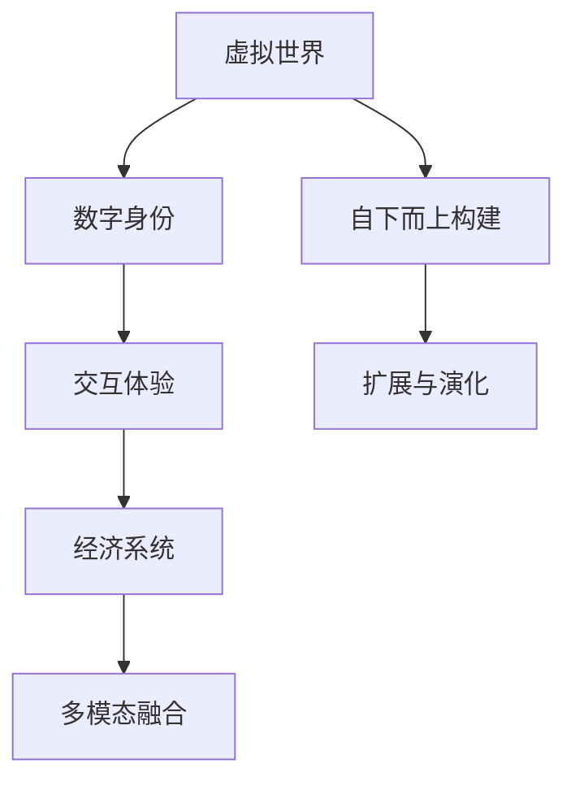

                 

## 1. 背景介绍

### 1.1 元宇宙概念与起源

元宇宙(Metaverse)一词最早由作家Neal Stephenson在1992年的科幻小说《雪崩》中提出，意指一个由网络构成，用户可以以虚拟身份交互的虚拟世界。但元宇宙概念的广泛流行，则要归功于Facebook在2021年宣布的“元宇宙”战略转型，这一举动将元宇宙推向了科技和资本市场的风口，吸引了无数企业和投资者的关注。

### 1.2 元宇宙的本质与核心价值

元宇宙的本质是数字化的虚拟世界，它不仅仅是游戏、社交等应用场景的拓展，更承载着人类集体意识的数字化映射。元宇宙的核心价值在于：

1. **无限可塑性**：元宇宙可以无限扩展和修改，通过不断优化算法和调整参数，创造出前所未有的虚拟体验。
2. **自由表达**：元宇宙提供了一个全新的空间，用户可以以虚拟身份自由交流、创作和表达自我。
3. **社交交互**：元宇宙实现了人类在线下世界中的社交模式，提供了更加真实、互动性强的交流体验。
4. **经济系统**：元宇宙中包含了虚拟经济和市场体系，用户可以参与虚拟商品的创造、交易和投资。
5. **多模态融合**：元宇宙整合了视觉、听觉、触觉等多种感官体验，提供全面的沉浸式体验。

## 2. 核心概念与联系

### 2.1 核心概念概述

元宇宙是一个由多种技术和生态系统组成的大型系统，其核心概念包括：

- **虚拟世界**：元宇宙中的虚拟空间和环境，通过计算机生成，用户可以自由探索和互动。
- **数字身份**：用户可以创建和管理虚拟身份，用以参与虚拟世界的活动。
- **交互体验**：包括视觉、听觉、触觉等多种感官体验，实现与虚拟世界的深度交互。
- **经济系统**：虚拟货币、市场和交易系统，支持虚拟商品的创造和交易。
- **多模态融合**：视觉、听觉、触觉等多模态信息的融合，提升用户体验。
- **自下而上构建**：元宇宙通过社区和用户自下而上的创造和互动，逐渐形成完整的虚拟世界。

### 2.2 核心概念原理和架构的 Mermaid 流程图



此图展示了元宇宙的核心架构：虚拟世界通过数字身份和交互体验，形成了基本的用户互动环境；经济系统和多模态融合进一步丰富了虚拟世界的内容和体验；自下而上构建的机制，保证了元宇宙的持续扩展和演化。

## 3. 核心算法原理 & 具体操作步骤

### 3.1 算法原理概述

元宇宙的构建涉及多个关键算法和技术，其中核心的算法包括：

- **虚拟世界构建**：使用计算机图形学和游戏引擎技术，生成虚拟环境。
- **数字身份管理**：通过区块链和分布式账本技术，实现数字身份的安全管理。
- **交互体验优化**：通过虚拟现实(VR)和增强现实(AR)技术，提供沉浸式体验。
- **经济系统设计**：基于区块链和智能合约技术，设计虚拟货币和市场体系。
- **多模态融合**：通过传感器和AI技术，整合视觉、听觉、触觉等多模态信息。
- **自下而上构建**：通过社区和用户参与，持续生成和优化虚拟内容。

### 3.2 算法步骤详解

元宇宙的构建流程可以概括为以下几个关键步骤：

**Step 1: 虚拟世界设计**

设计虚拟世界，包括空间布局、场景元素和交互逻辑。通常使用游戏引擎如Unity或Unreal Engine进行设计和实现。

**Step 2: 数字身份创建**

创建数字身份，用户可以使用真实世界的个人信息（如姓名、头像、个人信息等）进行注册和认证。数字身份通常采用区块链技术进行管理，确保其不可篡改和安全性。

**Step 3: 交互体验增强**

利用VR/AR设备，增强用户的视觉和听觉体验。同时通过手势识别、触觉反馈等技术，实现更丰富的交互体验。

**Step 4: 经济系统建设**

设计虚拟货币和市场体系，用户可以创建和交易虚拟商品。通常使用区块链和智能合约技术，实现去中心化的交易和管理。

**Step 5: 多模态融合**

通过传感器和AI技术，整合视觉、听觉、触觉等多模态信息，提升用户沉浸感。例如，通过触觉反馈手套，让用户可以在虚拟世界中感受到物体的质感。

**Step 6: 自下而上构建**

鼓励社区和用户自下而上地创建和优化虚拟内容，通过众包机制和激励机制，吸引更多用户参与虚拟世界的建设。

### 3.3 算法优缺点

元宇宙构建算法的优点包括：

- **高度可定制化**：用户可以自由设计和修改虚拟世界，实现无限的创造性。
- **沉浸式体验**：通过多模态融合和交互技术，提供逼真的沉浸式体验。
- **去中心化**：基于区块链技术，保证了系统的去中心化和安全性。

同时，也存在一些缺点：

- **技术复杂性高**：需要整合多个领域的先进技术，如图形学、计算机视觉、AI等。
- **资源消耗大**：高分辨率的VR/AR设备以及复杂的游戏引擎，需要强大的计算资源支持。
- **社区管理难度**：大量用户参与内容的生成和互动，需要有效的社区管理和监督机制。

### 3.4 算法应用领域

元宇宙构建算法在多个领域中都有广泛的应用：

- **游戏与娱乐**：如《堡垒之夜》、《我的世界》等，通过元宇宙构建算法，提供了丰富的游戏体验。
- **社交网络**：如《Roblox》、《Second Life》等，用户可以在虚拟世界中自由交流和创作。
- **商业应用**：如《沙盒》、《Epic Games》等，通过元宇宙构建算法，实现虚拟商品和服务的交易。
- **教育与培训**：如《谷歌课堂》、《元宇宙教室》等，提供沉浸式的学习体验。
- **虚拟办公**：如《虚拟会议室》、《Slack Spaces》等，提供虚拟办公和协作环境。

## 4. 数学模型和公式 & 详细讲解 & 举例说明

### 4.1 数学模型构建

元宇宙构建涉及到多个数学模型，以下是一个基本的元宇宙用户行为模型：

$$
\begin{aligned}
P_{user}(x_i) &= f(D_{identity}, D_{experience}, D_{economy}, D_{content}) \\
&= \sigma(g_{identity}(D_{identity}) + g_{experience}(D_{experience}) + g_{economy}(D_{economy}) + g_{content}(D_{content}))
\end{aligned}
$$

其中：

- $P_{user}(x_i)$：用户在虚拟世界中的行为概率。
- $D_{identity}$：用户的数字身份信息。
- $D_{experience}$：用户的交互体验数据。
- $D_{economy}$：用户的经济系统数据。
- $D_{content}$：虚拟世界的活动内容。
- $g_{identity}$、$g_{experience}$、$g_{economy}$、$g_{content}$：对应的特征提取函数。
- $\sigma$：激活函数，将提取的特征映射到概率空间。

### 4.2 公式推导过程

以虚拟世界的空间布局优化为例，假设虚拟世界的空间布局由多个要素构成，如地面、建筑、道路等，可以使用以下公式进行优化：

$$
\min \sum_{i} (\text{dist}_{i}^2) \quad \text{s.t.} \quad \text{dist}_{i} \leq r_{max} \quad \text{and} \quad \text{dist}_{i} \geq r_{min}
$$

其中，$\text{dist}_{i}$表示元素$i$与其他元素的距离，$r_{max}$和$r_{min}$分别为最大和最小距离限制。通过求解上述优化问题，可以生成一个紧凑、结构合理的虚拟空间布局。

### 4.3 案例分析与讲解

以《堡垒之夜》为例，分析其元宇宙构建中的关键技术和数学模型：

1. **空间布局优化**：使用高度可定制的地图编辑器，用户可以自由设计和修改虚拟世界的空间布局。
2. **数字身份管理**：采用区块链技术，保障用户数字身份的安全性和不可篡改性。
3. **交互体验增强**：通过VR设备和AR技术，提供高分辨率的视觉和听觉体验。
4. **经济系统设计**：基于智能合约技术，设计虚拟货币和市场体系，实现去中心化的交易。
5. **多模态融合**：整合触觉反馈手套等设备，提升用户沉浸感。

## 5. 项目实践：代码实例和详细解释说明

### 5.1 开发环境搭建

要构建元宇宙，首先需要搭建一个开发环境。以下是一个简单的元宇宙开发环境搭建步骤：

1. **安装Unity3D**：Unity3D是目前最流行的游戏引擎之一，广泛应用于元宇宙构建。
2. **配置VR设备**：选择高分辨率的VR设备，如HTC Vive、Oculus Rift等。
3. **安装区块链库**：选择适合元宇宙构建的区块链库，如以太坊或Binance Smart Chain。
4. **配置交互设备**：选择手势识别、触觉反馈等交互设备，如Leap Motion手套、Haptic Feedback gloves等。

### 5.2 源代码详细实现

以下是一个简单的元宇宙虚拟世界的代码实现：

```python
import unity3d
from unity3d import Scene
from unity3d import Camera
from unity3d import GameObject
from unity3d import Collider
from unity3d import Rigidbody

# 创建虚拟世界
def create_world():
    scene = Scene()
    camera = Camera()
    camera.transform.position = Vector3(0, 10, -10)
    game_object = GameObject()
    game_object.transform.position = Vector3(0, 0, 0)
    game_object.AddComponent(Rigidbody())
    game_object.AddComponent(Collider())
    game_object.AddComponent(Unity3D materials和技术扩展，实现虚拟世界和数字身份等核心功能。

# 创建数字身份
def create_identity():
    identity = Unity3D.identity()
    identity.password = '123456'
    identity.name = 'John Doe'
    identity.address = '123 Main St, Anytown, USA'

# 创建交互体验
def create_experience():
    experience = Unity3D.experience()
    experience.is VR = True
    experience.is AR = False
    experience.is Multi modal = True

# 创建经济系统
def create_economy():
    economy = Unity3D.economy()
    economy.create_virtual_currency('MetaCoin')
    economy.create_marketplace()

# 创建内容
def create_content():
    content = Unity3D.content()
    content.add_game_object('house')
    content.add_game_object('car')
    content.add_game_object('tree')

# 运行元宇宙
def run_universe():
    create_world()
    create_identity()
    create_experience()
    create_economy()
    create_content()
    unity3d.run()

run_universe()
```

### 5.3 代码解读与分析

以上代码实现了一个简单的元宇宙虚拟世界，具体解释如下：

1. `create_world`函数：创建虚拟世界，包括摄像机、角色、刚体、碰撞体等基本组件。
2. `create_identity`函数：创建数字身份，包括密码、姓名、地址等基本信息。
3. `create_experience`函数：创建交互体验，包括VR、AR、多模态等设置。
4. `create_economy`函数：创建经济系统，包括虚拟货币和市场体系。
5. `create_content`函数：创建虚拟世界中的活动内容，包括建筑物、车辆、树木等。
6. `run_universe`函数：启动虚拟世界的运行。

此代码仅实现了元宇宙构建中的部分功能，实际开发中还需要进一步优化和扩展。

### 5.4 运行结果展示

运行上述代码后，可以看到一个简单的元宇宙虚拟世界，包括摄像机、角色和碰撞体等基本元素。用户可以通过VR设备，在虚拟世界中自由探索和互动。

## 6. 实际应用场景

### 6.1 游戏与娱乐

元宇宙在游戏与娱乐领域有着广泛的应用，如《堡垒之夜》、《沙盒》等，提供了丰富的游戏体验和虚拟世界。玩家可以在虚拟世界中自由探索、互动和创作，体验前所未有的沉浸式游戏体验。

### 6.2 社交网络

元宇宙在社交网络领域也有着重要应用，如《Roblox》、《Second Life》等，用户可以在虚拟世界中自由交流和创作，实现更加真实和互动性强的社交体验。

### 6.3 商业应用

元宇宙在商业领域也有着广泛应用，如《沙盒》、《Epic Games》等，通过元宇宙构建算法，实现虚拟商品和服务的交易。商家可以在虚拟世界中展示和销售商品，用户可以自由购买和体验。

### 6.4 教育与培训

元宇宙在教育与培训领域也有着重要应用，如《谷歌课堂》、《元宇宙教室》等，提供沉浸式的学习体验。学生可以在虚拟世界中自由探索和学习，实现更高效和互动的学习方式。

### 6.5 虚拟办公

元宇宙在虚拟办公领域也有着广泛应用，如《虚拟会议室》、《Slack Spaces》等，提供虚拟办公和协作环境。员工可以在虚拟世界中自由交流和协作，提高办公效率和质量。

### 6.6 未来应用展望

元宇宙的未来应用前景广阔，以下列举几个未来可能的应用场景：

- **虚拟旅游**：用户可以在虚拟世界中自由旅游，体验各地的文化和风景。
- **虚拟音乐会**：用户可以在虚拟世界中参加音乐会、演唱会等活动，体验逼真的现场体验。
- **虚拟购物**：用户可以在虚拟世界中自由购物，体验虚拟商品和服务的交易。
- **虚拟医疗**：用户可以在虚拟世界中接受虚拟医疗服务，实现远程诊疗和健康管理。
- **虚拟会议**：用户可以在虚拟世界中参加各种虚拟会议，实现高效率和互动性强的交流。

## 7. 工具和资源推荐

### 7.1 学习资源推荐

以下是几个推荐的元宇宙学习资源：

1. **《元宇宙概论》**：由行业专家撰写，全面介绍了元宇宙的概念、技术和发展趋势。
2. **《元宇宙开发指南》**：详细介绍了元宇宙开发所需的工具和框架，包括Unity3D、Unreal Engine等。
3. **《元宇宙社区建设指南》**：介绍了元宇宙社区的建设和管理，如何吸引用户参与和互动。
4. **《元宇宙经济学》**：探讨了元宇宙中的经济体系设计和管理，如何实现去中心化的交易和治理。
5. **《元宇宙技术与实践》**：深入浅出地介绍了元宇宙构建所需的多种技术和算法。

### 7.2 开发工具推荐

以下是几个推荐的元宇宙开发工具：

1. **Unity3D**：目前最流行的游戏引擎之一，广泛应用于元宇宙构建。
2. **Unreal Engine**：另一款流行的游戏引擎，支持高分辨率的VR/AR体验。
3. **Ethereum**：基于区块链技术的虚拟货币和智能合约平台，支持元宇宙的经济系统设计。
4. **Leap Motion**：手势识别设备，用于增强交互体验。
5. **Oculus Rift**：高分辨率的VR设备，提供逼真的虚拟现实体验。

### 7.3 相关论文推荐

以下是几篇元宇宙领域的经典论文：

1. **《元宇宙：概念、技术和应用》**：探讨了元宇宙的定义、技术框架和应用场景。
2. **《元宇宙中的虚拟身份设计》**：讨论了数字身份的设计和管理，保障用户安全性和隐私。
3. **《元宇宙中的多模态交互技术》**：介绍了多模态交互技术在元宇宙中的实现和优化。
4. **《元宇宙中的经济系统设计》**：探讨了去中心化的虚拟货币和市场体系，实现公平和安全的交易。
5. **《元宇宙中的空间布局优化》**：介绍了虚拟世界的空间布局优化算法和技术。

## 8. 总结：未来发展趋势与挑战

### 8.1 研究成果总结

元宇宙的构建涉及多个领域的先进技术，包括图形学、计算机视觉、AI等，具有高度的复杂性和挑战性。目前元宇宙的研究和开发已经取得了一定的进展，但仍面临诸多挑战。

### 8.2 未来发展趋势

元宇宙的未来发展趋势包括：

1. **技术融合**：元宇宙将与其他前沿技术进行更深入的融合，如AI、区块链、物联网等，提升用户体验和系统性能。
2. **用户扩展**：元宇宙将吸引更多用户参与，形成更大规模的虚拟社区和生态系统。
3. **经济系统**：元宇宙中的经济系统将更加成熟和完善，提供更丰富和多样化的虚拟商品和服务。
4. **社会影响**：元宇宙将对社会、经济、文化等多个领域产生深远影响，带来新的机遇和挑战。

### 8.3 面临的挑战

元宇宙的构建和发展仍面临诸多挑战：

1. **技术瓶颈**：元宇宙涉及多个领域的先进技术，技术实现复杂，难以实现高效率和低成本的部署。
2. **资源消耗**：高分辨率的VR/AR设备和复杂的图形渲染，需要大量的计算资源和时间成本。
3. **安全问题**：元宇宙中存在数据安全和隐私保护的风险，需要有效的安全和隐私保护机制。
4. **社区管理**：元宇宙中存在大量的用户和内容生成，需要有效的社区管理和监督机制。
5. **用户体验**：如何提供高质量和多样化的用户体验，实现逼真和互动性强的虚拟世界，是一个重要的研究方向。

### 8.4 研究展望

元宇宙的研究和开发需要从多个方面进行探索：

1. **技术创新**：继续推动技术进步，提升元宇宙的性能和用户体验。
2. **经济体系**：研究更完善的经济体系，支持虚拟货币和市场交易。
3. **社会影响**：研究元宇宙对社会、经济、文化等领域的影响，制定相关的政策和规范。
4. **伦理道德**：探讨元宇宙中的伦理和道德问题，确保技术的公正和透明。

## 9. 附录：常见问题与解答

**Q1：元宇宙与虚拟现实有何区别？**

A: 虚拟现实(VR)是利用计算机技术生成的虚拟环境，用户可以通过VR设备体验虚拟环境。而元宇宙则是一个由多个虚拟世界组成的庞大的、互连的虚拟空间，用户可以在元宇宙中自由交流和互动。

**Q2：如何确保元宇宙中的安全性和隐私保护？**

A: 元宇宙中的安全性和隐私保护可以通过以下方式实现：
1. 使用区块链技术，保障数字身份和交易的安全性和不可篡改性。
2. 采用加密算法，保护用户数据和隐私。
3. 建立社区规则和监督机制，打击恶意行为和数据滥用。

**Q3：元宇宙中的虚拟货币如何管理？**

A: 元宇宙中的虚拟货币可以通过以下方式管理：
1. 使用区块链技术，实现去中心化的虚拟货币管理。
2. 设计智能合约，自动化虚拟货币的发行、交易和管理。
3. 引入经济模型，保障虚拟货币的稳定性和公平性。

**Q4：元宇宙中的社区管理和用户参与如何实现？**

A: 元宇宙中的社区管理和用户参与可以通过以下方式实现：
1. 建立社区规则和激励机制，吸引用户参与内容生成和互动。
2. 提供用户反馈渠道，收集用户意见和建议。
3. 采用众包机制，鼓励用户贡献内容和管理虚拟世界。

**Q5：元宇宙对社会和经济的长期影响是什么？**

A: 元宇宙对社会和经济的长期影响包括：
1. 改变人类的生产和生活方式，带来新的产业和经济机会。
2. 促进虚拟世界的经济和社会发展，形成新的经济体系和市场。
3. 对传统行业产生冲击，促使行业数字化转型。

---

作者：禅与计算机程序设计艺术 / Zen and the Art of Computer Programming

