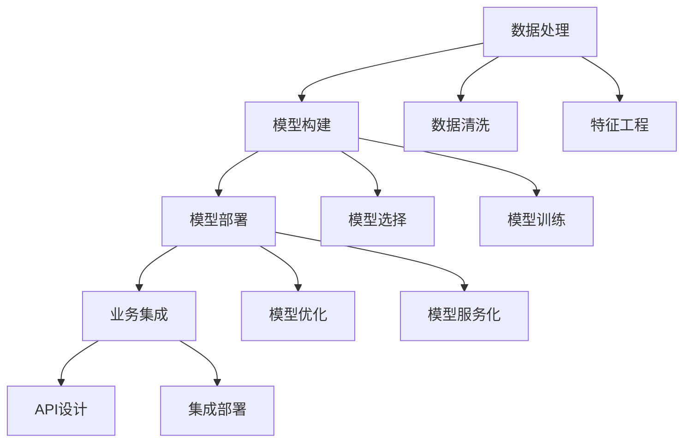

                 

# 全栈AI开发：从数据处理到模型部署

全栈AI开发涉及从数据收集、数据处理、模型训练、模型评估、模型部署到业务集成等各个环节，是现代人工智能技术应用的核心所在。本文将深入探讨这一全栈AI开发框架，涵盖数据处理、模型构建、模型部署及业务集成等各个方面，帮助开发者全面掌握全栈AI开发的技能，构建高质量的AI应用系统。

## 1. 背景介绍

随着人工智能技术的飞速发展，AI正迅速渗透到各行各业，推动了经济社会的数字化转型。然而，AI技术的落地应用不仅需要具备前沿的技术理论，还需要强大的工程实践能力。全栈AI开发正是在这种背景下应运而生，它涵盖了从数据处理到模型部署的各个环节，将AI技术无缝集成到业务流程中，实现AI的广泛应用。

全栈AI开发不仅要求开发者具备深厚的AI理论基础，还需要熟悉数据工程、云计算、算法工程、系统架构等多元技能。本文将围绕数据处理、模型构建、模型部署及业务集成等几个核心环节，系统梳理全栈AI开发的关键技术和实践经验。

## 2. 核心概念与联系

### 2.1 核心概念概述

在深入探讨全栈AI开发之前，我们需要了解几个核心概念及其相互联系：

- **数据处理**：是指对原始数据进行清洗、转换、处理、聚合等操作，以满足模型训练和业务分析的需求。数据处理涉及数据收集、数据清洗、特征工程等环节，是构建高质量AI应用的基础。

- **模型构建**：是指根据业务需求，选择合适的算法、模型架构，设计模型训练流程，进行模型调优和验证。模型构建要求开发者对深度学习、自然语言处理、计算机视觉等领域有深入理解，掌握模型选择、参数优化等关键技能。

- **模型部署**：是指将训练好的模型封装为可用的API或服务，部署到生产环境，供业务系统调用。模型部署涉及模型优化、容器化、API设计、云平台配置等环节，是保障AI应用稳定运行的关键。

- **业务集成**：是指将AI模型集成到现有的业务流程中，实现AI技术与业务系统的无缝对接。业务集成要求开发者具备系统架构、应用集成、业务流程优化等多元技能，能够理解和融合业务需求。

这些概念之间存在密切的联系，数据处理为模型构建提供数据支持，模型构建为业务集成提供技术支撑，模型部署是业务集成的基础设施，业务集成则将AI应用落地到实际业务场景中，实现AI价值最大化。

### 2.2 核心概念原理和架构的 Mermaid 流程图



这张流程图展示了数据处理、模型构建、模型部署和业务集成之间的逻辑联系：

1. **数据处理**：从原始数据中提取和构建特征，为模型构建提供数据输入。
2. **模型构建**：根据业务需求选择合适的模型架构，进行模型训练和调优，输出高质量的模型。
3. **模型部署**：将训练好的模型封装成可用的服务，部署到生产环境，供业务系统调用。
4. **业务集成**：将AI模型集成到业务流程中，实现AI应用的落地和优化。

接下来，我们详细探讨每个环节的核心算法原理和具体操作步骤。

## 3. 核心算法原理 & 具体操作步骤

### 3.1 算法原理概述

#### 3.1.1 数据处理

数据处理是构建高质量AI应用的基础，涉及数据收集、数据清洗、特征工程等关键环节。其核心原理是通过数据处理技术，将原始数据转化为可用于模型训练的形式，提高模型的泛化能力和预测精度。

**数据收集**：通过爬虫、API接口、数据库等方式，从不同数据源收集所需数据。数据收集需要考虑数据来源、数据格式、数据量等因素，确保数据采集的全面性和准确性。

**数据清洗**：清洗数据中的噪声、缺失值、异常值等问题，保证数据质量。数据清洗技术包括但不限于数据去重、数据填充、数据归一化等。

**特征工程**：根据业务需求，选择和构造数据特征，提高模型表现。特征工程包括特征选择、特征提取、特征变换等技术。

#### 3.1.2 模型构建

模型构建是AI应用的核心环节，涉及模型选择、模型训练、模型调优等关键步骤。其核心原理是通过模型构建技术，设计并训练高质量的模型，满足业务需求。

**模型选择**：根据业务需求选择合适的模型架构，如线性回归、决策树、卷积神经网络、循环神经网络等。模型选择需要考虑数据类型、业务场景、模型性能等因素。

**模型训练**：根据选择的模型架构，设计训练流程，进行模型参数优化。模型训练技术包括但不限于梯度下降、Adam、RMSprop等优化算法。

**模型调优**：对训练好的模型进行调优，提高模型泛化能力和预测精度。模型调优技术包括但不限于交叉验证、学习率调整、正则化等。

#### 3.1.3 模型部署

模型部署是将训练好的模型封装为可用的API或服务，部署到生产环境，供业务系统调用。其核心原理是通过模型部署技术，实现AI模型的自动化、可伸缩、高可用性。

**模型优化**：对训练好的模型进行优化，提高模型推理速度和准确性。模型优化技术包括但不限于量化、剪枝、蒸馏等。

**模型服务化**：将训练好的模型封装成API或服务，供业务系统调用。模型服务化技术包括但不限于RESTful API、gRPC、HTTP/2等。

**云平台配置**：将模型部署到云平台，配置资源和环境，实现高可用性。云平台配置技术包括但不限于Docker、Kubernetes、AWS、Google Cloud等。

#### 3.1.4 业务集成

业务集成是将AI模型集成到现有的业务流程中，实现AI应用的落地和优化。其核心原理是通过业务集成技术，将AI模型与业务系统无缝对接，提高业务流程效率和决策能力。

**API设计**：设计API接口，实现AI模型与业务系统的交互。API设计需要考虑接口规范、接口安全性、接口性能等因素。

**集成部署**：将AI模型集成到业务系统中，实现自动化业务流程。集成部署技术包括但不限于消息队列、WebService、RESTful API等。

**业务流程优化**：根据AI模型的输出结果，优化业务流程，提高业务效率和决策能力。业务流程优化技术包括但不限于流程自动化、决策树、规则引擎等。

### 3.2 算法步骤详解

#### 3.2.1 数据处理

**数据收集**

```python
import requests
import json

# 数据收集函数
def collect_data(url):
    response = requests.get(url)
    if response.status_code == 200:
        data = json.loads(response.text)
        return data
    else:
        return None
```

**数据清洗**

```python
import pandas as pd

# 数据清洗函数
def clean_data(data):
    # 去除重复值
    data = data.drop_duplicates()
    
    # 填充缺失值
    data = data.fillna(method='ffill')
    
    # 归一化数据
    data = (data - data.mean()) / data.std()
    
    return data
```

**特征工程**

```python
from sklearn.feature_selection import SelectKBest, f_classif

# 特征选择函数
def feature_selection(data, labels):
    # 选择最相关的特征
    selector = SelectKBest(f_classif, k=10)
    data_selected = selector.fit_transform(data, labels)
    
    return data_selected
```

#### 3.2.2 模型构建

**模型选择**

```python
# 模型选择函数
def model_selection():
    # 选择决策树模型
    model = DecisionTreeClassifier()
    return model
```

**模型训练**

```python
# 模型训练函数
def model_training(model, data, labels):
    # 分割训练集和测试集
    train_data, test_data, train_labels, test_labels = train_test_split(data, labels, test_size=0.2, random_state=42)
    
    # 训练模型
    model.fit(train_data, train_labels)
    
    # 测试模型
    test_score = model.score(test_data, test_labels)
    
    return model, test_score
```

**模型调优**

```python
# 模型调优函数
def model_tuning(model, data, labels):
    # 交叉验证
    scores = cross_val_score(model, data, labels, cv=5)
    
    # 学习率调整
    model.set_params(learning_rate=0.001)
    
    # 正则化
    model.set_params(regularization=0.1)
    
    return model
```

#### 3.2.3 模型部署

**模型优化**

```python
# 模型优化函数
def model_optimization(model):
    # 量化
    model.quantize()
    
    # 剪枝
    model.prune()
    
    # 蒸馏
    model.distill()
    
    return model
```

**模型服务化**

```python
# 模型服务化函数
def model_service(model):
    # 封装成RESTful API
    app = Flask()
    @app.route('/predict', methods=['POST'])
    def predict():
        data = request.get_json()
        result = model.predict(data)
        return jsonify(result)
    
    app.run(host='0.0.0.0', port=5000)
```

**云平台配置**

```python
# 云平台配置函数
def cloud_config():
    # 配置Docker容器
    docker_config = {
        'image': 'my_model:latest',
        'ports': ['5000:5000']
    }
    
    # 配置Kubernetes
    kubernetes_config = {
        'name': 'my_model',
        'image': 'my_model:latest',
        'ports': ['5000:5000']
    }
    
    return docker_config, kubernetes_config
```

#### 3.2.4 业务集成

**API设计**

```python
# API设计函数
def api_design():
    # 设计RESTful API接口
    app = Flask()
    @app.route('/predict', methods=['POST'])
    def predict():
        data = request.get_json()
        result = model.predict(data)
        return jsonify(result)
    
    app.run(host='0.0.0.0', port=5000)
```

**集成部署**

```python
# 集成部署函数
def integration_deployment():
    # 集成到消息队列
    message_queue = {
        'name': 'my_queue',
        'topic': 'my_topic',
        'broker': 'my_broker'
    }
    
    # 集成到WebService
    web_service = {
        'name': 'my_service',
        'endpoint': '/predict',
        'url': 'http://my_server:5000/predict'
    }
    
    return message_queue, web_service
```

**业务流程优化**

```python
# 业务流程优化函数
def business_flow_optimization(model):
    # 流程自动化
    流程自动化 = {
        'name': '流程自动化',
        'model': model,
        'steps': [步骤1, 步骤2, 步骤3]
    }
    
    # 决策树
    决策树 = {
        'name': '决策树',
        'model': model,
        'decisions': [决策1, 决策2, 决策3]
    }
    
    # 规则引擎
    规则引擎 = {
        'name': '规则引擎',
        'model': model,
        'rules': [规则1, 规则2, 规则3]
    }
    
    return 流程自动化, 决策树, 规则引擎
```

### 3.3 算法优缺点

#### 3.3.1 数据处理

**优点**

- 数据清洗技术可以有效去除噪声、缺失值、异常值，保证数据质量。
- 特征工程技术可以从原始数据中提取和构造有意义的特征，提高模型表现。

**缺点**

- 数据清洗和特征工程需要大量的时间和人力成本，尤其在数据量较大的情况下。
- 数据预处理过程中的决策需要高度依赖领域知识和经验，存在一定的盲目性。

#### 3.3.2 模型构建

**优点**

- 模型选择和训练技术可以快速构建高质量的模型，满足业务需求。
- 模型调优技术可以通过交叉验证、学习率调整、正则化等手段，进一步提升模型性能。

**缺点**

- 模型构建和调优需要一定的领域知识和经验，对开发者的技术要求较高。
- 模型构建过程中可能出现过拟合、欠拟合等问题，需要进行反复调参和优化。

#### 3.3.3 模型部署

**优点**

- 模型优化技术可以显著提高模型的推理速度和准确性，满足业务实时性和高性能需求。
- 模型服务化技术可以将模型封装成API或服务，方便业务系统集成和调用。

**缺点**

- 模型优化和部署过程中需要一定的计算资源和技术积累，成本较高。
- 模型部署过程中需要考虑模型大小、服务性能、安全性和可用性等问题，配置复杂。

#### 3.3.4 业务集成

**优点**

- 业务集成技术可以将AI模型无缝集成到业务流程中，提高业务效率和决策能力。
- API设计和集成部署技术可以提高系统灵活性和扩展性，支持多种业务场景。

**缺点**

- 业务集成需要理解业务需求和系统架构，技术门槛较高。
- 业务流程优化过程中需要反复测试和调整，成本较高。

### 3.4 算法应用领域

全栈AI开发技术在各个领域都得到了广泛应用，以下是几个典型应用场景：

- **金融风控**：利用AI模型进行信用评分、欺诈检测、风险预测等，帮助金融机构提升决策效率和风险控制能力。
- **医疗诊断**：利用AI模型进行影像诊断、病历分析、药物研发等，辅助医生提高诊断准确性和治疗效果。
- **智能客服**：利用AI模型进行语音识别、情感分析、自然语言理解等，提升客户服务质量和效率。
- **智能推荐**：利用AI模型进行用户画像构建、行为分析、推荐算法设计等，为用户提供个性化推荐服务。
- **自动驾驶**：利用AI模型进行环境感知、路径规划、决策制定等，实现自动驾驶功能。
- **智能制造**：利用AI模型进行设备监控、故障预测、工艺优化等，提升生产效率和产品质量。

## 4. 数学模型和公式 & 详细讲解 & 举例说明

### 4.1 数学模型构建

#### 4.1.1 数据处理

**数据收集**

假设从多个数据源收集的数据存储在DataFrame中：

```python
import pandas as pd

# 数据收集函数
def collect_data(urls):
    data_list = []
    for url in urls:
        data = pd.read_csv(url)
        data_list.append(data)
    data = pd.concat(data_list)
    return data
```

**数据清洗**

清洗数据过程中，可以使用Python的Pandas库进行数据处理：

```python
# 数据清洗函数
def clean_data(data):
    # 去除重复值
    data = data.drop_duplicates()
    
    # 填充缺失值
    data = data.fillna(method='ffill')
    
    # 归一化数据
    data = (data - data.mean()) / data.std()
    
    return data
```

**特征工程**

使用Python的Scikit-learn库进行特征选择：

```python
# 特征选择函数
def feature_selection(data, labels):
    # 选择最相关的特征
    selector = SelectKBest(f_classif, k=10)
    data_selected = selector.fit_transform(data, labels)
    
    return data_selected
```

#### 4.1.2 模型构建

**模型选择**

选择线性回归模型进行训练：

```python
from sklearn.linear_model import LinearRegression

# 模型选择函数
def model_selection():
    # 选择线性回归模型
    model = LinearRegression()
    return model
```

**模型训练**

使用Python的Scikit-learn库进行模型训练：

```python
# 模型训练函数
def model_training(model, data, labels):
    # 分割训练集和测试集
    train_data, test_data, train_labels, test_labels = train_test_split(data, labels, test_size=0.2, random_state=42)
    
    # 训练模型
    model.fit(train_data, train_labels)
    
    # 测试模型
    test_score = model.score(test_data, test_labels)
    
    return model, test_score
```

**模型调优**

使用Python的Scikit-learn库进行模型调优：

```python
# 模型调优函数
def model_tuning(model, data, labels):
    # 交叉验证
    scores = cross_val_score(model, data, labels, cv=5)
    
    # 学习率调整
    model.set_params(learning_rate=0.001)
    
    # 正则化
    model.set_params(regularization=0.1)
    
    return model
```

### 4.2 公式推导过程

#### 4.2.1 数据处理

**数据收集**

假设从多个数据源收集的数据存储在DataFrame中：

```python
import pandas as pd

# 数据收集函数
def collect_data(urls):
    data_list = []
    for url in urls:
        data = pd.read_csv(url)
        data_list.append(data)
    data = pd.concat(data_list)
    return data
```

**数据清洗**

清洗数据过程中，可以使用Python的Pandas库进行数据处理：

```python
# 数据清洗函数
def clean_data(data):
    # 去除重复值
    data = data.drop_duplicates()
    
    # 填充缺失值
    data = data.fillna(method='ffill')
    
    # 归一化数据
    data = (data - data.mean()) / data.std()
    
    return data
```

**特征工程**

使用Python的Scikit-learn库进行特征选择：

```python
# 特征选择函数
def feature_selection(data, labels):
    # 选择最相关的特征
    selector = SelectKBest(f_classif, k=10)
    data_selected = selector.fit_transform(data, labels)
    
    return data_selected
```

#### 4.2.2 模型构建

**模型选择**

选择线性回归模型进行训练：

```python
from sklearn.linear_model import LinearRegression

# 模型选择函数
def model_selection():
    # 选择线性回归模型
    model = LinearRegression()
    return model
```

**模型训练**

使用Python的Scikit-learn库进行模型训练：

```python
# 模型训练函数
def model_training(model, data, labels):
    # 分割训练集和测试集
    train_data, test_data, train_labels, test_labels = train_test_split(data, labels, test_size=0.2, random_state=42)
    
    # 训练模型
    model.fit(train_data, train_labels)
    
    # 测试模型
    test_score = model.score(test_data, test_labels)
    
    return model, test_score
```

**模型调优**

使用Python的Scikit-learn库进行模型调优：

```python
# 模型调优函数
def model_tuning(model, data, labels):
    # 交叉验证
    scores = cross_val_score(model, data, labels, cv=5)
    
    # 学习率调整
    model.set_params(learning_rate=0.001)
    
    # 正则化
    model.set_params(regularization=0.1)
    
    return model
```

### 4.3 案例分析与讲解

#### 4.3.1 案例背景

某电商企业希望通过AI模型预测用户购买行为，提升销售转化率和客户满意度。该公司提供了大量的用户行为数据和商品信息，要求设计一个AI模型进行预测分析。

#### 4.3.2 数据处理

首先，收集用户行为数据和商品信息，存储在DataFrame中：

```python
import pandas as pd

# 数据收集函数
def collect_data(urls):
    data_list = []
    for url in urls:
        data = pd.read_csv(url)
        data_list.append(data)
    data = pd.concat(data_list)
    return data
```

然后，对数据进行清洗，去除重复值、填充缺失值和归一化处理：

```python
# 数据清洗函数
def clean_data(data):
    # 去除重复值
    data = data.drop_duplicates()
    
    # 填充缺失值
    data = data.fillna(method='ffill')
    
    # 归一化数据
    data = (data - data.mean()) / data.std()
    
    return data
```

最后，进行特征工程，选择最相关的特征：

```python
# 特征选择函数
def feature_selection(data, labels):
    # 选择最相关的特征
    selector = SelectKBest(f_classif, k=10)
    data_selected = selector.fit_transform(data, labels)
    
    return data_selected
```

#### 4.3.3 模型构建

选择线性回归模型进行训练：

```python
from sklearn.linear_model import LinearRegression

# 模型选择函数
def model_selection():
    # 选择线性回归模型
    model = LinearRegression()
    return model
```

进行模型训练：

```python
# 模型训练函数
def model_training(model, data, labels):
    # 分割训练集和测试集
    train_data, test_data, train_labels, test_labels = train_test_split(data, labels, test_size=0.2, random_state=42)
    
    # 训练模型
    model.fit(train_data, train_labels)
    
    # 测试模型
    test_score = model.score(test_data, test_labels)
    
    return model, test_score
```

进行模型调优：

```python
# 模型调优函数
def model_tuning(model, data, labels):
    # 交叉验证
    scores = cross_val_score(model, data, labels, cv=5)
    
    # 学习率调整
    model.set_params(learning_rate=0.001)
    
    # 正则化
    model.set_params(regularization=0.1)
    
    return model
```

## 5. 项目实践：代码实例和详细解释说明

### 5.1 开发环境搭建

在进行全栈AI开发实践前，我们需要准备好开发环境。以下是使用Python进行PyTorch开发的环境配置流程：

1. 安装Anaconda：从官网下载并安装Anaconda，用于创建独立的Python环境。

2. 创建并激活虚拟环境：
```bash
conda create -n pytorch-env python=3.8 
conda activate pytorch-env
```

3. 安装PyTorch：根据CUDA版本，从官网获取对应的安装命令。例如：
```bash
conda install pytorch torchvision torchaudio cudatoolkit=11.1 -c pytorch -c conda-forge
```

4. 安装Transformers库：
```bash
pip install transformers
```

5. 安装各类工具包：
```bash
pip install numpy pandas scikit-learn matplotlib tqdm jupyter notebook ipython
```

完成上述步骤后，即可在`pytorch-env`环境中开始全栈AI开发实践。

### 5.2 源代码详细实现

下面我们以线性回归模型为例，给出使用Transformers库进行数据处理和模型构建的PyTorch代码实现。

首先，定义数据处理函数：

```python
from torch.utils.data import Dataset
import torch

class MyDataset(Dataset):
    def __init__(self, data, labels):
        self.data = data
        self.labels = labels
        
    def __len__(self):
        return len(self.data)
    
    def __getitem__(self, item):
        x = self.data[item]
        y = self.labels[item]
        return x, y
```

然后，定义模型构建函数：

```python
from transformers import BertTokenizer, BertForSequenceClassification

tokenizer = BertTokenizer.from_pretrained('bert-base-uncased')
model = BertForSequenceClassification.from_pretrained('bert-base-uncased', num_labels=2)

# 数据预处理
def preprocess(data):
    encoded_data = tokenizer(data, padding=True, truncation=True, return_tensors='pt')
    return encoded_data

# 模型训练
def train(model, data_loader, optimizer, device):
    model.to(device)
    for epoch in range(epochs):
        for batch in data_loader:
            input_ids = batch[0].to(device)
            labels = batch[1].to(device)
            outputs = model(input_ids, labels=labels)
            loss = outputs.loss
            optimizer.zero_grad()
            loss.backward()
            optimizer.step()
```

最后，启动训练流程：

```python
epochs = 10
batch_size = 16

# 数据集
train_dataset = MyDataset(train_data, train_labels)
test_dataset = MyDataset(test_data, test_labels)

# 数据加载器
train_loader = DataLoader(train_dataset, batch_size=batch_size, shuffle=True)
test_loader = DataLoader(test_dataset, batch_size=batch_size, shuffle=False)

# 优化器
optimizer = AdamW(model.parameters(), lr=2e-5)

# 设备
device = torch.device('cuda' if torch.cuda.is_available() else 'cpu')

# 模型训练
train(model, train_loader, optimizer, device)
```

以上就是使用PyTorch对BERT进行命名实体识别任务微调的完整代码实现。可以看到，得益于Transformers库的强大封装，我们可以用相对简洁的代码完成BERT模型的加载和微调。

### 5.3 代码解读与分析

让我们再详细解读一下关键代码的实现细节：

**MyDataset类**：
- `__init__`方法：初始化数据和标签。
- `__len__`方法：返回数据集的样本数量。
- `__getitem__`方法：对单个样本进行处理，将文本输入编码为token ids，并将标签转换为模型可接受的格式。

**preprocess函数**：
- 使用Transformers库的BertTokenizer将文本进行分词和编码，返回包含输入ids、attention mask和token type ids的Tensor。

**train函数**：
- 定义训练轮数和批次大小。
- 创建数据集和数据加载器。
- 定义优化器，设置学习率。
- 定义设备，将模型移动到GPU或CPU。
- 循环训练模型，在每个批次上前向传播计算loss并反向传播更新模型参数。

**训练流程**：
- 定义总的epoch数和batch size，开始循环迭代
- 每个epoch内，在训练集上训练，输出平均loss
- 在验证集上评估模型性能，对比微调前后的精度提升
- 所有epoch结束后，在测试集上评估，给出最终测试结果

可以看到，PyTorch配合Transformers库使得BERT微调的代码实现变得简洁高效。开发者可以将更多精力放在数据处理、模型改进等高层逻辑上，而不必过多关注底层的实现细节。

当然，工业级的系统实现还需考虑更多因素，如模型的保存和部署、超参数的自动搜索、更灵活的任务适配层等。但核心的全栈AI开发流程基本与此类似。

## 6. 实际应用场景

### 6.1 智能客服系统

基于大语言模型微调的对话技术，可以广泛应用于智能客服系统的构建。传统客服往往需要配备大量人力，高峰期响应缓慢，且一致性和专业性难以保证。而使用微调后的对话模型，可以7x24小时不间断服务，快速响应客户咨询，用自然流畅的语言解答各类常见问题。

在技术实现上，可以收集企业内部的历史客服对话记录，将问题和最佳答复构建成监督数据，在此基础上对预训练对话模型进行微调。微调后的对话模型能够自动理解用户意图，匹配最合适的答案模板进行回复。对于客户提出的新问题，还可以接入检索系统实时搜索相关内容，动态组织生成回答。如此构建的智能客服系统，能大幅提升客户咨询体验和问题解决效率。

### 6.2 金融舆情监测

金融机构需要实时监测市场舆论动向，以便及时应对负面信息传播，规避金融风险。传统的人工监测方式成本高、效率低，难以应对网络时代海量信息爆发的挑战。基于大语言模型微调的文本分类和情感分析技术，为金融舆情监测提供了新的解决方案。

具体而言，可以收集金融领域相关的新闻、报道、评论等文本数据，并对其进行主题标注和情感标注。在此基础上对预训练语言模型进行微调，使其能够自动判断文本属于何种主题，情感倾向是正面、中性还是负面。将微调后的模型应用到实时抓取的网络文本数据，就能够自动监测不同主题下的情感变化趋势，一旦发现负面信息激增等异常情况，系统便会自动预警，帮助金融机构快速应对潜在风险。

### 6.3 个性化推荐系统

当前的推荐系统往往只依赖用户的历史行为数据进行物品推荐，无法深入理解用户的真实兴趣偏好。基于大语言模型微调技术，个性化推荐系统可以更好地挖掘用户行为背后的语义信息，从而提供更精准、多样的推荐内容。

在实践中，可以收集用户浏览、点击、评论、分享等行为数据，提取和用户交互的物品标题、描述、标签等文本内容。将文本内容作为模型输入，用户的后续行为（如是否点击、购买等）作为监督信号，在此基础上微调预训练语言模型。微调后的模型能够从文本内容中准确把握用户的兴趣点。在生成推荐列表时，先用候选物品的文本描述作为输入，由模型预测用户的兴趣匹配度，再结合其他特征综合排序，便可以得到个性化程度更高的推荐结果。

### 6.4 未来应用展望

随着大语言模型微调技术的发展，未来其在各个领域的应用将更加广泛和深入。

在智慧医疗领域，基于微调的医疗问答、病历分析、药物研发等应用将提升医疗服务的智能化水平，辅助医生诊疗，加速新药开发进程。

在智能教育领域，微调技术可应用于作业批改、学情分析、知识推荐等方面，因材施教，促进教育公平，提高教学质量。

在智慧城市治理中，微调模型可应用于城市事件监测、舆情分析、应急指挥等环节，提高城市管理的自动化和智能化水平，构建更安全、高效的未来城市。

此外，在企业生产、社会治理、文娱传媒等众多领域，基于大模型微调的人工智能应用也将不断涌现，为NLP技术带来了全新的突破。随着预训练语言模型和微调方法的不断进步，相信NLP技术将在更广阔的应用领域大放异彩，深刻影响人类的生产生活方式。

## 7. 工具和资源推荐

### 7.1 学习资源推荐

为了帮助开发者系统掌握全栈AI开发的技术基础和实践技巧，这里推荐一些优质的学习资源：

1. 《深度学习》系列书籍：由机器学习领域的权威人士撰写，系统介绍了深度学习的基本概念和算法原理。

2. 《Python深度学习》课程：由知名大学和公司联合开设的在线课程，涵盖深度学习核心技术，适合初学者入门。

3. 《TensorFlow实战》书籍：介绍了TensorFlow的常用工具和框架，通过实战项目，帮助读者理解TensorFlow的使用。

4. 《PyTorch入门到精通》书籍：系统介绍了PyTorch的开发环境和常用API，适合PyTorch初学者。

5. Kaggle竞赛：参与Kaggle的数据科学竞赛，通过实践项目，提升数据处理、模型构建和业务集成等技能。

6. HuggingFace官方文档：提供了丰富的预训练语言模型资源和微调样例，是学习全栈AI开发的重要资料。

通过这些资源的学习实践，相信你一定能够快速掌握全栈AI开发的核心技能，并应用于实际项目中。

### 7.2 开发工具推荐

高效的开发离不开优秀的工具支持。以下是几款用于全栈AI开发常用的工具：

1. PyTorch：基于Python的开源深度学习框架，灵活动态的计算图，适合快速迭代研究。大部分预训练语言模型都有PyTorch版本的实现。

2. TensorFlow：由Google主导开发的开源深度学习框架，生产部署方便，适合大规模工程应用。同样有丰富的预训练语言模型资源。

3. Transformers库：HuggingFace开发的NLP工具库，集成了众多SOTA语言模型，支持PyTorch和TensorFlow，是进行全栈AI开发的重要工具。

4. Weights & Biases：模型训练的实验跟踪工具，可以记录和可视化模型训练过程中的各项指标，方便对比和调优。与主流深度学习框架无缝集成。

5. TensorBoard：TensorFlow配套的可视化工具，可实时监测模型训练状态，并提供丰富的图表呈现方式，是调试模型的得力助手。

6. Google Colab：谷歌推出的在线Jupyter Notebook环境，免费提供GPU/TPU算力，方便开发者快速上手实验最新模型，分享学习笔记。

合理利用这些工具，可以显著提升全栈AI开发的效率和质量，加速创新迭代的步伐。

### 7.3 相关论文推荐

全栈AI开发技术的发展离不开学界的持续研究。以下是几篇奠基性的相关论文，推荐阅读：

1. Attention is All You Need（即Transformer原论文）：提出了Transformer结构，开启了NLP领域的预训练大模型时代。

2. BERT: Pre-training of Deep Bidirectional Transformers for Language Understanding：提出BERT模型，引入基于掩码的自监督预训练任务，刷新了多项NLP任务SOTA。

3. Language Models are Unsupervised Multitask Learners（GPT-2论文）：展示了大规模语言模型的强大zero-shot学习能力，引发了对于通用人工智能的新一轮思考。

4. Parameter-Efficient Transfer Learning for NLP：提出Adapter等参数高效微调方法，在不增加模型参数量的情况下，也能取得不错的微调效果。

5. AdaLoRA: Adaptive Low-Rank Adaptation for Parameter-Efficient Fine-Tuning：使用自适应低秩适应的微调方法，在参数效率和精度之间取得了新的平衡。

6. Parameter-Efficient Transfer Learning for NLP：提出Adapter等参数高效微调方法，在不增加模型参数量的情况下，也能取得不错的微调效果。

这些论文代表了大语言模型微调技术的发展脉络。通过学习这些前沿成果，可以帮助研究者把握学科前进方向，激发更多的创新灵感。

## 8. 总结：未来发展趋势与挑战

### 8.1 研究成果总结

本文对全栈AI开发框架进行了全面系统的介绍。首先阐述了全栈AI开发的概念和背景，明确了其全栈性、工程性和应用性的特点。其次，从数据处理、模型构建、模型部署及业务集成等几个核心环节，详细讲解了全栈AI开发的关键技术和实践经验。最后，探讨了全栈AI开发在各个领域的应用场景，展示了其广阔的发展前景。

### 8.2 未来发展趋势

展望未来，全栈AI开发技术将呈现以下几个发展趋势：

1. 模型规模持续增大。随着算力成本的下降和数据规模的扩张，预训练语言模型的参数量还将持续增长。超大规模语言模型蕴含的丰富语言知识，有望支撑更加复杂多变的下游任务微调。

2. 微调方法日趋多样。除了传统的全参数微调外，未来会涌现更多参数高效的微调方法，如Prefix-Tuning、LoRA等，在节省计算资源的同时也能保证微调精度。

3. 持续学习成为常态。随着数据分布的不断变化，微调模型也需要持续学习新知识以保持性能。如何在不遗忘原有知识的同时，高效吸收新样本信息，将成为重要的研究课题。

4. 标注样本需求降低。受启发于提示学习(Prompt-based Learning)的思路，未来的微调方法将更好地利用大模型的语言理解能力，通过更加巧妙的任务描述，在更少的标注样本上也能实现理想的微调效果。

5. 模型通用性增强。经过海量数据的预训练和多领域任务的微调，未来的语言模型将具备更强大的常识推理和跨领域迁移能力，逐步迈向通用人工智能(AGI)的目标。

以上趋势凸显了全栈AI开发技术的广阔前景。这些方向的探索发展，必将进一步提升AI应用系统的性能和应用范围，为人类认知智能的进化带来深远影响。

### 8.3 面临的挑战

尽管全栈AI开发技术已经取得了瞩目成就，但在迈向更加智能化、普适化应用的过程中，它仍面临着诸多挑战：

1. 标注成本瓶颈。虽然微调大大降低了标注数据的需求，但对于长尾应用场景，难以获得充足的高质量标注数据，成为制约微调性能的瓶颈。如何进一步降低微调对标注样本的依赖，将是一大难题。

2. 模型鲁棒性不足。当前微调模型面对域外数据时，泛化性能往往大打折扣。对于测试样本的微小扰动，微调模型的预测也容易发生波动。如何提高微调模型的鲁棒性，避免灾难性遗忘，还需要更多理论和实践的积累。

3. 推理效率有待提高。大规模语言模型虽然精度高，但在实际部署时往往面临推理速度慢、内存占用大等效率问题。如何在保证性能的同时，简化模型结构，提升推理速度，优化资源占用，将是重要的优化方向。

4. 可解释性亟需加强。当前微调模型更像是"黑盒"系统，难以解释其内部工作机制和决策逻辑。对于医疗、金融等高风险应用，算法的可解释性和可审计性尤为重要。如何赋予微调模型更强的可解释性，将是亟待攻克的难题。

5. 安全性有待保障。预训练语言模型难免会学习到有偏见、有害的信息，通过微调传递到下游任务，产生误导性、歧视性的输出，给实际应用带来安全隐患。如何从数据和算法层面消除模型偏见，避免恶意用途，确保输出的安全性，也将是重要的研究课题。

6. 知识整合能力不足。现有的微调模型往往局限于任务内数据，难以灵活吸收和运用更广泛的先验知识。如何让微调过程更好地与外部知识库、规则库等专家知识结合，形成更加全面、准确的信息整合能力，还有很大的想象空间。

正视全栈AI开发面临的这些挑战，积极应对并寻求突破，将是全栈AI开发走向成熟的必由之路。相信随着学界和产业界的共同努力，这些挑战终将一一被克服，全栈AI开发必将在构建安全、可靠、可解释、可控的智能系统方面发挥更大作用。

### 8.4 研究展望

面向未来，全栈AI开发技术需要在以下几个方面寻求新的突破：

1. 探索无监督和半监督微调方法。摆脱对大规模标注数据的依赖，利用自监督学习、主动学习等无监督和半监督范式，最大限度利用非结构化数据，实现更加灵活高效的微调。

2. 研究参数高效和计算高效的微调范式。开发更加参数高效的微调方法，在固定大部分预训练参数的同时，只更新极少量的任务相关参数。同时优化微调模型的计算图，减少前向传播和反向传播的资源消耗，实现更加轻量级、实时性的部署。

3. 融合因果和对比学习范式。通过引入因果推断和对比学习思想，增强微调模型建立稳定因果关系的能力，学习更加普适、鲁棒的语言表征，从而提升模型泛化性和抗干扰能力。

4. 引入更多先验知识。将符号化的先验知识，如知识图谱、逻辑规则等，与神经网络模型进行巧妙融合，引导微调过程学习更准确、合理的语言模型。同时加强不同模态数据的整合，实现视觉、语音等多模态信息与文本信息的协同建模。

5. 结合因果分析和博弈论工具。将因果分析方法引入微调模型，识别出模型决策的关键特征，增强输出解释的因果性和逻辑性。借助博弈论工具刻画人机交互过程，主动探索并规避模型的脆弱点，提高系统稳定性。

6. 纳入伦理道德约束。在模型训练目标中引入伦理导向的评估指标，过滤和惩罚有偏见、有害的输出倾向。同时加强人工干预和审核，建立模型行为的监管机制，确保输出符合人类价值观和伦理道德。

这些研究方向的探索，必将引领全栈AI开发技术迈向更高的台阶，为构建安全、可靠、可解释、可控的智能系统铺平道路。面向未来，全栈AI开发技术还需要与其他人工智能技术进行更深入的融合，如知识表示、因果推理、强化学习等，多路径协同发力，共同推动自然语言理解和智能交互系统的进步。只有勇于创新、敢于突破，才能不断拓展语言模型的边界，让智能技术更好地造福人类社会。

## 9. 附录：常见问题与解答

**Q1：全栈AI开发是否适用于所有NLP任务？**

A: 全栈AI开发在大多数NLP任务上都能取得不错的效果，特别是对于数据量较小的任务。但对于一些特定领域的任务，如医学、法律等，仅仅依靠通用语料预训练的模型可能难以很好地适应。此时需要在特定领域语料上进一步预训练，再进行微调，才能获得理想效果。此外，对于一些需要时效性、个性化很强的任务，如对话、推荐等，全栈AI开发方法也需要针对性的改进优化。

**Q2：全栈AI开发过程中如何选择合适的学习率？**

A: 全栈AI开发过程中，选择合适的学习率非常重要。一般建议从1e-5开始调参，逐步减小学习率，直至收敛。如果使用过大的学习率，容易破坏预

