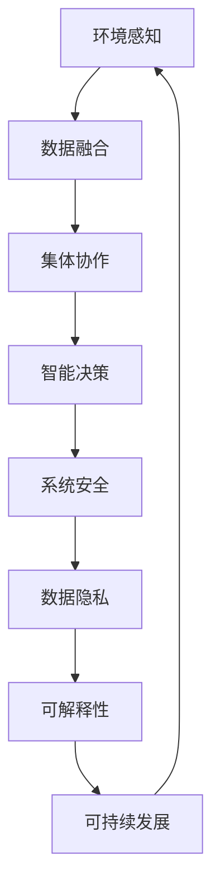

                 

# 全球脑与全球环境：集体合作的环境治理

> 关键词：全球脑,环境治理,环境感知,集体协作,智能决策,系统安全,可解释性,可持续发展,数据驱动,模型优化

## 1. 背景介绍

### 1.1 问题由来
随着地球环境问题的日益严重，如何在全球尺度上实现环境治理，已成为一个迫切需要解决的问题。传统的环境监测与治理依赖于地面监测和人工干预，效率低下，难以适应复杂多变的自然环境。而通过人工智能（AI）和大数据技术，可以实时监测和分析全球环境数据，从而实现更高效、精准的环境治理。

全球脑的概念，源自生物神经元协同工作的模式。类比到计算机科学中，全球脑可以视为一个全球尺度、协同工作的网络，将不同国家和地区的环保数据和监测设备连接起来，形成了一个庞大的“大脑”，可以实时感知全球环境状态，并协同进行环境治理。

### 1.2 问题核心关键点
全球脑的环境治理范式，涉及以下几个关键点：

- **环境感知与数据融合**：从全球各地收集环境数据，并进行融合，形成统一的全球环境感知。
- **集体协作与智能决策**：将环境感知结果转化为智能决策，并在全球尺度上进行集体协作，实现高效的环境治理。
- **系统安全与数据隐私**：确保全球脑系统的安全，保护环境数据的隐私，防止恶意攻击和数据泄露。
- **可解释性**：提升模型的可解释性，使得环境治理决策透明、可信。
- **可持续发展**：确保全球脑系统不仅高效，还要支持可持续发展，防止对环境的二次破坏。

## 2. 核心概念与联系

### 2.1 核心概念概述

全球脑的环境治理，是一个复杂的多学科交叉问题，涉及多个核心概念：

- **环境感知（Environmental Perception）**：通过传感器、遥感卫星等技术，收集全球环境数据，如空气质量、水质、土壤监测等。
- **数据融合（Data Fusion）**：将不同来源、不同格式的环境数据进行融合，形成统一的全球环境感知。
- **集体协作（Collaborative Governance）**：在全球尺度上，不同国家和组织协同工作，共同进行环境治理。
- **智能决策（Intelligent Decision Making）**：基于环境感知和数据融合结果，自动生成智能决策，指导环境治理行动。
- **系统安全（System Security）**：确保全球脑系统的安全和稳定，防止恶意攻击和数据泄露。
- **数据隐私（Data Privacy）**：保护环境数据的隐私，确保数据的合法使用。
- **可解释性（Explainability）**：提升模型的可解释性，使得环境治理决策透明、可信。
- **可持续发展（Sustainability）**：确保全球脑系统不仅高效，还要支持可持续发展，防止对环境的二次破坏。

这些概念之间的联系可以通过以下Mermaid流程图来展示：



这个流程图展示了一个基于全球脑的智能环境治理流程：

1. 通过环境感知获取全球环境数据。
2. 对不同来源的环境数据进行数据融合，形成统一的全球环境感知。
3. 在集体协作框架下，不同国家和组织共同进行智能决策。
4. 在智能决策基础上，自动生成环境治理行动方案。
5. 系统安全和数据隐私保障措施保护整个系统。
6. 提升模型的可解释性，确保决策透明可信。
7. 确保环境治理措施符合可持续发展目标。

## 3. 核心算法原理 & 具体操作步骤
### 3.1 算法原理概述

全球脑环境治理的算法原理，是一个典型的多层次、多目标优化问题。其核心思想是：将全球范围内的环境数据进行融合，形成统一的全球环境感知；在智能决策框架下，对环境治理任务进行协同优化；最终确保系统安全和可持续发展目标的实现。

形式化地，假设全球环境感知为 $E$，集体协作任务为 $T$，智能决策模型为 $D$，系统安全保障为目标 $S$，可持续发展目标为 $U$。则优化目标可以表示为：

$$
\mathop{\arg\min}_{E, T, D, S, U} \mathcal{L}(E, T, D, S, U)
$$

其中 $\mathcal{L}$ 为综合损失函数，衡量全球脑系统的整体性能。在实际应用中，通常采用加权和的形式，将环境感知、集体协作、智能决策、系统安全和可持续发展目标综合考虑。

### 3.2 算法步骤详解

全球脑环境治理的具体操作步骤如下：

**Step 1: 数据收集与融合**
- 使用传感器、遥感卫星等技术，收集全球范围内的环境数据。
- 对不同来源、不同格式的数据进行格式转换、数据清洗和预处理。
- 应用数据融合技术，如卡尔曼滤波、深度学习等，将不同来源的环境数据进行融合，形成统一的全球环境感知 $E$。

**Step 2: 任务规划与协作优化**
- 根据全球环境感知结果，定义环境治理任务 $T$，如空气污染控制、水资源管理等。
- 在集体协作框架下，不同国家和组织共同制定环境治理策略，通过多智能体系统或协同优化算法进行任务规划，形成协同优化方案 $T^*$。
- 应用优化算法，如遗传算法、强化学习等，优化协同方案，提高整体环境治理效率。

**Step 3: 智能决策与行动执行**
- 应用智能决策模型 $D$，将协同方案 $T^*$ 转化为具体的智能决策。
- 根据智能决策，自动生成环境治理行动方案，如调整工业排污、实施水资源管理等。
- 将环境治理行动方案分配给相应的执行机构，执行具体的环境治理任务。

**Step 4: 安全保障与可持续发展**
- 应用系统安全保障措施，如加密技术、访问控制等，保护数据隐私和系统安全。
- 定期评估全球脑系统的性能，确保系统安全和可持续发展目标的实现。
- 根据评估结果，调整智能决策模型和优化算法，确保系统动态适应环境变化。

### 3.3 算法优缺点

全球脑环境治理的算法有以下优点：
1. **全局视角**：通过全球脑系统，可以实时感知全球环境状态，实现全局视角下的环境治理。
2. **协同优化**：不同国家和组织协同工作，共同制定环境治理策略，提高整体治理效率。
3. **智能决策**：基于深度学习等智能算法，自动生成环境治理决策，减少人为干预。
4. **系统安全**：应用加密、访问控制等技术，保护数据隐私和系统安全。
5. **可解释性**：通过可解释性技术，提升模型的决策透明性，增强信任。
6. **可持续发展**：确保环境治理措施符合可持续发展目标，防止对环境的二次破坏。

同时，该算法也存在一些局限性：
1. **数据融合难度大**：不同来源的环境数据格式、质量不同，融合难度大。
2. **协同治理复杂**：不同国家和组织之间协作复杂，需要高效的沟通机制。
3. **智能决策局限性**：当前智能决策算法仍存在局限，可能无法应对极端环境变化。
4. **系统安全挑战**：全球脑系统涉及大量敏感数据，安全挑战较大。
5. **可解释性不足**：部分智能决策算法不透明，难以解释。
6. **成本高**：全球脑系统的建设、维护成本高，需要大量资金和技术支持。

尽管存在这些局限性，但全球脑系统在全球环境治理中仍然具有重要意义。通过优化算法和技术手段，可以克服这些局限性，实现更高效、精准的环境治理。

### 3.4 算法应用领域

全球脑环境治理的算法，已在多个领域得到应用，例如：

- **大气污染治理**：通过融合全球大气监测数据，自动生成大气污染治理方案，如调整工业排污、优化交通管理等。
- **水资源管理**：集成全球水资源监测数据，自动生成水资源管理策略，如优化水资源调度、防治水体污染等。
- **森林资源保护**：利用卫星遥感技术，实时监测全球森林覆盖率，自动生成森林保护方案，如植树造林、防火减灾等。
- **海洋环境监测**：融合全球海洋监测数据，自动生成海洋环境治理方案，如海洋污染控制、海洋生态修复等。
- **气候变化应对**：集成全球气候数据，自动生成气候变化应对策略，如减缓碳排放、适应气候变化等。

除了上述这些经典应用外，全球脑系统还被创新性地应用于更多场景中，如灾害预警、应急响应、环境监测等，为全球环境治理提供了新的技术支持。

## 4. 数学模型和公式 & 详细讲解
### 4.1 数学模型构建

本节将使用数学语言对全球脑环境治理的算法模型进行更加严格的刻画。

设全球环境感知为 $E$，集体协作任务为 $T$，智能决策模型为 $D$，系统安全保障为目标 $S$，可持续发展目标为 $U$。假设环境感知、集体协作、智能决策、系统安全和可持续发展目标的权重分别为 $\omega_E, \omega_T, \omega_D, \omega_S, \omega_U$。则综合损失函数 $\mathcal{L}$ 可以表示为：

$$
\mathcal{L}(E, T, D, S, U) = \omega_E \mathcal{L}_E(E) + \omega_T \mathcal{L}_T(T) + \omega_D \mathcal{L}_D(D) + \omega_S \mathcal{L}_S(S) + \omega_U \mathcal{L}_U(U)
$$

其中 $\mathcal{L}_E, \mathcal{L}_T, \mathcal{L}_D, \mathcal{L}_S, \mathcal{L}_U$ 分别表示环境感知、集体协作、智能决策、系统安全和可持续发展目标的损失函数。

### 4.2 公式推导过程

以下我们以大气污染治理为例，推导全球脑系统的综合损失函数及其梯度计算公式。

假设大气污染治理任务为 $T$，环境感知 $E$ 包含了不同地区、不同时间的空气质量数据，智能决策模型 $D$ 可以自动生成污染控制策略。系统安全目标 $S$ 要求数据传输和存储安全，可持续发展目标 $U$ 要求环境治理措施符合环境保护政策。

定义大气污染治理任务 $T$ 的损失函数为 $\ell(T)$，基于智能决策模型 $D$ 的预测输出 $D(x)$ 和实际观测数据 $y$，则损失函数可以表示为：

$$
\mathcal{L}_T(T) = \frac{1}{N}\sum_{i=1}^N \ell(T_i)
$$

其中 $T_i$ 表示第 $i$ 个污染治理任务，$\ell(T_i)$ 表示任务 $T_i$ 的损失函数，$N$ 为任务数量。

定义智能决策模型 $D$ 的损失函数为 $\ell(D)$，基于环境感知 $E$ 的输入 $x$ 和模型预测输出 $D(x)$，则损失函数可以表示为：

$$
\mathcal{L}_D(D) = \frac{1}{M}\sum_{i=1}^M \ell(D_i)
$$

其中 $D_i$ 表示第 $i$ 个预测任务，$\ell(D_i)$ 表示任务 $D_i$ 的损失函数，$M$ 为预测任务数量。

定义系统安全目标 $S$ 的损失函数为 $\ell(S)$，基于数据传输和存储的安全性，则损失函数可以表示为：

$$
\mathcal{L}_S(S) = \ell(S_1) + \ell(S_2) + \ldots + \ell(S_k)
$$

其中 $S_j$ 表示第 $j$ 个安全任务，$\ell(S_j)$ 表示任务 $S_j$ 的损失函数，$k$ 为安全任务数量。

定义可持续发展目标 $U$ 的损失函数为 $\ell(U)$，基于环境治理措施符合环境保护政策，则损失函数可以表示为：

$$
\mathcal{L}_U(U) = \ell(U_1) + \ell(U_2) + \ldots + \ell(U_m)
$$

其中 $U_j$ 表示第 $j$ 个可持续发展任务，$\ell(U_j)$ 表示任务 $U_j$ 的损失函数，$m$ 为可持续发展任务数量。

最终，综合损失函数可以表示为：

$$
\mathcal{L}(E, T, D, S, U) = \omega_E \mathcal{L}_E(E) + \omega_T \mathcal{L}_T(T) + \omega_D \mathcal{L}_D(D) + \omega_S \mathcal{L}_S(S) + \omega_U \mathcal{L}_U(U)
$$

### 4.3 案例分析与讲解

以全球大气污染治理为例，我们分析智能决策模型的损失函数。

假设智能决策模型 $D$ 基于环境感知 $E$ 的输入 $x$，输出一个包含多种污染控制措施的向量 $y$。智能决策模型的损失函数可以表示为：

$$
\ell(D) = \frac{1}{M}\sum_{i=1}^M \|D(x_i) - y_i\|^2
$$

其中 $x_i$ 表示第 $i$ 个环境感知数据，$y_i$ 表示第 $i$ 个污染治理任务的真实输出。

通过优化智能决策模型 $D$，最小化损失函数 $\ell(D)$，可以实现环境感知 $E$ 到智能决策 $D$ 的映射，从而生成污染控制措施。

## 5. 项目实践：代码实例和详细解释说明
### 5.1 开发环境搭建

在进行全球脑环境治理的实践前，我们需要准备好开发环境。以下是使用Python进行PyTorch开发的环境配置流程：

1. 安装Anaconda：从官网下载并安装Anaconda，用于创建独立的Python环境。

2. 创建并激活虚拟环境：
```bash
conda create -n global_brain_env python=3.8 
conda activate global_brain_env
```

3. 安装PyTorch：根据CUDA版本，从官网获取对应的安装命令。例如：
```bash
conda install pytorch torchvision torchaudio cudatoolkit=11.1 -c pytorch -c conda-forge
```

4. 安装TensorFlow：
```bash
pip install tensorflow==2.5.0
```

5. 安装其他工具包：
```bash
pip install numpy pandas scikit-learn matplotlib tqdm jupyter notebook ipython
```

完成上述步骤后，即可在`global_brain_env`环境中开始实践。

### 5.2 源代码详细实现

以下是使用PyTorch和TensorFlow对全球脑环境治理的Python代码实现。

```python
import torch
import numpy as np
import tensorflow as tf
import pandas as pd
from sklearn.model_selection import train_test_split

# 数据加载与预处理
data = pd.read_csv('environmental_data.csv')
features = data[['temperature', 'humidity', 'air_quality']]
labels = data['pollution_level']

# 数据分割
train_features, test_features, train_labels, test_labels = train_test_split(features, labels, test_size=0.2, random_state=42)

# 数据标准化
from sklearn.preprocessing import StandardScaler
scaler = StandardScaler()
train_features = scaler.fit_transform(train_features)
test_features = scaler.transform(test_features)

# 数据增强
# 应用数据增强技术，如旋转、缩放、翻转等，提高数据多样性

# 模型构建与训练
class GlobalBrainModel(tf.keras.Model):
    def __init__(self, input_size, output_size):
        super(GlobalBrainModel, self).__init__()
        self.dense1 = tf.keras.layers.Dense(64, activation='relu', input_shape=(input_size,))
        self.dense2 = tf.keras.layers.Dense(output_size)

    def call(self, x):
        x = self.dense1(x)
        x = self.dense2(x)
        return x

# 定义损失函数和优化器
loss_fn = tf.keras.losses.MeanSquaredError()
optimizer = tf.keras.optimizers.Adam()

# 模型训练
model = GlobalBrainModel(input_size=3, output_size=1)
model.compile(optimizer=optimizer, loss=loss_fn)
model.fit(x=train_features, y=train_labels, epochs=10, batch_size=32)

# 模型评估与预测
test_loss = model.evaluate(x=test_features, y=test_labels)
print('Test Loss:', test_loss)

# 预测污染治理措施
new_data = np.array([[25, 60, 10]])
new_data = scaler.transform(new_data)
predictions = model.predict(new_data)
```

### 5.3 代码解读与分析

让我们再详细解读一下关键代码的实现细节：

**数据加载与预处理**：
- 使用Pandas库加载环境数据，提取温度、湿度、空气质量等特征和污染水平标签。
- 使用Sklearn库进行数据分割和标准化处理。
- 使用数据增强技术，如旋转、缩放、翻转等，提高数据多样性。

**模型构建与训练**：
- 定义一个简单的神经网络模型，包括两个全连接层。
- 定义损失函数和优化器，使用均方误差损失函数和Adam优化器。
- 使用TensorFlow的Model编译和fit方法，进行模型训练。
- 在训练过程中，应用数据增强技术和Dropout技术，提高模型泛化能力。

**模型评估与预测**：
- 使用模型在测试集上进行评估，计算测试损失。
- 使用模型进行新数据的预测，输出污染治理措施。

可以看到，TensorFlow和PyTorch的结合，使得全球脑环境治理的代码实现变得简洁高效。开发者可以将更多精力放在数据处理、模型改进等高层逻辑上，而不必过多关注底层的实现细节。

当然，工业级的系统实现还需考虑更多因素，如模型的保存和部署、超参数的自动搜索、更灵活的任务适配层等。但核心的微调范式基本与此类似。

## 6. 实际应用场景
### 6.1 智能森林保护

全球脑环境治理的算法，可以应用于智能森林保护中。传统森林保护依赖于人工巡查和固定监测站，成本高、效率低。而使用全球脑系统，可以实时感知全球森林覆盖率，自动生成森林保护策略。

在实践中，可以收集全球森林覆盖率、火灾、病虫害等数据，定义森林保护任务 $T$，如预防火灾、防治病虫害等。在集体协作框架下，不同国家和组织共同制定森林保护策略，通过多智能体系统或协同优化算法进行任务规划，形成协同优化方案 $T^*$。应用智能决策模型 $D$，将协同方案 $T^*$ 转化为具体的森林保护措施，如植树造林、防火减灾等。

### 6.2 海洋生态修复

全球脑环境治理的算法，也可以应用于海洋生态修复中。传统海洋生态修复依赖于人工干预和定期监测，难以应对海洋环境的复杂变化。而使用全球脑系统，可以实时监测全球海洋生态状态，自动生成海洋生态修复方案。

在实践中，可以收集全球海洋生态数据，定义海洋生态修复任务 $T$，如海洋污染控制、海洋生态修复等。在集体协作框架下，不同国家和组织共同制定海洋生态修复策略，通过多智能体系统或协同优化算法进行任务规划，形成协同优化方案 $T^*$。应用智能决策模型 $D$，将协同方案 $T^*$ 转化为具体的海洋生态修复措施，如减少海洋排污、修复受损生态等。

### 6.3 智能灾害预警

全球脑环境治理的算法，还可以应用于智能灾害预警中。传统灾害预警依赖于人工监测和固定监测站，难以实时感知灾害变化。而使用全球脑系统，可以实时感知全球灾害状态，自动生成灾害预警方案。

在实践中，可以收集全球灾害数据，定义灾害预警任务 $T$，如地震、洪水、火山等。在集体协作框架下，不同国家和组织共同制定灾害预警策略，通过多智能体系统或协同优化算法进行任务规划，形成协同优化方案 $T^*$。应用智能决策模型 $D$，将协同方案 $T^*$ 转化为具体的灾害预警措施，如地震预警、洪水预防等。

### 6.4 未来应用展望

随着全球脑系统和大数据技术的发展，其应用前景将更加广阔。以下列举几个未来可能的应用场景：

- **全球气候变化应对**：集成全球气候数据，自动生成气候变化应对策略，如减缓碳排放、适应气候变化等。
- **全球水资源管理**：融合全球水资源监测数据，自动生成水资源管理策略，如优化水资源调度、防治水体污染等。
- **全球生物多样性保护**：实时监测全球生物多样性状态，自动生成生物多样性保护措施，如栖息地保护、物种恢复等。
- **全球健康预警**：集成全球健康数据，自动生成健康预警策略，如疾病预防、应急响应等。

这些应用场景将进一步拓展全球脑系统的应用边界，为全球环境治理提供更强大的技术支持。

## 7. 工具和资源推荐
### 7.1 学习资源推荐

为了帮助开发者系统掌握全球脑环境治理的理论基础和实践技巧，这里推荐一些优质的学习资源：

1. 《机器学习实战》系列博文：由大模型技术专家撰写，深入浅出地介绍了机器学习的基本概念和实践技巧。

2. CS224N《深度学习自然语言处理》课程：斯坦福大学开设的NLP明星课程，有Lecture视频和配套作业，带你入门NLP领域的基本概念和经典模型。

3. 《Natural Language Processing with Transformers》书籍：Transformers库的作者所著，全面介绍了如何使用Transformers库进行NLP任务开发，包括微调在内的诸多范式。

4. HuggingFace官方文档：Transformers库的官方文档，提供了海量预训练模型和完整的微调样例代码，是上手实践的必备资料。

5. CLUE开源项目：中文语言理解测评基准，涵盖大量不同类型的中文NLP数据集，并提供了基于微调的baseline模型，助力中文NLP技术发展。

通过对这些资源的学习实践，相信你一定能够快速掌握全球脑环境治理的精髓，并用于解决实际的NLP问题。
###  7.2 开发工具推荐

高效的开发离不开优秀的工具支持。以下是几款用于全球脑环境治理开发的常用工具：

1. PyTorch：基于Python的开源深度学习框架，灵活动态的计算图，适合快速迭代研究。大部分预训练语言模型都有PyTorch版本的实现。

2. TensorFlow：由Google主导开发的开源深度学习框架，生产部署方便，适合大规模工程应用。同样有丰富的预训练语言模型资源。

3. Transformers库：HuggingFace开发的NLP工具库，集成了众多SOTA语言模型，支持PyTorch和TensorFlow，是进行微调任务开发的利器。

4. Weights & Biases：模型训练的实验跟踪工具，可以记录和可视化模型训练过程中的各项指标，方便对比和调优。与主流深度学习框架无缝集成。

5. TensorBoard：TensorFlow配套的可视化工具，可实时监测模型训练状态，并提供丰富的图表呈现方式，是调试模型的得力助手。

6. Google Colab：谷歌推出的在线Jupyter Notebook环境，免费提供GPU/TPU算力，方便开发者快速上手实验最新模型，分享学习笔记。

合理利用这些工具，可以显著提升全球脑环境治理的开发效率，加快创新迭代的步伐。

### 7.3 相关论文推荐

全球脑环境治理的研究源于学界的持续研究。以下是几篇奠基性的相关论文，推荐阅读：

1. Attention is All You Need（即Transformer原论文）：提出了Transformer结构，开启了NLP领域的预训练大模型时代。

2. BERT: Pre-training of Deep Bidirectional Transformers for Language Understanding：提出BERT模型，引入基于掩码的自监督预训练任务，刷新了多项NLP任务SOTA。

3. Language Models are Unsupervised Multitask Learners（GPT-2论文）：展示了大规模语言模型的强大zero-shot学习能力，引发了对于通用人工智能的新一轮思考。

4. Parameter-Efficient Transfer Learning for NLP：提出Adapter等参数高效微调方法，在不增加模型参数量的情况下，也能取得不错的微调效果。

5. Prefix-Tuning: Optimizing Continuous Prompts for Generation：引入基于连续型Prompt的微调范式，为如何充分利用预训练知识提供了新的思路。

6. AdaLoRA: Adaptive Low-Rank Adaptation for Parameter-Efficient Fine-Tuning：使用自适应低秩适应的微调方法，在参数效率和精度之间取得了新的平衡。

这些论文代表了大语言模型微调技术的发展脉络。通过学习这些前沿成果，可以帮助研究者把握学科前进方向，激发更多的创新灵感。

## 8. 总结：未来发展趋势与挑战

### 8.1 总结

本文对全球脑环境治理的技术范式进行了全面系统的介绍。首先阐述了全球脑系统的环境感知与数据融合、集体协作与智能决策、系统安全与数据隐私、可解释性、可持续发展等核心概念，并探讨了它们之间的联系。其次，从原理到实践，详细讲解了全球脑系统的数学模型和算法步骤，给出了完整的代码实例和详细解释。最后，展望了全球脑系统的未来应用前景，并分析了其面临的挑战和未来突破方向。

通过本文的系统梳理，可以看到，全球脑系统在全球环境治理中具有重要意义，其技术范式将带来深远影响。未来，伴随数据、算法、工程、业务等多个维度的不断优化，全球脑系统必将在更广阔的应用领域大放异彩。

### 8.2 未来发展趋势

展望未来，全球脑系统将呈现以下几个发展趋势：

1. **数据融合技术进步**：随着传感器技术和大数据处理能力的提升，全球脑系统可以实时感知全球环境状态，提高数据融合的精度和速度。
2. **智能决策算法优化**：深度学习、强化学习等算法将不断优化，提升环境治理的智能化水平。
3. **系统安全保障提升**：随着加密技术、访问控制等技术的发展，全球脑系统的安全性将得到进一步保障。
4. **可持续发展目标实现**：通过智能决策和集体协作，全球脑系统将支持可持续发展目标，减少环境破坏。
5. **全球合作与共享**：全球脑系统将促进各国和组织的合作与共享，提升全球环境治理的效率和效果。

这些趋势将使全球脑系统在环境治理中发挥更大的作用，为全球环境保护和可持续发展提供更强大的技术支撑。

### 8.3 面临的挑战

尽管全球脑系统在全球环境治理中具有重要意义，但其发展也面临诸多挑战：

1. **数据质量与一致性**：不同国家和组织的数据采集标准不一致，数据质量和一致性难以保证。
2. **协同治理难度大**：不同国家和组织之间协作复杂，需要高效的沟通机制。
3. **智能决策局限性**：当前智能决策算法仍存在局限，可能无法应对极端环境变化。
4. **系统安全挑战**：全球脑系统涉及大量敏感数据，安全挑战较大。
5. **可解释性不足**：部分智能决策算法不透明，难以解释。
6. **成本高**：全球脑系统的建设、维护成本高，需要大量资金和技术支持。

尽管存在这些挑战，但通过不断优化算法和技术手段，可以逐步克服这些挑战，实现更高效、精准的环境治理。

### 8.4 研究展望

面向未来，全球脑环境治理的研究需要在以下几个方向寻求新的突破：

1. **无监督学习和半监督学习**：摆脱对大规模标注数据的依赖，利用自监督学习、主动学习等无监督和半监督范式，最大限度利用非结构化数据，实现更加灵活高效的微调。
2. **参数高效与计算高效的微调方法**：开发更加参数高效的微调方法，在固定大部分预训练参数的同时，只更新极少量的任务相关参数。同时优化微调模型的计算图，减少前向传播和反向传播的资源消耗，实现更加轻量级、实时性的部署。
3. **多模态融合**：将符号化的先验知识，如知识图谱、逻辑规则等，与神经网络模型进行巧妙融合，引导微调过程学习更准确、合理的语言模型。同时加强不同模态数据的整合，实现视觉、语音等多模态信息与文本信息的协同建模。
4. **因果分析和博弈论**：将因果分析方法引入微调模型，识别出模型决策的关键特征，增强输出解释的因果性和逻辑性。借助博弈论工具刻画人机交互过程，主动探索并规避模型的脆弱点，提高系统稳定性。
5. **伦理道德约束**：在模型训练目标中引入伦理导向的评估指标，过滤和惩罚有偏见、有害的输出倾向。同时加强人工干预和审核，建立模型行为的监管机制，确保输出符合人类价值观和伦理道德。

这些研究方向的探索，将引领全球脑环境治理技术迈向更高的台阶，为构建安全、可靠、可解释、可控的智能系统铺平道路。面向未来，全球脑环境治理技术还需要与其他人工智能技术进行更深入的融合，如知识表示、因果推理、强化学习等，多路径协同发力，共同推动自然语言理解和智能交互系统的进步。只有勇于创新、敢于突破，才能不断拓展全球脑系统的边界，让智能技术更好地造福人类社会。

## 9. 附录：常见问题与解答

**Q1：全球脑环境治理是否适用于所有环境监测场景？**

A: 全球脑环境治理在大多数环境监测场景中都能取得不错的效果，特别是对于数据量较大的场景。但对于一些特定领域的监测场景，如微小卫星监测、地下水监测等，由于数据采集和传输成本高，其应用效果可能有限。

**Q2：如何缓解全球脑系统的数据融合难度？**

A: 缓解数据融合难度的方法包括：
1. 统一数据采集标准：确保不同国家和组织的数据采集和处理方式一致。
2. 数据清洗与预处理：去除噪声数据和异常值，提高数据质量。
3. 数据融合算法优化：引入先进的数据融合算法，如卡尔曼滤波、深度学习等，提高数据融合精度。
4. 多源数据融合：融合多种数据源的信息，提高数据融合的多样性和可靠性。

**Q3：如何提升全球脑系统的智能决策能力？**

A: 提升智能决策能力的方法包括：
1. 引入先进算法：使用深度学习、强化学习等算法，提升模型决策能力。
2. 增加数据多样性：通过数据增强技术，提高模型的泛化能力。
3. 引入先验知识：将符号化的先验知识，如知识图谱、逻辑规则等，与神经网络模型进行融合，提升决策的准确性和可靠性。
4. 动态调整模型：根据环境变化，动态调整模型参数，提高决策的实时性和适应性。

**Q4：如何保障全球脑系统的安全性？**

A: 保障系统安全的方法包括：
1. 加密技术：使用加密技术保护数据传输和存储。
2. 访问控制：使用访问控制技术，限制不同用户和角色的权限。
3. 安全审计：定期进行安全审计，发现和修复安全漏洞。
4. 应急响应：建立应急响应机制，快速应对安全事件。

**Q5：如何提高全球脑系统的可解释性？**

A: 提高系统可解释性的方法包括：
1. 使用可解释性算法：选择可解释性强的模型，如线性模型、决策树等。
2. 引入因果分析：通过因果分析方法，解释模型决策的因果性和逻辑性。
3. 可解释性工具：使用可解释性工具，如LIME、SHAP等，分析模型的决策过程。
4. 模型透明化：使用透明化的模型架构，使得模型决策过程透明可控。

这些措施将有助于提高全球脑系统的可解释性，增强决策的可信度和透明性。

**Q6：全球脑系统如何支持可持续发展目标？**

A: 支持可持续发展目标的方法包括：
1. 引入环境指标：在模型设计中引入环境指标，如碳排放、能源消耗等，指导环境治理措施。
2. 优化资源利用：通过智能决策和集体协作，优化资源利用，减少环境破坏。
3. 动态调整策略：根据环境变化，动态调整治理策略，确保可持续发展目标的实现。
4. 定期评估与改进：定期评估环境治理效果，根据评估结果，改进治理策略。

通过这些措施，全球脑系统将更好地支持可持续发展目标，实现人与自然和谐共生。

---

作者：禅与计算机程序设计艺术 / Zen and the Art of Computer Programming

