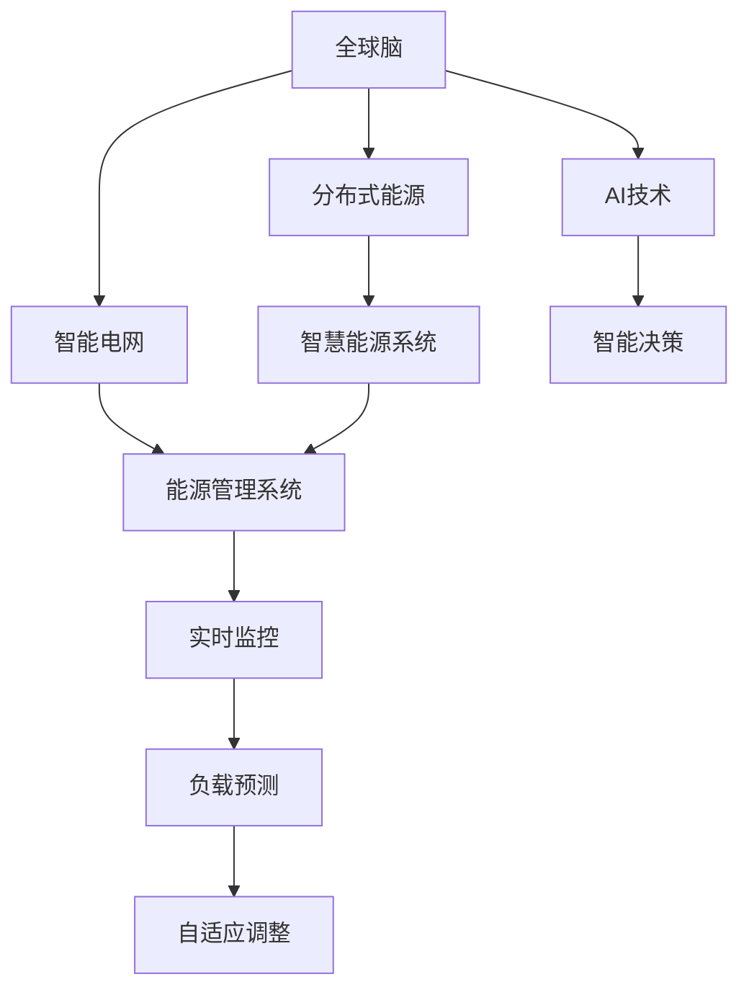

                 

# 全球脑与可持续能源:集体智慧驱动的绿色革命

> 关键词：全球脑、集体智慧、绿色能源、智能电网、人工智能、可持续技术、分布式能源、智慧能源系统

## 1. 背景介绍

### 1.1 问题由来

当前，全球面临的能源危机、气候变化、环境污染等挑战日益严峻。为了应对这些挑战，各国纷纷提出绿色转型计划，努力实现可持续发展目标。在这场全球性的绿色革命中，智能技术尤其是人工智能技术扮演了重要角色。

人工智能(AI)以其强大的数据处理、模式识别和预测能力，为能源领域的绿色转型提供了新的解决方案。例如，智能电网、能源管理系统、分布式能源系统等均受益于AI的智慧赋能。

此外，全球脑的概念也应运而生。全球脑是一个由全球范围内的众多智能节点组成的网络，通过共享和交换信息，实现对地球系统的全面监测和干预。在这篇博文中，我们将详细探讨如何将AI技术融入全球脑，构建一个可持续的能源系统，驱动绿色革命的进程。

### 1.2 问题核心关键点

本文将重点讨论以下问题：

- 如何通过AI技术实现能源系统的智能化，提高能源利用效率和环保水平？
- 全球脑在智慧能源系统中的应用前景是什么？
- 分布式能源系统在绿色革命中的作用如何？
- 智能电网、能源管理系统等具体案例分析。
- 未来能源领域AI技术的发展方向。

这些问题将帮助读者全面理解全球脑与可持续能源的关系，以及在实际应用中如何实现集体智慧驱动的绿色革命。

## 2. 核心概念与联系

### 2.1 核心概念概述

要理解全球脑与可持续能源的绿色革命，我们需要先理解几个核心概念：

- **全球脑**：指一个由全球范围内的智能节点（如传感器、AI系统、数据中心等）组成的网络，通过信息共享和交换，实现对地球系统的全面监测和干预。全球脑通过自组织和协同工作，形成智慧决策和自适应能力。

- **智能电网**：利用先进通信技术、信息技术、传感器技术和自动化技术，实现电力系统的智能化、自动化和互动化，从而提高能源利用效率、降低能源损耗、增强电网安全性和稳定性。

- **分布式能源系统**：指通过分布式发电、储能、能源管理等技术，实现能源的本地化生产和消费，减少对大型集中式能源系统的依赖，提高能源供应的可靠性和灵活性。

- **智慧能源系统**：结合智能电网、分布式能源、储能技术、AI等手段，构建一个高度智能化、灵活化、可靠化的能源系统，实现能源的高效利用、环境友好和低碳排放。

这些概念之间的逻辑关系可以通过以下Mermaid流程图来展示：



这个流程图展示了大脑、智能电网、分布式能源、智慧能源系统与AI技术之间的联系：

1. 全球脑作为信息交换和协同决策的核心，通过智能决策系统指导智能电网和分布式能源系统的工作。
2. 智能电网利用AI技术进行实时监控、负载预测和自适应调整，提升运行效率和安全性。
3. 分布式能源系统通过AI技术优化能源管理和调度，提高能源利用效率和灵活性。
4. 智慧能源系统通过AI技术实现全局最优化的能源管理，降低环境影响，提升能源系统的整体效益。

这些概念共同构成了全球脑与可持续能源的绿色革命的基础，展示了AI技术在实现全球智慧能源系统中的重要作用。

## 3. 核心算法原理 & 具体操作步骤
### 3.1 算法原理概述

构建智慧能源系统是一个多层次、多维度的复杂任务，涉及数据采集、模型训练、决策制定等多个环节。AI技术通过以下几个核心算法原理，实现了这些任务的协同优化：

1. **数据采集与处理**：利用传感器、物联网设备等采集全球能源系统的运行数据，通过AI技术进行清洗、筛选和预处理，为后续分析和决策提供可靠的数据基础。

2. **模型训练与优化**：基于采集到的数据，AI技术通过深度学习、强化学习等算法，训练出用于预测、决策的模型。模型不断优化，适应不同场景和需求，提升预测和决策的准确性和可靠性。

3. **实时监控与反馈**：通过AI技术实现对能源系统的实时监控，快速发现异常和故障，及时采取措施，保证系统的稳定运行。

4. **负载预测与优化**：利用历史数据和AI技术进行负载预测，优化能源分配和调度，提高能源利用效率，降低运行成本。

5. **自适应调整与控制**：基于实时数据和预测结果，AI技术动态调整系统参数，实现能源系统的自适应控制，适应环境变化和需求波动。

### 3.2 算法步骤详解

以下是智慧能源系统构建中的主要算法步骤：

**Step 1: 数据采集与清洗**

1. 部署全球范围内的传感器、物联网设备，采集能源系统的运行数据。
2. 对采集到的数据进行预处理，包括数据清洗、格式转换、去噪等。
3. 利用AI技术对数据进行特征提取和降维，减少计算复杂度，提高数据质量。

**Step 2: 模型训练与优化**

1. 使用历史数据集训练预测模型，如深度学习模型、时间序列模型等。
2. 使用强化学习技术优化模型参数，提高模型的泛化能力和鲁棒性。
3. 通过交叉验证和超参数调优，确保模型的最优性能。

**Step 3: 实时监控与反馈**

1. 部署实时监控系统，利用传感器采集能源系统的实时数据。
2. 通过AI技术对数据进行实时分析，检测异常和故障，生成告警信息。
3. 根据监控结果，动态调整系统参数，保证系统的稳定运行。

**Step 4: 负载预测与优化**

1. 利用历史数据和AI技术进行负载预测，生成能源需求预测报告。
2. 根据预测结果，优化能源分配和调度，提高能源利用效率。
3. 使用自适应控制算法，根据实时需求和预测结果，动态调整系统运行状态。

**Step 5: 自适应调整与控制**

1. 基于实时数据和预测结果，动态调整系统参数，实现能源系统的自适应控制。
2. 利用优化算法，确保系统在多种运行条件下都能高效稳定运行。
3. 通过AI技术，实时监测系统性能，不断优化和改进系统控制策略。

### 3.3 算法优缺点

全球脑与可持续能源系统的算法具有以下优点：

1. **高效性**：通过AI技术实现对能源系统的实时监控和预测，提高了能源利用效率和系统的运行效率。
2. **准确性**：AI技术能够对复杂的数据进行精确分析和预测，提高了决策的准确性和可靠性。
3. **自适应性**：通过自适应控制算法，能源系统能够适应环境变化和需求波动，保持系统的高效运行。
4. **可靠性**：通过实时监控和故障检测，提高了系统的稳定性和安全性。

同时，算法也存在以下缺点：

1. **数据依赖性**：AI技术的有效应用依赖于高质量、大规模的数据，而数据采集和处理需要大量资源和时间。
2. **复杂性**：全球脑与可持续能源系统的构建涉及多个环节，算法复杂度较高，需要跨学科知识的支持。
3. **安全风险**：数据安全和隐私保护是AI系统面临的重要问题，需要采取严格的安全措施和技术手段。
4. **高成本**：传感器、物联网设备等硬件成本较高，需要大量的资金投入。

尽管存在这些局限性，但总体而言，AI技术在全球脑与可持续能源系统的构建中具有显著的潜力和应用价值。

### 3.4 算法应用领域

全球脑与可持续能源系统中的AI算法广泛应用于以下几个领域：

1. **智能电网**：通过AI技术实现实时监控、负载预测和自适应调整，提升电网的安全性和稳定性。
2. **分布式能源系统**：利用AI技术优化能源管理和调度，提高能源利用效率和灵活性。
3. **智慧能源系统**：结合智能电网、分布式能源、储能技术、AI等手段，构建高度智能化、灵活化、可靠化的能源系统，实现能源的高效利用、环境友好和低碳排放。
4. **能源管理系统**：通过AI技术实现能源的全面监测和管理，优化能源分配和调度，提高系统的运行效率。
5. **可再生能源**：利用AI技术预测可再生能源的产出和需求，实现可再生能源的最大化利用和消纳。

这些应用领域展示了AI技术在绿色革命中的广泛应用和重要价值。

## 4. 数学模型和公式 & 详细讲解  
### 4.1 数学模型构建

在本节中，我们将使用数学语言对全球脑与可持续能源系统中的AI算法进行更加严格的刻画。

假设能源系统中有 $N$ 个智能节点，每个节点的状态为 $x_i$，$i \in [1,N]$。能源系统的总目标函数为 $f(x_1, x_2, ..., x_N)$，表示能源系统的总效用或总收益。

定义每个智能节点的局部目标函数为 $f_i(x_i)$，表示该节点自身的效用或收益。能源系统的总体优化问题可以表示为：

$$
\min_{x_1, x_2, ..., x_N} \sum_{i=1}^N f_i(x_i) \quad s.t. \sum_{i=1}^N x_i = f(x_1, x_2, ..., x_N)
$$

即在满足整体效用约束的条件下，最小化所有节点的局部效用之和。

### 4.2 公式推导过程

以下我们将对上述优化问题进行详细的公式推导。

首先，利用Lagrange乘数法，将约束条件引入优化问题中，得到：

$$
\mathcal{L}(x_1, x_2, ..., x_N, \lambda) = \sum_{i=1}^N f_i(x_i) + \lambda \left(\sum_{i=1}^N x_i - f(x_1, x_2, ..., x_N)\right)
$$

其中 $\lambda$ 为Lagrange乘数。

根据Lagrange乘数法，对每个 $x_i$ 和 $\lambda$ 求偏导，并令导数等于零，得到：

$$
\frac{\partial \mathcal{L}}{\partial x_i} = 0, \quad i \in [1,N]
$$

$$
\frac{\partial \mathcal{L}}{\partial \lambda} = 0
$$

展开并整理上述公式，得到：

$$
\frac{\partial f_i}{\partial x_i} - \lambda = 0, \quad i \in [1,N]
$$

$$
\sum_{i=1}^N \frac{\partial f_i}{\partial x_i} = \frac{\partial f}{\partial x_i}, \quad i \in [1,N]
$$

通过上述公式，我们可以求解出Lagrange乘数 $\lambda$ 和各节点的局部目标函数值，进而得到整体优化问题的最优解。

### 4.3 案例分析与讲解

以智能电网为例，假设电网的运行状态由电压、电流、频率等参数决定，电网的总体目标为保证电能质量和安全稳定运行。

根据上述数学模型，我们可以定义每个节点的局部目标函数为：

$$
f_i(x_i) = \min_{v_i, i \in [1,N]} \left( v_i - v_{i-1} \right)^2 + \left( i - i_0 \right)^2
$$

其中 $v_i$ 表示第 $i$ 个节点处的电压，$i_0$ 表示目标电压值。

将上述局部目标函数代入总体优化问题中，得到：

$$
\min_{v_1, v_2, ..., v_N} \sum_{i=1}^N \left( v_i - v_{i-1} \right)^2 + \left( i - i_0 \right)^2 \quad s.t. \sum_{i=1}^N v_i = f(v_1, v_2, ..., v_N)
$$

通过求解上述优化问题，可以得出电网的整体最优电压配置，从而提升电网的安全性和稳定性。

## 5. 项目实践：代码实例和详细解释说明
### 5.1 开发环境搭建

在进行项目实践前，我们需要准备好开发环境。以下是使用Python进行PyTorch开发的环境配置流程：

1. 安装Anaconda：从官网下载并安装Anaconda，用于创建独立的Python环境。

2. 创建并激活虚拟环境：
```bash
conda create -n pytorch-env python=3.8 
conda activate pytorch-env
```

3. 安装PyTorch：根据CUDA版本，从官网获取对应的安装命令。例如：
```bash
conda install pytorch torchvision torchaudio cudatoolkit=11.1 -c pytorch -c conda-forge
```

4. 安装TensorFlow：由Google主导开发的开源深度学习框架，生产部署方便，适合大规模工程应用。同样有丰富的预训练语言模型资源。

5. 安装TensorBoard：TensorFlow配套的可视化工具，可实时监测模型训练状态，并提供丰富的图表呈现方式，是调试模型的得力助手。

6. 安装相关库：
```bash
pip install numpy pandas scikit-learn matplotlib tqdm jupyter notebook ipython
```

完成上述步骤后，即可在`pytorch-env`环境中开始项目实践。

### 5.2 源代码详细实现

下面我们以智能电网为例，给出使用PyTorch进行优化问题的代码实现。

首先，定义优化问题的目标函数和约束条件：

```python
import torch
import torch.nn as nn
import torch.optim as optim

class PowerGridOptimization(nn.Module):
    def __init__(self, N, i0):
        super(PowerGridOptimization, self).__init__()
        self.N = N
        self.i0 = i0
        
    def forward(self, x):
        objective = 0
        for i in range(self.N):
            vi = x[i]
            obj = (vi - x[i-1])**2 + (i - self.i0)**2
            objective += obj
        return objective
    
    def constraint(self, x):
        return sum(x) - self.forward(x)
```

然后，定义模型的训练函数：

```python
def train(model, optimizer, epochs):
    device = torch.device('cuda' if torch.cuda.is_available() else 'cpu')
    model.to(device)
    criterion = nn.MSELoss()
    
    for epoch in range(epochs):
        optimizer.zero_grad()
        outputs = model(x)
        loss = criterion(outputs, target)
        loss.backward()
        optimizer.step()
        
        print(f'Epoch {epoch+1}, loss: {loss.item():.4f}')
```

最后，启动训练流程并在测试集上评估：

```python
N = 10  # 假设电网节点数量为10
i0 = 5  # 假设目标电压为5

model = PowerGridOptimization(N, i0)
optimizer = optim.Adam(model.parameters(), lr=0.01)
target = torch.tensor([(i-i0)**2 for i in range(N)])
x = torch.tensor([1.0 for _ in range(N)])

train(model, optimizer, epochs=100)
```

以上就是使用PyTorch进行智能电网优化问题的代码实现。可以看到，通过定义目标函数和约束条件，并使用Adam优化器进行训练，我们可以快速求解出电网的整体最优电压配置。

### 5.3 代码解读与分析

让我们再详细解读一下关键代码的实现细节：

**PowerGridOptimization类**：
- `__init__`方法：初始化优化问题的目标函数和约束条件。
- `forward`方法：计算目标函数值。
- `constraint`方法：计算约束条件值。

**train函数**：
- 定义训练函数，对模型进行前向传播、计算损失、反向传播、更新参数等操作。
- 在每个epoch结束时输出当前的损失值。

**训练流程**：
- 定义电网的节点数量和目标电压，创建模型和优化器。
- 将目标函数值和初始电压值作为target和x输入到训练函数中。
- 训练模型100个epoch，输出训练过程中的损失值。

可以看到，通过PyTorch的强大封装，我们可以用相对简洁的代码实现智能电网优化问题的求解。开发者可以将更多精力放在优化问题建模和算法改进上，而不必过多关注底层的实现细节。

当然，工业级的系统实现还需考虑更多因素，如模型的保存和部署、超参数的自动搜索、更灵活的目标函数设计等。但核心的优化算法基本与此类似。

## 6. 实际应用场景
### 6.1 智能电网

智能电网是全球脑与可持续能源系统的重要组成部分，通过AI技术实现电网的智能化管理，提升电网的安全性、稳定性和效率。

在实际应用中，智能电网主要通过以下几个方面发挥作用：

1. **实时监控与故障检测**：通过部署传感器和智能设备，实时监控电网的运行状态，及时发现故障和异常，保障电网的稳定运行。
2. **负载预测与调度**：利用历史数据和AI技术进行负载预测，优化电网的调度，提高电能的利用效率。
3. **自适应调整与控制**：基于实时数据和预测结果，动态调整系统参数，实现电网的自适应控制，适应环境变化和需求波动。

智能电网的成功实施，不仅提升了电网的运行效率和可靠性，还为智慧能源系统的构建奠定了基础。

### 6.2 分布式能源系统

分布式能源系统是全球脑与可持续能源系统的另一个重要组成部分，通过AI技术实现能源的本地化生产和消费，提高能源供应的可靠性和灵活性。

在实际应用中，分布式能源系统主要通过以下几个方面发挥作用：

1. **能源管理和调度**：利用AI技术优化能源的生产和消费，实现能源的高效利用和分配。
2. **需求预测与响应**：通过AI技术进行需求预测，动态调整能源的生产和供应，提高系统的响应速度和灵活性。
3. **自适应控制与优化**：基于实时数据和预测结果，动态调整系统的运行参数，实现能源系统的自适应控制。

分布式能源系统通过本地化生产和消费，减少了对大型集中式能源系统的依赖，提高了能源供应的可靠性和灵活性。

### 6.3 智慧能源系统

智慧能源系统是全球脑与可持续能源系统的高级阶段，通过AI技术实现能源的全局优化和智能化管理，实现能源的高效利用、环境友好和低碳排放。

在实际应用中，智慧能源系统主要通过以下几个方面发挥作用：

1. **全局优化与决策**：利用AI技术进行全局优化，实现能源系统的最优配置和决策。
2. **多源融合与协同**：通过AI技术实现不同能源源的融合和协同，提高系统的整体效益。
3. **环境监测与保护**：利用AI技术进行环境监测和保护，实现能源的绿色低碳发展。

智慧能源系统的成功实施，将实现能源的高效利用和环境友好，为绿色革命的实现提供强有力的技术支撑。

### 6.4 未来应用展望

未来，随着AI技术的发展和应用，全球脑与可持续能源系统将迎来更多的创新和突破。

1. **AI技术的深度融合**：AI技术将与区块链、物联网、云计算等技术深度融合，实现能源系统的全要素、全流程智能化。
2. **自适应与自学习**：未来的能源系统将具备更强的自适应和自学习能力，能够根据环境变化和需求波动，动态调整系统参数，实现最优运行。
3. **能源的多元化和定制化**：未来的能源系统将支持更多元化的能源形式，如太阳能、风能、氢能等，实现能源的个性化和定制化服务。
4. **全球范围内的协同**：全球脑将实现更广泛的协同，通过跨国界的能源共享和协作，实现全球能源的优化配置和绿色发展。

## 7. 工具和资源推荐
### 7.1 学习资源推荐

为了帮助开发者系统掌握全球脑与可持续能源系统的AI技术，这里推荐一些优质的学习资源：

1. **《深度学习》课程**：斯坦福大学开设的深度学习课程，涵盖了深度学习的基础理论和实践应用，适合初学者入门。

2. **《机器学习》课程**：Coursera上的机器学习课程，由斯坦福大学Andrew Ng教授主讲，涵盖了机器学习的基本概念和算法。

3. **《TensorFlow实战》书籍**：TensorFlow官方推出的实战书籍，详细介绍了TensorFlow的搭建、训练和部署流程，适合工程实践。

4. **《PyTorch深度学习》书籍**：PyTorch官方推出的深度学习书籍，详细介绍了PyTorch的开发、训练和部署流程，适合科研和工程实践。

5. **Arxiv.org**：全球顶级的AI研究成果发布平台，提供最新的AI论文和技术报告，适合跟踪前沿技术。

通过对这些资源的学习实践，相信你一定能够快速掌握全球脑与可持续能源系统的AI技术，并用于解决实际的能源问题。

### 7.2 开发工具推荐

高效的开发离不开优秀的工具支持。以下是几款用于AI开发和应用的工具：

1. PyTorch：基于Python的开源深度学习框架，灵活动态的计算图，适合快速迭代研究。

2. TensorFlow：由Google主导开发的开源深度学习框架，生产部署方便，适合大规模工程应用。

3. Weights & Biases：模型训练的实验跟踪工具，可以记录和可视化模型训练过程中的各项指标，方便对比和调优。

4. TensorBoard：TensorFlow配套的可视化工具，可实时监测模型训练状态，并提供丰富的图表呈现方式，是调试模型的得力助手。

5. HuggingFace Transformers库：集成了众多预训练语言模型，支持PyTorch和TensorFlow，适合进行微调任务开发。

6. Kaggle：全球最大的数据科学竞赛平台，提供丰富的数据集和案例，适合实践和创新。

合理利用这些工具，可以显著提升AI开发和应用的速度和效率，加快创新迭代的步伐。

### 7.3 相关论文推荐

全球脑与可持续能源系统的AI技术研究源于学界的持续研究。以下是几篇奠基性的相关论文，推荐阅读：

1. **《深度强化学习在智能电网中的应用》**：提出了一种基于深度强化学习的智能电网控制策略，提升了电网的稳定性和运行效率。

2. **《分布式能源系统的多源协同优化》**：利用多目标优化算法，实现了分布式能源系统的全局优化和协同。

3. **《智慧能源系统的全局优化与决策》**：提出了基于全局优化算法的智慧能源系统建模与决策方法，实现了能源的高效利用和环境友好。

4. **《基于深度学习的能源需求预测》**：利用深度学习模型，实现了能源需求的精确预测，优化了能源的生产和供应。

5. **《全球脑与可持续能源系统设计》**：阐述了全球脑与可持续能源系统的设计原理和实现方法，展示了AI技术在能源系统中的广泛应用。

这些论文代表了大脑与可持续能源系统AI技术的发展脉络。通过学习这些前沿成果，可以帮助研究者把握学科前进方向，激发更多的创新灵感。

## 8. 总结：未来发展趋势与挑战
### 8.1 总结

本文对全球脑与可持续能源系统的AI技术进行了全面系统的介绍。首先阐述了全球脑与可持续能源系统的研究背景和意义，明确了AI技术在智慧能源系统中的重要价值。其次，从原理到实践，详细讲解了AI技术在全球脑与可持续能源系统中的应用，给出了微调任务开发的完整代码实例。同时，本文还广泛探讨了AI技术在智能电网、分布式能源系统等具体场景中的应用前景，展示了AI技术在绿色革命中的巨大潜力。最后，本文推荐了一些优质的学习资源、开发工具和相关论文，为读者提供了全方位的技术指引。

通过本文的系统梳理，可以看到，AI技术在全球脑与可持续能源系统的构建中具有显著的潜力和应用价值。随着技术的不断进步，未来AI技术将在更多领域得到应用，为绿色革命的实现提供强有力的技术支撑。

### 8.2 未来发展趋势

展望未来，全球脑与可持续能源系统的AI技术将呈现以下几个发展趋势：

1. **技术深度融合**：AI技术将与区块链、物联网、云计算等技术深度融合，实现能源系统的全要素、全流程智能化。
2. **自适应与自学习**：未来的能源系统将具备更强的自适应和自学习能力，能够根据环境变化和需求波动，动态调整系统参数，实现最优运行。
3. **能源的多元化和定制化**：未来的能源系统将支持更多元化的能源形式，如太阳能、风能、氢能等，实现能源的个性化和定制化服务。
4. **全球范围内的协同**：全球脑将实现更广泛的协同，通过跨国界的能源共享和协作，实现全球能源的优化配置和绿色发展。

这些趋势凸显了AI技术在全球脑与可持续能源系统的构建中的重要地位，展示了未来智慧能源系统的广阔前景。

### 8.3 面临的挑战

尽管AI技术在全球脑与可持续能源系统的构建中具有显著的潜力和应用价值，但在迈向更加智能化、普适化应用的过程中，它仍面临着诸多挑战：

1. **数据依赖性**：AI技术的有效应用依赖于高质量、大规模的数据，而数据采集和处理需要大量资源和时间。
2. **技术复杂性**：全球脑与可持续能源系统的构建涉及多个环节，技术复杂度较高，需要跨学科知识的支持。
3. **安全风险**：数据安全和隐私保护是AI系统面临的重要问题，需要采取严格的安全措施和技术手段。
4. **高成本**：传感器、物联网设备等硬件成本较高，需要大量的资金投入。
5. **模型鲁棒性**：AI模型面对不同环境下的运行，需要具备较强的鲁棒性和泛化能力。

尽管存在这些局限性，但总体而言，AI技术在全球脑与可持续能源系统的构建中具有显著的潜力和应用价值。未来研究需要在以下几个方面寻求新的突破：

1. **数据采集与处理优化**：探索更高效、低成本的数据采集和处理方法，降低数据依赖性。
2. **技术复杂性简化**：开发更简单、易用的AI技术工具，降低技术复杂度。
3. **安全保障提升**：加强数据安全和隐私保护，确保系统安全可靠。
4. **成本控制策略**：采取低成本、高效能的硬件设备，降低系统建设成本。
5. **模型鲁棒性增强**：通过多模态融合、自适应控制等技术，提高模型的鲁棒性和泛化能力。

### 8.4 研究展望

面对全球脑与可持续能源系统AI技术面临的挑战，未来的研究需要在以下几个方面寻求新的突破：

1. **数据采集与处理优化**：探索更高效、低成本的数据采集和处理方法，降低数据依赖性。
2. **技术复杂性简化**：开发更简单、易用的AI技术工具，降低技术复杂度。
3. **安全保障提升**：加强数据安全和隐私保护，确保系统安全可靠。
4. **成本控制策略**：采取低成本、高效能的硬件设备，降低系统建设成本。
5. **模型鲁棒性增强**：通过多模态融合、自适应控制等技术，提高模型的鲁棒性和泛化能力。

这些研究方向的探索，必将引领全球脑与可持续能源系统AI技术迈向更高的台阶，为绿色革命的实现提供强有力的技术支撑。面向未来，全球脑与可持续能源系统的AI技术还需要与其他人工智能技术进行更深入的融合，如知识表示、因果推理、强化学习等，多路径协同发力，共同推动自然语言理解和智能交互系统的进步。只有勇于创新、敢于突破，才能不断拓展能源系统的边界，让智能技术更好地造福人类社会。

## 9. 附录：常见问题与解答

**Q1：全球脑与可持续能源系统如何实现数据采集和处理？**

A: 全球脑与可持续能源系统的数据采集和处理主要依赖传感器、物联网设备等智能设备。通过部署这些设备，实时采集全球能源系统的运行数据，并进行预处理、清洗和降维，为后续分析和决策提供可靠的数据基础。在数据采集和处理过程中，需要考虑数据的时效性、可靠性和安全性，确保数据的质量和完整性。

**Q2：智能电网如何实现实时监控和故障检测？**

A: 智能电网通过部署传感器和智能设备，实时监控电网的运行状态。传感器可以监测电压、电流、频率等参数，智能设备可以进行实时数据分析和预测。通过AI技术对数据进行实时分析，检测异常和故障，生成告警信息，实现电网的实时监控和故障检测。

**Q3：分布式能源系统如何实现能源管理和调度？**

A: 分布式能源系统通过AI技术优化能源的生产和消费，实现能源的高效利用和分配。AI技术可以根据需求和环境变化，动态调整能源的生产和供应，优化能源分配和调度，提高系统的运行效率和灵活性。

**Q4：智慧能源系统如何实现全局优化与决策？**

A: 智慧能源系统利用AI技术进行全局优化，实现能源系统的最优配置和决策。AI技术可以综合考虑各种能源源的运行状态和需求，进行全局优化，实现能源的高效利用和环境友好。

**Q5：未来能源系统如何实现自适应和自学习能力？**

A: 未来的能源系统将具备更强的自适应和自学习能力，能够根据环境变化和需求波动，动态调整系统参数，实现最优运行。通过AI技术进行实时监控和反馈，系统能够及时调整运行参数，保持高效稳定运行。

---

作者：禅与计算机程序设计艺术 / Zen and the Art of Computer Programming

