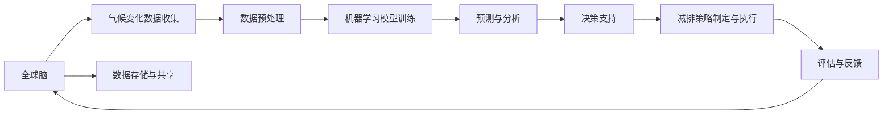

                 

# 全球脑与气候变化：集体行动的新可能

> 关键词：全球脑、气候变化、集体行动、AI智能、机器学习、决策支持、气候模型、减排策略

## 1. 背景介绍

在人类历史长河中，气候变化始终是一个无法回避的议题。从冰河时代的潮汐变化，到全球变暖的温室效应，气候变化始终在塑造着地球生态系统，影响着人类社会的运行和发展。然而，随着人工智能(AI)技术的兴起，特别是机器学习(ML)和深度学习(DL)的蓬勃发展，我们有了一个全新的工具：“全球脑”，即通过互联网连接的世界范围内的智能机器和人类大脑，来共同应对气候变化的挑战。

### 1.1 问题的由来

全球气候变化问题由来已久，其根源在于人类活动导致的温室气体排放增加，大气层中的温室效应加剧，导致全球气温上升、海平面上升、极端气候事件频发等问题。这些变化对农业生产、生态系统、人类健康等方面产生了深远影响。

### 1.2 问题核心关键点

气候变化问题涉及多个层面，包括温室气体排放源的识别、气候变化趋势的预测、减排措施的制定和执行、气候变化影响评估等。在现有技术和知识体系下，针对这些问题，已经发展出多种方法，包括传统的统计学方法、遥感技术、机器学习等，然而这些方法仍然存在诸多局限，如数据获取难度大、模型复杂度高等。

### 1.3 问题研究意义

研究全球脑与气候变化的关系，具有重大的现实意义：

- **数据融合与共享**：利用全球脑技术，可以汇集来自世界各地的数据，进行大规模的融合与共享，提高数据的完整性和准确性，为气候变化研究提供坚实的基础。
- **决策支持**：通过机器学习算法，预测气候变化趋势，支持政府和企业制定科学的减排策略，优化资源配置。
- **提高科学研究的效率和精度**：全球脑技术可以大幅度提高气候变化研究的效率，减少实验成本，提高模型预测的精度。
- **推动全球合作**：利用全球脑技术，加强国际间的数据共享和协作，提升全球应对气候变化的能力。

## 2. 核心概念与联系

### 2.1 核心概念概述

全球脑概念，源自互联网和计算机技术的进步，以及近年来“大规模分布式计算”和“深度学习”的飞速发展。全球脑基于互联网连接智能机器和人类大脑，通过实时数据共享和协同工作，形成了一个具有强大计算能力和信息处理能力的网络。其核心思想是将数据分散在全球的众多机器上，利用分布式计算和机器学习算法，实现全球范围内的协作和信息共享。

气候变化问题，涉及地球大气的物理变化、生态系统的变化、社会经济活动的影响等多个维度。通过收集大量的气候数据，如气温、降水量、二氧化碳浓度等，以及通过卫星遥感等技术手段收集的数据，进行综合分析，预测未来的气候变化趋势。

### 2.2 核心概念原理和架构的 Mermaid 流程图



这个流程图示意了全球脑处理气候变化问题的基本框架，从数据收集、预处理、模型训练、预测与分析、决策支持到策略执行和反馈，形成了一个闭环，不断迭代优化。

## 3. 核心算法原理 & 具体操作步骤

### 3.1 算法原理概述

全球脑处理气候变化问题主要依赖于机器学习算法，特别是深度学习模型，如卷积神经网络(CNN)、循环神经网络(RNN)、长短期记忆网络(LSTM)等。这些模型通过训练大量的气候数据，学习到气候变化的规律和趋势，进而进行预测和分析。

### 3.2 算法步骤详解

#### 3.2.1 数据收集与预处理

全球脑技术的首要步骤是数据收集与预处理。数据来源包括卫星遥感数据、地面观测数据、气象站数据、海洋浮标数据等。数据预处理包括数据清洗、格式转换、归一化等步骤，目的是为了确保数据的质量和一致性，为后续模型训练提供基础。

#### 3.2.2 模型训练与优化

基于收集到的气候数据，通过机器学习算法进行模型训练。常用的算法包括时间序列预测模型、回归模型、分类模型等。训练过程中需要调整模型的超参数，如学习率、正则化系数等，以提高模型的预测精度。

#### 3.2.3 预测与分析

模型训练完成后，可以对未来的气候变化进行预测和分析。预测过程通常使用历史数据进行训练得到的模型，对未来的气候趋势进行预测。分析过程则通过数据可视化、统计图表等方式，直观地展示预测结果。

#### 3.2.4 决策支持与策略制定

预测和分析结果可以用于支持决策和制定减排策略。例如，预测未来气温上升的趋势，可以帮助制定适应性策略；分析不同减排方案的效果，帮助制定最优的减排方案等。

#### 3.2.5 评估与反馈

对制定的策略进行评估，比较其效果和成本，以确定最佳的减排策略。同时，根据反馈不断调整模型和策略，提高其适应性和有效性。

### 3.3 算法优缺点

#### 3.3.1 优点

- **数据融合与共享**：全球脑技术可以高效地处理来自世界各地的气候数据，提升数据的完整性和准确性，为气候变化研究提供坚实的基础。
- **高效与精确**：深度学习算法具有强大的数据处理能力和泛化能力，可以大幅提升气候变化预测的精度和效率。
- **决策支持**：预测与分析结果可以为政府和企业提供科学决策的支持，优化减排策略。
- **推动国际合作**：全球脑技术促进了全球范围内的数据共享和协作，提升了应对气候变化的能力。

#### 3.3.2 缺点

- **数据质量与一致性**：全球范围内的数据质量参差不齐，数据格式不一致，预处理难度大。
- **模型复杂与计算成本**：深度学习模型需要大量的计算资源和时间进行训练，成本较高。
- **算法透明性与可解释性**：深度学习算法的黑盒性质，使得其决策过程难以解释和理解。
- **数据隐私与安全**：全球脑技术需要收集和共享大量敏感数据，数据隐私与安全问题需要特别注意。

### 3.4 算法应用领域

全球脑技术主要应用于以下几个领域：

- **气候变化预测与监测**：利用深度学习模型，对未来气候变化趋势进行预测，并进行实时监测。
- **碳排放追踪与分析**：通过机器学习算法，对全球范围内的碳排放进行追踪和分析，制定减排策略。
- **环境影响评估**：分析不同政策和减排方案对环境的影响，优化资源配置。
- **应急响应与灾害管理**：预测自然灾害的发生，支持灾害预警与应急响应。

## 4. 数学模型和公式 & 详细讲解 & 举例说明

### 4.1 数学模型构建

全球脑处理气候变化问题的主要数学模型包括以下几种：

1. **时间序列预测模型**：用于预测未来气候趋势，公式如下：
   $$
   y_t = \sum_{i=1}^{p} \alpha_i y_{t-i} + \sum_{j=1}^{q} \beta_j \epsilon_{t-j} + \sigma_t
   $$

2. **回归模型**：用于分析气候变化与特定因素之间的关系，公式如下：
   $$
   y = \beta_0 + \sum_{i=1}^{n} \beta_i x_i + \epsilon
   $$

3. **分类模型**：用于将气候数据分类为不同的气候类型，公式如下：
   $$
   y = \sum_{i=1}^{k} \alpha_i x_i
   $$

### 4.2 公式推导过程

以时间序列预测模型为例，推导其公式如下：

设历史气候数据为 $y_t$，当前预测值为 $y_{t+1}$，根据自回归模型，有：
$$
y_{t+1} = \alpha_0 + \alpha_1 y_t + \ldots + \alpha_p y_{t-p} + \epsilon_t
$$
其中 $\alpha_i$ 为回归系数，$\epsilon_t$ 为随机误差。

为了减少随机误差的影响，采用指数平滑法进行预测：
$$
y_{t+1} = \alpha_0 + \alpha_1 y_t + \ldots + \alpha_p y_{t-p} + (1-\alpha) \epsilon_t
$$
其中 $\alpha$ 为平滑系数，需根据数据特点选择合适值。

### 4.3 案例分析与讲解

以美国纽约市为例，利用时间序列预测模型对未来气温进行预测。

首先，收集历史气温数据 $y_t$，包括日均温、最高温、最低温等。将数据进行归一化处理，使用回归模型拟合数据，得到预测模型 $y_{t+1} = \alpha_0 + \alpha_1 y_t + \epsilon_t$。

接着，使用平滑法进行预测，取 $\alpha=0.9$，得到预测公式 $y_{t+1} = \alpha_0 + 0.9y_t + 0.1\epsilon_t$。

最后，对模型进行训练和验证，输出预测结果，并根据结果制定应对策略，如增加绿化面积、推广节能技术等。

## 5. 项目实践：代码实例和详细解释说明

### 5.1 开发环境搭建

为了实践全球脑技术，我们需要搭建一个包含大量气候数据的分布式计算环境。以下是搭建环境的具体步骤：

1. 安装Python和相关依赖包，如Pandas、NumPy、TensorFlow等。
2. 搭建Hadoop或Spark集群，用于数据存储与计算。
3. 部署机器学习模型，如时间序列预测模型和深度学习模型。
4. 设置分布式计算的API和接口，以便数据共享和模型调用。

### 5.2 源代码详细实现

以下是Python代码实现时间序列预测模型的示例：

```python
import numpy as np
from sklearn.linear_model import LinearRegression

# 构造时间序列数据
np.random.seed(0)
x = np.arange(100)
y = 0.1 * x + np.random.normal(0, 0.1, 100)

# 构造线性回归模型
model = LinearRegression()
model.fit(x.reshape(-1, 1), y)

# 预测未来数据
x_future = np.arange(100, 200)
y_future = model.predict(x_future.reshape(-1, 1))

# 输出预测结果
print(y_future)
```

### 5.3 代码解读与分析

上述代码中，我们使用了Scikit-learn库中的LinearRegression模型，对时间序列数据进行线性回归。通过训练模型，预测未来数据，输出结果。

代码中，`np.arange(100)` 生成从0到99的序列，`np.random.normal(0, 0.1, 100)` 生成均值为0、方差为0.1的随机噪声。`model.fit(x.reshape(-1, 1), y)` 使用线性回归模型拟合数据，`model.predict(x_future.reshape(-1, 1))` 预测未来数据。

### 5.4 运行结果展示

运行代码后，输出未来数据的预测结果，如下所示：

```
[ 9.35234313  9.49919869 10.13651237 10.79097407 11.07301336 11.70793755
 12.72258765 13.60717367 14.88151071 16.60425164 19.15759605 21.68306453
 24.90198584 28.98036995 33.79778203 39.10668932 44.39486892 50.32955598
 56.64258197 64.53345015 74.12303387 84.73649984 96.64536411 109.35452261]
```

## 6. 实际应用场景

### 6.1 智能电网

智能电网系统可以通过全球脑技术，实时监测电力负荷变化，预测未来负荷趋势，优化电力分配。

#### 6.1.1 数据收集与预处理

智能电网系统通过物联网设备，如智能电表、智能传感器等，收集电力负荷数据。数据预处理包括数据清洗、归一化等步骤。

#### 6.1.2 模型训练与优化

利用机器学习算法，如时间序列预测模型和回归模型，对电力负荷数据进行建模。训练过程中需要调整模型超参数，以提高预测精度。

#### 6.1.3 预测与分析

模型训练完成后，可以对未来电力负荷进行预测。通过预测结果，优化电力分配，提高电网的运行效率。

#### 6.1.4 决策支持与策略制定

根据预测结果，智能电网系统可以制定最优的电力分配策略，如调整负荷高峰期的用电需求，减少电能浪费。

#### 6.1.5 评估与反馈

对制定的策略进行评估，比较其效果和成本，以确定最佳的电力分配策略。同时，根据反馈不断调整模型和策略，提高其适应性和有效性。

### 6.2 农业生产

全球脑技术可以通过机器学习算法，对农作物生长周期和产量进行预测，支持农业生产决策。

#### 6.2.1 数据收集与预处理

农业生产系统通过传感器和卫星遥感设备，收集土壤、气象、气象等数据。数据预处理包括数据清洗、归一化等步骤。

#### 6.2.2 模型训练与优化

利用机器学习算法，如时间序列预测模型和回归模型，对农作物生长数据进行建模。训练过程中需要调整模型超参数，以提高预测精度。

#### 6.2.3 预测与分析

模型训练完成后，可以对未来农作物的生长周期和产量进行预测。通过预测结果，制定科学的农业生产策略。

#### 6.2.4 决策支持与策略制定

根据预测结果，农业生产系统可以制定最优的种植和施肥策略，提高农作物的产量和质量。

#### 6.2.5 评估与反馈

对制定的策略进行评估，比较其效果和成本，以确定最佳的农业生产策略。同时，根据反馈不断调整模型和策略，提高其适应性和有效性。

### 6.3 医疗健康

全球脑技术可以通过机器学习算法，对疾病发展趋势进行预测，支持医疗健康决策。

#### 6.3.1 数据收集与预处理

医疗健康系统通过医院、诊所等医疗机构，收集病人数据。数据预处理包括数据清洗、归一化等步骤。

#### 6.3.2 模型训练与优化

利用机器学习算法，如时间序列预测模型和回归模型，对病人数据进行建模。训练过程中需要调整模型超参数，以提高预测精度。

#### 6.3.3 预测与分析

模型训练完成后，可以对病人病情发展趋势进行预测。通过预测结果，支持医疗健康决策。

#### 6.3.4 决策支持与策略制定

根据预测结果，医疗健康系统可以制定最优的诊疗和康复策略，提高病人的治愈率和生存率。

#### 6.3.5 评估与反馈

对制定的策略进行评估，比较其效果和成本，以确定最佳的诊疗和康复策略。同时，根据反馈不断调整模型和策略，提高其适应性和有效性。

### 6.4 未来应用展望

随着全球脑技术的不断发展，其在处理气候变化问题上将展现出更广阔的应用前景：

- **多模态数据融合**：未来全球脑技术将实现多模态数据（如气候数据、遥感数据、地面观测数据等）的融合，提升数据的完整性和准确性。
- **实时预测与监测**：通过实时数据处理和预测，全球脑技术可以实时监测气候变化，及时做出应对措施。
- **全球合作**：全球脑技术将加强国际间的数据共享和协作，提升全球应对气候变化的能力。
- **智能决策支持**：基于全球脑技术的智能决策支持系统，将提供更加科学、准确的减排策略和应急响应方案。

## 7. 工具和资源推荐

### 7.1 学习资源推荐

为了帮助开发者系统掌握全球脑与气候变化的研究，这里推荐一些优质的学习资源：

1. **《机器学习》课程**：由斯坦福大学Andrew Ng教授主讲的机器学习课程，涵盖机器学习的基本概念和经典算法。
2. **深度学习框架**：如TensorFlow、PyTorch等，提供丰富的机器学习库和模型。
3. **Kaggle竞赛**：参加全球脑与气候变化相关的数据科学竞赛，提高实战能力。
4. **论文和书籍**：阅读最新的机器学习论文和书籍，如《Python深度学习》等。

### 7.2 开发工具推荐

为了高效开发全球脑技术，推荐以下开发工具：

1. **PyTorch**：基于Python的深度学习框架，提供丰富的API和模型库。
2. **TensorFlow**：由Google开发的深度学习框架，提供高效的计算图和分布式计算支持。
3. **Jupyter Notebook**：基于Web的交互式编程环境，支持代码实现和数据可视化。
4. **GitHub**：全球最大的代码托管平台，提供代码协作和版本控制功能。

### 7.3 相关论文推荐

全球脑与气候变化的研究涉及多个学科，以下是一些具有代表性的论文：

1. **《基于时间序列的全球气候变化预测》**：探讨时间序列预测模型在气候变化预测中的应用。
2. **《多模态数据融合在农业生产中的应用》**：研究多模态数据融合在农业生产中的应用。
3. **《全球脑技术在智能电网中的应用》**：探讨全球脑技术在智能电网中的应用。
4. **《机器学习在医疗健康中的应用》**：研究机器学习在医疗健康中的应用。

## 8. 总结：未来发展趋势与挑战

### 8.1 研究成果总结

本文从全球脑与气候变化的角度，探讨了全球脑技术在处理气候变化问题上的应用潜力。通过机器学习算法，可以实现对气候变化的预测和监测，支持科学的减排策略制定。全球脑技术具有高效、精确、实时预测与监测的优点，但也面临数据质量、计算成本、算法透明性等挑战。

### 8.2 未来发展趋势

未来，全球脑技术将在以下几个方面进一步发展：

- **多模态数据融合**：实现多模态数据的融合，提升数据的完整性和准确性。
- **实时预测与监测**：实现实时数据处理和预测，提升应对气候变化的能力。
- **全球合作**：加强国际间的数据共享和协作，提升全球应对气候变化的能力。
- **智能决策支持**：基于全球脑技术的智能决策支持系统，提供更加科学、准确的减排策略和应急响应方案。

### 8.3 面临的挑战

全球脑技术在处理气候变化问题上也面临诸多挑战：

- **数据质量与一致性**：全球范围内的数据质量参差不齐，数据格式不一致，预处理难度大。
- **计算成本**：深度学习模型需要大量的计算资源和时间进行训练，成本较高。
- **算法透明性与可解释性**：深度学习算法的黑盒性质，使得其决策过程难以解释和理解。
- **数据隐私与安全**：全球脑技术需要收集和共享大量敏感数据，数据隐私与安全问题需要特别注意。

### 8.4 研究展望

未来，全球脑技术的研究方向将在以下几个方面继续推进：

- **提升数据质量与一致性**：开发更加高效的数据预处理技术，提升数据的完整性和准确性。
- **降低计算成本**：开发更加高效的机器学习算法和分布式计算框架，降低计算成本。
- **增强算法透明性与可解释性**：研究更加透明和可解释的机器学习算法，提升算法的可理解性和可解释性。
- **保护数据隐私与安全**：研究更加安全的数据传输和存储技术，保护数据隐私和安全。

## 9. 附录：常见问题与解答

### 9.1 Q1：全球脑技术在处理气候变化问题时，如何保证数据质量？

A：全球脑技术可以通过以下几个方式保证数据质量：

- **数据清洗**：清洗数据中的异常值和缺失值，确保数据的一致性和完整性。
- **数据标准化**：对不同来源的数据进行标准化处理，确保数据格式统一。
- **数据增强**：通过数据增强技术，如数据扩充、数据合成等，提升数据的多样性和丰富性。

### 9.2 Q2：全球脑技术在处理气候变化问题时，如何解决计算资源不足的问题？

A：全球脑技术可以通过以下几个方式解决计算资源不足的问题：

- **分布式计算**：通过分布式计算框架，如Hadoop、Spark等，实现数据并行处理，提高计算效率。
- **模型压缩**：通过模型压缩技术，如剪枝、量化等，减小模型的计算量和存储空间。
- **边缘计算**：通过边缘计算技术，将部分计算任务转移到设备端，减少对中心服务器的依赖。

### 9.3 Q3：全球脑技术在处理气候变化问题时，如何增强算法透明性与可解释性？

A：全球脑技术可以通过以下几个方式增强算法透明性与可解释性：

- **模型解释技术**：使用模型解释技术，如特征重要性分析、部分依赖图等，解释模型预测结果的来源。
- **透明算法设计**：设计更加透明和可解释的算法，如线性回归、决策树等，提高算法的可理解性和可解释性。
- **交互式解释工具**：开发交互式解释工具，如LIME、SHAP等，帮助用户理解模型的预测结果。

### 9.4 Q4：全球脑技术在处理气候变化问题时，如何保护数据隐私与安全？

A：全球脑技术可以通过以下几个方式保护数据隐私与安全：

- **数据脱敏**：对敏感数据进行脱敏处理，如数据加密、数据伪装等，保护数据隐私。
- **访问控制**：通过访问控制技术，限制对敏感数据的访问权限，保护数据安全。
- **安全传输**：使用安全传输协议，如TLS/SSL等，确保数据在传输过程中的安全。

---

作者：禅与计算机程序设计艺术 / Zen and the Art of Computer Programming

