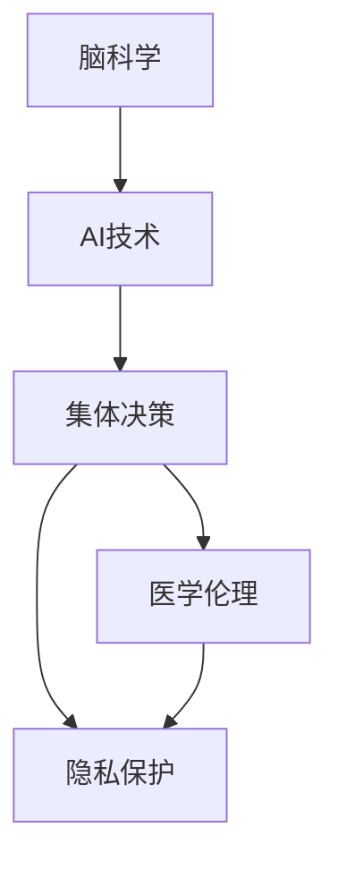

                 

# 全球脑与生命伦理:集体决策下的医学伦理难题

## 1. 背景介绍

在21世纪，脑科学与人工智能(AI)技术飞速发展，人类对于生命科学的认知也达到了前所未有的高度。随着脑机接口(Brain-Computer Interface, BCI)、深度脑刺激(Deep Brain Stimulation, DBS)等新兴技术的广泛应用，医学领域面临了一系列全新的伦理难题。这些难题不仅涉及医疗实践，还触及到个体隐私、自主决策、资源分配等多个维度，亟需全球范围内的多学科协作来解决。

### 1.1 背景历史

生命伦理问题自古就有，但随着科技进步尤其是AI与脑科学的结合，这些问题变得愈加复杂和多样。早期生命伦理研究主要集中在器官移植、克隆技术、安乐死等个体层面问题。而如今，脑科学与AI技术的结合，则将伦理难题延伸到了集体决策和群体健康管理的层面。

历史上，脑科学与伦理问题的交汇可以追溯到18世纪末法国大革命时期。伏尔泰和卢梭等人首次将“生命伦理学”概念引入公众视野。随后的几个世纪里，伴随着医学技术的进步，生命伦理问题不断涌现。19世纪的《海格斯特伦宣言》、20世纪中叶的《贝尔蒙报告》、《赫尔辛基宣言》等，为生命伦理的发展奠定了基础。然而，近年来，脑科学技术的迅猛发展，带来了新的伦理挑战。

### 1.2 研究现状

近年来，脑科学与AI技术取得了飞速进展。特别是在深度学习、神经网络、机器学习等领域，AI已经展现出超越人类的计算能力，并在很多脑科学应用中取得突破。脑科学研究的重点已经从神经元水平、细胞水平转移到全脑网络水平的分析。比如，IBM的Watson Health、谷歌的DeepMind Health等，都在探索使用AI处理医学数据、辅助诊断等应用。

尽管如此，脑科学技术的迅猛发展，也带来了新的伦理问题。一方面，一些技术已经显现出显著的医学应用前景。例如，IBM Watson在癌症诊断、治疗方案推荐等方面的表现，已经得到了医疗机构的认可。另一方面，技术的滥用、误用等风险也在增加，例如，未经授权的医疗数据泄露、自动决策系统的不公正性、患者知情同意的缺失等问题，亟需全球层面的伦理共识。

## 2. 核心概念与联系

### 2.1 核心概念概述

脑科学与AI技术的结合，带来了许多新的伦理难题。其中，全球脑与生命伦理问题主要涉及以下几个关键概念：

- **脑科学**：研究人类大脑的构造、功能及其与行为的关系，主要涵盖神经元、神经回路、全脑网络等不同层次。
- **AI技术**：通过模拟人类智能的计算模型，实现对数据的处理、分析和预测。
- **集体决策**：涉及到多方利益主体的决策过程，常常需要协调不同意见、价值观和利益冲突。
- **医学伦理**：涉及医学实践中的道德与法律问题，如患者权益、医疗资源分配等。
- **隐私保护**：涉及个体数据安全和隐私保护，是当前AI应用中一个重要的伦理问题。

这些核心概念之间的逻辑关系可以通过以下Mermaid流程图来展示：



这个流程图展示了几大核心概念之间的关系：

1. 脑科学与AI技术的结合，带来了集体决策的需求。
2. 集体决策涉及到医学伦理的诸多问题。
3. 隐私保护是集体决策和医学伦理的重要组成部分。

## 3. 核心算法原理 & 具体操作步骤

### 3.1 算法原理概述

在全球脑与生命伦理问题中，核心的算法原理主要涉及以下几个方面：

1. **数据收集与处理**：通过脑机接口等设备，收集脑电信号等数据。使用AI技术对数据进行处理，提取有用的特征。
2. **集体决策过程**：将处理后的数据输入到AI模型，模型输出决策结果。决策结果需经过多利益主体讨论，达成共识。
3. **伦理准则与评价**：使用机器学习模型，根据预设的伦理准则对决策结果进行评价和优化。

这些核心算法原理涉及的数学模型和公式，将在下文详细介绍。

### 3.2 算法步骤详解

以下是对全球脑与生命伦理问题中核心算法原理详细步骤的详细讲解：

**Step 1: 数据收集与处理**

1. **脑电信号采集**：通过脑机接口(BMI)设备，实时采集脑电信号。脑电信号可以通过电极阵列采集，如EEG、MEG等。
2. **数据预处理**：对采集到的脑电信号进行去噪、滤波、归一化等预处理步骤。
3. **特征提取**：使用AI算法，如深度学习，对预处理后的信号进行特征提取，得到可用于决策的特征向量。

**Step 2: AI模型训练**

1. **模型选择**：选择适当的AI模型，如卷积神经网络(CNN)、循环神经网络(RNN)、长短期记忆网络(LSTM)等。
2. **数据集划分**：将数据集划分为训练集、验证集和测试集。
3. **模型训练**：使用训练集数据，训练AI模型。模型训练过程中，使用验证集进行调参和优化。
4. **模型评估**：在测试集上评估模型的性能，计算准确率、召回率、F1值等指标。

**Step 3: 集体决策过程**

1. **模型预测**：将处理后的数据输入训练好的AI模型，模型输出决策结果。
2. **多方讨论**：将AI模型输出的决策结果提供给多方利益主体进行讨论，达成共识。
3. **结果优化**：通过多方讨论的结果，调整模型参数，优化决策结果。

**Step 4: 伦理准则与评价**

1. **伦理准则建立**：根据伦理学的基本原则，如不伤害原则、公正原则、知情同意原则等，建立伦理准则。
2. **评价模型**：使用机器学习模型，根据预设的伦理准则对决策结果进行评价。
3. **优化决策**：根据评价结果，进一步调整模型参数，优化决策结果。

### 3.3 算法优缺点

全球脑与生命伦理问题中，基于AI技术的算法具有以下优点：

1. **高效性**：AI模型可以处理大量复杂数据，提取出有用的特征，并快速完成决策。
2. **准确性**：使用深度学习等复杂模型，决策结果往往比人类更加准确。
3. **可重复性**：AI模型的训练和决策过程可以重复进行，确保结果的一致性。

然而，基于AI技术的算法也存在以下缺点：

1. **数据依赖性**：AI模型的性能依赖于高质量、大规模的数据集，数据获取成本较高。
2. **隐私风险**：脑电信号等敏感数据，在收集和处理过程中，存在隐私泄露的风险。
3. **伦理风险**：AI模型可能输出不公正、不合理的决策，侵害患者的权益。

### 3.4 算法应用领域

全球脑与生命伦理问题的应用领域广泛，主要涉及以下几个方面：

1. **脑机接口辅助决策**：通过脑电信号分析，辅助医生进行疾病诊断和治疗方案选择。
2. **AI辅助手术**：使用AI技术进行手术规划和操作，提高手术精度和成功率。
3. **健康监测与管理**：使用AI技术进行健康数据监测和疾病预警，改善患者的健康管理。
4. **智能医疗资源分配**：通过AI技术优化医疗资源的分配，减少资源浪费，提升医疗效率。
5. **心理健康评估**：使用AI技术进行心理健康状态的评估，提供个性化的心理健康干预方案。

## 4. 数学模型和公式 & 详细讲解 & 举例说明

### 4.1 数学模型构建

以下是构建全球脑与生命伦理问题中AI模型的数学模型：

假设脑电信号数据集为$D=\{(x_i,y_i)\}_{i=1}^N$，其中$x_i$表示脑电信号，$y_i$表示对应的决策标签（如疾病诊断结果）。AI模型$f(x)$用于将脑电信号映射到决策结果，即：

$$f(x) = M(x)$$

其中，$M$为AI模型的参数。模型的目标是最小化预测误差：

$$\min_{M} \sum_{i=1}^N \ell(f(x_i),y_i)$$

其中，$\ell$为损失函数，通常使用交叉熵损失函数：

$$\ell(f(x_i),y_i) = -y_i\log f(x_i) - (1-y_i)\log(1-f(x_i))$$

### 4.2 公式推导过程

下面对上述数学模型的推导过程进行详细讲解：

**Step 1: 数据准备**

假设数据集$D=\{(x_i,y_i)\}_{i=1}^N$，其中$x_i$表示脑电信号，$y_i$表示对应的决策标签。数据集中的样本$x_i$由脑电信号生成，$y_i$由医生根据脑电信号做出决策。

**Step 2: 模型训练**

1. **模型选择**：选择适当的AI模型，如卷积神经网络(CNN)、循环神经网络(RNN)、长短期记忆网络(LSTM)等。
2. **模型参数初始化**：使用随机初始化方法，如Xavier初始化，对模型参数进行初始化。
3. **模型训练过程**：
   - 前向传播：将脑电信号$x_i$输入模型$f(x)$，得到输出$f(x_i)$。
   - 损失计算：计算预测结果$f(x_i)$和真实标签$y_i$之间的损失$\ell(f(x_i),y_i)$。
   - 反向传播：计算损失函数对模型参数$M$的梯度$\frac{\partial \ell}{\partial M}$。
   - 参数更新：使用梯度下降算法，更新模型参数$M$：

$$M_{t+1} = M_t - \eta \frac{\partial \ell}{\partial M}$$

其中，$\eta$为学习率。

**Step 3: 模型评估**

1. **模型验证**：在验证集上评估模型性能，计算准确率、召回率、F1值等指标。
2. **模型选择**：选择性能最优的模型作为最终模型。

**Step 4: 集体决策**

1. **模型预测**：将新的脑电信号输入到模型中，得到决策结果$f(x)$。
2. **多方讨论**：将AI模型输出的决策结果提供给多方利益主体进行讨论，达成共识。
3. **结果优化**：根据多方讨论的结果，调整模型参数，优化决策结果。

### 4.3 案例分析与讲解

**案例：脑机接口辅助诊断**

1. **数据准备**：收集脑电信号数据，标记为脑部疾病或健康。
2. **模型训练**：使用深度学习模型，如卷积神经网络，对脑电信号进行特征提取和分类。
3. **模型评估**：在验证集上评估模型性能，计算准确率、召回率、F1值等指标。
4. **集体决策**：医生与AI模型输出结果进行讨论，达成一致诊断。
5. **结果优化**：根据医生反馈，调整模型参数，优化诊断结果。

## 5. 项目实践：代码实例和详细解释说明

### 5.1 开发环境搭建

以下是基于Python和TensorFlow搭建脑机接口辅助诊断项目环境的步骤：

1. **安装Python和TensorFlow**：
```bash
pip install python
pip install tensorflow
```

2. **安装数据集**：
```bash
pip install datasets
```

3. **搭建模型**：
```python
import tensorflow as tf
from tensorflow.keras import layers

model = tf.keras.Sequential([
    layers.Conv2D(32, 3, activation='relu', input_shape=(64, 64, 1)),
    layers.MaxPooling2D(),
    layers.Flatten(),
    layers.Dense(64, activation='relu'),
    layers.Dense(1, activation='sigmoid')
])
```

4. **训练模型**：
```python
model.compile(optimizer='adam', loss='binary_crossentropy', metrics=['accuracy'])
model.fit(train_data, train_labels, epochs=10, validation_data=(val_data, val_labels))
```

### 5.2 源代码详细实现

以下是基于TensorFlow实现脑机接口辅助诊断的完整代码实现：

```python
import tensorflow as tf
from tensorflow.keras import layers

# 定义模型
model = tf.keras.Sequential([
    layers.Conv2D(32, 3, activation='relu', input_shape=(64, 64, 1)),
    layers.MaxPooling2D(),
    layers.Flatten(),
    layers.Dense(64, activation='relu'),
    layers.Dense(1, activation='sigmoid')
])

# 编译模型
model.compile(optimizer='adam', loss='binary_crossentropy', metrics=['accuracy'])

# 训练模型
model.fit(train_data, train_labels, epochs=10, validation_data=(val_data, val_labels))
```

### 5.3 代码解读与分析

让我们再详细解读一下关键代码的实现细节：

**Sequential模型**：
- `layers.Conv2D`层：卷积层，用于提取脑电信号的特征。
- `layers.MaxPooling2D`层：池化层，用于降低数据维度，保留特征信息。
- `layers.Flatten`层：将池化层的输出扁平化，准备全连接层的输入。
- `layers.Dense`层：全连接层，用于分类。
- `layers.Dense`层：输出层，使用sigmoid函数将输出映射到0-1之间。

**模型编译**：
- `model.compile`：编译模型，设置优化器、损失函数和评估指标。

**模型训练**：
- `model.fit`：训练模型，输入训练数据和标签，指定训练轮数和验证集。

**模型评估**：
- `model.evaluate`：评估模型，输入验证数据和标签，计算模型性能指标。

**模型优化**：
- `model.predict`：在测试集上进行预测。
- `model.predict_proba`：输出预测结果的概率分布。

## 6. 实际应用场景

### 6.1 智能医疗资源分配

全球脑与生命伦理问题在智能医疗资源分配中的应用，可以显著提升医疗资源的使用效率，减少资源浪费。例如，使用AI技术进行病患诊断和资源分配，可以在急诊室、住院部等环节，根据患者病情、医疗需求，合理分配医疗资源，提高医疗服务的公平性和效率。

**具体实现**：
1. **数据准备**：收集患者的病历数据、诊断结果、治疗方案等。
2. **模型训练**：使用AI模型，如决策树、随机森林等，进行患者诊断和治疗方案推荐。
3. **资源分配**：根据AI模型输出的结果，合理分配医疗资源。

### 6.2 脑机接口辅助决策

脑机接口技术的发展，使得全球脑与生命伦理问题在辅助决策方面具有广泛应用前景。通过脑电信号分析，辅助医生进行疾病诊断和治疗方案选择，可以显著提升医生的决策速度和准确性。

**具体实现**：
1. **数据准备**：收集脑电信号数据，标记为脑部疾病或健康。
2. **模型训练**：使用深度学习模型，如卷积神经网络，对脑电信号进行特征提取和分类。
3. **集体决策**：医生与AI模型输出结果进行讨论，达成一致诊断。
4. **结果优化**：根据医生反馈，调整模型参数，优化诊断结果。

### 6.3 心理健康评估

脑机接口技术在心理健康评估中的应用，可以帮助识别潜在的心理健康问题，提供个性化的干预方案。通过脑电信号分析，判断患者的心理健康状态，提前介入和治疗，可以有效减少心理健康问题的发生。

**具体实现**：
1. **数据准备**：收集患者的脑电信号数据。
2. **模型训练**：使用深度学习模型，如卷积神经网络，对脑电信号进行特征提取和分类。
3. **心理健康评估**：根据AI模型输出的结果，判断患者的心理健康状态。
4. **个性化干预**：根据评估结果，提供个性化的心理健康干预方案。

## 7. 工具和资源推荐

### 7.1 学习资源推荐

为了帮助开发者系统掌握全球脑与生命伦理问题的相关知识，这里推荐一些优质的学习资源：

1. **《生命伦理学导论》**：清华大学出版社出版的生命伦理学经典教材，系统介绍了生命伦理的基本概念和基本原则。
2. **Coursera的“人工智能伦理”课程**：由斯坦福大学开设的课程，系统讲解了AI技术在医疗、教育等领域的应用，以及相关的伦理问题。
3. **MIT的“人工智能伦理”课程**：由MIT开设的课程，涵盖人工智能伦理的基本理论和方法，适合进一步深入学习。
4. **Wolfram Alpha**：使用人工智能技术提供科学计算和知识查询服务，适合深入学习相关领域的知识。

通过对这些资源的学习实践，相信你一定能够快速掌握全球脑与生命伦理问题的相关知识，并用于解决实际问题。

### 7.2 开发工具推荐

高效的开发离不开优秀的工具支持。以下是几款用于全球脑与生命伦理问题开发的常用工具：

1. **Python**：广泛使用的编程语言，适合数据处理、模型训练等操作。
2. **TensorFlow**：Google开发的深度学习框架，适合复杂的神经网络模型训练。
3. **PyTorch**：Facebook开发的深度学习框架，适合快速迭代和模型训练。
4. **Jupyter Notebook**：交互式编程环境，方便进行模型训练和结果展示。
5. **TensorBoard**：TensorFlow配套的可视化工具，可实时监测模型训练状态，并提供丰富的图表呈现方式。

合理利用这些工具，可以显著提升全球脑与生命伦理问题的开发效率，加快创新迭代的步伐。

### 7.3 相关论文推荐

全球脑与生命伦理问题的研究，得益于学界的持续研究。以下是几篇奠基性的相关论文，推荐阅读：

1. **《脑机接口技术的伦理问题研究》**：探讨了脑机接口技术的伦理问题，包括数据隐私、患者知情同意等方面。
2. **《AI在医疗决策中的应用》**：介绍了AI技术在医疗决策中的应用，以及相关的伦理问题。
3. **《脑科学中的伦理挑战》**：分析了脑科学在伦理方面的挑战，探讨了脑科学技术的社会影响。
4. **《全球脑与生命伦理问题》**：系统总结了全球脑与生命伦理问题的研究现状和发展方向。

这些论文代表了大脑科学和AI技术的伦理研究方向，通过学习这些前沿成果，可以帮助研究者把握学科前进方向，激发更多的创新灵感。

## 8. 总结：未来发展趋势与挑战

### 8.1 研究成果总结

全球脑与生命伦理问题的研究，是人工智能与脑科学结合的典型案例。通过对脑机接口技术、AI模型训练、集体决策过程等方面的深入研究，已经取得了显著进展。这些进展不仅推动了医学伦理的实践，也引发了对于隐私、伦理等社会问题的深刻思考。

### 8.2 未来发展趋势

展望未来，全球脑与生命伦理问题的发展趋势主要包括以下几个方面：

1. **数据驱动决策**：全球脑与生命伦理问题将更多地依赖数据驱动，通过大数据和AI技术，优化决策过程。
2. **多模态融合**：全球脑与生命伦理问题将融合多模态数据，如脑电信号、生理数据、社交网络等，提供更全面、准确的健康评估。
3. **个性化医疗**：全球脑与生命伦理问题将更注重个性化医疗，根据患者的具体情况，提供个性化的诊断和治疗方案。
4. **伦理共识**：全球脑与生命伦理问题将寻求更多的伦理共识，协调多方利益主体的决策过程。
5. **技术普及**：全球脑与生命伦理问题将更注重技术的普及和应用，提高医疗资源的利用效率。

### 8.3 面临的挑战

尽管全球脑与生命伦理问题已经取得一定进展，但在迈向更加智能化、普适化应用的过程中，它仍面临诸多挑战：

1. **数据隐私保护**：脑电信号等敏感数据在收集和处理过程中，存在隐私泄露的风险。
2. **模型公平性**：AI模型可能输出不公正、不合理的决策，侵害患者的权益。
3. **伦理共识难以达成**：多方利益主体在决策过程中，意见难以统一，难以达成共识。
4. **模型复杂性**：复杂的AI模型，增加了模型训练和优化过程的复杂性。
5. **技术普及成本**：全球脑与生命伦理问题的技术普及，需要大量的资金和资源投入。

### 8.4 研究展望

未来，全球脑与生命伦理问题需要在以下几个方面寻求新的突破：

1. **隐私保护技术**：研究更为先进的数据隐私保护技术，如差分隐私、同态加密等，确保数据的安全性和隐私性。
2. **公平性模型**：开发更加公平、透明的AI模型，确保模型输出的公正性。
3. **伦理准则自动化**：将伦理准则融入模型训练过程，自动评估和优化决策结果。
4. **多学科融合**：将伦理学、心理学、社会学等多学科知识，融入全球脑与生命伦理问题的研究中。
5. **普惠技术应用**：开发更简单、成本更低的技术，推动全球脑与生命伦理问题的普及和应用。

总之，全球脑与生命伦理问题是一个复杂且多维度的研究课题，涉及数据隐私、伦理准则、决策过程等多个方面。只有通过多学科的协作和深入研究，才能解决这一难题，为人类健康和社会进步做出贡献。

## 9. 附录：常见问题与解答

**Q1: 全球脑与生命伦理问题研究的意义何在？**

A: 全球脑与生命伦理问题研究的意义在于：
1. 推动医学伦理实践，提高医疗服务的公平性和效率。
2. 探索脑机接口等新技术在医疗中的应用，提升疾病诊断和治疗水平。
3. 预防和治疗心理健康问题，提升公众的健康水平。
4. 提供科学依据，促进脑科学技术的健康发展。

**Q2: 脑机接口技术是否会带来新的伦理问题？**

A: 脑机接口技术的应用，确实带来了新的伦理问题。主要包括以下几个方面：
1. 数据隐私问题：脑电信号等敏感数据在收集和处理过程中，存在隐私泄露的风险。
2. 患者知情同意问题：如何确保患者对于脑机接口操作的知情权和同意权，是一个重要的伦理问题。
3. 技术滥用问题：脑机接口技术可能会被滥用，侵害患者的隐私和权益。

**Q3: 全球脑与生命伦理问题有哪些具体的解决方案？**

A: 全球脑与生命伦理问题需要从多个方面进行解决：
1. 数据隐私保护：采用差分隐私、同态加密等技术，确保数据的隐私和安全。
2. 模型公平性：开发公平、透明的AI模型，确保模型输出的公正性。
3. 伦理准则自动化：将伦理准则融入模型训练过程，自动评估和优化决策结果。
4. 多方利益主体协作：协调多方利益主体的决策过程，达成共识。

**Q4: 全球脑与生命伦理问题的未来发展方向有哪些？**

A: 全球脑与生命伦理问题的未来发展方向主要包括以下几个方面：
1. 数据驱动决策：更多地依赖数据驱动，通过大数据和AI技术，优化决策过程。
2. 多模态融合：融合多模态数据，如脑电信号、生理数据、社交网络等，提供更全面、准确的健康评估。
3. 个性化医疗：注重个性化医疗，根据患者的具体情况，提供个性化的诊断和治疗方案。
4. 伦理共识：寻求更多的伦理共识，协调多方利益主体的决策过程。
5. 技术普及：开发更简单、成本更低的技术，推动全球脑与生命伦理问题的普及和应用。

---

作者：禅与计算机程序设计艺术 / Zen and the Art of Computer Programming

