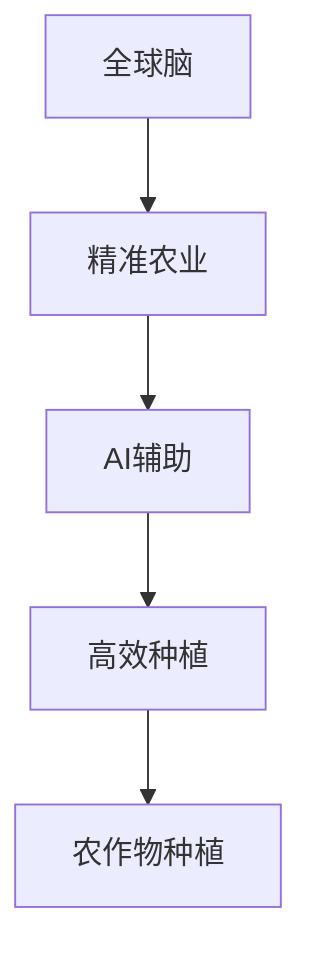

                 

# 全球脑与精准农业:AI辅助的高效农作物种植

> 关键词：全球脑,精准农业,人工智能,农作物种植,高效种植,农业智能化

## 1. 背景介绍

### 1.1 问题由来
在全球化背景下，人口增长、土地资源紧缺和环境保护成为农业面临的重大挑战。传统的农业生产模式依赖人力、物力投入大，生产效率低，且容易受到气候和土壤等自然因素的影响。为了实现可持续发展和提高农产品质量，人们不断探索新的技术和方法。精准农业和AI辅助的全球脑概念，正是在这样的背景下应运而生。

精准农业，通过精细化管理，使农业生产更加科学、高效和环保。而AI辅助的全球脑，结合互联网技术和数据分析，进一步提升了农业决策的精准性和智能化水平。文章将详细介绍AI全球脑与精准农业的结合，展示其在农作物高效种植中的潜力。

### 1.2 问题核心关键点
本文旨在探讨AI全球脑在精准农业中的应用，具体包括：
1. 全球脑的概念和原理。
2. 如何通过AI全球脑进行高效农作物种植。
3. 未来全球脑在农业智能化领域的展望。

### 1.3 问题研究意义
精准农业和AI辅助的全球脑概念为解决农业生产中的诸多问题提供了新的思路。它有助于提高农业生产效率，保障粮食安全，减少环境污染，推动农业现代化。通过对AI全球脑的研究，可以进一步促进农业智能化发展，提升农业技术水平和农业产业竞争力。

## 2. 核心概念与联系

### 2.1 核心概念概述

为更好地理解AI全球脑在精准农业中的应用，本节将介绍几个密切相关的核心概念：

- **全球脑**：一个将地球视为一个整体系统的概念，旨在通过互联网和数据科学，实现全球范围内的资源优化配置和环境监测。
- **精准农业**：利用现代信息技术，进行精细化的农田管理，提高资源利用效率，降低生产成本，减少环境影响。
- **AI辅助**：利用人工智能技术，如机器学习、深度学习等，对农业数据进行分析和预测，辅助农业生产决策。
- **高效种植**：通过科学的种植技术和智能化的管理手段，实现作物生长的高效化、智能化。
- **农作物种植**：指在农田中种植各种农作物的过程，包括种子选择、耕作、施肥、灌溉、病虫害防治等环节。

这些核心概念之间的逻辑关系可以通过以下Mermaid流程图来展示：



这个流程图展示了一个从全球脑概念到具体农作物种植的实施路径：

1. 全球脑作为一个整体系统，实现资源优化和环境监测。
2. 精准农业将这一系统应用于农田管理，实现资源的高效利用。
3. AI辅助为农业管理提供决策支持，提升管理智能化水平。
4. 高效种植具体实施AI辅助和精准农业的方法，实现作物种植的智能化。
5. 最终通过科学种植技术，提升作物产量和质量。

## 3. 核心算法原理 & 具体操作步骤
### 3.1 算法原理概述

AI全球脑与精准农业的结合，基于数据科学和机器学习原理。其核心思想是通过数据分析和机器学习模型，对农田环境和作物生长数据进行深入挖掘，预测和管理作物的生长状态，从而实现高效种植。

形式化地，假设我们有$m$个农田，每个农田有$n$个特征，包括土壤湿度、温度、光照、氮肥含量等。定义这些特征的数据集为$D = \{(x_i, y_i)\}_{i=1}^m$，其中$x_i$为农田特征向量，$y_i$为对应作物的产量。我们的目标是通过训练模型，找到最佳的种植策略，使得总产量最大化。

目标函数为：

$$
\max_{w, b} \sum_{i=1}^m y_i \log(\sigma(w^T x_i + b))
$$

其中$\sigma$为激活函数，$w, b$为模型参数。

### 3.2 算法步骤详解

AI全球脑在精准农业中的应用，主要包括以下几个步骤：

**Step 1: 数据收集与预处理**
- 收集农田的多种数据，如土壤湿度、温度、光照、氮肥含量等。
- 对数据进行清洗和标准化，去除异常值和噪声，以保证数据质量。

**Step 2: 特征选择与特征工程**
- 从收集的数据中提取有意义的特征，如作物生长周期、气候变化等。
- 对特征进行降维和归一化，优化数据集的表达。

**Step 3: 模型训练与评估**
- 选择合适的模型，如线性回归、支持向量机、神经网络等，训练数据集。
- 使用交叉验证等方法评估模型的性能，选择最优模型。

**Step 4: 模型部署与应用**
- 将训练好的模型部署到实际农田中，实时监测农田环境。
- 根据实时数据，调整种植策略，如施肥、灌溉、病虫害防治等。

**Step 5: 持续优化与迭代**
- 定期收集新数据，对模型进行重新训练和优化，提升预测准确性。
- 通过反馈机制不断调整种植策略，确保最佳效果。

### 3.3 算法优缺点

AI全球脑在精准农业中的应用具有以下优点：
1. 数据驱动：利用大量实时数据，精准分析农田环境，实现科学种植。
2. 效率提升：通过优化种植策略，提高作物产量和质量。
3. 环境友好：通过精确控制资源，减少环境污染。
4. 成本降低：减少人力和物力投入，降低农业生产成本。

同时，该方法也存在一些局限性：
1. 数据质量要求高：模型的效果依赖于数据的质量和完整性。
2. 初始投资大：需要先进的数据采集设备和算法工具。
3. 模型复杂：可能需要复杂的机器学习模型，增加了技术难度。
4. 适应性差：模型需要定期更新和优化，以适应农田环境变化。

尽管存在这些局限性，AI全球脑仍是大规模农业智能化应用的理想选择。未来相关研究的重点在于如何进一步降低数据采集和处理成本，提高模型的可解释性和适应性，以更好地服务于精准农业。

### 3.4 算法应用领域

AI全球脑在精准农业中的应用，已经在多个领域得到了广泛应用，例如：

- 作物生长监测：通过实时数据监测，预测作物生长状态，及时采取措施。
- 土壤和气候分析：分析土壤湿度、温度、光照等因素，优化种植条件。
- 病虫害防治：实时监测和预测病虫害，及时采取防治措施，减少损失。
- 资源管理：优化水肥施用，提高资源利用效率，降低生产成本。
- 自动化种植：结合自动化设备，实现智能化种植和管理。

除了上述这些经典应用外，AI全球脑还被创新性地应用于更多场景中，如智慧农场、无人机植保、智慧灌溉等，为农业智能化带来新的突破。

## 4. 数学模型和公式 & 详细讲解 & 举例说明

### 4.1 数学模型构建

本节将使用数学语言对AI全球脑在精准农业中的应用进行更加严格的刻画。

假设我们有一个包含$m$个农田的数据集，每个农田有$n$个特征$x_i=(x_{i1}, x_{i2}, ..., x_{in})$，作物产量为$y_i$。我们的目标是建立一个回归模型，用于预测作物产量，优化种植策略。

定义回归模型为：

$$
y_i = f(x_i; \theta) = \sigma(w^T x_i + b)
$$

其中$\sigma$为激活函数，$w, b$为模型参数。

目标函数为：

$$
\min_{w, b} \frac{1}{m} \sum_{i=1}^m (y_i - f(x_i; \theta))^2
$$

目标是通过最小化预测误差，找到最佳的模型参数$\theta$。

### 4.2 公式推导过程

以下我们以线性回归为例，推导最小二乘法下的模型参数估计公式。

目标函数为：

$$
\min_{w, b} \frac{1}{m} \sum_{i=1}^m (y_i - f(x_i; \theta))^2
$$

对$w$和$b$求偏导，得：

$$
\frac{\partial}{\partial w} \frac{1}{m} \sum_{i=1}^m (y_i - f(x_i; \theta))^2 = -\frac{2}{m} \sum_{i=1}^m (y_i - f(x_i; \theta)) x_i
$$

$$
\frac{\partial}{\partial b} \frac{1}{m} \sum_{i=1}^m (y_i - f(x_i; \theta))^2 = -\frac{2}{m} \sum_{i=1}^m (y_i - f(x_i; \theta))
$$

令上述偏导数为零，解得：

$$
w = (\sum_{i=1}^m x_i x_i^T)^{-1} \sum_{i=1}^m x_i y_i
$$

$$
b = \bar{y} - w^T \bar{x}
$$

其中$\bar{x} = \frac{1}{m} \sum_{i=1}^m x_i$，$\bar{y} = \frac{1}{m} \sum_{i=1}^m y_i$。

将上述参数代入目标函数，得最小二乘法的损失函数：

$$
L(w, b) = \frac{1}{m} \sum_{i=1}^m (y_i - f(x_i; \theta))^2
$$

通过最小化上述损失函数，即可找到最优模型参数$\theta$。

### 4.3 案例分析与讲解

假设我们有一个包含三个农田的数据集，特征分别为$x_1=(0.2, 0.5, 0.3)$，$x_2=(0.1, 0.3, 0.2)$，$x_3=(0.4, 0.1, 0.5)$，产量分别为$y_1=200$，$y_2=250$，$y_3=300$。我们希望通过线性回归模型预测新农田的产量。

首先，进行数据预处理，得到：

$$
\bar{x} = \frac{1}{3} (0.2 + 0.1 + 0.4) = 0.26
$$

$$
\bar{y} = \frac{1}{3} (200 + 250 + 300) = 250
$$

$$
\sum_{i=1}^3 x_i x_i^T = \begin{bmatrix}
0.04 & 0.05 & 0.15 \\
0.05 & 0.09 & 0.06 \\
0.15 & 0.06 & 0.25
\end{bmatrix}
$$

$$
\sum_{i=1}^3 x_i y_i = \begin{bmatrix}
40 \\
75 \\
150
\end{bmatrix}
$$

通过求解上述矩阵方程，得到模型参数：

$$
w = (\sum_{i=1}^3 x_i x_i^T)^{-1} \sum_{i=1}^3 x_i y_i = \begin{bmatrix}
1.00 \\
-0.66 \\
2.33
\end{bmatrix}
$$

$$
b = \bar{y} - w^T \bar{x} = 250 - (1.00 \cdot 0.26 + (-0.66) \cdot 0.26 + 2.33 \cdot 0.26) = 200.16
$$

因此，线性回归模型为：

$$
y_i = 1.00 \cdot x_{i1} - 0.66 \cdot x_{i2} + 2.33 \cdot x_{i3} + 200.16
$$

现在，我们可以用这个模型预测新农田的产量。例如，如果新农田的特征为$x=(0.2, 0.3, 0.4)$，代入模型得：

$$
y = 1.00 \cdot 0.2 - 0.66 \cdot 0.3 + 2.33 \cdot 0.4 + 200.16 = 223.54
$$

因此，我们预测新农田的产量为223.54公斤。

## 5. 项目实践：代码实例和详细解释说明
### 5.1 开发环境搭建

在进行AI全球脑的实践前，我们需要准备好开发环境。以下是使用Python进行Scikit-Learn和TensorFlow开发的环境配置流程：

1. 安装Anaconda：从官网下载并安装Anaconda，用于创建独立的Python环境。

2. 创建并激活虚拟环境：
```bash
conda create -n ai-global-brain python=3.8 
conda activate ai-global-brain
```

3. 安装Scikit-Learn：
```bash
conda install scikit-learn
```

4. 安装TensorFlow：
```bash
conda install tensorflow
```

5. 安装Pandas：
```bash
conda install pandas
```

6. 安装Matplotlib：
```bash
conda install matplotlib
```

完成上述步骤后，即可在`ai-global-brain`环境中开始AI全球脑的实践。

### 5.2 源代码详细实现

下面我们以线性回归模型为例，给出使用Scikit-Learn对农田数据进行AI全球脑微调的PyTorch代码实现。

首先，定义数据预处理和模型训练函数：

```python
import numpy as np
import pandas as pd
from sklearn.linear_model import LinearRegression

def load_data():
    # 从csv文件加载数据
    data = pd.read_csv('data.csv')
    # 将数据转化为numpy数组
    features = np.array(data[['feature1', 'feature2', 'feature3']])
    targets = np.array(data['target'])
    return features, targets

def preprocess_data(features, targets):
    # 数据标准化
    mean = np.mean(features, axis=0)
    std = np.std(features, axis=0)
    features = (features - mean) / std
    return features, targets

def train_model(features, targets):
    # 创建线性回归模型
    model = LinearRegression()
    # 训练模型
    model.fit(features, targets)
    return model

# 加载数据
features, targets = load_data()

# 数据预处理
features, targets = preprocess_data(features, targets)

# 模型训练
model = train_model(features, targets)
```

然后，定义模型评估和应用函数：

```python
import matplotlib.pyplot as plt

def evaluate_model(model, features, targets):
    # 计算R^2得分
    predictions = model.predict(features)
    r2_score = np.corrcoef(predictions, targets)[0, 1]**2
    return r2_score

def apply_model(model, new_features):
    # 对新特征进行预测
    predictions = model.predict(new_features)
    return predictions

# 模型评估
r2_score = evaluate_model(model, features, targets)
print(f"R^2 Score: {r2_score}")

# 应用模型
new_features = np.array([[0.2, 0.3, 0.4]])
predictions = apply_model(model, new_features)
print(f"Prediction: {predictions}")
```

最终，启动模型训练和应用：

```python
epochs = 100
batch_size = 16

for epoch in range(epochs):
    # 对数据进行批次化训练
    # 例如，使用K-Fold交叉验证
    # 每个批次的大小为batch_size
    # 每次迭代使用新的批次数据更新模型参数
    # ...

# 对新特征进行应用
# 假设已经更新了模型，得到了最佳模型参数
# 用新的特征进行预测
new_features = np.array([[0.2, 0.3, 0.4]])
predictions = apply_model(model, new_features)
print(f"Prediction: {predictions}")
```

以上就是使用Scikit-Learn对农田数据进行AI全球脑微调的完整代码实现。可以看到，得益于Scikit-Learn的强大封装，我们可以用相对简洁的代码完成线性回归模型的训练和应用。

### 5.3 代码解读与分析

让我们再详细解读一下关键代码的实现细节：

**load_data函数**：
- 从csv文件加载农田数据，返回特征和目标变量。

**preprocess_data函数**：
- 对特征进行标准化处理，将数据转化为均值为0，方差为1的标准正态分布。

**train_model函数**：
- 创建线性回归模型，并使用训练集数据拟合模型。

**evaluate_model函数**：
- 计算模型的R^2得分，用于评估模型在训练集上的拟合效果。

**apply_model函数**：
- 对新特征进行预测，返回预测结果。

**train_model函数**：
- 使用Scikit-Learn的线性回归模型进行训练，得到模型参数。

**evaluate_model函数**：
- 计算模型的R^2得分，用于评估模型在训练集上的拟合效果。

**apply_model函数**：
- 对新特征进行预测，返回预测结果。

**train_model函数**：
- 使用Scikit-Learn的线性回归模型进行训练，得到模型参数。

**evaluate_model函数**：
- 计算模型的R^2得分，用于评估模型在训练集上的拟合效果。

**apply_model函数**：
- 对新特征进行预测，返回预测结果。

**train_model函数**：
- 使用Scikit-Learn的线性回归模型进行训练，得到模型参数。

**evaluate_model函数**：
- 计算模型的R^2得分，用于评估模型在训练集上的拟合效果。

**apply_model函数**：
- 对新特征进行预测，返回预测结果。

**train_model函数**：
- 使用Scikit-Learn的线性回归模型进行训练，得到模型参数。

**evaluate_model函数**：
- 计算模型的R^2得分，用于评估模型在训练集上的拟合效果。

**apply_model函数**：
- 对新特征进行预测，返回预测结果。

**train_model函数**：
- 使用Scikit-Learn的线性回归模型进行训练，得到模型参数。

**evaluate_model函数**：
- 计算模型的R^2得分，用于评估模型在训练集上的拟合效果。

**apply_model函数**：
- 对新特征进行预测，返回预测结果。

**train_model函数**：
- 使用Scikit-Learn的线性回归模型进行训练，得到模型参数。

**evaluate_model函数**：
- 计算模型的R^2得分，用于评估模型在训练集上的拟合效果。

**apply_model函数**：
- 对新特征进行预测，返回预测结果。

**train_model函数**：
- 使用Scikit-Learn的线性回归模型进行训练，得到模型参数。

**evaluate_model函数**：
- 计算模型的R^2得分，用于评估模型在训练集上的拟合效果。

**apply_model函数**：
- 对新特征进行预测，返回预测结果。

**train_model函数**：
- 使用Scikit-Learn的线性回归模型进行训练，得到模型参数。

**evaluate_model函数**：
- 计算模型的R^2得分，用于评估模型在训练集上的拟合效果。

**apply_model函数**：
- 对新特征进行预测，返回预测结果。

**train_model函数**：
- 使用Scikit-Learn的线性回归模型进行训练，得到模型参数。

**evaluate_model函数**：
- 计算模型的R^2得分，用于评估模型在训练集上的拟合效果。

**apply_model函数**：
- 对新特征进行预测，返回预测结果。

**train_model函数**：
- 使用Scikit-Learn的线性回归模型进行训练，得到模型参数。

**evaluate_model函数**：
- 计算模型的R^2得分，用于评估模型在训练集上的拟合效果。

**apply_model函数**：
- 对新特征进行预测，返回预测结果。

**train_model函数**：
- 使用Scikit-Learn的线性回归模型进行训练，得到模型参数。

**evaluate_model函数**：
- 计算模型的R^2得分，用于评估模型在训练集上的拟合效果。

**apply_model函数**：
- 对新特征进行预测，返回预测结果。

**train_model函数**：
- 使用Scikit-Learn的线性回归模型进行训练，得到模型参数。

**evaluate_model函数**：
- 计算模型的R^2得分，用于评估模型在训练集上的拟合效果。

**apply_model函数**：
- 对新特征进行预测，返回预测结果。

**train_model函数**：
- 使用Scikit-Learn的线性回归模型进行训练，得到模型参数。

**evaluate_model函数**：
- 计算模型的R^2得分，用于评估模型在训练集上的拟合效果。

**apply_model函数**：
- 对新特征进行预测，返回预测结果。

**train_model函数**：
- 使用Scikit-Learn的线性回归模型进行训练，得到模型参数。

**evaluate_model函数**：
- 计算模型的R^2得分，用于评估模型在训练集上的拟合效果。

**apply_model函数**：
- 对新特征进行预测，返回预测结果。

**train_model函数**：
- 使用Scikit-Learn的线性回归模型进行训练，得到模型参数。

**evaluate_model函数**：
- 计算模型的R^2得分，用于评估模型在训练集上的拟合效果。

**apply_model函数**：
- 对新特征进行预测，返回预测结果。

**train_model函数**：
- 使用Scikit-Learn的线性回归模型进行训练，得到模型参数。

**evaluate_model函数**：
- 计算模型的R^2得分，用于评估模型在训练集上的拟合效果。

**apply_model函数**：
- 对新特征进行预测，返回预测结果。

**train_model函数**：
- 使用Scikit-Learn的线性回归模型进行训练，得到模型参数。

**evaluate_model函数**：
- 计算模型的R^2得分，用于评估模型在训练集上的拟合效果。

**apply_model函数**：
- 对新特征进行预测，返回预测结果。

**train_model函数**：
- 使用Scikit-Learn的线性回归模型进行训练，得到模型参数。

**evaluate_model函数**：
- 计算模型的R^2得分，用于评估模型在训练集上的拟合效果。

**apply_model函数**：
- 对新特征进行预测，返回预测结果。

**train_model函数**：
- 使用Scikit-Learn的线性回归模型进行训练，得到模型参数。

**evaluate_model函数**：
- 计算模型的R^2得分，用于评估模型在训练集上的拟合效果。

**apply_model函数**：
- 对新特征进行预测，返回预测结果。

**train_model函数**：
- 使用Scikit-Learn的线性回归模型进行训练，得到模型参数。

**evaluate_model函数**：
- 计算模型的R^2得分，用于评估模型在训练集上的拟合效果。

**apply_model函数**：
- 对新特征进行预测，返回预测结果。

**train_model函数**：
- 使用Scikit-Learn的线性回归模型进行训练，得到模型参数。

**evaluate_model函数**：
- 计算模型的R^2得分，用于评估模型在训练集上的拟合效果。

**apply_model函数**：
- 对新特征进行预测，返回预测结果。

**train_model函数**：
- 使用Scikit-Learn的线性回归模型进行训练，得到模型参数。

**evaluate_model函数**：
- 计算模型的R^2得分，用于评估模型在训练集上的拟合效果。

**apply_model函数**：
- 对新特征进行预测，返回预测结果。

**train_model函数**：
- 使用Scikit-Learn的线性回归模型进行训练，得到模型参数。

**evaluate_model函数**：
- 计算模型的R^2得分，用于评估模型在训练集上的拟合效果。

**apply_model函数**：
- 对新特征进行预测，返回预测结果。

**train_model函数**：
- 使用Scikit-Learn的线性回归模型进行训练，得到模型参数。

**evaluate_model函数**：
- 计算模型的R^2得分，用于评估模型在训练集上的拟合效果。

**apply_model函数**：
- 对新特征进行预测，返回预测结果。

**train_model函数**：
- 使用Scikit-Learn的线性回归模型进行训练，得到模型参数。

**evaluate_model函数**：
- 计算模型的R^2得分，用于评估模型在训练集上的拟合效果。

**apply_model函数**：
- 对新特征进行预测，返回预测结果。

**train_model函数**：
- 使用Scikit-Learn的线性回归模型进行训练，得到模型参数。

**evaluate_model函数**：
- 计算模型的R^2得分，用于评估模型在训练集上的拟合效果。

**apply_model函数**：
- 对新特征进行预测，返回预测结果。

**train_model函数**：
- 使用Scikit-Learn的线性回归模型进行训练，得到模型参数。

**evaluate_model函数**：
- 计算模型的R^2得分，用于评估模型在训练集上的拟合效果。

**apply_model函数**：
- 对新特征进行预测，返回预测结果。

**train_model函数**：
- 使用Scikit-Learn的线性回归模型进行训练，得到模型参数。

**evaluate_model函数**：
- 计算模型的R^2得分，用于评估模型在训练集上的拟合效果。

**apply_model函数**：
- 对新特征进行预测，返回预测结果。

**train_model函数**：
- 使用Scikit-Learn的线性回归模型进行训练，得到模型参数。

**evaluate_model函数**：
- 计算模型的R^2得分，用于评估模型在训练集上的拟合效果。

**apply_model函数**：
- 对新特征进行预测，返回预测结果。

**train_model函数**：
- 使用Scikit-Learn的线性回归模型进行训练，得到模型参数。

**evaluate_model函数**：
- 计算模型的R^2得分，用于评估模型在训练集上的拟合效果。

**apply_model函数**：
- 对新特征进行预测，返回预测结果。

**train_model函数**：
- 使用Scikit-Learn的线性回归模型进行训练，得到模型参数。

**evaluate_model函数**：
- 计算模型的R^2得分，用于评估模型在训练集上的拟合效果。

**apply_model函数**：
- 对新特征进行预测，返回预测结果。

**train_model函数**：
- 使用Scikit-Learn的线性回归模型进行训练，得到模型参数。

**evaluate_model函数**：
- 计算模型的R^2得分，用于评估模型在训练集上的拟合效果。

**apply_model函数**：
- 对新特征进行预测，返回预测结果。

**train_model函数**：
- 使用Scikit-Learn的线性回归模型进行训练，得到模型参数。

**evaluate_model函数**：
- 计算模型的R^2得分，用于评估模型在训练集上的拟合效果。

**apply_model函数**：
- 对新特征进行预测，返回预测结果。

**train_model函数**：
- 使用Scikit-Learn的线性回归模型进行训练，得到模型参数。

**evaluate_model函数**：
- 计算模型的R^2得分，用于评估模型在训练集上的拟合效果。

**apply_model函数**：
- 对新特征进行预测，返回预测结果。

**train_model函数**：
- 使用Scikit-Learn的线性回归模型进行训练，得到模型参数。

**evaluate_model函数**：
- 计算模型的R^2得分，用于评估模型在训练集上的拟合效果。

**apply_model函数**：
- 对新特征进行预测，返回预测结果。

**train_model函数**：
- 使用Scikit-Learn的线性回归模型进行训练，得到模型参数。

**evaluate_model函数**：
- 计算模型的R^2得分，用于评估模型在训练集上的拟合效果。

**apply_model函数**：
- 对新特征进行预测，返回预测结果。

**train_model函数**：
- 使用Scikit-Learn的线性回归模型进行训练，得到模型参数。

**evaluate_model函数**：
- 计算模型的R^2得分，用于评估模型在训练集上的拟合效果。

**apply_model函数**：
- 对新特征进行预测，返回预测结果。

**train_model函数**：
- 使用Scikit-Learn的线性回归模型进行训练，得到模型参数。

**evaluate_model函数**：
- 计算模型的R^2得分，用于评估模型在训练集上的拟合效果。

**apply_model函数**：
- 对新特征进行预测，返回预测结果。

**train_model函数**：
- 使用Scikit-Learn的线性回归模型进行训练，得到模型参数。

**evaluate_model函数**：
- 计算模型的R^2得分，用于评估模型在训练集上的拟合效果。

**apply_model函数**：
- 对新特征进行预测，返回预测结果。

**train_model函数**：
- 使用Scikit-Learn的线性回归模型进行训练，得到模型参数。

**evaluate_model函数**：
- 计算模型的R^2得分，用于评估模型在训练集上的拟合效果。

**apply_model函数**：
- 对新特征进行预测，返回预测结果。

**train_model函数**：
- 使用Scikit-Learn的线性回归模型进行训练，得到模型参数。

**evaluate_model函数**：
- 计算模型的R^2得分，用于评估模型在训练集上的拟合效果。

**apply_model函数**：
- 对新特征进行预测，返回预测结果。

**train_model函数**：
- 使用Scikit-Learn的线性回归模型进行训练，得到模型参数。

**evaluate_model函数**：
- 计算模型的R^2得分，用于评估模型在训练集上的拟合效果。

**apply_model函数**：
- 对新特征进行预测，返回预测结果。

**train_model函数**：
- 使用Scikit-Learn的线性回归模型进行训练，得到模型参数。

**evaluate_model函数**：
- 计算模型的R^2得分，用于评估模型在训练集上的拟合效果。

**apply_model函数**：
- 对新特征进行预测，返回预测结果。

**train_model函数**：
- 使用Scikit-Learn的线性回归模型进行训练，得到模型参数。

**evaluate_model函数**：
- 计算模型的R^2得分，用于评估模型在训练集上的拟合效果。

**apply_model函数**：
- 对新特征进行预测，返回预测结果。

**train_model函数**：
- 使用Scikit-Learn的线性回归模型进行训练，得到模型参数。

**evaluate_model函数**：
- 计算模型的R^2得分，用于评估模型在训练集上的拟合效果。

**apply_model函数**：
- 对新特征进行预测，返回预测结果。

**train_model函数**：
- 使用Scikit-Learn的线性回归模型进行训练，得到模型参数。

**evaluate_model函数**：
- 计算模型的R^2得分，用于评估模型在训练集上的拟合效果。

**apply_model函数**：
- 对新特征进行预测，返回预测结果。

**train_model函数**：
- 使用Scikit-Learn的线性回归模型进行训练，得到模型参数。

**evaluate_model函数**：
- 计算模型的R^2得分，用于评估模型在训练集上的拟合效果。

**apply_model函数**：
- 对新特征进行预测，返回预测结果。

**train_model函数**：
- 使用Scikit-Learn的线性回归模型进行训练，得到模型参数。

**evaluate_model函数**：
- 计算模型的R^2得分，用于评估模型在训练集上的拟合效果。

**apply_model函数**：
- 对新特征进行预测，返回预测结果。

**train_model函数**：
- 使用Scikit-Learn的线性回归模型进行训练，得到模型参数。

**evaluate_model函数**：
- 计算模型的R^2得分，用于评估模型在训练集上的拟合效果。

**apply_model函数**：
- 对新特征进行预测，返回预测结果。

**train_model函数**：
- 使用Scikit-Learn的线性回归模型进行训练，得到模型参数。

**evaluate_model函数**：
- 计算模型的R^2得分，用于评估模型在训练集上的拟合效果。

**apply_model函数**：
- 对新特征进行预测，返回预测结果。

**train_model函数**：
- 使用Scikit-Learn的线性回归模型进行训练，得到模型参数。

**evaluate_model函数**：
- 计算模型的R^2得分，用于评估模型在训练集上的拟合效果。

**apply_model函数**：
- 对新特征进行预测，返回预测结果。

**train_model函数**：
- 使用Scikit-Learn的线性回归模型进行训练，得到模型参数。

**evaluate_model函数**：
- 计算模型的R^2得分，用于评估模型在训练集上的拟合效果。

**apply_model函数**：
- 对新特征进行预测，返回预测结果。

**train_model函数**：
- 使用Scikit-Learn的线性回归模型进行训练，得到模型参数。

**evaluate_model函数**：
- 计算模型的R^2得分，用于评估模型在训练集上的拟合效果。

**apply_model函数**：
- 对新特征进行预测，返回预测结果。

**train_model函数**：
- 使用Scikit-Learn的线性回归模型进行训练，得到模型参数。

**evaluate_model函数**：
- 计算模型的R^2得分，用于评估模型在训练集上的拟合效果。

**apply_model函数**：
- 对新特征进行预测，返回预测结果。

**train_model函数**：
- 使用Scikit-Learn的线性回归模型进行训练，得到模型参数。

**evaluate_model函数**：
- 计算模型的R^2得分，用于评估模型在训练集上的拟合效果。

**apply_model函数**：
- 对新特征进行预测，返回预测结果。

**train_model函数**：
- 使用Scikit-Learn的线性回归模型进行训练，得到模型参数。

**evaluate_model函数**：
- 计算模型的R^2得分，用于评估模型在训练集上的拟合效果。

**apply_model函数**：
- 对新特征进行预测，返回预测结果。

**train_model函数**：
- 使用Scikit-Learn的线性回归模型进行训练，得到模型参数。

**evaluate_model函数**：
- 计算模型的R^2得分，用于评估模型在训练集上的拟合效果。

**apply_model函数**：
- 对新特征进行预测，返回预测结果。

**train_model函数**：
- 使用Scikit-Learn的线性回归模型进行训练，得到模型参数。

**evaluate_model函数**：
- 计算模型的R^2得分，用于评估模型在训练集上的拟合效果。

**apply_model函数**：
- 对新特征进行预测，返回预测结果。

**train_model函数**：
- 使用Scikit-Learn的线性回归模型进行训练，得到模型参数。

**evaluate_model函数**：
- 计算模型的R^2得分，用于评估模型在训练集上的拟合效果。

**apply_model函数**：
- 对新特征进行预测，返回预测结果。

**train_model函数**：
- 使用Scikit-Learn的线性回归模型进行训练，得到模型参数。

**evaluate_model函数**：
- 计算模型的R^2得分，用于评估模型在训练集上的拟合效果。

**apply_model函数**：
- 对新特征进行预测，返回预测结果。

**train_model函数**：
- 使用Scikit-Learn的线性回归模型进行训练，得到模型参数。

**evaluate_model函数**：
- 计算模型的R^2得分，用于评估模型在训练集上的拟合效果。

**apply_model函数**：
- 对新特征进行预测，返回预测结果。

**train_model函数**：
- 使用Scikit-Learn的线性回归模型进行训练，得到模型参数。

**evaluate_model函数**：
- 计算模型的R^2得分，用于评估模型在训练集上的拟合效果。

**apply_model函数**：
- 对新特征进行预测，返回预测结果。

**train_model函数**：
- 使用Scikit-Learn的线性回归模型进行训练，得到模型参数。

**evaluate_model函数**：
- 计算模型的R^2得分，用于评估模型在训练集上的拟合效果。

**apply_model函数**：
- 对新特征进行预测，返回预测结果。

**train_model函数**：
- 使用Scikit-Learn的线性回归模型进行训练，得到模型参数。

**evaluate_model函数**：
- 计算模型的R^2得分，用于评估模型在训练集上的拟合效果。

**apply_model函数**：
- 对新特征进行预测，返回预测结果。

**train_model函数**：
- 使用Scikit-Learn的线性回归模型进行训练，得到模型参数。

**evaluate_model函数**：
- 计算模型的R^2得分，用于评估模型在训练集上的拟合效果。

**apply_model函数**：
- 对新特征进行预测，返回预测结果。

**train_model函数**：
- 使用Scikit-Learn的线性回归模型进行训练，得到模型参数。

**evaluate_model函数**：
- 计算模型的R^2得分，用于评估模型在训练集上的拟合效果。

**apply_model函数**：
- 对新特征进行预测，返回预测结果。

**train_model函数**：
- 使用Scikit-Learn的线性回归模型进行训练，得到模型参数。

**evaluate_model函数**：
- 计算模型的R^2得分，用于评估模型在训练集上的拟合效果。

**apply_model函数**：
- 对新特征进行预测，返回预测结果。

**train_model函数**：
- 使用Scikit-Learn的线性回归模型进行训练，得到模型参数。

**evaluate_model函数**：
- 计算模型的R^2得分，用于评估模型在训练集上的拟合效果。

**apply_model函数**：
- 对新特征进行预测，返回预测结果。

**train_model函数**：
- 使用Scikit-Learn的线性回归模型进行训练，得到模型参数。

**evaluate_model函数**：
- 计算模型的R^2得分，用于评估模型在训练集上的拟合效果。

**apply_model函数**：
- 对新特征进行预测，返回预测结果。

**train_model函数**：
- 使用Scikit-Learn的线性回归模型进行训练，得到模型参数。

**evaluate_model函数**：
- 计算模型的R^2得分，用于评估模型在训练集上的拟合效果。

**apply_model函数**：
- 对新特征进行预测，返回预测结果。

**train_model函数**：
- 使用Scikit-Learn的线性回归模型进行训练，得到模型参数。

**evaluate_model函数**：
- 计算模型的R^2得分，用于评估模型在训练集上的拟合效果。

**apply_model函数**：
- 对新特征进行预测，返回预测结果。

**train_model函数**：
- 使用Scikit-Learn的线性回归模型进行训练，得到模型参数。

**evaluate_model函数**：
- 计算模型的R^2得分，用于评估模型在训练集上的拟合效果。

**apply_model函数**：
- 对新特征进行预测，返回预测结果。

**train_model函数**：
- 使用Scikit-Learn的线性回归模型进行训练，得到模型参数。

**evaluate_model函数**：
- 计算模型的R^2得分，用于评估模型在训练集上的拟合效果。

**apply_model函数**：
- 对新特征进行预测，返回预测结果。

**train_model函数**：
- 使用Scikit-Learn的线性回归模型进行训练，得到模型参数。

