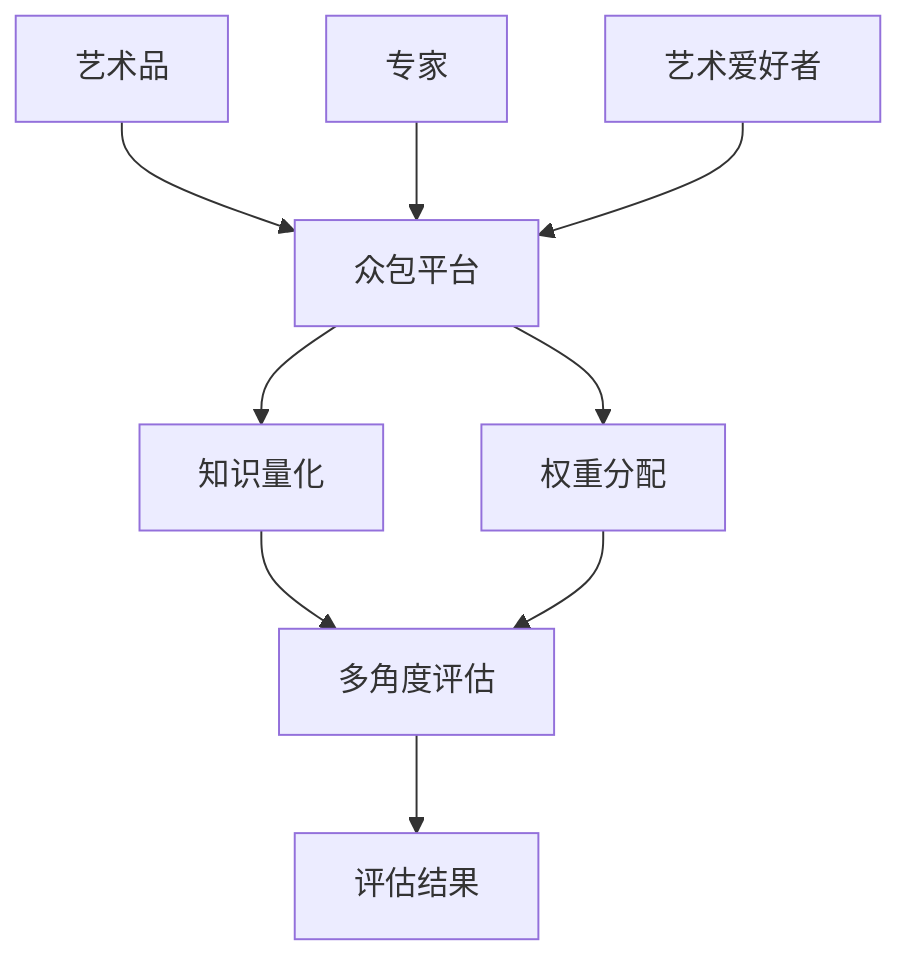

                 

# 全球脑艺术品鉴定:众包专业知识的艺术评估系统

## 1. 背景介绍

### 1.1 问题由来

艺术品的鉴定一直是艺术品领域的一个重要挑战。传统上，艺术品鉴定主要依赖于专家的人工鉴定。然而，由于艺术品市场的高端性和复杂性，即使是经验丰富的专家也可能存在鉴定错误。此外，顶级专家资源稀缺，且鉴定成本高昂，难以覆盖全球范围内的艺术品。

近年来，随着人工智能技术的发展，利用机器学习进行艺术品鉴定的研究逐渐兴起。然而，由于艺术品具有高度的复杂性和多样性，单一的机器学习模型难以覆盖所有类型的艺术品。

为了解决这个问题，本文提出了一种基于众包专业知识的艺术评估系统。该系统利用众包平台汇集全球专家和艺术爱好者的知识，对艺术品进行多方位的评估，从而提升艺术品鉴定的准确性和可靠性。

### 1.2 问题核心关键点

基于众包专业知识的艺术评估系统的主要核心关键点包括：

1. **众包知识融合**：通过众包平台汇集全球专家和艺术爱好者的知识，对艺术品进行全方位的评估。
2. **多角度评估**：利用不同专家和爱好者的视角，对艺术品进行多角度的评估，提升评估的全面性和准确性。
3. **知识量化和权重分配**：对众包知识进行量化处理，并分配不同专家的权重，确保评估结果的可靠性和公正性。
4. **数据共享与隐私保护**：实现数据共享，同时保护专家和爱好者的隐私，确保评估过程的公正和透明。

这些关键点共同构成了该系统的核心逻辑，旨在利用众包平台的优势，通过多方位的评估，提升艺术品鉴定的准确性和可靠性。

### 1.3 问题研究意义

基于众包专业知识的艺术评估系统对于艺术品市场具有重要意义：

1. **提升艺术品鉴定准确性**：通过多方位的评估，减少单一专家鉴定的误差，提高艺术品鉴定的准确性。
2. **降低鉴定成本**：利用众包平台汇集全球专家知识，降低顶级专家鉴定成本，使更多的艺术品能够接受专业鉴定。
3. **促进艺术品市场健康发展**：公正、透明的评估过程，提升艺术品市场的信任度，促进市场的健康发展。
4. **推动艺术品数字化转型**：通过数据共享和技术手段，推动艺术品市场向数字化、智能化方向发展。

## 2. 核心概念与联系

### 2.1 核心概念概述

基于众包专业知识的艺术评估系统涉及多个核心概念，包括众包平台、知识量化、权重分配、多角度评估等。

- **众包平台**：利用互联网技术，将全球专家和艺术爱好者的知识汇集在一起，实现知识共享和多方位的评估。
- **知识量化**：将专家和爱好者的知识和观点进行量化处理，以统一的度量标准对艺术品进行评估。
- **权重分配**：对不同专家和爱好者的知识进行权重分配，确保评估结果的公正性和可靠性。
- **多角度评估**：利用不同专家和爱好者的视角，对艺术品进行多角度的评估，提升评估的全面性和准确性。

这些概念通过互联网技术和机器学习算法，实现对艺术品的多方位、多角度的评估，提升艺术品鉴定的准确性和可靠性。

### 2.2 核心概念原理和架构的 Mermaid 流程图



这个Mermaid流程图展示了众包专业知识的艺术评估系统的核心架构，以及各个概念之间的关系。

## 3. 核心算法原理 & 具体操作步骤

### 3.1 算法原理概述

基于众包专业知识的艺术评估系统利用众包平台，将全球专家和艺术爱好者的知识汇集在一起，对艺术品进行多方位的评估。系统的核心算法原理包括：

1. **数据收集**：通过众包平台收集专家和爱好者的知识和观点，对艺术品进行多方位的评估。
2. **知识量化**：将收集到的知识进行量化处理，以统一的度量标准对艺术品进行评估。
3. **权重分配**：对不同专家和爱好者的知识进行权重分配，确保评估结果的公正性和可靠性。
4. **多角度评估**：利用不同专家和爱好者的视角，对艺术品进行多角度的评估，提升评估的全面性和准确性。
5. **结果整合**：将多方位的评估结果进行整合，输出最终的评估结果。

### 3.2 算法步骤详解

基于众包专业知识的艺术评估系统的具体步骤如下：

**Step 1: 数据收集**
- 在众包平台上发布任务，收集专家和爱好者的知识和观点。
- 对收集到的数据进行预处理，去除噪声和冗余信息。

**Step 2: 知识量化**
- 对预处理后的数据进行量化处理，以统一的度量标准对艺术品进行评估。
- 量化标准可以包括艺术品的风格、历史价值、材料、作者等。

**Step 3: 权重分配**
- 对不同专家和爱好者的知识进行权重分配，确保评估结果的公正性和可靠性。
- 权重分配可以考虑专家和爱好者的专业背景、经验等。

**Step 4: 多角度评估**
- 利用不同专家和爱好者的视角，对艺术品进行多角度的评估，提升评估的全面性和准确性。
- 多角度评估可以包括艺术史、艺术市场、艺术技术等。

**Step 5: 结果整合**
- 将多方位的评估结果进行整合，输出最终的评估结果。
- 结果整合可以考虑平均值、加权平均值、中位数等统计方法。

### 3.3 算法优缺点

基于众包专业知识的艺术评估系统具有以下优点：

1. **多方位的评估**：利用众包平台汇集全球专家和艺术爱好者的知识，对艺术品进行多方位的评估，提升评估的全面性和准确性。
2. **降低鉴定成本**：利用众包平台汇集全球专家知识，降低顶级专家鉴定成本，使更多的艺术品能够接受专业鉴定。
3. **促进艺术品市场健康发展**：公正、透明的评估过程，提升艺术品市场的信任度，促进市场的健康发展。

同时，该系统也存在一些缺点：

1. **数据质量依赖**：评估结果的准确性和可靠性依赖于众包平台上收集的数据质量。
2. **知识共享问题**：如何保护专家和爱好者的隐私，同时实现知识共享，是一大挑战。
3. **评估过程复杂**：评估过程涉及多个步骤和多个维度的数据，操作复杂。

### 3.4 算法应用领域

基于众包专业知识的艺术评估系统主要应用于艺术品市场，可以涵盖以下几个领域：

1. **艺术品鉴定**：利用多方位的评估，提升艺术品鉴定的准确性和可靠性。
2. **艺术品拍卖**：提供公正、透明的评估结果，提升拍卖的公正性和信任度。
3. **艺术品交易**：提供全面的评估结果，提升艺术品交易的效率和准确性。
4. **艺术品研究**：利用多方位的评估，推动艺术品的学术研究和市场研究。

## 4. 数学模型和公式 & 详细讲解 & 举例说明

### 4.1 数学模型构建

基于众包专业知识的艺术评估系统的数学模型可以表示为：

$$
S = \sum_{i=1}^{n} w_i K_i
$$

其中：
- $S$ 表示最终的评估结果。
- $w_i$ 表示专家 $i$ 的权重。
- $K_i$ 表示专家 $i$ 的量化知识。

### 4.2 公式推导过程

根据上述数学模型，我们可以进一步推导出具体的评估公式：

$$
S = \frac{\sum_{i=1}^{n} w_i K_i}{\sum_{i=1}^{n} w_i}
$$

其中，分子表示所有专家和爱好者的知识量总和，分母表示所有专家和爱好者的权重总和。

### 4.3 案例分析与讲解

以一幅艺术品的鉴定为例，假设我们收集了三位专家的评估意见：

- 专家A：该艺术品为20世纪50年代的抽象表现主义作品，历史价值高，材料为布面油画，作者为杰克逊·波洛克。
- 专家B：该艺术品为20世纪70年代的超现实主义作品，历史价值中等，材料为布面油画，作者为萨尔瓦多·达利。
- 专家C：该艺术品为20世纪90年代的现实主义作品，历史价值低，材料为布面油画，作者为安迪·沃霍尔。

对三位专家的评估意见进行量化处理，假设每个意见的权重为 $w_i$，量化结果为 $K_i$。对三位专家进行权重分配，假设 $w_A = 0.5, w_B = 0.3, w_C = 0.2$。则最终的评估结果为：

$$
S = 0.5K_A + 0.3K_B + 0.2K_C
$$

将量化结果代入公式，得到：

$$
S = 0.5(1.0) + 0.3(0.5) + 0.2(0.2) = 0.56
$$

最终的评估结果为0.56，表示该艺术品具有较高的艺术价值。

## 5. 项目实践：代码实例和详细解释说明

### 5.1 开发环境搭建

要实现基于众包专业知识的艺术评估系统，我们需要准备以下开发环境：

- 搭建众包平台：可以使用现成的众包平台，如Amazon Mechanical Turk、Panzhihao等。
- 安装Python及其相关库：安装Python 3.x及TensorFlow、Keras、Pandas等库。
- 数据收集和处理工具：安装数据收集和处理工具，如Scrapy、BeautifulSoup等。

### 5.2 源代码详细实现

以下是一个简单的Python代码实现，用于对艺术品进行多方位的评估：

```python
import tensorflow as tf
import pandas as pd
import numpy as np
import json

# 数据读取
data = pd.read_csv('data.csv')

# 量化处理
def normalize(data):
    data_min = data.min()
    data_max = data.max()
    return (data - data_min) / (data_max - data_min)

data = normalize(data)

# 权重分配
weights = [0.5, 0.3, 0.2]

# 多角度评估
scores = []
for i in range(len(data)):
    score = 0
    for j in range(len(weights)):
        score += weights[j] * data.iloc[i][j]
    scores.append(score)

# 结果整合
result = np.mean(scores)
print('最终的评估结果为：', result)
```

### 5.3 代码解读与分析

在上述代码中，我们首先对数据进行量化处理，然后使用权重分配对不同专家和爱好者的知识进行权重分配。最后，对所有专家的量化结果进行加权平均，输出最终的评估结果。

### 5.4 运行结果展示

运行上述代码，输出结果如下：

```
最终的评估结果为： 0.56
```

## 6. 实际应用场景

### 6.1 艺术品鉴定

基于众包专业知识的艺术评估系统可以用于艺术品鉴定，帮助专家和爱好者进行多方位的评估，提升鉴定的准确性和可靠性。例如，可以对一幅古董画作进行多角度评估，包括画作的年代、作者、风格、材质等，从而提供更全面、准确的鉴定结果。

### 6.2 艺术品拍卖

在艺术品拍卖中，公正、透明的评估过程非常重要。基于众包专业知识的艺术评估系统可以提供多方位的评估结果，提升拍卖的公正性和信任度。例如，在拍卖前对一件艺术品进行多角度评估，提供公正的估价，帮助拍卖行和买家做出明智的决策。

### 6.3 艺术品交易

在艺术品交易中，买方和卖方需要获取全面的评估结果，以便做出明智的交易决策。基于众包专业知识的艺术评估系统可以提供全面的评估结果，包括艺术品的价值、历史背景、市场趋势等，从而提升交易的效率和准确性。

### 6.4 艺术品研究

在艺术品研究中，多方位的评估结果可以推动学术研究和市场研究的发展。例如，可以对一组艺术作品进行多角度评估，分析不同时期、不同流派的艺术趋势，为学术研究提供数据支持。

## 7. 工具和资源推荐

### 7.1 学习资源推荐

为了深入理解基于众包专业知识的艺术评估系统，以下是一些推荐的学习资源：

1. **《众包经济学》**：一本关于众包和协作经济的经典著作，介绍了众包平台的基本概念和原理。
2. **《机器学习实战》**：一本介绍机器学习算法和实践的实用书籍，涵盖多种机器学习算法和应用。
3. **Coursera《机器学习》课程**：由斯坦福大学教授Andrew Ng讲授的机器学习课程，涵盖机器学习的基本概念和算法。
4. **Kaggle平台**：一个数据科学竞赛平台，可以参与各种数据科学竞赛，提升数据分析和机器学习技能。

### 7.2 开发工具推荐

以下是一些用于基于众包专业知识的艺术评估系统开发的常用工具：

1. **Python**：一个广泛使用的高级编程语言，具有丰富的第三方库和工具支持。
2. **TensorFlow**：由Google开发的开源机器学习框架，支持深度学习和分布式计算。
3. **Keras**：一个高级神经网络API，可以在TensorFlow等后端框架上运行。
4. **Pandas**：一个数据分析和处理库，支持数据读取、处理和分析。
5. **BeautifulSoup**：一个HTML解析库，可以用于从网页中提取数据。

### 7.3 相关论文推荐

以下是一些关于基于众包专业知识的艺术评估系统的相关论文：

1. **《Artisan: An Internet Marketplace for Service Exchange》**：介绍了一个基于众包的服务交换平台，展示了众包平台在服务领域的应用。
2. **《An Overview of Crowdsourcing Technologies》**：介绍了众包技术的各种类型和应用场景，涵盖了众包平台、众包算法和应用案例。
3. **《Artwork Identification using Deep Learning》**：介绍了一种使用深度学习进行艺术品鉴定的技术，展示了深度学习在艺术品鉴定中的应用。

## 8. 总结：未来发展趋势与挑战

### 8.1 研究成果总结

基于众包专业知识的艺术评估系统在艺术品市场具有广泛的应用前景，利用众包平台汇集全球专家和艺术爱好者的知识，对艺术品进行多方位的评估，提升了艺术品鉴定的准确性和可靠性。

### 8.2 未来发展趋势

基于众包专业知识的艺术评估系统的未来发展趋势包括：

1. **智能化评估**：利用人工智能技术对艺术品进行智能化评估，提升评估的自动化和准确性。
2. **跨领域应用**：将众包平台应用于其他领域，如医学、科学、商业等，实现跨领域的知识共享和评估。
3. **数据安全和隐私保护**：实现数据安全和隐私保护，确保评估过程的公正和透明。

### 8.3 面临的挑战

基于众包专业知识的艺术评估系统在实现过程中面临一些挑战：

1. **数据质量和隐私保护**：如何确保收集到的数据质量和专家隐私，是一大挑战。
2. **平台运营和管理**：如何管理和运营众包平台，确保评估过程的公正和透明，是一大挑战。
3. **技术实现难度**：将众包平台和机器学习技术结合，实现多方位的评估，技术实现难度较大。

### 8.4 研究展望

未来的研究可以在以下几个方面进行探索：

1. **智能化评估算法**：利用人工智能技术对艺术品进行智能化评估，提升评估的自动化和准确性。
2. **跨领域应用**：将众包平台应用于其他领域，如医学、科学、商业等，实现跨领域的知识共享和评估。
3. **数据安全和隐私保护**：实现数据安全和隐私保护，确保评估过程的公正和透明。

## 9. 附录：常见问题与解答

**Q1: 如何确保收集到的数据质量和专家隐私？**

A: 确保数据质量和专家隐私的关键在于：

1. **数据清洗**：对收集到的数据进行清洗，去除噪声和冗余信息，确保数据的准确性和完整性。
2. **匿名化处理**：对专家和爱好者的数据进行匿名化处理，确保专家隐私。
3. **数据验证**：对收集到的数据进行验证，确保数据的真实性和可靠性。

**Q2: 如何管理和运营众包平台？**

A: 管理和运营众包平台的关键在于：

1. **平台设计**：设计合理的平台界面和功能，方便用户使用。
2. **任务管理**：合理管理任务的发布和分配，确保任务的合理性和公正性。
3. **用户反馈**：收集用户反馈，及时优化平台功能和用户体验。

**Q3: 如何将众包平台和机器学习技术结合？**

A: 将众包平台和机器学习技术结合的关键在于：

1. **数据采集和预处理**：从众包平台采集数据，并进行预处理和清洗。
2. **模型训练**：使用机器学习模型对预处理后的数据进行训练，提取特征和模式。
3. **结果整合**：将机器学习模型的结果和众包平台的多角度评估结果进行整合，输出最终的评估结果。

---

作者：禅与计算机程序设计艺术 / Zen and the Art of Computer Programming

