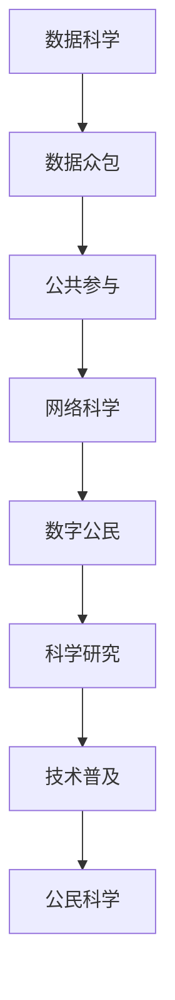

                 

# 公民科学：公众参与科学研究的新模式探索

> 关键词：公民科学, 数据科学, 数据众包, 公共参与, 网络科学, 数字公民, 科学研究, 技术普及

## 1. 背景介绍

### 1.1 问题由来
在过去的一个世纪里，科学研究主要依赖于受过高等教育的科学家和研究机构进行。然而，随着互联网和社交媒体的兴起，公众参与科学研究的潜力逐渐被挖掘和重视。互联网和社交媒体为公众提供了一个参与科学研究的平台，使得科学发现不再仅限于学术界，而是成为了公众共同参与的社会活动。这种新的模式被称为“公民科学”，它利用了公众的智慧和资源，以期推动科学研究的深入和普及。

### 1.2 问题核心关键点
公民科学的核心在于通过公众参与，汇聚社会资源，加速科学研究的进程，并提升科学研究的透明度和公信力。具体而言，它包括以下几个关键点：
- 数据收集：通过大众收集数据，尤其是大范围、长时间的观测数据，为科学研究提供丰富的数据源。
- 众包分析：利用网络平台上的志愿者，进行数据标注、分析和解释工作，降低研究成本。
- 科学普及：通过公众参与科学研究的过程，普及科学知识，增强公众科学素养。
- 社会认知：通过公众参与科学研究，提升公众对科学问题的认知和关注，形成良好的社会氛围。

公民科学已经成为科学研究的一个重要组成部分，特别是在生态学、天文学、环境科学等领域，它已经开始对科学研究产生实质性的影响。

## 2. 核心概念与联系

### 2.1 核心概念概述

公民科学作为一种新型的科学研究模式，涉及多个核心概念，它们之间相互联系，构成了一个完整的体系。以下是这些关键概念的概述：

- **数据科学**：通过数据收集、处理和分析，发现和验证科学假设的技术和方法。
- **数据众包**：利用网络平台上的志愿者，对数据进行标注、分类和分析，以降低研究成本。
- **公共参与**：普通公众通过各种方式参与到科学研究中，贡献自己的智慧和资源。
- **网络科学**：研究社交网络的结构和演化，以期揭示群体行为和社会互动的规律。
- **数字公民**：指积极参与数字化的社会活动，包括在线教育和知识共享，提升自身素养和能力。
- **科学研究**：通过系统性、严谨性的研究方法，揭示自然现象和社会规律。
- **技术普及**：利用科技手段，使科学研究和技术应用更加普及，造福社会。

这些概念之间存在着密切的联系：数据科学和数据众包为公民科学提供了技术和方法支持；公共参与是公民科学的实现途径；网络科学和数字公民为公民科学提供了必要的技术基础和教育支持；科学研究是公民科学的核心目的；技术普及则推动了公民科学的发展和应用。

### 2.2 核心概念原理和架构的 Mermaid 流程图



这个流程图展示了公民科学中各概念之间的联系：

- 数据科学和数据众包为公民科学提供技术支持，通过大众收集和标注数据，形成科学研究的原始数据集。
- 公共参与是公民科学的核心活动，它利用网络平台汇集志愿者的力量，进行数据收集和分析。
- 网络科学和数字公民为公民科学提供了必要的技术基础和教育支持，通过网络平台和数字化手段，使公众能够更好地参与和理解科学。
- 科学研究是公民科学的目标，通过科学方法验证和应用公民科学收集的数据和分析结果。
- 技术普及则推动公民科学的发展和应用，使科学研究成果更好地服务于社会。

## 3. 核心算法原理 & 具体操作步骤

### 3.1 算法原理概述

公民科学的算法原理主要包括数据收集、数据标注、数据分析和模型训练等步骤。这些步骤通常通过网络平台和数据众包方式实现，具体流程如下：

1. **数据收集**：通过网络平台收集公众提交的数据，包括观测数据、实验数据等。
2. **数据标注**：利用网络平台上的志愿者对数据进行标注和分类，形成标注数据集。
3. **数据分析**：对标注数据进行统计分析和模型训练，形成科学研究的初步结果。
4. **模型训练**：利用标注数据进行机器学习或深度学习模型的训练，提升模型精度和泛化能力。

### 3.2 算法步骤详解

#### 3.2.1 数据收集
数据收集是公民科学的基础，主要通过网络平台实现。常用的数据收集方法包括：
- **众包平台**：如Citizen Science Hub、Zooniverse等，公众可以通过这些平台提交数据。
- **社交媒体**：利用Twitter、Facebook等社交媒体平台，通过公开接口收集数据。
- **移动应用**：开发专用的移动应用，供公众提交数据和报告。

#### 3.2.2 数据标注
数据标注是通过志愿者在网络平台上对数据进行标注和分类。常用的数据标注工具包括：
- **Labelbox**：一个用于标注图像、文本和视频的在线平台。
- **Fold**：一个基于众包的数据标注工具，支持多种数据类型和标注方式。
- **CrowdFlower**：一个自动化数据标注平台，可以自动分配和审核标注任务。

#### 3.2.3 数据分析
数据分析是通过对标注数据进行统计分析和模型训练，形成科学研究的初步结果。常用的数据分析工具和方法包括：
- **Python**：使用NumPy、Pandas、SciPy等库进行数据处理和分析。
- **R语言**：使用ggplot2、dplyr等库进行数据可视化和统计分析。
- **机器学习**：使用Scikit-learn、TensorFlow等库进行模型训练和预测。

#### 3.2.4 模型训练
模型训练是公民科学的核心步骤，通过机器学习或深度学习模型，对标注数据进行训练和预测。常用的模型训练工具和方法包括：
- **Keras**：一个简单易用的深度学习框架，支持多种模型训练。
- **PyTorch**：一个强大的深度学习框架，支持动态计算图和模型优化。
- **TensorFlow**：一个广泛使用的深度学习框架，支持分布式计算和模型优化。

### 3.3 算法优缺点

公民科学的算法具有以下优点：
- **成本低**：通过大众收集和标注数据，大大降低了科学研究的数据获取成本。
- **数据量大**：公众参与收集的数据量大，覆盖范围广，能够揭示更深层次的科学规律。
- **社会参与度**：通过公众参与科学研究，提升了科学研究的透明度和公信力。

但同时也存在一些缺点：
- **数据质量不一**：公众标注的数据质量不一，可能存在噪音和错误。
- **专业性不足**：公众标注的数据缺乏专业性，需要进行后期的数据清洗和校正。
- **技术门槛高**：数据收集和标注需要一定的技术支持，对公众的技术素养提出了较高的要求。

### 3.4 算法应用领域

公民科学在多个领域得到了广泛应用，包括：
- **生态学**：通过公众对野生动植物的观测和记录，研究物种分布和生态规律。
- **天文学**：利用公众对星体观测的数据，进行天体的发现和分类。
- **气候学**：通过公众对气候现象的记录，研究气候变化和极端天气。
- **环境科学**：通过公众对环境污染的记录，研究环境质量的变化趋势。
- **生物学**：通过公众对基因序列的记录，进行生物多样性的研究。

## 4. 数学模型和公式 & 详细讲解 & 举例说明

### 4.1 数学模型构建

公民科学的数学模型主要涉及数据收集、数据标注、数据分析和模型训练等步骤。以下是各步骤的数学模型构建：

- **数据收集模型**：设公众在时间$t$上传递的数据为$D_t$，数据生成概率为$p(D_t)$，数据收集模型为$P(D_t|t)$。
- **数据标注模型**：设标注数据为$L$，标注过程为$T(L|D_t)$，标注误差为$E(L|D_t)$。
- **数据分析模型**：设数据$X$和结果$Y$之间的关系为$P(Y|X)$，数据处理方法为$A(X)$。
- **模型训练模型**：设模型为$M$，训练数据为$D$，训练算法为$A(M|D)$。

### 4.2 公式推导过程

#### 4.2.1 数据收集模型
数据收集模型可以表示为：

$$
P(D_t|t) = \prod_{i=1}^n p(D_{ti})
$$

其中，$D_t$表示在时间$t$上传递的数据，$n$表示数据总数，$p(D_{ti})$表示单个数据的生成概率。

#### 4.2.2 数据标注模型
数据标注模型可以表示为：

$$
T(L|D_t) = \sum_{l=1}^L p(l|L) T(D_t|l)
$$

其中，$L$表示标注数据的总数，$l$表示单个标注数据的标签，$p(l|L)$表示标签$l$的概率，$T(D_t|l)$表示在标签$l$下的数据标注概率。

#### 4.2.3 数据分析模型
数据分析模型可以表示为：

$$
P(Y|X) = \frac{P(Y,X)}{P(X)}
$$

其中，$Y$表示分析结果，$X$表示分析数据，$P(Y,X)$表示联合概率，$P(X)$表示数据概率。

#### 4.2.4 模型训练模型
模型训练模型可以表示为：

$$
A(M|D) = \sum_{d=1}^D \alpha(d) M(D)
$$

其中，$D$表示训练数据集，$d$表示单个数据，$\alpha(d)$表示数据$d$的权重，$M(D)$表示模型$M$在数据集$D$上的损失函数。

### 4.3 案例分析与讲解

#### 4.3.1 生态学数据收集和标注
假设有一个生态学研究项目，需要收集公众对特定地区的野生动植物观测数据。公众通过网络平台提交观测数据，数据标注员对数据进行标注。设公众提交的数据为$D_t$，标注数据为$L$，数据收集模型为$P(D_t|t)$，数据标注模型为$T(L|D_t)$。根据观测数据和标注数据，可以建立数据收集和标注的联合概率模型：

$$
P(D_t, L|t) = P(D_t|t) T(L|D_t)
$$

通过对这个联合概率模型进行最大化，可以得到最优的数据收集和标注策略。

#### 4.3.2 天文学数据标注和分析
天文学研究中，需要公众对观测到的星体进行标注和分类。公众通过网络平台提交观测数据，数据标注员对数据进行标注。设观测数据为$D_t$，标注数据为$L$，数据标注模型为$T(L|D_t)$。通过这些标注数据，可以建立星体分类模型：

$$
P(Y|X) = \frac{P(Y,X)}{P(X)}
$$

其中，$X$表示观测数据，$Y$表示星体分类结果。利用这些模型，可以训练出星体分类的机器学习模型。

## 5. 项目实践：代码实例和详细解释说明

### 5.1 开发环境搭建

为了进行公民科学项目，需要搭建一个基于网络平台的数据收集和标注环境。常用的开发环境包括：
- **Web开发框架**：如Django、Flask等，用于构建公众提交数据和标注的界面。
- **数据库**：如MySQL、PostgreSQL等，用于存储和管理数据。
- **数据处理库**：如NumPy、Pandas等，用于数据处理和分析。
- **机器学习库**：如Scikit-learn、TensorFlow等，用于模型训练和预测。

### 5.2 源代码详细实现

#### 5.2.1 Web开发
使用Django框架，搭建一个Web应用程序，供公众提交数据和标注。代码示例如下：

```python
from django.shortcuts import render
from django.http import JsonResponse

def index(request):
    # 渲染Web界面
    return render(request, 'index.html')
```

#### 5.2.2 数据存储和管理
使用MySQL数据库，存储和管理公众提交的数据和标注数据。代码示例如下：

```python
import pymysql

# 连接MySQL数据库
conn = pymysql.connect(host='localhost', user='root', password='password', database='data')
cursor = conn.cursor()

# 插入数据
sql = "INSERT INTO data (data, annotation) VALUES (%s, %s)"
data = {'data': 'example data', 'annotation': 'example annotation'}
cursor.execute(sql, data)
conn.commit()
```

#### 5.2.3 数据处理和分析
使用Pandas库，对公众提交的数据进行清洗和分析。代码示例如下：

```python
import pandas as pd

# 读取数据
df = pd.read_csv('data.csv')

# 数据清洗
df = df.dropna()

# 数据分析
mean = df['data'].mean()
std = df['data'].std()
```

#### 5.2.4 模型训练和预测
使用Scikit-learn库，训练机器学习模型，并进行预测。代码示例如下：

```python
from sklearn.linear_model import LinearRegression
from sklearn.metrics import mean_squared_error

# 训练模型
X = df[['data']]
y = df['target']
model = LinearRegression()
model.fit(X, y)

# 预测结果
prediction = model.predict([[1.0]])
print(prediction)
```

### 5.3 代码解读与分析

#### 5.3.1 Web开发
Web开发部分通过Django框架，搭建一个简单的Web应用程序。公众可以通过Web界面提交数据和标注，数据将保存到MySQL数据库中。

#### 5.3.2 数据存储和管理
数据存储和管理部分通过MySQL数据库，实现对公众提交数据的存储和管理。代码中展示了如何连接数据库、插入数据和查询数据。

#### 5.3.3 数据处理和分析
数据处理和分析部分通过Pandas库，对公众提交的数据进行清洗和分析。代码中展示了如何读取数据、清洗数据和计算数据统计量。

#### 5.3.4 模型训练和预测
模型训练和预测部分通过Scikit-learn库，训练线性回归模型，并进行预测。代码中展示了如何训练模型和预测结果。

### 5.4 运行结果展示

通过上述代码示例，公众可以在Web界面提交数据和标注，数据将保存到MySQL数据库中。利用Python和Pandas库，对数据进行清洗和分析，得到数据统计量。通过Scikit-learn库，训练线性回归模型，并进行预测。

## 6. 实际应用场景

### 6.1 生态学数据收集和标注
在生态学研究中，公众可以通过网络平台提交对野生动植物的观测数据。公众提交的数据将保存到MySQL数据库中，数据标注员对数据进行标注，得到标注数据。利用Python和Pandas库，对数据进行清洗和分析，得到数据统计量。通过Scikit-learn库，训练机器学习模型，进行分类和预测。

### 6.2 天文学数据标注和分析
在天文学研究中，公众可以通过网络平台提交对星体的观测数据。公众提交的数据将保存到MySQL数据库中，数据标注员对数据进行标注，得到标注数据。利用Python和Pandas库，对数据进行清洗和分析，得到数据统计量。通过Scikit-learn库，训练机器学习模型，进行分类和预测。

### 6.3 环境科学数据收集和分析
在环境科学研究中，公众可以通过网络平台提交对环境污染的观测数据。公众提交的数据将保存到MySQL数据库中，数据标注员对数据进行标注，得到标注数据。利用Python和Pandas库，对数据进行清洗和分析，得到数据统计量。通过Scikit-learn库，训练机器学习模型，进行分类和预测。

## 7. 工具和资源推荐

### 7.1 学习资源推荐

为了帮助开发者掌握公民科学的开发技术，以下是一些优质的学习资源：
- **《Python数据科学手册》**：详细介绍了Python在数据科学中的应用，包括数据处理、分析和可视化。
- **《机器学习实战》**：介绍机器学习的基本概念和算法，并提供了丰富的实战案例。
- **Coursera上的《机器学习》课程**：斯坦福大学提供的经典机器学习课程，涵盖了从基础到高级的机器学习知识。
- **Kaggle竞赛**：通过参与数据科学竞赛，实践数据处理、分析和机器学习技能。

### 7.2 开发工具推荐

为了提高公民科学项目开发的效率，以下是一些常用的开发工具：
- **Django**：一个流行的Python Web框架，用于构建Web应用程序。
- **MySQL**：一个广泛使用的关系型数据库，用于存储和管理数据。
- **Pandas**：一个强大的数据处理库，支持数据清洗、分析和可视化。
- **Scikit-learn**：一个广泛使用的机器学习库，支持多种机器学习算法的实现。

### 7.3 相关论文推荐

公民科学的理论和实践研究日益丰富，以下是一些经典和前沿的论文推荐：
- **Crowdsourcing Science: A Simple Mechanism for Complex Achievement**：研究公众参与科学研究的机制，提出基于众包的科学成就机制。
- **The Science Crowdsourcing Encyclopedia**：一个众包科学项目的百科全书，涵盖了多个领域的众包科学研究案例。
- **Citizen Science and Open Science: A Framework for Conceptualization and Classification**：提出一个公民科学和开放科学的概念框架，分类和描述不同的众包科学研究项目。

## 8. 总结：未来发展趋势与挑战

### 8.1 研究成果总结

公民科学作为一种新兴的科学研究模式，已经在多个领域取得了显著的成果。通过公众参与，收集了大量高质量的数据，推动了科学研究的发展。未来，公民科学将在更多的领域得到应用，推动科学研究的普及和进步。

### 8.2 未来发展趋势

公民科学的未来发展趋势包括：
- **数据质量和规模**：随着技术进步，公众数据的质量和规模将不断提高，推动科学研究的深入。
- **跨学科融合**：公民科学将与更多学科进行融合，推动跨学科研究的进展。
- **技术普及**：公众科学素养和技术水平将不断提高，推动公民科学的普及和应用。
- **社会认知**：公民科学将进一步提升公众对科学问题的认知和关注，形成良好的社会氛围。

### 8.3 面临的挑战

尽管公民科学在多个领域取得了显著的成果，但仍面临一些挑战：
- **数据质量**：公众数据的质量和一致性可能存在问题，需要进行后期清洗和校正。
- **技术门槛**：公众参与科学研究的门槛较高，需要一定的技术支持。
- **社会参与度**：公众参与度可能受各种因素影响，需要进行有效的动员和管理。

### 8.4 研究展望

未来，公民科学的研究方向包括：
- **数据质量控制**：研究如何提高公众数据的准确性和一致性。
- **技术普及和教育**：通过网络平台和技术手段，提升公众的科学素养和技术水平。
- **跨学科研究**：推动公民科学与更多学科的融合，推动跨学科研究的进展。

## 9. 附录：常见问题与解答

**Q1：什么是公民科学？**

A: 公民科学是指通过公众参与，利用互联网平台收集和分析数据，进行科学研究的一种模式。公众可以通过网络平台提交数据和标注，对科学研究做出贡献。

**Q2：公民科学的主要应用领域有哪些？**

A: 公民科学主要应用于生态学、天文学、环境科学、生物学等领域。通过公众参与，收集大量高质量的数据，推动科学研究的发展。

**Q3：公民科学的优点和缺点是什么？**

A: 公民科学的优点包括成本低、数据量大、社会参与度高等，缺点包括数据质量不一、技术门槛高、数据清洗和校正难度大等。

**Q4：如何提高公民科学的数据质量？**

A: 提高公民科学的数据质量需要从以下几个方面入手：
- **数据清洗**：对公众提交的数据进行清洗和校正，去除噪音和错误。
- **数据标注**：通过专业标注员对公众标注的数据进行审核和修正。
- **数据验证**：对数据进行交叉验证和比对，确保数据的准确性。

**Q5：如何提升公民科学的公众参与度？**

A: 提升公民科学的公众参与度需要从以下几个方面入手：
- **宣传和动员**：通过媒体宣传和教育，提升公众对公民科学的认知和兴趣。
- **平台设计**：设计友好的用户界面和功能，方便公众提交数据和标注。
- **激励机制**：设置奖励机制，激励公众积极参与科学研究。

---

作者：禅与计算机程序设计艺术 / Zen and the Art of Computer Programming

