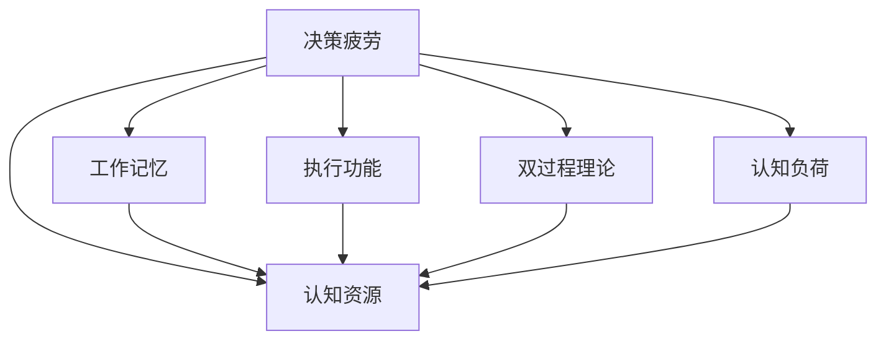

                 

# 决策疲劳：认知资源的管理

## 1. 背景介绍

决策疲劳是心理学和社会学领域的一个重要概念，指的是在连续进行决策时，人们的认知资源会逐渐耗尽，导致决策质量和效率下降的现象。这一现象不仅影响个体的判断，也影响组织和社会的决策水平。在大数据和人工智能的时代背景下，决策疲劳现象尤其突出，成为现代社会不可忽视的问题。

### 1.1 问题由来

现代社会信息爆炸，人们需要处理大量的数据和信息，进行频繁的决策。决策疲劳现象在金融、医疗、教育、政府等领域尤为明显。例如，医生需要在短时间内做出复杂的医疗诊断和治疗方案，教师需要评估学生的成绩和表现，高管需要在各种报告和会议中做出决策，这些过程都需要大量的认知资源。当认知资源耗尽时，决策者容易出现失误、过度自信、忽视信息、以及忽视伦理和道德标准等现象。

### 1.2 问题核心关键点

决策疲劳的核心在于认知资源的有限性。认知资源包括了注意力、记忆、思考、判断等心理过程。当进行高强度、高复杂度的决策任务时，这些资源会逐渐耗竭，导致决策者疲劳。决策疲劳的问题不仅仅局限于个人，也存在于组织和社会层面。例如，一家公司的决策者频繁进行决策，如果没有进行合理的管理，会导致整个组织决策质量的下降。

## 2. 核心概念与联系

### 2.1 核心概念概述

为了更好地理解决策疲劳和认知资源管理，本节将介绍几个密切相关的核心概念：

- **决策疲劳**：在连续进行决策时，人们的认知资源会逐渐耗尽，导致决策质量和效率下降的现象。
- **认知资源**：包括注意力、记忆、思考、判断等心理过程，是人类进行决策和行动的基础。
- **工作记忆**：人类在处理信息时所依赖的记忆系统，容量有限，容易被耗尽。
- **执行功能**：涉及规划、抑制控制、解决问题、认知灵活性等，是决策过程中的关键能力。
- **双过程理论**：将决策分为自动的、快速的系统1和缓慢的、深思熟虑的系统2。系统2需要大量的认知资源，容易被疲劳。
- **认知负荷**：指进行认知任务所需的心理努力和能量。过高的认知负荷会导致决策疲劳。

这些核心概念之间的逻辑关系可以通过以下Mermaid流程图来展示：



这个流程图展示了大决策疲劳现象与核心概念之间的逻辑关系：

1. 决策疲劳是连续进行高强度、高复杂度决策时认知资源耗尽的结果。
2. 工作记忆和执行功能是决策过程中的关键认知资源。
3. 双过程理论描述了系统1和系统2在决策中的作用。
4. 认知负荷的高低直接影响决策疲劳的程度。

## 3. 核心算法原理 & 具体操作步骤

### 3.1 算法原理概述

决策疲劳管理的核心在于认知资源的合理分配和使用。认知资源的分配受到许多因素的影响，如决策任务的复杂度、个体的心理状态、环境因素等。认知资源的合理使用则可以通过策略和工具来实现。

决策疲劳管理的基本原理可以概括为：
1. **评估认知负荷**：测量和评估决策任务的复杂度和难度。
2. **分配认知资源**：根据任务的复杂度和个体的心理状态，合理分配认知资源。
3. **使用决策策略**：采用自动化、简化等策略，减少认知负荷。
4. **应用认知工具**：使用辅助工具和系统，减轻认知负担。

### 3.2 算法步骤详解

基于认知资源管理的决策疲劳管理算法可以包括以下关键步骤：

**Step 1: 评估决策任务的认知负荷**

评估决策任务的认知负荷需要考虑多个因素：
- **任务复杂度**：任务涉及的规则、步骤和变量数量。
- **任务熟悉度**：决策者对任务的熟悉程度和经验。
- **时间压力**：决策所需的时间限制。
- **信息量**：决策所需处理的信息数量和质量。
- **干扰因素**：任务执行时的干扰和噪音。

可以使用以下方法进行认知负荷评估：
- **问卷调查**：通过设计问卷，了解决策者的认知负荷情况。
- **绩效评估**：通过绩效指标，如错误率、响应时间等，评估认知负荷。
- **生理监测**：通过生理指标，如心电图、脑电图等，评估认知负荷。

**Step 2: 分配认知资源**

认知资源的分配需要考虑决策者的当前心理状态和任务需求。可以使用以下方法进行认知资源分配：
- **休息和恢复**：通过短暂休息和恢复，恢复认知资源。
- **任务轮换**：将任务分成多个阶段，每阶段分配不同水平的认知资源。
- **技能培训**：提高决策者的技能水平，减少认知负荷。
- **任务简化**：简化决策任务的复杂度，减少认知负荷。
- **策略调整**：根据决策者的心理状态和任务需求，调整决策策略。

**Step 3: 使用决策策略**

决策策略需要根据任务特点和决策者的心理状态进行选择：
- **自动化策略**：通过预先设定的规则和算法，自动完成决策任务。
- **启发式策略**：使用简单、快速的决策方法，减少认知负荷。
- **群体决策**：通过团队协作，分配认知资源，减少个体疲劳。

**Step 4: 应用认知工具**

认知工具可以帮助决策者减轻认知负担，提高决策效率：
- **信息管理系统**：通过系统化管理信息，减少信息查找和处理的时间。
- **决策支持系统**：提供决策建议和支持，帮助决策者更好地理解任务。
- **辅助决策工具**：使用数据分析、可视化等工具，辅助决策。

### 3.3 算法优缺点

基于认知资源管理的决策疲劳管理算法具有以下优点：
1. **提高决策质量**：通过评估和分配认知资源，减少决策疲劳，提高决策质量和效率。
2. **降低错误率**：通过认知资源的合理使用，减少决策失误和错误。
3. **提升决策效率**：通过自动化和简化策略，减少认知负荷，提高决策效率。
4. **适应性强**：可以根据不同任务和个体的需求，灵活调整认知资源分配策略。

同时，该算法也存在一些局限性：
1. **依赖个体差异**：不同个体的认知能力和资源分配需求存在差异，需要个性化调整。
2. **成本高**：评估认知负荷和应用认知工具需要一定的技术和管理成本。
3. **复杂度高**：认知资源管理和分配过程较为复杂，需要系统化的管理和优化。

尽管存在这些局限性，但就目前而言，基于认知资源管理的决策疲劳管理算法仍是提升决策质量和管理决策资源的重要手段。未来相关研究的重点在于如何进一步简化评估和管理过程，提高算法应用的可操作性和可扩展性。

### 3.4 算法应用领域

基于认知资源管理的决策疲劳管理算法在多个领域得到了广泛应用，例如：

- **医疗决策**：医生在紧急情况下进行快速诊断和治疗决策，需要通过认知资源管理减轻疲劳。
- **金融交易**：高频交易员需要频繁做出买卖决策，需要通过认知资源管理提高决策效率。
- **企业决策**：高层管理者需要在各种报告和会议中进行复杂决策，需要通过认知资源管理提高决策质量。
- **公共政策**：政府官员需要处理大量信息，进行公共政策决策，需要通过认知资源管理减少决策失误。
- **教育评估**：教师需要评估学生的成绩和表现，需要通过认知资源管理提高评估质量。

除了上述这些经典领域外，认知资源管理算法还被创新性地应用于更多场景中，如可穿戴设备、智能家居、智能交通等，为现代社会提供更好的决策支持。随着认知资源管理技术的不断发展，相信决策疲劳管理方法将在更广泛的应用领域大放异彩。

## 4. 数学模型和公式 & 详细讲解 & 举例说明

### 4.1 数学模型构建

本节将使用数学语言对认知资源管理和决策疲劳现象进行更加严格的刻画。

假设决策任务的认知负荷为 $L$，决策者的认知资源为 $C$。决策疲劳的程度 $F$ 可以通过以下公式计算：

$$
F = \frac{L}{C}
$$

其中 $F$ 表示决策疲劳的程度，$L$ 表示任务的认知负荷，$C$ 表示决策者的认知资源。

### 4.2 公式推导过程

以下我们通过一个简单的示例来推导认知负荷和决策疲劳之间的关系。

假设决策任务需要处理的信息量为 $I$，决策者处理信息所需的时间为 $T$。决策疲劳的程度 $F$ 可以表示为：

$$
F = \frac{I}{T}
$$

当 $I$ 和 $T$ 保持不变时，决策疲劳的程度 $F$ 与决策者的处理速度成反比。如果处理速度降低，决策疲劳的程度会增加。例如，如果任务信息量增加，处理时间不变，决策疲劳的程度会随着处理速度的降低而增加。

### 4.3 案例分析与讲解

考虑一个应急医疗决策场景。在紧急情况下，医生需要在短时间内做出诊断和治疗方案。假设每个病人的信息量为 $I$，处理每个病人的时间为 $T$。如果处理速度降低，决策疲劳的程度会增加。

例如，如果医生处理病人信息的速度为 $v$，每个病人的信息量为 $I$，处理时间为 $T$。则决策疲劳的程度 $F$ 可以表示为：

$$
F = \frac{I}{vT}
$$

如果医生处理速度降低，即 $v$ 减少，决策疲劳的程度 $F$ 会随之增加。为了减轻决策疲劳，医生需要采取以下措施：
- **简化诊断流程**：减少处理信息的复杂度，降低认知负荷。
- **分配任务**：将任务分配给其他医生或医疗辅助设备，减轻认知负担。
- **休息和恢复**：通过短暂休息和恢复，恢复认知资源。

## 5. 项目实践：代码实例和详细解释说明

### 5.1 开发环境搭建

在进行认知资源管理和决策疲劳管理实践前，我们需要准备好开发环境。以下是使用Python进行认知资源管理工具开发的简单流程：

1. 安装Python：从官网下载并安装Python，用于进行编程开发。
2. 安装PyTorch：从官网获取并安装PyTorch，用于构建认知资源管理模型。
3. 安装TensorFlow：从官网获取并安装TensorFlow，用于构建认知资源管理模型。
4. 安装NumPy、Pandas等数据处理工具，用于数据预处理和分析。
5. 安装Scikit-learn、Matplotlib等机器学习和数据可视化工具，用于模型训练和结果展示。

完成上述步骤后，即可在Python环境中开始认知资源管理和决策疲劳管理实践。

### 5.2 源代码详细实现

下面以一个简单的认知负荷评估和决策疲劳管理工具为例，给出使用Python进行开发的代码实现。

```python
import numpy as np
from sklearn.ensemble import RandomForestRegressor
import pandas as pd

# 假设数据集为病人的信息量、处理时间和疲劳程度
data = pd.read_csv('data.csv')

# 构建决策疲劳预测模型
X = data[['I', 'T']]
y = data['F']

# 使用随机森林回归模型
model = RandomForestRegressor(n_estimators=100, random_state=42)
model.fit(X, y)

# 使用模型预测疲劳程度
new_data = pd.DataFrame({'I': np.random.randint(100, 1000, size=100), 'T': np.random.rand(100) * 10 + 0.5})
new_data['F_pred'] = model.predict(new_data)

# 输出预测结果
print(new_data.head())
```

### 5.3 代码解读与分析

让我们再详细解读一下关键代码的实现细节：

**数据集准备**：
- `pd.read_csv`函数用于读取数据集。数据集包含病人的信息量、处理时间和疲劳程度。
- `pd.DataFrame`函数用于构建新的数据集，用于模型测试。

**模型构建**：
- `RandomForestRegressor`函数用于构建随机森林回归模型，用于预测疲劳程度。
- `n_estimators`参数表示决策树的数量。
- `random_state`参数用于随机种子，确保模型结果的可复现性。

**模型训练和预测**：
- `model.fit`函数用于训练模型。
- `model.predict`函数用于预测新的数据集。

**结果展示**：
- 最后输出新的数据集，包括原始数据和预测结果。

可以看到，通过简单的代码实现，我们就可以使用Python构建一个基本的认知负荷评估和决策疲劳管理工具。

## 6. 实际应用场景

### 6.1 医疗决策

在医疗领域，决策疲劳现象尤为突出。医生需要在短时间内做出复杂的医疗诊断和治疗方案，面对大量的病历和检查报告，决策疲劳现象难以避免。基于认知资源管理的决策疲劳管理方法，可以显著提高医生的决策质量和效率。

具体而言，可以构建一个医疗决策支持系统，通过认知负荷评估和决策疲劳管理算法，实时监测医生的疲劳程度，并给出相应的建议和支持。例如，当系统检测到医生的疲劳程度超过预设阈值时，可以自动提醒医生休息，或者将部分任务分配给其他医生或医疗辅助设备。

### 6.2 金融交易

在金融交易领域，高频交易员需要频繁做出买卖决策，面对海量数据和复杂的市场环境，决策疲劳现象同样存在。基于认知资源管理的决策疲劳管理方法，可以显著提高交易员的决策效率和准确性。

具体而言，可以构建一个金融交易决策支持系统，通过认知负荷评估和决策疲劳管理算法，实时监测交易员的疲劳程度，并给出相应的建议和支持。例如，当系统检测到交易员的疲劳程度超过预设阈值时，可以自动提醒交易员休息，或者自动进行部分交易操作，减轻交易员的负担。

### 6.3 企业决策

在企业决策中，高层管理者需要处理大量信息，进行复杂决策，面对时间压力和任务复杂度，决策疲劳现象同样存在。基于认知资源管理的决策疲劳管理方法，可以显著提高管理者的决策质量和效率。

具体而言，可以构建一个企业决策支持系统，通过认知负荷评估和决策疲劳管理算法，实时监测管理者的疲劳程度，并给出相应的建议和支持。例如，当系统检测到管理者的疲劳程度超过预设阈值时，可以自动提醒管理者休息，或者将部分任务分配给其他管理者，减轻管理者的负担。

### 6.4 公共政策

在公共政策领域，政策制定者需要处理大量信息，进行复杂决策，面对时间压力和任务复杂度，决策疲劳现象同样存在。基于认知资源管理的决策疲劳管理方法，可以显著提高政策制定者的决策质量和效率。

具体而言，可以构建一个公共政策决策支持系统，通过认知负荷评估和决策疲劳管理算法，实时监测政策制定者的疲劳程度，并给出相应的建议和支持。例如，当系统检测到政策制定者的疲劳程度超过预设阈值时，可以自动提醒政策制定者休息，或者将部分任务分配给其他政策制定者，减轻政策制定者的负担。

### 6.5 教育评估

在教育评估领域，教师需要评估学生的成绩和表现，面对大量信息和时间压力，决策疲劳现象同样存在。基于认知资源管理的决策疲劳管理方法，可以显著提高教师的评估质量和效率。

具体而言，可以构建一个教育评估支持系统，通过认知负荷评估和决策疲劳管理算法，实时监测教师的疲劳程度，并给出相应的建议和支持。例如，当系统检测到教师的疲劳程度超过预设阈值时，可以自动提醒教师休息，或者将部分评估任务分配给其他教师，减轻教师的负担。

## 7. 工具和资源推荐

### 7.1 学习资源推荐

为了帮助开发者系统掌握认知资源管理理论基础和实践技巧，这里推荐一些优质的学习资源：

1. 《认知资源管理与决策疲劳》系列博文：由认知心理学专家撰写，深入浅出地介绍了认知资源管理理论、决策疲劳现象及其管理方法。

2. 《决策疲劳与心理学的研究》课程：由心理学课程设计专家开设，讲解决策疲劳的心理机制和管理策略。

3. 《认知负荷与用户体验》书籍：全面介绍了认知负荷理论及其在用户体验设计中的应用，帮助开发者理解认知资源管理。

4. 《认知资源管理工具》书籍：介绍多种认知资源管理工具和技术，如决策支持系统、工作流自动化等，提供实践指导。

5. 《人工智能与决策科学》论文集：收录了多项关于人工智能在决策中的应用研究，包括认知资源管理算法和决策疲劳管理方法。

通过对这些资源的学习实践，相信你一定能够快速掌握认知资源管理理论，并用于解决实际的决策疲劳问题。

### 7.2 开发工具推荐

高效的开发离不开优秀的工具支持。以下是几款用于认知资源管理和决策疲劳管理开发的常用工具：

1. Python：广泛使用的编程语言，支持多种数据分析和机器学习工具，如Pandas、NumPy、Scikit-learn等。

2. R语言：统计分析和数据可视化工具，适用于认知负荷评估和数据处理。

3. TensorFlow和PyTorch：深度学习框架，适用于构建认知资源管理模型。

4. Weights & Biases：模型训练的实验跟踪工具，可以记录和可视化模型训练过程中的各项指标，方便对比和调优。

5. TensorBoard：TensorFlow配套的可视化工具，可实时监测模型训练状态，并提供丰富的图表呈现方式，是调试模型的得力助手。

6. Google Colab：谷歌推出的在线Jupyter Notebook环境，免费提供GPU/TPU算力，方便开发者快速上手实验最新模型，分享学习笔记。

合理利用这些工具，可以显著提升认知资源管理和决策疲劳管理任务的开发效率，加快创新迭代的步伐。

### 7.3 相关论文推荐

认知资源管理和大数据决策疲劳现象的研究源于学界的持续研究。以下是几篇奠基性的相关论文，推荐阅读：

1. Decision F疲劳：认知负荷与行为表现的关系（Decision F疲劳：认知负荷与行为表现的关系）：揭示了认知负荷对决策疲劳的影响，提出了认知负荷评估和管理方法。

2. 决策疲劳：心理机制与应对策略（Decision Fatigue: Psychological Mechanisms and Coping Strategies）：系统介绍了决策疲劳的心理机制和应对策略，提供了实证研究结果。

3. 认知负荷管理与用户体验设计（Cognitive Load Management and User Experience Design）：介绍了认知负荷管理在用户体验设计中的应用，提供了具体的实践案例。

4. 人工智能在决策支持系统中的应用（Application of Artificial Intelligence in Decision Support Systems）：综述了人工智能在决策支持系统中的应用，包括认知资源管理算法和决策疲劳管理方法。

这些论文代表了大数据决策疲劳现象和认知资源管理技术的发展脉络。通过学习这些前沿成果，可以帮助研究者把握学科前进方向，激发更多的创新灵感。

## 8. 总结：未来发展趋势与挑战

### 8.1 总结

本文对基于认知资源管理的决策疲劳现象进行了全面系统的介绍。首先阐述了决策疲劳现象的研究背景和意义，明确了认知资源管理的核心思想和应用场景。其次，从原理到实践，详细讲解了认知资源管理的数学模型和关键步骤，给出了认知资源管理和决策疲劳管理工具的代码实现。同时，本文还广泛探讨了认知资源管理在医疗、金融、企业、公共政策等多个行业领域的应用前景，展示了认知资源管理的巨大潜力。

通过本文的系统梳理，可以看到，认知资源管理在大数据和人工智能的时代背景下，对于提升决策质量和效率具有重要意义。未来，伴随认知资源管理技术的持续演进，相信决策疲劳管理方法将为构建人机协同的智能系统铺平道路。

### 8.2 未来发展趋势

展望未来，认知资源管理技术将呈现以下几个发展趋势：

1. **数据驱动**：未来的认知资源管理将更加依赖数据驱动，通过大数据分析来优化认知资源分配。
2. **个性化管理**：随着个体差异的深入研究，未来的认知资源管理将更加个性化，适应不同决策者的需求。
3. **智能辅助**：基于人工智能的认知资源管理工具将更加智能化，自动评估和管理认知资源。
4. **跨领域融合**：认知资源管理将与其他人工智能技术进行更深入的融合，如自然语言处理、计算机视觉等，实现跨领域的协同优化。
5. **实时监测**：未来的认知资源管理将实现实时监测，及时发现和应对决策疲劳现象。

以上趋势凸显了认知资源管理技术的广阔前景。这些方向的探索发展，必将进一步提升决策质量和效率，为社会和组织的决策提供强有力的支持。

### 8.3 面临的挑战

尽管认知资源管理技术已经取得了瞩目成就，但在迈向更加智能化、普适化应用的过程中，它仍面临着诸多挑战：

1. **数据质量问题**：认知负荷评估和数据分析需要高质量的数据，但数据获取和处理成本较高。如何提高数据质量，降低获取成本，将是一大难题。
2. **算法复杂度**：认知资源管理算法较为复杂，需要多学科的协同合作，才能实现有效的认知资源分配和管理。如何简化算法，提高可操作性，将是一大挑战。
3. **用户接受度**：认知资源管理工具的引入可能会增加决策者的认知负担，影响其接受度和使用效果。如何设计友好的用户界面和交互方式，将是一大挑战。
4. **伦理和隐私**：认知资源管理工具可能会涉及敏感数据，如何保护用户隐私和数据安全，将是一大挑战。

尽管存在这些挑战，但未来认知资源管理技术仍有巨大的发展潜力和应用前景。解决这些挑战需要学术界、工业界和政策界的共同努力，才能让认知资源管理技术在更多领域得到应用和推广。

### 8.4 研究展望

未来的认知资源管理研究需要在以下几个方面寻求新的突破：

1. **多模态融合**：未来的认知资源管理将更加注重多模态数据的融合，如语音、图像、文本等，提升决策的全面性和准确性。
2. **智能协同**：通过人工智能和自动化技术，实现人机协同决策，提升决策效率和质量。
3. **伦理和隐私保护**：在认知资源管理过程中，引入伦理和隐私保护机制，确保数据的合法使用和保护。
4. **跨领域应用**：将认知资源管理技术应用于更多领域，如教育、金融、医疗等，推动社会和组织的决策科学化、智能化。
5. **用户体验优化**：通过用户体验研究，设计更加友好、易用的认知资源管理工具，提升用户体验。

这些研究方向将推动认知资源管理技术的发展，为决策疲劳现象提供更为全面、高效的管理手段。

## 9. 附录：常见问题与解答

**Q1：认知资源管理与决策疲劳有何关系？**

A: 认知资源管理和决策疲劳是紧密相关的。决策疲劳是指在进行高强度、高复杂度决策时，认知资源逐渐耗尽，导致决策质量和效率下降的现象。认知资源管理是通过评估和分配认知资源，减少决策疲劳，提高决策质量和效率。

**Q2：认知负荷评估有哪些方法？**

A: 认知负荷评估有多种方法，包括问卷调查、绩效评估、生理监测等。例如，问卷调查可以了解决策者的认知负荷情况，绩效评估可以测量决策任务的复杂度和难度，生理监测可以评估决策者的心电图、脑电图等生理指标。

**Q3：如何缓解决策疲劳？**

A: 缓解决策疲劳可以采用多种方法，包括休息和恢复、任务轮换、技能培训、任务简化等。例如，通过短暂休息和恢复，恢复认知资源。将任务分成多个阶段，每阶段分配不同水平的认知资源。提高决策者的技能水平，减少认知负荷。简化决策任务的复杂度，减少认知负荷。

**Q4：认知资源管理工具有哪些？**

A: 认知资源管理工具包括决策支持系统、信息管理系统、认知负荷评估工具等。例如，决策支持系统提供决策建议和支持，信息管理系统系统化管理信息，认知负荷评估工具评估决策任务的认知负荷。

**Q5：决策疲劳管理的局限性是什么？**

A: 决策疲劳管理存在一些局限性，包括依赖个体差异、成本高、复杂度高等。不同个体的认知能力和资源分配需求存在差异，需要个性化调整。认知资源管理算法较为复杂，需要多学科的协同合作。认知资源管理的评估和应用过程较为复杂，需要系统化的管理和优化。

---

作者：禅与计算机程序设计艺术 / Zen and the Art of Computer Programming

