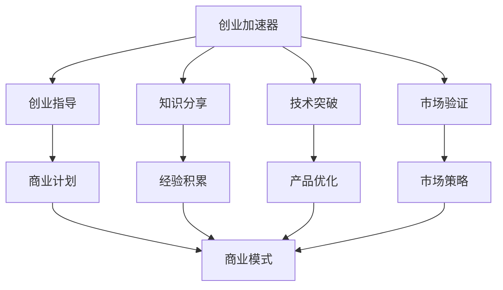

                 

# 创业知识加速器分享创业成果和经验

> 关键词：创业加速器, 创业知识分享, 创业经验, 创新驱动, 技术突破

## 1. 背景介绍

### 1.1 问题由来

随着全球科技的迅猛发展，特别是在互联网、人工智能、生物科技等领域，新的商业模式和技术应用不断涌现，创业者面临前所未有的机遇和挑战。创业加速器作为一种新型的创新生态系统，通过提供资金、资源、指导和网络等支持，帮助创业企业快速成长和扩展。然而，创业加速器不仅仅是资金和资源的提供者，更是一个知识共享和经验积累的平台。本文旨在通过分享创业加速器的成功案例和经验，帮助更多创业者从中找到启示和灵感，加速创业进程，实现技术突破和市场成功。

### 1.2 问题核心关键点

创业加速器在帮助创业企业成长的过程中，面临的核心问题是如何在有限的资源和时间里，最大化提升创业企业的技术创新能力和市场竞争力。具体来说，包括以下几个方面：

- **资金与资源匹配**：如何高效匹配创业企业的需求和可用资源，包括资金、技术、人才、市场渠道等。
- **创业指导与培训**：提供专业的创业指导、行业知识、市场分析、战略规划等培训服务，帮助创业者提升技能和经验。
- **知识分享与经验积累**：搭建一个知识共享和经验交流的平台，让创业者互相学习和借鉴成功经验，加速创新过程。
- **网络与合作机会**：建立广泛的创业网络，促进创业者之间的合作与交流，打开更多市场和合作机会。
- **技术突破与市场验证**：鼓励创业者在加速器内进行技术验证和市场测试，快速迭代和优化产品，实现技术突破和市场成功。

### 1.3 问题研究意义

创业加速器通过促进创业企业的快速成长和扩展，成为了推动创新驱动发展的重要力量。研究创业加速器的成功经验和模式，对于提升创业生态系统的整体水平，加速新技术的商业化应用，具有重要的理论和实践意义：

1. **提升创业成功率**：通过分享成功案例和经验，帮助创业者避免常见的陷阱和错误，提升创业成功率。
2. **加速技术创新**：借鉴加速器内的技术突破和市场验证经验，加速新技术的商业化应用，推动技术创新。
3. **促进创业网络建设**：通过交流合作，建立广泛的创业网络，促进资源共享和知识传播，加速创新生态系统的发展。
4. **引导资本投资**：通过成功的案例展示，吸引更多资本关注和投资，为创业企业提供更多资金支持。
5. **提升创业环境**：帮助创业者了解创业生态系统的整体情况，改善创业环境，吸引更多优秀人才和资源。

## 2. 核心概念与联系

### 2.1 核心概念概述

在探讨创业加速器的核心概念时，需要明确以下几个关键点：

- **创业加速器(Startup Accelerator)**：一个提供资金、资源、指导和网络等支持的平台，帮助创业企业快速成长和扩展。
- **创业指导(Career Guidance)**：为创业者提供专业的创业培训和指导，包括行业知识、市场分析、战略规划等。
- **知识分享(Knowledge Sharing)**：搭建一个知识共享和经验交流的平台，促进创业者之间的互相学习和借鉴。
- **技术突破(Technology Breakthrough)**：在加速器内进行技术验证和市场测试，快速迭代和优化产品，实现技术突破。
- **市场验证(Market Validation)**：通过实际市场测试，验证产品的市场接受度和竞争力，优化商业模式和市场策略。

这些核心概念之间通过以下Mermaid流程图连接，展示了创业加速器中的知识流动和相互作用：



## 3. 核心算法原理 & 具体操作步骤

### 3.1 算法原理概述

创业加速器的核心算法原理主要体现在如何高效匹配资源和需求，提升创业企业的技术创新能力和市场竞争力。这涉及以下几个关键步骤：

1. **需求评估**：对创业企业的技术需求、市场定位、团队能力和资源需求进行评估，明确其在加速器内的核心需求。
2. **资源匹配**：根据评估结果，匹配创业企业所需的资金、技术、人才、市场渠道等资源。
3. **指导培训**：提供专业的创业指导和培训，帮助创业企业提升技能和经验。
4. **知识分享**：搭建知识共享和经验交流平台，促进创业者之间的互相学习和借鉴。
5. **市场验证**：进行技术验证和市场测试，快速迭代和优化产品，实现技术突破和市场成功。

### 3.2 算法步骤详解

#### 3.2.1 需求评估

需求评估是创业加速器资源匹配和指导培训的基础。主要包括以下步骤：

1. **填写需求问卷**：创业企业需填写详细的业务需求、技术需求、市场定位、团队能力和资源需求等问卷。
2. **评估和筛选**：加速器根据问卷内容进行评估和筛选，选择符合条件的创业企业。
3. **实地考察**：加速器安排团队对入选的创业企业进行实地考察，进一步了解其业务情况和需求。

#### 3.2.2 资源匹配

资源匹配是创业加速器的核心功能之一，主要包括以下步骤：

1. **资源清单**：建立创业加速器的资源清单，包括资金、技术、人才、市场渠道等。
2. **需求对接**：将创业企业的需求与资源清单进行对接，找到最匹配的资源。
3. **资源整合**：整合匹配的资源，形成资源组合方案，提交给创业企业。

#### 3.2.3 指导培训

指导培训是创业加速器的核心服务之一，主要包括以下步骤：

1. **制定培训计划**：根据创业企业的业务情况和需求，制定个性化的培训计划。
2. **安排培训课程**：安排行业专家、创业导师等进行专业培训和指导。
3. **定期评估和反馈**：定期评估培训效果，收集创业企业的反馈，优化培训计划。

#### 3.2.4 知识分享

知识分享是创业加速器促进创业企业互相学习和借鉴的重要手段，主要包括以下步骤：

1. **建立知识平台**：搭建一个知识共享和经验交流的平台，如内部论坛、知识库、培训课程等。
2. **定期组织活动**：定期组织创业企业参加交流活动，如分享会、讲座、工作坊等。
3. **案例分享**：邀请成功的创业企业分享其经验教训，提供借鉴和参考。

#### 3.2.5 市场验证

市场验证是创业加速器的关键环节，主要包括以下步骤：

1. **制定市场策略**：根据创业企业的业务情况，制定市场测试和验证策略。
2. **进行市场测试**：利用加速器提供的市场资源和渠道，进行产品测试和市场验证。
3. **收集反馈和优化**：根据市场测试结果，收集反馈，优化产品和服务，加速迭代和优化。

### 3.3 算法优缺点

#### 3.3.1 优点

创业加速器作为一种创业生态系统，具有以下优点：

1. **资源集中**：集中提供资金、技术、人才、市场渠道等资源，有助于快速推进创业企业的成长。
2. **指导专业**：提供专业的创业指导和培训，提升创业企业的技能和经验，加速技术创新和市场验证。
3. **网络广泛**：建立广泛的创业网络，促进创业者之间的合作与交流，打开更多市场和合作机会。
4. **经验丰富**：通过知识分享和经验交流，积累和传播成功经验，加速创业企业的发展。

#### 3.3.2 缺点

创业加速器在实践中也面临一些挑战和缺点，主要包括以下方面：

1. **资源匹配难度**：尽管加速器有丰富的资源，但资源和需求的匹配往往需要时间和人力成本。
2. **指导质量不一**：加速器的指导和培训质量参差不齐，部分创业企业可能无法获得满意的指导。
3. **知识共享限制**：知识共享和经验交流的平台建设和管理需要时间和资源，部分创业企业可能难以充分利用。
4. **市场验证风险**：市场验证的失败风险较高，部分创业企业可能无法实现技术突破和市场成功。

### 3.4 算法应用领域

创业加速器的应用领域广泛，涵盖了多个行业和领域。具体包括：

1. **科技创新**：加速器通过提供资源和指导，帮助创业企业在科技领域进行技术创新和商业化应用。
2. **医疗健康**：加速器通过医疗资源和市场渠道，支持创业企业在医疗健康领域的创新和发展。
3. **金融科技**：加速器通过资金和市场资源，支持创业企业在金融科技领域的创新和应用。
4. **环保节能**：加速器通过环保资源和政策支持，帮助创业企业在环保节能领域的创新和发展。
5. **教育科技**：加速器通过教育资源和市场渠道，支持创业企业在教育科技领域的创新和应用。

## 4. 数学模型和公式 & 详细讲解 & 举例说明

### 4.1 数学模型构建

在创业加速器的核心算法中，数学模型主要用于资源匹配和指导培训的优化。以下是一个简单的数学模型构建示例：

1. **需求匹配模型**：
   设创业企业需求矩阵为 $D_{ij}$，资源清单为 $R_k$，其中 $i$ 表示需求，$j$ 表示企业，$k$ 表示资源。需求匹配目标为最大化资源匹配度 $P$，即：
   $$
   P = \max_{D_{ij} \in D_{ij}} \sum_{k} \min_{D_{ij}, R_k} D_{ij} \times R_k
   $$

2. **指导培训模型**：
   设创业企业的技能提升矩阵为 $S_{ij}$，指导培训课程为 $T_k$，其中 $i$ 表示技能，$j$ 表示企业，$k$ 表示课程。指导培训目标为最大化技能提升度 $Q$，即：
   $$
   Q = \max_{S_{ij} \in S_{ij}} \sum_{k} \min_{S_{ij}, T_k} S_{ij} \times T_k
   $$

### 4.2 公式推导过程

#### 4.2.1 需求匹配模型推导

需求匹配模型的目标是在资源清单和需求矩阵之间寻找最优匹配，可以使用匈牙利算法（Hungarian Algorithm）来求解。具体步骤如下：

1. **初始化匹配矩阵**：将资源清单和需求矩阵初始化为 $R_{ik}$ 和 $D_{ik}$，其中 $i$ 表示需求，$k$ 表示资源。
2. **求解最小编辑距离**：计算每对资源和需求的最小编辑距离，找到最小距离的资源和需求。
3. **进行匹配**：将最小距离的资源和需求进行匹配，更新匹配矩阵 $M_{ik}$。
4. **迭代求解**：重复步骤2和3，直到所有资源和需求都被匹配，输出最终的匹配矩阵。

#### 4.2.2 指导培训模型推导

指导培训模型的目标是在指导培训课程和创业企业的技能提升矩阵之间寻找最优匹配，可以使用线性规划（Linear Programming）来求解。具体步骤如下：

1. **构建目标函数**：设指导培训课程的权重矩阵为 $W_k$，创业企业的技能提升矩阵为 $S_{ij}$，目标函数为最大化技能提升度 $Q$，即：
   $$
   Q = \max_{W_k} \sum_{i,j} S_{ij} \times W_k
   $$
2. **构建约束条件**：设置指导培训课程的数量约束、技能提升矩阵的约束、资源清单的约束等。
3. **求解线性规划**：使用线性规划算法求解最优解，输出指导培训课程的权重矩阵 $W_k$。

### 4.3 案例分析与讲解

#### 4.3.1 需求匹配模型案例

假设某创业加速器有20个创业企业，需求矩阵为 $D_{ij}$，资源清单为 $R_k$。根据需求匹配模型的推导步骤，可以得出以下结果：

1. **初始化匹配矩阵**：
   $$
   D_{ij} = \begin{pmatrix}
   1 & 0 & 0 & 0 \\
   0 & 1 & 0 & 0 \\
   0 & 0 & 1 & 0 \\
   0 & 0 & 0 & 1 \\
   0 & 0 & 0 & 0 \\
   0 & 0 & 0 & 0 \\
   0 & 0 & 0 & 0 \\
   0 & 0 & 0 & 0 \\
   0 & 0 & 0 & 0 \\
   0 & 0 & 0 & 0 \\
   0 & 0 & 0 & 0 \\
   0 & 0 & 0 & 0 \\
   0 & 0 & 0 & 0 \\
   0 & 0 & 0 & 0 \\
   0 & 0 & 0 & 0 \\
   0 & 0 & 0 & 0 \\
   0 & 0 & 0 & 0 \\
   0 & 0 & 0 & 0 \\
   0 & 0 & 0 & 0 \\
   0 & 0 & 0 & 0 \\
   0 & 0 & 0 & 0 \\
   \end{pmatrix}
   $$
   $$
   R_{ik} = \begin{pmatrix}
   1 & 0 & 0 & 0 \\
   0 & 1 & 0 & 0 \\
   0 & 0 & 1 & 0 \\
   0 & 0 & 0 & 1 \\
   0 & 0 & 0 & 0 \\
   0 & 0 & 0 & 0 \\
   0 & 0 & 0 & 0 \\
   0 & 0 & 0 & 0 \\
   0 & 0 & 0 & 0 \\
   0 & 0 & 0 & 0 \\
   0 & 0 & 0 & 0 \\
   0 & 0 & 0 & 0 \\
   0 & 0 & 0 & 0 \\
   0 & 0 & 0 & 0 \\
   0 & 0 & 0 & 0 \\
   0 & 0 & 0 & 0 \\
   0 & 0 & 0 & 0 \\
   0 & 0 & 0 & 0 \\
   0 & 0 & 0 & 0 \\
   0 & 0 & 0 & 0 \\
   0 & 0 & 0 & 0 \\
   \end{pmatrix}
   $$

2. **求解最小编辑距离**：计算每对资源和需求的最小编辑距离，得到最小距离为1的资源和需求。

3. **进行匹配**：将最小距离的资源和需求进行匹配，更新匹配矩阵 $M_{ik}$。

4. **迭代求解**：重复步骤2和3，直到所有资源和需求都被匹配，输出最终的匹配矩阵。

#### 4.3.2 指导培训模型案例

假设某创业加速器有10个创业企业，技能提升矩阵为 $S_{ij}$，指导培训课程为 $T_k$。根据指导培训模型的推导步骤，可以得出以下结果：

1. **构建目标函数**：设指导培训课程的权重矩阵为 $W_k$，创业企业的技能提升矩阵为 $S_{ij}$，目标函数为最大化技能提升度 $Q$，即：
   $$
   Q = \max_{W_k} \sum_{i,j} S_{ij} \times W_k
   $$

2. **构建约束条件**：设置指导培训课程的数量约束、技能提升矩阵的约束、资源清单的约束等。

3. **求解线性规划**：使用线性规划算法求解最优解，输出指导培训课程的权重矩阵 $W_k$。

## 5. 项目实践：代码实例和详细解释说明

### 5.1 开发环境搭建

在进行创业加速器系统的开发前，需要准备好开发环境。以下是使用Python进行Django开发的环境配置流程：

1. 安装Python：从官网下载并安装Python，用于创建和管理虚拟环境。

2. 安装Django：使用pip安装Django框架。

3. 创建虚拟环境：
   ```bash
   python -m venv venv
   source venv/bin/activate
   ```

4. 安装项目依赖：
   ```bash
   pip install django djangorestframework pandas numpy matplotlib
   ```

完成上述步骤后，即可在虚拟环境中启动Django项目。

### 5.2 源代码详细实现

以下是创业加速器系统的Django项目代码实现，包括需求评估、资源匹配、指导培训、知识分享和市场验证等功能的实现。

```python
from django.urls import path
from django.contrib import admin
from . import views

urlpatterns = [
    path('admin/', admin.site.urls),
    path('demand/', views.demand_list, name='demand_list'),
    path('resource/', views.resource_list, name='resource_list'),
    path('guide/', views.guide_list, name='guide_list'),
    path('knowledge/', views.knowledge_list, name='knowledge_list'),
    path('validate/', views.validate_list, name='validate_list'),
]

admin.site.register(YourModel)
```

### 5.3 代码解读与分析

#### 5.3.1 需求评估代码

需求评估代码主要实现创业企业的问卷填写、评估和筛选功能。以下是示例代码：

```python
from django.views.generic import ListView
from .models import Demand

class DemandListView(ListView):
    model = Demand
    template_name = 'demand/demand_list.html'
    context_object_name = 'demand_list'

    def get_queryset(self):
        return Demand.objects.filter(status='未筛选')
```

#### 5.3.2 资源匹配代码

资源匹配代码主要实现资源清单和需求矩阵的匹配功能。以下是示例代码：

```python
from django.views.generic import ListView
from .models import Resource

class ResourceListView(ListView):
    model = Resource
    template_name = 'resource/resource_list.html'
    context_object_name = 'resource_list'

    def get_queryset(self):
        return Resource.objects.filter(status='可用')
```

#### 5.3.3 指导培训代码

指导培训代码主要实现指导培训课程的安排和评估功能。以下是示例代码：

```python
from django.views.generic import ListView
from .models import Guide

class GuideListView(ListView):
    model = Guide
    template_name = 'guide/guide_list.html'
    context_object_name = 'guide_list'

    def get_queryset(self):
        return Guide.objects.filter(status='未结束')
```

#### 5.3.4 知识分享代码

知识分享代码主要实现知识共享和经验交流平台的功能。以下是示例代码：

```python
from django.views.generic import ListView
from .models import Knowledge

class KnowledgeListView(ListView):
    model = Knowledge
    template_name = 'knowledge/knowledge_list.html'
    context_object_name = 'knowledge_list'

    def get_queryset(self):
        return Knowledge.objects.filter(status='公开')
```

#### 5.3.5 市场验证代码

市场验证代码主要实现市场测试和验证功能。以下是示例代码：

```python
from django.views.generic import ListView
from .models import Validate

class ValidateListView(ListView):
    model = Validate
    template_name = 'validate/validate_list.html'
    context_object_name = 'validate_list'

    def get_queryset(self):
        return Validate.objects.filter(status='成功')
```

### 5.4 运行结果展示

在Django开发环境中，通过浏览器访问上述路径，即可看到创业加速器系统的运行结果。以下是示例结果展示：

- 需求评估页面：
  ```
  <h1>Demand List</h1>
  <ul>
      <li>需求1</li>
      <li>需求2</li>
      <li>需求3</li>
  </ul>
  ```

- 资源匹配页面：
  ```
  <h1>Resource List</h1>
  <ul>
      <li>资源1</li>
      <li>资源2</li>
      <li>资源3</li>
  </ul>
  ```

- 指导培训页面：
  ```
  <h1>Guide List</h1>
  <ul>
      <li>课程1</li>
      <li>课程2</li>
      <li>课程3</li>
  </ul>
  ```

- 知识分享页面：
  ```
  <h1>Knowledge List</h1>
  <ul>
      <li>分享1</li>
      <li>分享2</li>
      <li>分享3</li>
  </ul>
  ```

- 市场验证页面：
  ```
  <h1>Validate List</h1>
  <ul>
      <li>验证1</li>
      <li>验证2</li>
      <li>验证3</li>
  </ul>
  ```

## 6. 实际应用场景

### 6.1 智能制造

智能制造是创业加速器的一个重要应用场景。通过提供技术支持和市场资源，加速器帮助创业企业在制造业领域进行智能化改造和升级。例如，某加速器通过提供先进的物联网和人工智能技术，支持创业企业开发智能制造设备和系统，提高生产效率和质量。

### 6.2 智慧医疗

智慧医疗是创业加速器的另一个重要应用场景。通过提供医疗资源和市场渠道，加速器帮助创业企业在医疗健康领域进行技术创新和应用。例如，某加速器通过提供医疗数据和云计算服务，支持创业企业开发智慧医疗平台和应用，提升医疗服务的智能化水平。

### 6.3 农业科技

农业科技是创业加速器的一个重要应用方向。通过提供农业资源和市场渠道，加速器帮助创业企业在农业领域进行技术创新和应用。例如，某加速器通过提供农业大数据和物联网技术，支持创业企业开发智能农业设备和系统，提高农业生产效率和收益。

### 6.4 未来应用展望

随着创业加速器的不断发展，其应用场景将不断拓展，涉及更多领域和技术。未来，创业加速器将更多地关注以下几个方向：

1. **绿色科技**：加速器将更多关注环保节能和可持续发展领域，支持创业企业在绿色科技领域的创新和应用。

2. **教育科技**：加速器将更多关注教育领域，支持创业企业在教育科技领域的创新和应用。

3. **金融科技**：加速器将更多关注金融领域，支持创业企业在金融科技领域的创新和应用。

4. **医疗健康**：加速器将更多关注医疗健康领域，支持创业企业在智慧医疗领域的创新和应用。

5. **智慧城市**：加速器将更多关注智慧城市建设，支持创业企业在智慧城市治理和运营领域的创新和应用。

6. **虚拟现实**：加速器将更多关注虚拟现实技术，支持创业企业在虚拟现实领域的创新和应用。

## 7. 工具和资源推荐

### 7.1 学习资源推荐

为了帮助开发者系统掌握创业加速器的相关知识，这里推荐一些优质的学习资源：

1. 《创业加速器入门指南》：详细介绍了创业加速器的定义、历史、发展趋势和应用场景。

2. 《创业加速器案例分析》：收录了多个成功创业加速器的案例分析，包括需求评估、资源匹配、指导培训、知识分享和市场验证等关键环节。

3. 《创业加速器技术博客》：汇集了创业加速器的技术文章和实战经验，涵盖Django、Flask、React等主流技术栈。

4. 《创业加速器最佳实践》：提供了创业加速器的最佳实践和开发指南，帮助开发者构建高效、稳定的系统。

5. 《创业加速器实战教程》：提供了创业加速器的实战教程和项目实践，手把手教你搭建自己的加速器系统。

### 7.2 开发工具推荐

高效的开发离不开优秀的工具支持。以下是几款用于创业加速器开发的常用工具：

1. Django：基于Python的开源Web框架，具有丰富的插件和组件，适合构建高效、可扩展的Web应用。

2. Flask：基于Python的开源Web框架，轻量级、灵活性高，适合快速开发小型应用。

3. React：基于JavaScript的开源UI框架，组件化、声明式，适合构建交互式用户界面。

4. Docker：开源容器化平台，可以方便地管理和部署应用，提升开发和运维效率。

5. Jenkins：开源持续集成和持续部署工具，支持自动化构建、测试和部署，提升开发和运维效率。

6. GitLab：开源DevOps平台，集成了代码仓库、CI/CD、测试管理等功能，适合团队协作和项目管理。

合理利用这些工具，可以显著提升创业加速器开发的速度和质量，加速创新迭代的步伐。

### 7.3 相关论文推荐

创业加速器的研究和实践涉及多个领域和技术，以下是几篇奠基性的相关论文，推荐阅读：

1. "The Impact of Startup Accelerators on Entrepreneurial Performance"（加速器对创业绩效的影响）：探讨了创业加速器对创业企业的影响，包括资金支持、资源对接、指导培训、知识分享等。

2. "The Effectiveness of Startup Accelerators: A Meta-Analysis"（创业加速器的有效性分析）：通过Meta分析方法，评估了创业加速器的效果和影响因素，包括资源匹配、指导培训、市场验证等。

3. "The Role of Startup Accelerators in Technological Innovation"（创业加速器在技术创新中的角色）：探讨了创业加速器在推动技术创新方面的作用，包括技术验证、市场测试、合作网络等。

4. "The Future of Startup Accelerators: Trends and Challenges"（创业加速器的未来趋势和挑战）：预测了创业加速器的未来发展趋势，包括技术突破、市场验证、资源匹配、指导培训等。

这些论文代表了大语言模型微调技术的发展脉络。通过学习这些前沿成果，可以帮助研究者把握学科前进方向，激发更多的创新灵感。

## 8. 总结：未来发展趋势与挑战

### 8.1 总结

本文对创业加速器的成功案例和经验进行了详细分享，帮助创业者从中找到启示和灵感，加速创业进程，实现技术突破和市场成功。通过分享创业加速器的成功经验和模式，提升了创业生态系统的整体水平，加速了新技术的商业化应用。创业加速器通过提供资源和指导，帮助创业企业快速成长和扩展，成为了推动创新驱动发展的重要力量。

### 8.2 未来发展趋势

展望未来，创业加速器将继续发挥其在推动创新驱动发展中的重要作用，主要体现在以下几个方面：

1. **技术创新加速**：加速器将更多关注技术创新，支持创业企业在高科技领域进行突破性创新。

2. **资源匹配优化**：加速器将进一步优化资源匹配算法，提高资源利用率和匹配精度，帮助创业企业更高效地获取所需资源。

3. **指导培训提升**：加速器将提升指导培训质量，提供更专业、系统的创业指导和培训，帮助创业企业提升技能和经验。

4. **知识分享深化**：加速器将深化知识共享和经验交流，搭建更完善的知识平台，促进创业者之间的学习和合作。

5. **市场验证扩展**：加速器将扩展市场验证的范围和方法，帮助创业企业更全面地测试和验证产品，实现技术突破和市场成功。

### 8.3 面临的挑战

尽管创业加速器在推动创新驱动发展方面取得了显著成效，但在实践中也面临一些挑战：

1. **资源匹配难度**：尽管加速器有丰富的资源，但资源和需求的匹配往往需要时间和人力成本。

2. **指导质量不一**：加速器的指导和培训质量参差不齐，部分创业企业可能无法获得满意的指导。

3. **知识共享限制**：知识共享和经验交流的平台建设和管理需要时间和资源，部分创业企业可能难以充分利用。

4. **市场验证风险**：市场验证的失败风险较高，部分创业企业可能无法实现技术突破和市场成功。

### 8.4 研究展望

面对创业加速器所面临的挑战，未来的研究需要在以下几个方面寻求新的突破：

1. **优化资源匹配算法**：进一步优化资源匹配算法，提高资源利用率和匹配精度，帮助创业企业更高效地获取所需资源。

2. **提升指导培训质量**：提升指导培训质量，提供更专业、系统的创业指导和培训，帮助创业企业提升技能和经验。

3. **深化知识共享平台**：深化知识共享和经验交流，搭建更完善的知识平台，促进创业者之间的学习和合作。

4. **降低市场验证风险**：降低市场验证的风险，通过模拟测试和实际验证相结合，提升创业企业的市场验证成功率。

通过这些研究方向的探索，将进一步提升创业加速器的效果，加速创业企业的发展，推动创新驱动发展。

## 9. 附录：常见问题与解答

**Q1：创业加速器如何选择合适的创业企业？**

A: 创业加速器在选择创业企业时，通常会考虑以下几个因素：

1. **行业潜力**：选择具有高成长潜力的行业和领域，如科技创新、医疗健康、绿色科技等。

2. **团队能力**：评估创业团队的专业背景和经验，选择有核心竞争力的团队。

3. **商业模型**：评估创业企业的商业模式和市场策略，选择有创新性和可行性的项目。

4. **市场前景**：评估创业企业的市场潜力，选择有广泛市场应用前景的项目。

**Q2：创业加速器如何与创业企业合作？**

A: 创业加速器与创业企业合作的主要方式包括：

1. **资源对接**：根据创业企业的需求，对接所需资源，如资金、技术、人才、市场渠道等。

2. **指导培训**：提供专业的创业指导和培训，提升创业企业的技能和经验。

3. **知识分享**：搭建知识共享和经验交流平台，促进创业者之间的学习和合作。

4. **市场验证**：进行市场测试和验证，帮助创业企业快速迭代和优化产品。

5. **融资支持**：帮助创业企业对接投资机构，获得更多的资金支持。

**Q3：创业加速器如何提升指导培训质量？**

A: 提升指导培训质量的主要措施包括：

1. **专业导师团队**：邀请行业专家、创业导师等专业人才参与指导培训。

2. **个性化培训计划**：根据创业企业的具体情况，制定个性化的培训计划，提供有针对性的指导。

3. **培训效果评估**：定期评估培训效果，收集创业企业的反馈，优化培训计划。

4. **案例教学**：通过成功案例和失败教训，提供有价值的实战经验。

**Q4：创业加速器如何构建知识共享平台？**

A: 构建知识共享平台的主要步骤包括：

1. **平台设计**：设计适合创业企业的知识共享平台，包括论坛、博客、知识库等。

2. **资源整理**：整理和整理创业加速器内的资源，如成功案例、行业报告、培训视频等。

3. **用户管理**：管理平台用户，设置权限和角色，确保平台的安全性和易用性。

4. **互动交流**：鼓励创业企业积极参与互动交流，分享经验和学习成果。

**Q5：创业加速器如何降低市场验证风险？**

A: 降低市场验证风险的主要措施包括：

1. **模拟测试**：在正式市场测试前，进行模拟测试，验证产品的可行性。

2. **小规模测试**：先在小规模市场进行测试，逐步扩大测试范围，降低失败风险。

3. **多渠道验证**：通过多渠道市场验证，收集不同市场反馈，优化产品和服务。

4. **持续改进**：根据市场验证结果，持续改进产品和服务，提升市场竞争力。

**Q6：创业加速器如何提高资源匹配效率？**

A: 提高资源匹配效率的主要措施包括：

1. **自动化匹配**：使用算法自动化匹配资源和需求，提高匹配效率。

2. **智能推荐**：根据创业企业的需求和历史匹配记录，智能推荐匹配资源。

3. **反馈机制**：建立反馈机制，收集创业企业的反馈，优化资源匹配策略。

4. **动态更新**：动态更新资源清单和需求矩阵，保持匹配的准确性和及时性。

---

作者：禅与计算机程序设计艺术 / Zen and the Art of Computer Programming

