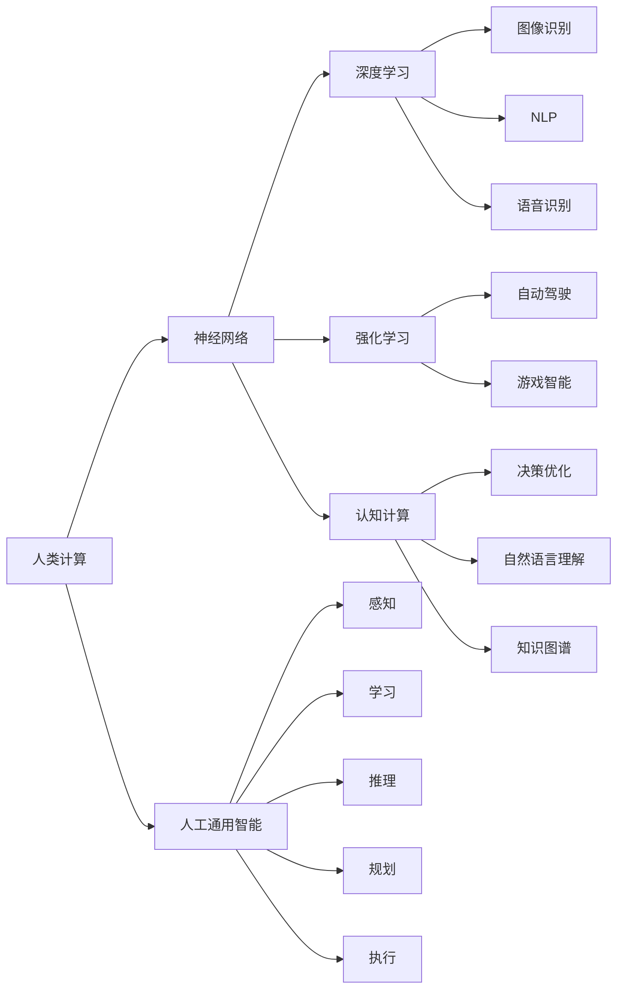

                 

## 1. 背景介绍

### 1.1 问题由来
随着人工智能技术的发展，人类计算领域正迎来前所未有的变革。计算不再局限于传统的物理计算，而是扩展到更加抽象和高级的层次。通过模拟人的思维和认知过程，我们得以构建出比以往任何时候都更为强大的智能系统。这种转变不仅改变了科技发展的方向，更引领了人类社会朝着更加美好和高效的方向前进。

### 1.2 问题核心关键点
在人工智能发展的早期阶段，计算任务主要围绕数值和符号的计算展开。然而，随着深度学习技术的应用，计算任务开始向更加复杂、抽象的层次发展。具体来说，这些问题关键点包括：

- 如何通过人类计算技术，更好地理解和模拟人类思维过程？
- 人类计算的目标是什么？是提升效率、降低成本，还是拓展智能边界？
- 如何构建能够自适应、自主学习的人类计算系统？
- 人类计算技术在各个领域的应用前景如何？

### 1.3 问题研究意义
探讨人类计算的终极目标，不仅有助于我们理解当前人工智能技术的发展趋势，更能够指导未来的研究方向和实践应用。通过深入研究人类计算，我们可以构建出更加智能、普适、安全的计算系统，为人类社会的发展带来深远影响。具体意义包括：

1. **提升效率和生产力**：通过模拟和优化人类认知过程，可以大幅提升信息处理和决策效率，从而推动各行各业的效率提升。
2. **降低成本和资源消耗**：利用人类计算技术，可以在更低的成本和资源消耗下实现复杂计算任务，为企业和政府部门带来显著的经济效益。
3. **拓展智能边界**：人类计算能够模拟人类思维的深度和广度，推动智能系统向更高级、更复杂的领域拓展，实现更多前瞻性和创新的应用场景。
4. **促进社会公平和包容性**：通过人类计算技术，可以帮助弱势群体更好地理解和参与数字世界，实现社会公平和包容性的提升。
5. **推动可持续发展**：利用人类计算技术，可以优化资源分配、环境监测和生态保护，推动社会的可持续发展。

## 2. 核心概念与联系

### 2.1 核心概念概述

为了更好地理解人类计算的终极目标，我们需要梳理一些核心概念及其之间的联系：

- **人类计算(Human Computing)**：指通过模拟和优化人类认知过程，实现复杂计算任务的技术。它包括模拟人类感知、记忆、学习、推理等思维过程，以提高计算效率和效果。
- **人工通用智能(Artificial General Intelligence, AGI)**：指能够进行各种智能活动的人工智能系统，包括感知、学习、推理、规划、执行等。AGI的目标是构建具有人类智能水平的人工智能。
- **神经网络(Neural Networks)**：模仿人类神经系统的计算模型，通过多层神经元之间的连接和权重调整，实现复杂数据处理和模式识别。神经网络是实现人类计算的重要技术手段之一。
- **深度学习(Deep Learning)**：一种基于神经网络的机器学习方法，通过多层非线性变换，实现对大规模复杂数据的学习和预测。深度学习在图像识别、自然语言处理等领域表现优异。
- **强化学习(Reinforcement Learning)**：通过与环境交互，通过试错学习来优化决策策略的方法。强化学习在自动驾驶、游戏智能等领域有广泛应用。
- **认知计算(Cognitive Computing)**：模拟人类认知过程，实现更加智能的计算系统。认知计算结合了符号计算和神经计算的优点，适用于需要深度理解和推理的任务。

### 2.2 核心概念原理和架构的 Mermaid 流程图



这个流程图展示了人类计算的核心概念及其相互之间的联系。人类计算通过模拟人类的感知、学习和推理等认知过程，构建出神经网络、深度学习、强化学习、认知计算等多种技术手段，最终实现人工通用智能的目标。

## 3. 核心算法原理 & 具体操作步骤

### 3.1 算法原理概述

人类计算的核心算法原理可以归纳为以下几个方面：

- **符号计算**：通过符号逻辑和规则，实现精确的推理和计算。符号计算适用于需要严谨和精确性的任务，如数学证明、编程语言等。
- **神经网络计算**：通过多层非线性变换，实现对大规模复杂数据的学习和预测。神经网络计算适用于需要从数据中自动学习特征和模式的任务，如图像识别、自然语言处理等。
- **强化学习计算**：通过与环境的交互，优化决策策略，实现智能决策和控制。强化学习计算适用于需要动态适应和优化决策的任务，如自动驾驶、游戏智能等。

### 3.2 算法步骤详解

人类计算的算法步骤大致可以分为以下几个阶段：

1. **数据采集与预处理**：从现实世界采集数据，并进行清洗、标注、归一化等预处理操作，确保数据的质量和一致性。
2. **特征工程**：设计合适的特征表示，提取数据中的关键信息，用于后续的计算和建模。
3. **模型选择与训练**：根据任务特点选择合适的计算模型，如神经网络、决策树、贝叶斯网络等，并利用标注数据进行模型训练。
4. **模型评估与优化**：通过交叉验证、性能指标（如准确率、召回率、F1值等）评估模型效果，并根据评估结果进行调整和优化。
5. **模型部署与应用**：将训练好的模型部署到实际应用场景中，进行在线预测或决策，并持续监控和优化模型性能。

### 3.3 算法优缺点

人类计算技术具有以下优点：

- **灵活性和普适性**：可以针对不同领域和任务进行灵活的适应和定制，适用于各种复杂的计算任务。
- **高效性和自动化**：利用机器学习和深度学习技术，可以大幅提升计算效率，实现自动化处理。
- **人机协同**：结合人类认知和机器计算的优势，实现人机协同工作，提升计算效果和用户体验。

同时，人类计算也存在一些缺点：

- **复杂性与计算成本**：神经网络等计算模型的训练和优化需要大量计算资源，成本较高。
- **解释性与可理解性**：一些计算模型（如深度神经网络）的决策过程较为复杂，难以解释和理解。
- **数据依赖**：需要大量标注数据进行训练，数据的质量和数量对计算效果有很大影响。

### 3.4 算法应用领域

人类计算技术已经在多个领域得到了广泛应用，包括但不限于：

- **自然语言处理(NLP)**：如机器翻译、语音识别、情感分析、文本摘要等。利用深度学习、认知计算等技术，模拟人类语言理解能力。
- **计算机视觉(CV)**：如图像识别、物体检测、图像生成等。利用神经网络和强化学习技术，实现对视觉数据的高级处理和理解。
- **智能决策**：如自动驾驶、金融交易、医疗诊断等。利用强化学习和认知计算技术，实现智能决策和控制。
- **知识管理**：如知识图谱、专家系统、信息检索等。利用符号计算和认知计算技术，实现知识的组织、管理和应用。
- **社交网络分析**：如社区检测、情感分析、用户行为预测等。利用网络分析和强化学习技术，分析社交网络中的复杂关系和模式。

## 4. 数学模型和公式 & 详细讲解 & 举例说明

### 4.1 数学模型构建

人类计算中的数学模型构建，主要包括以下几个方面：

- **符号计算模型**：如布尔代数、逻辑推理规则、一阶谓词逻辑等。这些模型通过符号逻辑和规则，实现精确的推理和计算。
- **神经网络计算模型**：如多层感知机、卷积神经网络、循环神经网络等。这些模型通过多层非线性变换，实现对大规模复杂数据的学习和预测。
- **强化学习计算模型**：如Q-learning、策略梯度、蒙特卡罗树搜索等。这些模型通过与环境的交互，优化决策策略，实现智能决策和控制。

### 4.2 公式推导过程

以深度学习模型为例，其核心公式包括：

1. **前向传播**：
   $$
   \hat{y} = f(Wx + b)
   $$
   其中，$W$ 为权重矩阵，$b$ 为偏置向量，$x$ 为输入向量，$f$ 为激活函数。

2. **损失函数**：
   $$
   \mathcal{L} = \frac{1}{N}\sum_{i=1}^N (\hat{y_i} - y_i)^2
   $$
   其中，$N$ 为样本数，$y_i$ 为真实标签，$\hat{y_i}$ 为模型预测值。

3. **反向传播**：
   $$
   \frac{\partial \mathcal{L}}{\partial W} = \frac{\partial \mathcal{L}}{\partial \hat{y}} \frac{\partial \hat{y}}{\partial z} \frac{\partial z}{\partial W}
   $$
   其中，$z$ 为隐藏层输出，$\frac{\partial \hat{y}}{\partial z}$ 为梯度矩阵。

### 4.3 案例分析与讲解

以图像识别任务为例，其数据模型构建如下：

- **输入数据**：输入图片经过预处理后，转化为向量形式 $x$。
- **隐藏层**：通过多层卷积层和池化层，提取图片中的特征 $z$。
- **输出层**：通过全连接层和softmax函数，将特征转化为类别概率分布 $\hat{y}$。
- **损失函数**：使用交叉熵损失函数 $\mathcal{L} = -\frac{1}{N}\sum_{i=1}^N \sum_{j=1}^C y_{ij} \log \hat{y}_{ij}$，其中 $C$ 为类别数，$y_{ij}$ 为真实标签，$\hat{y}_{ij}$ 为模型预测值。

## 5. 项目实践：代码实例和详细解释说明

### 5.1 开发环境搭建

人类计算的实践开发，需要一个高效、灵活的编程环境。以下是搭建开发环境的步骤：

1. **安装Python**：确保系统安装了最新版本的Python，以支持最新的深度学习库。
2. **安装深度学习库**：如TensorFlow、PyTorch、Keras等。这些库提供了丰富的深度学习框架和工具，便于模型开发和调试。
3. **安装数据处理库**：如Pandas、NumPy、Scikit-learn等。这些库提供了数据预处理和分析工具，方便数据采集和处理。
4. **安装可视化库**：如Matplotlib、Seaborn、TensorBoard等。这些库提供了数据可视化工具，便于模型训练和评估。

### 5.2 源代码详细实现

以下是一个基于TensorFlow的图像识别项目的代码实现：

```python
import tensorflow as tf
from tensorflow.keras import layers, models

# 定义模型
model = models.Sequential()
model.add(layers.Conv2D(32, (3, 3), activation='relu', input_shape=(64, 64, 3)))
model.add(layers.MaxPooling2D((2, 2)))
model.add(layers.Conv2D(64, (3, 3), activation='relu'))
model.add(layers.MaxPooling2D((2, 2)))
model.add(layers.Conv2D(128, (3, 3), activation='relu'))
model.add(layers.MaxPooling2D((2, 2)))
model.add(layers.Flatten())
model.add(layers.Dense(64, activation='relu'))
model.add(layers.Dense(10, activation='softmax'))

# 编译模型
model.compile(optimizer='adam', loss='categorical_crossentropy', metrics=['accuracy'])

# 训练模型
model.fit(train_images, train_labels, epochs=10, validation_data=(test_images, test_labels))

# 评估模型
test_loss, test_acc = model.evaluate(test_images, test_labels)
print('Test accuracy:', test_acc)
```

### 5.3 代码解读与分析

上述代码实现了基于卷积神经网络的图像识别模型，包括以下关键步骤：

- **模型定义**：使用Sequential模型，添加卷积层、池化层、全连接层等构建网络结构。
- **模型编译**：使用adam优化器、交叉熵损失函数、准确率等指标，编译模型。
- **模型训练**：使用训练集数据进行模型训练，设置迭代轮数为10。
- **模型评估**：使用测试集数据评估模型效果，输出测试准确率。

### 5.4 运行结果展示

训练完成后，可以使用模型进行图像分类预测，例如：

```python
import numpy as np
from PIL import Image

# 加载图片
img = Image.open('test_image.jpg')
img = img.resize((64, 64))
img_array = np.array(img) / 255.0

# 进行预测
prediction = model.predict(np.expand_dims(img_array, axis=0))
class_names = ['cat', 'dog', 'bird', 'fish', 'horse', 'car', 'bus', 'train', 'truck', 'boat']
predicted_class = class_names[np.argmax(prediction)]
print('Predicted class:', predicted_class)
```

上述代码将测试图片转换为模型输入，并进行分类预测，输出预测结果。

## 6. 实际应用场景

### 6.1 智慧城市管理

人类计算在智慧城市管理中的应用，可以显著提升城市治理的智能化水平。通过分析城市大数据，可以实时监测交通流量、环境质量、公共安全等指标，实现城市运行状态的可视化。例如，利用深度学习模型进行交通流量预测和交通信号优化，可以显著提升城市交通的效率和安全性。

### 6.2 医疗诊断

人类计算在医疗诊断中的应用，可以帮助医生进行精准的疾病诊断和个性化治疗。通过分析患者的历史数据和症状，利用认知计算模型进行推理和诊断，可以提供个性化的治疗方案。例如，利用深度学习模型对医疗影像进行分析和诊断，可以显著提高诊断的准确率和效率。

### 6.3 金融风控

人类计算在金融风控中的应用，可以帮助金融机构进行风险管理和欺诈检测。通过分析客户的交易记录和行为数据，利用强化学习模型进行风险评估和预测，可以实时发现潜在的风险点和欺诈行为。例如，利用深度学习模型对交易数据进行异常检测，可以及时发现异常交易，保障金融安全。

### 6.4 未来应用展望

人类计算的未来应用前景广阔，以下是几个可能的应用方向：

1. **智能家居**：利用人类计算技术，实现对家居设备的智能控制和自适应管理，提升用户的生活体验和舒适性。
2. **智能农业**：通过分析农业数据和环境数据，利用人类计算技术进行精准农业管理和决策，提升农业生产效率和质量。
3. **智能教育**：利用认知计算技术，实现个性化学习路径和智能辅助教学，提升教育质量和效率。
4. **智能交通**：通过分析交通数据和环境数据，利用人类计算技术进行智能交通管理和优化，提升交通系统的安全性和效率。
5. **智能制造**：利用人类计算技术，实现智能工厂和自动化生产线的管理，提升生产效率和质量。

## 7. 工具和资源推荐

### 7.1 学习资源推荐

为了帮助开发者系统掌握人类计算的技术基础和实践技巧，这里推荐一些优质的学习资源：

1. **《深度学习》教材**：由斯坦福大学教授Ian Goodfellow等人合著，全面介绍了深度学习的基本概念和应用方法。
2. **Coursera深度学习课程**：斯坦福大学和DeepMind等机构联合开发的深度学习课程，涵盖了深度学习的基础理论和实践应用。
3. **Kaggle竞赛**：通过参加Kaggle数据科学竞赛，可以学习到最新的深度学习和数据科学方法，并进行实际项目练习。
4. **Github代码库**：通过浏览和阅读GitHub上的深度学习项目代码，可以了解最新的技术进展和最佳实践。
5. **机器学习社区**：如Stack Overflow、Reddit等社区，可以与其他开发者交流技术问题和心得，获取最新的学习资源。

### 7.2 开发工具推荐

高效的工具支持是实现人类计算项目的基础。以下是几款推荐的开发工具：

1. **PyTorch**：由Facebook开发的深度学习框架，支持动态图和静态图计算，便于模型的快速迭代和调试。
2. **TensorFlow**：由Google开发的深度学习框架，支持分布式计算和模型部署，适用于大规模工程应用。
3. **Keras**：高层次的深度学习框架，支持快速搭建和训练深度神经网络。
4. **Jupyter Notebook**：开源的交互式笔记本工具，便于数据处理和模型实验。
5. **TensorBoard**：TensorFlow配套的可视化工具，可以实时监测模型训练状态和性能指标。

### 7.3 相关论文推荐

人类计算的研究涉及多个学科和领域，以下是几篇奠基性的相关论文，推荐阅读：

1. **《认知计算：计算建模和计算智能》**：由Gerhard Bauer等人合著，全面介绍了认知计算的基本概念和应用方法。
2. **《符号计算的现状和未来》**：由Pavel Pudlak等人合著，介绍了符号计算的基本原理和最新进展。
3. **《人类计算和认知计算：理论和应用》**：由Richard S. Sutton等人合著，介绍了人类计算和认知计算的基本理论和应用方法。
4. **《深度学习与人工通用智能》**：由AI科学家Yoshua Bengio等人合著，介绍了深度学习在AGI中的重要应用。

## 8. 总结：未来发展趋势与挑战

### 8.1 研究成果总结

本文对人类计算的终极目标进行了全面系统的介绍，包括核心概念、算法原理和操作步骤等。通过系统梳理，我们可以更好地理解人类计算的发展趋势和应用前景，明确其未来研究的方向和重点。

### 8.2 未来发展趋势

人类计算的未来发展趋势包括：

1. **智能融合**：结合符号计算、深度学习、强化学习等技术，构建更加智能和普适的计算系统。
2. **跨学科融合**：结合心理学、社会学、认知科学等学科，构建更加全面和深入的认知计算模型。
3. **伦理和安全**：加强对人类计算系统的伦理和安全研究，确保计算结果的公平、透明和可靠。
4. **跨领域应用**：拓展人类计算在更多领域的应用，提升社会生产力和生活质量。
5. **未来展望**：通过技术创新和跨学科合作，推动人类计算向更高级、更复杂的层次发展。

### 8.3 面临的挑战

人类计算的发展也面临诸多挑战：

1. **资源消耗**：深度学习和强化学习等技术需要大量计算资源和数据，资源消耗问题需要进一步优化。
2. **可解释性**：一些计算模型的决策过程复杂，难以解释和理解，需要进一步加强模型可解释性研究。
3. **数据隐私**：在处理大规模数据时，需要确保数据的隐私和安全，避免数据泄露和滥用。
4. **伦理问题**：在构建智能系统时，需要考虑伦理和道德问题，确保计算结果的公平和透明。
5. **技术壁垒**：人类计算技术涉及多个学科和领域，技术壁垒较高，需要跨学科合作和创新。

### 8.4 研究展望

为了解决上述挑战，未来的研究需要在以下几个方面进行突破：

1. **资源优化**：通过算法优化、硬件加速等手段，降低深度学习和强化学习的资源消耗。
2. **可解释性提升**：通过模型简化、可视化等手段，增强模型的可解释性和可理解性。
3. **数据隐私保护**：通过数据匿名化、加密等手段，保护用户隐私和数据安全。
4. **伦理和道德**：在构建智能系统时，考虑伦理和道德问题，确保计算结果的公平和透明。
5. **跨学科合作**：加强跨学科合作和创新，推动人类计算技术的发展。

## 9. 附录：常见问题与解答

**Q1：什么是人类计算？**

A: 人类计算是通过模拟和优化人类认知过程，实现复杂计算任务的技术。它结合了符号计算、深度学习、强化学习等技术手段，实现更加智能和普适的计算系统。

**Q2：人类计算的优势和劣势是什么？**

A: 人类计算的优势在于其灵活性和普适性，能够适应各种复杂的计算任务。其劣势在于资源消耗较大，需要大量计算资源和数据支持，且一些计算模型的决策过程复杂，难以解释和理解。

**Q3：人类计算的应用前景如何？**

A: 人类计算在智慧城市管理、医疗诊断、金融风控等领域有广泛的应用前景。未来随着技术的发展，人类计算有望在更多领域得到应用，推动社会生产力和生活质量的提升。

**Q4：人类计算面临的主要挑战是什么？**

A: 资源消耗、可解释性、数据隐私、伦理和道德等问题是当前人类计算面临的主要挑战。解决这些问题需要跨学科合作和创新，推动技术的发展和应用。

**Q5：未来人类计算的发展方向是什么？**

A: 未来人类计算的发展方向包括智能融合、跨学科融合、伦理和安全、跨领域应用等方面。通过技术创新和跨学科合作，推动人类计算向更高级、更复杂的层次发展。

---

作者：禅与计算机程序设计艺术 / Zen and the Art of Computer Programming

