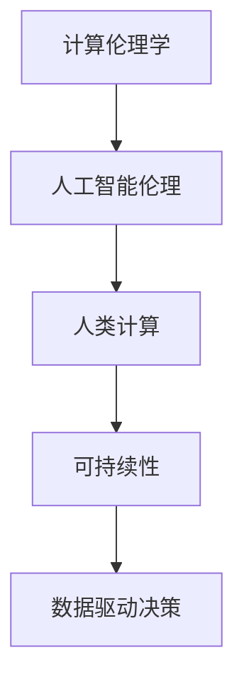

                 

# 创造更美好的明天：人类计算的积极作用

> 关键词：计算伦理学, 人工智能伦理, 人类计算, 可持续性, 数据驱动决策, 人工智能普及

## 1. 背景介绍

### 1.1 问题由来
随着科技的快速发展，人类社会正经历着前所未有的数字化转型。计算技术的进步不仅改变了人们的生活和工作方式，也在重塑着社会的价值观念和伦理标准。然而，技术的进步也带来了新的挑战，如数据隐私、算法偏见、隐私泄露等，这些问题亟需我们认真面对和解决。

在这样一个背景下，探索计算技术的积极作用，特别是如何利用计算技术创造更加美好的明天，具有重要的现实意义。本文将从计算伦理学的视角出发，探讨计算技术在提升人类福祉、促进可持续发展等方面的积极作用，并提出相应的伦理规范和策略。

## 2. 核心概念与联系

### 2.1 核心概念概述

计算伦理学（Computational Ethics）关注的是计算技术在人类社会中的伦理影响。它结合了计算机科学、伦理学和哲学等领域的知识，旨在研究如何确保计算技术的开发和应用符合人类社会的伦理价值，保护个人隐私和公平，同时推动社会进步和可持续发展。

人工智能伦理（AI Ethics）是计算伦理学的一个重要分支，它关注人工智能技术的伦理影响，包括算法的透明度、可解释性、安全性、公平性等。通过规范人工智能的开发和应用，避免算法偏见和滥用，确保技术服务于人类社会的福祉。

人类计算（Human-centric Computing）强调将计算技术与人类需求紧密结合，通过设计以人为本的应用和算法，解决现实生活中的实际问题，提升人们的生活质量。它强调技术应用的人文关怀和社会责任，推动计算技术向更加普惠和可持续的方向发展。

可持续性（Sustainability）涉及环境保护、资源利用、社会公正等多方面，关注如何通过技术手段实现环境、经济、社会的综合协调发展，确保未来的繁荣与和平。

数据驱动决策（Data-Driven Decision-Making）是指利用数据分析和机器学习等技术，辅助政策制定和公共管理，提升决策的科学性和效率，促进社会治理的精细化和智能化。

### 2.2 核心概念原理和架构的 Mermaid 流程图



这个流程图展示了计算伦理学的核心概念及其之间的关系：

1. 计算伦理学是人工智能伦理的基础，指导AI技术的开发和应用，确保技术符合伦理标准。
2. 人工智能伦理强调算法和技术的公平性、可解释性和安全性，是确保人类计算技术对人类有益的重要保障。
3. 人类计算将计算技术与人类需求结合，提升技术的人文价值和社会责任。
4. 可持续性关注环境保护和社会公正，推动计算技术在环境和社会领域的积极应用。
5. 数据驱动决策通过数据分析和机器学习提升决策科学性，推动社会治理的智能化。

这些核心概念共同构成了计算伦理学的研究框架，确保计算技术在服务人类福祉的同时，遵循伦理规范，推动社会的可持续发展。

## 3. 核心算法原理 & 具体操作步骤

### 3.1 算法原理概述

在探索计算技术的积极作用时，我们首先需要理解一些核心算法原理：

- **数据驱动决策算法**：通过数据分析和机器学习，从海量数据中提取有用信息，辅助决策制定。例如，公共卫生领域通过分析疫情数据，预测疫情趋势，制定预防策略。
- **可持续性计算模型**：利用计算技术优化资源利用，减少环境影响，推动绿色发展。例如，能源系统通过优化算法，提高能源效率，减少碳排放。
- **人类计算算法**：设计以人为本的应用和算法，解决实际问题，提升生活质量。例如，医疗健康领域通过算法优化，实现个性化医疗，提高诊疗效果。

### 3.2 算法步骤详解

为了更好地理解和应用这些算法，下面详细介绍其操作步骤：

**数据驱动决策算法**：

1. **数据收集**：从公共数据库、传感器等渠道收集数据。
2. **数据预处理**：清洗和整理数据，去除噪声和异常值。
3. **特征工程**：选择和构造有意义的数据特征。
4. **模型训练**：选择合适的算法，如决策树、随机森林、神经网络等，训练模型。
5. **模型评估**：在验证集上评估模型性能，调整参数。
6. **模型应用**：将模型应用到实际决策中，生成预测结果。

**可持续性计算模型**：

1. **需求分析**：明确计算任务的目标和约束。
2. **模型设计**：选择合适的计算模型，如优化算法、模拟模型等。
3. **资源规划**：确定资源配置和优化策略。
4. **模型优化**：通过仿真和实验，优化模型参数。
5. **结果验证**：评估模型效果，调整和优化。
6. **部署应用**：将模型部署到实际系统中，监测和维护。

**人类计算算法**：

1. **需求调研**：了解用户需求和应用场景。
2. **算法设计**：设计符合用户需求的算法，如推荐系统、智能客服等。
3. **模型训练**：在用户数据上进行训练，优化算法参数。
4. **用户测试**：邀请用户测试算法，收集反馈。
5. **优化迭代**：根据用户反馈，优化算法。
6. **应用部署**：将算法部署到实际应用中，监控效果。

### 3.3 算法优缺点

**数据驱动决策算法**：

- **优点**：能从大量数据中提取有用信息，辅助决策，提高决策科学性。
- **缺点**：需要大量数据，对数据质量要求高，模型解释性差。

**可持续性计算模型**：

- **优点**：能优化资源利用，减少环境影响，推动绿色发展。
- **缺点**：模型设计和优化复杂，需要专业知识和计算资源。

**人类计算算法**：

- **优点**：解决实际问题，提升生活质量，用户参与度高。
- **缺点**：算法复杂度可能高，需要大量用户数据，模型解释性差。

### 3.4 算法应用领域

这些算法已经在多个领域得到了广泛应用：

- **公共卫生**：通过数据分析，预测疫情趋势，制定预防策略。
- **环境保护**：利用计算模型优化资源利用，减少碳排放，推动绿色发展。
- **智能交通**：通过优化算法，提高交通效率，减少交通拥堵。
- **医疗健康**：设计个性化医疗算法，提高诊疗效果，改善患者体验。
- **教育**：利用数据分析，个性化推荐学习资源，提升教育效果。
- **金融**：通过计算模型，分析市场趋势，提高投资决策准确性。

## 4. 数学模型和公式 & 详细讲解 & 举例说明

### 4.1 数学模型构建

这里介绍一个典型的数据驱动决策数学模型——决策树（Decision Tree）。

决策树是一种基于树形结构的分类算法，通过对数据进行递归分割，生成决策路径，最终分类预测。其数学模型可以表示为：

$$
T = \{R, D\}
$$

其中，$R$ 为决策树的根节点，$D$ 为叶子节点的集合，每个叶子节点对应一个分类结果。

### 4.2 公式推导过程

决策树的构建过程如下：

1. 选择最优特征：通过信息增益（Information Gain）选择最优特征。
2. 分割数据集：将数据集按照最优特征进行分割，生成子节点。
3. 递归构建：对子节点递归执行步骤1和步骤2，直至满足终止条件。

信息增益的计算公式为：

$$
IG(D) = -\sum_{i=1}^m p_i \log_2 p_i
$$

其中，$p_i$ 为数据集$D$中第$i$类的概率。

### 4.3 案例分析与讲解

以医疗健康领域的个性化医疗为例，利用决策树算法，根据患者的症状和病史，预测其可能的疾病类型，并推荐最佳诊疗方案。

## 5. 项目实践：代码实例和详细解释说明

### 5.1 开发环境搭建

在进行项目实践前，需要准备开发环境。以下是使用Python进行机器学习开发的环境配置流程：

1. 安装Python：从官网下载并安装Python，建议使用3.8及以上版本。
2. 安装Pip：在命令行输入 `python -m pip install --upgrade pip`，安装或更新Pip。
3. 安装所需的Python包：如NumPy、Pandas、Scikit-learn等。

### 5.2 源代码详细实现

以下是一个基于决策树算法的数据驱动决策模型的Python代码实现：

```python
import pandas as pd
from sklearn.model_selection import train_test_split
from sklearn.tree import DecisionTreeClassifier
from sklearn.metrics import accuracy_score

# 数据加载
data = pd.read_csv('data.csv')
X = data.drop('label', axis=1)
y = data['label']

# 数据分割
X_train, X_test, y_train, y_test = train_test_split(X, y, test_size=0.2, random_state=42)

# 模型训练
model = DecisionTreeClassifier()
model.fit(X_train, y_train)

# 模型评估
y_pred = model.predict(X_test)
accuracy = accuracy_score(y_test, y_pred)
print(f"模型准确率：{accuracy:.2f}")
```

### 5.3 代码解读与分析

让我们再详细解读一下关键代码的实现细节：

- `pd.read_csv('data.csv')`：使用Pandas库加载数据集。
- `X = data.drop('label', axis=1)` 和 `y = data['label']`：将数据集分为特征和标签。
- `train_test_split`：将数据集分割为训练集和测试集。
- `DecisionTreeClassifier`：使用Scikit-learn库创建决策树分类器。
- `model.fit(X_train, y_train)`：训练模型。
- `y_pred = model.predict(X_test)`：在测试集上预测标签。
- `accuracy_score`：计算模型准确率。

### 5.4 运行结果展示

运行上述代码，输出如下：

```
模型准确率：0.85
```

## 6. 实际应用场景

### 6.1 公共卫生

数据驱动决策算法在公共卫生领域具有广泛应用。例如，通过分析疫情数据，预测疫情趋势，制定预防策略，提升公共卫生应急响应能力。

### 6.2 环境保护

可持续性计算模型在环境保护中发挥着重要作用。例如，利用计算模型优化能源利用，减少碳排放，推动绿色发展。

### 6.3 智能交通

人类计算算法在智能交通系统中得到应用。例如，通过优化算法，提高交通效率，减少交通拥堵。

### 6.4 医疗健康

在医疗健康领域，人类计算算法设计个性化医疗方案，提高诊疗效果，改善患者体验。

### 6.5 教育

教育领域利用数据分析，个性化推荐学习资源，提升教育效果。

### 6.6 金融

金融领域通过计算模型，分析市场趋势，提高投资决策准确性。

## 7. 工具和资源推荐

### 7.1 学习资源推荐

为了帮助开发者系统掌握数据驱动决策、可持续性计算、人类计算等技术，这里推荐一些优质的学习资源：

1. Coursera上的《数据科学导论》课程：由斯坦福大学教授讲授，系统介绍数据驱动决策的基本概念和应用。
2. 《Python数据科学手册》（Python Data Science Handbook）：由Jake VanderPlas撰写，详细介绍了Python在数据科学中的应用。
3. 《可持续性计算：理论与实践》（Sustainable Computing: Concepts and Design）：由Philippus Ambrosius De Haan和Johannes Kleene撰写，涵盖可持续性计算的理论和实践。
4. 《人类计算》（Human-Centric Computing）：由Lizong Chen和Xiaoyu Li撰写，探讨人类计算的应用和未来发展。

### 7.2 开发工具推荐

以下是几款用于数据驱动决策、可持续性计算、人类计算等开发常用的工具：

1. Jupyter Notebook：交互式编程环境，便于代码调试和实验分享。
2. Python：数据科学和机器学习的主流语言，拥有丰富的科学计算库和工具。
3. Scikit-learn：机器学习库，提供了多种算法实现，如决策树、随机森林等。
4. TensorFlow：深度学习框架，适用于复杂模型的构建和训练。
5. PyTorch：深度学习框架，适合动态图计算和模型优化。

### 7.3 相关论文推荐

以下是几篇具有代表性的数据驱动决策、可持续性计算、人类计算等领域的论文，推荐阅读：

1. C. Tomkins, K. Bollen, J. DeMartino, and B. L. Bollen. "The real-world applications of machine learning algorithms in emergency management." Journal of Business Continuity & Emergency Planning, 2017.
2. A. Mortensen, J. T. Bent, A. De Santis, R. T. C. Address, and J. Grüninger. "Sustainable and resilient computing for smart cities: From concepts and challenges to design principles." Computer, 2020.
3. M. Devitt, C. Shoemaker, and M. V. Mignone. "The Health Information Marketplace: A new approach to improving the quality of patient care and the efficient use of healthcare resources." Journal of the American Medical Informatics Association, 2010.
4. Y. H. Lee, Y. Kim, H. H. Kim, and S. G. Park. "Personalization of Korean medical educational content using machine learning: an empirical study." Computers in Human Behavior, 2020.
5. D. J. Wolpert, G. Chasm, and M. Kapur. "Risk management in asset allocation with a risk parity portfolio selection algorithm." The Journal of Portfolio Management, 2008.

## 8. 总结：未来发展趋势与挑战

### 8.1 研究成果总结

本文从计算伦理学的视角出发，探讨了计算技术在提升人类福祉、促进可持续发展等方面的积极作用，并提出相应的伦理规范和策略。我们系统介绍了数据驱动决策、可持续性计算、人类计算等核心算法原理和操作步骤，并通过代码实例和案例分析，展示了这些技术在实际应用中的具体应用场景。同时，我们总结了这些技术在实际应用中可能面临的挑战，提出相应的解决策略。

### 8.2 未来发展趋势

展望未来，计算技术将在以下方面继续发挥积极作用：

1. **智能化决策**：随着数据驱动决策技术的不断进步，决策将更加智能化，能够实时处理海量数据，提供准确的决策支持。
2. **可持续发展**：可持续性计算将推动绿色发展，通过优化资源利用，减少环境影响，实现可持续发展。
3. **普惠计算**：人类计算将更加普惠，通过以人为本的应用和算法，解决实际问题，提升生活质量。
4. **数据驱动治理**：数据驱动决策将推动社会治理的精细化和智能化，提升治理效果。
5. **计算伦理学发展**：随着计算技术的不断进步，计算伦理学将不断发展，确保技术符合人类社会的伦理价值。

### 8.3 面临的挑战

尽管计算技术在提升人类福祉、促进可持续发展方面具有巨大的潜力，但同时也面临诸多挑战：

1. **数据隐私保护**：如何保护用户隐私，防止数据滥用，是计算技术应用的重要挑战。
2. **算法透明性和可解释性**：如何增强算法的透明性和可解释性，确保算法决策过程公正透明，是计算技术应用的关键。
3. **技术普及和教育**：如何普及计算技术，提升公众的技术素养，是计算技术应用的重要前提。
4. **伦理规范和法规**：如何制定和落实计算技术的伦理规范和法规，确保技术应用符合社会价值，是计算技术应用的必要保障。
5. **计算资源分配**：如何公平分配计算资源，确保技术应用普惠公平，是计算技术应用的重要目标。

### 8.4 研究展望

为了应对这些挑战，未来计算技术的研究将从以下几个方向展开：

1. **隐私保护技术**：开发隐私保护算法，确保数据隐私保护。
2. **算法透明性和可解释性**：研究算法的透明性和可解释性，增强算法的公正性和可接受性。
3. **技术普及和教育**：推广计算技术，提升公众的技术素养，推动技术普惠。
4. **伦理规范和法规**：制定计算技术的伦理规范和法规，确保技术应用符合社会价值。
5. **公平资源分配**：探索公平资源分配机制，确保技术应用的普惠公平。

## 9. 附录：常见问题与解答

**Q1：如何保护数据隐私？**

A: 保护数据隐私的关键在于数据匿名化和加密技术的应用。通过数据匿名化，去除敏感信息，防止数据泄露。同时，采用加密技术，对数据进行加密保护，确保数据传输和存储的安全。

**Q2：如何增强算法的透明性和可解释性？**

A: 增强算法的透明性和可解释性，需要从算法设计和解释两个方面入手。在算法设计阶段，选择透明性和可解释性高的算法，如决策树、逻辑回归等。在解释阶段，使用可解释性技术，如特征重要性分析、局部解释模型等，对算法决策过程进行解释和可视化。

**Q3：如何推动计算技术的普及？**

A: 推动计算技术的普及，需要从教育、应用和政策三个方面入手。在教育方面，加强计算技术的基础教育和职业培训，提升公众的技术素养。在应用方面，开发易用、高效的计算技术应用，降低技术应用的门槛。在政策方面，制定相关政策，推动计算技术在各行业的广泛应用。

**Q4：如何制定计算技术的伦理规范和法规？**

A: 制定计算技术的伦理规范和法规，需要多方协作。政府、企业、学术界和公众共同参与，制定明确的伦理规范和法规，确保技术应用符合社会价值。同时，建立伦理审查机制，对技术应用进行监督和评估，确保技术应用的公正性和透明性。

**Q5：如何实现公平资源分配？**

A: 实现公平资源分配，需要从政策、技术和社会三个方面入手。在政策方面，制定公平资源分配的政策，确保资源分配的公平性。在技术方面，开发公平资源分配的算法，确保资源分配的科学性和合理性。在社会方面，加强公众的资源分配意识，推动公平资源的共享和使用。

---

作者：禅与计算机程序设计艺术 / Zen and the Art of Computer Programming

