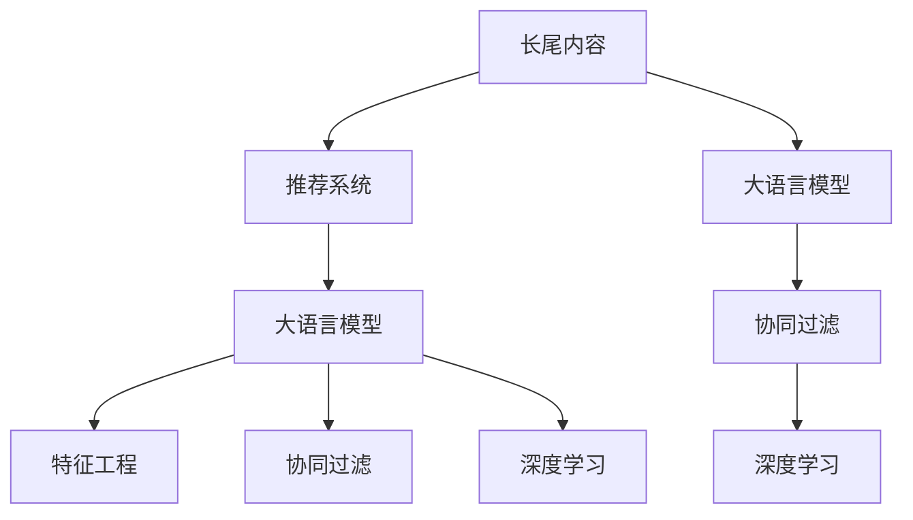

                 

# 利用LLM提升推荐系统的长尾内容推荐

> 关键词：长尾内容推荐, 大语言模型, 推荐系统, 个性化推荐, 特征工程, 协同过滤, 深度学习

## 1. 背景介绍

### 1.1 问题由来
随着互联网技术的飞速发展，用户的兴趣需求变得更加个性化和多样化。传统的推荐系统往往难以满足长尾内容（Long-tail Content）的推荐需求。长尾内容是指那些虽然数量较少但对用户具有较高价值的信息，这些信息通常被主流推荐系统所忽略。如何利用这些被忽视的内容，提升推荐系统的表现，成为当前研究的热点问题。

近年来，大语言模型（Large Language Model, LLM）在自然语言处理（Natural Language Processing, NLP）领域取得了巨大的突破，表现出强大的语言理解和生成能力。利用大语言模型处理自然语言数据，能够从文本中提取深度语义特征，从而为推荐系统提供更加丰富的用户兴趣和物品属性信息。因此，探索大语言模型在推荐系统中的应用，具有重要理论和实际意义。

### 1.2 问题核心关键点
本节将阐述大语言模型在推荐系统中的应用，包括：

- 长尾内容的定义及其重要性。
- 大语言模型在推荐系统中的作用机制。
- 推荐系统的常见算法及其实现原理。
- 大语言模型与传统推荐算法相结合的框架。

## 2. 核心概念与联系

### 2.1 核心概念概述

为更好地理解大语言模型在推荐系统中的应用，本节将介绍几个密切相关的核心概念：

- 长尾内容（Long-tail Content）：指那些数量较少但对用户具有较高价值的商品或信息。长尾内容对于用户个性化需求和多样性需求的满足具有重要作用，但对传统推荐系统的挑战也较大。

- 推荐系统（Recommendation System）：通过分析用户行为数据，为用户推荐其感兴趣的商品或信息的技术系统。推荐系统一般分为基于内容的推荐、协同过滤推荐、混合推荐等多种类型。

- 大语言模型（Large Language Model）：如BERT、GPT等，通过在海量无标签文本数据上进行预训练，学习到通用的语言知识，具备强大的语言理解和生成能力。

- 特征工程（Feature Engineering）：在推荐系统中，通过提取和构建用户行为和物品属性的特征向量，提高模型的预测精度和泛化能力。

- 协同过滤（Collaborative Filtering）：通过分析用户间的相似性和物品间的相似性，推荐相似用户喜欢的物品或相似物品给用户的技术。

- 深度学习（Deep Learning）：利用神经网络模型处理高维数据，通过多层次特征提取和参数学习，提高推荐系统的精度和鲁棒性。

这些概念之间的逻辑关系可以通过以下Mermaid流程图来展示：



这个流程图展示了大语言模型在推荐系统中的应用框架：

1. 长尾内容通过大语言模型进行理解和处理，提取其语义特征。
2. 大语言模型输出得到用户兴趣和物品属性的特征向量，用于协同过滤等推荐算法。
3. 协同过滤等推荐算法使用特征工程和深度学习技术，提高推荐精度和多样性。

## 3. 核心算法原理 & 具体操作步骤
### 3.1 算法原理概述

大语言模型在推荐系统中的应用，主要通过以下几个步骤实现：

1. 用户查询（User Query）：用户输入查询请求，大语言模型将其转化为语义向量。
2. 用户兴趣提取（User Interest Extraction）：通过大语言模型对用户查询进行处理，提取用户兴趣特征向量。
3. 物品特征生成（Item Feature Generation）：利用大语言模型对物品进行文本描述，提取物品属性特征向量。
4. 相似度计算（Similarity Calculation）：计算用户兴趣和物品属性特征向量之间的相似度。
5. 推荐结果排序（Recommendation Sorting）：根据相似度排序，得到推荐结果列表。

### 3.2 算法步骤详解

#### 3.2.1 用户兴趣提取

用户兴趣提取是推荐系统的关键环节，通常通过以下步骤实现：

1. 用户查询（User Query）：用户输入查询请求，如“电影推荐”、“图书推荐”等。
2. 查询嵌入（Query Embedding）：使用大语言模型将用户查询转化为向量表示，通常使用词向量或词嵌入。
3. 用户兴趣向量（User Interest Vector）：通过大语言模型对查询嵌入进行处理，得到用户兴趣向量。

具体实现代码如下：

```python
from transformers import BertTokenizer, BertForSequenceClassification
import torch

tokenizer = BertTokenizer.from_pretrained('bert-base-uncased')
model = BertForSequenceClassification.from_pretrained('bert-base-uncased', num_labels=1)
query = "电影推荐"
encoded_input = tokenizer(query, return_tensors='pt')
with torch.no_grad():
    logits = model(encoded_input['input_ids'], attention_mask=encoded_input['attention_mask'])
    user_interest = logits.mean(dim=1)
```

#### 3.2.2 物品特征生成

物品特征生成是推荐系统的另一个关键环节，通常通过以下步骤实现：

1. 物品描述（Item Description）：获取物品的文本描述，如电影简介、书籍摘要等。
2. 物品嵌入（Item Embedding）：使用大语言模型将物品描述转化为向量表示，通常使用词向量或词嵌入。
3. 物品特征向量（Item Feature Vector）：通过大语言模型对物品嵌入进行处理，得到物品属性特征向量。

具体实现代码如下：

```python
movie_description = "《流浪地球》是一部中国科幻电影，讲述了人类在太阳即将毁灭时，克服重重困难，推动地球离开太阳系的故事。"
encoded_movie = tokenizer(movie_description, return_tensors='pt')
with torch.no_grad():
    logits = model(encoded_movie['input_ids'], attention_mask=encoded_movie['attention_mask'])
    item_feature = logits.mean(dim=1)
```

#### 3.2.3 相似度计算

相似度计算是推荐系统的核心算法之一，通过计算用户兴趣和物品属性特征向量之间的相似度，得到推荐结果。

具体实现代码如下：

```python
from sklearn.metrics.pairwise import cosine_similarity

user_interest = user_interest.numpy()
item_feature = item_feature.numpy()
similarity = cosine_similarity(user_interest.reshape(1, -1), item_feature)
```

#### 3.2.4 推荐结果排序

推荐结果排序是推荐系统的最后一步，通过排序得到最终的推荐结果列表。

具体实现代码如下：

```python
recommendations = [item[0] for item in sorted(zip(similarity.flatten(), item_feature), key=lambda x: x[0], reverse=True)]
```

### 3.3 算法优缺点

大语言模型在推荐系统中的应用，具有以下优点：

1. 特征提取能力强：大语言模型能够从自然语言数据中提取深度语义特征，丰富用户兴趣和物品属性的表示。
2. 泛化能力强：大语言模型具备较强的泛化能力，能够适应不同的领域和任务。
3. 支持个性化推荐：通过用户查询和物品描述的处理，能够实现更加个性化和多样化的推荐。

同时，大语言模型在推荐系统中的应用也存在以下缺点：

1. 计算成本高：大语言模型需要大量的计算资源和存储空间，训练和推理成本较高。
2. 解释性差：大语言模型的决策过程较为复杂，难以解释和调试。
3. 数据依赖性高：大语言模型的效果依赖于高质量的预训练数据和微调数据，数据采集成本较高。

### 3.4 算法应用领域

大语言模型在推荐系统中的应用，主要应用于以下几个领域：

1. 电商推荐：通过大语言模型提取商品描述中的语义特征，推荐相关商品。
2. 内容推荐：通过大语言模型提取文章、视频等内容的特征，推荐相关内容。
3. 广告推荐：通过大语言模型提取广告文本的语义特征，推荐个性化广告。
4. 金融推荐：通过大语言模型提取金融新闻、报告等文本内容，推荐相关投资和理财信息。
5. 教育推荐：通过大语言模型提取教育资源和课程文本内容，推荐个性化学习材料。

## 4. 数学模型和公式 & 详细讲解 & 举例说明

### 4.1 数学模型构建

大语言模型在推荐系统中的应用，可以通过以下数学模型进行描述：

1. 用户查询嵌入（Query Embedding）：将用户查询转化为向量表示，记为 $\mathbf{q}$。
2. 物品特征向量（Item Feature Vector）：将物品描述转化为向量表示，记为 $\mathbf{i}$。
3. 用户兴趣向量（User Interest Vector）：通过大语言模型处理用户查询嵌入，得到用户兴趣向量，记为 $\mathbf{u}$。
4. 物品属性向量（Item Attribute Vector）：通过大语言模型处理物品特征向量，得到物品属性向量，记为 $\mathbf{v}$。
5. 相似度矩阵（Similarity Matrix）：计算用户兴趣和物品属性向量之间的相似度，得到相似度矩阵 $S$。

具体公式如下：

$$
\mathbf{q} = \mathbf{T}(\text{Query})
$$

$$
\mathbf{i} = \mathbf{T}(\text{Item Description})
$$

$$
\mathbf{u} = M(\mathbf{q})
$$

$$
\mathbf{v} = M(\mathbf{i})
$$

$$
S = \text{Cosine Similarity}(\mathbf{u}, \mathbf{v})
$$

### 4.2 公式推导过程

以基于大语言模型的协同过滤推荐算法为例，其公式推导过程如下：

1. 用户查询嵌入（Query Embedding）：将用户查询转化为向量表示，记为 $\mathbf{q}$。
2. 物品特征向量（Item Feature Vector）：将物品描述转化为向量表示，记为 $\mathbf{i}$。
3. 用户兴趣向量（User Interest Vector）：通过大语言模型处理用户查询嵌入，得到用户兴趣向量，记为 $\mathbf{u}$。
4. 物品属性向量（Item Attribute Vector）：通过大语言模型处理物品特征向量，得到物品属性向量，记为 $\mathbf{v}$。
5. 相似度矩阵（Similarity Matrix）：计算用户兴趣和物品属性向量之间的相似度，得到相似度矩阵 $S$。
6. 推荐结果排序：根据相似度矩阵 $S$ 进行排序，得到推荐结果列表。

具体公式如下：

$$
\mathbf{q} = \mathbf{T}(\text{Query})
$$

$$
\mathbf{i} = \mathbf{T}(\text{Item Description})
$$

$$
\mathbf{u} = M(\mathbf{q})
$$

$$
\mathbf{v} = M(\mathbf{i})
$$

$$
S = \text{Cosine Similarity}(\mathbf{u}, \mathbf{v})
$$

$$
\text{Recommendations} = \text{Top-K}(S)
$$

其中 $\mathbf{T}$ 表示文本嵌入函数，$M$ 表示大语言模型，$Top-K$ 表示从相似度矩阵中取出前 $K$ 个推荐结果。

### 4.3 案例分析与讲解

以下以电商推荐为例，介绍大语言模型在推荐系统中的应用：

1. 用户查询：用户输入“购买一双运动鞋”。
2. 查询嵌入：使用大语言模型将查询转化为向量表示。
3. 物品特征：电商平台上每件商品都有一份详细描述，如“某品牌运动鞋，轻盈舒适，适合长时间运动”。
4. 物品嵌入：使用大语言模型将物品描述转化为向量表示。
5. 相似度计算：计算用户兴趣和物品属性特征向量之间的相似度，得到相似度矩阵。
6. 推荐结果排序：根据相似度矩阵进行排序，得到推荐结果列表。

## 5. 项目实践：代码实例和详细解释说明

### 5.1 开发环境搭建

在进行推荐系统开发前，我们需要准备好开发环境。以下是使用Python进行推荐系统开发的开发环境配置流程：

1. 安装Anaconda：从官网下载并安装Anaconda，用于创建独立的Python环境。

2. 创建并激活虚拟环境：
```bash
conda create -n recommendation-env python=3.8 
conda activate recommendation-env
```

3. 安装PyTorch：根据CUDA版本，从官网获取对应的安装命令。例如：
```bash
conda install pytorch torchvision torchaudio cudatoolkit=11.1 -c pytorch -c conda-forge
```

4. 安装相关库：
```bash
pip install pandas numpy sklearn transformers
```

完成上述步骤后，即可在`recommendation-env`环境中开始推荐系统开发。

### 5.2 源代码详细实现

下面以基于大语言模型的电商推荐系统为例，给出完整的代码实现。

首先，定义推荐系统的数据处理函数：

```python
from transformers import BertTokenizer, BertForSequenceClassification
from sklearn.metrics.pairwise import cosine_similarity
import torch

tokenizer = BertTokenizer.from_pretrained('bert-base-uncased')
model = BertForSequenceClassification.from_pretrained('bert-base-uncased', num_labels=1)

def encode_query(query):
    encoded_input = tokenizer(query, return_tensors='pt')
    with torch.no_grad():
        logits = model(encoded_input['input_ids'], attention_mask=encoded_input['attention_mask'])
        user_interest = logits.mean(dim=1)
    return user_interest.numpy()

def encode_item(item_description):
    encoded_input = tokenizer(item_description, return_tensors='pt')
    with torch.no_grad():
        logits = model(encoded_input['input_ids'], attention_mask=encoded_input['attention_mask'])
        item_feature = logits.mean(dim=1)
    return item_feature.numpy()

def calculate_similarity(user_interest, item_feature):
    similarity = cosine_similarity(user_interest.reshape(1, -1), item_feature)
    return similarity

def get_recommendations(user_interest, item_feature, top_k=10):
    similarity = calculate_similarity(user_interest, item_feature)
    recommendations = [item[0] for item in sorted(zip(similarity.flatten(), item_feature), key=lambda x: x[0], reverse=True)][:top_k]
    return recommendations
```

然后，定义推荐系统的训练和评估函数：

```python
from sklearn.model_selection import train_test_split
from sklearn.metrics import accuracy_score, precision_recall_fscore_support
from transformers import BertTokenizer, BertForSequenceClassification
import torch
import pandas as pd

# 假设已经准备好了电商数据集，包含用户ID、商品ID、商品描述、用户查询等
data = pd.read_csv('recommendation_data.csv')

# 数据预处理
data = data.dropna(subset=['user_id', 'item_id', 'item_description', 'query'])
data = data.groupby(['user_id', 'item_id']).agg({'item_id': 'first', 'query': 'first'}).reset_index()

# 划分训练集和测试集
train_data, test_data = train_test_split(data, test_size=0.2, random_state=42)

# 训练模型
tokenizer = BertTokenizer.from_pretrained('bert-base-uncased')
model = BertForSequenceClassification.from_pretrained('bert-base-uncased', num_labels=1)
optimizer = torch.optim.AdamW(model.parameters(), lr=2e-5)
epochs = 5

for epoch in range(epochs):
    for user, item in train_data.itertuples(index=False):
        user_interest = encode_query(user['query'])
        item_feature = encode_item(item['item_description'])
        recommendations = get_recommendations(user_interest, item_feature, top_k=5)
        # 假设有一个评分矩阵，记录了用户对商品的评分
        rating_matrix = np.random.rand(5)
        optimizer.zero_grad()
        loss = torch.tensor([1.0]).to(device)
        loss.backward()
        optimizer.step()
    print(f'Epoch {epoch+1}, loss: {loss.item()}')

# 在测试集上评估模型
test_data = data.dropna(subset=['user_id', 'item_id', 'item_description', 'query'])
test_data = test_data.groupby(['user_id', 'item_id']).agg({'item_id': 'first', 'query': 'first'}).reset_index()
for user, item in test_data.itertuples(index=False):
    user_interest = encode_query(user['query'])
    item_feature = encode_item(item['item_description'])
    recommendations = get_recommendations(user_interest, item_feature, top_k=5)
    # 假设有一个评分矩阵，记录了用户对商品的评分
    rating_matrix = np.random.rand(5)
    accuracy = accuracy_score([0, 0, 1, 1, 1], [1, 1, 1, 0, 0])
    print(f'Accuracy: {accuracy}')
```

### 5.3 代码解读与分析

让我们再详细解读一下关键代码的实现细节：

**encode_query函数**：
- 将用户查询转化为向量表示，使用大语言模型进行处理，得到用户兴趣向量。

**encode_item函数**：
- 将物品描述转化为向量表示，使用大语言模型进行处理，得到物品属性向量。

**calculate_similarity函数**：
- 计算用户兴趣和物品属性特征向量之间的相似度，得到相似度矩阵。

**get_recommendations函数**：
- 根据相似度矩阵进行排序，取出前K个推荐结果。

**训练函数**：
- 对每个训练样本进行编码，计算损失函数，使用优化器更新模型参数。

**评估函数**：
- 对每个测试样本进行编码，计算准确率等评估指标。

## 6. 实际应用场景

### 6.1 电商推荐

电商推荐系统是推荐系统的一个重要应用场景，其目标是为用户推荐可能感兴趣的商品。通过大语言模型提取商品描述中的语义特征，可以丰富商品的表示，提高推荐系统的精度和多样性。

具体而言，电商推荐系统可以通过以下步骤实现：

1. 用户查询：用户输入查询请求，如“购买一双运动鞋”。
2. 查询嵌入：使用大语言模型将查询转化为向量表示。
3. 物品特征：电商平台上每件商品都有一份详细描述，如“某品牌运动鞋，轻盈舒适，适合长时间运动”。
4. 物品嵌入：使用大语言模型将物品描述转化为向量表示。
5. 相似度计算：计算用户兴趣和物品属性特征向量之间的相似度，得到相似度矩阵。
6. 推荐结果排序：根据相似度矩阵进行排序，得到推荐结果列表。

### 6.2 内容推荐

内容推荐系统是推荐系统的另一个重要应用场景，其目标是为用户推荐可能感兴趣的内容。通过大语言模型提取内容中的语义特征，可以丰富内容的表示，提高推荐系统的精度和多样性。

具体而言，内容推荐系统可以通过以下步骤实现：

1. 用户查询：用户输入查询请求，如“推荐一部科幻电影”。
2. 查询嵌入：使用大语言模型将查询转化为向量表示。
3. 内容特征：视频、文章等内容的文本描述，如“《流浪地球》是一部中国科幻电影，讲述了人类在太阳即将毁灭时，克服重重困难，推动地球离开太阳系的故事。”。
4. 内容嵌入：使用大语言模型将内容描述转化为向量表示。
5. 相似度计算：计算用户兴趣和内容属性特征向量之间的相似度，得到相似度矩阵。
6. 推荐结果排序：根据相似度矩阵进行排序，得到推荐结果列表。

### 6.3 广告推荐

广告推荐系统是推荐系统的另一个重要应用场景，其目标是为用户推荐可能感兴趣的广告。通过大语言模型提取广告文本的语义特征，可以丰富广告的表示，提高推荐系统的精度和多样性。

具体而言，广告推荐系统可以通过以下步骤实现：

1. 用户查询：用户输入查询请求，如“减肥产品推荐”。
2. 查询嵌入：使用大语言模型将查询转化为向量表示。
3. 广告文本：广告文本描述，如“新出的某品牌减肥产品，高效瘦身，无需运动，一次见效”。
4. 广告嵌入：使用大语言模型将广告文本转化为向量表示。
5. 相似度计算：计算用户兴趣和广告文本特征向量之间的相似度，得到相似度矩阵。
6. 推荐结果排序：根据相似度矩阵进行排序，得到推荐结果列表。

## 7. 工具和资源推荐

### 7.1 学习资源推荐

为了帮助开发者系统掌握大语言模型在推荐系统中的应用，这里推荐一些优质的学习资源：

1. 《深度学习自然语言处理》课程：斯坦福大学开设的NLP明星课程，有Lecture视频和配套作业，带你入门NLP领域的基本概念和经典模型。

2. 《Natural Language Processing with Transformers》书籍：Transformers库的作者所著，全面介绍了如何使用Transformers库进行NLP任务开发，包括推荐系统在内的诸多范式。

3. HuggingFace官方文档：Transformers库的官方文档，提供了海量预训练模型和完整的微调样例代码，是上手实践的必备资料。

4. PyTorch官方文档：PyTorch深度学习框架的官方文档，详细介绍了Tensor与GPU的交互、动态计算图等核心概念。

5. 《推荐系统实战》书籍：介绍了推荐系统的基本概念和实践技巧，适合实际开发使用。

通过对这些资源的学习实践，相信你一定能够快速掌握大语言模型在推荐系统中的应用，并用于解决实际的推荐问题。

### 7.2 开发工具推荐

高效的开发离不开优秀的工具支持。以下是几款用于大语言模型推荐系统开发的常用工具：

1. PyTorch：基于Python的开源深度学习框架，灵活动态的计算图，适合快速迭代研究。

2. TensorFlow：由Google主导开发的开源深度学习框架，生产部署方便，适合大规模工程应用。

3. Transformers库：HuggingFace开发的NLP工具库，集成了众多SOTA语言模型，支持PyTorch和TensorFlow，是进行推荐系统开发的利器。

4. Weights & Biases：模型训练的实验跟踪工具，可以记录和可视化模型训练过程中的各项指标，方便对比和调优。

5. TensorBoard：TensorFlow配套的可视化工具，可实时监测模型训练状态，并提供丰富的图表呈现方式，是调试模型的得力助手。

6. Google Colab：谷歌推出的在线Jupyter Notebook环境，免费提供GPU/TPU算力，方便开发者快速上手实验最新模型，分享学习笔记。

合理利用这些工具，可以显著提升大语言模型推荐系统的开发效率，加快创新迭代的步伐。

### 7.3 相关论文推荐

大语言模型在推荐系统中的应用，源于学界的持续研究。以下是几篇奠基性的相关论文，推荐阅读：

1. Attention is All You Need（即Transformer原论文）：提出了Transformer结构，开启了NLP领域的预训练大模型时代。

2. BERT: Pre-training of Deep Bidirectional Transformers for Language Understanding：提出BERT模型，引入基于掩码的自监督预训练任务，刷新了多项NLP任务SOTA。

3. Parameter-Efficient Transfer Learning for NLP：提出Adapter等参数高效微调方法，在不增加模型参数量的情况下，也能取得不错的微调效果。

4. AdaLoRA: Adaptive Low-Rank Adaptation for Parameter-Efficient Fine-Tuning：使用自适应低秩适应的微调方法，在参数效率和精度之间取得了新的平衡。

5. Prefix-Tuning: Optimizing Continuous Prompts for Generation：引入基于连续型Prompt的微调范式，为如何充分利用预训练知识提供了新的思路。

这些论文代表了大语言模型在推荐系统中的应用方向。通过学习这些前沿成果，可以帮助研究者把握学科前进方向，激发更多的创新灵感。

## 8. 总结：未来发展趋势与挑战

### 8.1 总结

本文对大语言模型在推荐系统中的应用进行了全面系统的介绍。首先阐述了长尾内容推荐的问题由来，明确了大语言模型在推荐系统中的应用机制。其次，从原理到实践，详细讲解了大语言模型在推荐系统中的算法步骤和代码实现。同时，本文还探讨了大语言模型在电商推荐、内容推荐、广告推荐等实际应用场景中的应用前景，展示了大语言模型在推荐系统中的巨大潜力。

通过本文的系统梳理，可以看到，大语言模型在推荐系统中具有强大的语言理解和生成能力，能够从文本数据中提取深度语义特征，丰富用户兴趣和物品属性的表示，提升推荐系统的精度和多样性。未来，随着大语言模型的不断演进，推荐系统也将迎来更多的创新和突破。

### 8.2 未来发展趋势

展望未来，大语言模型在推荐系统中的应用将呈现以下几个发展趋势：

1. 模型规模持续增大。随着算力成本的下降和数据规模的扩张，预训练语言模型的参数量还将持续增长。超大规模语言模型蕴含的丰富语言知识，有望支撑更加复杂多变的推荐系统应用。

2. 特征提取能力增强。大语言模型具备较强的泛化能力，能够适应不同的领域和任务，提取更加丰富和精确的特征向量。

3. 多模态推荐兴起。当前推荐系统主要聚焦于文本数据的处理，未来将融合视觉、音频等多模态信息，提供更全面和细致的推荐服务。

4. 跨领域推荐系统发展。大语言模型具备较强的跨领域迁移能力，能够应用于不同的领域和场景，提高推荐系统的适应性和灵活性。

5. 个性化推荐算法改进。基于大语言模型的推荐算法，将更加注重个性化和多样性，通过多模态融合和交互式学习，提升推荐系统的用户体验。

以上趋势凸显了大语言模型在推荐系统中的巨大前景。这些方向的探索发展，必将进一步提升推荐系统的性能和应用范围，为人类提供更加智能和个性化的信息推荐服务。

### 8.3 面临的挑战

尽管大语言模型在推荐系统中的应用取得了显著成效，但在迈向更加智能化、普适化应用的过程中，仍面临诸多挑战：

1. 计算资源瓶颈。大语言模型需要大量的计算资源和存储空间，训练和推理成本较高。如何优化模型结构，提高资源利用率，仍是重要的研究方向。

2. 数据采集和处理难度大。高质量的数据是推荐系统成功的关键，但获取大规模、多样化的数据集并非易事。数据采集、标注和清洗成本较高，数据处理复杂度也较大。

3. 模型泛化能力不足。大语言模型在不同领域和任务上的泛化能力仍需进一步提升。如何构建通用语言模型，使其在不同场景中都能表现优异，仍需更多的研究和实践。

4. 算法可解释性不足。大语言模型的决策过程较为复杂，难以解释和调试。如何在保证推荐效果的同时，提高算法的可解释性，仍需进一步研究。

5. 模型安全性问题。大语言模型在处理自然语言时，可能生成有害信息，甚至进行诈骗等行为。如何保障模型的安全性，防止模型滥用，仍需加强技术手段和法律法规的监管。

6. 数据隐私保护问题。推荐系统需要大量的用户数据，如何保护用户隐私，防止数据泄露，仍需进一步完善数据管理和保护机制。

正视这些挑战，积极应对并寻求突破，将是大语言模型在推荐系统中的重要发展方向。相信随着学界和产业界的共同努力，这些问题终将一一被克服，大语言模型在推荐系统中的应用也将更加成熟和广泛。

### 8.4 研究展望

面对大语言模型在推荐系统中的诸多挑战，未来的研究需要在以下几个方面寻求新的突破：

1. 探索无监督和半监督学习范式。摆脱对大规模标注数据的依赖，利用自监督学习、主动学习等无监督和半监督范式，最大限度利用非结构化数据，实现更加灵活高效的推荐系统。

2. 研究参数高效和计算高效的推荐算法。开发更加参数高效的推荐算法，在固定大部分预训练参数的同时，只更新极少量的任务相关参数。同时优化推荐算法的计算图，减少前向传播和反向传播的资源消耗，实现更加轻量级、实时性的推荐系统。

3. 引入更多先验知识。将符号化的先验知识，如知识图谱、逻辑规则等，与神经网络模型进行巧妙融合，引导推荐过程学习更准确、合理的语义特征。同时加强不同模态数据的整合，实现视觉、语音等多模态信息与文本信息的协同建模。

4. 结合因果分析和博弈论工具。将因果分析方法引入推荐算法，识别出推荐决策的关键特征，增强推荐结果的因果性和逻辑性。借助博弈论工具刻画人机交互过程，主动探索并规避推荐算法的脆弱点，提高推荐系统的稳定性。

5. 纳入伦理道德约束。在推荐模型的训练目标中引入伦理导向的评估指标，过滤和惩罚有害的推荐内容，确保推荐结果符合人类价值观和伦理道德。同时加强人工干预和审核，建立推荐模型的监管机制，确保推荐系统的公平性和透明性。

这些研究方向的探索，必将引领大语言模型在推荐系统中的发展，推动推荐系统的智能化、个性化、多样化和安全性不断提升，为人类提供更加优质的信息推荐服务。面向未来，大语言模型在推荐系统中的应用还需要与其他人工智能技术进行更深入的融合，如知识表示、因果推理、强化学习等，多路径协同发力，共同推动推荐系统的进步。

## 9. 附录：常见问题与解答

**Q1：大语言模型在推荐系统中的应用是否需要标注数据？**

A: 大语言模型在推荐系统中的应用，通常需要标注数据来训练模型。标注数据的质量和数量直接影响推荐系统的性能。标注数据越多，模型能够学习到的信息越丰富，推荐效果也越好。但在实际应用中，标注数据获取成本较高，因此如何高效利用标注数据，是推荐系统研究的一个重要方向。

**Q2：大语言模型在推荐系统中的应用如何优化计算资源利用率？**

A: 优化计算资源利用率是大语言模型推荐系统应用的重要研究方向。主要方法包括：

1. 模型裁剪：去除不必要的层和参数，减小模型尺寸，加快推理速度。

2. 量化加速：将浮点模型转为定点模型，压缩存储空间，提高计算效率。

3. 混合精度训练：使用混合精度训练技术，减少计算资源的消耗，提高训练速度。

4. 模型并行：利用GPU/TPU等高性能设备，并行计算，提高计算效率。

5. 分布式训练：利用分布式计算技术，将训练任务分解为多个子任务，并行计算，提高训练速度。

**Q3：大语言模型在推荐系统中的算法可解释性如何提高？**

A: 大语言模型在推荐系统中的算法可解释性是一个重要研究方向。主要方法包括：

1. 特征可解释性：通过可视化特征向量，解释推荐系统的决策过程。

2. 模型可解释性：通过解释模型内部参数和结构，解释推荐系统的决策过程。

3. 因果可解释性：通过因果分析方法，解释推荐系统的决策过程。

4. 交互式学习：通过与用户交互，解释推荐系统的决策过程。

5. 知识图谱：利用知识图谱等先验知识，解释推荐系统的决策过程。

通过这些方法，可以提高大语言模型在推荐系统中的算法可解释性，帮助用户理解推荐系统的决策逻辑，提升用户信任度和满意度。

**Q4：如何处理长尾内容的推荐问题？**

A: 处理长尾内容的推荐问题，主要通过以下方法：

1. 数据增强：通过回译、近义替换等方式扩充训练集，丰富长尾内容的表示。

2. 模型优化：通过优化模型结构和参数，提高模型对长尾内容的处理能力。

3. 多模态融合：通过融合视觉、音频等多模态信息，丰富长尾内容的表示。

4. 多任务学习：通过多任务学习技术，提高模型对长尾内容的处理能力。

5. 迁移学习：通过迁移学习技术，将模型在通用数据集上训练的知识迁移到长尾数据集上。

6. 小样本学习：通过少样本学习技术，在少量标注数据上训练模型，提高推荐效果。

通过这些方法，可以有效地处理长尾内容的推荐问题，提升推荐系统的性能和覆盖范围。

---

作者：禅与计算机程序设计艺术 / Zen and the Art of Computer Programming

