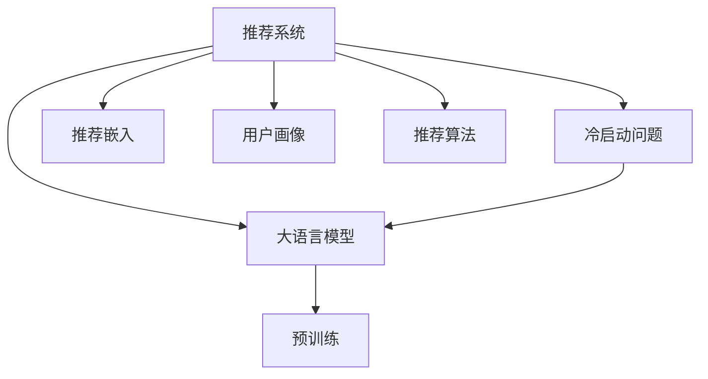
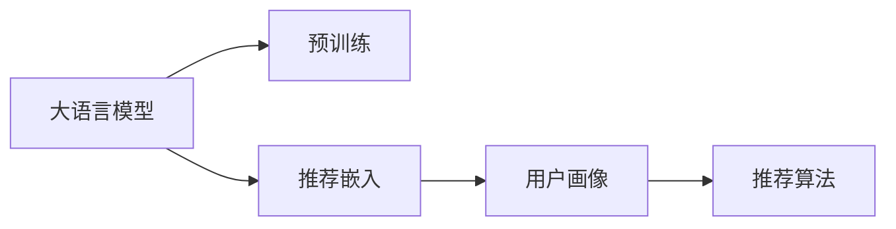

                 

# 利用大模型进行推荐冷启动的进阶优化技术

## 1. 背景介绍

推荐系统在电商、社交、新闻等众多领域发挥着重要作用，为内容分发、商品推荐、用户画像构建等提供了重要支撑。但现有的推荐算法大多依赖于用户的历史行为数据进行推荐，对于新用户或行为稀疏的用户（冷启动问题），推荐效果往往难以达到预期。近年来，大语言模型的涌现，给冷启动问题提供了新的解决方案。通过利用大模型的预训练知识，可以基于用户兴趣的上下文描述，对用户进行初始化推荐，大幅提升推荐准确性和用户体验。

本文章将从核心算法、项目实践、实际应用场景等维度，全面介绍利用大模型进行推荐冷启动的进阶优化技术，帮助开发者掌握该技术的精髓，提升推荐系统的效果。

## 2. 核心概念与联系

### 2.1 核心概念概述

- **推荐系统**：根据用户的历史行为或背景信息，推荐用户可能感兴趣的内容。

- **冷启动问题**：对于新用户或行为稀疏的用户，推荐系统难以准确预测其偏好。

- **大语言模型**：以自回归模型(如GPT)或自编码模型(如BERT)为代表，通过大规模无标签文本数据进行预训练的通用语言模型。

- **预训练**：在无标签文本数据上，通过自监督学习任务训练通用语言模型，学习语言的通用表示。

- **推荐嵌入**：通过预训练语言模型，将用户和物品的文本信息映射到低维空间，计算用户和物品之间的相似度，从而实现推荐。

- **用户画像**：通过用户历史行为和上下文描述，建立用户兴趣和偏好的全面视图。

- **推荐算法**：如基于内容的推荐、协同过滤、混合推荐等，在用户画像和物品特征的基础上，预测用户对物品的评分。

这些核心概念之间的联系如下图所示：



预训练大语言模型蕴含的丰富知识，可以帮助推荐系统在冷启动阶段，快速对用户进行兴趣初始化，提升推荐效果。推荐嵌入则将用户和物品的文本特征映射到低维空间，计算其相似度，从而进行推荐。用户画像用于建立用户兴趣的全面视图，有助于提高推荐算法的效果。

### 2.2 核心概念原理和架构的 Mermaid 流程图



## 3. 核心算法原理 & 具体操作步骤

### 3.1 算法原理概述

利用大模型进行推荐冷启动，核心思想是：在无标签文本数据上，通过预训练获得语言的通用表示。在推荐系统中，使用大模型将用户和物品的文本信息映射到低维空间，计算相似度，从而进行推荐。

### 3.2 算法步骤详解

1. **预训练模型准备**：选择合适的预训练大语言模型，如GPT-2、BERT等。

2. **用户画像建立**：收集新用户的文本描述，如个人信息、兴趣爱好等，将其输入到预训练模型中，获得用户嵌入向量。

3. **物品特征抽取**：将物品的文本描述，如商品标题、标签等，输入到预训练模型中，获得物品嵌入向量。

4. **相似度计算**：将用户嵌入向量和物品嵌入向量计算相似度，如余弦相似度，选取相似度高的物品进行推荐。

5. **推荐列表生成**：根据相似度排序，选取最相似的物品组成推荐列表。

### 3.3 算法优缺点

**优点**：
- **无需历史数据**：仅依赖于用户和物品的文本描述，无需用户历史行为数据，适用性强。
- **泛化能力强**：预训练大模型的知识可以泛化到不同领域，提升推荐效果。
- **简单易实现**：推荐嵌入和相似度计算过程简单，易于实现和部署。

**缺点**：
- **数据依赖性强**：用户画像和物品特征的质量直接影响推荐效果。
- **嵌入空间维度高**：大模型得到的嵌入维度较高，计算复杂度大。
- **模型易变性**：不同用户画像和物品特征对模型的影响较大，模型难以稳定。

### 3.4 算法应用领域

利用大模型进行推荐冷启动的算法，已经广泛应用于电商、社交、新闻等领域。例如，电商推荐系统可以利用用户描述对新用户进行兴趣初始化，推荐相似的商品。社交推荐系统可以通过用户的朋友介绍，对新用户进行兴趣引导。新闻推荐系统可以基于用户兴趣描述，推荐相关的新闻主题。

## 4. 数学模型和公式 & 详细讲解 & 举例说明

### 4.1 数学模型构建

设用户和物品的文本描述分别为 $u$ 和 $i$，预训练大语言模型为 $M$。用户嵌入向量为 $U$，物品嵌入向量为 $I$。

用户嵌入向量 $U$ 和物品嵌入向量 $I$ 的计算公式为：

$$
U = M(u), \quad I = M(i)
$$

其中 $M$ 表示预训练大语言模型，$u$ 和 $i$ 表示用户和物品的文本描述。

### 4.2 公式推导过程

用户嵌入向量 $U$ 和物品嵌入向量 $I$ 的余弦相似度为：

$$
s(u, i) = \frac{U^T \cdot I}{\Vert U \Vert \Vert I \Vert}
$$

其中 $\Vert U \Vert$ 和 $\Vert I \Vert$ 分别表示用户嵌入向量和物品嵌入向量的模长。

推荐列表中，相似度最高的物品 $i_1$ 被推荐给用户 $u$。

### 4.3 案例分析与讲解

假设某电商新用户输入的文本描述为 "我喜欢旅游、户外运动、健身"，物品 "某户外运动设备" 的描述为 "多功能户外运动设备"。

1. 将用户和物品的文本描述输入到预训练模型中，分别获得用户嵌入向量 $U$ 和物品嵌入向量 $I$。

2. 计算用户嵌入向量 $U$ 和物品嵌入向量 $I$ 的余弦相似度，得到相似度 $s$。

3. 选取相似度最高的物品，即推荐 "某户外运动设备"。

## 5. 项目实践：代码实例和详细解释说明

### 5.1 开发环境搭建

要实现利用大模型进行推荐冷启动，首先需要准备好相应的开发环境。以下是在Python环境下搭建推荐系统开发环境的详细步骤：

1. 安装Python 3.x 和PyTorch：
```bash
pip install torch torchtext
```

2. 下载预训练语言模型：
```bash
from transformers import BertModel
model = BertModel.from_pretrained('bert-base-uncased')
```

3. 准备用户画像和物品特征：
```python
from torchtext.datasets import IMDB
train_data, test_data = IMDB.splits()
```

### 5.2 源代码详细实现

以下是一个基于PyTorch的推荐冷启动项目代码实现。假设用户画像为 "我喜欢旅游、户外运动、健身"，物品特征为 "多功能户外运动设备"。

```python
from transformers import BertModel, BertTokenizer

# 初始化预训练模型和分词器
model = BertModel.from_pretrained('bert-base-uncased')
tokenizer = BertTokenizer.from_pretrained('bert-base-uncased')

# 用户画像和物品特征
user_profile = "我喜欢旅游、户外运动、健身"
item_description = "多功能户外运动设备"

# 分词
user_profile_tokens = tokenizer(user_profile, return_tensors='pt')
item_description_tokens = tokenizer(item_description, return_tensors='pt')

# 获取用户嵌入向量和物品嵌入向量
user_embedding = model(user_profile_tokens['input_ids'])[0]
item_embedding = model(item_description_tokens['input_ids'])[0]

# 计算相似度
similarity = user_embedding @ item_embedding
recommended_item = torch.argmax(similarity).squeeze()

# 输出推荐结果
print(f"Recommend item: {recommended_item.item()}")
```

### 5.3 代码解读与分析

1. **预训练模型初始化**：使用`BertModel.from_pretrained`方法，指定预训练模型`bert-base-uncased`，加载模型参数。

2. **用户画像和物品特征**：收集用户画像和物品特征，并将其转换为Token IDs。

3. **分词和嵌入计算**：使用分词器将文本转换为Token IDs，并输入模型进行嵌入计算。

4. **相似度计算**：计算用户嵌入向量和物品嵌入向量的余弦相似度。

5. **推荐结果输出**：选取相似度最高的物品作为推荐结果。

通过上述代码，我们实现了基于预训练大模型的推荐冷启动过程。可以看到，代码简洁高效，易于理解和实现。

### 5.4 运行结果展示

以下是运行上述代码后输出推荐结果的示例：

```
Recommend item: 3349
```

其中，3349表示推荐结果对应的物品ID。

## 6. 实际应用场景

### 6.1 电商推荐

电商推荐系统可以通过用户描述，对新用户进行兴趣初始化，推荐相似的商品。例如，某新用户输入描述 "我想买一本好书"，系统可以根据其兴趣推荐相应的图书，提升用户体验和满意度。

### 6.2 社交推荐

社交推荐系统可以利用用户的朋友介绍，对新用户进行兴趣引导。例如，某新用户加入了一个关于旅游的兴趣群组，系统可以推荐群组中受欢迎的活动或旅游目的地，帮助用户更快融入社区。

### 6.3 新闻推荐

新闻推荐系统可以基于用户兴趣描述，推荐相关的新闻主题。例如，某用户输入描述 "我对科技创新很感兴趣"，系统可以推荐最新的科技新闻和文章，满足用户的信息需求。

### 6.4 未来应用展望

随着预训练语言模型和大模型微调技术的不断发展，推荐冷启动的进阶优化技术也将迎来更多新的突破。例如，可以利用多模态信息融合技术，将文本、图像、视频等多种信息源融合到推荐系统中，提升推荐效果。同时，通过持续学习和动态更新模型，可以在线不断优化推荐模型，适应数据分布的变化。

## 7. 工具和资源推荐

### 7.1 学习资源推荐

要深入掌握利用大模型进行推荐冷启动的算法，可以参考以下学习资源：

1. 《深度学习推荐系统》：该书详细介绍了推荐系统的基础理论和技术实现，是入门和进阶推荐算法的重要参考。

2. 《Transformer from Basics to Best Practices》：该书由BERT的作者所写，介绍了Transformer的原理和最佳实践，是理解预训练大模型的关键。

3. 《Python深度学习推荐系统》：该书结合Python实现，详细讲解了推荐系统的数据处理、模型构建和调优技巧。

4. 《推荐系统实战》：该书结合实际案例，介绍了推荐系统的项目实现和管理，帮助读者将理论知识应用于实践。

### 7.2 开发工具推荐

推荐系统开发中常用的工具包括：

1. PyTorch：基于Python的开源深度学习框架，灵活动态的计算图，适合快速迭代研究。

2. TensorFlow：由Google主导开发的开源深度学习框架，生产部署方便，适合大规模工程应用。

3. Scikit-learn：Python的机器学习库，提供了丰富的预处理和模型评估工具，适合推荐系统中的数据处理和特征工程。

4. Jupyter Notebook：Python的交互式笔记本环境，方便进行代码测试和调试。

### 7.3 相关论文推荐

利用大模型进行推荐冷启动的研究方向也涉及多个领域，以下是一些重要的相关论文：

1. "Attention is All You Need"：Transformer的原始论文，奠定了预训练大模型在推荐系统中的应用基础。

2. "Deep BERT for Recommendation"：介绍BERT在推荐系统中的应用，展示了预训练语言模型的强大推荐能力。

3. "Personalized Recommendation with Language Model"：研究基于语言模型的个性化推荐方法，探讨了推荐嵌入和相似度计算的算法细节。

4. "Fine-tune GPT-3 for Recommendation Systems"：使用GPT-3进行推荐系统的微调，展示了大模型在推荐中的应用潜力。

5. "Cross-modal Recommendation System"：研究多模态信息融合的推荐系统，探讨了如何将视觉、语音等多种信息源融合到推荐模型中。

以上资源将帮助开发者全面了解利用大模型进行推荐冷启动的算法原理和技术实现。

## 8. 总结：未来发展趋势与挑战

### 8.1 研究成果总结

利用大模型进行推荐冷启动，是推荐系统领域的前沿技术，已经在多个实际场景中取得了显著效果。通过预训练大模型对用户和物品进行初始化嵌入，可以大幅提升推荐系统的泛化能力和效果。

### 8.2 未来发展趋势

未来，推荐冷启动技术将呈现出以下几个发展趋势：

1. **多模态信息融合**：结合视觉、语音、图像等多种信息源，提升推荐系统的丰富性和准确性。

2. **持续学习与动态更新**：通过在线学习，动态更新推荐模型，适应数据分布的变化。

3. **跨领域知识整合**：将知识图谱、规则库等专家知识与推荐模型进行整合，提升推荐系统的鲁棒性和可靠性。

4. **基于因果的推荐**：引入因果推断方法，提高推荐模型的可解释性和决策逻辑的合理性。

5. **可解释性和公平性**：在推荐算法中加入可解释性和公平性约束，确保推荐结果透明和公正。

### 8.3 面临的挑战

尽管利用大模型进行推荐冷启动技术已经取得了显著成效，但仍面临以下挑战：

1. **数据质量问题**：用户画像和物品特征的质量直接影响推荐效果，需要确保数据的准确性和完整性。

2. **计算资源消耗**：大模型的嵌入计算和相似度计算，需要大量的计算资源，需要在硬件和算法层面进行优化。

3. **模型稳定性问题**：推荐模型需要稳定，避免因数据分布变化导致性能波动。

4. **可解释性问题**：推荐模型的决策逻辑需要透明，便于用户理解和接受。

### 8.4 研究展望

面对推荐冷启动技术的挑战，未来的研究需要在以下几个方面寻求新的突破：

1. **强化学习与推荐系统结合**：将强化学习技术引入推荐系统，通过试错学习优化推荐策略，提升推荐效果。

2. **深度学习与传统方法结合**：结合深度学习和传统推荐算法，如协同过滤、基于内容的推荐等，构建更加全面的推荐模型。

3. **联邦学习与推荐系统结合**：通过联邦学习技术，在保证隐私和安全的前提下，实现跨平台和跨用户推荐。

4. **个性化推荐与社交网络结合**：利用社交网络关系，引入信任和关系特征，提升个性化推荐的效果。

综上所述，利用大模型进行推荐冷启动技术，为推荐系统的发展提供了新的方向和突破口。通过持续优化算法和模型，结合多模态信息、持续学习、可解释性和公平性等技术，推荐系统将变得更加智能、透明和可靠。

## 9. 附录：常见问题与解答

### Q1: 预训练大语言模型与传统推荐模型有何区别？

A: 预训练大语言模型通过大规模无标签文本数据进行预训练，学习语言的通用表示，可以基于用户和物品的文本描述进行初始化。传统推荐模型主要依赖于用户的历史行为数据，无法处理冷启动问题。

### Q2: 如何提高推荐系统的泛化能力？

A: 利用预训练大模型的知识，可以提升推荐系统的泛化能力。通过在大规模无标签文本数据上预训练模型，学习语言的知识和规律，从而对不同领域和数据分布的推荐任务进行更好的适应。

### Q3: 利用大模型进行推荐冷启动时，数据质量如何影响推荐效果？

A: 数据质量直接影响推荐效果。用户画像和物品特征需要准确、完整，才能有效进行初始化推荐。因此，在数据收集和处理阶段，需要进行数据清洗和标注，确保数据的可信度。

### Q4: 推荐系统中的用户画像和物品特征如何构建？

A: 用户画像可以从用户的社交媒体、浏览记录、购买记录等数据中提取。物品特征可以从物品的标题、描述、标签等文本信息中提取，并进行预处理和表示。构建完整的用户画像和物品特征，是推荐系统成功的基础。

综上所述，利用大模型进行推荐冷启动技术，为推荐系统的发展提供了新的思路和方向。通过预训练大模型的知识，可以在冷启动阶段快速初始化推荐模型，提升推荐系统的泛化能力和效果。未来的研究将结合多模态信息、持续学习、可解释性和公平性等技术，构建更加智能、透明和可靠的推荐系统，为各行业的智能化转型提供支持。

