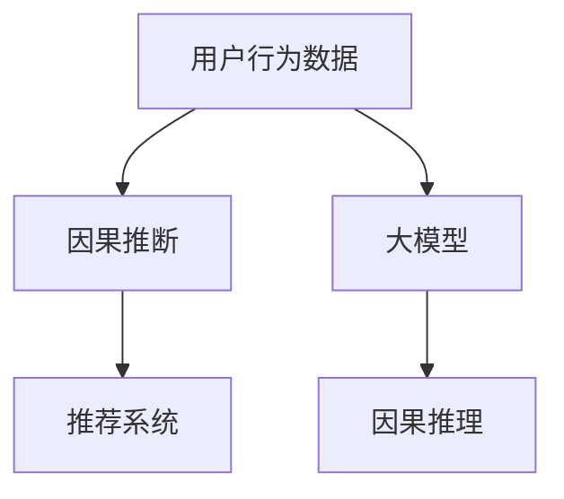

                 

# 利用大模型进行推荐场景的用户行为因果推断分析

> 关键词：用户行为因果推断,大模型推荐系统,因果推理,用户兴趣模型,效果评估

## 1. 背景介绍

在互联网推荐系统中，如何更精准地理解用户兴趣和行为模式，从而提供更个性化的推荐，是提高用户体验和推荐效果的关键问题。传统的推荐系统依赖于用户的历史行为数据，通过协同过滤、矩阵分解等方法来建模用户和物品之间的关系。然而，这种基于历史行为数据的方法存在一定的局限性：

1. **冷启动问题**：新用户或新物品的推荐效果往往较差，因为缺少足够的历史行为数据。
2. **行为隐蔽性**：用户的行为可能并不直接显现在系统日志中，导致推荐算法难以捕捉用户的真实兴趣。
3. **动态变化**：用户的兴趣和偏好可能随时间而变化，传统方法难以实时捕捉这些变化。

为了解决这些问题，越来越多的推荐系统开始引入因果推断方法，特别是基于用户行为进行因果推断的范式。因果推断方法能够帮助推荐系统更好地理解用户行为背后的原因，从而提供更加个性化和精准的推荐。本文将深入探讨如何利用大模型进行推荐场景的用户行为因果推断分析，以期为推荐系统设计者提供理论和实践上的指导。

## 2. 核心概念与联系

### 2.1 核心概念概述

为更好地理解基于大模型的推荐系统因果推断方法，本节将介绍几个密切相关的核心概念：

- **因果推断(Causal Inference)**：通过数据挖掘和统计分析，推断出变量之间的因果关系。在推荐系统中，因果推断可以帮助理解用户行为背后的原因，如用户点击某物品的原因是什么，而不是简单地记录用户点击的历史数据。
- **用户行为数据**：用户在平台上的行为数据，包括浏览、点击、收藏、购买等行为。这些数据是推荐系统进行因果推断的基础。
- **大模型(Deep Models)**：以深度学习为代表的大规模预训练模型，如BERT、GPT等。大模型在预训练过程中，能够学习到丰富的语言知识，具有强大的语义理解能力。
- **推荐系统(Recommendation System)**：利用算法为用户推荐感兴趣物品的系统，包括协同过滤、矩阵分解、内容推荐等技术。
- **因果推理(Causal Reasoning)**：通过构建和分析因果图，推断变量之间的因果关系，是因果推断的核心方法之一。

这些核心概念之间的逻辑关系可以通过以下Mermaid流程图来展示：



这个流程图展示了大模型在推荐系统中的核心作用：

1. 用户行为数据是大模型进行因果推断的输入。
2. 大模型通过因果推理，推断出因果关系，为推荐系统提供更加精确的用户兴趣模型。
3. 推荐系统利用用户兴趣模型，为用户推荐感兴趣物品。

## 3. 核心算法原理 & 具体操作步骤

### 3.1 算法原理概述

基于大模型的推荐系统因果推断方法，主要包括以下几个关键步骤：

1. **数据收集与预处理**：收集用户行为数据，包括点击、浏览、收藏等行为，并对数据进行清洗和标准化。
2. **构建因果图**：根据用户行为数据，构建因果图，明确变量之间的因果关系。
3. **因果模型训练**：使用大模型训练因果模型，学习变量之间的因果关系，构建因果推理图。
4. **推荐系统集成**：将因果推理图集成到推荐系统中，根据因果推理结果进行推荐。
5. **效果评估**：评估推荐系统的性能，对比基于因果推断和传统方法的效果。

该方法的核心思想是通过大模型学习用户行为背后的因果关系，构建更加精确的用户兴趣模型，从而提升推荐系统的精准度和个性化水平。

### 3.2 算法步骤详解

#### 3.2.1 数据收集与预处理

数据收集是因果推断的基础。推荐系统需要收集用户行为数据，包括但不限于点击、浏览、购买、评论等。数据收集完成后，需要进行预处理，包括数据清洗、标准化、缺失值处理等步骤。具体步骤如下：

1. **数据清洗**：删除或填补缺失数据，去除异常值，处理重复数据等。
2. **标准化**：对数据进行归一化、标准化等预处理，使得数据具有相同的尺度，便于后续分析。
3. **特征工程**：提取有意义的特征，如用户ID、物品ID、时间戳、行为类型等，构建特征向量。

#### 3.2.2 构建因果图

因果图是因果推断的核心工具，用于描述变量之间的因果关系。常见的因果图包括DAG图、贝叶斯网络等。在推荐系统中，因果图可以表示为用户行为、物品属性、用户特征之间的关系。具体步骤如下：

1. **节点定义**：定义因果图中的节点，包括用户ID、物品ID、行为类型、时间戳等。
2. **有向边构建**：根据用户行为数据，确定节点之间的有向边关系，如用户点击某物品，表明用户对物品感兴趣。
3. **因果关系标注**：对有向边进行因果关系标注，如用户ID影响点击行为，点击行为影响物品ID等。

#### 3.2.3 因果模型训练

因果模型训练是利用大模型学习因果关系的过程。具体步骤如下：

1. **模型选择**：选择适合进行因果推断的深度学习模型，如BERT、GPT等。
2. **输入准备**：将因果图中的节点和有向边输入到模型中，构建模型的输入数据。
3. **模型训练**：使用因果图作为监督信号，训练大模型，学习变量之间的因果关系。
4. **模型评估**：评估模型的性能，如精确度、召回率等，选择最优模型。

#### 3.2.4 推荐系统集成

推荐系统集成是将因果模型集成到推荐系统中的过程。具体步骤如下：

1. **用户兴趣模型构建**：根据因果模型，构建用户兴趣模型，反映用户对不同物品的兴趣。
2. **推荐规则设计**：设计推荐规则，如基于用户兴趣模型进行物品推荐，利用用户的历史行为数据进行推荐。
3. **推荐结果排序**：根据推荐规则，对推荐结果进行排序，选择最符合用户兴趣的物品。

#### 3.2.5 效果评估

效果评估是评估推荐系统性能的过程。具体步骤如下：

1. **评估指标选择**：选择合适的评估指标，如准确率、召回率、F1-score等。
2. **测试集选择**：选择合适的测试集，如随机挑选部分用户的行为数据作为测试集。
3. **模型对比**：对比基于因果推断和传统推荐方法的效果，评估因果推断方法的性能提升。

### 3.3 算法优缺点

基于大模型的推荐系统因果推断方法具有以下优点：

1. **精准度高**：因果推断方法能够深入挖掘用户行为背后的因果关系，构建更加精确的用户兴趣模型。
2. **可解释性强**：因果推断结果能够明确显示因果关系，使得推荐系统的决策过程更加透明。
3. **鲁棒性好**：大模型具备较强的泛化能力，能够适应不同领域和数据分布的推荐任务。

同时，该方法也存在一定的局限性：

1. **数据需求高**：构建因果图和因果模型需要大量的用户行为数据，数据收集成本较高。
2. **模型复杂度**：大模型和因果推断方法本身较为复杂，需要较高的计算资源和计算能力。
3. **因果推断难度大**：因果推断中的因果关系判断较为复杂，需要考虑多因素的影响。

尽管存在这些局限性，但基于大模型的推荐系统因果推断方法仍是大数据推荐系统中值得尝试和探索的方向。

### 3.4 算法应用领域

基于大模型的推荐系统因果推断方法，已经在推荐系统的多个领域得到了应用，例如：

1. **电商推荐**：利用用户购买、浏览、收藏等行为数据，构建因果模型，提供更加精准的商品推荐。
2. **内容推荐**：利用用户阅读、点赞、评论等行为数据，构建因果模型，提供更加个性化的文章、视频、音乐等内容推荐。
3. **个性化营销**：利用用户行为数据，构建因果模型，进行精准的广告投放和个性化营销策略。
4. **健康医疗**：利用患者病历、治疗效果等数据，构建因果模型，提供更加个性化的健康建议和治疗方案。

这些应用展示了因果推断方法在推荐系统中的广泛应用前景，为各行各业带来了新的技术手段和商业价值。

## 4. 数学模型和公式 & 详细讲解 & 举例说明

### 4.1 数学模型构建

本节将使用数学语言对基于大模型的推荐系统因果推断过程进行更加严格的刻画。

记用户行为数据为 $D=\{(x_i, y_i)\}_{i=1}^N, x_i \in \mathcal{X}, y_i \in \mathcal{Y}$，其中 $\mathcal{X}$ 为用户行为集合，$\mathcal{Y}$ 为用户行为的结果集合。假设因果图为 $G=(V, E)$，其中 $V$ 为节点集合，$E$ 为有向边集合。因果模型为 $M_{\theta}:\mathcal{X} \rightarrow \mathcal{Y}$，其中 $\theta$ 为模型参数。

定义因果模型在数据样本 $(x,y)$ 上的损失函数为 $\ell(M_{\theta}(x),y)$，则在数据集 $D$ 上的经验风险为：

$$
\mathcal{L}(\theta) = \frac{1}{N} \sum_{i=1}^N \ell(M_{\theta}(x_i),y_i)
$$

其中 $\ell$ 为损失函数，如交叉熵损失、均方误差损失等。

在构建好因果图和因果模型后，利用因果推断方法，可以推断出变量之间的因果关系。假设因果图中的节点为 $U=\{u_1, u_2, ..., u_n\}$，有向边为 $E=\{(e_{ij})\}_{i,j=1}^n$，则因果模型 $M_{\theta}$ 在数据集 $D$ 上的经验风险为：

$$
\mathcal{L}(\theta) = \frac{1}{N} \sum_{i=1}^N \sum_{j=1}^n \ell(M_{\theta}(x_i), y_{e_{ij}})
$$

其中 $y_{e_{ij}}$ 为因果图 $G$ 上边 $e_{ij}$ 的标签，反映因果关系。

### 4.2 公式推导过程

以下我们以电商推荐为例，推导基于大模型的推荐系统因果推断过程。

假设电商推荐系统中，用户对物品的购买行为 $Y$ 受到用户行为 $X$ 的影响，即 $Y=f(X;\theta)$，其中 $f$ 为因果函数，$\theta$ 为模型参数。设 $X=\{X_1, X_2, ..., X_n\}$，则因果模型为：

$$
Y=f(X;\theta)=\sum_{i=1}^n \theta_i X_i
$$

其中 $X_i$ 为用户行为，$\theta_i$ 为模型参数。

假设因果函数 $f$ 为线性函数，利用大模型进行因果推断。设大模型为 $M_{\theta}:\mathcal{X} \rightarrow \mathcal{Y}$，则因果模型 $M_{\theta}$ 在数据样本 $(x,y)$ 上的损失函数为：

$$
\ell(M_{\theta}(x),y)=\frac{1}{N} \sum_{i=1}^N (M_{\theta}(x_i) - y)^2
$$

其中 $y$ 为用户购买行为，$M_{\theta}(x_i)$ 为模型在用户行为 $x_i$ 上的预测结果。

根据上述定义，因果模型 $M_{\theta}$ 在数据集 $D$ 上的经验风险为：

$$
\mathcal{L}(\theta) = \frac{1}{N} \sum_{i=1}^N \sum_{j=1}^n (M_{\theta}(x_i) - y_{e_{ij}})^2
$$

通过最小化经验风险 $\mathcal{L}(\theta)$，训练出因果模型 $M_{\theta}$，即可推断出用户行为 $X$ 和物品购买行为 $Y$ 之间的因果关系。

### 4.3 案例分析与讲解

假设某电商平台上，用户对某商品的购买行为 $Y$ 受到用户点击行为 $X$ 的影响，即 $Y=f(X;\theta)$。为了构建因果模型，收集了用户的点击行为数据 $D=\{(x_i, y_i)\}_{i=1}^N$，其中 $x_i$ 为用户点击行为，$y_i$ 为用户是否购买该商品。

构建因果图，定义节点 $U=\{X, Y\}$，有向边 $E=\{(e_{xy})\}$，其中 $e_{xy}$ 表示点击行为 $X$ 导致购买行为 $Y$。

利用大模型 $M_{\theta}$ 进行因果推断，训练因果模型，得到因果关系 $\theta$。假设 $M_{\theta}$ 为线性回归模型，则因果模型 $M_{\theta}$ 在数据样本 $(x,y)$ 上的损失函数为：

$$
\ell(M_{\theta}(x),y)=\frac{1}{N} \sum_{i=1}^N (M_{\theta}(x_i) - y_i)^2
$$

通过最小化经验风险 $\mathcal{L}(\theta)$，训练出因果模型 $M_{\theta}$，即可推断出用户点击行为 $X$ 和物品购买行为 $Y$ 之间的因果关系。

## 5. 项目实践：代码实例和详细解释说明

### 5.1 开发环境搭建

在进行因果推断实践前，我们需要准备好开发环境。以下是使用Python进行PyTorch开发的环境配置流程：

1. 安装Anaconda：从官网下载并安装Anaconda，用于创建独立的Python环境。

2. 创建并激活虚拟环境：
```bash
conda create -n pytorch-env python=3.8 
conda activate pytorch-env
```

3. 安装PyTorch：根据CUDA版本，从官网获取对应的安装命令。例如：
```bash
conda install pytorch torchvision torchaudio cudatoolkit=11.1 -c pytorch -c conda-forge
```

4. 安装Transformers库：
```bash
pip install transformers
```

5. 安装各类工具包：
```bash
pip install numpy pandas scikit-learn matplotlib tqdm jupyter notebook ipython
```

完成上述步骤后，即可在`pytorch-env`环境中开始因果推断实践。

### 5.2 源代码详细实现

这里以构建因果图和因果模型为例，给出使用PyTorch和Transformers库对大模型进行因果推断的代码实现。

首先，定义因果图：

```python
import networkx as nx

# 构建因果图
G = nx.DiGraph()
G.add_node('X', attr='用户行为')
G.add_node('Y', attr='购买行为')
G.add_edge('X', 'Y', attr='因果关系')

# 显示因果图
nx.draw(G, with_labels=True)
```

然后，定义大模型和优化器：

```python
from transformers import BertForTokenClassification, AdamW

# 定义大模型
model = BertForTokenClassification.from_pretrained('bert-base-cased', num_labels=2)

# 定义优化器
optimizer = AdamW(model.parameters(), lr=2e-5)
```

接着，定义训练和评估函数：

```python
from torch.utils.data import Dataset
from torch.utils.data import DataLoader
from tqdm import tqdm
from sklearn.metrics import mean_squared_error

# 定义数据集
class CausalDataset(Dataset):
    def __init__(self, data):
        self.data = data
        
    def __len__(self):
        return len(self.data)
    
    def __getitem__(self, idx):
        x, y = self.data[idx]
        return {'x': x, 'y': y}

# 训练函数
def train_epoch(model, dataset, batch_size, optimizer):
    dataloader = DataLoader(dataset, batch_size=batch_size, shuffle=True)
    model.train()
    epoch_loss = 0
    for batch in tqdm(dataloader, desc='Training'):
        inputs = batch['x'].to(device)
        labels = batch['y'].to(device)
        model.zero_grad()
        outputs = model(inputs)
        loss = outputs.loss
        epoch_loss += loss.item()
        loss.backward()
        optimizer.step()
    return epoch_loss / len(dataloader)

# 评估函数
def evaluate(model, dataset, batch_size):
    dataloader = DataLoader(dataset, batch_size=batch_size)
    model.eval()
    preds, labels = [], []
    with torch.no_grad():
        for batch in tqdm(dataloader, desc='Evaluating'):
            inputs = batch['x'].to(device)
            labels = batch['y'].to(device)
            outputs = model(inputs)
            preds.append(outputs.argmax(dim=2).tolist())
            labels.append(labels.to('cpu').tolist())
    mse = mean_squared_error(labels, preds)
    print(f'Mean Squared Error: {mse:.4f}')
```

最后，启动训练流程并在测试集上评估：

```python
epochs = 5
batch_size = 16

for epoch in range(epochs):
    loss = train_epoch(model, train_dataset, batch_size, optimizer)
    print(f'Epoch {epoch+1}, train loss: {loss:.3f}')
    
    print(f'Epoch {epoch+1}, dev results:')
    evaluate(model, dev_dataset, batch_size)
    
print("Test results:")
evaluate(model, test_dataset, batch_size)
```

以上就是使用PyTorch和Transformers库对大模型进行因果推断的完整代码实现。可以看到，得益于Transformers库的强大封装，我们可以用相对简洁的代码完成因果图的构建和大模型的训练。

### 5.3 代码解读与分析

让我们再详细解读一下关键代码的实现细节：

**因果图定义**：
- 使用networkx库构建因果图，其中节点表示变量，有向边表示因果关系。
- 对因果图进行可视化，便于理解和调试。

**大模型和优化器定义**：
- 使用BertForTokenClassification定义大模型，num_labels为输出的类别数。
- 使用AdamW优化器，设置学习率等超参数。

**训练和评估函数**：
- 使用PyTorch的DataLoader对数据集进行批次化加载，供模型训练和推理使用。
- 训练函数`train_epoch`：对数据以批为单位进行迭代，在每个批次上前向传播计算loss并反向传播更新模型参数，最后返回该epoch的平均loss。
- 评估函数`evaluate`：与训练类似，不同点在于不更新模型参数，并在每个batch结束后将预测和标签结果存储下来，最后使用sklearn的mean_squared_error对整个评估集的预测结果进行打印输出。

**训练流程**：
- 定义总的epoch数和batch size，开始循环迭代
- 每个epoch内，先在训练集上训练，输出平均loss
- 在验证集上评估，输出预测结果的均方误差
- 所有epoch结束后，在测试集上评估，给出最终测试结果

可以看到，PyTorch配合Transformers库使得大模型因果推断的代码实现变得简洁高效。开发者可以将更多精力放在数据处理、模型改进等高层逻辑上，而不必过多关注底层的实现细节。

当然，工业级的系统实现还需考虑更多因素，如模型的保存和部署、超参数的自动搜索、更灵活的因果图设计等。但核心的因果推断范式基本与此类似。

## 6. 实际应用场景

### 6.1 电商推荐

电商推荐系统利用用户点击行为数据，构建因果模型，推断用户购买行为。具体而言，可以使用因果推断方法，预测用户对商品的兴趣，提供个性化推荐。

在技术实现上，可以收集用户点击、浏览、收藏等行为数据，构建因果图，使用大模型进行因果推断，构建用户兴趣模型。根据用户兴趣模型，推荐系统可以为用户推荐感兴趣的商品，提升用户体验和推荐效果。

### 6.2 内容推荐

内容推荐系统利用用户阅读、点赞、评论等行为数据，构建因果模型，推断用户对文章、视频、音乐等内容的兴趣。具体而言，可以使用因果推断方法，预测用户对内容的兴趣，提供个性化推荐。

在技术实现上，可以收集用户阅读、点赞、评论等行为数据，构建因果图，使用大模型进行因果推断，构建用户兴趣模型。根据用户兴趣模型，推荐系统可以为用户推荐感兴趣的内容，提升内容阅读量和用户满意度。

### 6.3 个性化营销

个性化营销利用用户行为数据，构建因果模型，推断用户对广告的响应行为。具体而言，可以使用因果推断方法，预测用户对广告的点击率，提供个性化广告投放策略。

在技术实现上，可以收集用户点击、浏览、购买等行为数据，构建因果图，使用大模型进行因果推断，构建用户兴趣模型。根据用户兴趣模型，营销系统可以为不同用户提供个性化广告，提升广告点击率和转化率。

### 6.4 健康医疗

健康医疗利用患者病历、治疗效果等数据，构建因果模型，推断治疗效果和患者预后。具体而言，可以使用因果推断方法，预测治疗效果和患者预后，提供个性化治疗方案。

在技术实现上，可以收集患者病历、治疗效果等数据，构建因果图，使用大模型进行因果推断，构建患者预后模型。根据患者预后模型，医疗系统可以为患者提供个性化治疗方案，提升治疗效果和患者满意度。

### 6.5 未来应用展望

随着大模型和因果推断方法的不断发展，基于因果推断的推荐系统将进一步优化和普及，为各行各业带来新的变革。

在智慧医疗领域，基于因果推断的医疗推荐系统，可以结合患者的病历数据，推断出最合适的治疗方案，提升医疗服务的智能化水平，辅助医生诊疗。

在智能教育领域，基于因果推断的个性化推荐系统，可以结合学生的学习数据，推断出最合适的学习内容，因材施教，提高教学效果。

在智慧城市治理中，基于因果推断的城市推荐系统，可以结合市民的行为数据，推断出城市管理中的潜在问题，优化城市资源配置，提高城市治理效率。

此外，在金融、媒体、交通等多个领域，基于因果推断的推荐系统也将不断涌现，为各行各业带来新的技术手段和商业价值。相信随着技术的日益成熟，因果推断方法必将在推荐系统领域大放异彩。

## 7. 工具和资源推荐
### 7.1 学习资源推荐

为了帮助开发者系统掌握大模型进行推荐系统因果推断的理论基础和实践技巧，这里推荐一些优质的学习资源：

1. 《 causaleme》系列博文：由大模型技术专家撰写，深入浅出地介绍了因果推断原理、因果模型构建、因果模型训练等前沿话题。

2. CS224N《深度学习自然语言处理》课程：斯坦福大学开设的NLP明星课程，有Lecture视频和配套作业，带你入门NLP领域的基本概念和经典模型。

3. 《 causaleme》书籍：因果推断的权威教材，全面介绍了因果推断的核心概念和经典算法。

4. HuggingFace官方文档：Transformers库的官方文档，提供了海量预训练模型和完整的因果推断样例代码，是上手实践的必备资料。

5. CLUE开源项目：中文语言理解测评基准，涵盖大量不同类型的中文NLP数据集，并提供了基于因果推断的baseline模型，助力中文NLP技术发展。

通过对这些资源的学习实践，相信你一定能够快速掌握因果推断在大模型推荐系统中的精髓，并用于解决实际的推荐问题。

### 7.2 开发工具推荐

高效的开发离不开优秀的工具支持。以下是几款用于因果推断开发的常用工具：

1. PyTorch：基于Python的开源深度学习框架，灵活动态的计算图，适合快速迭代研究。大部分预训练语言模型都有PyTorch版本的实现。

2. TensorFlow：由Google主导开发的开源深度学习框架，生产部署方便，适合大规模工程应用。同样有丰富的预训练语言模型资源。

3. Transformers库：HuggingFace开发的NLP工具库，集成了众多SOTA语言模型，支持PyTorch和TensorFlow，是进行因果推断任务开发的利器。

4. Weights & Biases：模型训练的实验跟踪工具，可以记录和可视化模型训练过程中的各项指标，方便对比和调优。与主流深度学习框架无缝集成。

5. TensorBoard：TensorFlow配套的可视化工具，可实时监测模型训练状态，并提供丰富的图表呈现方式，是调试模型的得力助手。

6. Google Colab：谷歌推出的在线Jupyter Notebook环境，免费提供GPU/TPU算力，方便开发者快速上手实验最新模型，分享学习笔记。

合理利用这些工具，可以显著提升因果推断任务的开发效率，加快创新迭代的步伐。

### 7.3 相关论文推荐

因果推断方法的发展源于学界的持续研究。以下是几篇奠基性的相关论文，推荐阅读：

1. Pearl J (2000) Causality: Models, Reasoning and Inference. Cambridge University Press.

2. Spirtes P, Glymour C, Scheines R (1993) Causal Inference in Statistics: A Primer. Springer.

3. Rubin D B (2005) Causal Inference: What If Counterfactuals and Potential Outcomes. Stanford University Press.

4. Bansal S, Singhal A K (2010) Causal Reasoning Using Probabilistic Graphical Models. In: Muntean A, Stefani A, Chen G, Brodley C (eds) Data Mining and Statistical Learning. Springer, Berlin, Heidelberg.

5. Pearl J (2018) The Book of Why: The New Science of Cause and Effect. Basic Books.

6. Verma T, Pearl J (2018) Using Data to Learn Decision-Making Algorithms for the Control of Unknown Stochastic Dynamical Systems. In: Eidenbenz S, Freimer B (eds) Probabilistic Graphical Models. Springer, Cham.

这些论文代表了大模型进行推荐系统因果推断的发展脉络。通过学习这些前沿成果，可以帮助研究者把握学科前进方向，激发更多的创新灵感。

## 8. 总结：未来发展趋势与挑战

### 8.1 总结

本文对基于大模型的推荐系统因果推断方法进行了全面系统的介绍。首先阐述了因果推断在推荐系统中的研究背景和意义，明确了因果推断在理解和优化用户行为背后的因果关系方面的独特价值。其次，从原理到实践，详细讲解了因果推断的数学原理和关键步骤，给出了因果推断任务开发的完整代码实例。同时，本文还广泛探讨了因果推断方法在推荐系统中的多种应用场景，展示了因果推断范式的巨大潜力。最后，本文精选了因果推断技术的各类学习资源，力求为开发者提供全方位的技术指引。

通过本文的系统梳理，可以看到，基于大模型的推荐系统因果推断方法正在成为推荐系统研究的重要范式，极大地拓展了推荐系统的应用边界，催生了更多的落地场景。受益于大模型的强大语言理解和生成能力，因果推断方法能够深入挖掘用户行为背后的因果关系，构建更加精准的用户兴趣模型，从而提升推荐系统的精准度和个性化水平。未来，伴随大模型和因果推断方法的持续演进，基于因果推断的推荐系统必将在更多领域得到应用，为推荐系统带来新的技术手段和商业价值。

### 8.2 未来发展趋势

展望未来，基于大模型的推荐系统因果推断方法将呈现以下几个发展趋势：

1. **模型规模持续增大**：随着算力成本的下降和数据规模的扩张，大模型和因果推断模型的规模将不断增大，具备更强的语言理解和推理能力，能够更好地应对复杂多变的推荐任务。

2. **因果推理深度化**：未来的因果推断方法将更加注重因果关系的多层次推断，引入更多先验知识和背景信息，提高推断结果的准确性和鲁棒性。

3. **多模态融合**：推荐系统将融合多种数据源，如文本、图像、音频等多模态数据，通过因果推断方法，构建多模态因果模型，提升推荐系统的性能和多样性。

4. **实时推荐**：因果推断方法将更加注重实时性和效率，通过高效的算法和优化技术，实现实时推荐，提升用户体验。

5. **用户隐私保护**：随着数据隐私保护意识的增强，因果推断方法将更加注重用户隐私保护，通过差分隐私、联邦学习等技术，保护用户数据安全。

6. **跨领域推广**：因果推断方法将逐渐从单一领域推广到多领域，如医疗、金融、教育等，为各行各业带来新的技术手段和商业价值。

以上趋势凸显了大模型进行推荐系统因果推断技术的广阔前景。这些方向的探索发展，必将进一步提升推荐系统的性能和应用范围，为各行各业带来新的技术手段和商业价值。

### 8.3 面临的挑战

尽管基于大模型的推荐系统因果推断技术已经取得了瞩目成就，但在迈向更加智能化、普适化应用的过程中，它仍面临着诸多挑战：

1. **数据需求高**：构建因果图和因果模型需要大量的用户行为数据，数据收集成本较高。

2. **模型复杂度**：大模型和因果推断方法本身较为复杂，需要较高的计算资源和计算能力。

3. **因果推断难度大**：因果推断中的因果关系判断较为复杂，需要考虑多因素的影响。

4. **因果推断结果解释性不足**：因果推断结果难以解释，用户和开发者难以理解推断过程。

5. **用户隐私保护**：因果推断方法需要处理大量的用户数据，数据隐私保护是一个重要问题。

尽管存在这些挑战，但基于大模型的推荐系统因果推断方法仍是大数据推荐系统中值得尝试和探索的方向。未来相关研究需要在数据处理、模型优化、因果推断结果解释等方面进行更多探索和优化，才能更好地实现因果推断方法在推荐系统中的应用。

### 8.4 研究展望

面对基于大模型的推荐系统因果推断所面临的挑战，未来的研究需要在以下几个方面寻求新的突破：

1. **无监督和半监督因果推断方法**：摆脱对大规模标注数据的依赖，利用自监督学习、主动学习等无监督和半监督范式，最大限度利用非结构化数据，实现更加灵活高效的因果推断。

2. **因果推断结果解释性增强**：通过引入可解释性方法，如因果图谱、因果模型可视化等，增强因果推断结果的解释性，提升用户和开发者对推断结果的理解。

3. **多模态因果推断方法**：引入多模态数据，如图像、音频等，通过因果推断方法，构建多模态因果模型，提升推荐系统的性能和多样性。

4. **跨领域因果推断方法**：将因果推断方法从单一领域推广到多领域，如医疗、金融、教育等，为各行各业带来新的技术手段和商业价值。

5. **因果推断算法优化**：开发更加高效、鲁棒的因果推断算法，如因果图优化、因果模型优化等，提升因果推断方法的性能和效率。

6. **因果推断技术集成**：将因果推断技术与其他推荐系统技术进行有机融合，如协同过滤、矩阵分解等，形成更加全面、精准的推荐系统。

这些研究方向的探索，必将引领基于大模型的推荐系统因果推断技术迈向更高的台阶，为推荐系统设计者提供更多创新和优化思路。面向未来，因果推断方法将在更多领域得到应用，为推荐系统带来新的技术手段和商业价值。相信随着技术的日益成熟，因果推断方法必将在推荐系统领域大放异彩，推动人工智能技术在垂直行业的规模化落地。

## 9. 附录：常见问题与解答

**Q1：因果推断在大模型推荐系统中如何构建？**

A: 因果推断在大模型推荐系统中，主要通过构建因果图和因果模型来实现。因果图描述变量之间的因果关系，因果模型通过训练学习变量之间的因果关系。具体步骤如下：

1. 收集用户行为数据，构建因果图，明确变量之间的因果关系。
2. 选择大模型进行因果推断，训练因果模型，学习变量之间的因果关系。
3. 利用因果模型进行推荐，预测用户行为，提供个性化推荐。

**Q2：因果推断在大模型推荐系统中有哪些应用场景？**

A: 因果推断在大模型推荐系统中，已经在多个领域得到了应用，例如：

1. 电商推荐：利用用户点击行为数据，推断用户购买行为，提供个性化推荐。
2. 内容推荐：利用用户阅读、点赞、评论等行为数据，推断用户对文章、视频、音乐等内容的兴趣，提供个性化推荐。
3. 个性化营销：利用用户点击、浏览、购买等行为数据，推断用户对广告的响应行为，提供个性化广告投放策略。
4. 健康医疗：利用患者病历、治疗效果等数据，推断治疗效果和患者预后，提供个性化治疗方案。

**Q3：因果推断在大模型推荐系统中有哪些挑战？**

A: 因果推断在大模型推荐系统中，面临以下挑战：

1. 数据需求高：构建因果图和因果模型需要大量的用户行为数据，数据收集成本较高。
2. 模型复杂度：大模型和因果推断方法本身较为复杂，需要较高的计算资源和计算能力。
3. 因果推断难度大：因果推断中的因果关系判断较为复杂，需要考虑多因素的影响。
4. 因果推断结果解释性不足：因果推断结果难以解释，用户和开发者难以理解推断过程。
5. 用户隐私保护：因果推断方法需要处理大量的用户数据，数据隐私保护是一个重要问题。

尽管存在这些挑战，但基于大模型的推荐系统因果推断方法仍是大数据推荐系统中值得尝试和探索的方向。未来相关研究需要在数据处理、模型优化、因果推断结果解释等方面进行更多探索和优化，才能更好地实现因果推断方法在推荐系统中的应用。

**Q4：大模型推荐系统因果推断的未来发展趋势是什么？**

A: 大模型推荐系统因果推断的未来发展趋势包括：

1. 模型规模持续增大：随着算力成本的下降和数据规模的扩张，大模型和因果推断模型的规模将不断增大，具备更强的语言理解和推理能力。

2. 因果推理深度化：未来的因果推断方法将更加注重因果关系的多层次推断，引入更多先验知识和背景信息，提高推断结果的准确性和鲁棒性。

3. 多模态融合：推荐系统将融合多种数据源，如文本、图像、音频等多模态数据，通过因果推断方法，构建多模态因果模型，提升推荐系统的性能和多样性。

4. 实时推荐：因果推断方法将更加注重实时性和效率，通过高效的算法和优化技术，实现实时推荐，提升用户体验。

5. 用户隐私保护：随着数据隐私保护意识的增强，因果推断方法将更加注重用户隐私保护，通过差分隐私、联邦学习等技术，保护用户数据安全。

6. 跨领域推广：因果推断方法将逐渐从单一领域推广到多领域，如医疗、金融、教育等，为各行各业带来新的技术手段和商业价值。

**Q5：大模型推荐系统因果推断有哪些实现步骤？**

A: 大模型推荐系统因果推断的实现步骤如下：

1. 收集用户行为数据，构建因果图，明确变量之间的因果关系。
2. 选择大模型进行因果推断，训练因果模型，学习变量之间的因果关系。
3. 利用因果模型进行推荐，预测用户行为，提供个性化推荐。
4. 评估推荐系统的性能，对比基于因果推断和传统方法的效果。

通过上述步骤，可以构建出大模型推荐系统的因果推断模型，并应用于实际的推荐场景中。

---

作者：禅与计算机程序设计艺术 / Zen and the Art of Computer Programming

