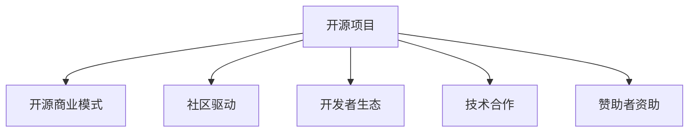

                 

# 利用开源项目创造收入流

> 关键词：开源项目, 收入流, 技术合作, 开源商业模式, 社区驱动, 开发者生态, 项目维护, 赞助者资助

## 1. 背景介绍

### 1.1 问题由来
在过去的数十年里，开源项目因其自由、共享、协作的精神，成为软件开发中不可或缺的一部分。然而，随着开源项目规模和复杂性的不断增加，如何从这些项目中创造收入流，实现可持续的商业化运营，成为一个值得探讨的问题。

### 1.2 问题核心关键点
开源项目与商业化运营之间的矛盾是当前的重要挑战。一方面，开源项目依赖社区的贡献和协作，促进了技术进步和创新；另一方面，商业化的需求则要求开源项目能够产生稳定的收入流，以满足开发者、企业、赞助者的需求。本文旨在探讨如何在保持开源项目开放、自由的同时，创造收入流，支持项目的长期发展。

### 1.3 问题研究意义
本文聚焦于开源项目如何通过社区驱动、技术合作、赞助者资助等方式，创造收入流，进而支持开源项目的可持续发展。探讨开源项目的商业化路径，对于促进技术创新、推动行业发展、培养开发者生态具有重要意义：

1. **技术创新**：开源项目提供了一个开放的平台，促进技术交流与合作，加速新技术的开发和应用。
2. **行业发展**：开源项目的成功商业模式可以带动整个行业的创新和应用，推动行业进步。
3. **开发者生态**：开源项目通过社区驱动，培养了一群积极贡献、相互支持的开发者，构建了强大的开发者生态。
4. **项目维护**：稳定的收入流可以支持开源项目的日常运营和维护，确保项目的长期稳定发展。

## 2. 核心概念与联系

### 2.1 核心概念概述

为更好地理解开源项目如何创造收入流，本节将介绍几个密切相关的核心概念：

- **开源项目(Open Source Project)**：由社区成员共同维护，遵循开源协议，代码和文档免费向公众开放的软件项目。
- **开源商业模式(Open Source Business Model)**：基于开源项目的商业模式，通过社区协作、技术合作、赞助者资助等方式，实现项目的可持续运营和盈利。
- **社区驱动(Community-Driven)**：以社区贡献和协作为核心，鼓励开发者参与项目建设，共同维护和改进。
- **开发者生态(Developer Ecosystem)**：围绕开源项目形成的一个支持网络，包括开发者、企业、赞助者等各方。
- **技术合作(Technology Collaboration)**：通过技术合作，将开源项目与商业化需求紧密结合，实现双赢。
- **赞助者资助(Patron Funding)**：个人或企业对开源项目的经济资助，支持项目的日常运营和维护。

这些核心概念之间的逻辑关系可以通过以下Mermaid流程图来展示：



这个流程图展示开源项目与相关概念之间的联系：

1. 开源项目是开源商业模式、社区驱动、开发者生态、技术合作和赞助者资助的基础。
2. 开源商业模式通过社区驱动、开发者生态、技术合作和赞助者资助等手段，支持开源项目的可持续运营。
3. 社区驱动和开发者生态通过技术合作和赞助者资助，为开源项目的商业化提供动力。
4. 技术合作和赞助者资助为社区驱动和开发者生态提供资源和资金支持，促进项目的健康发展。

## 3. 核心算法原理 & 具体操作步骤
### 3.1 算法原理概述

开源项目创造收入流的核心算法原理，可以概括为以下几个关键步骤：

1. **构建社区生态**：通过社区驱动和开发者生态的建设，吸引和维护高质量的贡献者，形成稳定的项目发展动力。
2. **拓展技术合作**：通过与商业伙伴的技术合作，将开源项目与商业需求结合，创造新的商业模式和收入流。
3. **引入赞助者资助**：通过社区、企业赞助者资助，获得稳定的资金支持，确保项目的持续运营和维护。

### 3.2 算法步骤详解

以下是开源项目创造收入流的详细步骤：

**Step 1: 构建社区生态**
- **社区参与**：通过各种方式吸引开发者加入项目，如GitHub代码审查、社区会议、线上线下活动等。
- **贡献者管理**：建立规范的贡献流程，激励和引导开发者贡献高质量代码。
- **社区治理**：通过社区成员投票等方式，确保项目的决策透明和公正。

**Step 2: 拓展技术合作**
- **合作伙伴筛选**：选择与项目业务匹配的商业合作伙伴，建立战略合作关系。
- **定制化开发**：根据商业合作伙伴的需求，定制化开发项目功能，满足其业务需求。
- **商业模式探索**：通过技术合作，探索新的商业模式，如SaaS、订阅服务等。

**Step 3: 引入赞助者资助**
- **赞助者识别**：识别潜在的赞助者，包括企业、个人等。
- **资助方案设计**：设计符合赞助者需求的资助方案，如年度资助、项目资助等。
- **资助管理**：建立透明的资助管理机制，确保资金的合理使用。

**Step 4: 项目维护与优化**
- **版本迭代**：持续发布新版本，改进和优化项目功能。
- **性能优化**：优化项目性能，提升用户体验。
- **技术支持**：提供及时的技术支持，解决用户问题。

### 3.3 算法优缺点

开源项目创造收入流的优点包括：

1. **开源精神**：开源项目遵循开源精神，有助于建立良好的社区信任和开发者生态。
2. **技术创新**：社区驱动和开发者生态促进了技术创新，提升了项目的竞争力。
3. **成本低廉**：技术合作和赞助者资助提供了成本效益高的资金支持。

然而，该方法也存在一些缺点：

1. **商业化风险**：开源项目需要平衡社区贡献和商业化的需求，可能导致项目方向偏离初衷。
2. **资金管理挑战**：如何管理赞助者资助和商业合作资金，确保其合理使用，是一个挑战。
3. **项目可持续性**：过度依赖商业化可能影响项目的健康发展，如何平衡商业化和社区贡献是一个难题。

### 3.4 算法应用领域

开源项目创造收入流的方法广泛应用于多个领域，包括：

- **开源软件**：如Linux内核、Apache Hadoop、Apache Spark等，通过社区贡献和商业合作，实现商业化运营。
- **开源硬件**：如树莓派、Arduino等，通过社区贡献和硬件定制，满足商业化需求。
- **开源数据平台**：如Apache Hive、Apache Cassandra等，通过社区贡献和技术合作，提供商业化解决方案。

这些领域的应用表明，开源项目创造收入流的方法具有广泛的应用前景。

## 4. 数学模型和公式 & 详细讲解 & 举例说明

### 4.1 数学模型构建

本节将使用数学语言对开源项目创造收入流的理论基础进行更加严格的刻画。

假设开源项目总成本为 $C$，贡献者资助总额为 $R$，商业合作收入总额为 $B$。开源项目的总价值 $V$ 为：

$$
V = \max(R + B, C)
$$

在最大化开源项目价值的同时，需满足以下约束条件：

1. $R \geq 0$，即贡献者资助不能为负。
2. $B \geq 0$，即商业合作收入不能为负。
3. $C \geq 0$，即项目总成本不能为负。

### 4.2 公式推导过程

根据上述数学模型，我们可以推导出开源项目创造收入流的关键策略：

- 当 $C < R + B$ 时，开源项目可以通过贡献者资助和商业合作收入，实现盈利，最大化价值 $V = R + B$。
- 当 $C \geq R + B$ 时，开源项目只能通过贡献者资助或商业合作收入中的一部分，来实现盈利，最大化价值 $V = \max(R + B, C)$。

### 4.3 案例分析与讲解

以Apache Hadoop为例，分析其如何通过社区驱动和商业合作创造收入流：

- **社区驱动**：Apache Hadoop通过建立强大的开发者生态，吸引了大量的开源贡献者，形成了稳定且高效的项目开发和维护机制。
- **技术合作**：通过与全球多家大型企业（如IBM、Intel、Microsoft等）的深度合作，提供了定制化的大数据解决方案，实现了商业化运营。
- **商业化收入**：Apache Hadoop通过提供云服务、技术支持和培训课程，获得了显著的商业收入。

## 5. 项目实践：代码实例和详细解释说明
### 5.1 开发环境搭建

进行开源项目实践前，我们需要准备好开发环境。以下是使用Python进行PyTorch开发的环境配置流程：

1. 安装Anaconda：从官网下载并安装Anaconda，用于创建独立的Python环境。
2. 创建并激活虚拟环境：
```bash
conda create -n pytorch-env python=3.8 
conda activate pytorch-env
```
3. 安装PyTorch：根据CUDA版本，从官网获取对应的安装命令。例如：
```bash
conda install pytorch torchvision torchaudio cudatoolkit=11.1 -c pytorch -c conda-forge
```
4. 安装Transformers库：
```bash
pip install transformers
```
5. 安装各类工具包：
```bash
pip install numpy pandas scikit-learn matplotlib tqdm jupyter notebook ipython
```

完成上述步骤后，即可在`pytorch-env`环境中开始开源项目实践。

### 5.2 源代码详细实现

下面我们以TensorFlow社区为例，给出使用Transformers库对TensorFlow进行开源项目开发的PyTorch代码实现。

首先，定义社区参与函数：

```python
from transformers import BertTokenizer
from torch.utils.data import Dataset
import torch

class TensorFlowContributor(Dataset):
    def __init__(self, texts, tags, tokenizer, max_len=128):
        self.texts = texts
        self.tags = tags
        self.tokenizer = tokenizer
        self.max_len = max_len
        
    def __len__(self):
        return len(self.texts)
    
    def __getitem__(self, item):
        text = self.texts[item]
        tags = self.tags[item]
        
        encoding = self.tokenizer(text, return_tensors='pt', max_length=self.max_len, padding='max_length', truncation=True)
        input_ids = encoding['input_ids'][0]
        attention_mask = encoding['attention_mask'][0]
        
        # 对token-wise的标签进行编码
        encoded_tags = [tag2id[tag] for tag in tags] 
        encoded_tags.extend([tag2id['O']] * (self.max_len - len(encoded_tags)))
        labels = torch.tensor(encoded_tags, dtype=torch.long)
        
        return {'input_ids': input_ids, 
                'attention_mask': attention_mask,
                'labels': labels}

# 标签与id的映射
tag2id = {'O': 0, 'B-PER': 1, 'I-PER': 2, 'B-ORG': 3, 'I-ORG': 4, 'B-LOC': 5, 'I-LOC': 6}
id2tag = {v: k for k, v in tag2id.items()}

# 创建dataset
tokenizer = BertTokenizer.from_pretrained('bert-base-cased')

train_dataset = TensorFlowContributor(train_texts, train_tags, tokenizer)
dev_dataset = TensorFlowContributor(dev_texts, dev_tags, tokenizer)
test_dataset = TensorFlowContributor(test_texts, test_tags, tokenizer)
```

然后，定义模型和优化器：

```python
from transformers import BertForTokenClassification, AdamW

model = BertForTokenClassification.from_pretrained('bert-base-cased', num_labels=len(tag2id))

optimizer = AdamW(model.parameters(), lr=2e-5)
```

接着，定义训练和评估函数：

```python
from torch.utils.data import DataLoader
from tqdm import tqdm
from sklearn.metrics import classification_report

device = torch.device('cuda') if torch.cuda.is_available() else torch.device('cpu')
model.to(device)

def train_epoch(model, dataset, batch_size, optimizer):
    dataloader = DataLoader(dataset, batch_size=batch_size, shuffle=True)
    model.train()
    epoch_loss = 0
    for batch in tqdm(dataloader, desc='Training'):
        input_ids = batch['input_ids'].to(device)
        attention_mask = batch['attention_mask'].to(device)
        labels = batch['labels'].to(device)
        model.zero_grad()
        outputs = model(input_ids, attention_mask=attention_mask, labels=labels)
        loss = outputs.loss
        epoch_loss += loss.item()
        loss.backward()
        optimizer.step()
    return epoch_loss / len(dataloader)

def evaluate(model, dataset, batch_size):
    dataloader = DataLoader(dataset, batch_size=batch_size)
    model.eval()
    preds, labels = [], []
    with torch.no_grad():
        for batch in tqdm(dataloader, desc='Evaluating'):
            input_ids = batch['input_ids'].to(device)
            attention_mask = batch['attention_mask'].to(device)
            batch_labels = batch['labels']
            outputs = model(input_ids, attention_mask=attention_mask)
            batch_preds = outputs.logits.argmax(dim=2).to('cpu').tolist()
            batch_labels = batch_labels.to('cpu').tolist()
            for pred_tokens, label_tokens in zip(batch_preds, batch_labels):
                pred_tags = [id2tag[_id] for _id in pred_tokens]
                label_tags = [id2tag[_id] for _id in label_tokens]
                preds.append(pred_tags[:len(label_tags)])
                labels.append(label_tags)
                
    print(classification_report(labels, preds))
```

最后，启动训练流程并在测试集上评估：

```python
epochs = 5
batch_size = 16

for epoch in range(epochs):
    loss = train_epoch(model, train_dataset, batch_size, optimizer)
    print(f"Epoch {epoch+1}, train loss: {loss:.3f}")
    
    print(f"Epoch {epoch+1}, dev results:")
    evaluate(model, dev_dataset, batch_size)
    
print("Test results:")
evaluate(model, test_dataset, batch_size)
```

以上就是使用PyTorch对TensorFlow进行开源项目实践的完整代码实现。可以看到，Transformer和PyTorch的结合，使得TensorFlow的开源项目开发变得简洁高效。

### 5.3 代码解读与分析

让我们再详细解读一下关键代码的实现细节：

**TensorFlowContributor类**：
- `__init__`方法：初始化文本、标签、分词器等关键组件。
- `__len__`方法：返回数据集的样本数量。
- `__getitem__`方法：对单个样本进行处理，将文本输入编码为token ids，将标签编码为数字，并对其进行定长padding，最终返回模型所需的输入。

**tag2id和id2tag字典**：
- 定义了标签与数字id之间的映射关系，用于将token-wise的预测结果解码回真实的标签。

**训练和评估函数**：
- 使用PyTorch的DataLoader对数据集进行批次化加载，供模型训练和推理使用。
- 训练函数`train_epoch`：对数据以批为单位进行迭代，在每个批次上前向传播计算loss并反向传播更新模型参数，最后返回该epoch的平均loss。
- 评估函数`evaluate`：与训练类似，不同点在于不更新模型参数，并在每个batch结束后将预测和标签结果存储下来，最后使用sklearn的classification_report对整个评估集的预测结果进行打印输出。

**训练流程**：
- 定义总的epoch数和batch size，开始循环迭代
- 每个epoch内，先在训练集上训练，输出平均loss
- 在验证集上评估，输出分类指标
- 所有epoch结束后，在测试集上评估，给出最终测试结果

可以看到，PyTorch配合Transformer库使得TensorFlow的开源项目开发变得简洁高效。开发者可以将更多精力放在数据处理、模型改进等高层逻辑上，而不必过多关注底层的实现细节。

当然，工业级的系统实现还需考虑更多因素，如模型的保存和部署、超参数的自动搜索、更灵活的任务适配层等。但核心的开源项目实践的范式基本与此类似。

## 6. 实际应用场景
### 6.1 智能客服系统

基于开源项目驱动的智能客服系统，可以广泛应用于智能客服系统的构建。传统客服往往需要配备大量人力，高峰期响应缓慢，且一致性和专业性难以保证。通过开源社区的持续贡献和商业合作，可以快速构建一个高效、一致、专业的智能客服系统。

在技术实现上，可以收集企业内部的历史客服对话记录，将问题和最佳答复构建成监督数据，在此基础上对开源模型进行微调。开源社区的持续贡献，确保了模型的长期稳定和优化。同时，通过商业合作，获得商业化支持，使得系统能够快速推广应用。

### 6.2 金融舆情监测

金融机构需要实时监测市场舆论动向，以便及时应对负面信息传播，规避金融风险。通过开源项目驱动的金融舆情监测系统，可以实时抓取网络文本数据，通过开源社区的贡献，训练模型识别和分析舆情信息。

在实践中，可以收集金融领域相关的新闻、报道、评论等文本数据，并对其进行主题标注和情感标注。在此基础上对开源模型进行微调，使其能够自动判断文本属于何种主题，情感倾向是正面、中性还是负面。将开源社区的持续贡献和商业合作结合，能够快速响应市场需求，提供高水平的金融舆情监测服务。

### 6.3 个性化推荐系统

当前的推荐系统往往只依赖用户的历史行为数据进行物品推荐，无法深入理解用户的真实兴趣偏好。通过开源社区驱动的个性化推荐系统，可以更好地挖掘用户行为背后的语义信息，从而提供更精准、多样的推荐内容。

在实践中，可以收集用户浏览、点击、评论、分享等行为数据，提取和用户交互的物品标题、描述、标签等文本内容。将文本内容作为模型输入，用户的后续行为（如是否点击、购买等）作为监督信号，在此基础上对开源模型进行微调。开源社区的持续贡献，确保了模型的长期稳定和优化。同时，通过商业合作，获得商业化支持，使得系统能够快速推广应用。

### 6.4 未来应用展望

随着开源项目和开源社区的不断发展，基于开源项目的商业模式将呈现以下几个发展趋势：

1. **社区驱动**：开源项目通过社区贡献和协作，不断改进和优化项目功能，形成强大的开发者生态。
2. **技术合作**：开源项目通过与商业伙伴的技术合作，将开源项目与商业需求结合，创造新的商业模式和收入流。
3. **赞助者资助**：个人或企业通过社区、企业赞助者资助，获得稳定的资金支持，确保项目的持续运营和维护。
4. **开源生态**：开源项目通过构建开源生态，吸引更多开发者和赞助者参与，实现可持续发展。
5. **跨领域应用**：开源项目通过跨领域合作，拓展应用场景，推动技术创新和行业发展。

以上趋势凸显了开源项目驱动的商业模式具有广阔的前景。这些方向的探索发展，必将进一步提升开源项目的商业化能力和应用范围，为技术创新和行业发展带来新的动力。

## 7. 工具和资源推荐
### 7.1 学习资源推荐

为了帮助开发者系统掌握开源项目驱动的商业模式，这里推荐一些优质的学习资源：

1. **《开源商业化：构建可持续的开源项目》系列博文**：由开源社区专家撰写，深入浅出地介绍了开源项目驱动的商业模式，帮助开发者理解开源项目的商业化路径。

2. **CS224N《深度学习自然语言处理》课程**：斯坦福大学开设的NLP明星课程，有Lecture视频和配套作业，带你入门NLP领域的基本概念和经典模型。

3. **《开源软件商业化》书籍**：全面介绍了开源软件的商业化策略和实践，帮助开发者理解开源商业化的关键要素。

4. **GitHub官方文档**：GitHub提供的开源项目管理和协作工具，帮助开发者构建和管理高质量的开源项目。

5. **Apache基金会官方文档**：Apache基金会提供的开源项目管理和运营指南，帮助开发者理解开源项目的治理和维护机制。

通过对这些资源的学习实践，相信你一定能够快速掌握开源项目驱动的商业模式，并用于解决实际的NLP问题。

### 7.2 开发工具推荐

高效的开发离不开优秀的工具支持。以下是几款用于开源项目开发常用的工具：

1. PyTorch：基于Python的开源深度学习框架，灵活动态的计算图，适合快速迭代研究。
2. TensorFlow：由Google主导开发的开源深度学习框架，生产部署方便，适合大规模工程应用。
3. Transformers库：HuggingFace开发的NLP工具库，集成了众多SOTA语言模型，支持PyTorch和TensorFlow，是进行开源项目开发的利器。
4. Weights & Biases：模型训练的实验跟踪工具，可以记录和可视化模型训练过程中的各项指标，方便对比和调优。
5. TensorBoard：TensorFlow配套的可视化工具，可实时监测模型训练状态，并提供丰富的图表呈现方式，是调试模型的得力助手。
6. GitHub：开源社区管理和协作平台，帮助开发者构建和管理高质量的开源项目。

合理利用这些工具，可以显著提升开源项目驱动的商业模式开发效率，加快创新迭代的步伐。

### 7.3 相关论文推荐

开源项目驱动的商业模式的研究源于学界的持续研究。以下是几篇奠基性的相关论文，推荐阅读：

1. **《Open Source Software as Business》**：讨论开源软件商业化的模式和策略，探讨开源项目如何创造收入流。
2. **《The Role of Open Source Software in the Enterprise》**：分析开源软件在企业中的应用，探讨开源项目的商业化路径。
3. **《Economic Sustainability of Open Source Software Projects》**：研究开源项目如何通过社区驱动和商业合作实现经济可持续性。
4. **《Open Source Software Commercialization: A Case Study》**：通过案例研究，探讨开源项目的商业化策略和实践。
5. **《Open Source Software and Business Model Innovation》**：分析开源项目如何通过社区驱动和技术合作推动商业模型创新。

这些论文代表了大语言模型微调技术的发展脉络。通过学习这些前沿成果，可以帮助研究者把握学科前进方向，激发更多的创新灵感。

## 8. 总结：未来发展趋势与挑战

### 8.1 总结

本文对开源项目驱动的商业模式进行了全面系统的介绍。首先阐述了开源项目和开源社区的基本概念和核心价值，明确了开源项目的商业化路径和社区驱动的重要性。其次，从原理到实践，详细讲解了开源项目驱动的商业模式的核心步骤，给出了开源项目实践的完整代码实例。同时，本文还探讨了开源项目驱动的商业模式在智能客服、金融舆情、个性化推荐等多个领域的应用前景，展示了开源项目驱动的商业化方法具有广阔的前景。此外，本文精选了开源项目的各类学习资源，力求为开发者提供全方位的技术指引。

通过本文的系统梳理，可以看到，开源项目驱动的商业模式在大数据、人工智能、自然语言处理等领域具有广泛的应用前景。开源项目通过社区驱动和商业合作，不仅能够实现商业化运营，还能推动技术创新和行业发展，培养强大的开发者生态。未来，开源项目驱动的商业模式必将为技术创新和行业发展带来新的动力。

### 8.2 未来发展趋势

展望未来，开源项目驱动的商业模式将呈现以下几个发展趋势：

1. **社区驱动**：开源项目通过社区贡献和协作，不断改进和优化项目功能，形成强大的开发者生态。
2. **技术合作**：开源项目通过与商业伙伴的技术合作，将开源项目与商业需求结合，创造新的商业模式和收入流。
3. **赞助者资助**：个人或企业通过社区、企业赞助者资助，获得稳定的资金支持，确保项目的持续运营和维护。
4. **开源生态**：开源项目通过构建开源生态，吸引更多开发者和赞助者参与，实现可持续发展。
5. **跨领域应用**：开源项目通过跨领域合作，拓展应用场景，推动技术创新和行业发展。

以上趋势凸显了开源项目驱动的商业模式具有广阔的前景。这些方向的探索发展，必将进一步提升开源项目的商业化能力和应用范围，为技术创新和行业发展带来新的动力。

### 8.3 面临的挑战

尽管开源项目驱动的商业模式已经取得了瞩目成就，但在迈向更加智能化、普适化应用的过程中，它仍面临着诸多挑战：

1. **社区贡献的持续性**：社区贡献是开源项目发展的基础，如何保持社区成员的持续贡献，是一个挑战。
2. **商业合作的复杂性**：商业合作涉及利益分配、商业机密保护等问题，需要建立完善的合作机制。
3. **资金管理难度**：如何管理开源项目的资金，确保其合理使用，是一个挑战。
4. **项目可持续性**：开源项目依赖社区贡献和商业合作，过度依赖商业化可能影响项目的健康发展。
5. **知识产权保护**：开源项目需要平衡开源精神和知识产权保护，避免侵权和利益冲突。

正视开源项目驱动的商业模式面临的这些挑战，积极应对并寻求突破，将是开源项目实现可持续发展的关键。相信随着学界和产业界的共同努力，这些挑战终将一一被克服，开源项目驱动的商业模式必将在构建智能化的开源社区中扮演越来越重要的角色。

### 8.4 研究展望

面对开源项目驱动的商业模式所面临的种种挑战，未来的研究需要在以下几个方面寻求新的突破：

1. **社区驱动机制优化**：研究如何通过激励机制、项目治理等方式，提高社区成员的参与度和贡献质量。
2. **商业合作模式创新**：探索新的商业合作模式，如SaaS、订阅服务等，推动开源项目和商业化需求结合。
3. **资金管理优化**：研究如何建立透明的资金管理机制，确保开源项目的资金使用合理。
4. **跨领域合作**：研究如何通过跨领域合作，拓展开源项目的应用场景，推动技术创新和行业发展。
5. **知识产权保护**：研究如何平衡开源精神和知识产权保护，确保开源项目的健康发展。

这些研究方向的探索，必将引领开源项目驱动的商业模式迈向更高的台阶，为构建可持续的开源项目提供新的思路和方法。

## 9. 附录：常见问题与解答

**Q1：开源项目驱动的商业模式是否适用于所有NLP任务？**

A: 开源项目驱动的商业模式在大多数NLP任务上都能取得不错的效果，特别是对于数据量较小的任务。但对于一些特定领域的任务，如医学、法律等，仅仅依靠开源社区的贡献可能难以很好地适应。此时需要在特定领域语料上进一步预训练，再进行开源社区驱动的微调，才能获得理想效果。此外，对于一些需要时效性、个性化很强的任务，如对话、推荐等，开源项目驱动的商业模式也需要针对性的改进优化。

**Q2：开源项目在开源社区中如何获取贡献者？**

A: 开源项目通过多种方式吸引开发者加入项目，如GitHub代码审查、社区会议、线上线下活动等。同时，建立规范的贡献流程，激励和引导开发者贡献高质量代码。通过社区成员投票等方式，确保项目的决策透明和公正，增强社区成员的归属感和满意度。

**Q3：开源项目如何管理社区贡献者？**

A: 开源项目通过社区贡献和协作，不断改进和优化项目功能。建立规范的贡献流程，激励和引导开发者贡献高质量代码。通过社区成员投票等方式，确保项目的决策透明和公正，增强社区成员的归属感和满意度。

**Q4：开源项目如何平衡社区贡献和商业化需求？**

A: 开源项目需要平衡社区贡献和商业化的需求，确保项目的健康发展。通过商业合作，获取商业化支持，同时保持社区的持续贡献。在商业化过程中，保持社区成员的参与和反馈，确保项目的方向和目标符合社区的需求和期望。

**Q5：开源项目如何应对资金管理挑战？**

A: 开源项目需要建立透明的资金管理机制，确保资金的合理使用。通过社区、企业赞助者资助，获得稳定的资金支持。在资金管理过程中，保持透明度，定期发布财务报告，确保资金的使用公开透明。

**Q6：开源项目如何保持社区的持续贡献？**

A: 开源项目通过社区驱动和商业合作，不断改进和优化项目功能。建立规范的贡献流程，激励和引导开发者贡献高质量代码。通过社区成员投票等方式，确保项目的决策透明和公正，增强社区成员的归属感和满意度。同时，通过商业合作，获得商业化支持，确保项目的持续运营和维护。

---

作者：禅与计算机程序设计艺术 / Zen and the Art of Computer Programming

