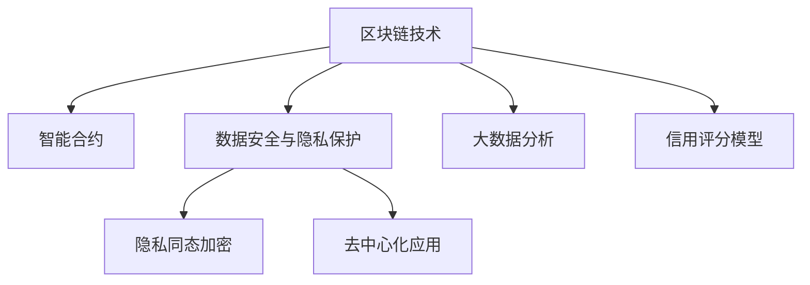

                 

# 利用技术优势进行P2P借贷

> 关键词：
  P2P借贷, 区块链技术, 智能合约, 数据安全, 风险控制, 隐私保护, 隐私计算, 大数据分析, 信用评估, 隐私同态加密, 去中心化应用, 自动化流程

## 1. 背景介绍

### 1.1 问题由来

随着互联网和金融技术的深度融合，P2P借贷行业迅猛发展，为中小企业和个人提供了便捷、高效的融资渠道。但传统的P2P借贷平台在操作透明度、资金安全、风险控制等方面仍存在诸多问题，亟需通过技术手段进行改进和优化。

技术创新，尤其是区块链、智能合约、大数据分析等前沿技术的引入，为P2P借贷行业提供了全新的发展机遇。通过这些技术，可以实现P2P借贷流程的自动化、透明化、去中心化，大幅提升操作效率、安全性和用户体验。

### 1.2 问题核心关键点

P2P借贷平台的技术优势主要体现在以下几个方面：

- **区块链技术**：提供不可篡改、透明公开的账本，确保交易记录的可信度和安全性。
- **智能合约**：实现借贷双方自动化的协议执行，减少中介环节，降低交易成本。
- **数据安全与隐私保护**：通过数据加密、隐私计算等技术，保障用户数据安全，避免信息泄露。
- **风险控制与信用评估**：利用大数据分析、信用评分模型，精准评估借款人和贷款人信用，降低违约风险。
- **去中心化应用**：去除中心化机构的中间环节，提升操作效率，降低运营成本。

### 1.3 问题研究意义

利用技术优势进行P2P借贷，对于提升金融普惠、促进经济发展、降低融资成本具有重要意义：

- **提升金融普惠**：通过去中心化、自动化操作，降低传统金融机构的门槛，让更多中小企业和个人受益。
- **促进经济发展**：利用大数据和信用评分模型，优化资源配置，支持中小企业成长，促进经济活力。
- **降低融资成本**：去除中间环节，减少中介费用，缩短融资周期，降低贷款利率，提高资金使用效率。
- **保障交易安全**：通过区块链和智能合约技术，实现透明公开的记录和自动执行，确保资金安全。
- **增强隐私保护**：通过数据加密和隐私计算，确保用户数据隐私，避免信息滥用。

## 2. 核心概念与联系

### 2.1 核心概念概述

为更好地理解P2P借贷技术优势，本节将介绍几个关键技术概念及其相互关系：

- **区块链技术**：一种分布式账本技术，通过去中心化节点共同维护账本，确保数据的不可篡改性和透明公开性。
- **智能合约**：一种基于区块链技术的自动化合约，通过代码实现合约条款的自动执行，无需中介即可达成交易。
- **数据安全与隐私保护**：通过数据加密、隐私计算等技术，确保数据在存储、传输、处理过程中的安全性。
- **大数据分析**：利用大数据技术进行数据挖掘、模式识别、信用评估等，为P2P借贷提供决策依据。
- **信用评分模型**：基于借款人和贷款人的历史行为数据，通过机器学习算法构建评分模型，评估其信用风险。
- **隐私同态加密**：一种特殊的加密技术，允许在加密数据上进行计算，无需解密即可得到计算结果，保障数据隐私。
- **去中心化应用**：一种分布式应用，通过区块链等技术实现去中心化操作，提升系统的透明度和安全性。

这些核心概念之间通过以下Mermaid流程图展示其联系：



## 3. 核心算法原理 & 具体操作步骤

### 3.1 算法原理概述

利用技术优势进行P2P借贷，本质上是通过区块链、智能合约、大数据分析等技术手段，构建一个去中心化、自动化、高透明的借贷平台。其核心思想是：利用技术手段实现借贷流程的透明化、自动化，确保交易安全，降低运营成本，提升用户体验。

P2P借贷平台的技术优势主要体现在以下几个方面：

1. **区块链账本**：通过分布式账本技术，确保借贷交易记录的不可篡改性和透明公开性，避免中介机构的信息篡改和欺诈行为。
2. **智能合约**：实现借贷双方自动化的协议执行，去除中介环节，降低交易成本，提高操作效率。
3. **数据安全与隐私保护**：通过数据加密、隐私计算等技术，保障用户数据安全，避免信息泄露和滥用。
4. **大数据分析**：利用大数据技术进行数据挖掘、模式识别、信用评估等，为借贷决策提供科学依据，降低违约风险。
5. **信用评分模型**：基于借款人和贷款人的历史行为数据，通过机器学习算法构建评分模型，评估其信用风险，为借贷决策提供参考。
6. **隐私同态加密**：在加密数据上进行计算，确保数据隐私的同时，保障计算结果的正确性。
7. **去中心化应用**：通过区块链等技术实现去中心化操作，提升系统的透明度和安全性，减少中介环节，降低运营成本。

### 3.2 算法步骤详解

P2P借贷平台利用技术优势的实施步骤主要包括：

**Step 1: 设计系统架构**

- **区块链账本**：设计分布式账本结构，确保账本数据的不可篡改性和透明公开性。
- **智能合约**：设计智能合约，实现借贷协议的自动执行，无需中介即可达成交易。
- **数据安全与隐私保护**：设计数据加密和隐私计算策略，确保用户数据的安全性。
- **大数据分析**：设计数据采集和处理流程，利用大数据技术进行数据分析和信用评估。
- **信用评分模型**：设计信用评分算法，基于历史数据构建评分模型，评估借款人信用。
- **隐私同态加密**：设计隐私计算策略，确保在加密数据上进行计算，保障数据隐私。
- **去中心化应用**：设计去中心化应用架构，通过区块链等技术实现去中心化操作。

**Step 2: 实现技术细节**

- **区块链账本**：选择合适的区块链技术（如以太坊、Hyperledger等），实现分布式账本的部署和维护。
- **智能合约**：使用Solidity、JavaScript等语言编写智能合约代码，实现借贷协议的自动执行。
- **数据安全与隐私保护**：实现数据加密、脱敏、去标识化等策略，确保用户数据的安全性。
- **大数据分析**：搭建大数据分析平台，利用Hadoop、Spark等技术进行数据处理和分析。
- **信用评分模型**：利用机器学习算法（如逻辑回归、随机森林、神经网络等）构建信用评分模型。
- **隐私同态加密**：实现隐私同态加密算法，确保在加密数据上进行计算，保障数据隐私。
- **去中心化应用**：开发去中心化应用，通过区块链等技术实现去中心化操作。

**Step 3: 测试与部署**

- **区块链账本**：进行账本性能测试，确保其可扩展性和容错性。
- **智能合约**：进行合约测试，确保其正确性和安全性。
- **数据安全与隐私保护**：进行数据安全测试，确保数据加密和隐私保护策略的有效性。
- **大数据分析**：进行数据分析测试，确保数据的准确性和模型性能。
- **信用评分模型**：进行信用评分测试，确保模型的准确性和可靠性。
- **隐私同态加密**：进行隐私计算测试，确保加密计算的正确性和隐私保护。
- **去中心化应用**：进行应用测试，确保系统的稳定性和安全性。

**Step 4: 系统维护与优化**

- **区块链账本**：定期进行账本维护和升级，提升账本性能和安全性。
- **智能合约**：定期进行合约审计和优化，确保合约的正确性和安全性。
- **数据安全与隐私保护**：定期进行数据安全检查和漏洞修补，确保用户数据的安全性。
- **大数据分析**：定期进行数据采集和分析，优化数据分析流程和信用评分模型。
- **信用评分模型**：定期进行模型训练和评估，确保模型的准确性和可靠性。
- **隐私同态加密**：定期进行加密计算测试和优化，提升隐私计算性能。
- **去中心化应用**：定期进行应用维护和升级，提升系统的稳定性和用户体验。

### 3.3 算法优缺点

利用技术优势进行P2P借贷，具有以下优点：

1. **操作透明化**：区块链账本确保了借贷交易的透明公开，避免中介机构的欺诈和信息篡改。
2. **流程自动化**：智能合约实现借贷协议的自动执行，减少中介环节，降低交易成本。
3. **数据安全性**：数据加密和隐私计算保障用户数据安全，避免信息泄露和滥用。
4. **信用评估精准**：大数据分析和信用评分模型，精准评估借款人信用，降低违约风险。
5. **系统去中心化**：去中心化应用提升了系统的透明度和安全性，减少中介环节，降低运营成本。

同时，该方法也存在一定的局限性：

1. **技术复杂度**：利用区块链、智能合约等技术，系统设计和实现较为复杂，需要专业的技术团队支持。
2. **性能瓶颈**：大规模分布式账本和智能合约的运行，可能面临性能瓶颈，需要优化和升级。
3. **法律合规性**：去中心化操作可能面临法律合规性问题，需要确保合规性。
4. **用户教育**：用户对新技术的理解和接受需要时间，需要通过教育提升用户信任。
5. **成本投入**：技术架构的设计和实现，需要一定的资金和资源投入，初期成本较高。

尽管存在这些局限性，但就目前而言，利用技术优势进行P2P借贷，仍然是提升金融普惠、促进经济发展、降低融资成本的重要方向。未来相关研究的重点在于如何进一步降低技术复杂度，提高系统性能，确保法律合规性，提升用户体验，以加速P2P借贷技术的产业化进程。

### 3.4 算法应用领域

利用技术优势进行P2P借贷，已经在多个领域得到广泛应用，例如：

- **个人贷款**：通过区块链和智能合约技术，实现个人间的直接借贷，降低中介费用，提高操作效率。
- **小微企业融资**：利用大数据分析和信用评分模型，为小微企业提供精准的贷款审批服务，降低融资门槛。
- **供应链融资**：通过区块链和智能合约技术，实现供应链上下游企业的透明协作，提高资金使用效率。
- **农业融资**：利用大数据分析，评估农业生产风险，为农业企业提供精准的融资服务。
- **绿色金融**：通过区块链技术，记录绿色项目的资金流向，保障资金用于指定环保项目。

除了上述这些经典应用外，P2P借贷技术还被创新性地应用到更多场景中，如车贷、租房、消费金融等，为金融行业带来了新的突破。随着技术的不断进步，P2P借贷技术必将在更广阔的应用领域大放异彩。

## 4. 数学模型和公式 & 详细讲解  
### 4.1 数学模型构建

本节将使用数学语言对P2P借贷技术优势进行更加严格的刻画。

记借贷系统为 $S$，其中包含借贷双方 $A$ 和 $B$，贷款金额为 $L$，利息率为 $r$，贷款期限为 $t$。设 $C$ 为借款人信用评分，$R$ 为贷款人风险评估。定义借贷平台的数据集为 $D=\{(x_i, y_i)\}_{i=1}^N, x_i \in \mathcal{X}, y_i \in \mathcal{Y}$，其中 $\mathcal{X}$ 为借贷记录，$\mathcal{Y}$ 为借贷结果（成功或失败）。

定义借贷平台的损失函数为 $\mathcal{L}(S,D) = \frac{1}{N} \sum_{i=1}^N [y_i\log \hat{y}_i+(1-y_i)\log(1-\hat{y}_i)]$，其中 $\hat{y}_i$ 为模型对借贷结果的预测概率。

利用智能合约进行借贷操作，通过区块链账本记录交易信息，保障借贷过程的透明性和不可篡改性。

### 4.2 公式推导过程

以下我们以个人贷款为例，推导智能合约和区块链账本的设计公式。

假设借款人 $A$ 和贷款人 $B$ 达成贷款协议，协议规定：
- 贷款金额为 $L$。
- 利息率为 $r$。
- 贷款期限为 $t$。
- 还款方式为等额本息还款。

智能合约代码如下：

```solidity
// 定义贷款协议
pragma solidity ^0.8.0;

contract LoanAgreement {
    address public payer;
    address public receiver;
    uint256 public amount;
    uint256 public rate;
    uint256 public duration;
    
    event Payment(uint256 indexed index, uint256 amount);

    constructor(uint256 _amount, uint256 _rate, uint256 _duration) {
        amount = _amount;
        rate = _rate;
        duration = _duration;
        payer = msg.sender;
        receiver = msg.sender;
    }

    function acceptLoan(address _receiver) public {
        require(msg.sender != _receiver, "Loan is not your own");
        receiver = _receiver;
        emit Payment(0, amount);
    }

    function repay(uint256 _index) public {
        require(_index >= 0, "Index must be positive");
        uint256 remainingAmount = amount - _index * (amount * rate * duration / 100 / duration);
        require(remainingAmount >= 0, "You have paid off the loan");
        emit Payment(_index + 1, remainingAmount);
    }
}
```

通过区块链账本，记录借贷交易信息，确保交易记录的透明公开和不可篡改性。

### 4.3 案例分析与讲解

以个人贷款为例，分析区块链账本和智能合约的设计过程。

**区块链账本设计**：
- 设计分布式账本结构，确保账本数据的不可篡改性和透明公开性。
- 使用以太坊智能合约技术，实现账本数据的记录和验证。

**智能合约设计**：
- 定义贷款协议的条款，包括贷款金额、利率、期限等。
- 实现自动执行的智能合约，通过区块链账本记录交易信息，保障借贷过程的透明性和不可篡改性。

## 5. 项目实践：代码实例和详细解释说明
### 5.1 开发环境搭建

在进行P2P借贷技术实践前，我们需要准备好开发环境。以下是使用Python进行Ethereum开发的环境配置流程：

1. 安装Anaconda：从官网下载并安装Anaconda，用于创建独立的Python环境。

2. 创建并激活虚拟环境：
```bash
conda create -n ethpy-env python=3.8 
conda activate ethpy-env
```

3. 安装PyEthereum：
```bash
pip install pyethereum
```

4. 安装Web3.py：
```bash
pip install web3
```

5. 安装Solidity编译器：
```bash
npm install -g solc
```

完成上述步骤后，即可在`ethpy-env`环境中开始Ethereum开发。

### 5.2 源代码详细实现

下面我们以个人贷款为例，给出使用Solidity和Ethereum进行智能合约开发的代码实现。

**智能合约代码**：

```solidity
// 定义贷款协议
pragma solidity ^0.8.0;

contract LoanAgreement {
    address public payer;
    address public receiver;
    uint256 public amount;
    uint256 public rate;
    uint256 public duration;
    
    event Payment(uint256 indexed index, uint256 amount);

    constructor(uint256 _amount, uint256 _rate, uint256 _duration) {
        amount = _amount;
        rate = _rate;
        duration = _duration;
        payer = msg.sender;
        receiver = msg.sender;
    }

    function acceptLoan(address _receiver) public {
        require(msg.sender != _receiver, "Loan is not your own");
        receiver = _receiver;
        emit Payment(0, amount);
    }

    function repay(uint256 _index) public {
        require(_index >= 0, "Index must be positive");
        uint256 remainingAmount = amount - _index * (amount * rate * duration / 100 / duration);
        require(remainingAmount >= 0, "You have paid off the loan");
        emit Payment(_index + 1, remainingAmount);
    }
}
```

**Web3.py代码**：

```python
from web3 import Web3

# 连接Ethereum节点
w3 = Web3(Web3.HTTPProvider('https://mainnet.infura.io/v3/YOUR_INFURA_API_KEY'))

# 创建智能合约实例
contract_abi = [
    {'constant': False, 'inputs': [{'name': 'index', 'type': 'uint256'}], 'name': 'repay', 'outputs': [], 'payable': False, 'stateMutability': 'nonpayable', 'type': 'function'},
    {'constant': True, 'inputs': [], 'name': 'payer', 'outputs': [{'name': '', 'type': 'address'}], 'payable': False, 'stateMutability': 'view', 'type': 'function'},
    {'constant': True, 'inputs': [], 'name': 'rate', 'outputs': [{'name': '', 'type': 'uint256'}], 'payable': False, 'stateMutability': 'view', 'type': 'function'},
    {'constant': True, 'inputs': [], 'name': 'duration', 'outputs': [{'name': '', 'type': 'uint256'}], 'payable': False, 'stateMutability': 'view', 'type': 'function'},
    {'constant': True, 'inputs': [{'name': 'index', 'type': 'uint256'}], 'name': 'Payment', 'outputs': [], 'payable': False, 'stateMutability': 'log', 'type': 'event'},
    {'constant': True, 'inputs': [], 'name': 'receiver', 'outputs': [{'name': '', 'type': 'address'}], 'payable': False, 'stateMutability': 'view', 'type': 'function'},
    {'constant': True, 'inputs': [{'name': 'index', 'type': 'uint256'}, {'name': 'amount', 'type': 'uint256'}], 'name': 'acceptLoan', 'outputs': [], 'payable': False, 'stateMutability': 'nonpayable', 'type': 'function'}
]

contract_address = '0x{YOUR_CONTRACT_ADDRESS}'

contract = w3.eth.contract(address=contract_address, abi=contract_abi)

# 部署智能合约
# ...
```

**代码解读与分析**

**智能合约代码**：
- 定义了贷款协议的条款，包括贷款金额、利率、期限等。
- 实现了自动执行的智能合约，通过区块链账本记录交易信息，保障借贷过程的透明性和不可篡改性。
- 通过`acceptLoan`函数，借款人可以接受贷款，`repay`函数，贷款人可以还款。

**Web3.py代码**：
- 连接Ethereum节点，创建智能合约实例。
- 通过`abi`和`contract_address`定义智能合约接口，进行合约操作。
- 通过`w3.eth.contract`方法，创建合约对象，可以进行合约部署、调用等操作。

## 6. 实际应用场景
### 6.1 智能合约审计

智能合约在P2P借贷中的应用，需要经过严格的审计，确保其正确性和安全性。审计过程中，需要考虑以下几个方面：

- **代码审计**：对智能合约代码进行详细审查，确保没有漏洞和安全隐患。
- **安全测试**：通过模拟攻击，测试智能合约的鲁棒性和安全性。
- **性能测试**：评估智能合约的运行性能，确保其可扩展性和容错性。

**智能合约审计工具**：
- MyEtherWallet（MEW）：提供智能合约安全扫描和审查服务。
- OpenZeppelin：提供智能合约的安全库和模板，帮助开发者进行安全审计。
- ConsenSys：提供智能合约审计和安全咨询服务。

### 6.2 区块链账本审计

区块链账本在P2P借贷中的应用，需要确保其透明公开性和不可篡改性。审计过程中，需要考虑以下几个方面：

- **账本结构审计**：对账本结构进行审查，确保其正确性和完备性。
- **交易记录审计**：对交易记录进行审查，确保其透明公开性和不可篡改性。
- **系统安全审计**：对系统安全进行审查，确保其抗攻击性和容错性。

**区块链账本审计工具**：
- ChainSafe：提供区块链账本和网络的安全审计和审查服务。
- Gnosis Safe：提供智能合约和去中心化应用的安全审计和审查服务。
- Quantstamp：提供区块链安全和合规性审查服务。

### 6.3 去中心化应用审计

去中心化应用在P2P借贷中的应用，需要确保其透明公开性和安全性。审计过程中，需要考虑以下几个方面：

- **应用结构审计**：对应用结构进行审查，确保其正确性和完备性。
- **系统安全审计**：对系统安全进行审查，确保其抗攻击性和容错性。
- **用户体验审计**：对用户体验进行审查，确保其友好性和便捷性。

**去中心化应用审计工具**：
- Balancer Labs：提供去中心化应用的安全和合规性审查服务。
- MakerDAO：提供去中心化应用的审计和安全咨询服务。
- Arbitrum：提供去中心化应用的安全和合规性审查服务。

## 7. 工具和资源推荐
### 7.1 学习资源推荐

为了帮助开发者系统掌握P2P借贷技术优势的理论基础和实践技巧，这里推荐一些优质的学习资源：

1. **《以太坊智能合约编程语言》**：由Ethereum官方出版，详细介绍了以太坊智能合约的开发和部署过程。
2. **《Blockchain Basics》**：由Blockchain Foundation出版的区块链基础知识入门书籍，涵盖区块链技术原理和应用。
3. **《Blockchain Technology and Architecture》**：由Ian Condell著，介绍区块链技术的原理和架构，适合深入学习区块链技术。
4. **《Ethereum Yellow Paper》**：由Vitalik Buterin撰写，介绍以太坊的技术细节和设计理念，是以太坊学习的必读文档。
5. **《Blockchain: Understanding the Basics》**：由Pearson出版，介绍区块链技术的基本概念和应用场景，适合初学者入门。
6. **Coursera的《Blockchain Specialization》**：由纽约大学提供，涵盖区块链技术的原理和应用，适合在线学习。
7. **Udacity的《Blockchain and Distributed Ledger Technology Specialization》**：由Udacity提供，涵盖区块链技术和应用的详细信息，适合在线学习。

通过对这些资源的学习实践，相信你一定能够快速掌握P2P借贷技术优势的精髓，并用于解决实际的P2P借贷问题。

### 7.2 开发工具推荐

高效的开发离不开优秀的工具支持。以下是几款用于P2P借贷开发的常用工具：

1. **GitHub**：提供代码托管和版本控制服务，方便开发者协作和分享代码。
2. **Truffle**：提供以太坊智能合约的开发、测试和部署工具，支持多种编程语言和IDE。
3. **Remix IDE**：提供以太坊智能合约的开发、测试和调试环境，支持实时监控和交互。
4. **MyEtherWallet**：提供以太坊钱包和智能合约安全扫描服务，保障用户资产安全。
5. **Metamask**：提供以太坊钱包和智能合约交互服务，方便用户操作和管理资产。
6. **Web3.js**：提供Ethereum和Web3的交互工具，支持Web前端开发和智能合约调用。

合理利用这些工具，可以显著提升P2P借贷技术的开发效率，加快创新迭代的步伐。

### 7.3 相关论文推荐

P2P借贷技术的发展源于学界的持续研究。以下是几篇奠基性的相关论文，推荐阅读：

1. **《Blockchain Technology and Architecture》**：由Ian Condell著，介绍区块链技术的原理和架构，适合深入学习区块链技术。
2. **《Blockchain Basics》**：由Pearson出版，介绍区块链技术的基本概念和应用场景，适合初学者入门。
3. **《Smart Contracts: Patterns, Languages, and Antipatterns》**：由Michael K. Johansson和Alex Serbin著，介绍智能合约的设计模式和最佳实践。
4. **《Ethereum Yellow Paper》**：由Vitalik Buterin撰写，介绍以太坊的技术细节和设计理念，是以太坊学习的必读文档。
5. **《Blockchain Technology: Principles and Trends》**：由Mario Carena著，介绍区块链技术的发展趋势和应用场景。
6. **《Ethereum: A Secure Blockchain-based Platform for Decentralized Applications》**：由Vitalik Buterin撰写，介绍以太坊平台的设计理念和应用场景。

这些论文代表了大语言模型微调技术的发展脉络。通过学习这些前沿成果，可以帮助研究者把握学科前进方向，激发更多的创新灵感。

## 8. 总结：未来发展趋势与挑战

### 8.1 总结

本文对利用技术优势进行P2P借贷的方法进行了全面系统的介绍。首先阐述了P2P借贷技术优势的研究背景和意义，明确了技术优势在提升金融普惠、促进经济发展、降低融资成本方面的独特价值。其次，从原理到实践，详细讲解了区块链、智能合约、大数据分析等关键技术在P2P借贷中的应用，给出了智能合约和区块链账本的代码实例。同时，本文还广泛探讨了P2P借贷技术在智能合约审计、区块链账本审计和去中心化应用审计等方面的应用前景，展示了技术优势在P2P借贷中的广泛应用。

通过本文的系统梳理，可以看到，利用技术优势进行P2P借贷，对于提升金融普惠、促进经济发展、降低融资成本具有重要意义。得益于区块链、智能合约、大数据分析等前沿技术的引入，P2P借贷平台可以实现操作透明化、流程自动化、数据安全化、信用评估精准化、系统去中心化，大大提升操作效率、安全性和用户体验。未来，伴随技术的不断进步，P2P借贷技术必将在更广阔的应用领域大放异彩。

### 8.2 未来发展趋势

展望未来，P2P借贷技术将呈现以下几个发展趋势：

1. **技术复杂度降低**：随着智能合约和区块链技术的不断成熟，技术复杂度将逐渐降低，更多中小企业和个人将能够轻松接入P2P借贷平台。
2. **去中心化程度提升**：去中心化应用将逐渐普及，实现更加透明公开、高效安全的借贷操作。
3. **系统安全性增强**：智能合约和区块链技术将不断完善，提升系统的安全性和鲁棒性，降低被攻击的风险。
4. **用户体验优化**：通过用户界面优化、操作流程简化等手段，提升用户体验，使其更加友好便捷。
5. **自动化程度提高**：利用大数据分析和信用评分模型，提升自动审批和风险控制的自动化程度，提高操作效率。
6. **跨链互联互通**：通过跨链技术，实现不同区块链平台之间的互联互通，拓展P2P借贷的应用场景。

以上趋势凸显了P2P借贷技术的广阔前景。这些方向的探索发展，必将进一步提升P2P借贷系统的性能和应用范围，为金融行业带来新的突破。

### 8.3 面临的挑战

尽管P2P借贷技术已经取得了显著成就，但在迈向更加智能化、普适化应用的过程中，它仍面临诸多挑战：

1. **技术门槛较高**：智能合约和区块链技术的学习和应用门槛较高，需要专业的技术团队支持。
2. **系统安全性不足**：智能合约和区块链系统可能面临安全性漏洞，需要持续的审计和安全测试。
3. **法律法规不完善**：去中心化操作可能面临法律合规性问题，需要确保合规性。
4. **用户接受度低**：用户对新技术的接受度不高，需要通过教育和推广提升用户信任。
5. **初期成本较高**：技术架构的设计和实现，需要一定的资金和资源投入，初期成本较高。

尽管存在这些挑战，但就目前而言，利用技术优势进行P2P借贷，仍然是提升金融普惠、促进经济发展、降低融资成本的重要方向。未来相关研究的重点在于如何进一步降低技术复杂度，提高系统安全性，确保法律合规性，提升用户体验，以加速P2P借贷技术的产业化进程。

### 8.4 研究展望

面对P2P借贷技术所面临的种种挑战，未来的研究需要在以下几个方面寻求新的突破：

1. **降低技术复杂度**：开发更加简单易用的智能合约和区块链工具，降低技术门槛，让更多开发者和用户能够轻松使用。
2. **提升系统安全性**：加强智能合约和区块链系统的审计和安全测试，确保系统的安全性和鲁棒性。
3. **确保法律合规性**：研究和制定P2P借贷平台的相关法律法规，确保合规性，保障用户权益。
4. **提升用户体验**：通过用户界面优化、操作流程简化等手段，提升用户体验，使其更加友好便捷。
5. **优化自动化流程**：利用大数据分析和信用评分模型，提升自动审批和风险控制的自动化程度，提高操作效率。
6. **实现跨链互联互通**：研究跨链技术，实现不同区块链平台之间的互联互通，拓展P2P借贷的应用场景。

这些研究方向的探索，必将引领P2P借贷技术迈向更高的台阶，为金融行业带来新的突破。相信随着学界和产业界的共同努力，这些挑战终将一一被克服，P2P借贷技术必将在构建金融普惠、促进经济发展、降低融资成本方面发挥更大的作用。

## 9. 附录：常见问题与解答

**Q1：如何保障P2P借贷平台的安全性？**

A: 保障P2P借贷平台的安全性，需要从以下几个方面入手：

- **智能合约审计**：对智能合约进行详细审查和测试，确保没有漏洞和安全隐患。
- **系统安全测试**：通过模拟攻击，测试系统的鲁棒性和安全性。
- **数据加密**：对敏感数据进行加密，确保数据在存储、传输、处理过程中的安全性。
- **隐私计算**：利用隐私计算技术，在保护数据隐私的前提下，进行安全计算。
- **权限控制**：设计合理的权限控制策略，确保系统的访问安全和数据安全。

**Q2：如何优化P2P借贷平台的自动化流程？**

A: 优化P2P借贷平台的自动化流程，需要从以下几个方面入手：

- **大数据分析**：利用大数据技术进行数据挖掘和模式识别，精准评估借款人和贷款人的信用风险。
- **信用评分模型**：基于历史数据，构建信用评分模型，为借贷决策提供科学依据。
- **自动化审批流程**：设计自动化审批流程，减少人工介入，提高操作效率。
- **自动化风险控制**：利用智能合约和区块链技术，自动执行风险控制措施，确保系统稳定运行。

**Q3：如何提升P2P借贷平台的透明度？**

A: 提升P2P借贷平台的透明度，需要从以下几个方面入手：

- **区块链账本**：利用区块链账本技术，记录借贷交易信息，确保交易记录的透明公开和不可篡改性。
- **智能合约**：通过智能合约实现借贷协议的自动执行，去除中介环节，提升操作透明度。
- **系统审计**：定期进行系统审计，确保系统的透明公开和安全。
- **用户教育**：通过用户教育，提升用户对新技术的理解和信任。

**Q4：如何确保P2P借贷平台的合法合规性？**

A: 确保P2P借贷平台的合法合规性，需要从以下几个方面入手：

- **法律法规研究**：研究和制定P2P借贷平台的相关法律法规，确保合规性。
- **合规性审计**：对平台进行合规性审计，确保其符合相关法律法规。
- **用户教育**：通过用户教育，提高用户对法律法规的认知和遵守。

**Q5：如何选择适合P2P借贷平台的区块链平台？**

A: 选择适合P2P借贷平台的区块链平台，需要考虑以下几个方面：

- **技术成熟度**：选择技术成熟、社区活跃的区块链平台，确保系统的稳定性和安全性。
- **手续费和交易速度**：选择手续费低、交易速度快的区块链平台，降低交易成本和提高操作效率。
- **扩展性和可定制性**：选择扩展性和可定制性强的区块链平台，满足不同场景的需求。

**Q6：如何在P2P借贷平台中实现隐私保护？**

A: 在P2P借贷平台中实现隐私保护，需要从以下几个方面入手：

- **数据加密**：对敏感数据进行加密，确保数据在存储、传输、处理过程中的安全性。
- **隐私计算**：利用隐私计算技术，在保护数据隐私的前提下，进行安全计算。
- **权限控制**：设计合理的权限控制策略，确保系统的访问安全和数据安全。
- **用户教育**：通过用户教育，提高用户对隐私保护的认知和遵守。

**Q7：如何在P2P借贷平台中实现智能合约的自动化执行？**

A: 在P2P借贷平台中实现智能合约的自动化执行，需要从以下几个方面入手：

- **智能合约设计**：设计合理的智能合约，确保其正确性和安全性。
- **区块链部署**：选择合适的区块链平台，部署智能合约，确保其透明公开和不可篡改性。
- **自动化执行**：通过智能合约实现借贷协议的自动执行，去除中介环节，提高操作效率。

**Q8：如何在P2P借贷平台中实现去中心化操作？**

A: 在P2P借贷平台中实现去中心化操作，需要从以下几个方面入手：

- **区块链账本**：利用区块链账本技术，记录借贷交易信息，确保交易记录的透明公开和不可篡改性。
- **智能合约**：通过智能合约实现借贷协议的自动执行，去除中介环节，提升操作透明度。
- **去中心化应用**：设计去中心化应用架构，通过区块链等技术实现去中心化操作，提升系统的透明度和安全性。

**Q9：如何在P2P借贷平台中实现大数据分析？**

A: 在P2P借贷平台中实现大数据分析，需要从以下几个方面入手：

- **数据采集**：通过API接口、爬虫等方式，采集和处理借贷数据。
- **数据存储**：利用大数据存储技术，存储和管理借贷数据。
- **数据分析**：利用大数据分析工具，进行数据挖掘和模式识别，为借贷决策提供科学依据。
- **信用评分模型**：基于历史数据，构建信用评分模型，精准评估借款人和贷款人的信用风险。

**Q10：如何在P2P借贷平台中实现隐私同态加密？**

A: 在P2P借贷平台中实现隐私同态加密，需要从以下几个方面入手：

- **隐私计算策略**：设计隐私计算策略，确保在加密数据上进行计算，保障数据隐私。
- **隐私同态加密算法**：实现隐私同态加密算法，确保加密计算的正确性和隐私保护。
- **系统架构设计**：设计隐私计算架构，支持隐私计算的需求。

**Q11：如何在P2P借贷平台中实现跨链互联互通？**

A: 在P2P借贷平台中实现跨链互联互通，需要从以下几个方面入手：

- **跨链协议设计**：设计跨链协议，确保不同区块链平台之间的互联互通。
- **跨链交易桥**：实现跨链交易桥，确保不同区块链平台之间的资产转移。
- **跨链通信机制**：设计跨链通信机制，确保不同区块链平台之间的数据交换。

通过这些措施，可以有效保障P2P借贷平台的安全性、透明度、合法合规性，提升操作效率，为用户提供更加友好便捷的借贷体验。相信随着技术的不断进步，P2P借贷技术必将在金融行业中发挥更大的作用，为中小企业和个人带来更多的融资机会。

---

作者：禅与计算机程序设计艺术 / Zen and the Art of Computer Programming

