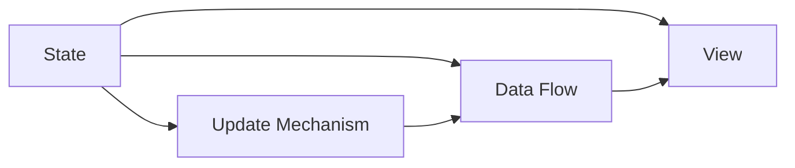

                 

# 前端状态管理：Redux, Vuex, and MobX

## 1. 背景介绍

随着前端技术栈的演进，前端状态管理变得越来越重要。传统的HTML、CSS和JavaScript，尽管功能强大，但在复杂应用中，尤其是大型单页应用(SPA)中，其状态管理变得相当困难。这导致代码难以维护、功能模块难以复用、开发效率低下。因此，前端状态管理解决方案应运而生，Redux, Vuex, and MobX等工具应运而生，被广泛应用于各种前端项目中。

## 2. 核心概念与联系

### 2.1 核心概念概述

前端状态管理涉及的核心概念主要包括状态、视图、数据流、和更新机制。状态表示应用的数据，视图呈现状态的表示，数据流描述状态的传递，而更新机制则是状态如何被修改的过程。以下我们将详细介绍这三个核心概念。

**状态（State）**：
状态是指应用中所有数据的相关集合。这些数据可能来自数据库、API调用、用户输入等。在应用中，状态可以理解为一种全局变量，它描述了应用在某个时刻的状态。例如，社交媒体应用的状态可以包括用户登录状态、好友列表、消息列表等。

**视图（View）**：
视图是状态的表示，它通常由React、Vue、Angular等框架负责呈现。视图是用户交互的直接对象，它可以将状态转换为UI组件。例如，用户在社交媒体应用中点击“消息”按钮后，应用会渲染消息列表视图。

**数据流（Data Flow）**：
数据流指的是状态如何从一种形式转换为另一种形式。在应用中，数据流通常包含三类：
- **单向数据流**：数据的流动是单向的，即从状态到视图，从状态到动作，从动作到状态。
- **响应式数据流**：数据的流动是响应式的，即当状态发生变化时，视图会更新。
- **异步数据流**：数据的流动是异步的，即数据可能是从API或异步计算得到的。

**更新机制（Update Mechanism）**：
更新机制是指如何管理状态的变化。在前端状态管理中，通常会引入中间件或插件来管理状态的更新。例如，Redux中的reducers，Vuex中的mutations，MobX中的actions等。

### 2.2 核心概念之间的联系

上述概念之间的联系可以通过以下Mermaid流程图来展示：



这个流程图展示了状态、视图、数据流和更新机制之间的联系：

- 状态（A）通过数据流（C）传递到视图（B）。
- 视图（B）接收状态（A），并显示出来。
- 更新机制（D）控制数据流（C），以响应状态（A）的变化。

## 3. 核心算法原理 & 具体操作步骤

### 3.1 算法原理概述

前端状态管理的目的在于维护全局状态，并根据状态的变化更新视图。常用的前端状态管理工具包括Redux, Vuex, and MobX。它们的算法原理如下：

**Redux**：
Redux采用单向数据流和单一全局状态树，通过reducers和actions来进行状态的更新。reducers定义状态的初始值和状态更新的规则，而actions则表示状态更新的事件。

**Vuex**：
Vuex采用模块化的状态管理，通过mutations和actions来进行状态的更新。mutations定义状态初始值和状态更新的规则，而actions则负责发起mutations并处理异步操作。

**MobX**：
MobX采用响应式数据流和事件驱动的更新机制，通过actions和观者（Observables）来进行状态的更新。actions表示状态更新的事件，而观者则监听状态的变化，并自动更新视图。

### 3.2 算法步骤详解

这里以Redux为例，介绍其算法步骤。

**Step 1: 初始化状态**
首先，需要定义应用的状态（State）。状态通常是一个复杂的JavaScript对象，包含了各种数据结构。例如：

```javascript
const initialState = {
  user: null,
  posts: [],
  loading: false,
  error: null
};
```

**Step 2: 定义reducers**
reducers定义状态的初始值和状态更新的规则。例如，定义一个处理用户登录的reducer：

```javascript
const authReducer = (state = initialState, action) => {
  switch (action.type) {
    case 'LOGIN_SUCCESS':
      return {
        ...state,
        user: action.payload.user,
        loading: false,
        error: null
      };
    case 'LOGIN_FAILURE':
      return {
        ...state,
        user: null,
        loading: false,
        error: action.payload.error
      };
    default:
      return state;
  }
};
```

**Step 3: 初始化store**
Redux使用store来管理全局状态。store由createStore函数创建，接受reducers作为参数：

```javascript
import { createStore } from 'redux';
import rootReducer from './reducers';

const store = createStore(rootReducer);
```

**Step 4: 发送actions**
actions表示状态更新的事件，通常包含type和payload两个属性。例如，定义一个处理用户登录的action：

```javascript
const loginUser = (user) => {
  return { type: 'LOGIN', payload: { user } };
};
```

**Step 5: 更新状态**
当状态更新时，Redux会自动调用reducers来更新状态：

```javascript
store.dispatch(loginUser(user));
```

### 3.3 算法优缺点

**Redux的优点**：
1. 可预测性：Redux采用单向数据流和单一全局状态树，状态的变化可以通过时间线进行预测和追踪。
2. 可复用性：reducers和actions的定义可以复用，便于开发和维护。
3. 模块化：Redux支持模块化的状态管理，便于大型应用的构建。

**Redux的缺点**：
1. 学习曲线陡峭：Redux的API设计较为复杂，需要一定的学习成本。
2. 性能问题：由于全局状态树的无限增长，Redux的性能问题可能会成为瓶颈。

**Vuex的优点**：
1. 模块化：Vuex采用模块化的状态管理，便于大型应用的构建。
2. 易于使用：Vuex的API设计较为简单，易于上手。
3. 响应式更新：Vuex的响应式数据流机制，使得状态的变化可以自动更新视图。

**Vuex的缺点**：
1. 性能问题：Vuex的全局状态树可能会导致性能问题。
2. 复杂性：Vuex的状态管理较为复杂，需要理解模块化和异步操作。

**MobX的优点**：
1. 简单直观：MobX的API设计较为简单，易于上手。
2. 响应式更新：MobX的响应式数据流机制，使得状态的变化可以自动更新视图。
3. 可预测性：MobX的状态更新是可预测的，便于调试和测试。

**MobX的缺点**：
1. 学习曲线陡峭：MobX的学习曲线较为陡峭，需要理解观者和actions的概念。
2. 性能问题：MobX的全局状态树可能会导致性能问题。

### 3.4 算法应用领域

前端状态管理工具适用于各种前端应用，尤其是大型单页应用(SPA)。以下是几个典型的应用领域：

1. 社交媒体应用：社交媒体应用需要处理大量的用户数据、消息数据等，前端状态管理工具可以有效地管理这些数据。

2. 电商平台应用：电商平台应用需要处理商品数据、购物车数据等，前端状态管理工具可以方便地管理这些数据。

3. 企业管理系统：企业管理系统需要处理各种数据，如员工数据、项目数据等，前端状态管理工具可以有效地管理这些数据。

## 4. 数学模型和公式 & 详细讲解 & 举例说明

### 4.1 数学模型构建

在前端状态管理中，通常使用JavaScript对象来表示状态。例如：

```javascript
const initialState = {
  user: null,
  posts: [],
  loading: false,
  error: null
};
```

状态的变化由reducers来管理。reducers通常是一个纯函数，接受当前状态和action作为参数，并返回新的状态：

```javascript
const authReducer = (state = initialState, action) => {
  switch (action.type) {
    case 'LOGIN_SUCCESS':
      return {
        ...state,
        user: action.payload.user,
        loading: false,
        error: null
      };
    case 'LOGIN_FAILURE':
      return {
        ...state,
        user: null,
        loading: false,
        error: action.payload.error
      };
    default:
      return state;
  }
};
```

### 4.2 公式推导过程

在Redux中，状态的变化可以通过时间线进行预测和追踪。例如，定义一个处理用户登录的reducer：

```javascript
const authReducer = (state = initialState, action) => {
  switch (action.type) {
    case 'LOGIN_SUCCESS':
      return {
        ...state,
        user: action.payload.user,
        loading: false,
        error: null
      };
    case 'LOGIN_FAILURE':
      return {
        ...state,
        user: null,
        loading: false,
        error: action.payload.error
      };
    default:
      return state;
  }
};
```

在Vuex中，状态的变化通过mutations和actions来进行管理。mutations定义状态的初始值和状态更新的规则，而actions则负责发起mutations并处理异步操作。例如，定义一个处理用户登录的mutation和action：

```javascript
const authMutation = (state, payload) => {
  state.user = payload.user;
  state.loading = false;
  state.error = null;
};

const loginUser = (user) => {
  return { type: 'LOGIN', payload: { user } };
};
```

在MobX中，状态的变化通过actions和观者（Observables）来进行管理。actions表示状态更新的事件，而观者则监听状态的变化，并自动更新视图。例如，定义一个处理用户登录的action和观者：

```javascript
import { observable } from 'mobx';

@observable user = null;
@observable loading = false;
@observable error = null;

const loginUser = (user) => {
  user = action.payload.user;
  loading = false;
  error = null;
};

const observer = () => {
  user.onChanged(() => {
    // 更新视图
  });
};
```

### 4.3 案例分析与讲解

以下是一个使用Redux进行状态管理的简单案例。

**需求**：实现一个用户登录表单。

**步骤**：

1. 定义登录表单状态：

```javascript
const initialState = {
  email: '',
  password: '',
  remember: false,
  loginError: null
};
```

2. 定义登录表单reducer：

```javascript
const formReducer = (state = initialState, action) => {
  switch (action.type) {
    case 'SET_EMAIL':
      return {
        ...state,
        email: action.payload.email
      };
    case 'SET_PASSWORD':
      return {
        ...state,
        password: action.payload.password
      };
    case 'SET_REMEMBER':
      return {
        ...state,
        remember: action.payload.remember
      };
    case 'LOGIN_SUCCESS':
      return {
        ...state,
        loginError: null
      };
    case 'LOGIN_FAILURE':
      return {
        ...state,
        loginError: action.payload.error
      };
    default:
      return state;
  }
};
```

3. 定义登录表单actions：

```javascript
const setEmail = (email) => {
  return { type: 'SET_EMAIL', payload: { email } };
};

const setPassword = (password) => {
  return { type: 'SET_PASSWORD', payload: { password } };
};

const setRemember = (remember) => {
  return { type: 'SET_REMEMBER', payload: { remember } };
};

const loginUser = (user) => {
  return { type: 'LOGIN', payload: { user } };
};
```

4. 初始化store：

```javascript
import { createStore } from 'redux';
import rootReducer from './reducers';

const store = createStore(rootReducer);
```

5. 使用Redux进行状态管理：

```javascript
const rootReducer = combineReducers({
  form: formReducer
});

const store = createStore(rootReducer);

const emailInput = document.getElementById('email');
const passwordInput = document.getElementById('password');
const rememberCheckbox = document.getElementById('remember');

emailInput.addEventListener('input', () => {
  store.dispatch(setEmail(emailInput.value));
});

passwordInput.addEventListener('input', () => {
  store.dispatch(setPassword(passwordInput.value));
});

rememberCheckbox.addEventListener('change', () => {
  store.dispatch(setRemember(rememberCheckbox.checked));
});

store.subscribe(() => {
  console.log(store.getState());
});
```

## 5. 项目实践：代码实例和详细解释说明

### 5.1 开发环境搭建

要搭建Redux项目，需要安装React和Redux相关的库。以下是在React项目中集成Redux的开发环境搭建步骤：

1. 安装React和React Redux库：

```bash
npm install react react-dom react-redux
```

2. 安装Redux库：

```bash
npm install redux
```

3. 安装Redux工具：

```bash
npm install redux-thunk redux-devtools-extension
```

### 5.2 源代码详细实现

以下是一个使用Redux进行状态管理的简单实现。

**需求**：实现一个待办事项列表。

**步骤**：

1. 定义待办事项列表状态：

```javascript
const initialState = {
  todos: [],
  loading: false,
  error: null
};
```

2. 定义待办事项列表reducer：

```javascript
const todoReducer = (state = initialState, action) => {
  switch (action.type) {
    case 'TOGGLE':
      const updatedTodos = state.todos.map((todo) => {
        if (todo.id === action.payload.id) {
          return { ...todo, completed: !todo.completed };
        }
        return todo;
      });
      return {
        ...state,
        todos: updatedTodos,
        loading: false,
        error: null
      };
    case 'ADD_TODO':
      return {
        ...state,
        todos: [...state.todos, { id: action.payload.id, text: action.payload.text, completed: false }],
        loading: false,
        error: null
      };
    case 'DELETE_TODO':
      return {
        ...state,
        todos: state.todos.filter((todo) => todo.id !== action.payload.id),
        loading: false,
        error: null
      };
    case 'SET_ERROR':
      return {
        ...state,
        loading: false,
        error: action.payload.error
      };
    default:
      return state;
  }
};
```

3. 定义待办事项列表actions：

```javascript
const toggleTodo = (id) => {
  return { type: 'TOGGLE', payload: { id } };
};

const addTodo = (id, text) => {
  return { type: 'ADD_TODO', payload: { id, text } };
};

const deleteTodo = (id) => {
  return { type: 'DELETE_TODO', payload: { id } };
};

const setError = (error) => {
  return { type: 'SET_ERROR', payload: { error } };
};
```

4. 初始化store：

```javascript
import { createStore, applyMiddleware } from 'redux';
import thunkMiddleware from 'redux-thunk';
import rootReducer from './reducers';

const store = createStore(rootReducer, applyMiddleware(thunkMiddleware));
```

5. 使用Redux进行状态管理：

```javascript
const todoInput = document.getElementById('todo-input');
const todoButton = document.getElementById('todo-button');

todoInput.addEventListener('input', () => {
  const text = todoInput.value;
  store.dispatch(addTodo(getId(), text));
});

todoButton.addEventListener('click', () => {
  store.dispatch(toggleTodo(getId()));
});

function getId() {
  return Math.floor(Math.random() * 1000);
}

store.subscribe(() => {
  console.log(store.getState());
});
```

### 5.3 代码解读与分析

**代码解读**：

- 首先，定义了待办事项列表的状态，包含待办事项、加载状态和错误信息。
- 然后，定义了待办事项列表的reducer，通过switch语句处理不同类型的actions。
- 接着，定义了待办事项列表的actions，包含添加、切换和删除待办事项的action。
- 最后，初始化store，并使用Redux进行状态管理。

**代码分析**：

- Redux采用单一全局状态树和单向数据流，状态的变化可以通过时间线进行预测和追踪。
- Redux的reducers和actions的定义可以复用，便于开发和维护。
- Redux支持模块化的状态管理，便于大型应用的构建。

## 6. 实际应用场景

### 6.1 社交媒体应用

社交媒体应用需要处理大量的用户数据、消息数据等。使用前端状态管理工具可以有效地管理这些数据，例如：

- 用户登录状态：使用Redux的authReducer来管理用户登录状态。
- 消息列表：使用Redux的postReducer来管理消息列表。
- 加载状态：使用Redux的loadingReducer来管理加载状态。

### 6.2 电商平台应用

电商平台应用需要处理商品数据、购物车数据等。使用前端状态管理工具可以方便地管理这些数据，例如：

- 商品列表：使用Vuex的productModule来管理商品列表。
- 购物车：使用Vuex的cartModule来管理购物车。
- 加载状态：使用Vuex的loadingModule来管理加载状态。

### 6.3 企业管理系统

企业管理系统需要处理各种数据，如员工数据、项目数据等。使用前端状态管理工具可以有效地管理这些数据，例如：

- 员工数据：使用MobX的employeeObservable来管理员工数据。
- 项目数据：使用MobX的项目Observable来管理项目数据。
- 加载状态：使用MobX的loadingObservable来管理加载状态。

## 7. 工具和资源推荐

### 7.1 学习资源推荐

为了帮助开发者系统掌握前端状态管理的技术，这里推荐一些优质的学习资源：

1. Redux官方文档：Redux的官方文档详细介绍了Redux的API和用法，是学习Redux的最佳入门资源。
2. Vuex官方文档：Vuex的官方文档详细介绍了Vuex的API和用法，是学习Vuex的最佳入门资源。
3. MobX官方文档：MobX的官方文档详细介绍了MobX的API和用法，是学习MobX的最佳入门资源。
4. React官方文档：React的官方文档详细介绍了React的状态管理，可以帮助开发者更好地理解前端状态管理。
5. Vue官方文档：Vue的官方文档详细介绍了Vue的状态管理，可以帮助开发者更好地理解前端状态管理。

### 7.2 开发工具推荐

前端状态管理工具的开发需要依赖各种工具，以下是推荐的开发工具：

1. Visual Studio Code：功能强大的代码编辑器，支持各种插件，方便开发者进行开发和调试。
2. Git：版本控制系统，方便开发者进行代码管理和版本控制。
3. Redux DevTools：Redux的调试工具，方便开发者进行状态调试和性能优化。
4. Vuex DevTools：Vuex的调试工具，方便开发者进行状态调试和性能优化。
5. MobX DevTools：MobX的调试工具，方便开发者进行状态调试和性能优化。

### 7.3 相关论文推荐

前端状态管理工具的研究一直是NLP领域的热点话题。以下是几篇经典的研究论文，推荐阅读：

1. "Redux: A predictable state container for JavaScript apps"：Redux的创建者Tom Parker在2013年发表的论文，详细介绍了Redux的原理和用法。
2. "Vuex: State Management for Vue.js"：Vuex的创建者Ned Augenstern在2016年发表的论文，详细介绍了Vuex的原理和用法。
3. "MobX: A simple yet scalable state management solution for JavaScript"：MobX的创建者Christian Mauve在2015年发表的论文，详细介绍了MobX的原理和用法。

## 8. 总结：未来发展趋势与挑战

### 8.1 研究成果总结

前端状态管理工具已经广泛应用于各种前端应用，特别是大型单页应用(SPA)中。Redux, Vuex, and MobX是当前最流行的前端状态管理工具，分别适用于不同的应用场景。Redux采用单向数据流和单一全局状态树，Vuex采用模块化的状态管理，MobX采用响应式数据流和事件驱动的更新机制。

### 8.2 未来发展趋势

未来，前端状态管理工具将呈现以下几个发展趋势：

1. 功能扩展：前端状态管理工具将不断扩展其功能，支持更多的特性和插件。例如，支持异步数据流、支持副作用处理、支持跨模块通信等。
2. 性能优化：前端状态管理工具将不断优化其性能，提高其处理大型应用的能力。例如，使用缓存机制、使用懒加载、使用分块加载等。
3. 生态系统完善：前端状态管理工具将不断完善其生态系统，支持更多的框架和库。例如，支持React、Vue、Angular等框架，支持Redux、Vuex、MobX等库。

### 8.3 面临的挑战

尽管前端状态管理工具已经取得了一定的成就，但在应用过程中仍面临诸多挑战：

1. 学习曲线陡峭：前端状态管理工具的学习曲线较为陡峭，开发者需要掌握其API和用法。
2. 性能问题：前端状态管理工具的全局状态树可能会导致性能问题，特别是在大型应用中。
3. 兼容性问题：前端状态管理工具的兼容性问题较为突出，不同框架和库之间的兼容性问题需要解决。

### 8.4 研究展望

未来的研究可以从以下几个方面进行探索：

1. 模块化设计：前端状态管理工具可以采用模块化的设计，使得模块之间独立，易于扩展和维护。
2. 状态压缩：前端状态管理工具可以采用状态压缩技术，减少状态树的大小，提高性能。
3. 跨框架兼容性：前端状态管理工具可以采用跨框架兼容性的设计，支持更多的框架和库。
4. 实时性增强：前端状态管理工具可以采用实时性的增强技术，提高其响应速度和用户体验。
5. 多语言支持：前端状态管理工具可以采用多语言支持的设计，支持多种编程语言和框架。

## 9. 附录：常见问题与解答

**Q1: 前端状态管理工具有哪些？**

A: 前端状态管理工具主要有Redux, Vuex, and MobX。Redux采用单向数据流和单一全局状态树，Vuex采用模块化的状态管理，MobX采用响应式数据流和事件驱动的更新机制。

**Q2: 前端状态管理工具的优缺点是什么？**

A: 前端状态管理工具的优点包括：

- 可预测性：Redux采用单向数据流和单一全局状态树，状态的变化可以通过时间线进行预测和追踪。
- 可复用性：Redux的reducers和actions的定义可以复用，便于开发和维护。
- 模块化：Vuex采用模块化的状态管理，便于大型应用的构建。
- 响应式更新：MobX的响应式数据流机制，使得状态的变化可以自动更新视图。

前端状态管理工具的缺点包括：

- 学习曲线陡峭：Redux和MobX的学习曲线较为陡峭，需要掌握其API和用法。
- 性能问题：前端状态管理工具的全局状态树可能会导致性能问题，特别是在大型应用中。
- 兼容性问题：前端状态管理工具的兼容性问题较为突出，不同框架和库之间的兼容性问题需要解决。

**Q3: 前端状态管理工具的API设计有哪些？**

A: 前端状态管理工具的API设计包括：

- Redux：Redux的API设计包括createStore, dispatch, combineReducers等。
- Vuex：Vuex的API设计包括mapState, mapGetters, mapMutations等。
- MobX：MobX的API设计包括observable, observer, action等。

这些API设计使得开发者可以方便地进行状态管理，并支持各种开发需求。

