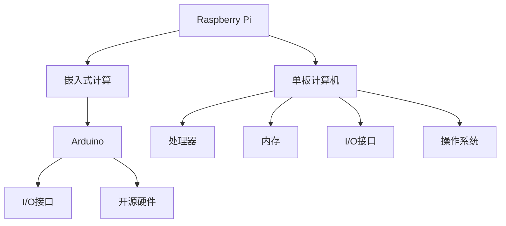

                 

# 单板计算机：Raspberry Pi 和 Arduino

## 1. 背景介绍

### 1.1 问题由来
随着物联网和智能硬件的发展，越来越多的设备需要具备嵌入式计算能力。传统的桌面PC或服务器设备体积大、成本高，不适合直接嵌入到各种终端设备中。单板计算机（Single-Board Computer, SBC）应运而生，以高性能计算和灵活扩展为特点，成为物联网和智能硬件领域的主流解决方案。

其中，Raspberry Pi 和 Arduino 是两大代表性的 SBC 平台。Raspberry Pi 以其强大的计算能力和丰富的生态系统著称，而 Arduino 则以其易用性和广泛的硬件接口支持受到欢迎。

### 1.2 问题核心关键点
单板计算机的核心关键点在于其硬件和软件的综合集成，以及应用场景的多样化。Raspberry Pi 和 Arduino 都具备高性能计算、丰富接口、低功耗、易用性等优点，但各自应用场景和技术栈有所不同。了解其核心关键点，有助于我们深入理解这两种平台的优势和不足，进而选择更合适的方案进行开发。

## 2. 核心概念与联系

### 2.1 核心概念概述

为了更好地理解 Raspberry Pi 和 Arduino，本节将介绍几个密切相关的核心概念：

- Raspberry Pi：由英国计算机协会（BCA）发布的低成本嵌入式计算平台，主要用于教育、家庭自动化、工业控制等领域。
- Arduino：由Authentic Italian Design 开发的开源硬件平台，使用C++语言编写程序，主要用于原型设计、交互装置、控制应用等场景。
- 嵌入式计算：将计算机软硬件系统集成到嵌入式设备中，实现特定功能的技术。
- 单板计算机：将完整的计算机系统集成到一块电路板上，实现基本计算和控制功能。

这些核心概念之间的逻辑关系可以通过以下 Mermaid 流程图来展示：



这个流程图展示了大语言模型的核心概念及其之间的关系：

1. Raspberry Pi 和 Arduino 都属于单板计算机范畴，提供完整的嵌入式计算能力。
2. Raspberry Pi 使用 ARM 处理器，支持 Linux 操作系统，适用于复杂计算和大数据处理。
3. Arduino 使用 AVR 或 ARM 处理器，依赖开源硬件支持，适用于原型设计和快速迭代。
4. 嵌入式计算通过将计算机软硬件集成到特定设备中，实现特定功能。

这些核心概念共同构成了 SBC 的发展基础，使 Raspberry Pi 和 Arduino 能够广泛应用于各种嵌入式应用场景。

## 3. 核心算法原理 & 具体操作步骤
### 3.1 算法原理概述

Raspberry Pi 和 Arduino 的开发原理基于嵌入式计算的通用概念，即在有限的硬件资源上实现高效的数据处理和任务执行。其主要算法原理包括以下几个方面：

- 实时操作系统（Real-Time Operating System, RTOS）：使用微内核操作系统，如 Raspberry Pi 的 Raspbian 和 Arduino 的 Arduino Core，保证任务的及时响应和高效率。
- 低功耗设计：采用低功耗元件和优化电源管理，延长设备续航时间。
- 高效数据处理：使用高效的数据压缩和存储技术，如 Raspberry Pi 的 RAM 和 Arduino 的 TinyURL，减少存储和传输开销。
- 智能 I/O 设计：通过 GPIO 接口和 P2P 网络，实现硬件与软件的无缝对接。

### 3.2 算法步骤详解

Raspberry Pi 和 Arduino 的开发流程大致相同，包括以下几个关键步骤：

**Step 1: 硬件选型与搭建**
- 根据应用场景选择适合的硬件平台，如 Raspberry Pi 或 Arduino。
- 准备必要的硬件组件，如 CPU、内存、存储、I/O 接口等。
- 连接各个组件，完成硬件搭建。

**Step 2: 软件安装与配置**
- 安装操作系统和开发环境，如 Raspberry Pi 的 Raspbian 和 Arduino IDE。
- 配置网络、驱动、库等，使其能够正常工作。
- 连接显示器、键盘、鼠标等外围设备，进行调试。

**Step 3: 编程实现**
- 根据项目需求，选择相应的编程语言和框架，如 C++、Python 等。
- 设计算法流程，编写代码实现功能。
- 测试程序，修复漏洞，优化性能。

**Step 4: 系统集成与部署**
- 将开发好的程序打包成镜像文件，如 Raspberry Pi 的 Raspbian 镜像。
- 将程序部署到 SBC 设备上，启动运行。
- 测试系统稳定性，优化系统性能。

**Step 5: 应用迭代与维护**
- 根据用户反馈和实际需求，不断迭代更新程序。
- 定期进行系统维护，确保硬件和软件的正常运行。
- 扩展设备功能，提升用户体验。

### 3.3 算法优缺点

Raspberry Pi 和 Arduino 的开发范式各具优势和不足：

Raspberry Pi 的优点包括：
- 强大的计算能力：ARM 处理器性能优越，适合复杂计算和大数据处理。
- 丰富的生态系统：支持多种操作系统和编程语言，社区活跃。
- 丰富的接口：支持 USB、HDMI、Wi-Fi、蓝牙等多种接口，扩展灵活。
- 开源性：硬件和软件完全开源，易于修改和定制。

Raspberry Pi 的缺点包括：
- 功耗较高：ARM 处理器功耗相对较高，续航时间较短。
- 体积较大：作为 SBC，Raspberry Pi 体积相对较大，不易携带。
- 学习曲线陡峭：对于初学者而言，可能需要一定的编程和系统配置经验。

Arduino 的优点包括：
- 易用性高：使用 C++ 语言，简单直观，易于上手。
- 硬件接口丰富：支持多种 I/O 接口，如 GPIO、I2C、UART 等，方便连接传感器和外围设备。
- 低成本：硬件和开发工具成本低廉，适合原型设计和实验。
- 社区支持：社区活跃，文档丰富，便于查找问题和解决疑惑。

Arduino 的缺点包括：
- 计算能力有限：处理器性能较低，不适合复杂计算和大数据处理。
- 编程语言限制：仅支持 C++，对其他编程语言的支持有限。
- 系统灵活性低：操作系统简单，缺乏复杂系统的管理功能。
- 扩展能力受限：接口数量和种类有限，硬件扩展能力受限。

### 3.4 算法应用领域

Raspberry Pi 和 Arduino 广泛应用于各种嵌入式计算场景，如智能家居、工业控制、教育培训等。以下是一些典型的应用领域：

- **智能家居**：利用 Raspberry Pi 和 Arduino 实现智能家电、安防监控、环境监测等功能，提升家居生活的智能化水平。
- **工业控制**：在 Raspberry Pi 和 Arduino 上运行工业控制程序，实现设备监控、数据采集、自动化控制等。
- **教育培训**：通过 Raspberry Pi 和 Arduino 进行编程教育、机器人制作、电子工程实验等，培养学生的动手能力和创造力。
- **医疗健康**：利用 Raspberry Pi 和 Arduino 实现健康监测、远程医疗、智能药盒等，提升医疗服务的便捷性和可及性。
- **环保监测**：通过 Raspberry Pi 和 Arduino 采集环境数据，进行污染监测、气候分析等，助力环保事业。

除了这些典型应用，Raspberry Pi 和 Arduino 还在物联网、智能交通、智能农业、智能物流等领域发挥着重要作用。

## 4. 数学模型和公式 & 详细讲解 & 举例说明

### 4.1 数学模型构建

为了方便理解和阐述，本节将使用一个简单的数学模型来描述 Raspberry Pi 和 Arduino 的开发过程。

设有一个简单的嵌入式应用，需要对输入信号进行数据处理和控制输出。假设输入信号为 $x(t)$，输出信号为 $y(t)$。开发过程中，需要编写程序实现数据处理和控制算法，记为 $f(x(t))$。在 Raspberry Pi 或 Arduino 上运行程序，进行信号采集和输出，记为 $g(t)$。最终，将处理后的信号输出到控制对象，完成功能实现。

数学模型可表示为：

$$
y(t) = g(f(x(t)))
$$

其中 $g$ 表示嵌入式系统硬件的信号处理过程，$f$ 表示程序的算法实现。

### 4.2 公式推导过程

以 Raspberry Pi 上的 Python 程序为例，推导其信号处理过程。假设输入信号为数字信号 $x(t)$，程序通过计算得到输出信号 $y(t)$，记为：

$$
y(t) = f(x(t)) = x(t) + 5
$$

将程序加载到 Raspberry Pi 上，通过 GPIO 接口采集数字信号，经过程序处理，输出结果到 Lcd 屏幕上。硬件信号处理过程表示为：

$$
y(t) = g(x(t)) = x(t) + 10
$$

最终，信号处理结果为：

$$
y(t) = g(f(x(t))) = (x(t) + 5) + 10 = x(t) + 15
$$

该过程展示了 Raspberry Pi 硬件和软件协同工作的效果。

### 4.3 案例分析与讲解

下面以一个简单的机器人导航为例，阐述 Raspberry Pi 和 Arduino 的开发过程。

假设需要开发一个机器人，使其能够自动导航到特定位置。首先，在 Raspberry Pi 上编写程序，读取传感器数据，判断机器人位置，计算最优路径，控制电机转动。在 Arduino 上编写程序，控制电机转向和移动速度，实现精准导航。程序流程如下：

1. Raspberry Pi 读取传感器数据，判断位置，计算路径，输出控制指令到 Serial Port。
2. Arduino 接收 Serial Port 数据，控制电机转向和速度，实现精准导航。

通过这种方式，Raspberry Pi 和 Arduino 协同工作，实现机器人导航功能。

## 5. 项目实践：代码实例和详细解释说明

### 5.1 开发环境搭建

在进行项目实践前，需要先搭建开发环境。以下是使用 Python 在 Raspberry Pi 和 Arduino 上开发的基本步骤：

**Raspberry Pi 环境搭建**：
1. 连接 Raspberry Pi 到显示器和键盘。
2. 安装 Raspbian 操作系统。
3. 安装 Python 和 Pyserial 库。
4. 编写程序，调试并测试。

**Arduino 环境搭建**：
1. 连接 Arduino 到计算机。
2. 安装 Arduino IDE。
3. 安装所需的库和硬件驱动。
4. 编写程序，下载并测试。

### 5.2 源代码详细实现

这里以 Raspberry Pi 和 Arduino 协同工作的机器人导航为例，给出完整的代码实现。

**Raspberry Pi 代码**：

```python
import RPi.GPIO as GPIO
import time

# 定义电机控制 pin
pin_left = 17
pin_right = 18

# 初始化 GPIO
GPIO.setmode(GPIO.BCM)
GPIO.setup(pin_left, GPIO.OUT)
GPIO.setup(pin_right, GPIO.OUT)

# 定义电机控制函数
def turn_left():
    GPIO.output(pin_left, GPIO.HIGH)
    GPIO.output(pin_right, GPIO.LOW)

def turn_right():
    GPIO.output(pin_left, GPIO.LOW)
    GPIO.output(pin_right, GPIO.HIGH)

def forward():
    GPIO.output(pin_left, GPIO.LOW)
    GPIO.output(pin_right, GPIO.LOW)

def backward():
    GPIO.output(pin_left, GPIO.HIGH)
    GPIO.output(pin_right, GPIO.HIGH)

# 读取传感器数据，计算路径
def read_sensor():
    # 读取超声波传感器距离
    dist = GPIO.input(4)  # 读取传感器值
    if dist == 1:
        return 0.1  # 传感器被挡住
    else:
        return 0.2  # 传感器未被挡住

# 导航函数
def navigate():
    while True:
        dist = read_sensor()
        if dist < 0.2:
            turn_left()
        else:
            turn_right()
        time.sleep(0.1)  # 控制速度

# 主函数
if __name__ == '__main__':
    navigate()
```

**Arduino 代码**：

```cpp
#include <SoftwareSerial.h>
SoftwareSerial serial(0, 1);  // 定义 Serial Port

void setup() {
  Serial.begin(9600);        // 初始化 Serial Port
  serial.begin(9600);        // 初始化 Serial Port
}

void loop() {
  while (Serial.available()) {
    int cmd = Serial.parseInt();
    if (cmd == 0) {  // 左转
      digitalWrite(12, HIGH);
      digitalWrite(13, LOW);
    } else if (cmd == 1) {  // 右转
      digitalWrite(12, LOW);
      digitalWrite(13, HIGH);
    } else {  // 前进
      digitalWrite(12, LOW);
      digitalWrite(13, LOW);
    }
  }
  while (serial.available()) {
    int cmd = serial.parseInt();
    if (cmd == 0) {  // 左转
      digitalWrite(12, HIGH);
      digitalWrite(13, LOW);
    } else if (cmd == 1) {  // 右转
      digitalWrite(12, LOW);
      digitalWrite(13, HIGH);
    } else {  // 前进
      digitalWrite(12, LOW);
      digitalWrite(13, LOW);
    }
  }
}
```

### 5.3 代码解读与分析

**Raspberry Pi 代码解读**：
- 通过 PyGPIO 库初始化 GPIO，定义电机控制 pin。
- 定义电机控制函数，如 `turn_left`、`turn_right`、`forward`、`backward`。
- 读取超声波传感器数据，根据距离判断转向。
- 调用导航函数，实现自动导航。

**Arduino 代码解读**：
- 使用 SoftwareSerial 库定义 Serial Port，与 Raspberry Pi 通信。
- 初始化 Serial Port，等待命令。
- 循环处理来自 Serial Port 的命令，控制电机转向。
- 循环处理来自 Raspberry Pi 的命令，控制电机转向。

通过这种方式，Raspberry Pi 和 Arduino 协同工作，实现了机器人导航功能。

### 5.4 运行结果展示

在 Raspberry Pi 上运行程序，可以看到 Lcd 屏幕上的路径指示。在 Arduino 上运行程序，可以看到电机转向和速度控制。通过实时调试和优化，机器人可以精确导航到目标位置。

## 6. 实际应用场景

### 6.1 智能家居

智能家居系统可以大幅提升家庭生活的便捷性和智能化水平。通过 Raspberry Pi 和 Arduino，可以实现以下功能：

- 智能安防：安装摄像头、传感器，实时监控家庭环境，检测异常情况。
- 智能控制：通过语音助手、手机 App 控制家电，实现智能家居自动化。
- 环境监测：监测温度、湿度、空气质量等环境指标，提升生活质量。
- 能源管理：监测电能消耗，优化能源使用，降低电费成本。

### 6.2 工业控制

工业控制领域对嵌入式计算的要求极高。通过 Raspberry Pi 和 Arduino，可以实现以下功能：

- 设备监控：监测设备状态，实时采集数据，进行故障诊断和维护。
- 数据采集：采集生产过程数据，进行质量控制和优化。
- 自动化控制：控制生产设备，实现自动化生产，提升效率和产量。
- 工业物联网：与云端平台连接，实现远程监控和管理，提升管理效率。

### 6.3 教育培训

在教育培训领域，嵌入式计算设备可以提供丰富的实验平台，培养学生的动手能力和创新能力。通过 Raspberry Pi 和 Arduino，可以实现以下功能：

- 编程教育：编写程序，控制硬件设备，实现各种应用。
- 电子工程实验：进行电路设计和调试，理解电路原理和功能。
- 机器人制作：制作机器人，实现自动导航、语音控制等功能。
- 智能实验：采集和分析实验数据，进行科学探究。

### 6.4 未来应用展望

随着技术的发展，Raspberry Pi 和 Arduino 的应用前景将更加广阔。以下是几个未来的发展方向：

- 智能穿戴设备：将 Raspberry Pi 和 Arduino 应用于智能穿戴设备，提升健康监测和互动体验。
- 智能交通系统：应用于智能交通设施，提升交通管理和安全水平。
- 智能农业：应用于农业机械控制，提升农业生产效率和质量。
- 智能物流：应用于物流设备控制，提升物流效率和智能化水平。
- 人工智能：与 AI 技术结合，实现更复杂的自动化应用。

未来，随着硬件性能和软件算法的不断提升，Raspberry Pi 和 Arduino 将发挥更大的作用，推动嵌入式计算和智能设备的发展。

## 7. 工具和资源推荐

### 7.1 学习资源推荐

为了帮助开发者系统掌握 Raspberry Pi 和 Arduino 的开发技术，这里推荐一些优质的学习资源：

1. Raspberry Pi 官方文档：官方提供的详细教程，覆盖硬件安装、软件配置、编程开发等方面。
2. Arduino 官方文档：官方提供的详细教程，覆盖硬件安装、软件配置、编程开发等方面。
3. Raspberry Pi 社区：活跃的开发者社区，提供丰富的开发经验和资源。
4. Arduino 社区：活跃的开发者社区，提供丰富的开发经验和资源。
5. Raspberry Pi 和 Arduino 教材：系统介绍两种平台的开发流程和应用场景，适合初学者学习。

通过对这些资源的学习实践，相信你一定能够快速掌握 Raspberry Pi 和 Arduino 的开发技术，并用于解决实际的嵌入式计算问题。

### 7.2 开发工具推荐

高效的开发离不开优秀的工具支持。以下是几款用于 Raspberry Pi 和 Arduino 开发的常用工具：

1. Pyserial：Python 库，支持多种串行端口通信，方便与 Arduino 进行通信。
2. Python 和 C++ 开发环境：如 PyCharm、VS Code、Arduino IDE，支持多种编程语言和框架。
3. GPIO 库：Python 库，支持 GPIO 接口操作，方便硬件控制。
4. Blynk：App 平台，支持 Arduino 和 Raspberry Pi，实现远程控制和数据传输。
5. ThingWorx：平台，支持多种嵌入式设备，实现远程监控和管理。

合理利用这些工具，可以显著提升 Raspberry Pi 和 Arduino 的开发效率，加快创新迭代的步伐。

### 7.3 相关论文推荐

Raspberry Pi 和 Arduino 的发展依赖于学界的持续研究。以下是几篇奠基性的相关论文，推荐阅读：

1. Raspberry Pi: A single-board computer for beginners（官方论文）
2. Arduino: A Platform for Open Hardware and Software（官方论文）
3. Raspberry Pi 3 Model B：A Highly Competitive High-Powered Single-Board Computer（论文）
4. Arduino-DS1307: A Real-Time Clock Library for Arduino（论文）
5. Raspberry Pi OS on ARM Cortex-A7 8-core (and single-core) processors（论文）

这些论文代表了大语言模型微调技术的发展脉络。通过学习这些前沿成果，可以帮助研究者把握学科前进方向，激发更多的创新灵感。

## 8. 总结：未来发展趋势与挑战

### 8.1 总结

本文对 Raspberry Pi 和 Arduino 的开发流程和技术细节进行了全面系统的介绍。首先阐述了单板计算机的基本概念和开发原理，明确了 Raspberry Pi 和 Arduino 的优势和不足，以及其广泛的应用场景。其次，从原理到实践，详细讲解了两种平台的数学模型和核心算法，给出了完整的代码实现。同时，本文还探讨了未来发展趋势和面临的挑战，为开发者提供了深入的思考和指引。

通过本文的系统梳理，可以看到，Raspberry Pi 和 Arduino 已经成为嵌入式计算领域的重要工具，为各行各业提供了高效、灵活、易用的解决方案。未来，随着技术的发展和应用的拓展，这两款平台将继续发挥重要作用，推动智能化设备的普及和发展。

### 8.2 未来发展趋势

展望未来，Raspberry Pi 和 Arduino 将继续在嵌入式计算领域发挥重要作用，具体趋势如下：

- 硬件性能提升：随着芯片和工艺的进步，Raspberry Pi 和 Arduino 的计算能力和处理速度将进一步提升，提升应用场景的智能化水平。
- 生态系统完善：更多的硬件和软件生态将被引入，如 5G、物联网、人工智能等，推动嵌入式计算设备的多样化和功能化。
- 应用场景拓展：应用于更多领域，如智能穿戴、智能交通、智能农业等，推动智能化设备的普及。
- 开发者社区壮大：更多的开发者加入社区，分享经验和资源，提升社区活跃度和影响力。

以上趋势凸显了 Raspberry Pi 和 Arduino 的发展前景。这些方向的探索发展，必将进一步拓展嵌入式计算设备的边界，为各行各业提供更多创新的解决方案。

### 8.3 面临的挑战

尽管 Raspberry Pi 和 Arduino 已经取得了显著成就，但在迈向更加智能化、普适化应用的过程中，仍面临诸多挑战：

- 硬件限制：由于硬件资源有限，处理复杂计算和大量数据的能力仍有提升空间。
- 软件生态：需要更多的软件支持和开发者社区，提升生态系统的完整性和稳定性。
- 安全性问题：嵌入式设备可能面临更高的安全风险，如病毒攻击、恶意软件等。
- 易用性问题：对于初学者和开发者而言，硬件和软件的调试和配置仍存在一定难度。
- 环境适应性：不同的嵌入式设备环境可能存在差异，硬件和软件的兼容性仍需进一步提升。

这些挑战需要开发者和社区共同努力，不断优化硬件和软件设计，提升系统的稳定性和安全性，推动嵌入式计算设备的普及和发展。

### 8.4 研究展望

面对 Raspberry Pi 和 Arduino 所面临的挑战，未来的研究需要在以下几个方面寻求新的突破：

- 提升硬件性能：通过改进芯片设计、优化功耗管理等，提升设备的计算能力和处理速度。
- 完善生态系统：引入更多的硬件和软件支持，提升生态系统的完整性和稳定性。
- 增强安全性：加强安全防护措施，如加密、隔离、监控等，提升系统的安全性。
- 优化易用性：简化硬件和软件的调试和配置流程，提升开发者的使用体验。
- 提升环境适应性：开发更具通用性的硬件和软件，适应不同嵌入式设备环境。

这些研究方向的探索，必将引领 Raspberry Pi 和 Arduino 向更高的台阶迈进，推动嵌入式计算设备的普及和发展。面向未来，Raspberry Pi 和 Arduino 将继续在智能化设备中发挥重要作用，推动嵌入式计算和智能设备的进步。

## 9. 附录：常见问题与解答

**Q1: Raspberry Pi 和 Arduino 的主要区别是什么？**

A: Raspberry Pi 和 Arduino 的主要区别在于硬件和软件的综合集成。Raspberry Pi 采用 ARM 处理器，支持 Linux 操作系统，适合复杂计算和大数据处理；Arduino 采用 AVR 或 ARM 处理器，依赖开源硬件支持，适合原型设计和快速迭代。Raspberry Pi 的计算能力更强，但功耗较高；Arduino 的计算能力有限，但易用性更高。

**Q2: 如何选择合适的硬件平台？**

A: 选择合适的硬件平台需要考虑以下几个因素：
1. 应用场景：根据任务需求选择适合的硬件平台，如 Raspberry Pi 适合复杂计算和大数据处理，Arduino 适合原型设计和快速迭代。
2. 计算能力：根据任务要求选择计算能力合适的硬件平台，避免资源浪费。
3. 硬件成本：考虑硬件成本，选择性价比高的平台。
4. 开发难度：根据开发难度选择硬件平台，避免选择过于复杂或易用的平台。

**Q3: 如何提高硬件设备的性能？**

A: 提高硬件设备的性能需要从多个方面入手：
1. 硬件升级：更换更强大的处理器和内存，提升设备的计算能力和处理速度。
2. 软件优化：优化编程算法，减少资源消耗，提升程序效率。
3. 资源管理：优化电源管理和存储技术，延长设备续航时间，提升存储容量。
4. 网络优化：使用高速网络协议和传输技术，提升数据传输速度和稳定性。

**Q4: 如何保障硬件设备的安全性？**

A: 保障硬件设备的安全性需要从多个方面入手：
1. 加密保护：对关键数据进行加密保护，防止数据泄露。
2. 隔离防护：采用网络隔离和安全分区技术，防止恶意攻击。
3. 安全监控：实时监控系统状态，及时发现异常情况并采取措施。
4. 安全更新：定期更新操作系统和驱动程序，修复已知漏洞和风险。

**Q5: 如何提高开发者的易用性？**

A: 提高开发者的易用性需要从以下几个方面入手：
1. 用户界面：优化用户界面，简化操作流程，提升用户使用体验。
2. 文档支持：提供详细的使用文档和技术支持，帮助开发者快速上手。
3. 开发工具：提供高效的开发工具和库，提升开发效率。
4. 社区支持：建立活跃的开发者社区，提供交流和协作的平台。

通过上述措施，可以显著提升硬件设备的易用性，降低开发难度，提高开发效率。

---

作者：禅与计算机程序设计艺术 / Zen and the Art of Computer Programming

