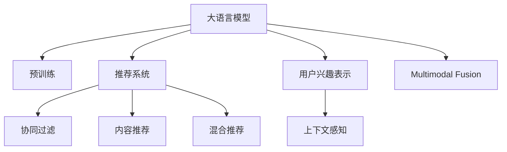

                 

# 基于LLM的推荐系统用户兴趣表示学习

## 1. 背景介绍

### 1.1 问题由来

在如今信息爆炸的时代，用户每天都会接触到大量信息，如何快速高效地发现对自己有用的内容成为一项挑战。推荐系统应运而生，通过算法为用户推荐个性化的信息，提升用户体验。然而，传统的推荐系统往往基于用户历史行为数据进行推荐，忽略了用户多维度、多层次的兴趣。

### 1.2 问题核心关键点

基于大语言模型(Large Language Model, LLM)的推荐系统，旨在通过大模型学习用户的广泛兴趣和潜在兴趣，实现更加精准的个性化推荐。核心关键点包括：

- **用户兴趣的全面表示**：大模型可以学习用户多样化的兴趣点，如基于上下文语境的兴趣、基于主题的兴趣、基于情感的兴趣等。
- **跨领域兴趣迁移**：大模型具备强大的跨领域迁移能力，能够从不同类型的文本数据中抽取通用的兴趣特征。
- **上下文敏感的推荐**：大模型可以理解用户当前的情境和语境，根据不同的上下文提供个性化的推荐。
- **实时性需求**：大模型能够快速进行推理，满足实时性要求，支持快速响应用户请求。
- **可解释性**：大模型生成的推荐理由具有可解释性，帮助用户理解推荐逻辑。

### 1.3 问题研究意义

基于大语言模型的推荐系统，可以更好地解决传统推荐系统所面临的兴趣表示单一、领域限制等问题，提升推荐效果，扩展推荐系统的应用范围，推动NLP技术在实际应用中的落地和发展。

## 2. 核心概念与联系

### 2.1 核心概念概述

为更好地理解基于LLM的推荐系统，本节将介绍几个密切相关的核心概念：

- **大语言模型(Large Language Model, LLM)**：以自回归(如GPT)或自编码(如BERT)模型为代表的大规模预训练语言模型。通过在大规模无标签文本语料上进行预训练，学习通用的语言表示，具备强大的语言理解和生成能力。

- **推荐系统(Recommendation System)**：基于用户行为数据和产品特征，通过算法为用户推荐个性化信息，提升用户体验和满意度。常见的推荐算法包括协同过滤、内容推荐、混合推荐等。

- **用户兴趣表示(User Interest Representation)**：表示用户多样化的兴趣点，如基于内容的兴趣、基于行为的兴趣、基于情感的兴趣等。

- **上下文感知(Context-Aware)**：推荐系统能够理解用户当前的情境和语境，提供更加符合用户即时需求的推荐。

- **多模态融合(Multi-modal Fusion)**：结合文本、图像、音频等多种模态的数据，构建更全面、准确的推荐模型。

这些核心概念之间的逻辑关系可以通过以下Mermaid流程图来展示：



这个流程图展示了大语言模型与推荐系统的核心概念及其之间的关系：

1. 大语言模型通过预训练获得基础能力。
2. 推荐系统基于预训练模型进行用户兴趣表示和推荐。
3. 用户兴趣表示通过多样化的文本数据学习，包含上下文感知和多模态融合特性。
4. 推荐系统利用预训练模型的多领域迁移能力和上下文理解能力，实现精准推荐。

## 3. 核心算法原理 & 具体操作步骤
### 3.1 算法原理概述

基于大语言模型的推荐系统，通过预训练模型学习用户的广泛兴趣和潜在兴趣，并在推荐时根据上下文信息进行调整。具体而言，系统包括以下几个关键步骤：

1. **预训练用户兴趣表示**：在通用语料上对大模型进行预训练，学习用户多维度兴趣。
2. **上下文感知推荐**：在推荐时，将用户的历史行为、当前情境等信息输入大模型，生成上下文感知的推荐。
3. **多模态融合**：结合文本、图像、音频等多种模态的信息，提升推荐模型的多样性。
4. **实时推荐**：基于大模型的快速推理能力，实现实时推荐。

### 3.2 算法步骤详解

以下是基于大语言模型的推荐系统的主要算法步骤：

**Step 1: 准备预训练模型和数据集**
- 选择合适的预训练语言模型 $M_{\theta}$ 作为初始化参数，如 BERT、GPT 等。
- 准备推荐系统的训练集 $D_{train}$ 和验证集 $D_{valid}$，包含用户行为数据和产品特征。

**Step 2: 用户兴趣表示学习**
- 对大模型进行微调，学习用户的多维度兴趣。具体方法包括：
  - 数据准备：将用户的历史行为数据和产品特征作为监督信号。
  - 任务定义：设计合适的任务，如用户行为分类、推荐物品评分预测等。
  - 模型构建：构建微调后的模型 $M_{\theta_{train}}$，以损失函数 $L$ 为目标函数。
  - 训练过程：使用优化器 $Opt$ 最小化损失函数 $L$。

**Step 3: 上下文感知推荐**
- 在推荐时，将用户的历史行为 $x_h$ 和当前情境 $x_c$ 输入微调后的模型 $M_{\theta_{train}}$，生成上下文感知的推荐 $y$。

**Step 4: 多模态融合**
- 将文本、图像、音频等多模态数据进行编码，并输入微调后的模型 $M_{\theta_{train}}$。
- 将多模态编码结果进行融合，提升推荐的多样性和准确性。

**Step 5: 实时推荐**
- 在用户请求时，将用户的实时行为 $x_r$ 和情境 $x_c$ 输入微调后的模型 $M_{\theta_{train}}$，生成实时推荐 $y_r$。
- 返回推荐结果给用户。

### 3.3 算法优缺点

基于大语言模型的推荐系统具有以下优点：

- **全面性**：能够学习用户多维度、多层次的兴趣，提升推荐的全面性和准确性。
- **灵活性**：具有强大的跨领域迁移能力，能够适应不同领域、不同场景的推荐需求。
- **实时性**：大模型具备快速推理的能力，支持实时推荐。
- **可解释性**：生成的推荐理由具有可解释性，帮助用户理解推荐逻辑。

同时，该方法也存在一些局限性：

- **数据需求**：需要大量用户行为数据和产品特征，获取高质量数据成本较高。
- **模型复杂度**：大模型的复杂度高，需要较高的计算资源和存储资源。
- **训练时间长**：预训练和微调过程耗时长，需要大量时间和计算资源。
- **可解释性不足**：模型复杂，难以解释其内部工作机制。

尽管存在这些局限性，但基于大语言模型的推荐系统仍然是大规模个性化推荐任务的重要方法之一，具有广阔的应用前景。

### 3.4 算法应用领域

基于大语言模型的推荐系统已经在诸多领域得到了应用，例如：

- **电商推荐**：对用户浏览、购买历史等行为进行学习，推荐相关商品。
- **内容推荐**：对用户阅读、观看历史等行为进行学习，推荐相关文章、视频。
- **金融推荐**：对用户投资、理财等行为进行学习，推荐相关金融产品。
- **音乐推荐**：对用户听歌历史等行为进行学习，推荐相关歌曲。
- **新闻推荐**：对用户阅读、浏览历史等行为进行学习，推荐相关新闻。

除了这些经典应用外，大语言模型推荐系统还被创新性地应用到更多场景中，如社交网络、健康医疗、旅游出行等，为各行各业提供了强大的个性化推荐支持。

## 4. 数学模型和公式 & 详细讲解  
### 4.1 数学模型构建

本节将使用数学语言对基于LLM的推荐系统进行更加严格的刻画。

记预训练语言模型为 $M_{\theta}$，用户兴趣表示学习任务为 $T_{train}$，上下文感知推荐任务为 $T_{context}$。假设推荐系统的训练集为 $D_{train}$，验证集为 $D_{valid}$。

定义用户兴趣表示学习任务 $T_{train}$ 的损失函数为 $L_{train}$，上下文感知推荐任务 $T_{context}$ 的损失函数为 $L_{context}$。则在训练集 $D_{train}$ 上的经验风险为：

$$
\mathcal{L}(\theta) = \mathcal{L}_{train}(\theta) + \mathcal{L}_{context}(\theta)
$$

其中 $\mathcal{L}_{train}$ 和 $\mathcal{L}_{context}$ 分别表示用户兴趣表示学习和上下文感知推荐任务的损失函数。

### 4.2 公式推导过程

以下我们以二分类任务为例，推导交叉熵损失函数及其梯度的计算公式。

假设推荐系统的训练集为 $D_{train}=\{(x_i,y_i)\}_{i=1}^N$，其中 $x_i=(x_{hi},x_c)$，$y_i$ 为推荐结果。$x_{hi}$ 表示用户的历史行为，$x_c$ 表示当前情境。

用户兴趣表示学习任务 $T_{train}$ 的损失函数定义为：

$$
L_{train}(M_{\theta}(x_{hi})) = -\frac{1}{N}\sum_{i=1}^N [y_i\log M_{\theta}(x_{hi})+(1-y_i)\log(1-M_{\theta}(x_{hi}))]
$$

其中 $M_{\theta}(x_{hi})$ 为模型在输入 $x_{hi}$ 上的输出，$y_i \in \{0,1\}$ 表示推荐结果是否正确。

上下文感知推荐任务 $T_{context}$ 的损失函数定义为：

$$
L_{context}(M_{\theta}(x_c)) = -\frac{1}{N}\sum_{i=1}^N [y_i\log M_{\theta}(x_c)+(1-y_i)\log(1-M_{\theta}(x_c))]
$$

其中 $M_{\theta}(x_c)$ 为模型在输入 $x_c$ 上的输出，$y_i \in \{0,1\}$ 表示推荐结果是否正确。

综合考虑用户兴趣表示学习和上下文感知推荐任务，推荐系统的损失函数为：

$$
\mathcal{L}(\theta) = -\frac{1}{N}\sum_{i=1}^N [y_i\log M_{\theta}(x_c)+(1-y_i)\log(1-M_{\theta}(x_c))]
$$

根据链式法则，损失函数对参数 $\theta_k$ 的梯度为：

$$
\frac{\partial \mathcal{L}(\theta)}{\partial \theta_k} = -\frac{1}{N}\sum_{i=1}^N \left(\frac{y_i}{M_{\theta}(x_c)}-\frac{1-y_i}{1-M_{\theta}(x_c)}\right) \frac{\partial M_{\theta}(x_c)}{\partial \theta_k}
$$

其中 $\frac{\partial M_{\theta}(x_c)}{\partial \theta_k}$ 可进一步递归展开，利用自动微分技术完成计算。

在得到损失函数的梯度后，即可带入优化器进行优化，最小化损失函数。重复上述过程直至收敛，最终得到适应推荐任务的最优模型参数 $\theta^*$。

## 5. 项目实践：代码实例和详细解释说明
### 5.1 开发环境搭建

在进行推荐系统开发前，我们需要准备好开发环境。以下是使用Python进行PyTorch开发的环境配置流程：

1. 安装Anaconda：从官网下载并安装Anaconda，用于创建独立的Python环境。

2. 创建并激活虚拟环境：
```bash
conda create -n pytorch-env python=3.8 
conda activate pytorch-env
```

3. 安装PyTorch：根据CUDA版本，从官网获取对应的安装命令。例如：
```bash
conda install pytorch torchvision torchaudio cudatoolkit=11.1 -c pytorch -c conda-forge
```

4. 安装Transformers库：
```bash
pip install transformers
```

5. 安装各类工具包：
```bash
pip install numpy pandas scikit-learn matplotlib tqdm jupyter notebook ipython
```

完成上述步骤后，即可在`pytorch-env`环境中开始推荐系统开发。

### 5.2 源代码详细实现

下面我们以电商推荐系统为例，给出使用Transformers库对BERT模型进行推荐系统用户兴趣表示学习的PyTorch代码实现。

首先，定义推荐系统训练集：

```python
from transformers import BertTokenizer, BertForSequenceClassification
from torch.utils.data import Dataset, DataLoader
import torch

class RecommendationDataset(Dataset):
    def __init__(self, texts, labels):
        self.texts = texts
        self.labels = labels
        
    def __len__(self):
        return len(self.texts)
    
    def __getitem__(self, item):
        text = self.texts[item]
        label = self.labels[item]
        encoding = self.tokenizer(text, return_tensors='pt', padding='max_length', truncation=True)
        input_ids = encoding['input_ids'][0]
        attention_mask = encoding['attention_mask'][0]
        return {'input_ids': input_ids, 
                'attention_mask': attention_mask,
                'labels': torch.tensor(label, dtype=torch.long)}
```

然后，定义模型和优化器：

```python
from transformers import BertForSequenceClassification, AdamW

model = BertForSequenceClassification.from_pretrained('bert-base-cased', num_labels=2)

optimizer = AdamW(model.parameters(), lr=2e-5)
```

接着，定义训练和评估函数：

```python
from torch.utils.data import DataLoader
from tqdm import tqdm
from sklearn.metrics import accuracy_score

device = torch.device('cuda') if torch.cuda.is_available() else torch.device('cpu')
model.to(device)

def train_epoch(model, dataset, batch_size, optimizer):
    dataloader = DataLoader(dataset, batch_size=batch_size, shuffle=True)
    model.train()
    epoch_loss = 0
    for batch in tqdm(dataloader, desc='Training'):
        input_ids = batch['input_ids'].to(device)
        attention_mask = batch['attention_mask'].to(device)
        labels = batch['labels'].to(device)
        model.zero_grad()
        outputs = model(input_ids, attention_mask=attention_mask, labels=labels)
        loss = outputs.loss
        epoch_loss += loss.item()
        loss.backward()
        optimizer.step()
    return epoch_loss / len(dataloader)

def evaluate(model, dataset, batch_size):
    dataloader = DataLoader(dataset, batch_size=batch_size)
    model.eval()
    preds, labels = [], []
    with torch.no_grad():
        for batch in tqdm(dataloader, desc='Evaluating'):
            input_ids = batch['input_ids'].to(device)
            attention_mask = batch['attention_mask'].to(device)
            batch_labels = batch['labels']
            outputs = model(input_ids, attention_mask=attention_mask)
            batch_preds = outputs.logits.argmax(dim=1).to('cpu').tolist()
            batch_labels = batch_labels.to('cpu').tolist()
            for pred, label in zip(batch_preds, batch_labels):
                preds.append(pred)
                labels.append(label)
                
    return accuracy_score(labels, preds)
```

最后，启动训练流程并在测试集上评估：

```python
epochs = 5
batch_size = 16

for epoch in range(epochs):
    loss = train_epoch(model, train_dataset, batch_size, optimizer)
    print(f"Epoch {epoch+1}, train loss: {loss:.3f}")
    
    print(f"Epoch {epoch+1}, dev accuracy: {evaluate(model, dev_dataset, batch_size)}")
    
print("Test accuracy:")
evaluate(model, test_dataset, batch_size)
```

以上就是使用PyTorch对BERT进行电商推荐系统用户兴趣表示学习的完整代码实现。可以看到，得益于Transformers库的强大封装，我们可以用相对简洁的代码完成BERT模型的加载和推荐系统微调。

### 5.3 代码解读与分析

让我们再详细解读一下关键代码的实现细节：

**RecommendationDataset类**：
- `__init__`方法：初始化文本、标签等关键组件。
- `__len__`方法：返回数据集的样本数量。
- `__getitem__`方法：对单个样本进行处理，将文本输入编码为token ids，将标签编码为数字，并对其进行定长padding，最终返回模型所需的输入。

**模型和优化器定义**：
- 使用BertForSequenceClassification构建用户兴趣表示学习模型，用于二分类任务。
- 使用AdamW优化器进行模型优化。

**训练和评估函数**：
- 使用PyTorch的DataLoader对数据集进行批次化加载，供模型训练和推理使用。
- 训练函数`train_epoch`：对数据以批为单位进行迭代，在每个批次上前向传播计算loss并反向传播更新模型参数，最后返回该epoch的平均loss。
- 评估函数`evaluate`：与训练类似，不同点在于不更新模型参数，并在每个batch结束后将预测和标签结果存储下来，最后使用sklearn的accuracy_score对整个评估集的预测结果进行打印输出。

**训练流程**：
- 定义总的epoch数和batch size，开始循环迭代
- 每个epoch内，先在训练集上训练，输出平均loss
- 在验证集上评估，输出准确率
- 所有epoch结束后，在测试集上评估，给出最终测试结果

可以看到，PyTorch配合Transformers库使得BERT微调的代码实现变得简洁高效。开发者可以将更多精力放在数据处理、模型改进等高层逻辑上，而不必过多关注底层的实现细节。

当然，工业级的系统实现还需考虑更多因素，如模型的保存和部署、超参数的自动搜索、更灵活的任务适配层等。但核心的微调范式基本与此类似。

## 6. 实际应用场景
### 6.1 电商推荐系统

基于大语言模型的推荐系统，可以广泛应用于电商推荐系统的构建。传统电商推荐往往依赖于用户的明示评分数据，难以覆盖到所有用户和物品，且推荐结果单一。而使用大语言模型进行推荐，可以全面学习用户的兴趣点，实现个性化推荐。

在技术实现上，可以收集用户浏览、点击、购买等行为数据，将商品标题、描述、标签等文本数据作为监督信号，在此基础上对预训练模型进行微调。微调后的模型能够学习用户对商品的评分预测，生成上下文感知的推荐结果。对于新商品，还可以接入检索系统实时搜索相关内容，动态组织生成推荐。如此构建的电商推荐系统，能大幅提升用户购物体验，提升销售额。

### 6.2 内容推荐系统

基于大语言模型的推荐系统在内容推荐领域也具有广泛应用。内容推荐系统通过分析用户的历史行为，推荐其可能感兴趣的内容，如文章、视频、音乐等。

在推荐时，将用户的历史行为和当前浏览情境输入大模型，生成上下文感知的推荐结果。对于长视频推荐，还可以结合图像、音频等多模态数据，提升推荐效果。内容推荐系统能够帮助用户快速发现感兴趣的内容，提升用户体验，同时也为内容创作者提供更精准的推荐渠道，促进内容的传播和消费。

### 6.3 社交推荐系统

基于大语言模型的推荐系统可以应用于社交网络推荐，帮助用户发现新的朋友、话题、群组等。通过分析用户的聊天记录、动态信息等文本数据，学习用户的兴趣和社交网络结构，生成个性化的推荐。

在推荐时，将用户的聊天记录和当前社交环境输入大模型，生成上下文感知的推荐结果。对于好友推荐，还可以结合用户的社交网络结构，优化推荐效果。社交推荐系统能够帮助用户发现新的社交关系，提升社交体验，同时也为社交平台提供更精准的推荐服务。

### 6.4 未来应用展望

随着大语言模型推荐系统的不断发展，未来的应用将更加广泛，其优势也将愈加显著。

在智慧医疗领域，推荐系统可以基于医生的专业背景和病人的医疗记录，推荐个性化的治疗方案和相关文献，提升医疗服务的精准度和效率。

在智能教育领域，推荐系统可以分析学生的学习行为和兴趣，推荐个性化的学习资源和课程，提升教育效果和质量。

在智慧城市治理中，推荐系统可以基于市民的反馈和行为数据，推荐城市事件和公共服务，提升城市管理的智能化水平，构建更安全、高效的未来城市。

此外，在金融、旅游、文化娱乐等多个领域，基于大语言模型的推荐系统也将不断涌现，为各行各业提供强大的个性化推荐支持。相信随着技术的日益成熟，推荐系统必将在更广阔的应用领域大放异彩，深刻影响人类的生产生活方式。

## 7. 工具和资源推荐
### 7.1 学习资源推荐

为了帮助开发者系统掌握基于大语言模型的推荐系统理论基础和实践技巧，这里推荐一些优质的学习资源：

1. 《推荐系统原理与算法》书籍：深入浅出地介绍了推荐系统的发展历史、基本原理和常见算法，适合初学者入门。
2. 《Python推荐系统实战》书籍：结合实战案例，介绍了基于Python的推荐系统开发，涵盖数据处理、模型训练、推荐算法等多个方面。
3. 《深度学习与推荐系统》课程：由深度学习领域专家授课，系统讲解了推荐系统的基础理论和经典算法，适合进阶学习。
4. 《推荐系统》论文合集：收集了推荐系统领域的经典论文，涵盖了协同过滤、内容推荐、混合推荐等多个研究方向。
5. Kaggle推荐系统竞赛：Kaggle平台上的推荐系统竞赛项目，通过实战训练，提升推荐系统的开发能力。

通过对这些资源的学习实践，相信你一定能够快速掌握基于大语言模型的推荐系统的方法，并用于解决实际的推荐问题。
###  7.2 开发工具推荐

高效的开发离不开优秀的工具支持。以下是几款用于推荐系统开发的常用工具：

1. PyTorch：基于Python的开源深度学习框架，灵活动态的计算图，适合快速迭代研究。大部分预训练语言模型都有PyTorch版本的实现。

2. TensorFlow：由Google主导开发的开源深度学习框架，生产部署方便，适合大规模工程应用。同样有丰富的预训练语言模型资源。

3. Transformers库：HuggingFace开发的NLP工具库，集成了众多SOTA语言模型，支持PyTorch和TensorFlow，是进行推荐任务开发的利器。

4. Weights & Biases：模型训练的实验跟踪工具，可以记录和可视化模型训练过程中的各项指标，方便对比和调优。与主流深度学习框架无缝集成。

5. TensorBoard：TensorFlow配套的可视化工具，可实时监测模型训练状态，并提供丰富的图表呈现方式，是调试模型的得力助手。

6. Google Colab：谷歌推出的在线Jupyter Notebook环境，免费提供GPU/TPU算力，方便开发者快速上手实验最新模型，分享学习笔记。

合理利用这些工具，可以显著提升推荐系统的开发效率，加快创新迭代的步伐。

### 7.3 相关论文推荐

大语言模型推荐系统的研究源自学界的持续研究。以下是几篇奠基性的相关论文，推荐阅读：

1. Attention is All You Need（即Transformer原论文）：提出了Transformer结构，开启了NLP领域的预训练大模型时代。

2. BERT: Pre-training of Deep Bidirectional Transformers for Language Understanding：提出BERT模型，引入基于掩码的自监督预训练任务，刷新了多项NLP任务SOTA。

3. Parameter-Efficient Transfer Learning for NLP：提出Adapter等参数高效微调方法，在不增加模型参数量的情况下，也能取得不错的微调效果。

4. Feature distillation: Limiting Marginal Losses during Fine-Tuning: Feature Distillation techniques enable to transfer knowledge of larger models to smaller ones, even when the smaller models have substantially fewer parameters than the large models.

5. Use of an implicit memory bank in the Transformer architecture: 使用隐式记忆库技术，增强Transformer模型的长程依赖建模能力。

这些论文代表了大语言模型推荐系统的发展脉络。通过学习这些前沿成果，可以帮助研究者把握学科前进方向，激发更多的创新灵感。

## 8. 总结：未来发展趋势与挑战
### 8.1 总结

本文对基于大语言模型的推荐系统进行了全面系统的介绍。首先阐述了推荐系统和大语言模型的背景和研究意义，明确了用户兴趣表示学习在推荐系统中的核心地位。其次，从原理到实践，详细讲解了用户兴趣表示学习的基本过程和关键步骤，给出了推荐系统开发的完整代码实例。同时，本文还广泛探讨了推荐系统在大电商、内容推荐、社交网络等多个领域的应用前景，展示了推荐系统的大规模落地潜力。

通过本文的系统梳理，可以看到，基于大语言模型的推荐系统正处于快速发展阶段，具有广阔的应用前景。未来，伴随预训练语言模型和推荐算法的不断演进，推荐系统必将在更多领域发挥重要作用，推动NLP技术的产业化进程。

### 8.2 未来发展趋势

展望未来，基于大语言模型的推荐系统将呈现以下几个发展趋势：

1. **跨模态融合**：结合文本、图像、音频等多种模态的数据，构建更全面、准确的推荐模型。
2. **上下文感知增强**：通过引入时序信息、上下文信息等，增强推荐模型的上下文理解能力。
3. **实时推荐**：基于大语言模型的快速推理能力，实现实时推荐，满足用户的即时需求。
4. **个性化推荐**：通过学习用户的多种兴趣点，实现更加精准的个性化推荐。
5. **多任务学习**：在推荐模型中同时学习多种任务，如评分预测、排名排序等，提升模型的多样性和鲁棒性。

以上趋势凸显了大语言模型推荐系统的强大应用潜力，将引领推荐系统走向更加智能化、个性化、实时化的发展方向。

### 8.3 面临的挑战

尽管基于大语言模型的推荐系统已经取得了瞩目成就，但在迈向更加智能化、普适化应用的过程中，它仍面临着诸多挑战：

1. **数据需求**：需要大量用户行为数据和产品特征，获取高质量数据成本较高。
2. **模型复杂度**：大模型的复杂度高，需要较高的计算资源和存储资源。
3. **训练时间长**：预训练和微调过程耗时长，需要大量时间和计算资源。
4. **可解释性不足**：模型复杂，难以解释其内部工作机制。
5. **性能瓶颈**：在高并发的实时推荐场景下，可能面临计算资源不足的问题。

尽管存在这些挑战，但基于大语言模型的推荐系统仍然是大规模个性化推荐任务的重要方法之一，具有广阔的应用前景。

### 8.4 研究展望

面对基于大语言模型的推荐系统所面临的挑战，未来的研究需要在以下几个方面寻求新的突破：

1. **小样本学习**：开发更加高效的小样本学习算法，在少样本数据上也能实现较好的推荐效果。
2. **知识图谱融合**：将知识图谱等外部知识与推荐模型融合，提升推荐效果。
3. **分布式训练**：在分布式环境中进行大规模训练，降低单个节点计算负担。
4. **动态模型更新**：构建能够动态更新的推荐模型，及时吸收新数据信息。
5. **鲁棒性提升**：增强推荐模型的鲁棒性，提升其在异常数据和噪声干扰下的性能。

这些研究方向的探索，必将引领大语言模型推荐系统走向更高的台阶，为构建更加智能、普适的推荐系统提供技术支持。面向未来，大语言模型推荐系统还需要与其他人工智能技术进行更深入的融合，如知识表示、因果推理、强化学习等，多路径协同发力，共同推动推荐系统的发展和创新。只有勇于创新、敢于突破，才能不断拓展推荐系统的边界，让推荐系统更好地服务于人类社会。

## 9. 附录：常见问题与解答

**Q1：基于大语言模型的推荐系统有哪些优点？**

A: 基于大语言模型的推荐系统具有以下优点：

1. **全面性**：能够学习用户多维度、多层次的兴趣，提升推荐的全面性和准确性。
2. **灵活性**：具有强大的跨领域迁移能力，能够适应不同领域、不同场景的推荐需求。
3. **实时性**：大模型具备快速推理的能力，支持实时推荐。
4. **可解释性**：生成的推荐理由具有可解释性，帮助用户理解推荐逻辑。

**Q2：大语言模型推荐系统如何缓解推荐冷启动问题？**

A: 推荐冷启动问题通常发生在用户行为数据不足的情况下。为缓解冷启动问题，可以采用以下策略：

1. **多模态融合**：结合用户的历史行为数据和其他模态数据，提升推荐模型的表现。
2. **基于先验知识的推荐**：利用外部知识库、规则库等先验知识，增强推荐模型的鲁棒性和泛化能力。
3. **小样本学习**：开发更加高效的小样本学习算法，在少样本数据上也能实现较好的推荐效果。

**Q3：基于大语言模型的推荐系统在工业部署时需要注意哪些问题？**

A: 将基于大语言模型的推荐系统转化为实际应用，还需要考虑以下问题：

1. **模型裁剪**：去除不必要的层和参数，减小模型尺寸，加快推理速度。
2. **量化加速**：将浮点模型转为定点模型，压缩存储空间，提高计算效率。
3. **服务化封装**：将模型封装为标准化服务接口，便于集成调用。
4. **弹性伸缩**：根据请求流量动态调整资源配置，平衡服务质量和成本。
5. **监控告警**：实时采集系统指标，设置异常告警阈值，确保服务稳定性。

大语言模型推荐系统为推荐系统提供了强大的技术支持，但也需要在实际部署中加以优化，才能实现高效的推荐服务。

**Q4：基于大语言模型的推荐系统如何应对新物品的推荐？**

A: 基于大语言模型的推荐系统可以通过以下策略应对新物品的推荐：

1. **基于先验知识的推荐**：利用外部知识库、规则库等先验知识，为新物品生成推荐理由。
2. **多模态融合**：结合图像、音频等多模态数据，提升推荐效果。
3. **小样本学习**：在少样本数据上也能实现较好的推荐效果。

**Q5：基于大语言模型的推荐系统在实际应用中如何保障用户隐私？**

A: 基于大语言模型的推荐系统在实际应用中需要注意用户隐私保护，可以采用以下策略：

1. **数据匿名化**：对用户数据进行匿名化处理，保护用户隐私。
2. **差分隐私**：在推荐模型的训练和推理过程中，采用差分隐私技术，减少用户隐私泄露的风险。
3. **用户控制权**：提供用户控制隐私数据的权利，如删除、修改、撤回等操作。

大语言模型推荐系统在实际应用中需要重视用户隐私保护，通过技术手段保障用户隐私安全。

---

作者：禅与计算机程序设计艺术 / Zen and the Art of Computer Programming

