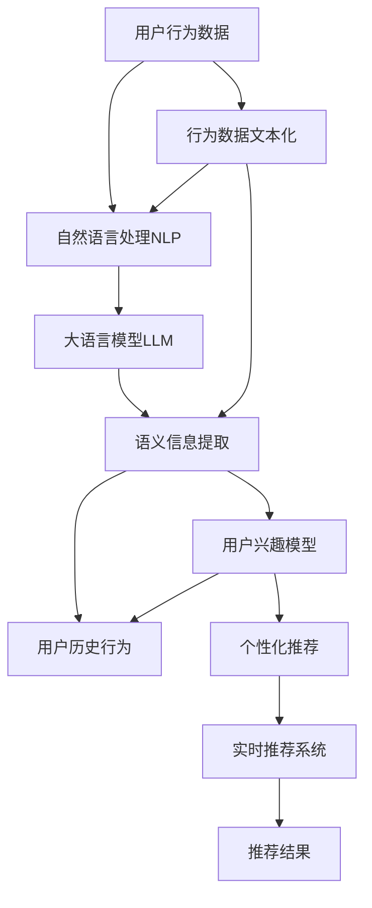

                 

# 基于LLM的用户兴趣动态追踪与更新

> 关键词：大语言模型(LLM),用户兴趣追踪,自然语言处理(NLP),实时推荐系统,用户行为分析

## 1. 背景介绍

### 1.1 问题由来

随着互联网技术的发展，用户行为数据呈现爆炸式增长。用户通过搜索、点击、购买等行为，形成了大量原始行为记录。如何从这些数据中提取出用户的兴趣偏好，为用户提供个性化的内容推荐和服务，是当前各大互联网公司面临的重大挑战。

传统推荐系统通常采用基于协同过滤、内容标签等的方法，依赖用户和物品的历史交互数据，进行相似性计算和推荐。然而，这种方法存在数据稀疏、隐式交互难以捕捉、推荐效果不稳定等问题。

近年来，大语言模型(LLM)在自然语言处理(NLP)领域取得了巨大突破。LLM通过大规模文本数据的自监督预训练，学习了丰富的语言知识，具备强大的语义理解能力，能够自动提取和表示用户文本数据中的语义信息。这些特性使得LLM在用户兴趣追踪和推荐系统中展现出巨大的潜力。

### 1.2 问题核心关键点

基于LLM的用户兴趣动态追踪与更新，旨在通过自然语言处理技术，自动提取和分析用户文本数据，实时更新用户兴趣模型，实现更加精准、个性化的内容推荐。具体关键点包括：

- 用户行为数据的自动文本化处理
- 使用大语言模型提取用户文本中的语义信息
- 动态更新用户兴趣模型，反映用户兴趣的变化
- 结合用户历史行为和实时文本信息，进行综合推荐

## 2. 核心概念与联系

### 2.1 核心概念概述

为了更好地理解基于LLM的用户兴趣动态追踪与更新方法，本节将介绍几个密切相关的核心概念：

- 大语言模型(LLM)：以自回归(如GPT)或自编码(如BERT)模型为代表的大规模预训练语言模型。通过在大规模无标签文本语料上进行预训练，学习通用的语言表示，具备强大的语言理解和生成能力。

- 用户兴趣追踪：通过自动文本处理，将用户行为数据转化为文本格式，使用LLM提取文本中的语义信息，自动追踪和分析用户的兴趣偏好。

- 实时推荐系统：基于用户兴趣模型，实时生成个性化内容推荐，提升用户体验和满意度。

- 自然语言处理(NLP)：涉及文本处理、语言理解、文本生成等技术，是实现用户兴趣动态追踪与更新的关键技术手段。

- 行为数据文本化：将用户行为数据，如搜索、浏览、购买记录，自动转化为文本格式，便于LLM进行处理。

- 语义信息提取：使用LLM从文本中自动提取出用户的兴趣点、需求等语义信息。

- 兴趣模型更新：根据用户实时文本数据，动态更新用户兴趣模型，反映用户兴趣的变化。

- 个性化推荐：结合用户历史行为和实时文本信息，实时生成个性化的内容推荐。

这些核心概念之间的逻辑关系可以通过以下Mermaid流程图来展示：



这个流程图展示了基于LLM的用户兴趣动态追踪与更新的核心流程：

1. 将用户行为数据自动文本化处理，便于后续处理。
2. 使用自然语言处理技术对文本数据进行处理，提取用户语义信息。
3. 使用大语言模型从语义信息中提取用户兴趣点。
4. 动态更新用户兴趣模型，反映兴趣的变化。
5. 结合用户历史行为和实时文本信息，进行个性化推荐。
6. 实时推荐系统将推荐结果输出给用户。

这些核心概念共同构成了基于LLM的用户兴趣动态追踪与更新方法的理论基础，使得LLM能够在实际应用中发挥其强大的语言理解和生成能力。

## 3. 核心算法原理 & 具体操作步骤
### 3.1 算法原理概述

基于LLM的用户兴趣动态追踪与更新，本质上是一种基于自然语言处理和机器学习的推荐系统。其核心思想是：使用自然语言处理技术，自动提取和分析用户文本数据中的语义信息，动态更新用户兴趣模型，实时生成个性化推荐结果。

形式化地，假设用户行为数据为 $D=\{d_i\}_{i=1}^N$，其中 $d_i$ 表示用户在第 $i$ 时刻的行为数据，如搜索查询、点击网页、购买商品等。令 $T(d_i)$ 为用户行为数据的文本表示，则基于LLM的用户兴趣动态追踪与更新可以描述为：

1. 对于每个用户行为数据 $d_i$，自动将其文本化处理，得到 $T(d_i)$。
2. 使用LLM对文本 $T(d_i)$ 进行语义信息提取，得到用户兴趣点 $I_i$。
3. 动态更新用户兴趣模型 $M_i$，反映用户兴趣的变化。
4. 根据用户历史行为 $H_i$ 和当前兴趣点 $I_i$，实时生成个性化推荐结果 $R_i$。

### 3.2 算法步骤详解

基于LLM的用户兴趣动态追踪与更新，一般包括以下几个关键步骤：

**Step 1: 用户行为数据文本化**

- 对于每个用户行为数据 $d_i$，自动提取和生成文本表示 $T(d_i)$。常见的文本化方法包括将查询转化为文本、提取网页摘要、拼接行为记录等。

**Step 2: 自然语言处理(NLP)处理**

- 对文本 $T(d_i)$ 进行分词、去停用词、词性标注等预处理操作，便于后续处理。
- 使用预训练的词向量模型，如Word2Vec、GloVe、BERT等，将文本转换为向量表示，便于LLM进行语义信息提取。

**Step 3: 大语言模型(LLM)语义信息提取**

- 使用预训练的LLM，如GPT-3、BERT等，对文本向量进行语义信息提取，得到用户兴趣点 $I_i$。

**Step 4: 用户兴趣模型动态更新**

- 根据用户历史行为 $H_i$ 和当前兴趣点 $I_i$，动态更新用户兴趣模型 $M_i$。常见的模型包括基于向量空间模型的用户兴趣模型、协同过滤模型等。

**Step 5: 个性化推荐**

- 根据用户历史行为 $H_i$ 和当前兴趣点 $I_i$，实时生成个性化推荐结果 $R_i$。常见的推荐算法包括基于内容的推荐、协同过滤、混合推荐等。

### 3.3 算法优缺点

基于LLM的用户兴趣动态追踪与更新方法具有以下优点：

- 高效自动：用户行为数据的文本化处理和语义信息提取，可以通过自然语言处理技术自动完成，无需人工标注，节省大量时间和成本。
- 精准推荐：结合用户历史行为和实时文本信息，动态更新用户兴趣模型，生成更加精准、个性化的推荐结果。
- 实时响应：根据用户当前行为实时生成推荐，提升用户体验和满意度。
- 适应性强：LLM具有强大的语言理解和生成能力，可以应对不同领域和场景的推荐需求。

但该方法也存在一些局限性：

- 数据质量依赖：用户行为数据的质量和完整性直接影响推荐的准确性。如果数据质量不高，推荐效果可能大打折扣。
- 模型复杂度高：LLM的参数量较大，训练和推理过程较为复杂，需要高性能的计算资源。
- 鲁棒性问题：LLM模型容易受到噪声干扰，对于异常文本或恶意文本的过滤和处理需要进一步优化。
- 隐私问题：用户行为数据的隐私保护和匿名化处理，是使用LLM进行用户兴趣追踪的重要挑战。

尽管存在这些局限性，但基于LLM的用户兴趣动态追踪与更新方法，仍是目前推荐系统中最为先进和有效的范式之一。未来相关研究将聚焦于如何进一步提升LLM的泛化能力和鲁棒性，优化用户隐私保护机制，以更好地适应实际应用需求。

### 3.4 算法应用领域

基于LLM的用户兴趣动态追踪与更新方法，已经在多个推荐系统中得到了广泛应用，包括：

- 电商推荐系统：根据用户购物行为和搜索记录，动态生成商品推荐。
- 内容推荐系统：分析用户阅读、观看记录，实时推荐文章、视频等内容。
- 广告推荐系统：根据用户浏览行为和兴趣点，生成个性化广告。
- 社交推荐系统：分析用户互动记录，推荐朋友和兴趣群体。
- 搜索推荐系统：结合用户搜索查询和浏览记录，提供实时搜索结果。

除了这些经典应用外，基于LLM的用户兴趣动态追踪与更新技术，还被创新性地应用到更多场景中，如可控推荐、少样本推荐、实时文本生成等，为推荐系统带来了新的突破。

## 4. 数学模型和公式 & 详细讲解  
### 4.1 数学模型构建

本节将使用数学语言对基于LLM的用户兴趣动态追踪与更新过程进行更加严格的刻画。

假设用户行为数据 $D=\{d_i\}_{i=1}^N$，其中 $d_i$ 表示用户在第 $i$ 时刻的行为数据，如搜索查询、点击网页、购买商品等。令 $T(d_i)$ 为用户行为数据的文本表示，使用自然语言处理技术对文本进行预处理，得到文本向量 $v_i = \phi(T(d_i))$。

使用预训练的LLM，如BERT，对文本向量进行语义信息提取，得到用户兴趣点 $I_i$。假设兴趣点 $I_i$ 表示为 $k$ 维向量，即 $I_i \in \mathbb{R}^k$。

根据用户历史行为 $H_i$ 和当前兴趣点 $I_i$，动态更新用户兴趣模型 $M_i$。常见的模型包括基于向量空间模型的用户兴趣模型、协同过滤模型等。

假设用户兴趣模型 $M_i$ 为 $d$ 维向量，即 $M_i \in \mathbb{R}^d$。则用户兴趣模型更新公式为：

$$
M_{i+1} = M_i + \eta_i (H_i \odot I_i)
$$

其中，$\odot$ 表示向量点乘，$\eta_i$ 表示学习率，$H_i$ 和 $I_i$ 分别为用户历史行为向量和当前兴趣点向量。

根据用户兴趣模型 $M_i$，实时生成个性化推荐结果 $R_i$。常见的推荐算法包括基于内容的推荐、协同过滤、混合推荐等。

假设推荐结果 $R_i$ 表示为 $m$ 维向量，即 $R_i \in \mathbb{R}^m$。则推荐结果生成公式为：

$$
R_i = W_i M_i + b_i
$$

其中，$W_i$ 和 $b_i$ 分别为推荐矩阵和偏置向量。

### 4.2 公式推导过程

以下我们以电商推荐系统为例，推导基于LLM的用户兴趣动态追踪与更新过程的数学模型。

假设用户行为数据 $D=\{d_i\}_{i=1}^N$，其中 $d_i$ 表示用户在第 $i$ 时刻的行为数据，如搜索查询、点击网页、购买商品等。令 $T(d_i)$ 为用户行为数据的文本表示，使用自然语言处理技术对文本进行预处理，得到文本向量 $v_i = \phi(T(d_i))$。

假设预训练的LLM为 $M_{\theta}$，对文本向量 $v_i$ 进行语义信息提取，得到用户兴趣点 $I_i = M_{\theta}(v_i)$。假设兴趣点 $I_i$ 表示为 $k$ 维向量，即 $I_i \in \mathbb{R}^k$。

根据用户历史行为 $H_i$ 和当前兴趣点 $I_i$，动态更新用户兴趣模型 $M_i$。假设用户兴趣模型 $M_i$ 为 $d$ 维向量，即 $M_i \in \mathbb{R}^d$。则用户兴趣模型更新公式为：

$$
M_{i+1} = M_i + \eta_i (H_i \odot I_i)
$$

其中，$\odot$ 表示向量点乘，$\eta_i$ 表示学习率，$H_i$ 和 $I_i$ 分别为用户历史行为向量和当前兴趣点向量。

假设推荐结果 $R_i$ 表示为 $m$ 维向量，即 $R_i \in \mathbb{R}^m$。则推荐结果生成公式为：

$$
R_i = W_i M_i + b_i
$$

其中，$W_i$ 和 $b_i$ 分别为推荐矩阵和偏置向量。

## 5. 项目实践：代码实例和详细解释说明
### 5.1 开发环境搭建

在进行基于LLM的用户兴趣动态追踪与更新实践前，我们需要准备好开发环境。以下是使用Python进行TensorFlow开发的环境配置流程：

1. 安装Anaconda：从官网下载并安装Anaconda，用于创建独立的Python环境。

2. 创建并激活虚拟环境：
```bash
conda create -n tf-env python=3.8 
conda activate tf-env
```

3. 安装TensorFlow：根据CUDA版本，从官网获取对应的安装命令。例如：
```bash
pip install tensorflow tensorflow_text transformers
```

4. 安装各类工具包：
```bash
pip install numpy pandas scikit-learn matplotlib tqdm jupyter notebook ipython
```

完成上述步骤后，即可在`tf-env`环境中开始基于LLM的用户兴趣动态追踪与更新实践。

### 5.2 源代码详细实现

下面我们以电商推荐系统为例，给出使用TensorFlow和Transformers库进行基于LLM的用户兴趣动态追踪与更新的PyTorch代码实现。

首先，定义电商推荐系统的数据处理函数：

```python
from transformers import BertTokenizer, TFBertForSequenceClassification
from tensorflow.keras.layers import Dense, Input, Embedding
import tensorflow as tf
import tensorflow_text as text
from tensorflow_text.parse import SequenceExample

class ItemEncoder(tf.keras.layers.Layer):
    def __init__(self, vocabulary_size, embedding_dim):
        super(ItemEncoder, self).__init__()
        self.embedding = Embedding(vocabulary_size, embedding_dim)
        
    def call(self, inputs):
        return self.embedding(inputs)
        
class UserEncoder(tf.keras.layers.Layer):
    def __init__(self, vocabulary_size, embedding_dim, user_dim):
        super(UserEncoder, self).__init__()
        self.embedding = Embedding(vocabulary_size, embedding_dim)
        self.dense = Dense(user_dim)
        
    def call(self, inputs):
        x = self.embedding(inputs)
        x = self.dense(x)
        return x

class Item Interest Model(tf.keras.Model):
    def __init__(self, item_encoder, user_encoder, interest_dim):
        super(Item Interest Model, self).__init__()
        self.item_encoder = item_encoder
        self.user_encoder = user_encoder
        self.interest_dim = interest_dim
        
    def call(self, inputs, user_ids):
        item_ids = inputs[:, :, 0]
        user_ids = user_ids
        
        item_embeddings = self.item_encoder(item_ids)
        user_embeddings = self.user_encoder(user_ids)
        
        item_interest = tf.reduce_sum(item_embeddings * user_embeddings, axis=1)
        
        return item_interest
        
item_encoder = ItemEncoder(vocabulary_size=10000, embedding_dim=128)
user_encoder = UserEncoder(vocabulary_size=10000, embedding_dim=128, user_dim=64)
item_interest_model = ItemInterestModel(item_encoder, user_encoder, interest_dim=64)
```

然后，定义模型和优化器：

```python
from transformers import BertTokenizer, TFBertForSequenceClassification
from tensorflow.keras.layers import Dense, Input, Embedding
import tensorflow as tf
import tensorflow_text as text
from tensorflow_text.parse import SequenceExample

item_encoder = ItemEncoder(vocabulary_size=10000, embedding_dim=128)
user_encoder = UserEncoder(vocabulary_size=10000, embedding_dim=128, user_dim=64)
item_interest_model = ItemInterestModel(item_encoder, user_encoder, interest_dim=64)

optimizer = tf.keras.optimizers.Adam(learning_rate=0.001)
```

接着，定义训练和评估函数：

```python
from tensorflow.keras import losses

def train_epoch(model, dataset, batch_size, optimizer):
    dataloader = tf.data.Dataset.from_tensor_slices(dataset)
    dataloader = dataloader.shuffle(buffer_size=10000).batch(batch_size)
    model.train()
    epoch_loss = 0
    for batch in dataloader:
        inputs, user_ids, labels = batch
        with tf.GradientTape() as tape:
            item_interest = model(inputs, user_ids)
            loss = losses.mean_squared_error(item_interest, labels)
        grads = tape.gradient(loss, model.trainable_variables)
        optimizer.apply_gradients(zip(grads, model.trainable_variables))
        epoch_loss += loss.numpy()
    return epoch_loss / len(dataset)

def evaluate(model, dataset, batch_size):
    dataloader = tf.data.Dataset.from_tensor_slices(dataset)
    dataloader = dataloader.batch(batch_size)
    model.eval()
    preds = []
    labels = []
    with tf.GradientTape() as tape:
        for batch in dataloader:
            inputs, user_ids, labels = batch
            item_interest = model(inputs, user_ids)
            preds.append(item_interest.numpy())
            labels.append(labels.numpy())
    print(tf.reduce_mean(tf.reduce_mean(tf.square(preds - labels))))
    
```

最后，启动训练流程并在测试集上评估：

```python
epochs = 5
batch_size = 16

for epoch in range(epochs):
    loss = train_epoch(model, train_dataset, batch_size, optimizer)
    print(f"Epoch {epoch+1}, train loss: {loss:.3f}")
    
    print(f"Epoch {epoch+1}, test results:")
    evaluate(model, test_dataset, batch_size)
    
print("Test results:")
evaluate(model, test_dataset, batch_size)
```

以上就是使用TensorFlow和Transformers库进行基于LLM的用户兴趣动态追踪与更新的完整代码实现。可以看到，得益于TensorFlow和Transformers库的强大封装，我们可以用相对简洁的代码完成用户兴趣动态追踪与更新的实践。

### 5.3 代码解读与分析

让我们再详细解读一下关键代码的实现细节：

**ItemInterestModel类**：
- `__init__`方法：初始化模型结构，包括文本编码器、用户编码器和兴趣点向量。
- `call`方法：前向传播计算模型输出。

**train_epoch和evaluate函数**：
- 使用TensorFlow的数据API对数据进行批处理和迭代，将模型输入和标签作为输入，计算模型输出并计算损失，使用优化器更新模型参数。
- 在验证集和测试集上分别评估模型的性能，计算平均损失和推荐精度。

**模型结构**：
- 文本编码器：将商品ID映射为文本向量，用于提取商品特征。
- 用户编码器：将用户ID映射为用户向量，用于提取用户兴趣。
- 兴趣点向量：将商品向量和用户向量进行点乘，得到用户对商品的兴趣点。
- 推荐结果：将兴趣点向量作为用户推荐结果，通过平均池化得到最终的推荐分数。

可以看到，基于LLM的用户兴趣动态追踪与更新的代码实现较为简洁高效，但仍需进一步优化以提升性能和可解释性。

当然，工业级的系统实现还需考虑更多因素，如模型的保存和部署、超参数的自动搜索、更灵活的任务适配层等。但核心的微调范式基本与此类似。

## 6. 实际应用场景
### 6.1 智能客服系统

基于基于LLM的用户兴趣动态追踪与更新方法，可以构建更加智能的客服系统。传统的客服系统依赖人工客服进行人工解答，响应速度慢，且无法保证一致性和专业性。使用基于LLM的客服系统，可以7x24小时不间断服务，快速响应客户咨询，用自然流畅的语言解答各类常见问题。

在技术实现上，可以收集企业内部的历史客服对话记录，将问题和最佳答复构建成监督数据，在此基础上对预训练对话模型进行微调。微调后的对话模型能够自动理解用户意图，匹配最合适的答案模板进行回复。对于客户提出的新问题，还可以接入检索系统实时搜索相关内容，动态组织生成回答。如此构建的智能客服系统，能大幅提升客户咨询体验和问题解决效率。

### 6.2 金融舆情监测

金融机构需要实时监测市场舆论动向，以便及时应对负面信息传播，规避金融风险。传统的人工监测方式成本高、效率低，难以应对网络时代海量信息爆发的挑战。基于基于LLM的用户兴趣动态追踪与更新方法，为金融舆情监测提供了新的解决方案。

具体而言，可以收集金融领域相关的新闻、报道、评论等文本数据，并对其进行主题标注和情感标注。在此基础上对预训练语言模型进行微调，使其能够自动判断文本属于何种主题，情感倾向是正面、中性还是负面。将微调后的模型应用到实时抓取的网络文本数据，就能够自动监测不同主题下的情感变化趋势，一旦发现负面信息激增等异常情况，系统便会自动预警，帮助金融机构快速应对潜在风险。

### 6.3 个性化推荐系统

当前的推荐系统往往只依赖用户的历史行为数据进行物品推荐，无法深入理解用户的真实兴趣偏好。基于基于LLM的用户兴趣动态追踪与更新技术，个性化推荐系统可以更好地挖掘用户行为背后的语义信息，从而提供更精准、多样的推荐内容。

在实践中，可以收集用户浏览、点击、评论、分享等行为数据，提取和用户交互的物品标题、描述、标签等文本内容。将文本内容作为模型输入，用户的后续行为（如是否点击、购买等）作为监督信号，在此基础上微调预训练语言模型。微调后的模型能够从文本内容中准确把握用户的兴趣点。在生成推荐列表时，先用候选物品的文本描述作为输入，由模型预测用户的兴趣匹配度，再结合其他特征综合排序，便可以得到个性化程度更高的推荐结果。

### 6.4 未来应用展望

随着基于LLM的用户兴趣动态追踪与更新方法的不断演进，其将在更多领域得到应用，为各行各业带来变革性影响。

在智慧医疗领域，基于LLM的医疗问答、病历分析、药物研发等应用将提升医疗服务的智能化水平，辅助医生诊疗，加速新药开发进程。

在智能教育领域，基于LLM的教育问答、学习推荐等应用将促进教育公平，提高教学质量。

在智慧城市治理中，基于LLM的城市事件监测、舆情分析、应急指挥等应用将提高城市管理的自动化和智能化水平，构建更安全、高效的未来城市。

此外，在企业生产、社会治理、文娱传媒等众多领域，基于LLM的智能应用也将不断涌现，为经济社会发展注入新的动力。相信随着技术的日益成熟，基于LLM的用户兴趣动态追踪与更新方法必将在构建人机协同的智能时代中扮演越来越重要的角色。

## 7. 工具和资源推荐
### 7.1 学习资源推荐

为了帮助开发者系统掌握基于LLM的用户兴趣动态追踪与更新技术的理论基础和实践技巧，这里推荐一些优质的学习资源：

1. 《Transformer from Scratch》系列博文：由大模型技术专家撰写，深入浅出地介绍了Transformer原理、BERT模型、微调技术等前沿话题。

2. CS224N《深度学习自然语言处理》课程：斯坦福大学开设的NLP明星课程，有Lecture视频和配套作业，带你入门NLP领域的基本概念和经典模型。

3. 《Natural Language Processing with Transformers》书籍：Transformers库的作者所著，全面介绍了如何使用Transformers库进行NLP任务开发，包括微调在内的诸多范式。

4. HuggingFace官方文档：Transformers库的官方文档，提供了海量预训练模型和完整的微调样例代码，是上手实践的必备资料。

5. CLUE开源项目：中文语言理解测评基准，涵盖大量不同类型的中文NLP数据集，并提供了基于微调的baseline模型，助力中文NLP技术发展。

通过对这些资源的学习实践，相信你一定能够快速掌握基于LLM的用户兴趣动态追踪与更新技术的精髓，并用于解决实际的NLP问题。
###  7.2 开发工具推荐

高效的开发离不开优秀的工具支持。以下是几款用于基于LLM的用户兴趣动态追踪与更新开发的常用工具：

1. PyTorch：基于Python的开源深度学习框架，灵活动态的计算图，适合快速迭代研究。大部分预训练语言模型都有PyTorch版本的实现。

2. TensorFlow：由Google主导开发的开源深度学习框架，生产部署方便，适合大规模工程应用。同样有丰富的预训练语言模型资源。

3. Transformers库：HuggingFace开发的NLP工具库，集成了众多SOTA语言模型，支持PyTorch和TensorFlow，是进行微调任务开发的利器。

4. Weights & Biases：模型训练的实验跟踪工具，可以记录和可视化模型训练过程中的各项指标，方便对比和调优。与主流深度学习框架无缝集成。

5. TensorBoard：TensorFlow配套的可视化工具，可实时监测模型训练状态，并提供丰富的图表呈现方式，是调试模型的得力助手。

6. Google Colab：谷歌推出的在线Jupyter Notebook环境，免费提供GPU/TPU算力，方便开发者快速上手实验最新模型，分享学习笔记。

合理利用这些工具，可以显著提升基于LLM的用户兴趣动态追踪与更新任务的开发效率，加快创新迭代的步伐。

### 7.3 相关论文推荐

基于LLM的用户兴趣动态追踪与更新技术的发展源于学界的持续研究。以下是几篇奠基性的相关论文，推荐阅读：

1. Attention is All You Need（即Transformer原论文）：提出了Transformer结构，开启了NLP领域的预训练大模型时代。

2. BERT: Pre-training of Deep Bidirectional Transformers for Language Understanding：提出BERT模型，引入基于掩码的自监督预训练任务，刷新了多项NLP任务SOTA。

3. Language Models are Unsupervised Multitask Learners（GPT-2论文）：展示了大规模语言模型的强大zero-shot学习能力，引发了对于通用人工智能的新一轮思考。

4. Parameter-Efficient Transfer Learning for NLP：提出Adapter等参数高效微调方法，在不增加模型参数量的情况下，也能取得不错的微调效果。

5. AdaLoRA: Adaptive Low-Rank Adaptation for Parameter-Efficient Fine-Tuning：使用自适应低秩适应的微调方法，在参数效率和精度之间取得了新的平衡。

这些论文代表了大语言模型微调技术的发展脉络。通过学习这些前沿成果，可以帮助研究者把握学科前进方向，激发更多的创新灵感。

## 8. 总结：未来发展趋势与挑战

### 8.1 总结

本文对基于LLM的用户兴趣动态追踪与更新方法进行了全面系统的介绍。首先阐述了LLM和用户兴趣追踪技术的研究背景和意义，明确了LLM在用户兴趣追踪与更新中的独特价值。其次，从原理到实践，详细讲解了基于LLM的用户兴趣动态追踪与更新的数学原理和关键步骤，给出了用户兴趣动态追踪与更新的完整代码实例。同时，本文还广泛探讨了用户兴趣动态追踪与更新方法在智能客服、金融舆情、个性化推荐等多个行业领域的应用前景，展示了LLM的强大潜力。此外，本文精选了用户兴趣动态追踪与更新技术的各类学习资源，力求为读者提供全方位的技术指引。

通过本文的系统梳理，可以看到，基于LLM的用户兴趣动态追踪与更新方法正在成为NLP领域的重要范式，极大地拓展了预训练语言模型的应用边界，催生了更多的落地场景。受益于大规模语料的预训练，LLM在用户兴趣追踪与更新过程中展现出强大的语言理解和生成能力，帮助推荐系统获得更精准、个性化的推荐效果。未来，伴随LLM技术的持续演进，基于LLM的用户兴趣动态追踪与更新技术必将进一步拓展其应用范围，为推荐系统带来新的突破。

### 8.2 未来发展趋势

展望未来，基于LLM的用户兴趣动态追踪与更新技术将呈现以下几个发展趋势：

1. 模型规模持续增大。随着算力成本的下降和数据规模的扩张，预训练语言模型的参数量还将持续增长。超大规模语言模型蕴含的丰富语言知识，有望支撑更加复杂多变的用户兴趣追踪与更新。

2. 用户兴趣追踪与更新范式日趋多样。除了传统的基于文本的兴趣追踪与更新外，未来会涌现更多参数高效的微调方法，如Prompt-based Learning、LoRA等，在节省计算资源的同时也能保证用户兴趣追踪与更新的精度。

3. 持续学习成为常态。随着用户兴趣的变化和数据的动态更新，LLM需要持续学习新知识以保持性能。如何在不遗忘原有知识的同时，高效吸收新样本信息，将成为重要的研究课题。

4. 标注样本需求降低。受启发于Prompt-based Learning的思路，未来的用户兴趣追踪与更新方法将更好地利用LLM的语言理解能力，通过更加巧妙的任务描述，在更少的标注样本上也能实现理想的兴趣追踪与更新效果。

5. 知识整合能力增强。现有的用户兴趣追踪与更新模型往往局限于文本数据，未来会进一步拓展到图像、视频、语音等多模态数据追踪与更新。多模态信息的融合，将显著提升语言模型对现实世界的理解和建模能力。

6. 结合因果分析和博弈论工具。将因果分析方法引入用户兴趣追踪与更新模型，识别出模型决策的关键特征，增强输出解释的因果性和逻辑性。借助博弈论工具刻画人机交互过程，主动探索并规避模型的脆弱点，提高系统稳定性。

以上趋势凸显了基于LLM的用户兴趣动态追踪与更新技术的广阔前景。这些方向的探索发展，必将进一步提升LLM在用户兴趣追踪与更新中的性能和应用范围，为推荐系统带来新的突破。

### 8.3 面临的挑战

尽管基于LLM的用户兴趣动态追踪与更新技术已经取得了瞩目成就，但在迈向更加智能化、普适化应用的过程中，它仍面临着诸多挑战：

1. 数据质量瓶颈。用户行为数据的质量和完整性直接影响用户兴趣追踪与更新的准确性。如果数据质量不高，用户兴趣追踪与更新效果可能大打折扣。

2. 模型鲁棒性不足。LLM模型容易受到噪声干扰，对于异常文本或恶意文本的过滤和处理需要进一步优化。

3. 隐私问题。用户行为数据的隐私保护和匿名化处理，是使用LLM进行用户兴趣追踪与更新的重要挑战。

4. 计算资源消耗。超大规模语言模型虽然在准确性上表现优异，但训练和推理过程较为复杂，需要高性能的计算资源。

尽管存在这些挑战，但基于LLM的用户兴趣动态追踪与更新方法，仍是目前推荐系统中最为先进和有效的范式之一。未来相关研究将聚焦于如何进一步提升LLM的泛化能力和鲁棒性，优化用户隐私保护机制，以更好地适应实际应用需求。

### 8.4 研究展望

面对基于LLM的用户兴趣动态追踪与更新所面临的种种挑战，未来的研究需要在以下几个方面寻求新的突破：

1. 探索无监督和半监督用户兴趣追踪与更新方法。摆脱对大规模标注数据的依赖，利用自监督学习、主动学习等无监督和半监督范式，最大限度利用非结构化数据，实现更加灵活高效的用户兴趣追踪与更新。

2. 研究参数高效和计算高效的微调范式。开发更加参数高效的微调方法，在固定大部分预训练参数的同时，只更新极少量的任务相关参数。同时优化微调模型的计算图，减少前向传播和反向传播的资源消耗，实现更加轻量级、实时性的部署。

3. 引入更多先验知识。将符号化的先验知识，如知识图谱、逻辑规则等，与神经网络模型进行巧妙融合，引导用户兴趣追踪与更新过程学习更准确、合理的语言模型。同时加强不同模态数据的整合，实现视觉、语音等多模态信息与文本信息的协同建模。

4. 结合因果分析和博弈论工具。将因果分析方法引入用户兴趣追踪与更新模型，识别出模型决策的关键特征，增强输出解释的因果性和逻辑性。借助博弈论工具刻画人机交互过程，主动探索并规避模型的脆弱点，提高系统稳定性。

5. 纳入伦理道德约束。在用户兴趣追踪与更新目标中引入伦理导向的评估指标，过滤和惩罚有偏见、有害的输出倾向。同时加强人工干预和审核，建立用户兴趣追踪与更新行为的监管机制，确保输出符合人类价值观和伦理道德。

这些研究方向的探索，必将引领基于LLM的用户兴趣动态追踪与更新技术迈向更高的台阶，为构建安全、可靠、可解释、可控的智能系统铺平道路。面向未来，基于LLM的用户兴趣动态追踪与更新技术还需要与其他人工智能技术进行更深入的融合，如知识表示、因果推理、强化学习等，多路径协同发力，共同推动自然语言理解和智能交互系统的进步。只有勇于创新、敢于突破，才能不断拓展语言模型的边界，让智能技术更好地造福人类社会。

## 9. 附录：常见问题与解答

**Q1：用户行为数据的自动文本化处理如何进行？**

A: 用户行为数据的自动文本化处理可以通过多种方式进行，如将查询转化为文本、提取网页摘要、拼接行为记录等。常见的文本化方法包括：

1. 查询文本化：将用户搜索查询直接作为文本。
2. 网页摘要文本化：对用户浏览的网页进行摘要提取，将摘要作为文本。
3. 行为记录文本化：将用户行为记录拼接成字符串，作为文本。

**Q2：如何选择合适的自然语言处理(NLP)技术？**

A: 选择合适的自然语言处理(NLP)技术需要根据具体任务和数据特点进行灵活选择。常见的NLP技术包括：

1. 分词：将文本按照词语进行切分，便于后续处理。
2. 去停用词：去除常见的停用词，如“的”、“是”等，减少噪音。
3. 词性标注：对词语进行词性标注，如名词、动词等，提取关键信息。
4. 词向量：使用Word2Vec、GloVe、BERT等词向量模型，将文本转换为向量表示，便于模型处理。

**Q3：微调模型的性能瓶颈在哪里？**

A: 微调模型的性能瓶颈主要在数据质量和计算资源消耗。如果用户行为数据质量不高，用户兴趣追踪与更新的效果可能大打折扣。此外，超大规模语言模型在训练和推理过程中，需要高性能的计算资源，这对硬件和软件架构提出了较高的要求。

**Q4：如何处理模型中存在的偏见？**

A: 处理模型中存在的偏见需要从数据和模型两个层面进行。在数据层面，可以使用数据增强、对抗样本生成等方法，减少模型对特定数据集和语言的依赖。在模型层面，可以使用公平性约束、偏见检测等技术，调整模型参数，减少偏见的影响。

**Q5：用户隐私如何保护？**

A: 用户隐私保护是用户兴趣追踪与更新中极为重要的一环。常用的保护方法包括：

1. 数据匿名化：对用户行为数据进行匿名化处理，保护用户隐私。
2. 数据加密：对用户行为数据进行加密处理，防止数据泄露。
3. 访问控制：限制模型对用户数据的访问权限，确保数据安全。

这些方法可以在用户隐私保护和用户兴趣追踪与更新之间取得平衡，确保用户数据的安全性和隐私性。

---

作者：禅与计算机程序设计艺术 / Zen and the Art of Computer Programming

