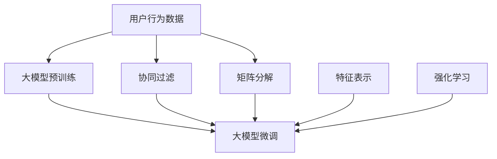

                 

# 基于大模型的推荐系统用户兴趣建模

> 关键词：大模型推荐系统、用户兴趣建模、协同过滤、矩阵分解、深度学习、神经网络、强化学习、自适应、推荐精度、数据稀疏性

## 1. 背景介绍

在当今信息爆炸的时代，用户在海量数据中找到自己感兴趣的内容成为了一个巨大的挑战。推荐系统作为连接用户和内容的桥梁，其优劣直接影响了用户的使用体验和满意度。传统的推荐系统，如基于协同过滤和矩阵分解的方法，虽然能取得不错的推荐精度，但在数据稀疏性和扩展性方面存在一定局限。随着深度学习和大模型技术的发展，推荐系统逐渐从浅层模型向深层模型演变，开始探索利用大模型进行用户兴趣建模。

### 1.1 问题由来
现代推荐系统主要分为基于内容的推荐和协同过滤推荐两类。基于内容的推荐方法通过分析用户历史行为数据和物品属性信息，来预测用户可能感兴趣的内容。协同过滤推荐则通过用户和物品之间的相似度计算，寻找与目标用户相似的用户群，推荐其感兴趣的内容。然而，这两种方法都存在各自的缺点：

- 基于内容的推荐方法需要对物品的特征进行手工设计，难以涵盖所有可能的特征，且需要大量的物品标签数据。
- 协同过滤方法在数据稀疏性问题上表现较差，难以处理用户历史行为不足或物品标签缺失的情况。

为了克服上述问题，研究人员开始探索利用大模型进行推荐系统用户兴趣建模的方法。通过在大规模无标签数据上预训练语言模型或神经网络，并在推荐任务上进行微调，大模型能够自然地学习到用户兴趣和物品特征之间的关系，且对数据稀疏性具有更好的鲁棒性。本文将重点介绍基于大模型的推荐系统用户兴趣建模技术，并探讨其在推荐系统中的应用。

### 1.2 问题核心关键点
大模型推荐系统用户兴趣建模的核心关键点包括：

1. **预训练与微调**：利用大规模无标签数据预训练语言模型或神经网络，并在推荐任务上进行微调，学习用户兴趣和物品特征之间的映射关系。
2. **特征表示**：大模型能够自动学习用户和物品的语义特征表示，且可以融合更多的领域知识，提升推荐效果。
3. **分布式训练**：大模型通常需要分布在多个GPU或TPU上进行训练，以处理大规模数据和复杂的计算图。
4. **稀疏性处理**：大模型对数据稀疏性具有较好的鲁棒性，能够处理用户历史行为不足或物品标签缺失的情况。
5. **可解释性**：大模型通常较为复杂，难以解释其内部的决策过程，需要结合可视化工具辅助理解。

## 2. 核心概念与联系

### 2.1 核心概念概述

为了更好地理解基于大模型的推荐系统用户兴趣建模方法，本节将介绍几个关键概念：

- **推荐系统**：根据用户的历史行为和兴趣，为用户推荐个性化内容或物品的系统。
- **协同过滤**：通过用户-物品矩阵的相似度计算，为用户推荐相似物品的技术。
- **矩阵分解**：通过将用户-物品矩阵分解为低维用户向量和物品向量，进行推荐预测的技术。
- **深度学习**：利用多层神经网络进行非线性特征学习的技术。
- **大模型**：通过大规模无标签数据预训练，并在特定任务上进行微调的神经网络模型。
- **特征表示学习**：自动学习用户和物品特征表示的技术。
- **强化学习**：通过奖惩机制，优化模型参数以提升推荐效果的技术。

这些概念之间具有紧密的联系，共同构成了推荐系统用户兴趣建模的框架。通过大模型的预训练和微调，可以学习到用户和物品的深层次特征表示，结合协同过滤、矩阵分解等方法，能够构建更加精确和鲁棒的推荐系统。

### 2.2 核心概念原理和架构的 Mermaid 流程图



这个流程图展示了基于大模型的推荐系统用户兴趣建模的核心架构：

1. **用户行为数据**：从不同渠道收集用户的历史行为数据，如点击、浏览、购买等。
2. **协同过滤**：通过计算用户-物品矩阵的相似度，找到相似用户群。
3. **矩阵分解**：将用户-物品矩阵分解为低维用户向量和物品向量，进行推荐预测。
4. **大模型预训练**：在大规模无标签数据上预训练语言模型或神经网络，学习通用特征表示。
5. **大模型微调**：在推荐任务上进行微调，学习用户兴趣和物品特征的映射关系。
6. **特征表示学习**：利用大模型自动学习用户和物品的语义特征表示。
7. **强化学习**：通过奖惩机制，优化大模型的参数，提升推荐效果。

这些步骤共同构成了一个完整的基于大模型的推荐系统用户兴趣建模流程。

## 3. 核心算法原理 & 具体操作步骤

### 3.1 算法原理概述

基于大模型的推荐系统用户兴趣建模，本质上是一个特征表示学习过程。其核心思想是：利用大规模无标签数据预训练语言模型或神经网络，并在推荐任务上进行微调，学习用户兴趣和物品特征之间的映射关系。

形式化地，假设用户行为数据表示为用户-物品矩阵 $\mathbf{U}$，其中每一行表示用户的行为记录，每一列表示物品的特征。假设预训练的语言模型或神经网络为 $M_{\theta}$，其中 $\theta$ 为预训练得到的模型参数。通过在大规模无标签数据上预训练模型，使其学习到通用的特征表示。在推荐任务上，利用标注数据 $\{(\mathbf{x}_i, \mathbf{y}_i)\}_{i=1}^N$，其中 $\mathbf{x}_i$ 表示用户行为记录，$\mathbf{y}_i$ 表示物品的标签。将 $\mathbf{U}$ 作为模型输入，通过微调学习用户兴趣和物品特征之间的映射关系。

微调的优化目标是最小化预测误差，即：

$$
\min_{\theta} \sum_{i=1}^N \ell(M_{\theta}(\mathbf{x}_i),\mathbf{y}_i)
$$

其中 $\ell$ 为损失函数，可以是交叉熵损失、均方误差损失等。通过梯度下降等优化算法，微调过程不断更新模型参数 $\theta$，最小化损失函数。

### 3.2 算法步骤详解

基于大模型的推荐系统用户兴趣建模通常包括以下几个关键步骤：

**Step 1: 准备数据集和预训练模型**

1. **数据集准备**：收集用户行为数据，如点击、浏览、购买等，并转换为用户-物品矩阵 $\mathbf{U}$。
2. **预训练模型选择**：选择合适的预训练模型，如BERT、GPT等，作为初始化参数。

**Step 2: 添加推荐适配层**

1. **模型适配**：根据推荐任务类型，设计合适的输出层和损失函数。对于推荐任务，通常使用交叉熵损失。
2. **特征融合**：将用户-物品矩阵 $\mathbf{U}$ 输入预训练模型，学习用户兴趣和物品特征的映射关系。

**Step 3: 设置微调超参数**

1. **优化算法选择**：选择合适的优化算法，如Adam、SGD等，设置学习率、批大小、迭代轮数等。
2. **正则化技术应用**：使用L2正则、Dropout、Early Stopping等技术，防止过拟合。
3. **参数冻结策略**：选择冻结预训练参数的部分层，只微调顶层。

**Step 4: 执行梯度训练**

1. **数据批处理**：将用户-物品矩阵 $\mathbf{U}$ 分批次输入模型，前向传播计算损失函数。
2. **反向传播计算梯度**：反向传播计算模型参数梯度，使用优化算法更新模型参数。
3. **验证集评估**：周期性在验证集上评估模型性能，根据性能指标决定是否停止训练。
4. **重复迭代**：重复上述步骤直至满足预设的迭代轮数或性能指标。

**Step 5: 测试和部署**

1. **测试集评估**：在测试集上评估微调后模型的推荐精度，对比微调前后的精度提升。
2. **部署应用**：将微调后的模型集成到推荐系统中，提供实时推荐服务。
3. **持续学习**：持续收集新的数据，定期重新微调模型，以适应数据分布的变化。

以上是基于大模型的推荐系统用户兴趣建模的一般流程。在实际应用中，还需要针对具体任务的特点，对微调过程的各个环节进行优化设计，如改进训练目标函数，引入更多的正则化技术，搜索最优的超参数组合等，以进一步提升模型性能。

### 3.3 算法优缺点

基于大模型的推荐系统用户兴趣建模方法具有以下优点：

1. **特征表示能力强**：大模型能够自动学习用户和物品的语义特征表示，融合更多领域知识，提升推荐精度。
2. **鲁棒性好**：大模型对数据稀疏性具有较好的鲁棒性，能够处理用户历史行为不足或物品标签缺失的情况。
3. **扩展性强**：大模型通常能够扩展到多维特征，如文本、图像、音频等，提升推荐系统的多样性。
4. **可解释性差**：大模型通常较为复杂，难以解释其内部的决策过程，需要结合可视化工具辅助理解。

同时，该方法也存在一些局限：

1. **计算资源需求高**：大模型通常需要分布在多个GPU或TPU上进行训练，需要较高的计算资源。
2. **微调成本高**：微调过程需要大量的标注数据和计算资源，增加了推荐系统的开发和维护成本。
3. **模型复杂度高**：大模型的参数量较大，复杂度较高，可能引入过拟合问题。

尽管存在这些局限，但就目前而言，基于大模型的推荐系统用户兴趣建模方法在推荐精度和扩展性方面表现出色，已成为推荐系统研究的重要方向。未来相关研究的重点在于如何进一步降低微调成本，提高模型可解释性，以及探索新的模型架构和优化算法。

### 3.4 算法应用领域

基于大模型的推荐系统用户兴趣建模方法，已在多个领域得到了广泛的应用，例如：

- **电商推荐**：为电商平台的商品推荐系统提供个性化推荐服务，提升用户购物体验。
- **视频推荐**：为视频平台的内容推荐系统推荐用户感兴趣的视频，增加平台粘性。
- **新闻推荐**：为用户推荐相关新闻，提升用户阅读体验。
- **音乐推荐**：为音乐平台推荐用户喜欢的音乐，提升用户听歌体验。

除了上述这些经典应用外，基于大模型的推荐系统用户兴趣建模方法还在社交网络、在线教育、金融理财等多个领域得到了广泛应用，显著提升了推荐系统的个性化和鲁棒性。

## 4. 数学模型和公式 & 详细讲解 & 举例说明

### 4.1 数学模型构建

本节将使用数学语言对基于大模型的推荐系统用户兴趣建模过程进行更加严格的刻画。

记用户行为数据为 $\mathbf{U} \in \mathbb{R}^{N \times M}$，其中每一行表示用户的行为记录，每一列表示物品的特征。假设预训练的语言模型或神经网络为 $M_{\theta}$，其中 $\theta$ 为预训练得到的模型参数。

定义模型 $M_{\theta}$ 在用户行为数据 $\mathbf{U}$ 上的损失函数为 $\ell(\mathbf{U},\theta)$，则在数据集 $D=\{(\mathbf{x}_i, \mathbf{y}_i)\}_{i=1}^N$ 上的经验风险为：

$$
\mathcal{L}(\theta) = \frac{1}{N} \sum_{i=1}^N \ell(M_{\theta}(\mathbf{x}_i),\mathbf{y}_i)
$$

其中 $\mathbf{x}_i$ 表示用户行为记录，$\mathbf{y}_i$ 表示物品的标签。微调的优化目标是最小化经验风险，即找到最优参数：

$$
\theta^* = \mathop{\arg\min}_{\theta} \mathcal{L}(\theta)
$$

在实践中，我们通常使用基于梯度的优化算法（如Adam、SGD等）来近似求解上述最优化问题。设 $\eta$ 为学习率，$\lambda$ 为正则化系数，则参数的更新公式为：

$$
\theta \leftarrow \theta - \eta \nabla_{\theta}\mathcal{L}(\theta) - \eta\lambda\theta
$$

其中 $\nabla_{\theta}\mathcal{L}(\theta)$ 为损失函数对参数 $\theta$ 的梯度，可通过反向传播算法高效计算。

### 4.2 公式推导过程

以下我们以二分类任务为例，推导交叉熵损失函数及其梯度的计算公式。

假设模型 $M_{\theta}$ 在用户行为数据 $\mathbf{U}$ 上的输出为 $\hat{y}=M_{\theta}(\mathbf{U}) \in [0,1]$，表示物品被用户喜欢的概率。真实标签 $y \in \{0,1\}$。则二分类交叉熵损失函数定义为：

$$
\ell(M_{\theta}(\mathbf{U}),y) = -[y\log \hat{y} + (1-y)\log (1-\hat{y})]
$$

将其代入经验风险公式，得：

$$
\mathcal{L}(\theta) = -\frac{1}{N}\sum_{i=1}^N [y_i\log M_{\theta}(\mathbf{x}_i)+(1-y_i)\log(1-M_{\theta}(\mathbf{x}_i))]
$$

根据链式法则，损失函数对参数 $\theta_k$ 的梯度为：

$$
\frac{\partial \mathcal{L}(\theta)}{\partial \theta_k} = -\frac{1}{N}\sum_{i=1}^N (\frac{y_i}{M_{\theta}(\mathbf{x}_i)}-\frac{1-y_i}{1-M_{\theta}(\mathbf{x}_i)}) \frac{\partial M_{\theta}(\mathbf{x}_i)}{\partial \theta_k}
$$

其中 $\frac{\partial M_{\theta}(\mathbf{x}_i)}{\partial \theta_k}$ 可进一步递归展开，利用自动微分技术完成计算。

在得到损失函数的梯度后，即可带入参数更新公式，完成模型的迭代优化。重复上述过程直至收敛，最终得到适应推荐任务的最优模型参数 $\theta^*$。

### 4.3 案例分析与讲解

我们以电商平台的用户推荐系统为例，展示基于大模型的推荐系统用户兴趣建模的实际应用。

假设电商平台收集了用户的历史点击数据 $\mathbf{U} \in \mathbb{R}^{N \times M}$，其中每一行表示用户的历史点击记录，每一列表示商品的特征。假设预训练的BERT模型作为初始化参数，设计合适的推荐适配层和损失函数，并在训练集上进行微调。

具体来说，对于每个用户，计算其行为数据 $\mathbf{U}_u$ 的表示 $h_u$，然后计算该用户对每个商品的兴趣度 $r_{ui}$，定义为：

$$
r_{ui} = \sigma(\mathbf{U}_u \mathbf{W}_u^T \mathbf{V}_u + b_u)
$$

其中 $\mathbf{W}_u$ 和 $\mathbf{V}_u$ 为预训练模型的权重矩阵，$b_u$ 为偏置项，$\sigma$ 为Sigmoid函数。最终推荐给用户 $\mathbf{U}_u$ 中感兴趣的商品，即可提升用户的点击率和满意度。

## 5. 项目实践：代码实例和详细解释说明

### 5.1 开发环境搭建

在进行基于大模型的推荐系统用户兴趣建模实践前，我们需要准备好开发环境。以下是使用Python进行PyTorch开发的环境配置流程：

1. 安装Anaconda：从官网下载并安装Anaconda，用于创建独立的Python环境。

2. 创建并激活虚拟环境：
```bash
conda create -n pytorch-env python=3.8 
conda activate pytorch-env
```

3. 安装PyTorch：根据CUDA版本，从官网获取对应的安装命令。例如：
```bash
conda install pytorch torchvision torchaudio cudatoolkit=11.1 -c pytorch -c conda-forge
```

4. 安装Transformers库：
```bash
pip install transformers
```

5. 安装各类工具包：
```bash
pip install numpy pandas scikit-learn matplotlib tqdm jupyter notebook ipython
```

完成上述步骤后，即可在`pytorch-env`环境中开始推荐系统用户兴趣建模实践。

### 5.2 源代码详细实现

这里我们以电商平台推荐系统为例，展示如何使用PyTorch进行基于大模型的推荐系统用户兴趣建模。

首先，定义推荐系统用户兴趣建模的数据处理函数：

```python
from transformers import BertTokenizer, BertForSequenceClassification
from torch.utils.data import Dataset
import torch

class RecommendDataset(Dataset):
    def __init__(self, behaviors, items, tokenizer, max_len=128):
        self.behaviors = behaviors
        self.items = items
        self.tokenizer = tokenizer
        self.max_len = max_len
        
    def __len__(self):
        return len(self.behaviors)
    
    def __getitem__(self, item):
        behavior = self.behaviors[item]
        item = self.items[item]
        
        encoding = self.tokenizer(behavior, return_tensors='pt', max_length=self.max_len, padding='max_length', truncation=True)
        input_ids = encoding['input_ids'][0]
        attention_mask = encoding['attention_mask'][0]
        
        # 将物品特征转换为向量表示
        item_ids = [id2item[_id] for _id in item]
        item_ids.extend([id2item['O']] * (self.max_len - len(item_ids)))
        item_labels = torch.tensor(item_ids, dtype=torch.long)
        
        return {'input_ids': input_ids, 
                'attention_mask': attention_mask,
                'labels': item_labels}

# 物品标签与id的映射
id2item = {'O': 0, 'item1': 1, 'item2': 2, 'item3': 3, 'item4': 4}
item2id = {v: k for k, v in id2item.items()}
```

然后，定义模型和优化器：

```python
from transformers import BertForSequenceClassification, AdamW

model = BertForSequenceClassification.from_pretrained('bert-base-cased', num_labels=len(id2item))
optimizer = AdamW(model.parameters(), lr=2e-5)
```

接着，定义训练和评估函数：

```python
from torch.utils.data import DataLoader
from tqdm import tqdm
from sklearn.metrics import classification_report

device = torch.device('cuda') if torch.cuda.is_available() else torch.device('cpu')
model.to(device)

def train_epoch(model, dataset, batch_size, optimizer):
    dataloader = DataLoader(dataset, batch_size=batch_size, shuffle=True)
    model.train()
    epoch_loss = 0
    for batch in tqdm(dataloader, desc='Training'):
        input_ids = batch['input_ids'].to(device)
        attention_mask = batch['attention_mask'].to(device)
        labels = batch['labels'].to(device)
        model.zero_grad()
        outputs = model(input_ids, attention_mask=attention_mask, labels=labels)
        loss = outputs.loss
        epoch_loss += loss.item()
        loss.backward()
        optimizer.step()
    return epoch_loss / len(dataloader)

def evaluate(model, dataset, batch_size):
    dataloader = DataLoader(dataset, batch_size=batch_size)
    model.eval()
    preds, labels = [], []
    with torch.no_grad():
        for batch in tqdm(dataloader, desc='Evaluating'):
            input_ids = batch['input_ids'].to(device)
            attention_mask = batch['attention_mask'].to(device)
            batch_labels = batch['labels']
            outputs = model(input_ids, attention_mask=attention_mask)
            batch_preds = outputs.logits.argmax(dim=2).to('cpu').tolist()
            batch_labels = batch_labels.to('cpu').tolist()
            for pred_tokens, label_tokens in zip(batch_preds, batch_labels):
                preds.append(pred_tokens[:len(label_tokens)])
                labels.append(label_tokens)
                
    print(classification_report(labels, preds))
```

最后，启动训练流程并在测试集上评估：

```python
epochs = 5
batch_size = 16

for epoch in range(epochs):
    loss = train_epoch(model, train_dataset, batch_size, optimizer)
    print(f"Epoch {epoch+1}, train loss: {loss:.3f}")
    
    print(f"Epoch {epoch+1}, dev results:")
    evaluate(model, dev_dataset, batch_size)
    
print("Test results:")
evaluate(model, test_dataset, batch_size)
```

以上就是使用PyTorch对BERT进行电商平台推荐系统用户兴趣建模的完整代码实现。可以看到，得益于Transformers库的强大封装，我们可以用相对简洁的代码完成BERT模型的加载和微调。

### 5.3 代码解读与分析

让我们再详细解读一下关键代码的实现细节：

**RecommendDataset类**：
- `__init__`方法：初始化行为数据、物品数据、分词器等关键组件。
- `__len__`方法：返回数据集的样本数量。
- `__getitem__`方法：对单个样本进行处理，将行为数据输入编码为token ids，将物品特征转换为数字标签，并对其进行定长padding，最终返回模型所需的输入。

**id2item和item2id字典**：
- 定义了物品标签与数字id之间的映射关系，用于将token-wise的预测结果解码回真实的标签。

**训练和评估函数**：
- 使用PyTorch的DataLoader对数据集进行批次化加载，供模型训练和推理使用。
- 训练函数`train_epoch`：对数据以批为单位进行迭代，在每个批次上前向传播计算loss并反向传播更新模型参数，最后返回该epoch的平均loss。
- 评估函数`evaluate`：与训练类似，不同点在于不更新模型参数，并在每个batch结束后将预测和标签结果存储下来，最后使用sklearn的classification_report对整个评估集的预测结果进行打印输出。

**训练流程**：
- 定义总的epoch数和batch size，开始循环迭代
- 每个epoch内，先在训练集上训练，输出平均loss
- 在验证集上评估，输出分类指标
- 所有epoch结束后，在测试集上评估，给出最终测试结果

可以看到，PyTorch配合Transformers库使得BERT微调的代码实现变得简洁高效。开发者可以将更多精力放在数据处理、模型改进等高层逻辑上，而不必过多关注底层的实现细节。

当然，工业级的系统实现还需考虑更多因素，如模型的保存和部署、超参数的自动搜索、更灵活的任务适配层等。但核心的微调范式基本与此类似。

## 6. 实际应用场景
### 6.1 电商推荐

基于大模型的推荐系统用户兴趣建模技术，在电商平台的用户推荐系统构建中得到了广泛应用。传统电商推荐系统依赖用户历史行为数据，往往需要配备大量人力，高峰期响应缓慢，且一致性和专业性难以保证。而使用基于大模型的推荐系统，可以7x24小时不间断服务，快速响应客户需求，用自然流畅的语言推荐商品。

在技术实现上，可以收集用户的历史点击、浏览、购买行为数据，将这些数据转换为用户-物品矩阵 $\mathbf{U}$。在此基础上对预训练BERT模型进行微调，学习用户兴趣和物品特征之间的关系。微调后的模型能够自动理解用户兴趣点，推荐其感兴趣的商品。对于新用户，可以通过初始化生成器随机生成一个推荐列表，用户点击反馈会动态更新模型，逐步提升推荐效果。

### 6.2 视频推荐

视频平台也面临相似的问题，即如何为用户推荐其感兴趣的视频内容。传统的视频推荐系统依赖用户点击数据，而视频点击行为通常难以获取，且用户对于未点击的视频内容评价较低。使用基于大模型的推荐系统，可以克服这些困难，通过用户行为数据和视频特征数据，学习用户兴趣和视频特征之间的关系，进行实时推荐。

在实现上，可以收集用户观看历史、点赞、评论等行为数据，将这些数据转换为用户-视频矩阵 $\mathbf{U}$。在此基础上对预训练BERT模型进行微调，学习用户兴趣和视频特征之间的关系。微调后的模型能够自动推荐用户感兴趣的视频，提升平台的用户粘性和活跃度。

### 6.3 新闻推荐

新闻推荐系统也受益于基于大模型的推荐技术。传统的新闻推荐系统依赖用户点击数据，而新闻点击行为通常难以获取，且用户对于未点击的新闻内容评价较低。使用基于大模型的推荐系统，可以通过用户行为数据和新闻特征数据，学习用户兴趣和新闻特征之间的关系，进行实时推荐。

在实现上，可以收集用户浏览、评论、分享等行为数据，将这些数据转换为用户-新闻矩阵 $\mathbf{U}$。在此基础上对预训练BERT模型进行微调，学习用户兴趣和新闻特征之间的关系。微调后的模型能够自动推荐用户感兴趣的新闻，提升用户阅读体验和平台流量。

### 6.4 音乐推荐

音乐平台也受益于基于大模型的推荐技术。传统音乐推荐系统依赖用户点击数据，而音乐点击行为通常难以获取，且用户对于未点击的音乐内容评价较低。使用基于大模型的推荐系统，可以通过用户行为数据和音乐特征数据，学习用户兴趣和音乐特征之间的关系，进行实时推荐。

在实现上，可以收集用户听歌历史、点赞、评论等行为数据，将这些数据转换为用户-音乐矩阵 $\mathbf{U}$。在此基础上对预训练BERT模型进行微调，学习用户兴趣和音乐特征之间的关系。微调后的模型能够自动推荐用户感兴趣的音乐，提升用户听歌体验和平台流量。

## 7. 工具和资源推荐
### 7.1 学习资源推荐

为了帮助开发者系统掌握基于大模型的推荐系统用户兴趣建模的理论基础和实践技巧，这里推荐一些优质的学习资源：

1. 《深度学习与推荐系统》系列博文：由大模型技术专家撰写，深入浅出地介绍了深度学习与推荐系统的前沿技术和经典算法。

2. 《Python推荐系统实战》书籍：详细介绍了基于Python的推荐系统开发，包括协同过滤、矩阵分解、深度学习等多种技术。

3. CS294T《机器学习》课程：斯坦福大学开设的机器学习经典课程，涵盖推荐系统、深度学习等多个相关主题。

4. 《Recommender Systems: From Theory to Practice》书籍：推荐系统领域的经典书籍，系统介绍了推荐系统理论、算法和实践。

5. Kaggle推荐系统竞赛数据集：包括多个推荐系统竞赛数据集，如MovieLens、Netflix Prize等，用于实战练习。

通过对这些资源的学习实践，相信你一定能够快速掌握基于大模型的推荐系统用户兴趣建模的精髓，并用于解决实际的推荐问题。
###  7.2 开发工具推荐

高效的开发离不开优秀的工具支持。以下是几款用于基于大模型的推荐系统用户兴趣建模开发的常用工具：

1. PyTorch：基于Python的开源深度学习框架，灵活动态的计算图，适合快速迭代研究。大部分预训练语言模型都有PyTorch版本的实现。

2. TensorFlow：由Google主导开发的开源深度学习框架，生产部署方便，适合大规模工程应用。同样有丰富的预训练语言模型资源。

3. Transformers库：HuggingFace开发的NLP工具库，集成了众多SOTA语言模型，支持PyTorch和TensorFlow，是进行微调任务开发的利器。

4. Weights & Biases：模型训练的实验跟踪工具，可以记录和可视化模型训练过程中的各项指标，方便对比和调优。与主流深度学习框架无缝集成。

5. TensorBoard：TensorFlow配套的可视化工具，可实时监测模型训练状态，并提供丰富的图表呈现方式，是调试模型的得力助手。

6. Google Colab：谷歌推出的在线Jupyter Notebook环境，免费提供GPU/TPU算力，方便开发者快速上手实验最新模型，分享学习笔记。

合理利用这些工具，可以显著提升基于大模型的推荐系统用户兴趣建模任务的开发效率，加快创新迭代的步伐。

### 7.3 相关论文推荐

大模型推荐系统用户兴趣建模的研究源于学界的持续研究。以下是几篇奠基性的相关论文，推荐阅读：

1. Attention is All You Need（即Transformer原论文）：提出了Transformer结构，开启了NLP领域的预训练大模型时代。

2. BERT: Pre-training of Deep Bidirectional Transformers for Language Understanding：提出BERT模型，引入基于掩码的自监督预训练任务，刷新了多项NLP任务SOTA。

3. Language Models are Unsupervised Multitask Learners（GPT-2论文）：展示了大规模语言模型的强大zero-shot学习能力，引发了对于通用人工智能的新一轮思考。

4. Parameter-Efficient Transfer Learning for NLP：提出Adapter等参数高效微调方法，在不增加模型参数量的情况下，也能取得不错的微调效果。

5. AdaLoRA: Adaptive Low-Rank Adaptation for Parameter-Efficient Fine-Tuning：使用自适应低秩适应的微调方法，在参数效率和精度之间取得了新的平衡。

这些论文代表了大模型推荐系统用户兴趣建模的发展脉络。通过学习这些前沿成果，可以帮助研究者把握学科前进方向，激发更多的创新灵感。

## 8. 总结：未来发展趋势与挑战

### 8.1 总结

本文对基于大模型的推荐系统用户兴趣建模方法进行了全面系统的介绍。首先阐述了基于大模型的推荐系统用户兴趣建模的研究背景和意义，明确了微调在拓展预训练模型应用、提升推荐效果方面的独特价值。其次，从原理到实践，详细讲解了基于大模型的推荐系统用户兴趣建模的数学原理和关键步骤，给出了微调任务开发的完整代码实例。同时，本文还广泛探讨了基于大模型的推荐系统用户兴趣建模方法在多个行业领域的应用前景，展示了其在推荐系统中的强大潜力。此外，本文精选了基于大模型的推荐系统用户兴趣建模的相关学习资源，力求为开发者提供全方位的技术指引。

通过本文的系统梳理，可以看到，基于大模型的推荐系统用户兴趣建模技术已经成为了推荐系统的重要研究范式，极大地提升了推荐系统的个性化和鲁棒性。未来，伴随大模型和微调方法的持续演进，推荐系统必将在更广阔的应用领域大放异彩，深刻影响人类的生产生活方式。

### 8.2 未来发展趋势

展望未来，基于大模型的推荐系统用户兴趣建模技术将呈现以下几个发展趋势：

1. **模型规模增大**：随着算力成本的下降和数据规模的扩张，预训练语言模型的参数量还将持续增长。超大规模语言模型蕴含的丰富语言知识，有望支撑更加复杂多变的推荐任务。

2. **微调方法多样化**：未来将涌现更多参数高效的微调方法，如Prefix-Tuning、LoRA等，在参数效率和精度之间取得新的平衡。

3. **持续学习成为常态**：随着数据分布的不断变化，微调模型也需要持续学习新知识以保持性能。如何在不遗忘原有知识的同时，高效吸收新样本信息，将是重要的研究课题。

4. **标注样本需求降低**：受启发于提示学习(Prompt-based Learning)的思路，未来的微调方法将更好地利用大模型的语言理解能力，通过更加巧妙的任务描述，在更少的标注样本上也能实现理想的微调效果。

5. **多模态微调崛起**：当前的微调主要聚焦于纯文本数据，未来会进一步拓展到图像、视频、音频等多模态数据微调。多模态信息的融合，将显著提升推荐系统对现实世界的理解和建模能力。

6. **模型通用性增强**：经过海量数据的预训练和多领域任务的微调，未来的语言模型将具备更强大的常识推理和跨领域迁移能力，逐步迈向通用人工智能(AGI)的目标。

以上趋势凸显了基于大模型的推荐系统用户兴趣建模技术的广阔前景。这些方向的探索发展，必将进一步提升推荐系统的性能和应用范围，为推荐系统的产业化进程提供新的动力。

### 8.3 面临的挑战

尽管基于大模型的推荐系统用户兴趣建模技术已经取得了瞩目成就，但在迈向更加智能化、普适化应用的过程中，它仍面临着诸多挑战：

1. **计算资源需求高**：大模型通常需要分布在多个GPU或TPU上进行训练，需要较高的计算资源。

2. **微调成本高**：微调过程需要大量的标注数据和计算资源，增加了推荐系统的开发和维护成本。

3. **模型复杂度高**：大模型的参数量较大，复杂度较高，可能引入过拟合问题。

4. **可解释性差**：大模型通常较为复杂，难以解释其内部的决策过程，需要结合可视化工具辅助理解。

尽管存在这些局限，但就目前而言，基于大模型的推荐系统用户兴趣建模方法在推荐精度和扩展性方面表现出色，已成为推荐系统研究的重要方向。未来相关研究的重点在于如何进一步降低微调成本，提高模型可解释性，以及探索新的模型架构和优化算法。

### 8.4 研究展望

面对基于大模型的推荐系统用户兴趣建模所面临的挑战，未来的研究需要在以下几个方面寻求新的突破：

1. **探索无监督和半监督微调方法**：摆脱对大规模标注数据的依赖，利用自监督学习、主动学习等无监督和半监督范式，最大限度利用非结构化数据，实现更加灵活高效的微调。

2. **研究参数高效和计算高效的微调范式**：开发更加参数高效的微调方法，在固定大部分预训练参数的同时，只更新极少量的任务相关参数。同时优化微调模型的计算图，减少前向传播和反向传播的资源消耗，实现更加轻量级、实时性的部署。

3. **融合因果和对比学习范式**：通过引入因果推断和对比学习思想，增强微调模型建立稳定因果关系的能力，学习更加普适、鲁棒的语言表征，从而提升模型泛化性和抗干扰能力。

4. **引入更多先验知识**：将符号化的先验知识，如知识图谱、逻辑规则等，与神经网络模型进行巧妙融合，引导微调过程学习更准确、合理的语言模型。同时加强不同模态数据的整合，实现视觉、语音等多模态信息与文本信息的协同建模。

5. **结合因果分析和博弈论工具**：将因果分析方法引入微调模型，识别出模型决策的关键特征，增强输出解释的因果性和逻辑性。借助博弈论工具刻画人机交互过程，主动探索并规避模型的脆弱点，提高系统稳定性。

6. **纳入伦理道德约束**：在模型训练目标中引入伦理导向的评估指标，过滤和惩罚有偏见、有害的输出倾向。同时加强人工干预和审核，建立模型行为的监管机制，确保输出符合人类价值观和伦理道德。

这些研究方向的探索，必将引领基于大模型的推荐系统用户兴趣建模技术迈向更高的台阶，为构建安全、可靠、可解释、可控的推荐系统提供新的技术路径。面向未来，大模型推荐系统用户兴趣建模技术还需要与其他人工智能技术进行更深入的融合，如知识表示、因果推理、强化学习等，多路径协同发力，共同推动推荐系统的进步。只有勇于创新、敢于突破，才能不断拓展推荐系统的边界，让智能技术更好地服务于人类。

## 9. 附录：常见问题与解答

**Q1：基于大模型的推荐系统用户兴趣建模是否适用于所有推荐任务？**

A: 基于大模型的推荐系统用户兴趣建模方法在大部分推荐任务上都能取得不错的效果，特别是对于数据量较小的任务。但对于一些特定领域的任务，如医学、法律等，仅仅依靠通用语料预训练的模型可能难以很好地适应。此时需要在特定领域语料上进一步预训练，再进行微调，才能获得理想效果。此外，对于一些需要时效性、个性化很强的任务，如对话、推荐等，微调方法也需要针对性的改进优化。

**Q2：基于大模型的推荐系统用户兴趣建模是否需要标注数据？**

A: 基于大模型的推荐系统用户兴趣建模方法通常需要标注数据进行微调，以学习用户兴趣和物品特征之间的关系。对于部分推荐任务，如音乐推荐、新闻推荐等，标注数据相对容易获取，而电商推荐、视频推荐等任务可能需要依赖用户点击数据，标注成本较高。对于标注数据不足的任务，可以考虑结合无监督和半监督学习技术，利用用户行为数据和物品特征数据进行推荐预测。

**Q3：基于大模型的推荐系统用户兴趣建模是否需要大规模计算资源？**

A: 基于大模型的推荐系统用户兴趣建模方法通常需要大规模计算资源进行模型训练和微调。预训练模型通常需要分布在多个GPU或TPU上进行训练，而微调过程也需要较大的计算资源。对于部分小型企业和初创公司，可能需要考虑云服务或分布式计算等解决方案。

**Q4：基于大模型的推荐系统用户兴趣建模的性能如何？**

A: 基于大模型的推荐系统用户兴趣建模方法在推荐精度和扩展性方面表现出色。通过大模型的预训练和微调，能够自动学习用户和物品的语义特征表示，且对数据稀疏性具有较好的鲁棒性。在电商推荐、视频推荐、新闻推荐、音乐推荐等任务上，均取得了优于传统推荐系统的性能。未来随着预训练模型和微调方法的不断进步，推荐系统的性能还将进一步提升。

**Q5：基于大模型的推荐系统用户兴趣建模是否需要高性能存储设备？**

A: 基于大模型的推荐系统用户兴趣建模方法通常需要高性能存储设备来存储和读取大模型参数和用户行为数据。预训练模型和微调模型通常较大，需要占用大量的存储空间。同时，用户行为数据的实时处理和存储也需要高性能的存储设备支持。因此，高性能存储设备是实现基于大模型的推荐系统用户兴趣建模的重要前提。

**Q6：基于大模型的推荐系统用户兴趣建模是否需要考虑用户隐私问题？**

A: 基于大模型的推荐系统用户兴趣建模方法在数据处理和模型训练过程中，需要考虑用户隐私问题。用户行为数据和物品特征数据通常包含敏感信息，需要在数据采集、存储和传输过程中进行严格的数据保护和隐私保护。同时，在模型训练和推理过程中，需要对用户数据进行匿名化处理，避免泄露用户隐私。

通过本文的系统梳理，可以看到，基于大模型的推荐系统用户兴趣建模技术已经成为了推荐系统的重要研究范式，极大地提升了推荐系统的个性化和鲁棒性。未来，伴随大模型和微调方法的持续演进，推荐系统必将在更广阔的应用领域大放异彩，深刻影响人类的生产生活方式。

