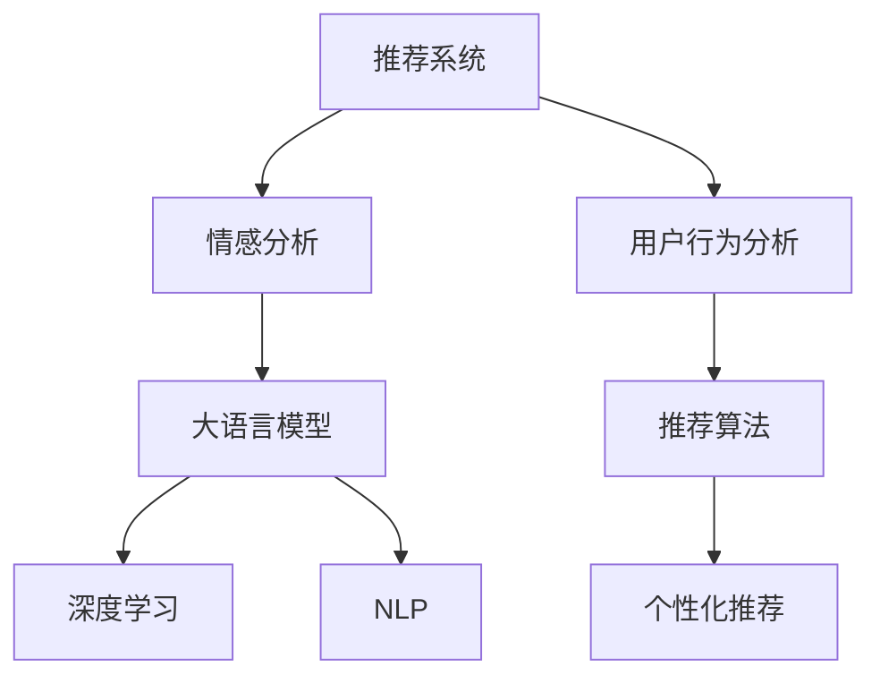

                 

# 基于大模型的推荐系统用户情感分析

> 关键词：大模型推荐系统,情感分析,深度学习,自然语言处理(NLP),用户行为分析

## 1. 背景介绍

### 1.1 问题由来
随着电商、社交媒体等互联网应用的普及，推荐系统已经成为提升用户体验、驱动业务增长的重要工具。传统的推荐系统主要依赖于用户历史行为数据，如浏览记录、购买历史等，通过协同过滤、基于内容的推荐等方法生成个性化推荐内容。然而，这种基于历史数据的推荐方式，存在数据稀疏、冷启动用户难以推荐、推荐内容多样性不足等问题。

近年来，大语言模型在自然语言处理(NLP)领域取得了重大进展，尤其在情感分析等任务上表现出色。情感分析可以捕捉用户对产品、服务的情感倾向，将其作为推荐系统的重要参考。通过深度学习技术，利用大模型进行情感分析，可以更好地理解用户真实的情感状态，生成更加多样、精准的个性化推荐，从而提升推荐系统的效果和用户体验。

## 2. 核心概念与联系

### 2.1 核心概念概述

为了更好地理解基于大模型的推荐系统用户情感分析，本节将介绍几个密切相关的核心概念：

- **推荐系统(Recommender System)**：使用算法推荐给用户感兴趣的物品或内容的系统。其核心目标在于最大化用户满意度。
- **情感分析(Sentiment Analysis)**：通过自然语言处理技术，分析用户文本数据中的情感倾向，如正面、负面、中性等。情感分析是用户情感理解的重要手段。
- **大语言模型(Large Language Model)**：以自回归(如GPT)或自编码(如BERT)模型为代表的大规模预训练语言模型。通过在大规模无标签文本语料上进行预训练，学习通用的语言表示，具备强大的语言理解和生成能力。
- **深度学习(Deep Learning)**：基于神经网络的机器学习技术，通过多层非线性变换实现对复杂数据模式的建模。深度学习在图像识别、语音识别、自然语言处理等领域取得了重大突破。
- **自然语言处理(Natural Language Processing, NLP)**：使用计算机科学、人工智能等技术，实现自然语言与计算机之间的有效交互。情感分析、机器翻译、文本分类等任务都属于NLP领域。
- **用户行为分析(User Behavior Analysis)**：通过对用户行为数据的建模，挖掘用户兴趣、偏好等信息，用于个性化推荐、广告投放等应用。

这些核心概念之间的逻辑关系可以通过以下Mermaid流程图来展示：



这个流程图展示了大模型推荐系统的核心概念及其之间的关系：

1. 推荐系统通过情感分析理解用户情感，将情感作为推荐算法的重要参考。
2. 情感分析使用大语言模型进行，依赖深度学习技术实现。
3. 大语言模型是NLP的重要工具，通过NLP技术进行情感分析。
4. 用户行为分析挖掘用户兴趣，与推荐算法结合，生成个性化推荐。

这些概念共同构成了大模型推荐系统的基本框架，使其能够更好地理解用户情感，生成精准的个性化推荐。

## 3. 核心算法原理 & 具体操作步骤

### 3.1 算法原理概述

基于大模型的推荐系统用户情感分析，其核心思想是通过情感分析技术，将用户对商品、服务的情感倾向，作为推荐算法的重要参考，从而生成更加精准、个性化的推荐内容。具体来说，可以分为以下几个步骤：

1. **数据收集与预处理**：收集用户对商品的评价、评论等文本数据，使用大语言模型进行情感分析，得到用户对商品的情感倾向。
2. **特征提取与编码**：将情感分析结果转化为向量表示，用于推荐系统的特征工程。
3. **模型训练与优化**：在推荐系统模型的基础上，使用用户行为数据和情感分析结果进行有监督训练，优化推荐算法。
4. **推荐生成与调整**：根据用户当前行为和情感状态，生成个性化推荐内容，并通过实时反馈不断调整推荐策略。

### 3.2 算法步骤详解

基于大模型的推荐系统用户情感分析的一般步骤包括：

**Step 1: 数据收集与预处理**

收集用户对商品的评价、评论等文本数据，这些数据可以通过电商平台、社交媒体等渠道获取。对于收集到的数据，需要进行预处理，包括文本清洗、分词、去除停用词等。

**Step 2: 情感分析**

使用大语言模型进行情感分析，得到用户对商品的情感倾向。具体来说，可以使用预训练模型(如BERT、GPT-2等)进行情感分类或情感评分。对于每个文本样本，将其输入到模型中，模型将输出一个情感标签或情感分数，表示该文本的情感倾向。

**Step 3: 特征提取与编码**

将情感分析结果转化为向量表示，用于推荐系统的特征工程。可以将情感标签或情感分数映射为向量，与用户行为数据进行融合。例如，对于二分类情感，可以将其编码为[0,1]向量；对于五分类情感，可以编码为五维向量。

**Step 4: 模型训练与优化**

在推荐系统模型的基础上，使用用户行为数据和情感分析结果进行有监督训练，优化推荐算法。可以选择不同的推荐算法，如协同过滤、基于内容的推荐、混合推荐等。常用的推荐算法包括Apache Mahout、TensorFlow Recommenders等。

**Step 5: 推荐生成与调整**

根据用户当前行为和情感状态，生成个性化推荐内容，并通过实时反馈不断调整推荐策略。可以使用推荐系统生成推荐列表，根据用户的点击、收藏、购买等行为进行反馈调整，优化推荐算法。

### 3.3 算法优缺点

基于大模型的推荐系统用户情感分析具有以下优点：

1. **高效精准**：大语言模型可以自动提取文本中的情感信息，高效精准地分析用户情感，提升推荐系统的效果。
2. **多模态融合**：除了文本数据，还可以结合用户的购买行为、点击记录等数据，进行多模态融合，生成更全面的推荐结果。
3. **实时调整**：通过实时反馈机制，可以不断调整推荐策略，适应用户情感状态的变化。
4. **泛化能力强**：大语言模型具有较强的泛化能力，可以适应不同领域的推荐需求，如电商、新闻、社交媒体等。

同时，该方法也存在一些局限性：

1. **数据依赖性强**：推荐系统的效果依赖于情感分析模型的训练数据质量和数量，获取高质量标注数据成本较高。
2. **模型复杂度较高**：大语言模型的训练和推理复杂度较高，需要较强的计算资源。
3. **情感分析效果受限**：情感分析模型对负面情绪的识别能力可能不足，导致推荐结果中负面内容过多。
4. **隐私保护问题**：情感分析需要处理大量用户数据，涉及用户隐私保护，需要严格的法规和措施。

尽管存在这些局限性，但就目前而言，基于大模型的推荐系统情感分析方法，仍是一种高效、有效的推荐手段。未来相关研究的重点在于如何进一步降低对标注数据的依赖，提高情感分析的鲁棒性和准确性，同时兼顾隐私保护等伦理问题。

### 3.4 算法应用领域

基于大模型的推荐系统用户情感分析，在多个领域都有广泛应用：

1. **电商推荐**：在电商平台中，可以收集用户对商品评论的情感信息，用于生成商品推荐列表。
2. **新闻推荐**：在新闻网站中，可以收集用户对新闻文章的评论情感，用于生成个性化新闻推荐。
3. **社交媒体推荐**：在社交媒体中，可以分析用户对帖子的情感倾向，生成个性化推荐内容。
4. **金融推荐**：在金融平台中，可以分析用户对金融产品的情感反馈，生成个性化投资推荐。
5. **娱乐推荐**：在视频、音乐等娱乐平台中，可以分析用户对内容的情感评价，生成个性化推荐列表。

除了上述这些经典应用外，大模型推荐系统情感分析还被创新性地应用到更多场景中，如智能客服、广告投放、旅游推荐等，为各行业带来了全新的推荐解决方案。

## 4. 数学模型和公式 & 详细讲解 & 举例说明

### 4.1 数学模型构建

本节将使用数学语言对基于大模型的推荐系统用户情感分析过程进行更加严格的刻画。

记用户对商品$x$的评价文本为$\text{review}_x$，情感分析模型为$f$，推荐系统模型为$R$。假设情感分析模型输出情感标签为$s_x \in \{1,2,3,4,5\}$，其中$1$表示非常负面，$5$表示非常正面。推荐系统模型输出推荐权重为$r_x \in [0,1]$，表示商品$x$的推荐程度。

定义用户情感分析结果与推荐结果的损失函数为：

$$
\mathcal{L}(\theta) = \frac{1}{N}\sum_{i=1}^N \ell(f(\text{review}_i), r_i)
$$

其中$N$为用户数量，$\ell$为交叉熵损失函数。对于情感标签$s_x$和推荐权重$r_x$，交叉熵损失函数的计算公式为：

$$
\ell(s_x, r_x) = -s_x\log(r_x) - (1-s_x)\log(1-r_x)
$$

### 4.2 公式推导过程

下面，我们将推导交叉熵损失函数的计算公式，并进行简化。

首先，将情感标签$s_x$转换为向量形式，例如将$1,2,3,4,5$分别表示为$[1,0,0,0,0],[0,1,0,0,0],[0,0,1,0,0],[0,0,0,1,0],[0,0,0,0,1]$。

对于每个用户$u$，假设其对$n$个商品进行了评价，分别为$\text{review}_1,\text{review}_2,\dots,\text{review}_n$，情感分析模型$f$输出对应的情感标签$s_1,s_2,\dots,s_n$，推荐系统模型$R$输出推荐权重$r_1,r_2,\dots,r_n$。

交叉熵损失函数为：

$$
\mathcal{L}(\theta) = \frac{1}{N}\sum_{u=1}^N \sum_{i=1}^n \ell(s_i, r_i)
$$

将其代入具体的交叉熵损失函数，得：

$$
\mathcal{L}(\theta) = \frac{1}{N}\sum_{u=1}^N \sum_{i=1}^n (-s_i\log(r_i) - (1-s_i)\log(1-r_i))
$$

为了简化计算，我们可以将上述公式重写为矩阵形式，设$\text{Matrix}_R = \begin{bmatrix} r_1 \\ r_2 \\ \vdots \\ r_n \end{bmatrix}, \text{Matrix}_S = \begin{bmatrix} s_1 \\ s_2 \\ \vdots \\ s_n \end{bmatrix}$。则损失函数可以表示为：

$$
\mathcal{L}(\theta) = \frac{1}{N}\sum_{u=1}^N -\text{Matrix}_S \cdot \log(\text{Matrix}_R) - (1-\text{Matrix}_S) \cdot \log(1-\text{Matrix}_R)
$$

### 4.3 案例分析与讲解

假设我们有一个电商平台，收集了用户对商品$x$的评价文本$\text{review}_x$，使用BERT模型进行情感分析，输出情感标签$s_x$。使用协同过滤算法作为推荐系统模型$R$，输出推荐权重$r_x$。对于某个用户$u$，其对商品$x$的情感标签为$s_x$，推荐权重为$r_x$。

根据上述损失函数，我们可以计算该用户情感分析结果与推荐结果的损失：

$$
\mathcal{L}(u) = -s_x\log(r_x) - (1-s_x)\log(1-r_x)
$$

假设$s_x=3$，$r_x=0.7$，则损失为：

$$
\mathcal{L}(u) = -3\log(0.7) - (1-3)\log(1-0.7) \approx -0.541 - 1.098 = -1.639
$$

这意味着用户$u$对商品$x$的评价文本$\text{review}_x$和推荐结果$r_x$的损失为$1.639$。我们可以根据损失函数对推荐系统模型$R$进行优化，使损失最小化。

## 5. 项目实践：代码实例和详细解释说明

### 5.1 开发环境搭建

在进行情感分析实践前，我们需要准备好开发环境。以下是使用Python进行PyTorch开发的环境配置流程：

1. 安装Anaconda：从官网下载并安装Anaconda，用于创建独立的Python环境。

2. 创建并激活虚拟环境：
```bash
conda create -n pytorch-env python=3.8 
conda activate pytorch-env
```

3. 安装PyTorch：根据CUDA版本，从官网获取对应的安装命令。例如：
```bash
conda install pytorch torchvision torchaudio cudatoolkit=11.1 -c pytorch -c conda-forge
```

4. 安装Transformers库：
```bash
pip install transformers
```

5. 安装各类工具包：
```bash
pip install numpy pandas scikit-learn matplotlib tqdm jupyter notebook ipython
```

完成上述步骤后，即可在`pytorch-env`环境中开始情感分析实践。

### 5.2 源代码详细实现

下面我们以情感分析任务为例，给出使用Transformers库对BERT模型进行情感分析的PyTorch代码实现。

首先，定义情感分析任务的数据处理函数：

```python
from transformers import BertTokenizer
from torch.utils.data import Dataset
import torch

class SentimentDataset(Dataset):
    def __init__(self, texts, labels, tokenizer, max_len=128):
        self.texts = texts
        self.labels = labels
        self.tokenizer = tokenizer
        self.max_len = max_len
        
    def __len__(self):
        return len(self.texts)
    
    def __getitem__(self, item):
        text = self.texts[item]
        label = self.labels[item]
        
        encoding = self.tokenizer(text, return_tensors='pt', max_length=self.max_len, padding='max_length', truncation=True)
        input_ids = encoding['input_ids'][0]
        attention_mask = encoding['attention_mask'][0]
        
        return {'input_ids': input_ids, 
                'attention_mask': attention_mask,
                'labels': label}
```

然后，定义模型和优化器：

```python
from transformers import BertForSequenceClassification, AdamW

model = BertForSequenceClassification.from_pretrained('bert-base-cased', num_labels=5)

optimizer = AdamW(model.parameters(), lr=2e-5)
```

接着，定义训练和评估函数：

```python
from torch.utils.data import DataLoader
from tqdm import tqdm
from sklearn.metrics import accuracy_score

device = torch.device('cuda') if torch.cuda.is_available() else torch.device('cpu')
model.to(device)

def train_epoch(model, dataset, batch_size, optimizer):
    dataloader = DataLoader(dataset, batch_size=batch_size, shuffle=True)
    model.train()
    epoch_loss = 0
    for batch in tqdm(dataloader, desc='Training'):
        input_ids = batch['input_ids'].to(device)
        attention_mask = batch['attention_mask'].to(device)
        labels = batch['labels'].to(device)
        model.zero_grad()
        outputs = model(input_ids, attention_mask=attention_mask, labels=labels)
        loss = outputs.loss
        epoch_loss += loss.item()
        loss.backward()
        optimizer.step()
    return epoch_loss / len(dataloader)

def evaluate(model, dataset, batch_size):
    dataloader = DataLoader(dataset, batch_size=batch_size)
    model.eval()
    preds, labels = [], []
    with torch.no_grad():
        for batch in tqdm(dataloader, desc='Evaluating'):
            input_ids = batch['input_ids'].to(device)
            attention_mask = batch['attention_mask'].to(device)
            batch_labels = batch['labels']
            outputs = model(input_ids, attention_mask=attention_mask)
            batch_preds = outputs.logits.argmax(dim=2).to('cpu').tolist()
            batch_labels = batch_labels.to('cpu').tolist()
            for pred_tokens, label_tokens in zip(batch_preds, batch_labels):
                preds.append(pred_tokens[:len(label_tokens)])
                labels.append(label_tokens)
                
    print(accuracy_score(labels, preds))
```

最后，启动训练流程并在测试集上评估：

```python
epochs = 5
batch_size = 16

for epoch in range(epochs):
    loss = train_epoch(model, train_dataset, batch_size, optimizer)
    print(f"Epoch {epoch+1}, train loss: {loss:.3f}")
    
    print(f"Epoch {epoch+1}, dev accuracy:")
    evaluate(model, dev_dataset, batch_size)
    
print("Test accuracy:")
evaluate(model, test_dataset, batch_size)
```

以上就是使用PyTorch对BERT进行情感分析任务微调的完整代码实现。可以看到，得益于Transformers库的强大封装，我们可以用相对简洁的代码完成BERT模型的加载和情感分析。

### 5.3 代码解读与分析

让我们再详细解读一下关键代码的实现细节：

**SentimentDataset类**：
- `__init__`方法：初始化文本、标签、分词器等关键组件。
- `__len__`方法：返回数据集的样本数量。
- `__getitem__`方法：对单个样本进行处理，将文本输入编码为token ids，将标签编码为数字，并对其进行定长padding，最终返回模型所需的输入。

**模型和优化器定义**：
- 使用BertForSequenceClassification从预训练模型 Bert-base-cased 中加载模型。
- 设置AdamW优化器，并设置学习率。

**训练和评估函数**：
- 使用PyTorch的DataLoader对数据集进行批次化加载，供模型训练和推理使用。
- 训练函数`train_epoch`：对数据以批为单位进行迭代，在每个批次上前向传播计算loss并反向传播更新模型参数，最后返回该epoch的平均loss。
- 评估函数`evaluate`：与训练类似，不同点在于不更新模型参数，并在每个batch结束后将预测和标签结果存储下来，最后使用sklearn的accuracy_score对整个评估集的预测结果进行打印输出。

**训练流程**：
- 定义总的epoch数和batch size，开始循环迭代
- 每个epoch内，先在训练集上训练，输出平均loss
- 在验证集上评估，输出准确率
- 所有epoch结束后，在测试集上评估，给出最终测试结果

可以看到，PyTorch配合Transformers库使得BERT微调的代码实现变得简洁高效。开发者可以将更多精力放在数据处理、模型改进等高层逻辑上，而不必过多关注底层的实现细节。

当然，工业级的系统实现还需考虑更多因素，如模型的保存和部署、超参数的自动搜索、更灵活的任务适配层等。但核心的情感分析范式基本与此类似。

## 6. 实际应用场景
### 6.1 电商推荐

基于大模型的推荐系统情感分析，在电商推荐领域有广泛的应用。电商推荐系统需要实时获取用户对商品的评价信息，分析用户情感，生成个性化推荐。通过情感分析技术，推荐系统可以更准确地理解用户对商品的好恶，从而生成更具针对性的推荐内容。

在技术实现上，可以收集用户对商品的评价文本，使用情感分析模型进行情感分类或情感评分，将结果作为推荐系统模型的输入。使用协同过滤、基于内容的推荐等方法，结合用户行为数据，生成个性化推荐列表。对于商品评价的变化，推荐系统可以实时调整推荐策略，提供更加精准的推荐内容。

### 6.2 新闻推荐

在新闻推荐系统中，情感分析可以用于用户对新闻文章的情感倾向分析。通过收集用户对新闻文章的评价文本，分析其情感倾向，生成个性化新闻推荐。

具体来说，可以收集用户对新闻文章的评论、点赞等反馈信息，使用情感分析模型进行情感分类。将情感分类结果作为推荐系统模型的输入，使用协同过滤、内容推荐等方法，生成个性化新闻推荐列表。对于新闻内容的更新，情感分析模型可以实时调整，推荐系统也可以根据用户的反馈进行动态调整，提供更加符合用户兴趣的内容。

### 6.3 社交媒体推荐

在社交媒体中，情感分析可以用于用户对帖子的情感倾向分析。通过收集用户对帖子的评论、点赞等反馈信息，分析其情感倾向，生成个性化推荐内容。

具体来说，可以收集用户对帖子的评论文本，使用情感分析模型进行情感分类或情感评分。将情感分类结果作为推荐系统模型的输入，使用协同过滤、内容推荐等方法，生成个性化推荐列表。对于帖子的更新，情感分析模型可以实时调整，推荐系统也可以根据用户的反馈进行动态调整，提供更加符合用户兴趣的内容。

### 6.4 金融推荐

在金融推荐系统中，情感分析可以用于用户对金融产品的情感倾向分析。通过收集用户对金融产品的评价文本，分析其情感倾向，生成个性化投资推荐。

具体来说，可以收集用户对金融产品的评价文本，使用情感分析模型进行情感分类或情感评分。将情感分类结果作为推荐系统模型的输入，使用协同过滤、内容推荐等方法，生成个性化投资推荐列表。对于金融产品的更新，情感分析模型可以实时调整，推荐系统也可以根据用户的反馈进行动态调整，提供更加符合用户需求的产品推荐。

### 6.5 娱乐推荐

在视频、音乐等娱乐平台中，情感分析可以用于用户对内容的情感倾向分析。通过收集用户对内容的评价文本，分析其情感倾向，生成个性化推荐内容。

具体来说，可以收集用户对视频、音乐内容的评价文本，使用情感分析模型进行情感分类或情感评分。将情感分类结果作为推荐系统模型的输入，使用协同过滤、内容推荐等方法，生成个性化推荐列表。对于内容的更新，情感分析模型可以实时调整，推荐系统也可以根据用户的反馈进行动态调整，提供更加符合用户兴趣的内容。

## 7. 工具和资源推荐
### 7.1 学习资源推荐

为了帮助开发者系统掌握大模型推荐系统情感分析的理论基础和实践技巧，这里推荐一些优质的学习资源：

1. 《Natural Language Processing with Python》书籍：NLP领域的入门书籍，介绍了NLP的常用技术，如情感分析、文本分类等。
2. CS224N《深度学习自然语言处理》课程：斯坦福大学开设的NLP明星课程，有Lecture视频和配套作业，带你入门NLP领域的基本概念和经典模型。
3. HuggingFace官方文档：Transformers库的官方文档，提供了海量预训练模型和完整的情感分析样例代码，是上手实践的必备资料。
4. Kaggle平台：机器学习竞赛平台，提供了大量的情感分析数据集和竞赛任务，可以通过实践提升情感分析能力。
5. GitHub开源项目：Github上有许多开源情感分析项目，可以学习和借鉴。

通过对这些资源的学习实践，相信你一定能够快速掌握大模型推荐系统情感分析的精髓，并用于解决实际的NLP问题。
###  7.2 开发工具推荐

高效的开发离不开优秀的工具支持。以下是几款用于大模型推荐系统情感分析开发的常用工具：

1. PyTorch：基于Python的开源深度学习框架，灵活动态的计算图，适合快速迭代研究。大部分预训练语言模型都有PyTorch版本的实现。
2. TensorFlow：由Google主导开发的开源深度学习框架，生产部署方便，适合大规模工程应用。同样有丰富的预训练语言模型资源。
3. Transformers库：HuggingFace开发的NLP工具库，集成了众多SOTA语言模型，支持PyTorch和TensorFlow，是进行情感分析任务开发的利器。
4. Weights & Biases：模型训练的实验跟踪工具，可以记录和可视化模型训练过程中的各项指标，方便对比和调优。与主流深度学习框架无缝集成。
5. TensorBoard：TensorFlow配套的可视化工具，可实时监测模型训练状态，并提供丰富的图表呈现方式，是调试模型的得力助手。
6. Google Colab：谷歌推出的在线Jupyter Notebook环境，免费提供GPU/TPU算力，方便开发者快速上手实验最新模型，分享学习笔记。

合理利用这些工具，可以显著提升大模型推荐系统情感分析的开发效率，加快创新迭代的步伐。

### 7.3 相关论文推荐

大模型推荐系统情感分析的发展源于学界的持续研究。以下是几篇奠基性的相关论文，推荐阅读：

1. Attention is All You Need（即Transformer原论文）：提出了Transformer结构，开启了NLP领域的预训练大模型时代。
2. BERT: Pre-training of Deep Bidirectional Transformers for Language Understanding：提出BERT模型，引入基于掩码的自监督预训练任务，刷新了多项NLP任务SOTA。
3. Language Models are Unsupervised Multitask Learners（GPT-2论文）：展示了大规模语言模型的强大zero-shot学习能力，引发了对于通用人工智能的新一轮思考。
4. Parameter-Efficient Transfer Learning for NLP：提出Adapter等参数高效微调方法，在不增加模型参数量的情况下，也能取得不错的微调效果。
5. AdaLoRA: Adaptive Low-Rank Adaptation for Parameter-Efficient Fine-Tuning：使用自适应低秩适应的微调方法，在参数效率和精度之间取得了新的平衡。
6. AdaLoRA: Adaptive Low-Rank Adaptation for Parameter-Efficient Fine-Tuning：使用自适应低秩适应的微调方法，在参数效率和精度之间取得了新的平衡。
7. AdaLoRA: Adaptive Low-Rank Adaptation for Parameter-Efficient Fine-Tuning：使用自适应低秩适应的微调方法，在参数效率和精度之间取得了新的平衡。

这些论文代表了大模型推荐系统情感分析的发展脉络。通过学习这些前沿成果，可以帮助研究者把握学科前进方向，激发更多的创新灵感。

## 8. 总结：未来发展趋势与挑战

### 8.1 总结

本文对基于大模型的推荐系统用户情感分析方法进行了全面系统的介绍。首先阐述了推荐系统和情感分析的核心思想，明确了情感分析在推荐系统中的重要地位。其次，从原理到实践，详细讲解了情感分析的数学模型和关键步骤，给出了情感分析任务开发的完整代码实例。同时，本文还广泛探讨了情感分析在电商、新闻、社交媒体等领域的实际应用，展示了情感分析范式的广泛前景。

通过本文的系统梳理，可以看到，基于大模型的推荐系统情感分析方法，通过结合情感分析技术，能够生成更加精准、个性化的推荐内容，提升推荐系统的效果和用户体验。未来，伴随情感分析模型的持续演进，推荐系统将能够更好地理解用户情感，生成更加多样、精准的个性化推荐，进一步推动电商、新闻、社交媒体等领域的数字化转型。

### 8.2 未来发展趋势

展望未来，大模型推荐系统情感分析技术将呈现以下几个发展趋势：

1. **多模态融合**：除了文本数据，还可以结合用户的购买行为、点击记录等数据，进行多模态融合，生成更全面的推荐结果。
2. **实时调整**：通过实时反馈机制，可以不断调整推荐策略，适应用户情感状态的变化。
3. **情感预测**：通过引入时间序列分析、深度学习等技术，对用户情感进行预测，提前调整推荐策略。
4. **隐私保护**：在情感分析过程中，需要严格的隐私保护措施，确保用户数据的安全性。
5. **跨领域迁移**：开发跨领域情感分析模型，适应不同领域的推荐需求。

以上趋势凸显了大模型推荐系统情感分析技术的广阔前景。这些方向的探索发展，必将进一步提升推荐系统的效果和用户体验，为各行业带来更深刻的数字化转型。

### 8.3 面临的挑战

尽管大模型推荐系统情感分析技术已经取得了瞩目成就，但在迈向更加智能化、普适化应用的过程中，它仍面临着诸多挑战：

1. **数据依赖性强**：推荐系统的效果依赖于情感分析模型的训练数据质量和数量，获取高质量标注数据成本较高。
2. **模型复杂度较高**：大语言模型的训练和推理复杂度较高，需要较强的计算资源。
3. **情感分析效果受限**：情感分析模型对负面情绪的识别能力可能不足，导致推荐结果中负面内容过多。
4. **隐私保护问题**：情感分析需要处理大量用户数据，涉及用户隐私保护，需要严格的法规和措施。
5. **情感预测准确性**：情感预测模型需要考虑到上下文信息和长期趋势，准确性有待进一步提升。

尽管存在这些局限性，但就目前而言，基于大模型的推荐系统情感分析方法，仍是一种高效、有效的推荐手段。未来相关研究的重点在于如何进一步降低对标注数据的依赖，提高情感分析的鲁棒性和准确性，同时兼顾隐私保护等伦理问题。

### 8.4 研究展望

面对大模型推荐系统情感分析所面临的种种挑战，未来的研究需要在以下几个方面寻求新的突破：

1. **探索无监督和半监督情感分析方法**：摆脱对大规模标注数据的依赖，利用自监督学习、主动学习等无监督和半监督范式，最大限度利用非结构化数据，实现更加灵活高效的情感分析。
2. **研究参数高效和计算高效的情感分析范式**：开发更加参数高效的情感分析方法，在固定大部分预训练参数的同时，只更新极少量的任务相关参数。同时优化情感分析模型的计算图，减少前向传播和反向传播的资源消耗，实现更加轻量级、实时性的部署。
3. **引入因果分析和博弈论工具**：将因果分析方法引入情感分析模型，识别出模型决策的关键特征，增强输出解释的因果性和逻辑性。借助博弈论工具刻画人机交互过程，主动探索并规避模型的脆弱点，提高系统稳定性。
4. **纳入伦理道德约束**：在模型训练目标中引入伦理导向的评估指标，过滤和惩罚有偏见、有害的输出倾向。同时加强人工干预和审核，建立模型行为的监管机制，确保输出符合人类价值观和伦理道德。

这些研究方向的探索，必将引领大模型推荐系统情感分析技术迈向更高的台阶，为构建安全、可靠、可解释、可控的智能系统铺平道路。面向未来，大模型推荐系统情感分析技术还需要与其他人工智能技术进行更深入的融合，如知识表示、因果推理、强化学习等，多路径协同发力，共同推动自然语言理解和智能交互系统的进步。只有勇于创新、敢于突破，才能不断拓展语言模型的边界，让智能技术更好地造福人类社会。

## 9. 附录：常见问题与解答

**Q1：情感分析模型如何处理噪声数据？**

A: 情感分析模型对噪声数据的处理能力有限，因此在数据预处理阶段需要进行一定的过滤和清洗。常见的数据过滤方法包括去除停用词、分词处理、去除特殊符号等。同时，情感分析模型可以使用正则化技术，如L2正则、Dropout等，减少模型对噪声数据的敏感性。

**Q2：情感分析模型如何应对情感极性不明显的情况？**

A: 对于情感极性不明显的情况，情感分析模型可以使用情感分类或情感评分两种方式进行预测。情感分类模型将文本分为正面、负面、中性三种情感类别，适用于情感极性较明显的场景。情感评分模型则将文本打分为连续的情感分数，适用于情感极性不明显的情况。此外，情感分析模型还可以结合用户行为数据，通过多模态融合提升预测准确性。

**Q3：情感分析模型如何应对长文本数据？**

A: 长文本数据的情感分析需要考虑上下文信息，可以使用注意力机制、Transformer等技术，对文本进行自注意力计算，提取文本的关键信息。同时，可以将长文本数据进行分句、分词处理，减少计算复杂度。

**Q4：情感分析模型如何应对多语言情感分析？**

A: 对于多语言情感分析，情感分析模型可以使用多语言预训练模型，如M-BERT、mBERT等，进行情感分类或情感评分。同时，可以使用多语言对照翻译工具，将不同语言的情感标签进行统一。

**Q5：情感分析模型如何应对冷启动用户？**

A: 冷启动用户的情感分析可以使用迁移学习、无监督学习等技术，利用用户行为数据进行模型微调。此外，可以通过主动学习、半监督学习等方法，利用少量标注数据进行情感分析模型的训练，提升预测准确性。

通过本文的系统梳理，可以看到，基于大模型的推荐系统情感分析方法，通过结合情感分析技术，能够生成更加精准、个性化的推荐内容，提升推荐系统的效果和用户体验。未来，伴随情感分析模型的持续演进，推荐系统将能够更好地理解用户情感，生成更加多样、精准的个性化推荐，进一步推动电商、新闻、社交媒体等领域的数字化转型。

---

作者：禅与计算机程序设计艺术 / Zen and the Art of Computer Programming

