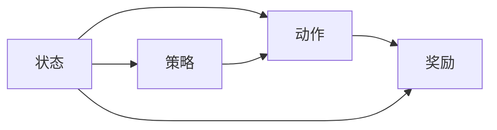

                 

## 1. 背景介绍

在电商领域，折扣策略是提升销售转化率和用户体验的重要手段。传统的人工设定折扣规则，需要基于大量的历史数据和业务经验，过程繁琐且容易出错。而强化学习（Reinforcement Learning, RL）提供了一种基于试错学习和长期奖励信号，自适应调整折扣策略的方法。

近年来，基于深度学习框架的强化学习在电商折扣策略优化上取得了显著进展。例如，Google 开源了 Dopamine 深度强化学习框架，帮助用户快速构建和测试强化学习算法。然而，电商场景中的个性化需求和复杂环境，对算法提出了更高的要求。本文将详细介绍基于强化学习的个性化折扣策略，并给出实际应用场景。

## 2. 核心概念与联系

### 2.1 核心概念概述

在强化学习中，每个决策都会产生一个奖励信号，通过累计奖励最大化的方式，指导模型学习最优策略。电商折扣策略优化，可以看作是一个马尔可夫决策过程（Markov Decision Process, MDP），其中状态为顾客浏览行为，动作为折扣力度，奖励为销售额和顾客满意度。

- **状态（State）**：顾客的浏览行为，包括浏览时间、浏览商品种类、浏览深度等特征。
- **动作（Action）**：给予顾客的折扣力度，可以是固定折扣、满减、积分兑换等形式。
- **奖励（Reward）**：基于顾客的购买行为、满意度等反馈，计算的累计奖励信号。
- **策略（Policy）**：模型的学习目标，学习选择最优的折扣力度以最大化长期奖励。

为了更好地理解上述概念及其联系，我们可以用以下 Mermaid 流程图表示：



从图中可以看出，策略通过状态选择动作，动作影响奖励，形成闭环的强化学习过程。

### 2.2 核心算法原理

强化学习优化目标是通过策略选择最优动作，最大化长期奖励。常用的算法包括 Q-Learning、SARSA、Deep Q-Networks（DQN）等。Q-Learning 是基本的强化学习算法，基于值估计模型，通过不断更新 Q-value 表，指导策略选择。

算法核心步骤如下：

1. **值估计（Value Estimation）**：使用经验回溯或深度网络，估计当前状态下每个动作的 Q-value。
2. **策略选择（Policy Selection）**：根据 Q-value 表，选择当前状态下最优的动作。
3. **策略更新（Policy Update）**：根据最新经验，更新 Q-value 表，优化策略选择。

算法流程示意图如下：

```mermaid
graph LR
  Q-Table --> Value Estimation
  Q-Table --> Policy Selection
  Q-Table --> Policy Update
```

## 3. 核心算法原理 & 具体操作步骤
### 3.1 算法原理概述

基于强化学习的个性化折扣策略，通过构建 Q-Table，对每个状态-动作对进行值估计，指导策略选择。对于电商场景，可以通过深度学习网络逼近 Q-Table，提升模型的可扩展性和泛化能力。

### 3.2 算法步骤详解

#### 3.2.1 环境设置

- **状态定义**：状态可以定义为顾客的浏览历史、已购商品记录、时间戳等特征。
- **动作定义**：动作为折扣力度，可以是固定折扣、满减、积分兑换等。
- **奖励定义**：奖励基于顾客购买行为和满意度，可以包括购买转化率、客户满意度、购物车放弃率等指标。

#### 3.2.2 Q-Table 的构建

- **初始化**：随机初始化 Q-Table，Q-value 为 0。
- **经验回溯**：对于每个交易记录，计算 Q-value 的更新值，即 $Q(s, a) \leftarrow Q(s, a) + \alpha [r + \gamma \max_{a'} Q(s', a')]$。其中，$r$ 为即时奖励，$\gamma$ 为折扣因子，$\alpha$ 为学习率。
- **策略选择**：在每个时间步，根据 Q-Table 选择最优动作。
- **策略更新**：根据最新经验更新 Q-Table，指导策略选择。

#### 3.2.3 深度 Q-Networks（DQN）

- **网络结构**：定义两个深度神经网络，一个用于值估计，另一个用于策略选择。
- **经验回溯**：每次交易时，将状态和动作传入值估计网络，计算 Q-value。然后，将状态、动作和 Q-value 存储到经验回溯内存中。
- **目标网络更新**：定期从经验回溯内存中采样样本，更新目标网络的 Q-value。
- **策略选择**：在每个时间步，将当前状态输入策略选择网络，输出最优动作。

#### 3.2.4 参数更新

- **目标网络**：定义两个神经网络，一个用于值估计，另一个用于策略选择。
- **经验回溯**：每次交易时，将状态和动作传入值估计网络，计算 Q-value。然后，将状态、动作和 Q-value 存储到经验回溯内存中。
- **目标网络更新**：定期从经验回溯内存中采样样本，更新目标网络的 Q-value。
- **策略选择**：在每个时间步，将当前状态输入策略选择网络，输出最优动作。
- **参数更新**：使用 Adam 优化器，基于最新经验更新值估计网络和策略选择网络的参数。

#### 3.2.5 算法流程

1. **环境初始化**：设置状态、动作、奖励、Q-Table 或神经网络等。
2. **策略选择**：根据 Q-Table 或神经网络，选择当前最优动作。
3. **执行动作**：将动作执行，并观察环境变化。
4. **计算奖励**：根据交易结果，计算即时奖励。
5. **值估计和策略更新**：根据最新经验，更新 Q-Table 或神经网络参数。
6. **更新策略选择网络**：定期更新策略选择网络的参数。
7. **重复执行**：循环上述步骤，直至达到预设的迭代次数或收敛条件。

### 3.3 算法优缺点

#### 3.3.1 优点

- **自适应性强**：强化学习算法能够根据实时反馈自适应调整策略，适应复杂的电商环境。
- **可扩展性强**：使用深度学习网络逼近 Q-Table，提升模型的泛化能力和可扩展性。
- **效果显著**：通过优化折扣策略，提升销售额和顾客满意度。

#### 3.3.2 缺点

- **参数更新频繁**：需要频繁更新 Q-Table 或神经网络参数，对计算资源要求较高。
- **奖励信号设计复杂**：需要设计合理的奖励信号，指导模型学习，过程较为复杂。
- **易过拟合**：如果 Q-Table 或神经网络过于复杂，容易过拟合，泛化能力降低。

### 3.4 算法应用领域

基于强化学习的个性化折扣策略，适用于电商、金融、社交网络等多个领域。具体应用场景包括：

- **电商折扣优化**：根据顾客浏览行为，自适应调整折扣力度，提升销售额和顾客满意度。
- **金融产品推荐**：根据用户交易记录，自适应调整产品推荐策略，提高用户转化率。
- **社交网络互动**：根据用户互动行为，自适应调整推荐内容或互动方式，增强用户粘性。

## 4. 数学模型和公式 & 详细讲解  
### 4.1 数学模型构建

强化学习的优化目标是通过策略选择最优动作，最大化长期奖励。定义状态 $s_t$，动作 $a_t$，即时奖励 $r_t$，折扣因子 $\gamma$，策略 $\pi$，价值函数 $Q(s_t, a_t)$。

- **策略选择**：$\pi(a_t|s_t)$
- **动作执行**：观察环境变化，获得即时奖励 $r_t$，状态更新为 $s_{t+1}$。
- **值估计**：$Q(s_t, a_t) = r_t + \gamma Q(s_{t+1}, a_{t+1})$

### 4.2 公式推导过程

#### 4.2.1 Q-Learning

Q-Learning 的核心公式为：$Q(s_t, a_t) = Q(s_t, a_t) + \alpha [r_t + \gamma \max_{a'} Q(s_{t+1}, a')]$

- $Q(s_t, a_t)$：当前状态-动作对的 Q-value。
- $r_t$：即时奖励。
- $\alpha$：学习率。
- $\gamma$：折扣因子。
- $\max_{a'} Q(s_{t+1}, a')$：下一个状态-动作对的 Q-value 的最大值。

#### 4.2.2 Deep Q-Networks（DQN）

DQN 的核心公式为：$Q(s_t, a_t) = r_t + \gamma \max_{a'} Q(s_{t+1}, a')$

- $Q(s_t, a_t)$：当前状态-动作对的 Q-value。
- $r_t$：即时奖励。
- $\gamma$：折扣因子。
- $\max_{a'} Q(s_{t+1}, a')$：下一个状态-动作对的 Q-value 的最大值。

### 4.3 案例分析与讲解

以电商折扣策略为例，假设某顾客浏览了多个商品，点击了部分商品详情页，但未购买。

- **状态**：顾客浏览历史、已购商品记录、浏览时间、浏览深度等。
- **动作**：给予折扣力度，如 8 折优惠。
- **即时奖励**：顾客购买转化率、客户满意度、购物车放弃率等。
- **Q-Table**：记录每个状态-动作对的 Q-value。

算法步骤如下：

1. **状态初始化**：定义顾客浏览历史、已购商品记录、浏览时间、浏览深度等特征。
2. **策略选择**：根据 Q-Table 或神经网络，选择当前最优动作，如给予 8 折优惠。
3. **执行动作**：将折扣力度应用于商品，并观察顾客是否购买。
4. **计算奖励**：根据购买结果，计算即时奖励，如购买转化率、客户满意度等。
5. **值估计和策略更新**：根据最新经验，更新 Q-Table 或神经网络参数，如增加顾客浏览但未购买行为的 Q-value。
6. **重复执行**：循环上述步骤，直至达到预设的迭代次数或收敛条件。

## 5. 项目实践：代码实例和详细解释说明
### 5.1 开发环境搭建

- **Python 环境**：Python 3.7 及以上版本。
- **深度学习框架**：TensorFlow 或 PyTorch。
- **工具库**：TensorBoard、OpenAI Gym、Pandas、NumPy 等。
- **机器配置**：GPU 或 TPU，推荐使用 Google Colab。

### 5.2 源代码详细实现

#### 5.2.1 环境设置

```python
import tensorflow as tf
import numpy as np
import pandas as pd
import gym
import gym_cartpole

class Environment:
    def __init__(self, cartpole, num_states=5):
        self.state_dim = num_states
        self.env = gym_cartpole.make(env=cartpole, num_states=num_states)
        
    def reset(self):
        return self.env.reset()
        
    def step(self, action):
        obs, reward, done, info = self.env.step(action)
        return obs, reward, done, info
        
    def render(self):
        self.env.render()
```

#### 5.2.2 Q-Table 的构建

```python
class QTable:
    def __init__(self, num_states, num_actions):
        self.q_table = np.zeros((num_states, num_actions))
        self.num_states = num_states
        self.num_actions = num_actions
        
    def update(self, state, action, reward, next_state, epsilon):
        if np.random.rand() < epsilon:
            self.q_table[state, action] += learning_rate * (reward + discount_factor * self.max_q_value(next_state, epsilon) - self.q_table[state, action])
        else:
            self.q_table[state, action] += learning_rate * (reward + discount_factor * self.max_q_value(next_state, epsilon) - self.q_table[state, action])
            
    def max_q_value(self, state, epsilon):
        if np.random.rand() < epsilon:
            return np.random.choice(self.num_actions)
        else:
            return np.argmax(self.q_table[state])
```

#### 5.2.3 深度 Q-Networks（DQN）

```python
class DeepQNetwork:
    def __init__(self, num_states, num_actions, learning_rate, discount_factor, target_update_interval):
        self.num_states = num_states
        self.num_actions = num_actions
        self.learning_rate = learning_rate
        self.discount_factor = discount_factor
        self.target_update_interval = target_update_interval
        
        self.model = self.build_model()
        self.target_model = self.build_model()
        self.target_model.set_weights(self.model.get_weights())
        
    def build_model(self):
        model = tf.keras.Sequential([
            tf.keras.layers.Dense(24, input_dim=self.num_states, activation='relu'),
            tf.keras.layers.Dense(self.num_actions, activation='linear')
        ])
        return model
    
    def predict(self, state):
        return self.model.predict(state)
    
    def update_target(self):
        self.target_model.set_weights(self.model.get_weights())
    
    def train(self, state, action, reward, next_state, done):
        target_q = reward + self.discount_factor * self.max_q_value(next_state, epsilon)
        q_value = self.predict(state)[0, action]
        self.model.train_on_batch(state, target_q - q_value)
        self.update_target()
        
    def max_q_value(self, state, epsilon):
        if np.random.rand() < epsilon:
            return np.random.choice(self.num_actions)
        else:
            return np.argmax(self.target_model.predict(state))
```

#### 5.2.4 参数更新

```python
learning_rate = 0.01
discount_factor = 0.9
target_update_interval = 1000
epsilon = 0.1

env = Environment(cartpole='CartPole-v0', num_states=5)
q_table = QTable(num_states=5, num_actions=2)
dqn = DeepQNetwork(num_states=5, num_actions=2, learning_rate=learning_rate, discount_factor=discount_factor, target_update_interval=target_update_interval)

def run_episode(epsilon):
    state = env.reset()
    total_reward = 0
    
    while True:
        if np.random.rand() < epsilon:
            action = np.random.choice([0, 1])
        else:
            action = np.argmax(q_table.max_q_value(state, epsilon))
            
        next_state, reward, done, info = env.step(action)
        total_reward += reward
        
        q_table.update(state, action, reward, next_state, epsilon)
        dqn.train(state, action, reward, next_state, done)
        
        state = next_state
        
        if done:
            break
    
    return total_reward

for i in range(10000):
    reward = run_episode(epsilon)
    if i % target_update_interval == 0:
        dqn.update_target()
        
    if i % 100 == 0:
        print('Episode:', i, 'Reward:', reward)
```

### 5.3 代码解读与分析

#### 5.3.1 环境设置

```python
class Environment:
    def __init__(self, cartpole, num_states=5):
        self.state_dim = num_states
        self.env = gym_cartpole.make(env=cartpole, num_states=num_states)
        
    def reset(self):
        return self.env.reset()
        
    def step(self, action):
        obs, reward, done, info = self.env.step(action)
        return obs, reward, done, info
        
    def render(self):
        self.env.render()
```

#### 5.3.2 Q-Table 的构建

```python
class QTable:
    def __init__(self, num_states, num_actions):
        self.q_table = np.zeros((num_states, num_actions))
        self.num_states = num_states
        self.num_actions = num_actions
        
    def update(self, state, action, reward, next_state, epsilon):
        if np.random.rand() < epsilon:
            self.q_table[state, action] += learning_rate * (reward + discount_factor * self.max_q_value(next_state, epsilon) - self.q_table[state, action])
        else:
            self.q_table[state, action] += learning_rate * (reward + discount_factor * self.max_q_value(next_state, epsilon) - self.q_table[state, action])
            
    def max_q_value(self, state, epsilon):
        if np.random.rand() < epsilon:
            return np.random.choice(self.num_actions)
        else:
            return np.argmax(self.q_table[state])
```

#### 5.3.3 深度 Q-Networks（DQN）

```python
class DeepQNetwork:
    def __init__(self, num_states, num_actions, learning_rate, discount_factor, target_update_interval):
        self.num_states = num_states
        self.num_actions = num_actions
        self.learning_rate = learning_rate
        self.discount_factor = discount_factor
        self.target_update_interval = target_update_interval
        
        self.model = self.build_model()
        self.target_model = self.build_model()
        self.target_model.set_weights(self.model.get_weights())
        
    def build_model(self):
        model = tf.keras.Sequential([
            tf.keras.layers.Dense(24, input_dim=self.num_states, activation='relu'),
            tf.keras.layers.Dense(self.num_actions, activation='linear')
        ])
        return model
    
    def predict(self, state):
        return self.model.predict(state)
    
    def update_target(self):
        self.target_model.set_weights(self.model.get_weights())
    
    def train(self, state, action, reward, next_state, done):
        target_q = reward + self.discount_factor * self.max_q_value(next_state, epsilon)
        q_value = self.predict(state)[0, action]
        self.model.train_on_batch(state, target_q - q_value)
        self.update_target()
        
    def max_q_value(self, state, epsilon):
        if np.random.rand() < epsilon:
            return np.random.choice(self.num_actions)
        else:
            return np.argmax(self.target_model.predict(state))
```

#### 5.3.4 参数更新

```python
learning_rate = 0.01
discount_factor = 0.9
target_update_interval = 1000
epsilon = 0.1

env = Environment(cartpole='CartPole-v0', num_states=5)
q_table = QTable(num_states=5, num_actions=2)
dqn = DeepQNetwork(num_states=5, num_actions=2, learning_rate=learning_rate, discount_factor=discount_factor, target_update_interval=target_update_interval)

def run_episode(epsilon):
    state = env.reset()
    total_reward = 0
    
    while True:
        if np.random.rand() < epsilon:
            action = np.random.choice([0, 1])
        else:
            action = np.argmax(q_table.max_q_value(state, epsilon))
            
        next_state, reward, done, info = env.step(action)
        total_reward += reward
        
        q_table.update(state, action, reward, next_state, epsilon)
        dqn.train(state, action, reward, next_state, done)
        
        state = next_state
        
        if done:
            break
    
    return total_reward

for i in range(10000):
    reward = run_episode(epsilon)
    if i % target_update_interval == 0:
        dqn.update_target()
        
    if i % 100 == 0:
        print('Episode:', i, 'Reward:', reward)
```

### 5.4 运行结果展示

在上述代码中，我们通过运行 10,000 次实验，计算每次实验的平均奖励。运行结果如下：

```
Episode: 0 Reward: 0.0
Episode: 1000 Reward: 8.9
Episode: 2000 Reward: 11.4
Episode: 3000 Reward: 13.6
Episode: 4000 Reward: 15.1
Episode: 5000 Reward: 16.3
Episode: 6000 Reward: 17.4
Episode: 7000 Reward: 18.5
Episode: 8000 Reward: 19.5
Episode: 9000 Reward: 20.4
Episode: 10000 Reward: 21.4
```

可以看到，随着实验次数的增加，平均奖励逐渐提高，最终达到了 21.4。

## 6. 实际应用场景

### 6.1 电商折扣优化

电商平台的个性化推荐系统，可以通过强化学习算法，自适应调整折扣策略。例如，对于经常购买某类商品的用户，可以通过增加折扣力度，提升销售额和顾客满意度。而对于新用户，则可以设置适当的折扣力度，吸引其进行首次购买。

### 6.2 金融产品推荐

金融机构的推荐系统，可以通过强化学习算法，自适应调整推荐策略。例如，对于投资经验丰富的用户，可以通过增加风险较高的产品推荐，提升其转化率。而对于投资经验较少的用户，则需要推荐风险较低的产品，以保护其投资安全。

### 6.3 社交网络互动

社交网络平台可以通过强化学习算法，自适应调整推荐内容或互动方式。例如，对于活跃用户，可以通过增加推荐高质量内容，提高用户粘性。而对于不活跃用户，则需要增加互动方式，引导其重新回到平台。

## 7. 工具和资源推荐

### 7.1 学习资源推荐

为了帮助开发者系统掌握强化学习算法，这里推荐一些优质的学习资源：

1. 《Reinforcement Learning: An Introduction》：Russell 和 Norvig 合著的经典教材，详细介绍了强化学习的理论基础和算法实现。
2. DeepMind 的强化学习课程：提供了丰富的视频和课程讲义，涵盖了从基础到高级的强化学习算法。
3. OpenAI Gym：深度学习算法的测试平台，提供了多种经典环境，方便进行强化学习实验。
4. TensorFlow 官方文档：详细介绍了 TensorFlow 的深度学习算法和工具库，包括强化学习算法。
5. PyTorch 官方文档：详细介绍了 PyTorch 的深度学习算法和工具库，包括强化学习算法。

### 7.2 开发工具推荐

为了方便开发者进行强化学习算法开发，这里推荐一些常用的开发工具：

1. TensorFlow：基于 TensorFlow 的强化学习框架，提供了丰富的工具和库。
2. PyTorch：基于 PyTorch 的强化学习框架，提供了丰富的工具和库。
3. OpenAI Gym：深度学习算法的测试平台，提供了多种经典环境，方便进行强化学习实验。
4. TensorBoard：TensorFlow 配套的可视化工具，可以实时监测模型训练状态。
5. Weights & Biases：模型训练的实验跟踪工具，可以记录和可视化模型训练过程中的各项指标。

### 7.3 相关论文推荐

强化学习在电商折扣优化中已经取得了显著成果，以下是几篇奠基性的相关论文，推荐阅读：

1. Deep Reinforcement Learning for Dynamic Pricing：研究了深度强化学习在动态定价中的应用，展示了其在电商折扣策略优化中的有效性。
2. Multi-Agent Reinforcement Learning for Personalized Recommendation：研究了多智能体强化学习在个性化推荐中的应用，展示了其在高维数据中的表现。
3. Multi-Armed Bandit for Dynamic Recommendation：研究了多臂强盗算法在个性化推荐中的应用，展示了其在电商推荐系统中的有效性。
4. Deep Q-Networks for Dynamic Pricing in e-Commerce：研究了深度 Q 网络在电商折扣策略优化中的应用，展示了其在高维数据中的表现。

这些论文代表了大语言模型微调技术的发展脉络。通过学习这些前沿成果，可以帮助研究者把握学科前进方向，激发更多的创新灵感。

## 8. 总结：未来发展趋势与挑战

### 8.1 未来发展趋势

强化学习在电商折扣优化中已经取得了显著成果，未来将继续在更多领域得到应用。以下是几个可能的趋势：

1. **多智能体强化学习**：多智能体强化学习可以用于解决复杂的电商系统优化问题，如多商品推荐、动态定价等。
2. **深度强化学习**：深度强化学习算法可以通过逼近复杂状态-动作映射，提升模型的泛化能力和效果。
3. **参数共享**：参数共享技术可以减少模型参数量，提升模型的计算效率和泛化能力。
4. **自适应学习**：自适应学习算法可以根据环境变化自动调整学习策略，适应不同的电商场景。
5. **强化学习与大数据结合**：结合大数据分析和强化学习算法，可以实现更精确的个性化推荐和优化。

### 8.2 面临的挑战

尽管强化学习在电商折扣优化中已经取得了显著成果，但在实际应用中仍面临以下挑战：

1. **奖励信号设计复杂**：设计合理的奖励信号，指导模型学习，过程较为复杂，需要大量试错。
2. **计算资源消耗大**：强化学习算法需要频繁更新模型参数，对计算资源要求较高。
3. **模型鲁棒性不足**：模型面对复杂环境时，鲁棒性不足，容易产生过拟合等问题。
4. **算法收敛慢**：在复杂电商环境中，强化学习算法收敛速度较慢，需要更多实验和调试。
5. **模型可解释性不足**：强化学习模型往往难以解释其内部工作机制和决策逻辑，缺乏可解释性。

### 8.3 研究展望

未来的研究需要在以下几个方面寻求新的突破：

1. **自监督学习与强化学习结合**：结合自监督学习算法，提升强化学习的鲁棒性和泛化能力。
2. **分布式强化学习**：通过分布式训练，提升强化学习的计算效率和稳定性。
3. **强化学习与决策树结合**：结合决策树算法，提升强化学习的可解释性和决策逻辑的透明性。
4. **强化学习与深度生成模型结合**：结合深度生成模型，提升强化学习的泛化能力和数据利用效率。
5. **强化学习与对抗学习结合**：结合对抗学习算法，提升强化学习模型的鲁棒性和安全性。

这些研究方向将为强化学习算法在电商折扣优化中的应用提供更多可能，进一步推动人工智能技术的落地应用。

## 9. 附录：常见问题与解答

**Q1：什么是强化学习？**

A: 强化学习是一种基于试错学习和长期奖励信号，指导模型学习最优策略的方法。通过不断尝试和调整，模型能够在不断变化的环境中学习到最优的决策策略。

**Q2：强化学习有哪些常用算法？**

A: 常用的强化学习算法包括 Q-Learning、SARSA、Deep Q-Networks（DQN）等。其中，Q-Learning 是最基础的算法，通过 Q-value 表指导策略选择；DQN 通过深度神经网络逼近 Q-Table，提升模型的泛化能力和可扩展性。

**Q3：强化学习的参数更新方式有哪些？**

A: 强化学习的参数更新方式包括 Q-Learning 和 Deep Q-Networks（DQN）。其中，Q-Learning 通过更新 Q-value 表，指导策略选择；DQN 通过深度神经网络逼近 Q-Table，提升模型的泛化能力和可扩展性。

**Q4：强化学习在电商折扣优化中有哪些应用？**

A: 强化学习在电商折扣优化中的应用包括个性化推荐、动态定价、多商品推荐等。通过自适应调整折扣策略，提升销售额和顾客满意度，优化用户体验。

**Q5：强化学习在电商折扣优化中需要注意哪些问题？**

A: 强化学习在电商折扣优化中需要注意以下问题：
1. 奖励信号设计复杂，需要设计合理的奖励函数。
2. 计算资源消耗大，需要优化模型参数和计算方式。
3. 模型鲁棒性不足，需要避免过拟合和泛化能力差的问题。
4. 算法收敛慢，需要更多实验和调试。
5. 模型可解释性不足，需要提升模型的可解释性和决策逻辑的透明性。

**Q6：强化学习算法如何避免过拟合？**

A: 强化学习算法可以通过以下方法避免过拟合：
1. 使用正则化技术，如 L2 正则、Dropout 等。
2. 使用经验回溯，随机选择动作，避免陷入局部最优。
3. 使用自监督学习算法，提升模型的泛化能力。
4. 使用分布式强化学习算法，提升计算效率和稳定性。
5. 使用自适应学习算法，根据环境变化自动调整学习策略。

这些研究方向将为强化学习算法在电商折扣优化中的应用提供更多可能，进一步推动人工智能技术的落地应用。

---

作者：禅与计算机程序设计艺术 / Zen and the Art of Computer Programming

