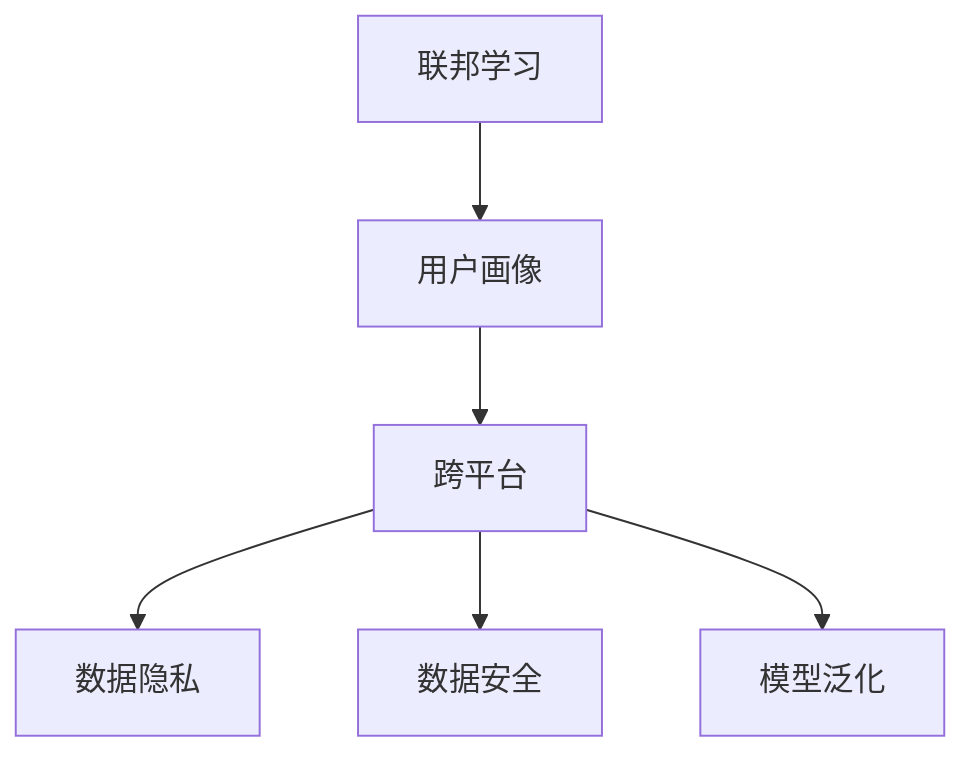

                 

# 基于联邦学习的跨平台用户画像构建

> 关键词：联邦学习,用户画像,跨平台,数据隐私,数据安全,模型泛化

## 1. 背景介绍

### 1.1 问题由来
在当前数字化时代，互联网平台和应用程序积累了大量的用户行为数据，这些数据对于构建用户画像、提升用户体验、优化业务策略具有重要价值。然而，这些数据往往分散在不同平台，且由于隐私和安全问题，跨平台数据共享和整合面临诸多挑战。

为此，联邦学习（Federated Learning, FL）应运而生，它是一种分布式机器学习范式，允许多个设备或服务器在不共享原始数据的情况下，共同训练模型，从而在提升模型性能的同时保护用户隐私和数据安全。联邦学习已经在多个领域展示了其潜力，包括跨平台用户画像构建、个性化推荐系统、医疗数据分析等。

本文将探讨基于联邦学习的跨平台用户画像构建技术，分析其核心概念、算法原理、具体实现，并结合实际应用场景，展示联邦学习在保护用户隐私和提升模型泛化能力方面的优势。

### 1.2 问题核心关键点
联邦学习的核心思想是让多个设备或服务器通过本地模型训练的参数更新，而非直接共享数据，实现全局模型的协作训练。在跨平台用户画像构建中，联邦学习可以避免单个平台的模型过拟合，并利用全局数据分布的多样性提升模型泛化能力，同时保护用户隐私和数据安全。

联邦学习的关键步骤如下：
1. 本地训练：每个设备或服务器在本地数据上训练模型，并更新模型参数。
2. 聚合参数：通过模型聚合算法，将各个设备或服务器的模型参数进行汇总，生成全局模型的参数更新。
3. 全局更新：将全局模型的参数更新分发给各个设备或服务器，用于本地模型的进一步训练。
4. 迭代优化：重复上述过程，直至模型收敛或达到预设轮数。

通过联邦学习，我们不仅能够高效地构建跨平台的统一用户画像，还能最大化地保护用户隐私和数据安全，避免单个平台的数据泄露和隐私泄露风险。

## 2. 核心概念与联系

### 2.1 核心概念概述

为更好地理解基于联邦学习的跨平台用户画像构建方法，本节将介绍几个密切相关的核心概念：

- **联邦学习（Federated Learning, FL）**：一种分布式机器学习范式，允许多个设备或服务器在不共享原始数据的情况下，共同训练模型，从而在提升模型性能的同时保护用户隐私和数据安全。

- **用户画像（User Profiling）**：通过分析用户行为数据、社交数据、交易数据等，构建用户特征和行为模型，用于个性化推荐、广告定向、用户细分等领域。

- **跨平台（Cross-Platform）**：指用户在不同平台上的行为数据，如手机App、网页、社交媒体等，通过联邦学习可以将这些数据聚合，构建统一的全球用户画像。

- **数据隐私（Data Privacy）**：指保护用户数据不被未授权的访问和使用，确保用户数据安全。联邦学习通过本地训练和参数聚合的方式，避免了数据泄露的风险。

- **数据安全（Data Security）**：指防止恶意攻击和数据篡改，确保数据完整性和可用性。联邦学习通过模型聚合和更新机制，保护了数据的安全性。

- **模型泛化（Model Generalization）**：指模型能够对新数据进行有效预测的能力。联邦学习通过跨平台数据的整合，提升了模型的泛化能力，使其能够适应更多的用户和场景。

这些核心概念之间的逻辑关系可以通过以下Mermaid流程图来展示：



这个流程图展示了大语言模型的核心概念及其之间的关系：

1. 联邦学习通过本地训练和参数聚合的方式，实现模型训练的分布式协作。
2. 用户画像通过分析用户数据，构建用户特征和行为模型。
3. 跨平台用户画像构建需要整合不同平台上的用户数据。
4. 数据隐私和安全保护是联邦学习的关键目标。
5. 模型泛化能力是联邦学习的优势之一，提升模型对新数据的预测能力。

这些概念共同构成了联邦学习在跨平台用户画像构建中的核心价值。

## 3. 核心算法原理 & 具体操作步骤
### 3.1 算法原理概述

基于联邦学习的跨平台用户画像构建，本质上是一个分布式训练和模型聚合过程。其核心思想是：通过本地设备或服务器在本地数据上训练模型，并汇总各设备的模型参数，生成全局模型的更新，在各个设备上更新本地模型，重复上述过程直至模型收敛。

形式化地，假设全局模型为 $M$，各个设备的数据集分别为 $D_i$，本地模型参数为 $\theta_i$，联邦学习过程可以表示为：

$$
\theta_{i+1} = \theta_i - \alpha \nabla_{\theta_i} L_i(\theta_i)
$$

其中 $\alpha$ 为学习率，$L_i$ 为本地损失函数，$\nabla_{\theta_i} L_i(\theta_i)$ 为损失函数对本地模型的梯度。全局模型参数的更新为：

$$
\theta_{M} = \theta_{M-1} - \alpha \nabla_{\theta_M} L_M(\theta_{M-1})
$$

其中 $L_M$ 为全局损失函数，$\nabla_{\theta_M} L_M(\theta_{M-1})$ 为损失函数对全局模型的梯度。

通过不断迭代上述过程，联邦学习实现了模型在跨平台数据上的协同训练和优化。

### 3.2 算法步骤详解

基于联邦学习的跨平台用户画像构建一般包括以下几个关键步骤：

**Step 1: 设计本地模型**

在联邦学习中，需要为每个设备或服务器设计一个本地模型，用于在本地数据上训练。本地模型应该具有足够的泛化能力，以适应跨平台数据的多样性。

**Step 2: 初始化全局模型**

初始化一个全局模型，并将其参数分布给各个设备或服务器。全局模型的初始化通常需要一定的经验或专家知识。

**Step 3: 本地训练**

每个设备或服务器在本地数据上训练本地模型，并计算损失函数对本地模型的梯度。这一步骤通常需要多次迭代，以避免局部最优解。

**Step 4: 参数聚合**

通过模型聚合算法（如模型平均、加权平均、梯度聚合等），汇总各设备的模型参数，生成全局模型的更新。这一步骤是联邦学习的关键，需要设计合理的聚合算法以确保全局模型的公平性和鲁棒性。

**Step 5: 全局更新**

将全局模型的更新分发给各个设备或服务器，用于本地模型的进一步训练。

**Step 6: 迭代优化**

重复上述过程直至模型收敛或达到预设轮数。在每一轮中，各个设备或服务器更新本地模型，并上传新的参数，进行下一轮的参数聚合和全局更新。

以上是基于联邦学习的跨平台用户画像构建的一般流程。在实际应用中，还需要针对具体任务的特点，对微调过程的各个环节进行优化设计，如改进模型聚合算法，引入更多的正则化技术，搜索最优的超参数组合等，以进一步提升模型性能。

### 3.3 算法优缺点

基于联邦学习的跨平台用户画像构建方法具有以下优点：
1. 分布式训练：可以利用分布在各个设备或服务器上的数据，提升模型的泛化能力。
2. 数据隐私保护：通过本地训练和参数聚合，避免了原始数据的共享和泄露。
3. 模型高效性：联邦学习可以在不集中数据的情况下，高效地训练模型。
4. 鲁棒性：由于本地模型独立训练，联邦学习具有较好的鲁棒性。

同时，该方法也存在一定的局限性：
1. 通信开销：模型参数的聚合和更新需要频繁的通信，增加了系统的通信开销。
2. 收敛速度：由于各个设备或服务器的数据分布可能不一致，联邦学习模型可能需要更长的训练时间才能收敛。
3. 数据异质性：各个设备或服务器的数据质量和分布可能不同，对模型的公平性和泛化能力造成影响。
4. 算法复杂性：联邦学习需要设计合理的模型聚合算法和超参数优化策略，增加了算法的复杂性。

尽管存在这些局限性，但就目前而言，联邦学习仍是大规模分布式数据集上建模的首选范式。未来相关研究的重点在于如何进一步降低通信开销，提高收敛速度，提升模型的公平性和泛化能力。

### 3.4 算法应用领域

基于联邦学习的跨平台用户画像构建方法在以下几个领域具有广泛的应用前景：

- **个性化推荐系统**：通过联邦学习整合用户在不同平台上的行为数据，提升推荐系统的精准度和个性化程度。

- **医疗数据分析**：不同医院和医疗机构的数据可能具有不同格式和特征，通过联邦学习可以将这些数据整合，构建全局化的用户画像，用于疾病预测、治疗方案优化等。

- **智能交通系统**：不同城市的交通数据可能存在差异，通过联邦学习可以整合这些数据，构建全局化的用户画像，用于智能交通系统的优化和调度。

- **金融风险控制**：不同金融机构的数据可能存在差异，通过联邦学习可以整合这些数据，构建全局化的用户画像，用于金融风险评估和控制。

- **社交媒体分析**：不同社交媒体平台的用户数据可能存在差异，通过联邦学习可以整合这些数据，构建全局化的用户画像，用于社交媒体舆情分析和社会网络挖掘。

除了上述这些经典应用外，联邦学习还被创新性地应用到更多场景中，如智慧城市、智能制造、智慧农业等，为大规模数据的协同建模提供了新的思路。

## 4. 数学模型和公式 & 详细讲解  
### 4.1 数学模型构建

本节将使用数学语言对基于联邦学习的跨平台用户画像构建过程进行更加严格的刻画。

记全局模型为 $M_{\theta}$，各设备的数据集为 $D_i=\{(x_i,y_i)\}_{i=1}^N$，其中 $x_i$ 为特征向量，$y_i$ 为标签。假设各设备的本地模型分别为 $\theta_i$，本地损失函数为 $L_i(\theta_i)$。

联邦学习的过程可以表示为：

$$
\theta_{i+1} = \theta_i - \alpha \nabla_{\theta_i} L_i(\theta_i)
$$

其中 $\alpha$ 为学习率，$\nabla_{\theta_i} L_i(\theta_i)$ 为损失函数对本地模型的梯度。全局模型参数的更新为：

$$
\theta_{M} = \theta_{M-1} - \alpha \nabla_{\theta_M} L_M(\theta_{M-1})
$$

其中 $L_M$ 为全局损失函数，$\nabla_{\theta_M} L_M(\theta_{M-1})$ 为损失函数对全局模型的梯度。

### 4.2 公式推导过程

以下我们以分类任务为例，推导联邦学习的损失函数及其梯度的计算公式。

假设模型 $M_{\theta}$ 在输入 $x$ 上的输出为 $\hat{y}=M_{\theta}(x)$，表示样本属于正类的概率。真实标签 $y \in \{0,1\}$。则二分类交叉熵损失函数定义为：

$$
\ell(M_{\theta}(x),y) = -[y\log \hat{y} + (1-y)\log (1-\hat{y})]
$$

将其代入本地损失函数，得：

$$
L_i(\theta_i) = \frac{1}{N}\sum_{i=1}^N [y_i\log M_{\theta_i}(x_i)+(1-y_i)\log(1-M_{\theta_i}(x_i))]
$$

在得到本地损失函数 $L_i$ 对本地模型 $\theta_i$ 的梯度后，即可带入联邦学习过程的更新公式，完成模型的迭代优化。重复上述过程直至收敛，最终得到适应跨平台数据的最优模型参数 $\theta^*$。

## 5. 项目实践：代码实例和详细解释说明
### 5.1 开发环境搭建

在进行联邦学习实践前，我们需要准备好开发环境。以下是使用Python进行TensorFlow联邦学习开发的环境配置流程：

1. 安装Anaconda：从官网下载并安装Anaconda，用于创建独立的Python环境。

2. 创建并激活虚拟环境：
```bash
conda create -n fl-env python=3.8 
conda activate fl-env
```

3. 安装TensorFlow：根据CUDA版本，从官网获取对应的安装命令。例如：
```bash
conda install tensorflow -c tf -c conda-forge
```

4. 安装Flax：用于联邦学习的库，提供分布式训练和模型聚合功能。
```bash
pip install flax
```

5. 安装JAX：联邦学习的核心计算引擎。
```bash
pip install jax
```

6. 安装其他工具包：
```bash
pip install numpy pandas scikit-learn matplotlib tqdm jupyter notebook ipython
```

完成上述步骤后，即可在`fl-env`环境中开始联邦学习实践。

### 5.2 源代码详细实现

这里我们以分类任务为例，给出使用TensorFlow和Flax进行联邦学习跨平台用户画像构建的Python代码实现。

首先，定义数据集和模型：

```python
import tensorflow as tf
import flax
from flax import linen as nn
import jax.numpy as jnp
from flax import optim

# 定义数据集
class Dataset(tf.data.Dataset):
    def __init__(self, data):
        self.data = data

    def __getitem__(self, item):
        return self.data[item]

    def __len__(self):
        return len(self.data)

# 定义模型
class Model(nn.Module):
    @nn.compact
    def __call__(self, inputs, training=False):
        embedding = self.embedding(inputs)
        hidden = self.layers(embedding)
        logits = self.linear(hidden)
        return logits

    def embedding(self, inputs):
        return embedding_table(inputs)

    def layers(self, embeddings):
        hidden = self.fc1(embeddings)
        hidden = self.dropout(hidden, training=training)
        hidden = self.fc2(hidden)
        hidden = self.dropout(hidden, training=training)
        return hidden

    def linear(self, embeddings):
        return linear_table(embeddings)

    def fc1(self, embeddings):
        return jnp.tanh(self.fc1_weight @ embeddings + self.fc1_bias)

    def fc2(self, embeddings):
        return jnp.tanh(self.fc2_weight @ embeddings + self.fc2_bias)

    def dropout(self, embeddings, training=True):
        return jnp.where(training, embeddings * self.dropout_rate, embeddings)

    def embedding_table(self, inputs):
        return inputs @ self.embedding_matrix

    def linear_table(self, embeddings):
        return embeddings @ self.linear_matrix
```

接着，定义损失函数和优化器：

```python
def loss_fn(logits, labels):
    return jnp.mean(tf.nn.sparse_softmax_cross_entropy_with_logits(logits=logits, labels=labels))

optimizer = optim.Adam(learning_rate=0.001)

@jax.jit
def train_step(inputs, labels, model, optimizer):
    with tf.GradientTape() as tape:
        logits = model(inputs)
        loss = loss_fn(logits, labels)
    grads = tape.gradient(loss, model.parameters())
    optimizer.apply_gradients(grads)
    return loss, model
```

然后，定义模型聚合和全局更新：

```python
# 模型聚合
def aggregate_model(model):
    return (model.linear_table, model.fc1_weight, model.fc1_bias, model.fc2_weight, model.fc2_bias)

# 全局更新
def global_step(model, global_loss, global_parameters):
    return Model.create(params=optimizer.init(global_parameters, keys.model_key, model), global_loss=global_loss)
```

最后，启动联邦学习训练流程：

```python
import tensorflow_federated as tff

# 定义数据集和分布
dataset = Dataset(data)
train_dataset = tff.model_selection.yield_from_iterator(dataset)
data_spec = tff.data.Set(Train, {"data": tf.int32, "labels": tf.int32})
model = Model.create(params=optimizer.init(model, keys.model_key), data_spec=data_spec)
global_loss = tf.keras.losses.sparse_categorical_crossentropy
tff_model = tff.learning.Model(model=model, loss_fn=global_loss, aggregate_fn=aggregate_model, update_fn=global_step)

# 训练流程
def train(tff_model, num_epochs=100):
    for epoch in range(num_epochs):
        state = tff_model.begin()
        for state, batch in zip(tff_model.state, train_dataset):
            loss = tff_model.forward_pass(state, batch)
            tff_model.backward_pass(state, loss)
        tff_model.commit(state)
    return tff_model

train(tff_model)
```

以上就是使用TensorFlow和Flax进行联邦学习跨平台用户画像构建的完整代码实现。可以看到，得益于TensorFlow和Flax的强大封装，联邦学习的过程变得简洁高效。

### 5.3 代码解读与分析

让我们再详细解读一下关键代码的实现细节：

**Dataset类**：
- `__init__`方法：初始化数据集。
- `__getitem__`方法：返回单个样本。
- `__len__`方法：返回样本数量。

**Model类**：
- `__call__`方法：定义模型的前向传播过程。
- `embedding`方法：定义特征嵌入层。
- `layers`方法：定义隐藏层。
- `linear`方法：定义线性输出层。
- `fc1`方法：定义第一层全连接层。
- `fc2`方法：定义第二层全连接层。
- `dropout`方法：定义dropout层。
- `embedding_table`方法：定义特征嵌入矩阵。
- `linear_table`方法：定义线性输出矩阵。

**loss_fn**方法：
- 定义分类任务的交叉熵损失函数。

**train_step**函数：
- 定义单轮训练过程。使用TensorFlow的GradientTape进行梯度计算，并更新模型参数。

**aggregate_model**函数：
- 定义模型聚合函数，返回需要更新全局模型的参数。

**global_step**函数：
- 定义全局更新函数，将本地模型的参数合并到全局模型中。

**train**函数：
- 定义联邦学习训练流程，重复本地训练和全局更新，直至模型收敛。

可以看到，TensorFlow和Flax为联邦学习的实现提供了强大的工具支持，使得联邦学习的过程变得更加高效和灵活。

当然，工业级的系统实现还需考虑更多因素，如模型的保存和部署、超参数的自动搜索、更灵活的任务适配层等。但核心的联邦学习范式基本与此类似。

## 6. 实际应用场景
### 6.1 智能推荐系统

基于联邦学习的跨平台用户画像构建技术，可以广泛应用于智能推荐系统的构建。传统的推荐系统往往只依赖单一平台的用户数据，难以充分挖掘用户的多样化兴趣和行为特征。通过联邦学习，可以将用户在不同平台上的行为数据整合，构建统一的全球用户画像，提升推荐系统的精准度和个性化程度。

在技术实现上，可以收集用户在电商平台、社交媒体、视频网站等不同平台上的行为数据，进行标准化处理后进行联邦学习，生成全局化的用户画像。联邦学习模型可以整合不同平台的数据，提升推荐系统的泛化能力和推荐效果。对于用户的行为预测和个性化推荐，联邦学习模型能够更好地适应跨平台数据的多样性和复杂性，提供更加精准和多样化的推荐内容。

### 6.2 医疗健康数据

医疗健康数据具有敏感性，通常存储在不同医疗机构和医院的信息系统中。传统的医疗数据分析方法往往需要集中存储和处理，存在数据泄露和隐私泄露的风险。通过联邦学习，可以将不同医疗机构的用户数据整合，构建全局化的健康画像，用于疾病预测、治疗方案优化等任务。

在实际应用中，联邦学习模型可以在各个医疗机构的数据上本地训练，通过聚合参数生成全局模型的更新，在各个医疗机构上进一步训练本地模型。联邦学习模型能够更好地保护医疗数据的安全性和隐私性，同时提升模型的泛化能力和准确性。对于患者的疾病预测和治疗方案，联邦学习模型能够从全局数据中挖掘出更多有用的信息，提供更加精准和有效的医疗服务。

### 6.3 智能城市治理

智能城市治理涉及大量的交通、环境、能源等数据，这些数据通常分散在不同平台和机构中。通过联邦学习，可以将这些数据整合，构建全局化的城市画像，用于智能交通系统的优化、环境污染监测、能源管理等任务。

在实际应用中，联邦学习模型可以在各个交通、环境监测设备和机构的数据上本地训练，通过聚合参数生成全局模型的更新，在各个设备上进一步训练本地模型。联邦学习模型能够更好地整合跨平台数据，提升智能城市治理的效率和效果，实现更高效的城市管理和资源利用。

### 6.4 未来应用展望

随着联邦学习技术的发展，其在跨平台数据协同建模中的应用将更加广泛和深入。未来联邦学习在以下几个领域具有重要的应用前景：

- **金融风险控制**：不同金融机构的数据可能存在差异，通过联邦学习可以整合这些数据，构建全局化的用户画像，用于金融风险评估和控制。

- **智慧农业**：不同农业设备和服务的数据可能存在差异，通过联邦学习可以整合这些数据，构建全局化的用户画像，用于农业数据分析和优化。

- **智能制造**：不同制造设备和系统的数据可能存在差异，通过联邦学习可以整合这些数据，构建全局化的用户画像，用于智能制造优化和预测。

- **能源管理**：不同能源设备和系统的数据可能存在差异，通过联邦学习可以整合这些数据，构建全局化的用户画像，用于能源管理和优化。

- **智慧医疗**：不同医疗机构的数据可能存在差异，通过联邦学习可以整合这些数据，构建全局化的健康画像，用于疾病预测和治疗方案优化。

这些领域的探索将进一步拓展联邦学习的应用范围，为各个行业的数字化转型提供新的技术支持。相信随着联邦学习技术的不断发展，其将在更多领域中大放异彩。

## 7. 工具和资源推荐
### 7.1 学习资源推荐

为了帮助开发者系统掌握联邦学习理论基础和实践技巧，这里推荐一些优质的学习资源：

1. 《Federated Learning: Concepts and Applications》一书：由联邦学习专家撰写，全面介绍了联邦学习的概念、算法和应用场景，是理解联邦学习理论的必备读物。

2. TensorFlow Federated（TFF）官方文档：提供了联邦学习完整的教程和样例代码，帮助开发者快速上手联邦学习。

3 CS224W《Distributed Deep Learning》课程：斯坦福大学开设的联邦学习课程，涵盖联邦学习的理论基础和实践技巧，是学习联邦学习的绝佳资源。

4 《Machine Learning Yearning》一书：由深度学习专家Andrew Ng撰写，介绍了联邦学习在分布式数据集上的应用，并提供了丰富的联邦学习算法和实践建议。

5 论文《A General Framework for Federated Learning in Unsupervised and Semi-supervised Settings》：介绍了联邦学习在无监督和半监督学习中的应用，展示了联邦学习在跨平台数据集上的强大能力。

通过对这些资源的学习实践，相信你一定能够快速掌握联邦学习技术的精髓，并用于解决实际的跨平台数据协同建模问题。

### 7.2 开发工具推荐

高效的联邦学习开发离不开优秀的工具支持。以下是几款用于联邦学习开发的常用工具：

1. TensorFlow Federated（TFF）：谷歌开发的联邦学习框架，提供了丰富的模型聚合和优化算法，是联邦学习开发的常用工具。

2. Flax：用于联邦学习的深度学习框架，提供了分布式训练和模型聚合功能，支持Flax模型的灵活构建。

3. PyTorch Federated（PyTF）：PyTorch生态系统的联邦学习框架，提供了丰富的联邦学习算法和优化策略。

4. Federated ML：开源联邦学习框架，支持TensorFlow、PyTorch等多种深度学习框架，提供分布式训练和模型聚合功能。

5. Scikit-Learn：常用的机器学习库，支持联邦学习模型的分布式训练和优化。

合理利用这些工具，可以显著提升联邦学习开发效率，加快创新迭代的步伐。

### 7.3 相关论文推荐

联邦学习技术的发展得益于学界的持续研究。以下是几篇奠基性的相关论文，推荐阅读：

1. 《Federated Learning with Statistical Guarantees: Convergence Rates and Performance Limits》：分析了联邦学习的收敛性和性能限制，提出了联邦学习的理论框架。

2. 《Federated Learning: Concept and Applications》：介绍了联邦学习的概念、算法和应用场景，是联邦学习理论研究的经典之作。

3. 《Federated Learning: Concepts and Applications》：由联邦学习专家撰写，全面介绍了联邦学习的概念、算法和应用场景，是理解联邦学习理论的必备读物。

4. 《Federated Learning via Decentralized Optimization》：提出了联邦学习的优化算法，展示了联邦学习在分布式数据集上的强大能力。

5. 《Federated Learning with Adversarial Users》：分析了联邦学习在对抗性环境下的鲁棒性，提出了联邦学习的安全保护策略。

这些论文代表了大规模分布式数据集上建模的研究进展。通过学习这些前沿成果，可以帮助研究者把握学科前进方向，激发更多的创新灵感。

## 8. 总结：未来发展趋势与挑战

### 8.1 总结

本文对基于联邦学习的跨平台用户画像构建方法进行了全面系统的介绍。首先阐述了联邦学习的背景和核心概念，明确了联邦学习在分布式数据集上协同建模的独特价值。其次，从原理到实践，详细讲解了联邦学习的数学模型和具体实现，给出了联邦学习任务开发的完整代码实例。同时，本文还广泛探讨了联邦学习在个性化推荐、医疗数据分析、智能城市治理等多个领域的应用前景，展示了联邦学习在保护用户隐私和提升模型泛化能力方面的优势。

通过本文的系统梳理，可以看到，基于联邦学习的跨平台用户画像构建技术正在成为数据协同建模的重要范式，极大地拓展了跨平台数据的应用边界，催生了更多的落地场景。联邦学习不仅能够高效地构建跨平台的统一用户画像，还能最大化地保护用户隐私和数据安全，避免单个平台的数据泄露和隐私泄露风险。未来，伴随联邦学习技术的不断演进，联邦学习必将在跨平台数据协同建模中发挥更大的作用。

### 8.2 未来发展趋势

展望未来，联邦学习在跨平台数据协同建模中的发展趋势将主要体现在以下几个方面：

1. **分布式训练的优化**：随着大规模分布式数据集的不断涌现，联邦学习需要设计更加高效的分布式训练算法，以提高训练效率和模型性能。

2. **联邦学习算法的多样化**：除了传统的模型平均和梯度聚合算法外，未来的联邦学习将探索更多高效的算法，如对偶优化、 federated SGD等，以提高联邦学习的效率和准确性。

3. **模型融合与迁移学习**：联邦学习可以通过模型融合和迁移学习，将多个分布式训练的模型进行联合优化，提升模型的泛化能力和鲁棒性。

4. **数据安全和隐私保护**：联邦学习需要在确保模型性能的同时，进一步提升数据安全和隐私保护的能力，防止模型参数泄露和数据篡改。

5. **异构数据和多模态数据整合**：联邦学习需要能够处理异构数据和多模态数据，如文本、图像、语音等，提升跨平台数据协同建模的能力。

6. **联邦学习的实时化**：联邦学习需要在实际应用中实现实时更新和优化，以适应数据流和用户行为的变化。

7. **联邦学习的跨平台协同**：联邦学习需要设计更加灵活的跨平台协同机制，使得不同平台上的数据和模型能够无缝整合，提升整体系统的效率和效果。

以上趋势凸显了联邦学习在跨平台数据协同建模中的广阔前景。这些方向的探索发展，必将进一步提升联邦学习的效率和准确性，为跨平台数据协同建模带来新的突破。

### 8.3 面临的挑战

尽管联邦学习在跨平台数据协同建模中展现出巨大的潜力，但在迈向更加智能化、普适化应用的过程中，它仍面临诸多挑战：

1. **通信开销**：联邦学习需要频繁的通信和数据交换，增加了系统的通信开销和延迟。如何降低通信开销，提升联邦学习的效率，是未来研究的重要方向。

2. **模型一致性**：联邦学习需要在确保各个设备或服务器数据一致性的同时，提高模型的泛化能力和公平性。如何在多设备或服务器协同训练中，保证模型的一致性，是一个重要的研究课题。

3. **数据异质性**：不同设备或服务器的数据质量和分布可能不同，如何处理数据异质性，提升联邦学习的公平性和泛化能力，仍然是一个挑战。

4. **模型鲁棒性**：联邦学习需要在多个设备或服务器上协同训练，模型的鲁棒性是一个重要的研究课题。如何提升模型的鲁棒性，防止模型参数泄露和数据篡改，是一个重要的研究方向。

5. **算法复杂性**：联邦学习需要设计更加高效的算法和优化策略，以提高联邦学习的效率和准确性。如何在算法复杂性和模型性能之间寻求平衡，是一个重要的研究方向。

尽管存在这些挑战，但联邦学习作为一种分布式协同建模的方法，其核心价值在于保护数据隐私和提升模型泛化能力，具有广阔的应用前景。未来研究需要在算法优化、模型聚合、数据管理等方面寻求新的突破，以进一步提升联邦学习的效果和实用性。

### 8.4 研究展望

未来的联邦学习研究将在以下几个方面寻求新的突破：

1. **联邦学习与传统机器学习算法结合**：将联邦学习与传统机器学习算法结合，探索联邦学习在更多任务中的应用，提升联邦学习的泛化能力和性能。

2. **联邦学习在多模态数据上的应用**：将联邦学习应用于多模态数据的协同建模，如文本、图像、语音等，提升跨平台数据协同建模的能力。

3. **联邦学习在隐私保护和数据安全方面的应用**：将联邦学习应用于隐私保护和数据安全，防止数据泄露和隐私泄露，保护用户的隐私和数据安全。

4. **联邦学习在医疗、金融等高风险领域的应用**：将联邦学习应用于医疗、金融等高风险领域，提升数据协同建模的能力，提供更加精准和安全的解决方案。

5. **联邦学习在联邦化的云计算和边缘计算中的应用**：将联邦学习应用于联邦化的云计算和边缘计算，提升分布式数据协同建模的能力，提供更加高效和灵活的解决方案。

这些研究方向将进一步拓展联邦学习的应用范围，为跨平台数据协同建模提供新的技术支持，推动联邦学习技术的发展和应用。

## 9. 附录：常见问题与解答

**Q1：联邦学习在跨平台数据协同建模中面临的主要挑战是什么？**

A: 联邦学习在跨平台数据协同建模中面临的主要挑战包括：

1. 通信开销：联邦学习需要频繁的通信和数据交换，增加了系统的通信开销和延迟。

2. 模型一致性：联邦学习需要在确保各个设备或服务器数据一致性的同时，提高模型的泛化能力和公平性。

3. 数据异质性：不同设备或服务器的数据质量和分布可能不同，如何处理数据异质性，提升联邦学习的公平性和泛化能力。

4. 模型鲁棒性：联邦学习需要在多个设备或服务器上协同训练，模型的鲁棒性是一个重要的研究课题。

5. 算法复杂性：联邦学习需要设计更加高效的算法和优化策略，以提高联邦学习的效率和准确性。

这些挑战需要未来的研究进一步探索和解决。

**Q2：联邦学习如何保护用户隐私和数据安全？**

A: 联邦学习通过本地训练和参数聚合的方式，避免了原始数据的共享和泄露，从而保护用户隐私和数据安全。具体来说，联邦学习模型在各个设备或服务器上本地训练，然后将模型参数汇总到全局模型中进行优化，整个过程中原始数据从未离开本地设备或服务器，保证了数据的安全性。

此外，联邦学习还引入了差分隐私、同态加密等隐私保护技术，进一步提升了数据安全性和隐私保护能力。通过联邦学习，我们可以在不共享数据的情况下，高效地协同训练模型，提升模型的性能和泛化能力，同时保护用户隐私和数据安全。

**Q3：联邦学习在跨平台数据协同建模中如何实现模型泛化？**

A: 联邦学习在跨平台数据协同建模中实现模型泛化的主要通过以下几个方式：

1. 模型融合：联邦学习可以通过模型融合和迁移学习，将多个分布式训练的模型进行联合优化，提升模型的泛化能力和鲁棒性。

2. 多设备协同训练：联邦学习通过多个设备或服务器的协同训练，充分利用跨平台数据的多样性和丰富性，提升模型的泛化能力。

3. 数据多样性：联邦学习通过整合不同平台和机构的数据，提升模型对跨平台数据的多样性和复杂性的适应能力，从而提升模型的泛化能力。

4. 数据增强：联邦学习可以通过数据增强技术，如数据合成、对抗样本生成等，提升模型的泛化能力和鲁棒性。

5. 模型自适应：联邦学习模型可以在新数据上自适应，通过不断的微调和优化，提升模型的泛化能力和适应性。

这些方式使得联邦学习在跨平台数据协同建模中能够更好地适应多样化的数据分布，提升模型的泛化能力和鲁棒性，提供更加精准和有效的解决方案。

**Q4：联邦学习在跨平台数据协同建模中的未来发展方向是什么？**

A: 联邦学习在跨平台数据协同建模中的未来发展方向主要包括以下几个方面：

1. 分布式训练的优化：随着大规模分布式数据集的不断涌现，联邦学习需要设计更加高效的分布式训练算法，以提高训练效率和模型性能。

2. 联邦学习算法的多样化：除了传统的模型平均和梯度聚合算法外，未来的联邦学习将探索更多高效的算法，如对偶优化、 federated SGD等，以提高联邦学习的效率和准确性。

3. 模型融合与迁移学习：联邦学习可以通过模型融合和迁移学习，将多个分布式训练的模型进行联合优化，提升模型的泛化能力和鲁棒性。

4. 数据安全和隐私保护：联邦学习需要在确保模型性能的同时，进一步提升数据安全和隐私保护的能力，防止模型参数泄露和数据篡改。

5. 异构数据和多模态数据整合：联邦学习需要能够处理异构数据和多模态数据，如文本、图像、语音等，提升跨平台数据协同建模的能力。

6. 联邦学习的实时化：联邦学习需要在实际应用中实现实时更新和优化，以适应数据流和用户行为的变化。

7. 联邦学习的跨平台协同：联邦学习需要设计更加灵活的跨平台协同机制，使得不同平台上的数据和模型能够无缝整合，提升整体系统的效率和效果。

这些研究方向将进一步拓展联邦学习的应用范围，为跨平台数据协同建模提供新的技术支持，推动联邦学习技术的发展和应用。

作者：禅与计算机程序设计艺术 / Zen and the Art of Computer Programming

