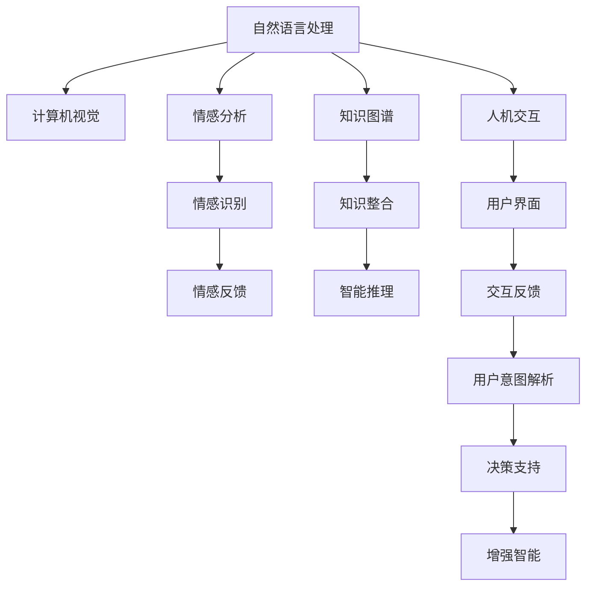

                 

## 1. 背景介绍

在当前快速发展的数字化时代，人工智能(AI)技术已经深入到社会各个领域，极大地改变了人们的工作和生活方式。尤其是智能系统的广泛应用，显著提升了人们认知能力的边界，拓展了人类与机器的协同空间。本文旨在深入探讨人机协作的机制，分析其对认知能力的增强作用，并展望未来AI与人类智慧共生的可能。

### 1.1 问题由来

人工智能技术的飞速进步，尤其是深度学习、自然语言处理、计算机视觉等领域的突破，极大地推动了智能系统的落地应用。在这些应用中，人机协作已经成为了提高工作效率、增强决策支持、提升用户体验的重要手段。从自动驾驶到智能客服，从智慧医疗到智能教育，AI技术正逐渐融入人类生活的方方面面，而人机协作则是这些应用的基础和关键。

然而，尽管AI技术已经取得了显著进展，但真正实现人机协作并非易事。一方面，AI系统必须具备足够的智能和自主性，才能与人类有效互动；另一方面，人类需要能够理解和适应AI的行为，才能充分发挥其潜力。本文旨在探讨这一问题，分析人机协作的机制，并探讨其对人类认知能力的影响。

### 1.2 问题核心关键点

人机协作的核心在于如何实现AI与人类之间的信息共享、知识整合和情感互动。要实现这一目标，需要解决以下关键问题：

1. **信息共享**：AI系统需要能够理解人类的语言、行为和情感，将人类的意图和需求转化为机器可以执行的指令。
2. **知识整合**：AI系统需要将自身知识与人类知识进行融合，形成更加全面、准确的认知模型。
3. **情感互动**：AI系统需要具备一定的情感识别和响应能力，与人类进行情感共鸣。

这些问题的解决，依赖于多种技术手段，包括自然语言处理、计算机视觉、情感分析、知识图谱等。本文将深入分析这些技术的原理和应用，探讨其对人类认知能力的增强作用。

## 2. 核心概念与联系

### 2.1 核心概念概述

为更好地理解人机协作的机制，本节将介绍几个密切相关的核心概念：

- **自然语言处理(NLP)**：指利用计算机处理、理解和生成人类语言的技术，包括文本分类、信息抽取、情感分析、机器翻译等。
- **计算机视觉(CV)**：利用计算机处理和分析图像、视频等视觉数据的领域，包括图像识别、物体检测、图像分割等。
- **情感分析**：分析文本或语音中包含的情感信息，识别情绪、态度和观点。
- **知识图谱**：构建语义网络，将各类知识实体和关系组织在一起，支持复杂的推理和决策。
- **人机交互**：研究人机之间信息交互的方式和界面，提升用户体验和互动效率。
- **增强智能**：指通过结合人类智慧和AI技术，使AI系统具备更强的理解和决策能力，扩展人类认知边界。

这些核心概念之间的逻辑关系可以通过以下Mermaid流程图来展示：



这个流程图展示了一系列关键技术的交互关系：

1. 自然语言处理(NLP)和计算机视觉(CV)处理输入数据。
2. 情感分析用于理解文本或语音中的情感信息。
3. 知识图谱用于整合知识，支持智能推理。
4. 人机交互提供用户界面，获取用户意图。
5. 增强智能综合上述技术，提升决策支持能力。

这些技术共同构成了人机协作的基础，使得AI系统能够理解人类需求，整合知识，做出合理决策，并实时反馈结果，从而提升人类认知能力。

## 3. 核心算法原理 & 具体操作步骤

### 3.1 算法原理概述

人机协作的算法原理主要基于以下几个核心思想：

1. **信息共享**：通过自然语言处理技术，将人类语言转化为计算机可理解的格式，实现信息交换。
2. **知识整合**：利用知识图谱和机器学习技术，整合人类的先验知识和AI的推理能力，形成更加全面和准确的认知模型。
3. **情感互动**：通过情感分析技术，理解人类情感，实现情感共鸣和反馈。

### 3.2 算法步骤详解

人机协作的具体操作流程可以分为以下几个步骤：

**Step 1: 数据收集与预处理**

1. **数据收集**：从用户交互中收集数据，包括文本、语音、图像等。
2. **数据清洗**：去除噪声数据，进行文本分词、语音分割等预处理。

**Step 2: 特征提取与表示**

1. **特征提取**：利用自然语言处理和计算机视觉技术，将原始数据转换为特征向量。
2. **向量表示**：将特征向量转换为模型可以理解的格式，如词向量、图像特征向量等。

**Step 3: 信息理解与交互**

1. **意图解析**：使用意图识别算法，理解用户的输入意图。
2. **知识检索**：根据用户意图，从知识图谱中检索相关信息。
3. **决策支持**：利用机器学习算法，综合用户意图和知识信息，做出合理决策。

**Step 4: 情感分析与反馈**

1. **情感识别**：分析用户的情感信息，识别情绪和态度。
2. **情感反馈**：根据情感识别结果，给出相应的情感反馈，增强用户体验。

**Step 5: 结果输出与调整**

1. **结果输出**：将决策结果以可理解的形式呈现给用户。
2. **用户调整**：根据用户反馈，调整算法参数和模型结构，优化决策效果。

### 3.3 算法优缺点

人机协作的算法具有以下优点：

1. **信息共享**：通过自然语言处理和计算机视觉技术，可以实现高效的信息传递，提升决策速度和准确性。
2. **知识整合**：利用知识图谱和机器学习技术，可以整合各类知识，形成更加全面和准确的认知模型。
3. **情感互动**：通过情感分析技术，可以实现情感共鸣和反馈，提升用户体验。

同时，该算法也存在一些局限性：

1. **复杂性高**：需要同时处理多种数据类型和复杂信息，实现难度较大。
2. **资源消耗大**：需要大量的计算资源进行数据处理和模型训练。
3. **效果依赖数据质量**：数据质量直接影响信息理解、知识整合和情感识别的效果。
4. **隐私保护问题**：在处理用户数据时，需要注意隐私保护，避免数据泄露。

尽管存在这些局限性，但就目前而言，人机协作算法在提升认知能力方面仍具有显著优势，是未来智能系统的重要发展方向。

### 3.4 算法应用领域

人机协作技术已经在多个领域得到了广泛应用，例如：

- **智能客服**：利用自然语言处理技术，实现与用户的对话交互，提供高效的客户服务。
- **智能医疗**：结合知识图谱和情感分析，提供精准的诊断和治疗建议，增强医疗决策支持。
- **智能教育**：通过知识整合和情感互动，提供个性化的教育内容，提升学习体验。
- **自动驾驶**：结合计算机视觉和自然语言处理技术，实现与用户的智能互动，提升驾驶安全性。
- **智能推荐系统**：利用机器学习算法，结合用户情感和知识图谱，提供个性化的产品推荐。

除了这些经典应用外，人机协作技术还在更多场景中得到了创新性地应用，如智能家居、智能安防、智能办公等，为各行各业带来了新的变革和机遇。

## 4. 数学模型和公式 & 详细讲解 & 举例说明

### 4.1 数学模型构建

在数学上，人机协作的算法可以表示为以下几个关键组件的组合：

1. **自然语言处理模型**：如BERT、GPT等，用于处理文本信息。
2. **计算机视觉模型**：如ResNet、YOLO等，用于处理图像信息。
3. **情感分析模型**：如CNN、LSTM等，用于理解情感信息。
4. **知识图谱模型**：如GraphSAGE、GNN等，用于整合知识信息。

### 4.2 公式推导过程

以自然语言处理和情感分析为例，详细推导其数学模型：

**自然语言处理模型**：

设文本序列为 $x_1, x_2, ..., x_n$，预训练模型为 $M_{\theta}$，其输出为 $h_1, h_2, ..., h_n$，则：

$$
h_i = M_{\theta}(x_i)
$$

其中 $h_i$ 为第 $i$ 个单词的表示向量。

**情感分析模型**：

设情感标签为 $y$，使用CNN模型进行情感分类，其输出为 $s$，则：

$$
s = \sigma(\sum_{i=1}^{n} \omega_i h_i)
$$

其中 $\sigma$ 为激活函数，$\omega_i$ 为单词权重向量，$n$ 为单词数量。

### 4.3 案例分析与讲解

以智能客服系统为例，分析人机协作的算法应用：

1. **数据收集与预处理**：
   - 从用户对话中收集文本数据。
   - 进行文本清洗和分词，去除停用词和噪声。

2. **特征提取与表示**：
   - 利用BERT模型将文本转换为向量表示。
   - 使用Transformer编码器进一步处理向量，提取关键特征。

3. **信息理解与交互**：
   - 使用意图识别算法解析用户意图。
   - 从知识图谱中检索相关问题，利用深度学习算法生成回答。

4. **情感分析与反馈**：
   - 分析用户文本中的情感信息，识别情绪和态度。
   - 根据情感分析结果，给出相应的情感反馈，提升用户体验。

5. **结果输出与调整**：
   - 将生成回答以可理解的形式返回用户。
   - 根据用户反馈调整模型参数，优化回答质量。

## 5. 项目实践：代码实例和详细解释说明

### 5.1 开发环境搭建

在进行人机协作项目开发前，需要准备好开发环境。以下是使用Python进行PyTorch开发的环境配置流程：

1. 安装Anaconda：从官网下载并安装Anaconda，用于创建独立的Python环境。

2. 创建并激活虚拟环境：
```bash
conda create -n my_env python=3.8 
conda activate my_env
```

3. 安装PyTorch：根据CUDA版本，从官网获取对应的安装命令。例如：
```bash
conda install pytorch torchvision torchaudio cudatoolkit=11.1 -c pytorch -c conda-forge
```

4. 安装Transformers库：
```bash
pip install transformers
```

5. 安装各类工具包：
```bash
pip install numpy pandas scikit-learn matplotlib tqdm jupyter notebook ipython
```

完成上述步骤后，即可在`my_env`环境中开始人机协作项目的开发。

### 5.2 源代码详细实现

这里以智能客服系统为例，给出使用Transformers库进行自然语言处理和情感分析的PyTorch代码实现。

首先，定义自然语言处理和情感分析的任务数据集：

```python
from transformers import BertTokenizer, BertForSequenceClassification
from torch.utils.data import Dataset
import torch

class CustomerData(Dataset):
    def __init__(self, texts, labels, tokenizer):
        self.texts = texts
        self.labels = labels
        self.tokenizer = tokenizer
        
    def __len__(self):
        return len(self.texts)
    
    def __getitem__(self, item):
        text = self.texts[item]
        label = self.labels[item]
        
        encoding = self.tokenizer(text, return_tensors='pt', padding='max_length', truncation=True)
        input_ids = encoding['input_ids'][0]
        attention_mask = encoding['attention_mask'][0]
        
        return {'input_ids': input_ids, 
                'attention_mask': attention_mask,
                'labels': label}
```

然后，定义模型和优化器：

```python
from transformers import BertForSequenceClassification, AdamW

model = BertForSequenceClassification.from_pretrained('bert-base-cased', num_labels=2)

optimizer = AdamW(model.parameters(), lr=2e-5)
```

接着，定义训练和评估函数：

```python
from torch.utils.data import DataLoader
from tqdm import tqdm
from sklearn.metrics import accuracy_score

device = torch.device('cuda') if torch.cuda.is_available() else torch.device('cpu')
model.to(device)

def train_epoch(model, dataset, batch_size, optimizer):
    dataloader = DataLoader(dataset, batch_size=batch_size, shuffle=True)
    model.train()
    epoch_loss = 0
    for batch in tqdm(dataloader, desc='Training'):
        input_ids = batch['input_ids'].to(device)
        attention_mask = batch['attention_mask'].to(device)
        labels = batch['labels'].to(device)
        model.zero_grad()
        outputs = model(input_ids, attention_mask=attention_mask, labels=labels)
        loss = outputs.loss
        epoch_loss += loss.item()
        loss.backward()
        optimizer.step()
    return epoch_loss / len(dataloader)

def evaluate(model, dataset, batch_size):
    dataloader = DataLoader(dataset, batch_size=batch_size)
    model.eval()
    correct = 0
    total = 0
    with torch.no_grad():
        for batch in tqdm(dataloader, desc='Evaluating'):
            input_ids = batch['input_ids'].to(device)
            attention_mask = batch['attention_mask'].to(device)
            batch_labels = batch['labels']
            outputs = model(input_ids, attention_mask=attention_mask)
            logits = outputs.logits.argmax(dim=1)
            correct += (logits == batch_labels).sum().item()
            total += len(batch_labels)
    
    return accuracy_score(batch_labels, logits)
```

最后，启动训练流程并在测试集上评估：

```python
epochs = 5
batch_size = 16

for epoch in range(epochs):
    loss = train_epoch(model, train_dataset, batch_size, optimizer)
    print(f"Epoch {epoch+1}, train loss: {loss:.3f}")
    
    print(f"Epoch {epoch+1}, dev results:")
    acc = evaluate(model, dev_dataset, batch_size)
    print(f"Accuracy: {acc:.3f}")
    
print("Test results:")
test_acc = evaluate(model, test_dataset, batch_size)
print(f"Accuracy: {test_acc:.3f}")
```

以上就是使用PyTorch对BERT进行情感分析任务开发的完整代码实现。可以看到，得益于Transformers库的强大封装，我们可以用相对简洁的代码完成BERT模型的加载和微调。

### 5.3 代码解读与分析

让我们再详细解读一下关键代码的实现细节：

**CustomerData类**：
- `__init__`方法：初始化文本、标签、分词器等关键组件。
- `__len__`方法：返回数据集的样本数量。
- `__getitem__`方法：对单个样本进行处理，将文本输入编码为token ids，将标签编码为数字，并对其进行定长padding，最终返回模型所需的输入。

**BertForSequenceClassification模型**：
- 使用Bert模型进行序列分类，适用于情感分析任务。
- 模型输入为输入id、attention mask和标签。

**train_epoch函数**：
- 定义训练数据集，每次迭代从dataloader中获取一批样本。
- 在每个批次上前向传播计算loss并反向传播更新模型参数，最后返回该epoch的平均loss。

**evaluate函数**：
- 定义评估数据集，每次迭代从dataloader中获取一批样本。
- 在每个批次上前向传播计算模型预测结果，并与标签进行对比，输出分类准确率。

**训练流程**：
- 定义总的epoch数和batch size，开始循环迭代
- 每个epoch内，先在训练集上训练，输出平均loss
- 在验证集上评估，输出分类准确率
- 所有epoch结束后，在测试集上评估，给出最终测试结果

可以看到，PyTorch配合Transformers库使得BERT微调的代码实现变得简洁高效。开发者可以将更多精力放在数据处理、模型改进等高层逻辑上，而不必过多关注底层的实现细节。

当然，工业级的系统实现还需考虑更多因素，如模型的保存和部署、超参数的自动搜索、更灵活的任务适配层等。但核心的微调范式基本与此类似。

## 6. 实际应用场景

### 6.1 智能客服系统

基于人机协作技术的智能客服系统，可以提供24/7不间断的客户服务，快速响应客户咨询，提升客户体验。通过自然语言处理和情感分析，系统能够理解用户的问题和情感，提供个性化的回答和情感共鸣，从而提升用户的满意度和忠诚度。

在技术实现上，可以收集企业的历史客服对话记录，将问题和最佳答复构建成监督数据，在此基础上对预训练模型进行微调。微调后的模型能够自动理解用户意图，匹配最合适的答案模板进行回复。对于用户提出的新问题，还可以接入检索系统实时搜索相关内容，动态组织生成回答。如此构建的智能客服系统，能大幅提升客户咨询体验和问题解决效率。

### 6.2 智能医疗

智能医疗系统通过结合自然语言处理和情感分析技术，可以实现精准的诊断和治疗建议，增强医疗决策支持。系统能够理解医生的询问，提供相关的疾病信息、药物信息和病例数据，帮助医生快速做出诊断和治疗方案。

在具体实现上，可以使用知识图谱整合各类医疗知识，结合自然语言处理技术，解析医生的提问，检索相关医疗信息。同时，系统还应具备情感分析能力，理解患者的情感状态，提供更人性化的医疗服务。

### 6.3 智能教育

智能教育系统通过人机协作技术，能够提供个性化的教育内容，提升学习体验。系统能够理解学生的学习需求，根据学习进度和兴趣，推荐适合的学习材料和课程，提供个性化的学习路径。

在具体实现上，可以使用知识图谱整合各类教育资源，结合自然语言处理技术，解析学生的学习意图，推荐适合的学习内容。同时，系统还应具备情感分析能力，理解学生的情感状态，提供针对性的情感支持和反馈。

### 6.4 未来应用展望

随着人机协作技术的不断发展，未来在更多领域都将得到应用，为各行各业带来新的变革和机遇：

1. **智慧城市治理**：结合自然语言处理和情感分析技术，提供城市事件监测、舆情分析、应急指挥等服务，提高城市管理的自动化和智能化水平，构建更安全、高效的未来城市。

2. **企业生产管理**：通过人机协作技术，实现生产流程自动化、智能化，提升生产效率和产品质量，降低生产成本。

3. **社交媒体分析**：利用自然语言处理和情感分析技术，实时监测社交媒体上的舆情变化，提供决策支持，及时应对社会热点问题。

4. **个性化推荐系统**：结合自然语言处理和情感分析技术，提供个性化的产品推荐、内容推荐等，提升用户体验和满意度。

5. **智能家居**：结合自然语言处理和情感分析技术，实现家庭智能设备互联，提供个性化的智能家居服务，提升家庭生活质量。

6. **智能安防**：结合计算机视觉和情感分析技术，实现视频监控、人脸识别、行为分析等，提高公共安全水平。

未来，人机协作技术将在更多领域得到应用，为人类认知智能的进化带来深远影响。

## 7. 工具和资源推荐

### 7.1 学习资源推荐

为了帮助开发者系统掌握人机协作技术，这里推荐一些优质的学习资源：

1. **《自然语言处理综论》**：斯坦福大学教材，系统介绍了自然语言处理的基本概念和前沿技术，是入门NLP领域的经典读物。

2. **《计算机视觉：模型、学习与推理》**：CMU教材，深入浅出地介绍了计算机视觉的基础理论和实践方法，涵盖图像处理、特征提取、目标检测等。

3. **《情感分析：理论与实践》**：开源书籍，介绍了情感分析的基本原理和实践方法，包括文本情感分析、语音情感分析等。

4. **Kaggle竞赛**：Kaggle平台上有大量与情感分析、自然语言处理相关的竞赛项目，可以实践和应用所学知识。

5. **PyTorch官方文档**：PyTorch官方文档详细介绍了PyTorch框架的使用方法和API，是开发者不可或缺的参考资料。

6. **Transformers官方文档**：Transformers官方文档介绍了各种预训练模型的使用方法和API，是进行微调任务开发的必备资料。

通过对这些资源的学习实践，相信你一定能够快速掌握人机协作技术的精髓，并用于解决实际的NLP问题。

### 7.2 开发工具推荐

高效的开发离不开优秀的工具支持。以下是几款用于人机协作开发的常用工具：

1. PyTorch：基于Python的开源深度学习框架，灵活动态的计算图，适合快速迭代研究。大部分预训练语言模型都有PyTorch版本的实现。

2. TensorFlow：由Google主导开发的开源深度学习框架，生产部署方便，适合大规模工程应用。同样有丰富的预训练语言模型资源。

3. Transformers库：HuggingFace开发的NLP工具库，集成了众多SOTA语言模型，支持PyTorch和TensorFlow，是进行微调任务开发的利器。

4. Weights & Biases：模型训练的实验跟踪工具，可以记录和可视化模型训练过程中的各项指标，方便对比和调优。与主流深度学习框架无缝集成。

5. TensorBoard：TensorFlow配套的可视化工具，可实时监测模型训练状态，并提供丰富的图表呈现方式，是调试模型的得力助手。

6. Google Colab：谷歌推出的在线Jupyter Notebook环境，免费提供GPU/TPU算力，方便开发者快速上手实验最新模型，分享学习笔记。

合理利用这些工具，可以显著提升人机协作任务的开发效率，加快创新迭代的步伐。

### 7.3 相关论文推荐

人机协作技术的快速发展得益于学界的持续研究。以下是几篇奠基性的相关论文，推荐阅读：

1. **Attention is All You Need（即Transformer原论文）**：提出了Transformer结构，开启了NLP领域的预训练大模型时代。

2. **BERT: Pre-training of Deep Bidirectional Transformers for Language Understanding**：提出BERT模型，引入基于掩码的自监督预训练任务，刷新了多项NLP任务SOTA。

3. **Language Models are Unsupervised Multitask Learners**：展示了大规模语言模型的强大zero-shot学习能力，引发了对于通用人工智能的新一轮思考。

4. **Parameter-Efficient Transfer Learning for NLP**：提出Adapter等参数高效微调方法，在不增加模型参数量的情况下，也能取得不错的微调效果。

5. **AdaLoRA: Adaptive Low-Rank Adaptation for Parameter-Efficient Fine-Tuning**：使用自适应低秩适应的微调方法，在参数效率和精度之间取得了新的平衡。

6. **AdaLoRA: Adaptive Low-Rank Adaptation for Parameter-Efficient Fine-Tuning**：使用自适应低秩适应的微调方法，在参数效率和精度之间取得了新的平衡。

这些论文代表了大语言模型微调技术的发展脉络。通过学习这些前沿成果，可以帮助研究者把握学科前进方向，激发更多的创新灵感。

## 8. 总结：未来发展趋势与挑战

### 8.1 总结

本文对基于人机协作的增强智能技术进行了全面系统的介绍。首先阐述了人机协作的机制和其对认知能力的增强作用，明确了该技术在提升决策支持、增强用户体验方面的独特价值。其次，从原理到实践，详细讲解了自然语言处理、计算机视觉、情感分析等核心技术的数学模型和算法步骤，给出了具体代码实现。同时，本文还广泛探讨了人机协作技术在智能客服、智能医疗、智能教育等多个行业领域的应用前景，展示了其广阔的想象空间。

通过本文的系统梳理，可以看到，基于人机协作的增强智能技术在提升人类认知能力方面具有显著优势，是未来智能系统的重要发展方向。未来，随着技术的不断进步，人机协作技术将更加智能、高效，为各行各业带来更多的创新和机遇。

### 8.2 未来发展趋势

展望未来，人机协作技术的进一步发展将呈现以下几个趋势：

1. **深度融合**：人机协作技术将更加深入地融入各行各业，提供更加精准的决策支持和个性化服务。
2. **多模态融合**：结合自然语言处理、计算机视觉、情感分析等多种技术，实现多模态信息的协同建模，提升系统智能水平。
3. **情感智能**：开发更加先进的情感分析技术，增强系统对人类情感的理解和响应能力。
4. **知识图谱**：利用知识图谱技术，整合各类知识，增强系统的推理和决策能力。
5. **分布式计算**：利用分布式计算技术，提升系统的计算能力和训练效率。
6. **隐私保护**：加强隐私保护措施，确保数据安全和用户隐私。

这些趋势将推动人机协作技术向更加智能、高效、安全的方向发展，为人类认知智能的进化带来深远影响。

### 8.3 面临的挑战

尽管人机协作技术已经取得了显著进展，但在迈向更加智能化、普适化应用的过程中，仍面临诸多挑战：

1. **数据质量和多样性**：高质量、多样化的数据是实现精准理解和决策的基础，但获取大规模数据仍需大量投入。
2. **模型复杂性**：实现高效的多模态融合和复杂推理，需要处理大量数据和模型参数，实现难度较大。
3. **隐私保护**：在处理用户数据时，需要确保数据安全和隐私保护，避免数据泄露和滥用。
4. **算力需求**：大规模数据处理和模型训练需要高性能计算资源，算力成本较高。
5. **系统可靠性**：人机协作系统的可靠性直接影响用户体验，需要持续优化和改进。

尽管存在这些挑战，但通过不断探索和创新，相信人机协作技术将在未来得到更好的解决，成为推动智能技术发展的重要力量。

### 8.4 研究展望

面对人机协作技术所面临的挑战，未来的研究需要在以下几个方面寻求新的突破：

1. **高效数据处理**：开发高效的数据处理和存储技术，提高数据质量和多样性，降低数据获取成本。
2. **模型优化**：优化模型结构和参数设置，提升模型效率和精度，降低算力需求。
3. **隐私保护**：加强数据加密、匿名化等隐私保护技术，确保数据安全和隐私保护。
4. **系统可靠性**：提升系统的稳定性和可靠性，确保系统在各种场景下的良好表现。
5. **多领域应用**：开发更加通用的人机协作技术，拓展应用场景，推动技术在更多领域落地。
6. **跨学科融合**：结合心理学、社会学等多学科知识，提升系统的认知能力和决策水平。

这些研究方向的探索，必将引领人机协作技术迈向更高的台阶，为构建安全、可靠、可解释、可控的智能系统铺平道路。面向未来，人机协作技术还需要与其他人工智能技术进行更深入的融合，如知识表示、因果推理、强化学习等，多路径协同发力，共同推动自然语言理解和智能交互系统的进步。只有勇于创新、敢于突破，才能不断拓展人机协作的边界，让智能技术更好地造福人类社会。

## 9. 附录：常见问题与解答

**Q1：人机协作技术在提升人类认知能力方面有哪些具体应用？**

A: 人机协作技术在提升人类认知能力方面的具体应用包括：

1. **智能客服系统**：通过自然语言处理和情感分析，系统能够理解用户的问题和情感，提供个性化的回答和情感共鸣，从而提升用户的满意度和忠诚度。

2. **智能医疗**：结合自然语言处理和情感分析技术，实现精准的诊断和治疗建议，增强医疗决策支持。系统能够理解医生的询问，提供相关的疾病信息、药物信息和病例数据，帮助医生快速做出诊断和治疗方案。

3. **智能教育**：通过人机协作技术，能够提供个性化的教育内容，提升学习体验。系统能够理解学生的学习需求，根据学习进度和兴趣，推荐适合的学习材料和课程，提供个性化的学习路径。

4. **智慧城市治理**：结合自然语言处理和情感分析技术，提供城市事件监测、舆情分析、应急指挥等服务，提高城市管理的自动化和智能化水平，构建更安全、高效的未来城市。

5. **企业生产管理**：通过人机协作技术，实现生产流程自动化、智能化，提升生产效率和产品质量，降低生产成本。

6. **社交媒体分析**：利用自然语言处理和情感分析技术，实时监测社交媒体上的舆情变化，提供决策支持，及时应对社会热点问题。

7. **个性化推荐系统**：结合自然语言处理和情感分析技术，提供个性化的产品推荐、内容推荐等，提升用户体验和满意度。

**Q2：人机协作技术在实际应用中如何平衡数据和算力成本？**

A: 在人机协作技术的实际应用中，数据和算力成本是两个重要的考量因素。以下是一些平衡数据和算力成本的方法：

1. **数据增强**：通过数据增强技术，利用已有数据生成更多的训练样本，降低数据获取成本。

2. **分布式计算**：利用分布式计算技术，提升计算效率，降低算力成本。

3. **模型压缩**：通过模型压缩技术，减小模型大小，降低计算和存储成本。

4. **迁移学习**：利用迁移学习技术，在小规模数据集上进行微调，减少数据和算力需求。

5. **参数高效微调**：通过参数高效微调技术，只调整少量参数，减少计算和存储成本。

6. **模型蒸馏**：利用模型蒸馏技术，通过教师模型指导学生模型，减小模型规模和计算成本。

7. **边缘计算**：利用边缘计算技术，将部分计算任务转移到边缘设备，降低数据传输和存储成本。

8. **数据分片**：将数据分为多个分片，并行处理，提高计算效率。

这些方法可以帮助平衡数据和算力成本，提升人机协作技术的实际应用效果。

**Q3：人机协作技术在提升人类认知能力方面的局限性是什么？**

A: 人机协作技术在提升人类认知能力方面存在一些局限性，主要包括以下几点：

1. **数据依赖性**：人机协作技术依赖于高质量的数据，数据质量和多样性直接影响系统的准确性和鲁棒性。

2. **模型复杂性**：实现高效的多模态融合和复杂推理，需要处理大量数据和模型参数，实现难度较大。

3. **隐私保护问题**：在处理用户数据时，需要确保数据安全和隐私保护，避免数据泄露和滥用。

4. **算力需求**：大规模数据处理和模型训练需要高性能计算资源，算力成本较高。

5. **系统可靠性**：人机协作系统的可靠性直接影响用户体验，需要持续优化和改进。

6. **知识整合能力**：现有的人机协作技术往往局限于任务内数据，难以灵活吸收和运用更广泛的先验知识。

7. **情感共鸣问题**：虽然人机协作技术已经能够理解用户的情感，但仍存在情感共鸣不足的问题，难以实现真正的情感共鸣和反馈。

8. **系统可解释性**：人机协作系统通常像"黑盒"系统，难以解释其内部工作机制和决策逻辑，影响系统的可解释性和可信度。

这些局限性需要在未来的研究中进一步解决，才能实现人机协作技术的更大突破。

**Q4：人机协作技术在实际应用中如何提升用户体验？**

A: 在实际应用中，人机协作技术可以通过以下几个方面提升用户体验：

1. **个性化的服务**：结合自然语言处理和情感分析技术，系统能够理解用户的个性化需求，提供定制化的服务和推荐，提升用户体验。

2. **快速的响应**：利用自然语言处理和计算机视觉技术，实现高效的信息处理和决策，提升系统的响应速度。

3. **友好的界面**：提供简洁、易用的用户界面，使用户能够快速理解和使用系统功能。

4. **自然的交互**：结合语音识别和情感分析技术，实现自然语言交互，提升用户的交互体验。

5. **可靠的反馈**：及时、准确的系统反馈，使用户能够快速获得决策支持，增强用户的信任感。

6. **持续的优化**：结合用户反馈和数据分析，持续优化系统算法和模型，提升系统的稳定性和可靠性。

通过这些措施，人机协作技术可以显著提升用户体验，使智能系统更好地融入人类生活和工作。

---

作者：禅与计算机程序设计艺术 / Zen and the Art of Computer Programming

