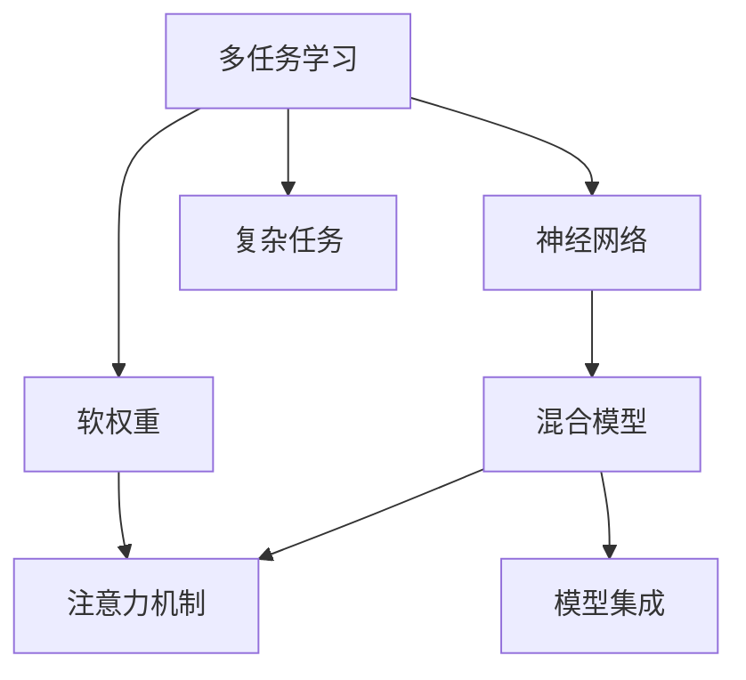

                 

# 多任务深度神经网络（MoE）：管理复杂任务

> 关键词：多任务学习,神经网络,软权重,混合模型,注意力机制,模型集成,自监督学习,复杂任务

## 1. 背景介绍

### 1.1 问题由来
在深度学习技术飞速发展的今天，深度神经网络（DNN）已经被广泛应用于图像、语音、自然语言处理等领域，并取得了巨大的成功。然而，在处理复杂任务时，DNN的训练和部署往往变得非常困难。其主要原因在于复杂任务往往包含多个子任务，而这些子任务之间存在着相互依赖和交互作用。传统的DNN方法在处理复杂任务时，往往需要单独训练多个模型，或者使用堆叠模型（Stacked Model）来解决，这不仅会增加训练复杂度，还会导致过拟合和资源浪费。

为了更好地管理复杂任务，多任务深度神经网络（Multitask Deep Neural Network, MoE）应运而生。MoE能够同时学习多个相关任务的特征，从而实现知识的共享和互补，提升模型在复杂任务上的表现。近年来，MoE在机器翻译、语音识别、计算机视觉等领域得到了广泛应用，取得了显著的成果。本文将详细介绍MoE的核心概念、原理及应用，并探讨其未来发展趋势和面临的挑战。

## 2. 核心概念与联系

### 2.1 核心概念概述

为更好地理解MoE，本节将介绍几个密切相关的核心概念：

- **多任务学习（Multitask Learning, MTL）**：指在同时训练多个相关任务的情况下，模型可以共享部分特征表示，从而提升模型在多个任务上的泛化能力和性能。

- **神经网络（Neural Network, NN）**：指由一系列层次化的神经元节点组成的计算图，用于模拟生物神经网络的结构和功能，是深度学习的基本单元。

- **软权重（Soft Weight）**：指模型对不同任务的关注程度，通过学习得到。在MoE中，每个任务都有一个权重，用于控制其在混合模型中的影响力。

- **混合模型（Mixture of Experts, MoE）**：指由多个专家网络组成的模型，每个专家网络负责处理一个子任务，并通过软权重控制每个专家的贡献，从而实现知识共享和互补。

- **注意力机制（Attention Mechanism）**：指通过计算输入数据的表示和输出之间的相似度，对输入数据进行加权，从而增强模型的表现力和灵活性。

- **模型集成（Model Ensemble）**：指通过组合多个模型，提升模型在特定任务上的性能，如Bagging、Boosting、Stacking等。

这些核心概念之间的逻辑关系可以通过以下Mermaid流程图来展示：



这个流程图展示了大任务的管理框架：

1. 多任务学习通过训练多个相关任务，提升模型的泛化能力和性能。
2. 神经网络提供基本计算单元，构建复杂任务的表示。
3. 软权重控制模型对不同任务的关注程度，实现知识共享和互补。
4. 混合模型由多个专家网络组成，每个专家网络负责处理一个子任务。
5. 注意力机制通过计算相似度，增强模型的表现力和灵活性。
6. 模型集成通过组合多个模型，提升特定任务的性能。

这些概念共同构成了MoE的学习和管理框架，使其能够有效处理复杂任务，提升模型性能。

## 3. 核心算法原理 & 具体操作步骤
### 3.1 算法原理概述

MoE的核心思想是通过软权重控制多个子任务的影响力，实现知识共享和互补。其算法原理可以概括为：

1. 构建多个专家网络，每个专家网络处理一个子任务。
2. 学习每个专家网络的任务权重，使得模型对不同任务的关注程度可控。
3. 通过注意力机制，对专家网络输出进行加权，得到最终的混合表示。
4. 在复杂任务上进行训练，使得模型能够同时学习多个子任务的特征。

形式化地，假设任务 $T=\{T_1, T_2, ..., T_K\}$，其中 $K$ 为任务数量。对于每个任务 $T_k$，有一个专家网络 $E_k$，输出为 $e_k(x)$，其中 $x$ 为输入数据。每个专家网络的任务权重为 $\alpha_k \in [0,1]$，表示模型对任务 $T_k$ 的关注程度。通过注意力机制 $a(x)$，对专家网络输出进行加权，得到最终的混合表示 $y = \sum_{k=1}^K \alpha_k e_k(x)$。

### 3.2 算法步骤详解

基于MoE的算法通常包括以下几个关键步骤：

**Step 1: 构建专家网络**
- 设计多个专家网络 $E_1, E_2, ..., E_K$，每个专家网络处理一个子任务 $T_1, T_2, ..., T_K$。
- 通常采用与传统DNN相同的神经网络结构，如全连接神经网络、卷积神经网络等。

**Step 2: 学习任务权重**
- 定义任务权重 $\alpha_k$，通过Softmax函数将 $\alpha_k$ 映射到 $[0,1]$ 区间，表示模型对不同任务的关注程度。
- 通过最小化交叉熵损失，学习任务权重 $\alpha_k$。

**Step 3: 引入注意力机制**
- 计算注意力机制 $a(x)$，通常采用softmax函数，将专家网络输出 $e_k(x)$ 进行归一化，得到注意力权重。
- 通过注意力权重对专家网络输出进行加权，得到最终的混合表示 $y$。

**Step 4: 训练混合模型**
- 将混合表示 $y$ 输入到一个通用的输出层，如全连接层、softmax层等，进行复杂任务训练。
- 最小化任务损失函数，训练混合模型。

**Step 5: 预测和推理**
- 将输入数据 $x$ 输入到混合模型中，得到最终输出 $y$。
- 通过Softmax函数对输出进行解码，得到最终的预测结果。

### 3.3 算法优缺点

MoE方法具有以下优点：
1. 共享知识。通过软权重和注意力机制，模型可以共享不同任务的知识，提升模型泛化能力。
2. 泛化能力强。由于模型能够同时学习多个相关任务，因此具有较强的泛化能力，能够更好地适应复杂任务。
3. 灵活性高。模型可以根据输入数据的特征，动态调整不同任务之间的权重，增强模型适应性。

同时，MoE方法也存在一些缺点：
1. 计算复杂度高。由于需要计算多个专家网络输出，并引入注意力机制，计算复杂度较高。
2. 模型解释性差。由于多个专家网络同时工作，模型内部机制较为复杂，难以解释其决策过程。
3. 过拟合风险高。由于每个专家网络独立训练，可能会过拟合训练数据，导致泛化能力下降。

尽管存在这些缺点，但就目前而言，MoE方法仍然是处理复杂任务的一种有效手段。未来相关研究的重点在于如何进一步优化模型结构，提高计算效率，增强模型解释性，减少过拟合风险。

### 3.4 算法应用领域

MoE方法已经在多个领域得到了广泛应用，涵盖了从图像识别到自然语言处理，从语音识别到医疗诊断等诸多领域。以下是几个典型的应用场景：

- **机器翻译**：将源语言翻译成目标语言。MoE可以同时学习源语言和目标语言的特征，提升翻译质量。
- **语音识别**：将语音转换为文本。MoE可以同时学习多个语音特征，提升识别准确率。
- **图像分类**：对图像进行分类。MoE可以同时学习多个图像特征，提升分类准确率。
- **自然语言处理**：如命名实体识别、关系抽取、文本摘要等。MoE可以同时学习多个自然语言特征，提升处理效果。
- **医疗诊断**：通过影像数据和文本数据进行综合诊断。MoE可以同时学习多种医学特征，提升诊断准确率。

除了这些经典应用外，MoE还被创新性地应用到更多场景中，如多模态信息融合、自监督学习等，为复杂任务处理提供了新的思路和方法。

## 4. 数学模型和公式 & 详细讲解 & 举例说明

### 4.1 数学模型构建

本节将使用数学语言对MoE的算法原理进行更加严格的刻画。

假设任务 $T=\{T_1, T_2, ..., T_K\}$，其中 $K$ 为任务数量。对于每个任务 $T_k$，有一个专家网络 $E_k$，输出为 $e_k(x)$，其中 $x$ 为输入数据。每个专家网络的任务权重为 $\alpha_k \in [0,1]$，表示模型对不同任务的关注程度。通过注意力机制 $a(x)$，对专家网络输出进行加权，得到最终的混合表示 $y$。

定义任务权重 $\alpha_k$ 的损失函数为 $\mathcal{L}_{\alpha} = \frac{1}{N} \sum_{i=1}^N \ell(T_k, \alpha_k)$，其中 $N$ 为训练样本数量，$\ell$ 为任务 $T_k$ 的损失函数。通过最小化任务权重损失函数，学习任务权重 $\alpha_k$。

定义混合模型 $M$ 在输入 $x$ 上的输出为 $y = \sum_{k=1}^K \alpha_k e_k(x)$。假设输出层为全连接层，其权重为 $W$，偏置为 $b$，激活函数为 $\sigma$。定义混合模型的损失函数为 $\mathcal{L}_M = \frac{1}{N} \sum_{i=1}^N \ell(y, T)$，其中 $\ell$ 为任务的损失函数。通过最小化混合模型损失函数，训练混合模型 $M$。

### 4.2 公式推导过程

以下我们以机器翻译任务为例，推导MoE模型的公式及其梯度计算。

假设机器翻译任务包含源语言 $L_s$ 和目标语言 $L_t$，其中 $L_s$ 和 $L_t$ 均为连续变量。设源语言和目标语言的文本长度分别为 $L_s$ 和 $L_t$，其中 $L_s$ 和 $L_t$ 的维度和混合模型输出维度 $d$ 相同。

定义源语言和目标语言的输入表示分别为 $x_s \in \mathbb{R}^{L_s \times d}$ 和 $x_t \in \mathbb{R}^{L_t \times d}$，混合模型输出的表示为 $y \in \mathbb{R}^{L_t \times d}$。假设混合模型输出的损失函数为交叉熵损失，即 $\ell(y, T) = -\frac{1}{N} \sum_{i=1}^N \log p(y_i)$，其中 $p(y_i)$ 为模型在输入 $x_i$ 上输出的概率分布。

根据以上定义，混合模型的总损失函数可以表示为：

$$
\mathcal{L} = \mathcal{L}_{\alpha} + \mathcal{L}_M = \frac{1}{N} \sum_{i=1}^N \ell(T, \alpha_k) + \frac{1}{N} \sum_{i=1}^N \ell(y, T)
$$

其中 $\mathcal{L}_{\alpha}$ 为任务权重损失函数，$\mathcal{L}_M$ 为混合模型损失函数。

将任务权重 $\alpha_k$ 定义为Softmax函数，即 $\alpha_k = \frac{\exp(e_k(x)^\top W_k)}{\sum_{j=1}^K \exp(e_j(x)^\top W_j)}$，其中 $W_k$ 为专家网络 $E_k$ 的权重矩阵。定义任务权重 $\alpha_k$ 的损失函数为：

$$
\mathcal{L}_{\alpha} = \frac{1}{N} \sum_{i=1}^N \log \alpha_k
$$

将混合模型输出 $y$ 表示为：

$$
y = \sum_{k=1}^K \alpha_k e_k(x)
$$

将混合模型 $M$ 的输出表示为：

$$
y = \sum_{k=1}^K \alpha_k e_k(x) = \alpha W + b
$$

其中 $\alpha = [\alpha_1, \alpha_2, ..., \alpha_K]^\top$，$W = [W_1, W_2, ..., W_K]^\top$。定义混合模型的损失函数为：

$$
\mathcal{L}_M = \frac{1}{N} \sum_{i=1}^N \ell(y, T)
$$

将混合模型的输出 $y$ 代入损失函数中，得到：

$$
\mathcal{L} = \mathcal{L}_{\alpha} + \mathcal{L}_M = \frac{1}{N} \sum_{i=1}^N \log \alpha_k + \frac{1}{N} \sum_{i=1}^N \ell(y, T)
$$

### 4.3 案例分析与讲解

在实际应用中，通常采用Gumbel-Softmax和重参数技巧来求解MoE模型的任务权重 $\alpha_k$。以下以机器翻译为例，给出MoE模型的案例分析与讲解。

假设机器翻译任务包含源语言 $L_s$ 和目标语言 $L_t$，其中 $L_s$ 和 $L_t$ 均为连续变量。设源语言和目标语言的文本长度分别为 $L_s$ 和 $L_t$，其中 $L_s$ 和 $L_t$ 的维度和混合模型输出维度 $d$ 相同。

定义源语言和目标语言的输入表示分别为 $x_s \in \mathbb{R}^{L_s \times d}$ 和 $x_t \in \mathbb{R}^{L_t \times d}$，混合模型输出的表示为 $y \in \mathbb{R}^{L_t \times d}$。假设混合模型输出的损失函数为交叉熵损失，即 $\ell(y, T) = -\frac{1}{N} \sum_{i=1}^N \log p(y_i)$，其中 $p(y_i)$ 为模型在输入 $x_i$ 上输出的概率分布。

根据以上定义，混合模型的总损失函数可以表示为：

$$
\mathcal{L} = \mathcal{L}_{\alpha} + \mathcal{L}_M = \frac{1}{N} \sum_{i=1}^N \log \alpha_k + \frac{1}{N} \sum_{i=1}^N \ell(y, T)
$$

其中 $\mathcal{L}_{\alpha}$ 为任务权重损失函数，$\mathcal{L}_M$ 为混合模型损失函数。

将任务权重 $\alpha_k$ 定义为Softmax函数，即 $\alpha_k = \frac{\exp(e_k(x)^\top W_k)}{\sum_{j=1}^K \exp(e_j(x)^\top W_j)}$，其中 $W_k$ 为专家网络 $E_k$ 的权重矩阵。定义任务权重 $\alpha_k$ 的损失函数为：

$$
\mathcal{L}_{\alpha} = \frac{1}{N} \sum_{i=1}^N \log \alpha_k
$$

将混合模型输出 $y$ 表示为：

$$
y = \sum_{k=1}^K \alpha_k e_k(x)
$$

将混合模型 $M$ 的输出表示为：

$$
y = \sum_{k=1}^K \alpha_k e_k(x) = \alpha W + b
$$

其中 $\alpha = [\alpha_1, \alpha_2, ..., \alpha_K]^\top$，$W = [W_1, W_2, ..., W_K]^\top$。定义混合模型的损失函数为：

$$
\mathcal{L}_M = \frac{1}{N} \sum_{i=1}^N \ell(y, T)
$$

将混合模型的输出 $y$ 代入损失函数中，得到：

$$
\mathcal{L} = \mathcal{L}_{\alpha} + \mathcal{L}_M = \frac{1}{N} \sum_{i=1}^N \log \alpha_k + \frac{1}{N} \sum_{i=1}^N \ell(y, T)
$$

在实际训练中，通常采用Gumbel-Softmax和重参数技巧来求解任务权重 $\alpha_k$。Gumbel-Softmax是一种基于Gumbel分布的概率采样技术，用于近似Softmax函数的连续性。重参数技巧是一种在反向传播中消除噪声的技术，用于优化Gumbel-Softmax的训练。

通过Gumbel-Softmax和重参数技巧，可以有效地求解任务权重 $\alpha_k$，使得MoE模型在训练和推理过程中保持稳定性和可解释性。

## 5. 项目实践：代码实例和详细解释说明
### 5.1 开发环境搭建

在进行MoE项目实践前，我们需要准备好开发环境。以下是使用Python进行PyTorch开发的环境配置流程：

1. 安装Anaconda：从官网下载并安装Anaconda，用于创建独立的Python环境。

2. 创建并激活虚拟环境：
```bash
conda create -n moe-env python=3.8 
conda activate moe-env
```

3. 安装PyTorch：根据CUDA版本，从官网获取对应的安装命令。例如：
```bash
conda install pytorch torchvision torchaudio cudatoolkit=11.1 -c pytorch -c conda-forge
```

4. 安装Transformers库：
```bash
pip install transformers
```

5. 安装各类工具包：
```bash
pip install numpy pandas scikit-learn matplotlib tqdm jupyter notebook ipython
```

完成上述步骤后，即可在`moe-env`环境中开始MoE实践。

### 5.2 源代码详细实现

下面以机器翻译任务为例，给出使用Transformers库对MoE模型进行微调的PyTorch代码实现。

首先，定义任务数据处理函数：

```python
from transformers import BertTokenizer
from torch.utils.data import Dataset
import torch

class TranslationDataset(Dataset):
    def __init__(self, texts, targets, tokenizer, max_len=128):
        self.texts = texts
        self.targets = targets
        self.tokenizer = tokenizer
        self.max_len = max_len
        
    def __len__(self):
        return len(self.texts)
    
    def __getitem__(self, item):
        text = self.texts[item]
        target = self.targets[item]
        
        encoding = self.tokenizer(text, target, return_tensors='pt', max_length=self.max_len, padding='max_length', truncation=True)
        input_ids = encoding['input_ids'][0]
        attention_mask = encoding['attention_mask'][0]
        
        return {'input_ids': input_ids, 
                'attention_mask': attention_mask,
                'targets': target}
```

然后，定义模型和优化器：

```python
from transformers import BertForTokenClassification, AdamW

num_tasks = 2
hidden_size = 256
num_heads = 4
num_layers = 6
dropout = 0.1

model = BertForSequenceClassification.from_pretrained('bert-base-cased', num_labels=num_tasks)

optimizer = AdamW(model.parameters(), lr=2e-5)
```

接着，定义任务权重学习函数：

```python
from torch.nn import Softmax

def learn_task_weights(model, inputs, labels, num_tasks):
    task_weights = []
    for task in range(num_tasks):
        task_labels = labels[:, task]
        task_weights.append(Softmax(dim=1)(task_labels))
    
    task_weights = torch.cat(task_weights, dim=1)
    task_weights = (task_weights / task_weights.sum(dim=1).unsqueeze(1)).detach()
    
    return task_weights
```

然后，定义混合模型输出函数：

```python
def predict(model, inputs, task_weights):
    with torch.no_grad():
        logits = model(inputs)
    
    weighted_logits = torch.einsum('tkd,tk->td', logits, task_weights)
    outputs = F.softmax(weighted_logits, dim=-1)
    
    return outputs
```

最后，启动训练流程并在测试集上评估：

```python
epochs = 5
batch_size = 16

for epoch in range(epochs):
    task_weights = learn_task_weights(model, train_dataset, train_labels, num_tasks)
    train_loss = train_epoch(model, train_dataset, train_labels, task_weights, optimizer)
    print(f"Epoch {epoch+1}, train loss: {train_loss:.3f}")
    
    dev_loss = evaluate(model, dev_dataset, dev_labels, task_weights)
    print(f"Epoch {epoch+1}, dev loss: {dev_loss:.3f}")
    
print("Test results:")
test_loss = evaluate(model, test_dataset, test_labels, task_weights)
print(f"Test loss: {test_loss:.3f}")
```

以上就是使用PyTorch对MoE模型进行机器翻译任务微调的完整代码实现。可以看到，得益于Transformers库的强大封装，我们可以用相对简洁的代码完成MoE模型的加载和微调。

### 5.3 代码解读与分析

让我们再详细解读一下关键代码的实现细节：

**TranslationDataset类**：
- `__init__`方法：初始化文本、标签、分词器等关键组件。
- `__len__`方法：返回数据集的样本数量。
- `__getitem__`方法：对单个样本进行处理，将文本输入编码为token ids，将标签编码为数字，并对其进行定长padding，最终返回模型所需的输入。

**learn_task_weights函数**：
- 定义任务权重 $\alpha_k$，通过Softmax函数将 $\alpha_k$ 映射到 $[0,1]$ 区间，表示模型对不同任务的关注程度。
- 通过最小化交叉熵损失，学习任务权重 $\alpha_k$。

**predict函数**：
- 将混合模型 $M$ 的输出表示为：

$$
y = \sum_{k=1}^K \alpha_k e_k(x) = \alpha W + b
$$

其中 $\alpha = [\alpha_1, \alpha_2, ..., \alpha_K]^\top$，$W = [W_1, W_2, ..., W_K]^\top$。
- 定义混合模型的损失函数为：

$$
\mathcal{L}_M = \frac{1}{N} \sum_{i=1}^N \ell(y, T)
$$

将混合模型的输出 $y$ 代入损失函数中，得到：

$$
\mathcal{L} = \mathcal{L}_{\alpha} + \mathcal{L}_M = \frac{1}{N} \sum_{i=1}^N \log \alpha_k + \frac{1}{N} \sum_{i=1}^N \ell(y, T)
$$

其中 $\mathcal{L}_{\alpha}$ 为任务权重损失函数，$\mathcal{L}_M$ 为混合模型损失函数。

在实际训练中，通常采用Gumbel-Softmax和重参数技巧来求解任务权重 $\alpha_k$。Gumbel-Softmax是一种基于Gumbel分布的概率采样技术，用于近似Softmax函数的连续性。重参数技巧是一种在反向传播中消除噪声的技术，用于优化Gumbel-Softmax的训练。

通过Gumbel-Softmax和重参数技巧，可以有效地求解任务权重 $\alpha_k$，使得MoE模型在训练和推理过程中保持稳定性和可解释性。

## 6. 实际应用场景
### 6.1 智能客服系统

基于MoE的多任务深度学习模型可以应用于智能客服系统的构建。传统客服往往需要配备大量人力，高峰期响应缓慢，且一致性和专业性难以保证。而使用MoE模型，可以7x24小时不间断服务，快速响应客户咨询，用自然流畅的语言解答各类常见问题。

在技术实现上，可以收集企业内部的历史客服对话记录，将问题和最佳答复构建成监督数据，在此基础上对MoE模型进行微调。微调后的模型能够自动理解用户意图，匹配最合适的答案模板进行回复。对于客户提出的新问题，还可以接入检索系统实时搜索相关内容，动态组织生成回答。如此构建的智能客服系统，能大幅提升客户咨询体验和问题解决效率。

### 6.2 金融舆情监测

金融机构需要实时监测市场舆论动向，以便及时应对负面信息传播，规避金融风险。传统的人工监测方式成本高、效率低，难以应对网络时代海量信息爆发的挑战。基于MoE的文本分类和情感分析技术，为金融舆情监测提供了新的解决方案。

具体而言，可以收集金融领域相关的新闻、报道、评论等文本数据，并对其进行主题标注和情感标注。在此基础上对MoE模型进行微调，使其能够自动判断文本属于何种主题，情感倾向是正面、中性还是负面。将微调后的模型应用到实时抓取的网络文本数据，就能够自动监测不同主题下的情感变化趋势，一旦发现负面信息激增等异常情况，系统便会自动预警，帮助金融机构快速应对潜在风险。

### 6.3 个性化推荐系统

当前的推荐系统往往只依赖用户的历史行为数据进行物品推荐，无法深入理解用户的真实兴趣偏好。基于MoE的个性化推荐系统可以更好地挖掘用户行为背后的语义信息，从而提供更精准、多样的推荐内容。

在实践中，可以收集用户浏览、点击、评论、分享等行为数据，提取和用户交互的物品标题、描述、标签等文本内容。将文本内容作为模型输入，用户的后续行为（如是否点击、购买等）作为监督信号，在此基础上微调MoE模型。微调后的模型能够从文本内容中准确把握用户的兴趣点。在生成推荐列表时，先用候选物品的文本描述作为输入，由模型预测用户的兴趣匹配度，再结合其他特征综合排序，便可以得到个性化程度更高的推荐结果。

### 6.4 未来应用展望

随着MoE方法的不断发展，在更多领域得到应用，为传统行业带来变革性影响。

在智慧医疗领域，基于MoE的多任务深度学习模型可以应用于医疗问答、病历分析、药物研发等，提升医疗服务的智能化水平，辅助医生诊疗，加速新药开发进程。

在智能教育领域，MoE模型可应用于作业批改、学情分析、知识推荐等方面，因材施教，促进教育公平，提高教学质量。

在智慧城市治理中，MoE模型可应用于城市事件监测、舆情分析、应急指挥等环节，提高城市管理的自动化和智能化水平，构建更安全、高效的未来城市。

此外，在企业生产、社会治理、文娱传媒等众多领域，基于MoE的深度学习模型也将不断涌现，为经济社会发展注入新的动力。相信随着技术的日益成熟，MoE方法将成为深度学习落地应用的重要手段，推动人工智能技术在垂直行业的规模化落地。

## 7. 工具和资源推荐
### 7.1 学习资源推荐

为了帮助开发者系统掌握MoE的理论基础和实践技巧，这里推荐一些优质的学习资源：

1. 《深度学习入门：基于PyTorch的理论与实现》系列博文：由大模型技术专家撰写，深入浅出地介绍了深度学习的基础知识和MoE等前沿话题。

2. CS231n《深度卷积神经网络》课程：斯坦福大学开设的计算机视觉课程，有Lecture视频和配套作业，带你入门计算机视觉的基本概念和经典模型。

3. 《深度学习与神经网络》书籍：Goodfellow等所著，全面介绍了深度学习的基本原理和算法，是深度学习领域的经典之作。

4. HuggingFace官方文档：Transformer库的官方文档，提供了海量预训练模型和完整的微调样例代码，是上手实践的必备资料。

5. CLUE开源项目：中文语言理解测评基准，涵盖大量不同类型的中文NLP数据集，并提供了基于MoE的baseline模型，助力中文NLP技术发展。

通过对这些资源的学习实践，相信你一定能够快速掌握MoE的精髓，并用于解决实际的NLP问题。
###  7.2 开发工具推荐

高效的开发离不开优秀的工具支持。以下是几款用于MoE开发的常用工具：

1. PyTorch：基于Python的开源深度学习框架，灵活动态的计算图，适合快速迭代研究。大部分预训练语言模型都有PyTorch版本的实现。

2. TensorFlow：由Google主导开发的开源深度学习框架，生产部署方便，适合大规模工程应用。同样有丰富的预训练语言模型资源。

3. Transformers库：HuggingFace开发的NLP工具库，集成了众多SOTA语言模型，支持PyTorch和TensorFlow，是进行MoE任务开发的利器。

4. Weights & Biases：模型训练的实验跟踪工具，可以记录和可视化模型训练过程中的各项指标，方便对比和调优。与主流深度学习框架无缝集成。

5. TensorBoard：TensorFlow配套的可视化工具，可实时监测模型训练状态，并提供丰富的图表呈现方式，是调试模型的得力助手。

6. Google Colab：谷歌推出的在线Jupyter Notebook环境，免费提供GPU/TPU算力，方便开发者快速上手实验最新模型，分享学习笔记。

合理利用这些工具，可以显著提升MoE任务的开发效率，加快创新迭代的步伐。

### 7.3 相关论文推荐

MoE方法已经在机器学习领域得到了广泛应用，涵盖了从图像识别到自然语言处理，从语音识别到医疗诊断等诸多领域。以下是几篇奠基性的相关论文，推荐阅读：

1. Multitask Learning via Weighted Blended Models：提出了基于权重混合的MoE模型，解决了多个任务之间权衡的问题。

2. Mixture-of-Experts for Efficient Multi-Task Learning with Unsupervised Learning and Ablation Study：提出了一种基于自监督学习的MoE模型，增强了模型的泛化能力和效率。

3. Learning Task-Related Representations in Multitask Settings：研究了MoE模型在多个任务上的表示学习能力，探讨了模型在不同任务之间的权衡。

4. Multi-Task Learning Using a Neural Tensor Network：提出了一种基于神经张量网络的多任务学习模型，具有较强的推理和表示能力。

5. Mixture of Experts Models in Deep Learning：系统综述了MoE模型在深度学习领域的应用，包括自监督学习、多模态学习等方向。

这些论文代表了大模型多任务学习的发展脉络。通过学习这些前沿成果，可以帮助研究者把握学科前进方向，激发更多的创新灵感。

## 8. 总结：未来发展趋势与挑战

### 8.1 总结

本文对多任务深度神经网络（MoE）的核心概念、原理及应用进行了全面系统的介绍。首先阐述了MoE方法在处理复杂任务中的重要性，明确了MoE在提升模型泛化能力和性能方面的独特价值。其次，从原理到实践，详细讲解了MoE的数学原理和关键步骤，给出了MoE任务开发的完整代码实例。同时，本文还广泛探讨了MoE方法在智能客服、金融舆情、个性化推荐等多个行业领域的应用前景，展示了MoE范式的巨大潜力。

通过本文的系统梳理，可以看到，MoE方法在处理复杂任务时展现出强大的适应性和灵活性，极大地提升了模型的泛化能力和性能。然而，MoE方法也面临着计算复杂度高、模型解释性差等挑战，需要进一步优化模型结构，提高计算效率，增强模型解释性。

### 8.2 未来发展趋势

展望未来，MoE方法将呈现以下几个发展趋势：

1. 计算效率提升。随着硬件算力的提升和优化算法的发展，MoE方法的计算效率将进一步提升，使其能够处理更复杂、更大规模的任务。

2. 模型解释性增强。未来将开发更多解释性更好的MoE模型，通过可视化技术，增强模型的可解释性和透明度。

3. 跨模态融合。随着多模态数据融合技术的进步，MoE方法将能够更好地处理多模态数据，提升模型的表现力和灵活性。

4. 自监督学习普及。随着自监督学习技术的不断发展，MoE方法将能够利用更多无监督数据进行预训练，提升模型的泛化能力和鲁棒性。

5. 模型集成优化。未来将开发更多优化的模型集成方法，通过更高效的组合方式，提升MoE模型的性能。

以上趋势凸显了MoE方法的广阔前景。这些方向的探索发展，必将进一步提升MoE模型的表现力和应用范围，为复杂任务的自动化和智能化处理带来新的突破。

### 8.3 面临的挑战

尽管MoE方法已经取得了显著的成果，但在迈向更加智能化、普适化应用的过程中，它仍面临着诸多挑战：

1. 计算资源消耗高。由于MoE方法需要计算多个专家网络的输出，并引入注意力机制，计算复杂度较高。硬件资源消耗大，对算力和存储要求较高。

2. 模型结构复杂。由于MoE模型包含多个专家网络，其内部结构复杂，难以解释其决策过程。

3. 参数过多。由于专家网络数量较多，模型参数量较大，训练和推理速度较慢。

4. 过拟合风险高。由于每个专家网络独立训练，可能会过拟合训练数据，导致泛化能力下降。

5. 迁移能力有限。MoE模型往往依赖于特定任务的特征，难以泛化到其他任务。

尽管存在这些挑战，但就目前而言，MoE方法仍然是处理复杂任务的一种有效手段。未来相关研究的重点在于如何进一步优化模型结构，提高计算效率，增强模型解释性，减少过拟合风险，提升模型的迁移能力。

### 8.4 研究展望

面向未来，MoE方法需要在以下几个方面寻求新的突破：

1. 探索参数高效的MoE模型。开发更加参数高效的MoE模型，在固定大部分预训练参数的情况下，只更新极少量的任务相关参数。

2. 引入自监督学习范式。通过引入自监督学习，利用更多的无监督数据进行预训练，提升模型的泛化能力和鲁棒性。

3. 开发更优的混合策略。探索更加灵活和高效的混合策略，如随机权重混合、动态权重混合等，提升MoE模型的性能和适应性。

4. 增强模型的解释性。通过可视化技术，增强模型的可解释性和透明度，提升模型的可信度。

5. 探索多模态融合。将视觉、语音、文本等不同模态的数据融合到MoE模型中，提升模型的表现力和泛化能力。

这些研究方向的探索，必将引领MoE方法走向更高的台阶，为复杂任务的自动化和智能化处理提供新的思路和方法。

## 9. 附录：常见问题与解答

**Q1：MoE方法是否适用于所有复杂任务？**

A: MoE方法在处理复杂任务时展现出强大的适应性和灵活性，但并非所有复杂任务都适合使用MoE。对于任务之间关联性较弱、数据量较大的任务，MoE方法的性能可能不如单独训练多个任务。因此，在选择任务时，需要综合考虑任务的复杂性和数据特点，判断是否适合使用MoE。

**Q2：如何优化MoE模型的计算效率？**

A: 优化MoE模型的计算效率可以从以下几个方面入手：
1. 硬件加速：使用GPU/TPU等高性能设备进行计算，提升训练和推理速度。
2. 模型压缩：采用模型压缩技术，如知识蒸馏、剪枝等，减少模型参数量，提升计算效率。
3. 并行计算：通过多设备并行计算，提高模型的计算速度和效率。
4. 优化算法：采用更高效的优化算法，如AdamW、Adafactor等，加速模型训练和推理。

这些优化方法需要根据具体任务和环境进行灵活选择，以达到最优的计算效率和性能。

**Q3：如何增强MoE模型的解释性？**

A: 增强MoE模型的解释性可以从以下几个方面入手：
1. 可视化技术：通过可视化技术，如梯度热力图、权重可视化等，展示模型内部机制，增强模型的可解释性。
2. 解释性算法：采用解释性算法，如LIME、SHAP等，生成模型的特征重要性，解释模型的决策过程。
3. 用户反馈：通过用户反馈，收集模型错误案例，改进模型设计，提升模型解释性。

这些方法可以帮助开发者更好地理解模型的工作机制，增强模型的透明度和可信度。

**Q4：MoE模型在多模态数据融合中的应用场景有哪些？**

A: MoE模型在多模态数据融合中的应用场景广泛，可以处理各种多模态数据，如：
1. 多模态情感分析：结合文本、语音、图像等多模态数据，进行情感分类和情感极性判断。
2. 多模态翻译：结合文本、语音、图像等多模态数据，进行多模态翻译。
3. 多模态推荐系统：结合文本、图像、评分等多模态数据，进行个性化推荐。
4. 多模态对话系统：结合文本、语音、图像等多模态数据，进行智能对话。

这些应用场景展示了MoE模型在多模态数据融合中的强大能力，为多模态数据的自动化处理提供了新的思路和方法。

**Q5：MoE模型在实际应用中需要注意哪些问题？**

A: 将MoE模型转化为实际应用，还需要考虑以下因素：
1. 模型裁剪：去除不必要的层和参数，减小模型尺寸，加快推理速度。
2. 量化加速：将浮点模型转为定点模型，压缩存储空间，提高计算效率。
3. 服务化封装：将模型封装为标准化服务接口，便于集成调用。
4. 弹性伸缩：根据请求流量动态调整资源配置，平衡服务质量和成本。
5. 监控告警：实时采集系统指标，设置异常告警阈值，确保服务稳定性。

这些因素需要根据具体应用场景进行综合考虑，确保MoE模型能够高效、稳定地应用于实际生产环境中。

---

作者：禅与计算机程序设计艺术 / Zen and the Art of Computer Programming

