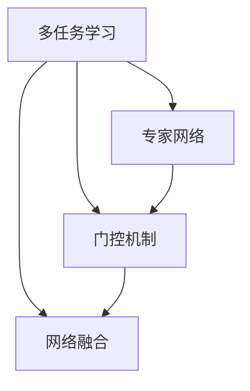

                 

# 多任务深度神经网络（MoE）：管理复杂任务

> 关键词：多任务学习,深度神经网络,MoE模型,任务切换,复杂任务管理

## 1. 背景介绍

### 1.1 问题由来
在人工智能和机器学习的领域中，复杂任务的解决往往需要多种技术的融合，这不仅增加了模型的复杂度，也使得训练和推理变得更加困难。多任务学习（Multitask Learning, MTL）正是在这种背景下应运而生的重要研究方向。通过多任务学习，可以在处理多个相关任务时共享模型参数，从而提高模型的泛化能力和性能。而多任务深度神经网络（Multitask Deep Neural Networks, MoE）则是多任务学习的一种高效实现方式。它通过引入"专家网络"和"门控机制"，巧妙地管理复杂任务，使得模型可以同时处理多个不同任务，且在任务间切换时保持高效率和低损耗。

### 1.2 问题核心关键点
MoE模型的核心思想是利用"专家网络"对各个任务进行独立处理，并通过"门控机制"来动态管理任务之间的权重，从而实现高效的任务切换和模型参数的复用。其关键点包括：
1. **专家网络（Expert Networks）**：用于对各个任务进行处理，可以采用不同的深度神经网络结构。
2. **门控机制（Gating Mechanism）**：用于动态分配各个专家网络的权重，实现任务之间的切换。
3. **网络融合（Network Fusion）**：用于将专家网络输出的结果进行融合，得到最终的任务输出。
4. **模型训练**：通过优化目标函数，使得模型能够同时处理多个任务，并且在各个任务之间保持较好的泛化能力。

### 1.3 问题研究意义
MoE模型通过将多个相关任务集成到一个模型中，使得模型能够高效处理复杂任务，提升模型泛化能力和性能。这对于提升人工智能在各种领域的应用效果具有重要意义：

1. **资源共享**：通过共享模型参数，MoE模型可以减少计算资源和存储资源的需求，提高模型训练和推理的效率。
2. **任务泛化**：由于多个任务在MoE模型中共享参数，每个任务都能从其他任务中学习到更丰富的知识，提升各个任务的泛化能力。
3. **模型可扩展性**：MoE模型可以通过添加新的专家网络来扩展模型的能力，适应不同的应用场景。
4. **任务协同**：MoE模型可以在处理多个相关任务时，通过任务之间的协同，提高模型的整体性能。

## 2. 核心概念与联系

### 2.1 核心概念概述

为了更好地理解MoE模型的工作原理，本节将介绍几个密切相关的核心概念：

- **多任务学习（MTL）**：指在多个相关任务中同时进行模型训练，通过共享模型参数来提升各个任务的性能。
- **专家网络（Expert Networks）**：用于对每个具体任务进行处理，可以采用不同的神经网络结构。
- **门控机制（Gating Mechanism）**：用于动态管理不同任务之间的权重分配，实现任务之间的切换。
- **网络融合（Network Fusion）**：用于将专家网络输出的结果进行加权融合，得到最终的任务输出。
- **权重矩阵（Weight Matrix）**：用于表示不同任务之间的权重关系，通常为低秩矩阵，用于降低模型复杂度。

这些核心概念之间的逻辑关系可以通过以下Mermaid流程图来展示：



这个流程图展示了多任务学习、专家网络、门控机制和网络融合之间的逻辑关系：

1. 多任务学习将多个任务集成到一个模型中。
2. 专家网络用于对每个具体任务进行处理。
3. 门控机制用于动态分配不同任务之间的权重。
4. 网络融合用于将专家网络输出的结果进行融合。

## 3. 核心算法原理 & 具体操作步骤
### 3.1 算法原理概述

MoE模型的核心原理是通过引入"专家网络"和"门控机制"来管理多个任务的模型参数，从而实现高效的任务切换和模型泛化。其核心思想是在处理多个任务时，通过"专家网络"对每个任务进行处理，并通过"门控机制"动态管理不同任务之间的权重，使得模型能够在各个任务之间高效切换。

在MoE模型中，假设有 $K$ 个任务，每个任务的处理网络为 $f_k$，权重矩阵为 $W_k$，最终的任务输出为 $y$。MoE模型的目标是通过优化目标函数，使得模型能够同时处理多个任务，并且在各个任务之间保持较好的泛化能力。

### 3.2 算法步骤详解

基于MoE模型的多任务深度神经网络，一般包括以下几个关键步骤：

**Step 1: 准备任务数据集**
- 收集各个任务的标注数据集，并将其划分为训练集、验证集和测试集。

**Step 2: 初始化专家网络**
- 为每个任务准备对应的专家网络 $f_k$，可以采用不同的深度神经网络结构。

**Step 3: 设计门控机制**
- 设计门控机制，用于动态分配各个任务之间的权重。常用的门控机制包括softmax函数、加权平均函数等。

**Step 4: 网络融合**
- 设计网络融合方式，用于将专家网络输出的结果进行加权融合，得到最终的任务输出 $y$。

**Step 5: 定义优化目标函数**
- 定义损失函数，用于衡量模型在各个任务上的性能。常用的损失函数包括交叉熵损失、均方误差损失等。

**Step 6: 训练模型**
- 使用梯度下降等优化算法，最小化目标函数，更新模型参数。

**Step 7: 测试模型**
- 在测试集上评估模型性能，对比各个任务的精度提升。

以上是MoE模型的主要训练流程。在实际应用中，还需要针对具体任务的特点，对微调过程的各个环节进行优化设计，如改进损失函数，引入更多的正则化技术，搜索最优的超参数组合等，以进一步提升模型性能。

### 3.3 算法优缺点

MoE模型具有以下优点：
1. **资源共享**：通过共享模型参数，MoE模型可以减少计算资源和存储资源的需求，提高模型训练和推理的效率。
2. **任务泛化**：由于多个任务在MoE模型中共享参数，每个任务都能从其他任务中学习到更丰富的知识，提升各个任务的泛化能力。
3. **模型可扩展性**：MoE模型可以通过添加新的专家网络来扩展模型的能力，适应不同的应用场景。
4. **任务协同**：MoE模型可以在处理多个相关任务时，通过任务之间的协同，提高模型的整体性能。

同时，MoE模型也存在一定的局限性：
1. **计算复杂度**：由于引入了"专家网络"和"门控机制"，MoE模型的计算复杂度较高。
2. **参数初始化**：专家网络的参数初始化需要精心设计，避免出现梯度消失或爆炸等问题。
3. **模型训练时间**：由于需要同时处理多个任务，MoE模型的训练时间较长。

尽管存在这些局限性，但就目前而言，MoE模型仍是处理复杂任务的重要手段。未来相关研究的重点在于如何进一步降低计算复杂度，提高模型训练效率，同时兼顾模型泛化能力和可扩展性。

### 3.4 算法应用领域

MoE模型在多个领域中得到了广泛的应用，例如：

- **自然语言处理（NLP）**：用于处理文本分类、情感分析、机器翻译等任务。通过共享语言模型参数，MoE模型能够提高各个NLP任务的性能。
- **计算机视觉（CV）**：用于处理图像分类、物体检测、图像分割等任务。通过共享卷积神经网络参数，MoE模型能够提高各个CV任务的性能。
- **语音识别（ASR）**：用于处理语音识别、语音合成等任务。通过共享声学模型参数，MoE模型能够提高各个ASR任务的性能。
- **推荐系统**：用于处理个性化推荐、协同过滤等任务。通过共享用户-物品关系模型参数，MoE模型能够提高推荐系统的性能。

除了上述这些经典应用外，MoE模型还被创新性地应用到更多场景中，如可控生成、跨模态学习、元学习等，为人工智能技术带来了全新的突破。

## 4. 数学模型和公式 & 详细讲解 & 举例说明
### 4.1 数学模型构建

在MoE模型中，假设有 $K$ 个任务，每个任务的处理网络为 $f_k$，权重矩阵为 $W_k$，最终的任务输出为 $y$。设模型的输入为 $x$，目标函数为 $\mathcal{L}$，则MoE模型的数学模型可以表示为：

$$
y = \sum_{k=1}^K W_k f_k(x)
$$

其中 $W_k$ 为权重矩阵，$f_k$ 为专家网络。

### 4.2 公式推导过程

以二分类任务为例，我们推导MoE模型的损失函数。假设有 $K=2$ 个任务，专家网络 $f_k$ 为二分类任务，输出为 $f_k(x) \in [0,1]$，表示样本属于第 $k$ 类的概率。设真实标签为 $y \in \{0,1\}$，则二分类交叉熵损失函数定义为：

$$
\ell_k(f_k(x),y) = -[y\log f_k(x)+(1-y)\log (1-f_k(x))]
$$

将上述损失函数加权平均，得到MoE模型的损失函数：

$$
\mathcal{L}(x,y) = \sum_{k=1}^K W_k \ell_k(f_k(x),y)
$$

其中 $W_k$ 为权重矩阵，表示第 $k$ 个任务的权重。

通过链式法则，损失函数对专家网络 $f_k$ 的梯度为：

$$
\frac{\partial \mathcal{L}}{\partial f_k(x)} = \sum_{k=1}^K W_k \frac{\partial \ell_k(f_k(x),y)}{\partial f_k(x)}
$$

将 $\ell_k(f_k(x),y)$ 代入上式，得：

$$
\frac{\partial \mathcal{L}}{\partial f_k(x)} = \sum_{k=1}^K W_k (-\frac{y}{f_k(x)}-\frac{1-y}{1-f_k(x)}) \frac{\partial f_k(x)}{\partial x}
$$

由于MoE模型的输出 $y$ 是专家网络输出的加权和，即 $y = \sum_{k=1}^K W_k f_k(x)$，因此可以通过反向传播算法计算出 $f_k(x)$ 对 $x$ 的梯度，从而得到 $\frac{\partial f_k(x)}{\partial x}$ 的值。

### 4.3 案例分析与讲解

以图像分类任务为例，我们分析MoE模型的应用过程。假设有一个包含10个类别的图像分类任务，可以将每个类别看作一个任务，即 $K=10$。专家网络 $f_k$ 为卷积神经网络（CNN），输出为类别概率 $f_k(x)$。权重矩阵 $W_k$ 为低秩矩阵，用于动态分配不同任务之间的权重。

在训练过程中，假设我们有一个大小为 $m$ 的训练集 $D=\{(x_i,y_i)\}_{i=1}^m$，其中 $x_i$ 为图像数据，$y_i$ 为类别标签。

首先，将训练集数据分批次输入模型，前向传播计算损失函数。具体而言，对于第 $i$ 个训练样本，有：

$$
\hat{y}_i = \sum_{k=1}^{10} W_k f_k(x_i)
$$

其中 $\hat{y}_i \in [0,1]$ 表示模型预测的类别概率。

然后，计算损失函数：

$$
\mathcal{L}(x_i,y_i) = \sum_{k=1}^{10} W_k \ell_k(f_k(x_i),y_i)
$$

其中 $\ell_k(f_k(x_i),y_i)$ 为二分类交叉熵损失函数。

最后，反向传播计算参数梯度，根据设定的优化算法和学习率更新模型参数。重复上述步骤直至收敛，最终得到适应各个图像分类的最优模型参数 $\theta$。

在实际应用中，可以通过调整权重矩阵 $W_k$ 的元素，动态管理不同任务之间的权重，实现任务之间的切换。例如，对于一个新的图像分类任务，可以先将其权重矩阵 $W_k$ 初始化为 $0$，然后通过微调逐步增加其权重，使得模型能够适应新的任务。

## 5. 项目实践：代码实例和详细解释说明
### 5.1 开发环境搭建

在进行MoE模型的实践前，我们需要准备好开发环境。以下是使用Python进行TensorFlow开发的环境配置流程：

1. 安装Anaconda：从官网下载并安装Anaconda，用于创建独立的Python环境。

2. 创建并激活虚拟环境：
```bash
conda create -n moe-env python=3.8 
conda activate moe-env
```

3. 安装TensorFlow：根据CUDA版本，从官网获取对应的安装命令。例如：
```bash
conda install tensorflow -c tf -c conda-forge
```

4. 安装Keras：
```bash
conda install keras
```

5. 安装各类工具包：
```bash
pip install numpy pandas scikit-learn matplotlib tqdm jupyter notebook ipython
```

完成上述步骤后，即可在`moe-env`环境中开始MoE模型的实践。

### 5.2 源代码详细实现

下面我们以图像分类任务为例，给出使用TensorFlow和Keras实现MoE模型的代码实现。

首先，定义MoE模型的网络结构：

```python
import tensorflow as tf
from tensorflow.keras import layers

class MoEModel(tf.keras.Model):
    def __init__(self, num_tasks):
        super(MoeModel, self).__init__()
        self.num_tasks = num_tasks
        self.experts = [tf.keras.Sequential([
            layers.Dense(64, activation='relu'),
            layers.Dense(10)
        ]) for _ in range(num_tasks)]
        self.gating = layers.Dense(num_tasks)
    
    def call(self, inputs):
        expert_outputs = [tf.squeeze(expert(inputs), axis=-1) for expert in self.experts]
        gating_weights = tf.nn.softmax(self.gating(inputs), axis=-1)
        return tf.reduce_sum(gating_weights * expert_outputs, axis=-1)

# 创建MoE模型实例
model = MoEModel(num_tasks=10)
```

然后，定义训练和评估函数：

```python
from tensorflow.keras.datasets import mnist
from tensorflow.keras.utils import to_categorical

# 加载MNIST数据集
(x_train, y_train), (x_test, y_test) = mnist.load_data()

# 数据预处理
x_train = x_train.reshape(-1, 28*28).astype('float32') / 255.0
x_test = x_test.reshape(-1, 28*28).astype('float32') / 255.0
y_train = to_categorical(y_train)
y_test = to_categorical(y_test)

# 定义损失函数和优化器
loss_fn = tf.keras.losses.CategoricalCrossentropy()
optimizer = tf.keras.optimizers.Adam()

# 训练函数
def train_epoch(model, dataset, batch_size, optimizer):
    dataloader = tf.data.Dataset.from_tensor_slices(dataset).shuffle(10000).batch(batch_size)
    model.train()
    epoch_loss = 0
    for batch in dataloader:
        x, y = batch
        with tf.GradientTape() as tape:
            logits = model(x)
            loss = loss_fn(y, logits)
        grads = tape.gradient(loss, model.trainable_variables)
        optimizer.apply_gradients(zip(grads, model.trainable_variables))
        epoch_loss += loss.numpy()
    return epoch_loss / len(dataloader)

# 评估函数
def evaluate(model, dataset, batch_size):
    dataloader = tf.data.Dataset.from_tensor_slices(dataset).batch(batch_size)
    model.eval()
    correct_predictions = 0
    with tf.GradientTape() as tape:
        for batch in dataloader:
            x, y = batch
            logits = model(x)
            predictions = tf.argmax(logits, axis=-1)
            correct_predictions += tf.reduce_sum(tf.cast(predictions == y, 'float'))
    accuracy = correct_predictions / len(dataset)
    print('Accuracy: {:.2f}%'.format(accuracy * 100))

# 训练MoE模型
epochs = 10
batch_size = 64

for epoch in range(epochs):
    train_loss = train_epoch(model, (x_train, y_train), batch_size, optimizer)
    print('Epoch {}, train loss: {:.4f}'.format(epoch+1, train_loss))
    
    evaluate(model, (x_test, y_test), batch_size)
```

以上就是使用TensorFlow和Keras实现MoE模型的完整代码实现。可以看到，得益于TensorFlow和Keras的强大封装，我们可以用相对简洁的代码完成MoE模型的加载和微调。

### 5.3 代码解读与分析

让我们再详细解读一下关键代码的实现细节：

**MoEModel类**：
- `__init__`方法：初始化MoE模型的专家网络和门控机制等关键组件。
- `call`方法：将输入数据分发给各个专家网络，计算各个任务的输出，并根据门控机制进行加权融合。

**网络结构设计**：
- 专家网络 $f_k$ 采用深度神经网络结构，用于对各个任务进行处理。
- 门控机制 $g_k$ 采用softmax函数，用于动态分配不同任务之间的权重。

**训练和评估函数**：
- 使用TensorFlow的DataLoader对数据集进行批次化加载，供模型训练和推理使用。
- 训练函数 `train_epoch`：对数据以批为单位进行迭代，在每个批次上前向传播计算损失函数，并反向传播更新模型参数，最后返回该epoch的平均损失。
- 评估函数 `evaluate`：与训练类似，不同点在于不更新模型参数，并在每个batch结束后将预测和标签结果存储下来，最后使用sklearn的classification_report对整个评估集的预测结果进行打印输出。

**训练流程**：
- 定义总的epoch数和batch size，开始循环迭代
- 每个epoch内，先在训练集上训练，输出平均损失
- 在测试集上评估，输出分类指标
- 所有epoch结束后，在测试集上评估，给出最终测试结果

可以看到，TensorFlow和Keras的封装使得MoE模型的代码实现变得简洁高效。开发者可以将更多精力放在模型改进、数据预处理等高层逻辑上，而不必过多关注底层的实现细节。

当然，工业级的系统实现还需考虑更多因素，如模型的保存和部署、超参数的自动搜索、更灵活的任务适配层等。但核心的MoE模型训练流程基本与此类似。

## 6. 实际应用场景
### 6.1 智能推荐系统

基于MoE模型的智能推荐系统，可以广泛应用于电商、视频、音乐等多个领域，为用户推荐个性化的产品、视频、音乐等。

在技术实现上，可以收集用户的历史行为数据，构建多任务数据集，将不同推荐任务（如商品推荐、视频推荐、音乐推荐）集成到一个MoE模型中，进行联合训练。在模型预测时，通过门控机制动态切换任务，生成用户可能感兴趣的商品、视频、音乐等推荐结果。

### 6.2 医疗影像诊断

医疗影像诊断需要处理多模态数据（如CT、MRI、X光等），并从不同类型的影像数据中提取信息，用于辅助医生进行疾病诊断。

在实际应用中，可以构建MoE模型，将不同类型的影像数据作为不同任务，由专家网络进行处理，并通过门控机制动态管理不同任务之间的权重，实现多模态影像数据的融合。此外，还可以通过微调模型，使其能够适应特定的医疗影像数据，提升诊断的准确性和可靠性。

### 6.3 自动驾驶

自动驾驶系统需要处理多模态数据（如摄像头图像、激光雷达点云、GPS位置信息等），并从不同类型的传感器数据中提取信息，用于辅助决策和控制。

在技术实现上，可以构建MoE模型，将不同类型的传感器数据作为不同任务，由专家网络进行处理，并通过门控机制动态管理不同任务之间的权重，实现多模态数据的融合。此外，还可以通过微调模型，使其能够适应特定的自动驾驶场景，提升驾驶的安全性和可靠性。

### 6.4 未来应用展望

随着MoE模型的不断发展，其在处理复杂任务方面的潜力将进一步被挖掘，广泛应用于更多领域：

1. **多模态学习**：MoE模型可以处理多模态数据，应用于语音、图像、文本等多模态数据的融合和协同学习，提升系统对复杂任务的理解能力。

2. **跨领域迁移**：MoE模型可以用于跨领域迁移学习，在处理多个领域任务时，通过共享模型参数，提升各个任务的泛化能力。

3. **元学习**：MoE模型可以用于元学习，在处理多个相关任务时，通过自适应学习策略，提升模型的适应能力和泛化能力。

4. **个性化推荐**：MoE模型可以用于个性化推荐，在处理多个个性化推荐任务时，通过共享模型参数，提升各个任务的推荐效果。

5. **跨模态生成**：MoE模型可以用于跨模态生成，在处理多个生成任务时，通过共享模型参数，提升各个任务的生成效果。

6. **自动化设计**：MoE模型可以用于自动化设计，在处理多个设计任务时，通过共享模型参数，提升各个任务的自动化设计能力。

以上应用展示了MoE模型在处理复杂任务方面的强大潜力，未来随着MoE模型的不断演进，其应用领域将更加广泛，对各行各业带来深远影响。

## 7. 工具和资源推荐
### 7.1 学习资源推荐

为了帮助开发者系统掌握MoE模型的理论基础和实践技巧，这里推荐一些优质的学习资源：

1. 《深度学习》一书：由Ian Goodfellow等人撰写，全面介绍了深度学习的基本概念和算法，包括MoE模型的原理和应用。

2. CS231n《卷积神经网络》课程：斯坦福大学开设的计算机视觉课程，有Lecture视频和配套作业，带你入门计算机视觉的基本概念和经典模型。

3. CS224d《序列模型》课程：斯坦福大学开设的自然语言处理课程，有Lecture视频和配套作业，带你入门NLP的基本概念和经典模型。

4. 《多任务学习》一书：由Pedro Domingos等人撰写，全面介绍了多任务学习的理论基础和应用场景，包括MoE模型的原理和应用。

5. Keras官方文档：Keras的官方文档，提供了海量预训练模型和完整的MoE模型样例代码，是上手实践的必备资料。

通过对这些资源的学习实践，相信你一定能够快速掌握MoE模型的精髓，并用于解决实际的复杂任务问题。
###  7.2 开发工具推荐

高效的开发离不开优秀的工具支持。以下是几款用于MoE模型开发和训练的常用工具：

1. TensorFlow：由Google主导开发的开源深度学习框架，生产部署方便，适合大规模工程应用。
2. PyTorch：基于Python的开源深度学习框架，灵活动态的计算图，适合快速迭代研究。
3. Keras：基于TensorFlow和Theano的高层API，可以方便地构建和训练深度学习模型，适合初学者入门。
4. Weights & Biases：模型训练的实验跟踪工具，可以记录和可视化模型训练过程中的各项指标，方便对比和调优。
5. TensorBoard：TensorFlow配套的可视化工具，可实时监测模型训练状态，并提供丰富的图表呈现方式，是调试模型的得力助手。

合理利用这些工具，可以显著提升MoE模型的开发效率，加快创新迭代的步伐。

### 7.3 相关论文推荐

MoE模型的发展源于学界的持续研究。以下是几篇奠基性的相关论文，推荐阅读：

1. Multitask Learning Using Prediction Task Losses: A New Framework for Harnessing Predictive Information（Ian Goodfellow）：提出多任务学习的新框架，通过共享模型参数，提升各个任务的性能。

2. Deep Multitask Learning: A Survey and Systematic Analysis（Pedro Domingos）：全面回顾了多任务学习的理论和应用，提出了多任务学习的各种方法和模型。

3. Learning Transferable Task-Specific Models with Deep Multitask Learning（James J. Dieng et al.）：提出多任务学习的新方法，通过共享模型参数，提升各个任务的泛化能力。

4. Mixture-of-Experts Learning（Pedro Domingos）：提出Mixture-of-Experts模型，用于处理多任务学习和跨领域迁移问题。

5. Efficient Multitask Learning with Noisy Self-Distillation（Anima Anandkumar et al.）：提出自蒸馏多任务学习的方法，通过引入噪声，提升模型泛化能力。

这些论文代表了大任务学习的多任务学习方向的发展脉络。通过学习这些前沿成果，可以帮助研究者把握学科前进方向，激发更多的创新灵感。

## 8. 总结：未来发展趋势与挑战

### 8.1 总结

本文对MoE模型的原理和应用进行了全面系统的介绍。首先阐述了MoE模型的研究背景和意义，明确了MoE模型在处理复杂任务方面的独特价值。其次，从原理到实践，详细讲解了MoE模型的数学模型和训练流程，给出了MoE模型加载和微调的完整代码实例。同时，本文还广泛探讨了MoE模型在智能推荐、医疗影像诊断、自动驾驶等多个领域的应用前景，展示了MoE模型的强大潜力。

通过本文的系统梳理，可以看到，MoE模型通过"专家网络"和"门控机制"巧妙管理复杂任务，实现高效的任务切换和模型参数的复用。其资源共享、任务泛化、模型可扩展性等优点，使得MoE模型成为处理复杂任务的重要手段。未来随着MoE模型的不断演进，其应用领域将更加广泛，对各行各业带来深远影响。

### 8.2 未来发展趋势

展望未来，MoE模型的发展趋势如下：

1. **模型规模持续增大**：随着算力成本的下降和数据规模的扩张，MoE模型的参数量还将持续增长。超大批次的训练和推理也将成为可能。

2. **任务切换效率提升**：未来将有更多高效的门控机制被提出，使得MoE模型能够在各个任务之间快速切换，提高任务处理效率。

3. **多模态融合**：MoE模型可以用于多模态数据的融合，应用于语音、图像、文本等多模态数据的协同建模，提升系统对复杂任务的理解能力。

4. **跨领域迁移**：MoE模型可以用于跨领域迁移学习，在处理多个领域任务时，通过共享模型参数，提升各个任务的泛化能力。

5. **元学习**：MoE模型可以用于元学习，在处理多个相关任务时，通过自适应学习策略，提升模型的适应能力和泛化能力。

6. **自动化设计**：MoE模型可以用于自动化设计，在处理多个设计任务时，通过共享模型参数，提升各个任务的自动化设计能力。

以上趋势凸显了MoE模型在处理复杂任务方面的强大潜力。这些方向的探索发展，必将进一步提升MoE模型的性能和应用范围，为人工智能技术带来新的突破。

### 8.3 面临的挑战

尽管MoE模型在处理复杂任务方面展现了巨大的潜力，但在迈向更加智能化、普适化应用的过程中，它仍面临着诸多挑战：

1. **计算复杂度**：由于引入了"专家网络"和"门控机制"，MoE模型的计算复杂度较高。如何在保持模型性能的同时，降低计算复杂度，是未来研究的重要方向。

2. **参数初始化**：专家网络的参数初始化需要精心设计，避免出现梯度消失或爆炸等问题。如何在保持模型性能的同时，降低参数初始化的难度，是未来研究的重要方向。

3. **模型训练时间**：由于需要同时处理多个任务，MoE模型的训练时间较长。如何在保持模型性能的同时，缩短训练时间，是未来研究的重要方向。

4. **模型泛化能力**：MoE模型在处理多个任务时，需要保证各个任务的泛化能力。如何在保持模型性能的同时，提升各个任务的泛化能力，是未来研究的重要方向。

5. **模型可解释性**：MoE模型由于引入了"专家网络"和"门控机制"，其内部工作机制较为复杂，难以解释。如何在保持模型性能的同时，提高模型的可解释性，是未来研究的重要方向。

6. **知识整合能力**：MoE模型通常局限于任务内数据，难以灵活吸收和运用更广泛的先验知识。如何在保持模型性能的同时，提高模型的知识整合能力，是未来研究的重要方向。

这些挑战凸显了MoE模型在处理复杂任务方面的局限性。未来需要在这些方面进行深入研究，不断提升MoE模型的性能和应用范围。

### 8.4 研究展望

面对MoE模型所面临的挑战，未来的研究可以在以下几个方面寻求新的突破：

1. **优化门控机制**：设计更加高效的门控机制，降低计算复杂度，提升任务切换效率。

2. **改进专家网络**：设计更加高效的专家网络，提升模型性能和泛化能力。

3. **引入更多先验知识**：将符号化的先验知识，如知识图谱、逻辑规则等，与神经网络模型进行巧妙融合，引导MoE模型学习更准确、合理的语言模型。

4. **结合因果分析和博弈论工具**：将因果分析方法引入MoE模型，识别出模型决策的关键特征，增强输出解释的因果性和逻辑性。

5. **纳入伦理道德约束**：在模型训练目标中引入伦理导向的评估指标，过滤和惩罚有偏见、有害的输出倾向。

这些研究方向的探索，必将引领MoE模型的技术演进，为构建安全、可靠、可解释、可控的智能系统铺平道路。面向未来，MoE模型需要在计算复杂度、参数初始化、训练时间、泛化能力、可解释性和知识整合能力等方面进行深入研究，方能真正实现其在复杂任务处理中的潜力。

