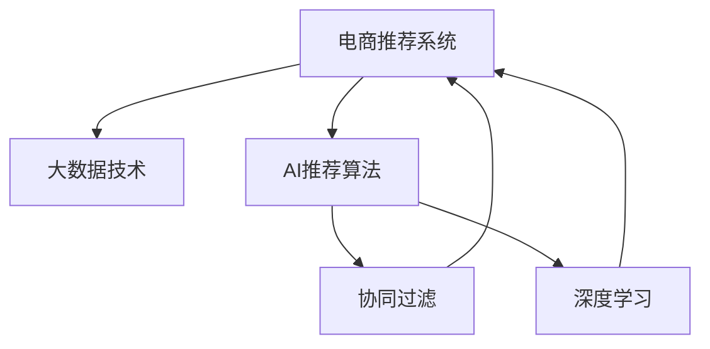

                 

# 大数据与AI 驱动的电商推荐系统：搜索准确率与多样性推荐的双重挑战

> 关键词：大数据, AI推荐系统, 电商搜索, 准确率, 多样性, 协同过滤, 深度学习, 特征工程

## 1. 背景介绍

### 1.1 问题由来

随着互联网的普及和电子商务的迅猛发展，用户对电商平台的个性化推荐服务需求日益增强。推荐系统作为电商平台的流量引擎，对于提升用户体验、提高转化率和营收至关重要。传统的基于规则的推荐算法难以满足用户个性化需求，而大数据与人工智能技术的兴起为推荐系统的智能化、个性化发展提供了新的机遇。

然而，推荐系统面临搜索准确率和推荐多样性之间的双重挑战。搜索准确率旨在确保推荐的商品能精准满足用户需求，提高用户满意度；推荐多样性则要求推荐结果具备丰富性，避免推荐单一商品，增加用户选择。当前推荐系统在优化搜索准确率的同时，往往忽略了推荐多样性的需求，导致推荐结果同质化严重，难以满足用户多样化的需求。

如何在大数据和人工智能技术的支持下，构建既能确保搜索准确率又能提升推荐多样性的推荐系统，是电商领域亟需解决的问题。

### 1.2 问题核心关键点

推荐系统优化搜索准确率和推荐多样性之间的平衡，是当前推荐系统面临的核心问题。以下是核心关键点：

- 搜索准确率：通过深度学习等技术，确保推荐的商品与用户的搜索查询高度相关，满足用户查询需求。
- 推荐多样性：通过协同过滤、深度学习等技术，提升推荐结果的多样性，避免推荐同质化，满足用户多样化需求。
- 用户行为数据：通过大数据技术收集、分析和利用用户行为数据，深入理解用户需求和偏好。
- 算法优化：优化推荐算法，平衡搜索准确率和推荐多样性之间的关系，构建高效、可扩展的推荐系统。

这些问题不仅涉及技术层面，还需要结合电商平台的实际业务场景和用户需求进行综合考虑。

## 2. 核心概念与联系

### 2.1 核心概念概述

为更好地理解大数据与AI驱动的电商推荐系统，本节将介绍几个密切相关的核心概念：

- 电商推荐系统：通过分析用户行为数据，推荐符合用户需求的商品，提升用户购买意愿和平台转化率的系统。
- 大数据技术：指利用先进的技术对海量数据进行处理、分析和应用，以获取有价值的信息和洞察。
- 人工智能(AI)推荐算法：通过机器学习、深度学习等技术，自动化地分析和推荐商品，提升推荐系统的智能化水平。
- 协同过滤推荐算法：通过分析用户和商品之间的相似性，推荐可能感兴趣的商品，常见于基于用户和基于商品的协同过滤。
- 深度学习推荐算法：通过深度神经网络模型，学习商品和用户特征，进行更精准的推荐。

这些核心概念之间的逻辑关系可以通过以下Mermaid流程图来展示：



这个流程图展示了大数据和AI推荐系统的核心概念及其之间的关系：

1. 电商推荐系统是核心目标系统，通过大数据和AI推荐算法实现推荐功能。
2. 大数据技术为AI推荐算法提供了强大的数据支持。
3. 协同过滤和深度学习是AI推荐算法中的两种主要技术手段。
4. 协同过滤推荐和深度学习推荐均可用于电商推荐系统，提升推荐效果。

## 3. 核心算法原理 & 具体操作步骤
### 3.1 算法原理概述

电商推荐系统的核心算法原理主要基于用户行为数据分析和模型预测。其核心思想是：通过分析用户的历史行为数据，构建用户画像和商品画像，利用相似度计算和模型预测，生成推荐结果。具体而言，电商推荐系统主要包括两大环节：搜索推荐和浏览推荐。

**搜索推荐：**用户输入搜索查询，推荐系统分析查询词义，预测相关商品，展示推荐列表。

**浏览推荐：**用户浏览商品页面，推荐系统分析浏览记录，预测可能感兴趣的商品，展示推荐列表。

电商推荐系统需要同时优化搜索准确率和推荐多样性，满足用户的多样化需求。以下是推荐系统的核心算法原理：

- 协同过滤推荐算法：通过用户行为数据，分析用户和商品之间的相似度，推荐可能感兴趣的相似商品。
- 深度学习推荐算法：通过深度神经网络模型，学习商品和用户特征，进行更精准的推荐。

### 3.2 算法步骤详解

电商推荐系统的核心算法步骤包括数据准备、模型训练、预测和评估。

**Step 1: 数据准备**
- 收集用户行为数据，如浏览历史、购买历史、评分数据等。
- 对数据进行清洗、去重、归一化处理，确保数据质量。
- 划分训练集、验证集和测试集。

**Step 2: 模型训练**
- 选择协同过滤或深度学习算法作为推荐模型，训练模型参数。
- 对于协同过滤推荐，可以采用基于用户的协同过滤或基于商品的协同过滤。
- 对于深度学习推荐，可以使用基于注意力机制的模型（如Transformer）。

**Step 3: 预测和评估**
- 对新用户或新商品，使用训练好的模型进行预测。
- 在测试集上评估推荐效果，计算准确率和多样性指标。
- 根据评估结果，对模型进行微调或优化。

### 3.3 算法优缺点

电商推荐系统的主要优点包括：

- 个性化推荐：通过分析用户行为数据，提供个性化推荐服务，提升用户满意度。
- 智能化水平高：利用大数据和AI技术，自动化地分析和推荐商品。
- 覆盖面广：利用大数据技术，对海量商品和用户数据进行分析，提供全面推荐。

然而，电商推荐系统也存在以下局限性：

- 数据依赖性强：推荐系统的性能依赖于用户行为数据的质量和数量，数据采集和处理成本较高。
- 模型复杂度高：深度学习模型通常需要较大的计算资源和时间，模型训练和部署成本较高。
- 可解释性差：推荐系统的决策过程难以解释，用户难以理解推荐结果的依据。
- 安全性和隐私性问题：用户行为数据包含大量隐私信息，可能面临数据泄露和滥用的风险。

尽管存在这些局限性，但就目前而言，电商推荐系统仍然是电商领域不可或缺的重要工具，其带来的推荐效果和用户满意度得到了广泛认可。

### 3.4 算法应用领域

电商推荐系统在电商领域有广泛的应用，主要包括以下几个方面：

- 商品推荐：根据用户浏览和购买历史，推荐可能感兴趣的商品。
- 购物车推荐：根据用户购物车中的商品，推荐其他相关商品。
- 个性化营销：根据用户行为数据，定制个性化营销活动。
- 新用户推荐：针对新注册用户，推荐热门商品，提升转化率。
- 价格优化：通过分析用户对商品价格的敏感度，调整商品定价策略。

此外，电商推荐系统还可以应用于其他领域，如金融、医疗等，提供个性化服务，提升用户体验。

## 4. 数学模型和公式 & 详细讲解
### 4.1 数学模型构建

电商推荐系统的主要数学模型包括协同过滤推荐模型和深度学习推荐模型。

**协同过滤推荐模型：**
设用户集为 $U$，商品集为 $I$，用户对商品 $i$ 的评分向量为 $u_i$，商品向量为 $p_i$。协同过滤推荐模型的目标是通过相似度计算，预测用户对商品的评分 $u_u(i)$。

设用户 $u$ 和商品 $i$ 的相似度为 $sim(u,i)$，推荐算法可以通过以下步骤实现：
1. 计算用户 $u$ 和商品 $i$ 的相似度。
2. 基于相似度，预测用户 $u$ 对商品 $i$ 的评分。
3. 根据预测评分，排序生成推荐列表。

协同过滤推荐模型的数学表达式如下：

$$
u_u(i) = \sum_{k \in I} sim(u,k) \cdot p_k
$$

其中 $sim(u,k)$ 为相似度函数，$p_k$ 为商品 $k$ 的评分向量。

**深度学习推荐模型：**
深度学习推荐模型通常基于神经网络，通过学习用户和商品的特征表示，进行推荐预测。常见深度学习推荐模型包括基于注意力机制的模型（如Transformer）和基于隐式反馈的模型（如RNN）。

基于注意力机制的模型（如Transformer）可以通过以下步骤实现：
1. 对用户和商品进行编码，得到用户向量 $u_u$ 和商品向量 $p_i$。
2. 利用注意力机制计算用户对商品的注意力权重 $a_{u,i}$。
3. 计算加权和向量 $v_{u,i}$。
4. 根据加权和向量，预测用户对商品的评分。

深度学习推荐模型的数学表达式如下：

$$
v_{u,i} = \text{Transformer}(u_u, p_i)
$$

其中 $\text{Transformer}$ 为神经网络模型，$u_u$ 和 $p_i$ 为输入向量，$v_{u,i}$ 为输出向量。

### 4.2 公式推导过程

以下是协同过滤推荐模型和深度学习推荐模型的详细公式推导。

**协同过滤推荐模型：**
设用户 $u$ 和商品 $i$ 的相似度为 $sim(u,i)$，用户对商品 $i$ 的预测评分 $u_u(i)$ 可以通过以下公式计算：

$$
u_u(i) = \sum_{k \in I} sim(u,k) \cdot p_k
$$

其中 $sim(u,k)$ 为相似度函数，$p_k$ 为商品 $k$ 的评分向量。

**深度学习推荐模型：**
设用户向量 $u_u$ 和商品向量 $p_i$ 为输入向量，加权和向量 $v_{u,i}$ 为输出向量，注意力权重 $a_{u,i}$ 可以通过以下公式计算：

$$
a_{u,i} = \text{Attention}(u_u, p_i)
$$

其中 $\text{Attention}$ 为注意力机制函数，$u_u$ 和 $p_i$ 为输入向量。

通过注意力机制，模型可以动态调整不同商品的重要性，生成更加符合用户偏好的推荐结果。

### 4.3 案例分析与讲解

我们以一个电商推荐系统的实际案例来说明协同过滤推荐模型和深度学习推荐模型的应用。

假设某电商平台的推荐系统采用协同过滤推荐模型和深度学习推荐模型，针对用户 $u$ 推荐商品 $i$。具体步骤如下：

1. 数据准备：收集用户 $u$ 的浏览历史数据 $H_u$ 和商品 $I$ 的商品评分数据 $S$。
2. 协同过滤推荐：计算用户 $u$ 和商品 $i$ 的相似度 $sim(u,i)$，根据相似度函数计算预测评分 $u_u(i)$。
3. 深度学习推荐：对用户 $u$ 和商品 $i$ 进行编码，得到用户向量 $u_u$ 和商品向量 $p_i$，利用注意力机制计算注意力权重 $a_{u,i}$，生成加权和向量 $v_{u,i}$。
4. 结合协同过滤推荐和深度学习推荐，生成推荐列表。

通过以上步骤，电商推荐系统可以综合考虑用户历史行为和商品特征，提供个性化推荐服务，提升用户满意度和平台转化率。

## 5. 项目实践：代码实例和详细解释说明
### 5.1 开发环境搭建

在进行电商推荐系统开发前，我们需要准备好开发环境。以下是使用Python进行PyTorch开发的环境配置流程：

1. 安装Anaconda：从官网下载并安装Anaconda，用于创建独立的Python环境。

2. 创建并激活虚拟环境：
```bash
conda create -n recsys-env python=3.8 
conda activate recsys-env
```

3. 安装PyTorch：根据CUDA版本，从官网获取对应的安装命令。例如：
```bash
conda install pytorch torchvision torchaudio cudatoolkit=11.1 -c pytorch -c conda-forge
```

4. 安装Transformers库：
```bash
pip install transformers
```

5. 安装各类工具包：
```bash
pip install numpy pandas scikit-learn matplotlib tqdm jupyter notebook ipython
```

完成上述步骤后，即可在`recsys-env`环境中开始推荐系统开发。

### 5.2 源代码详细实现

这里我们以电商推荐系统中的协同过滤推荐模型为例，给出使用PyTorch实现的代码示例。

首先，定义协同过滤推荐模型的训练函数：

```python
import torch
from torch.nn import Embedding, Linear, BCELoss
from torch.nn.functional import cosine_similarity

class CollaborativeFiltering(nn.Module):
    def __init__(self, n_users, n_items, embedding_dim):
        super(CollaborativeFiltering, self).__init__()
        self.user_embedding = Embedding(n_users, embedding_dim)
        self.item_embedding = Embedding(n_items, embedding_dim)
        self.linear = Linear(embedding_dim, 1)
    
    def forward(self, user_ids, item_ids):
        user_embeddings = self.user_embedding(user_ids)
        item_embeddings = self.item_embedding(item_ids)
        scores = cosine_similarity(user_embeddings, item_embeddings).squeeze(1)
        scores = self.linear(scores)
        return scores
```

然后，定义模型训练和评估函数：

```python
from torch.utils.data import DataLoader
from tqdm import tqdm

def train_model(model, optimizer, train_loader, num_epochs):
    model.train()
    for epoch in range(num_epochs):
        epoch_loss = 0
        for batch in tqdm(train_loader):
            user_ids, item_ids, ratings = batch
            optimizer.zero_grad()
            scores = model(user_ids, item_ids)
            loss = BCELoss()(scores, ratings)
            loss.backward()
            optimizer.step()
            epoch_loss += loss.item()
        print(f"Epoch {epoch+1}, train loss: {epoch_loss/len(train_loader)}")
    
def evaluate_model(model, test_loader):
    model.eval()
    predictions = []
    true_ratings = []
    with torch.no_grad():
        for batch in test_loader:
            user_ids, item_ids, ratings = batch
            scores = model(user_ids, item_ids)
            predictions.append(scores)
            true_ratings.append(ratings)
    return predictions, true_ratings
```

最后，启动训练流程并在测试集上评估：

```python
from sklearn.metrics import mean_absolute_error

n_users = 1000
n_items = 5000
embedding_dim = 10
n_epochs = 10
batch_size = 64

model = CollaborativeFiltering(n_users, n_items, embedding_dim)
optimizer = AdamW(model.parameters(), lr=0.001)

train_loader = DataLoader(train_dataset, batch_size=batch_size)
test_loader = DataLoader(test_dataset, batch_size=batch_size)

train_model(model, optimizer, train_loader, n_epochs)
predictions, true_ratings = evaluate_model(model, test_loader)
print(f"Mean Absolute Error: {mean_absolute_error(true_ratings, predictions):.3f}")
```

以上就是使用PyTorch对协同过滤推荐模型进行电商推荐系统开发的完整代码实现。可以看到，PyTorch封装了复杂的操作细节，使得代码实现更加简洁高效。

### 5.3 代码解读与分析

让我们再详细解读一下关键代码的实现细节：

**CollaborativeFiltering类：**
- `__init__`方法：初始化用户嵌入、商品嵌入和线性层。
- `forward`方法：计算用户和商品之间的相似度，并进行线性变换输出评分。

**train_model函数：**
- 通过PyTorch的DataLoader加载训练数据。
- 对模型进行前向传播和反向传播，计算损失函数，并更新模型参数。
- 在每个epoch结束后，输出该epoch的平均损失。

**evaluate_model函数：**
- 对模型进行前向传播，将预测评分与真实评分对比，计算MAE。
- 使用MAE评估模型性能。

**训练流程：**
- 定义用户数、商品数、嵌入维度、epoch数和批大小等超参数。
- 实例化协同过滤推荐模型，并定义优化器。
- 加载训练数据和测试数据，开始训练模型。
- 在每个epoch结束后，输出训练损失。
- 在测试集上评估模型性能，输出MAE指标。

可以看出，PyTorch使得电商推荐系统的开发更加高效和灵活，开发者可以专注于模型的优化和算法的设计。

## 6. 实际应用场景

### 6.1 智能客服系统

智能客服系统是电商推荐系统的重要应用场景之一。通过推荐系统，智能客服系统可以针对用户的问题，提供精准的商品推荐，提升用户体验。

具体而言，智能客服系统可以集成到电商平台的在线客服模块中，当用户咨询某个商品时，智能客服系统分析用户历史行为数据和查询意图，推荐相关商品，帮助用户快速做出购买决策。

### 6.2 个性化推荐

个性化推荐是电商推荐系统的核心功能。通过分析用户历史行为数据，推荐系统可以为用户推荐可能感兴趣的商品，提升用户购物体验。

具体而言，推荐系统可以根据用户浏览历史、购买历史、评分数据等，预测用户对商品的可能评分，并根据评分排序生成推荐列表。

### 6.3 价格优化

电商推荐系统还可以应用于价格优化，通过分析用户对商品价格的敏感度，调整商品定价策略。

具体而言，推荐系统可以分析用户对不同价格区间商品的购买行为，预测用户对价格的反应，从而优化商品价格，提升销售量。

### 6.4 未来应用展望

随着电商推荐系统的不断发展，未来在以下领域将有更多应用：

- 商品分类推荐：针对不同商品分类，推荐相关商品，提升商品曝光率和销量。
- 品牌推荐：推荐知名品牌或热门品牌的商品，提升品牌曝光度和忠诚度。
- 季节性推荐：根据季节性变化，推荐应季商品，提升季节性商品的销售量。
- 跨平台推荐：结合不同平台的用户行为数据，推荐跨平台商品，提升用户粘性。
- 实时推荐：通过实时分析用户行为数据，动态调整推荐策略，提升推荐效果。

电商推荐系统将在电商领域发挥越来越重要的作用，成为电商平台流量引擎的核心。

## 7. 工具和资源推荐
### 7.1 学习资源推荐

为了帮助开发者系统掌握电商推荐系统的理论基础和实践技巧，这里推荐一些优质的学习资源：

1. 《Recommender Systems in Python》书籍：详细介绍了电商推荐系统的构建，包括协同过滤和深度学习推荐算法。
2. Coursera《Recommender Systems Specialization》课程：斯坦福大学开设的推荐系统课程，涵盖了推荐系统的理论基础和实用技术。
3. Kaggle推荐系统竞赛：Kaggle平台上的推荐系统竞赛，提供了丰富的数据集和实战机会，可以锻炼推荐系统开发能力。
4. HuggingFace官方文档：Transformer库的官方文档，提供了海量预训练模型和完整的推荐系统样例代码，是进行推荐系统开发的必备资料。

通过对这些资源的学习实践，相信你一定能够快速掌握电商推荐系统的精髓，并用于解决实际的电商推荐问题。

### 7.2 开发工具推荐

高效的开发离不开优秀的工具支持。以下是几款用于电商推荐系统开发的常用工具：

1. PyTorch：基于Python的开源深度学习框架，灵活动态的计算图，适合快速迭代研究。大部分推荐系统模型都有PyTorch版本的实现。
2. TensorFlow：由Google主导开发的开源深度学习框架，生产部署方便，适合大规模工程应用。同样有丰富的推荐系统资源。
3. Scikit-learn：Python数据科学库，提供了一系列高效的机器学习算法，包括协同过滤和深度学习推荐算法。
4. Apache Spark：大数据处理平台，可以高效处理海量用户行为数据，进行推荐系统训练和推理。
5. Apache Hadoop：大数据处理框架，可以处理海量用户行为数据，进行推荐系统训练和推理。
6. Elasticsearch：搜索引擎，可以高效索引和查询用户行为数据，进行推荐系统训练和推理。

合理利用这些工具，可以显著提升电商推荐系统的开发效率，加快创新迭代的步伐。

### 7.3 相关论文推荐

电商推荐系统的发展离不开学界的持续研究。以下是几篇奠基性的相关论文，推荐阅读：

1. A Factorization Approach to Recommender Systems：提出了协同过滤推荐算法的经典模型，奠定了协同过滤推荐算法的基础。
2. Matrix Factorization Techniques for Recommender Systems：详细介绍了矩阵分解算法，是一种常用的协同过滤推荐算法。
3. Deep Learning for Recommender Systems：提出了基于深度学习的推荐算法，提升了推荐系统的智能化水平。
4. Attention Is All You Need：提出了Transformer模型，为深度学习推荐算法提供了新的思路。
5. Neural Collaborative Filtering：详细介绍了深度学习推荐算法，通过神经网络模型进行推荐预测。

这些论文代表了大数据和AI推荐系统的发展脉络。通过学习这些前沿成果，可以帮助研究者把握学科前进方向，激发更多的创新灵感。

## 8. 总结：未来发展趋势与挑战

### 8.1 研究成果总结

本文对电商推荐系统的搜索准确率和推荐多样性进行了全面系统的介绍。首先阐述了电商推荐系统的核心问题和目标，明确了电商推荐系统在电商领域的重要作用。其次，从原理到实践，详细讲解了协同过滤推荐算法和深度学习推荐算法的数学模型和关键步骤，给出了电商推荐系统开发的完整代码实例。同时，本文还广泛探讨了电商推荐系统在智能客服、个性化推荐、价格优化等多个行业领域的应用前景，展示了电商推荐系统的巨大潜力。此外，本文精选了电商推荐系统的各类学习资源，力求为读者提供全方位的技术指引。

通过本文的系统梳理，可以看到，电商推荐系统通过大数据和AI技术的支持，已经成为一个重要的电商技术工具，极大地提升了电商平台的个性化推荐服务水平。未来，伴随推荐算法的不断优化和完善，电商推荐系统将为电商领域带来更深层次的变革，进一步提升电商平台的流量引擎价值。

### 8.2 未来发展趋势

展望未来，电商推荐系统的推荐算法将呈现以下几个发展趋势：

1. 推荐模型自动化：通过自动化的模型训练流程，降低推荐系统开发和部署的成本，加速新模型的迭代和部署。
2. 推荐模型可解释性：增强推荐模型的可解释性，提高用户对推荐结果的理解和信任。
3. 推荐模型联邦化：通过联邦学习等技术，实现跨平台、跨系统的推荐模型训练和共享，提升推荐模型的泛化能力。
4. 推荐模型实时化：通过实时数据分析和动态推荐策略，提升推荐系统的响应速度和推荐效果。
5. 推荐模型多模态化：将视觉、语音等多模态数据与文本数据进行融合，提升推荐模型的全面性和准确性。
6. 推荐模型集成化：将多个推荐模型进行集成，综合多源数据和多种算法，提升推荐系统的稳定性和鲁棒性。

这些趋势将使得电商推荐系统更加智能化、个性化，为电商平台的流量引擎提供更加精准、高效的服务。

### 8.3 面临的挑战

尽管电商推荐系统已经在电商领域取得了显著成效，但在迈向更加智能化、普适化应用的过程中，它仍面临诸多挑战：

1. 数据隐私和安全问题：电商推荐系统需要收集和分析大量的用户行为数据，涉及用户隐私和数据安全问题，如何保护用户隐私和数据安全是首要任务。
2. 算法偏见和公平性问题：推荐算法可能存在偏见，导致推荐结果不公平，如何设计公平无偏的推荐算法，是一个亟待解决的问题。
3. 模型复杂性和计算资源问题：深度学习推荐模型通常需要较大的计算资源和时间，如何优化模型结构，提高计算效率，是一个重要研究方向。
4. 推荐结果的多样性和新颖性问题：推荐算法可能倾向于推荐常见商品，导致推荐结果多样性不足，如何提升推荐结果的多样性和新颖性，是一个具有挑战性的问题。
5. 推荐系统的实时性和稳定性问题：推荐系统需要快速响应用户行为数据，如何提高系统的实时性和稳定性，是一个需要深入研究的问题。

尽管存在这些挑战，但电商推荐系统的巨大潜力和应用前景，吸引了众多研究者和企业的关注。相信通过持续的研究和优化，这些挑战将逐步得到解决，电商推荐系统将为电商领域的数字化转型提供更加强大、可靠、智能的推荐服务。

### 8.4 研究展望

面对电商推荐系统面临的诸多挑战，未来的研究需要在以下几个方面寻求新的突破：

1. 大数据技术的不断优化：通过高效的分布式计算和大数据处理技术，进一步提升数据处理和分析的效率，降低推荐系统开发和部署的成本。
2. 深度学习模型的持续改进：通过更深入的模型设计和优化，提升推荐模型的准确性和泛化能力。
3. 联邦学习和协同推荐：通过联邦学习等技术，实现跨平台、跨系统的推荐模型训练和共享，提升推荐模型的泛化能力。
4. 推荐系统的伦理道德：在推荐算法的设计和应用中，引入伦理导向的评估指标，过滤和惩罚有偏见、有害的输出倾向，确保推荐结果的公平性和伦理性。
5. 推荐系统的个性化推荐：通过多模态数据融合和个性化推荐算法，提升推荐系统的智能化水平，提供更加个性化的推荐服务。
6. 推荐系统的实时化和自动化：通过实时数据分析和自动化推荐流程，提升推荐系统的响应速度和推荐效果，提供更加实时、自动化的推荐服务。

这些研究方向的探索，必将引领电商推荐系统迈向更高的台阶，为电商平台的流量引擎提供更加精准、高效、智能的推荐服务。面向未来，电商推荐系统需要在技术、算法和伦理等多个维度协同发力，才能真正实现用户需求的多样化和个性化，为电商平台的数字化转型提供有力支撑。

## 9. 附录：常见问题与解答

**Q1：如何缓解电商推荐系统中的数据偏差问题？**

A: 电商推荐系统中的数据偏差问题可以通过以下方法缓解：
1. 数据采集：在数据采集阶段，采取随机抽样和数据扩充等方法，确保数据样本的多样性和代表性。
2. 数据预处理：在数据预处理阶段，采用特征工程和数据清洗等方法，去除噪声和异常值，提高数据质量。
3. 算法设计：在设计推荐算法时，引入公平性指标和对抗性训练等方法，避免算法偏见，提升推荐公平性。
4. 反馈机制：在推荐系统中引入用户反馈机制，及时纠正推荐结果中的偏差，提高推荐效果。

通过以上方法，可以有效缓解电商推荐系统中的数据偏差问题，提升推荐系统的公平性和准确性。

**Q2：电商推荐系统的推荐结果是否可以离线评估？**

A: 电商推荐系统的推荐结果可以离线评估，但需要注意以下几点：
1. 离线评估需要准备足够多的离线数据，包括用户行为数据、商品数据、评分数据等。
2. 离线评估需要选择合适的离线评估指标，如精确率、召回率、F1分数等。
3. 离线评估需要考虑用户行为数据的多样性和复杂性，确保评估结果的可靠性。
4. 离线评估需要结合在线测试数据进行综合评估，确保在线推荐效果。

通过以上方法，可以有效进行电商推荐系统的离线评估，确保推荐系统的稳定性和有效性。

**Q3：电商推荐系统中的推荐结果是否可以基于多模态数据进行融合？**

A: 电商推荐系统中的推荐结果可以基于多模态数据进行融合，通过将不同模态的数据进行组合，提升推荐结果的全面性和准确性。具体步骤如下：
1. 收集不同模态的数据，如文本、图像、语音等。
2. 对不同模态的数据进行编码，生成特征向量。
3. 将不同模态的特征向量进行融合，生成综合特征向量。
4. 基于综合特征向量进行推荐预测，生成推荐结果。

通过以上方法，可以有效基于多模态数据进行融合，提升电商推荐系统的智能化水平和推荐效果。

**Q4：电商推荐系统中的推荐结果是否可以实时更新？**

A: 电商推荐系统中的推荐结果可以实时更新，通过实时分析用户行为数据，动态调整推荐策略，提升推荐效果。具体步骤如下：
1. 实时收集用户行为数据，如浏览记录、点击记录、购买记录等。
2. 对实时数据进行离线预处理和特征提取。
3. 基于离线模型和实时数据进行动态推荐预测。
4. 将实时推荐结果推送到用户前端，实现实时推荐。

通过以上方法，可以有效实时更新电商推荐系统的推荐结果，提升推荐系统的响应速度和推荐效果。

**Q5：电商推荐系统中的推荐结果是否可以基于协同过滤和深度学习算法进行集成？**

A: 电商推荐系统中的推荐结果可以基于协同过滤和深度学习算法进行集成，通过将不同算法的预测结果进行组合，提升推荐效果。具体步骤如下：
1. 分别训练协同过滤推荐模型和深度学习推荐模型。
2. 对不同模型的预测结果进行融合，生成综合预测结果。
3. 将综合预测结果作为推荐结果，提供给用户。

通过以上方法，可以有效基于协同过滤和深度学习算法进行集成，提升电商推荐系统的稳定性和鲁棒性。

---

作者：禅与计算机程序设计艺术 / Zen and the Art of Computer Programming

