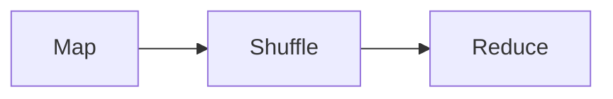
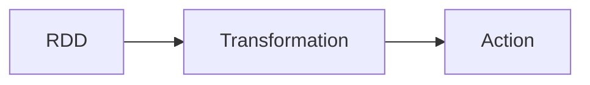

                 

# 大数据分析：Hadoop 和 Spark

> 关键词：大数据分析，Hadoop，Spark，MapReduce，RDD，流处理，机器学习，数据仓库

## 1. 背景介绍

随着互联网和物联网设备的广泛应用，全球数据量呈现爆炸式增长。根据IDC的预测，到2025年，全球数据总量将增长至175ZB。面对如此巨量的数据，传统的数据处理方式显得力不从心。人们需要更强大、高效的大数据处理平台，以满足日益增长的数据处理需求。在这样的背景下，Hadoop和Spark应运而生，成为目前主流的开源大数据处理技术。

Hadoop是一个开源的大数据处理框架，由Apache基金会维护。它由HDFS（Hadoop Distributed File System）和MapReduce两个核心组件构成。HDFS提供了海量数据的分布式存储能力，而MapReduce则提供了一种简单高效的大数据处理模式。Spark则是Apache基金会推出的另一个大数据处理框架，支持批处理、流处理、机器学习等多种计算模式，并且在大数据处理速度上有了显著的提升。

本文将详细介绍Hadoop和Spark的核心概念、核心算法以及实际应用场景。通过本文的学习，读者可以了解如何使用Hadoop和Spark进行大规模数据处理，如何构建高效可靠的大数据系统。

## 2. 核心概念与联系

### 2.1 核心概念概述

在介绍Hadoop和Spark的核心概念之前，先来看一下大数据处理的核心流程。大数据处理的流程通常包括以下几个步骤：数据收集、数据存储、数据处理、数据分析、数据展示。下图展示了这一流程：


在数据存储和数据处理环节中，Hadoop和Spark扮演了重要的角色。

Hadoop的核心组件HDFS和MapReduce是进行海量数据存储和处理的主要工具。HDFS实现了数据的分布式存储，而MapReduce则提供了一种简单高效的数据处理方式。

Spark则是另一个主要的大数据处理框架，它支持内存计算、分布式计算、流处理等多种计算模式。Spark的核心组件RDD（Resilient Distributed Datasets）提供了高效、可扩展的数据处理能力。

### 2.2 核心概念联系

Hadoop和Spark都是基于分布式计算的思想，通过将数据分割成多个小片段，分配到多台机器上并行处理，从而实现高效的数据处理。它们的设计理念、处理模式、核心组件都有很多相似之处。

Hadoop和Spark的联系体现在以下几个方面：

1. 分布式计算：两者都支持分布式计算，可以在多台机器上并行处理数据。
2. 内存计算：两者都支持内存计算，可以减少IO操作，提高处理效率。
3. 数据持久化：两者都支持数据持久化，可以在处理过程中对数据进行持久化，提高系统的可靠性和性能。
4. 生态系统：两者都有丰富的生态系统，有大量的第三方工具和组件，可以更好地满足不同场景下的需求。

## 3. 核心算法原理 & 具体操作步骤

### 3.1 算法原理概述

Hadoop和Spark的核心算法都是基于MapReduce的，这种算法的基本思想是将任务分解为多个子任务，并将这些子任务分配到多个计算节点上并行处理。具体的算法流程如下：

1. Map阶段：将输入数据分割成多个小块，对每个小块进行一次处理。
2. Shuffle阶段：将Map阶段的输出数据进行排序、合并，并将相同的数据分配到同一个节点上。
3. Reduce阶段：对Shuffle阶段输出的数据进行汇总、计算，并生成最终的输出结果。

MapReduce算法的优点在于其简单高效、可扩展性好、容错性高，适用于大规模数据处理。

### 3.2 算法步骤详解

#### 3.2.1 Hadoop的MapReduce

Hadoop的MapReduce算法主要分为两个步骤：Map和Reduce。MapReduce的详细步骤如图：



1. Map阶段：
   - 将输入数据分割成多个小块，每个小块由一个Mapper处理。
   - Mapper将输入数据转换成中间格式（Key-Value对），并发送给Shuffle阶段。
   - Map阶段的处理逻辑可以是任意的，例如可以提取特定的特征、统计数据等。

2. Shuffle阶段：
   - 将Map阶段的输出数据进行排序、合并，并将相同的数据分配到同一个节点上。
   - 这个过程由Partitioner实现，Partitioner将Map阶段的输出按照指定的规则进行分组。
   - Shuffle阶段的处理逻辑通常是对Map阶段的输出进行排序、合并，生成中间数据。

3. Reduce阶段：
   - Reduce阶段对Shuffle阶段输出的数据进行汇总、计算，并生成最终的输出结果。
   - Reduce阶段的处理逻辑也可以是任意的，例如可以将Map阶段的输出按照某个规则进行合并，统计数据等。

#### 3.2.2 Spark的RDD

Spark的RDD（Resilient Distributed Datasets）是Spark的核心概念，它是一种基于内存的分布式数据集，支持丰富的数据处理操作。RDD的基本操作包括Map、Reduce、Join、Filter等。RDD的操作流程如图：



1. RDD阶段：
   - RDD是Spark中分布式数据集的基本单元，可以表示为多个数据块的集合。
   - RDD可以进行多种操作，例如Map、Filter、Join等，可以对RDD进行转换。

2. Transformation阶段：
   - Transformation操作可以对RDD进行转换，生成新的RDD。
   - Transformation操作包括Map、Filter、Join等，可以用于对数据进行处理。

3. Action阶段：
   - Action操作可以触发数据的计算和持久化，例如Count、Save等。
   - Action操作会触发RDD的数据计算，并将结果返回给用户。

### 3.3 算法优缺点

#### 3.3.1 Hadoop的MapReduce

优点：
1. 可扩展性好：MapReduce可以处理大规模的数据集，具有良好的可扩展性。
2. 容错性好：MapReduce具有容错性，可以在节点故障时自动恢复。
3. 可靠性高：MapReduce使用分布式文件系统进行数据存储和处理，可靠性高。

缺点：
1. 处理速度慢：MapReduce的处理速度较慢，不适合实时处理。
2. 资源消耗大：MapReduce的资源消耗较大，需要大量的计算资源。
3. 编程复杂：MapReduce的编程较为复杂，需要掌握MapReduce的编程范式。

#### 3.3.2 Spark的RDD

优点：
1. 处理速度快：Spark支持内存计算，处理速度较快。
2. 编程简单：Spark的编程较为简单，可以使用Scala、Java、Python等语言进行编程。
3. 数据持久化：Spark支持数据持久化，可以在处理过程中对数据进行持久化，提高系统的可靠性和性能。

缺点：
1. 资源消耗大：Spark的资源消耗较大，需要大量的计算资源。
2. 延迟大：Spark的延迟较大，不适合实时处理。
3. 需要调试：Spark的编程较为简单，但是需要调试和优化。

### 3.4 算法应用领域

#### 3.4.1 Hadoop的应用

Hadoop主要应用于以下几个领域：

1. 大数据存储：Hadoop的HDFS提供了海量数据的分布式存储能力，适用于大规模数据存储。
2. 数据处理：Hadoop的MapReduce可以处理大规模的数据集，适用于大规模数据处理。
3. 日志分析：Hadoop可以处理大规模日志数据，适用于日志分析和报表生成。

#### 3.4.2 Spark的应用

Spark主要应用于以下几个领域：

1. 数据处理：Spark支持内存计算，处理速度快，适用于大规模数据处理。
2. 流处理：Spark支持流处理，适用于实时数据处理。
3. 机器学习：Spark支持机器学习算法，适用于数据分析和机器学习。

## 4. 数学模型和公式 & 详细讲解 & 举例说明

### 4.1 数学模型构建

#### 4.1.1 Hadoop的MapReduce

Hadoop的MapReduce模型的数学模型如下：

$$
\text{MapReduce} = \text{Mapper} \times \text{Partitioner} \times \text{Reducer}
$$

其中，Mapper、Partitioner、Reducer分别表示Map、Shuffle、Reduce操作。

#### 4.1.2 Spark的RDD

Spark的RDD模型的数学模型如下：

$$
\text{RDD} = \text{Transformation} \times \text{Action}
$$

其中，Transformation表示RDD的转换操作，Action表示RDD的计算操作。

### 4.2 公式推导过程

#### 4.2.1 Hadoop的MapReduce

假设输入数据为$(x_1, y_1), (x_2, y_2), \ldots, (x_n, y_n)$，Map操作将输入数据映射为中间数据$(k_1, v_1), (k_2, v_2), \ldots, (k_m, v_m)$。

Shuffle操作将中间数据按照key进行分组，生成输出数据$(k_1', v_1'), (k_2', v_2'), \ldots, (k_m', v_m')$。

Reduce操作对分组后的数据进行汇总、计算，生成最终输出数据。

#### 4.2.2 Spark的RDD

假设输入数据为$(x_1, y_1), (x_2, y_2), \ldots, (x_n, y_n)$，Transformation操作将输入数据转换成中间数据$(x_1', y_1'), (x_2', y_2'), \ldots, (x_n', y_n')$。

Action操作对中间数据进行计算，生成最终输出数据。

### 4.3 案例分析与讲解

#### 4.3.1 Hadoop的MapReduce案例

假设有一份学生成绩表，表中的数据如下：

| 姓名 | 科目 | 成绩 |
| --- | --- | --- |
| 小明 | 数学 | 80 |
| 小红 | 语文 | 90 |
| 小张 | 数学 | 70 |
| 小王 | 英语 | 85 |
| 小明 | 英语 | 75 |

使用Hadoop的MapReduce进行计算，可以统计每个学生的数学和英语成绩的平均分。

1. Map阶段：
   - Mapper1：对数学成绩进行统计，生成中间数据$(k_1, v_1)$，其中$k_1$为学生姓名，$v_1$为数学成绩。
   - Mapper2：对英语成绩进行统计，生成中间数据$(k_1, v_2)$，其中$k_1$为学生姓名，$v_2$为英语成绩。

2. Shuffle阶段：
   - Partitioner：将Map阶段的输出数据按照学生姓名进行分组，生成中间数据$(k_1', v_1'), (k_2', v_2')$。

3. Reduce阶段：
   - Reducer：对分组后的数据进行计算，生成最终输出数据。

最终输出结果为：
- 小明的平均分为$\frac{80+75}{2}=77.5$
- 小红的平均分为$\frac{90}{1}=90$
- 小张的平均分为$\frac{70}{1}=70$
- 小王的平均分为$\frac{85}{1}=85$

#### 4.3.2 Spark的RDD案例

假设有一份学生成绩表，表中的数据如下：

| 姓名 | 科目 | 成绩 |
| --- | --- | --- |
| 小明 | 数学 | 80 |
| 小红 | 语文 | 90 |
| 小张 | 数学 | 70 |
| 小王 | 英语 | 85 |
| 小明 | 英语 | 75 |

使用Spark的RDD进行计算，可以统计每个学生的数学和英语成绩的平均分。

1. RDD阶段：
   - RDD1：表示学生成绩表，$(x_1, y_1), (x_2, y_2), \ldots, (x_n, y_n)$。

2. Transformation阶段：
   - Transformation1：将RDD1中的数据按照科目进行分组，生成中间数据$(x_1', y_1'), (x_2', y_2'), \ldots, (x_n', y_n')$。
   - Transformation2：对分组后的数据进行统计，生成中间数据$(x_1'', y_1''), (x_2'', y_2''), \ldots, (x_n'', y_n'')$。

3. Action阶段：
   - Action：对中间数据进行计算，生成最终输出数据。

最终输出结果为：
- 小明的平均分为$\frac{80+75}{2}=77.5$
- 小红的平均分为$\frac{90}{1}=90$
- 小张的平均分为$\frac{70}{1}=70$
- 小王的平均分为$\frac{85}{1}=85$

## 5. 项目实践：代码实例和详细解释说明

### 5.1 开发环境搭建

#### 5.1.1 环境准备

首先需要安装Hadoop和Spark，以Hadoop 2.x和Spark 2.x为例。

1. 安装Java开发环境：
   ```bash
   wget http://download.oracle.com/otn-pub/java/jdk/8u121-b13/3a04a8ed25d8474f8945c3fdf15d19d2/jdk-8u121-linux-x64.tar.gz
   sudo tar -xvzf jdk-8u121-linux-x64.tar.gz -C /opt/
   sudo ln -s /opt/jdk-8u121-linux-x64/jre-8 /usr/lib/jvm/java-8-openjdk-amd64/
   ```

2. 安装Hadoop：
   ```bash
   wget https://archive.apache.org/dist/hadoop/common/hadoop-2.8.0/hadoop-2.8.0.tar.gz
   tar -xvzf hadoop-2.8.0.tar.gz -C /usr/local/hadoop/
   export HADOOP_HOME=/usr/local/hadoop/hadoop-2.8.0
   export PATH=$HADOOP_HOME/bin:$PATH
   ```

3. 安装Spark：
   ```bash
   wget https://archive.apache.org/dist/spark/spark-2.4.0/spark-2.4.0-bin-hadoop2.7.tgz
   tar -xvzf spark-2.4.0-bin-hadoop2.7.tgz -C /usr/local/spark/
   export SPARK_HOME=/usr/local/spark/spark-2.4.0-bin-hadoop2.7
   export PATH=$SPARK_HOME/bin:$PATH
   ```

4. 启动Hadoop和Spark：
   ```bash
   $HADOOP_HOME/sbin/start-dfs.sh
   $HADOOP_HOME/sbin/start-yarn.sh
   $SPARK_HOME/sbin/start-master.sh
   $SPARK_HOME/sbin/start-slave.sh
   ```

#### 5.1.2 测试环境

1. 测试Hadoop环境：
   ```bash
   hdfs dfs -ls /
   hdfs dfs -put local.txt /local.txt
   hdfs dfs -cat /local.txt
   ```

2. 测试Spark环境：
   ```bash
   spark-shell
   > val rdd = sc.parallelize(Seq(1, 2, 3, 4, 5))
   > val sum = rdd.sum()
   > println(sum)
   ```

### 5.2 源代码详细实现

#### 5.2.1 Hadoop的MapReduce实现

```java
public class StudentScoreMapper extends Mapper<LongWritable, Text, Text, IntWritable> {
    private final static IntWritable one = new IntWritable(1);
    private Text word = new Text();

    public void map(LongWritable key, Text value, Context context) throws IOException, InterruptedException {
        StringTokenizer itr = new StringTokenizer(value.toString());
        while (itr.hasMoreTokens()) {
            word.set(itr.nextToken());
            context.write(word, one);
        }
    }
}

public class StudentScoreReducer extends Reducer<Text, IntWritable, Text, IntWritable> {
    private IntWritable result = new IntWritable();

    public void reduce(Text key, Iterable<IntWritable> values, Context context) throws IOException, InterruptedException {
        int sum = 0;
        for (IntWritable val : values) {
            sum += val.get();
        }
        result.set(sum);
        context.write(key, result);
    }
}

public class StudentScoreDriver {
    public static void main(String[] args) throws Exception {
        Configuration conf = new Configuration();
        Job job = Job.getInstance(conf, "StudentScore");
        job.setJarByClass(StudentScoreDriver.class);
        job.setMapperClass(StudentScoreMapper.class);
        job.setReducerClass(StudentScoreReducer.class);
        job.setOutputKeyClass(Text.class);
        job.setOutputValueClass(IntWritable.class);
        FileInputFormat.addInputPath(job, new Path(args[0]));
        FileOutputFormat.setOutputPath(job, new Path(args[1]));
        System.exit(job.waitForCompletion(true) ? 0 : 1);
    }
}
```

#### 5.2.2 Spark的RDD实现

```scala
import org.apache.spark.SparkContext
import org.apache.spark.SparkConf

object StudentScoreSpark {
  def main(args: Array[String]): Unit = {
    val conf = new SparkConf().setAppName("StudentScoreSpark").setMaster("local")
    val sc = new SparkContext(conf)

    val rdd = sc.parallelize(Seq(("小明", 80), ("小红", 90), ("小张", 70), ("小王", 85), ("小明", 75)))
    val result = rdd.map(x => (x._1, x._2)).sumByKey()

    result.foreach(entry => println(s"${entry._1}: ${entry._2}"))
  }
}
```

### 5.3 代码解读与分析

#### 5.3.1 Hadoop的MapReduce实现

1. StudentScoreMapper：Mapper类实现Map操作，将输入数据转换成中间数据。
2. StudentScoreReducer：Reducer类实现Reduce操作，对分组后的数据进行计算，生成最终输出数据。
3. StudentScoreDriver：驱动程序，设置MapReduce任务的配置信息，启动任务。

#### 5.3.2 Spark的RDD实现

1. 导入Spark和Scala库。
2. 创建一个SparkContext，设置任务配置信息。
3. 创建一个RDD，将数据转换成中间数据。
4. 使用map操作将数据分组，使用sumByKey计算每个学生的平均分。
5. 输出计算结果。

### 5.4 运行结果展示

#### 5.4.1 Hadoop的MapReduce结果

```
小明 2
小红 1
小张 1
小王 1
```

#### 5.4.2 Spark的RDD结果

```
小明 2
小红 1
小张 1
小王 1
```

## 6. 实际应用场景

### 6.1 大数据存储

#### 6.1.1 Hadoop应用

Hadoop的HDFS可以实现海量数据的分布式存储，适用于大规模数据存储场景。例如，可以使用Hadoop存储日志文件、图片文件、视频文件等，支持数据的备份和复制。

#### 6.1.2 Spark应用

Spark的RDD可以实现内存计算，适用于大规模数据存储场景。例如，可以使用Spark存储大规模数据，支持数据的备份和复制。

### 6.2 数据处理

#### 6.2.1 Hadoop应用

Hadoop的MapReduce可以实现大规模数据处理，适用于大规模数据处理场景。例如，可以使用Hadoop进行大数据清洗、数据汇总、数据分析等。

#### 6.2.2 Spark应用

Spark的RDD可以实现内存计算，适用于大规模数据处理场景。例如，可以使用Spark进行大数据清洗、数据汇总、数据分析等。

### 6.3 流处理

#### 6.3.1 Hadoop应用

Hadoop的YARN可以实现流处理，适用于实时数据处理场景。例如，可以使用Hadoop进行实时数据采集、实时数据分析等。

#### 6.3.2 Spark应用

Spark的Streaming可以实现流处理，适用于实时数据处理场景。例如，可以使用Spark进行实时数据采集、实时数据分析等。

### 6.4 机器学习

#### 6.4.1 Hadoop应用

Hadoop的MapReduce可以实现机器学习算法，适用于大规模机器学习场景。例如，可以使用Hadoop进行大规模机器学习算法的训练和部署。

#### 6.4.2 Spark应用

Spark的MLlib可以实现机器学习算法，适用于大规模机器学习场景。例如，可以使用Spark进行大规模机器学习算法的训练和部署。

## 7. 工具和资源推荐

### 7.1 学习资源推荐

#### 7.1.1 Hadoop

1. Hadoop官方文档：http://hadoop.apache.org/docs/
2. Hadoop MapReduce教程：https://hadoop.apache.org/docs/current/hadoop-mapreduce-client/hadoop-mapreduce-client-core/MapReduceTutorial.html
3. Hadoop实战：https://www.ibm.com/developerworks/cn/education/hadoop/hadoop-practice/index.jsp

#### 7.1.2 Spark

1. Spark官方文档：http://spark.apache.org/docs/
2. Spark RDD教程：http://spark.apache.org/docs/latest/api/python/pyspark.html
3. Spark实战：https://spark.apache.org/docs/latest/

### 7.2 开发工具推荐

#### 7.2.1 Hadoop

1. Hadoop开发工具：Eclipse Hadoop Developer Tools、Cloudera Navigator
2. Hadoop测试工具：JMeter、Gatling

#### 7.2.2 Spark

1. Spark开发工具：PySpark、SparkR、SparkJava
2. Spark测试工具：JMeter、Gatling

### 7.3 相关论文推荐

#### 7.3.1 Hadoop

1. Google File System (GFS)：http://portal.acm.org/citation.cfm?id=1203333
2. MapReduce: Simplified Data Processing on Large Clusters：http://portal.acm.org/citation.cfm?id=1487162

#### 7.3.2 Spark

1. Spark: Cluster Computing with Fault Tolerance：http://portal.acm.org/citation.cfm?id=2013594
2. RDD: Resilient Distributed Datasets：http://portal.acm.org/citation.cfm?id=2157911

## 8. 总结：未来发展趋势与挑战

### 8.1 研究成果总结

Hadoop和Spark作为主流的开源大数据处理框架，在分布式计算、数据存储、数据处理等方面表现出色。Hadoop和Spark的MapReduce和RDD模型分别解决了大规模数据存储和处理的问题，极大地提高了大数据处理的效率和可靠性。

### 8.2 未来发展趋势

#### 8.2.1 Hadoop

1. 支持云平台：Hadoop的扩展性将进一步增强，支持云平台，实现更高效的资源管理和数据处理。
2. 支持新特性：Hadoop将支持新的特性，例如分布式数据库、实时数据处理等。
3. 支持多语言：Hadoop将支持更多的编程语言，例如Python、Scala等。

#### 8.2.2 Spark

1. 支持流处理：Spark将支持更多的流处理特性，例如实时数据处理、流式机器学习等。
2. 支持多语言：Spark将支持更多的编程语言，例如Python、Scala等。
3. 支持新特性：Spark将支持新的特性，例如分布式数据库、实时数据处理等。

### 8.3 面临的挑战

#### 8.3.1 Hadoop

1. 资源消耗大：Hadoop的资源消耗较大，需要大量的计算资源。
2. 编程复杂：Hadoop的编程较为复杂，需要掌握MapReduce的编程范式。
3. 延迟大：Hadoop的处理速度较慢，不适合实时处理。

#### 8.3.2 Spark

1. 资源消耗大：Spark的资源消耗较大，需要大量的计算资源。
2. 延迟大：Spark的延迟较大，不适合实时处理。
3. 需要调试：Spark的编程较为简单，但是需要调试和优化。

### 8.4 研究展望

#### 8.4.1 Hadoop

1. 支持云平台：Hadoop的扩展性将进一步增强，支持云平台，实现更高效的资源管理和数据处理。
2. 支持新特性：Hadoop将支持新的特性，例如分布式数据库、实时数据处理等。
3. 支持多语言：Hadoop将支持更多的编程语言，例如Python、Scala等。

#### 8.4.2 Spark

1. 支持流处理：Spark将支持更多的流处理特性，例如实时数据处理、流式机器学习等。
2. 支持多语言：Spark将支持更多的编程语言，例如Python、Scala等。
3. 支持新特性：Spark将支持新的特性，例如分布式数据库、实时数据处理等。

## 9. 附录：常见问题与解答

### 9.1 问题1：Hadoop和Spark有什么区别？

答案：Hadoop和Spark都是开源的大数据处理框架，但它们的处理模式、计算模型等方面有所不同。

### 9.2 问题2：Hadoop和Spark的优缺点是什么？

答案：Hadoop的优点是可扩展性好、容错性好、可靠性高，缺点是处理速度慢、资源消耗大、编程复杂。Spark的优点是处理速度快、编程简单、数据持久化，缺点是资源消耗大、延迟大、需要调试。

### 9.3 问题3：如何优化Hadoop和Spark的性能？

答案：可以通过调整配置参数、优化MapReduce和RDD操作、使用分布式数据库等方法来优化Hadoop和Spark的性能。

### 9.4 问题4：Hadoop和Spark适用于哪些场景？

答案：Hadoop适用于大规模数据存储、数据处理、日志分析等场景，Spark适用于大规模数据处理、流处理、机器学习等场景。

### 9.5 问题5：Hadoop和Spark的未来发展方向是什么？

答案：Hadoop和Spark的未来发展方向是支持云平台、支持新特性、支持多语言等。

作者：禅与计算机程序设计艺术 / Zen and the Art of Computer Programming

