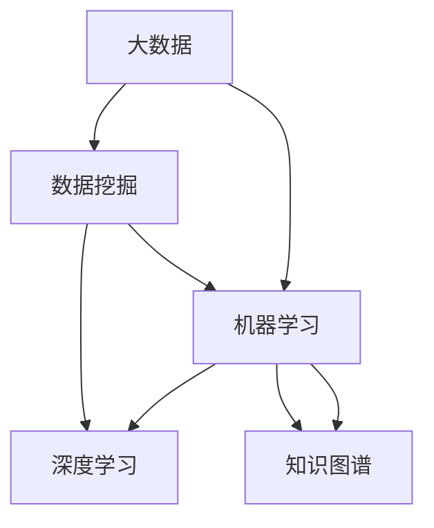

                 

# 大数据时代的知识发现：机遇与挑战

> 关键词：大数据, 数据挖掘, 知识图谱, 机器学习, 深度学习, 数据可视化

## 1. 背景介绍

### 1.1 问题由来
随着互联网和物联网技术的飞速发展，人类社会产生了海量数据。从传统的互联网搜索到复杂的社交网络，从智能家居到自动驾驶汽车，数据无处不在。如何从这些庞大的数据中挖掘出有价值的知识，成为一个重要的问题。大数据技术的发展为这个问题提供了新的解决方案，通过数据挖掘、机器学习、深度学习等手段，可以从大数据中发现隐藏的规律和模式，从而指导人类社会各个方面的决策。

### 1.2 问题核心关键点
大数据时代的知识发现主要包括三个方面：数据挖掘、机器学习和深度学习。其中，数据挖掘是从原始数据中提取有用信息的过程；机器学习和深度学习则通过训练模型来预测和分类数据，从而实现更高级别的知识发现。

## 2. 核心概念与联系

### 2.1 核心概念概述

为更好地理解大数据时代知识发现的方法，本节将介绍几个密切相关的核心概念：

- **大数据**：指的是数据量规模巨大、数据来源复杂、数据类型多样的数据集合。
- **数据挖掘**：是从大规模数据集中提取有用信息和知识的过程，包括分类、聚类、关联规则挖掘等方法。
- **机器学习**：是利用数据和模型训练出能够自主学习和决策的系统。
- **深度学习**：是机器学习的一种，通过多层神经网络实现更加复杂的数据表示和分析。
- **知识图谱**：是将大规模数据转化为结构化的知识库，以便更高效地查询和应用。

这些核心概念之间的逻辑关系可以通过以下Mermaid流程图来展示：



这个流程图展示了大数据时代知识发现的核心概念及其之间的关系：

1. 大数据是数据挖掘、机器学习和深度学习的基础。
2. 数据挖掘是直接从大数据中提取有用信息的过程。
3. 机器学习和深度学习则是通过训练模型，从数据中学习出更加复杂的知识和规律。
4. 知识图谱是将数据转化为结构化知识库的重要手段。

这些概念共同构成了大数据时代知识发现的框架，使得可以从海量数据中提取出有价值的知识，指导人类社会的各个方面。

## 3. 核心算法原理 & 具体操作步骤
### 3.1 算法原理概述

大数据时代知识发现的流程通常包括以下几个关键步骤：

1. **数据预处理**：包括数据清洗、数据集成、数据转换等，目的是为后续分析提供高质量的数据。
2. **特征工程**：通过特征选择、特征提取等手段，提取数据中的有用特征，构建有效的特征向量。
3. **模型训练**：利用训练数据，训练机器学习或深度学习模型，学习数据中的规律和模式。
4. **模型评估**：通过验证数据集或测试数据集，评估模型的性能和泛化能力。
5. **模型应用**：将训练好的模型应用到实际问题中，进行预测、分类、聚类等任务。

### 3.2 算法步骤详解

以下是具体的算法步骤详解：

**Step 1: 数据预处理**

数据预处理是知识发现的重要环节，旨在提高数据质量和可用性。以下是常见的数据预处理步骤：

- **数据清洗**：去除数据中的噪声和错误，如缺失值、异常值等。
- **数据集成**：将不同来源的数据进行整合，消除冗余和矛盾。
- **数据转换**：将原始数据转换为更加适合分析的形式，如归一化、标准化等。

**Step 2: 特征工程**

特征工程是知识发现的关键步骤，通过特征选择和特征提取，构建有效的特征向量。以下是常见的特征工程方法：

- **特征选择**：从原始特征中选择最相关、最具有代表性的特征，去除冗余和无关特征。
- **特征提取**：从原始数据中提取新的特征，如词袋模型、TF-IDF等。
- **特征构造**：根据领域知识，构造新的特征，如时间窗口、滑动窗口等。

**Step 3: 模型训练**

模型训练是知识发现的中心环节，通过训练机器学习或深度学习模型，学习数据中的规律和模式。以下是常见的模型训练方法：

- **监督学习**：利用有标签的数据，训练分类、回归等模型。
- **无监督学习**：利用无标签的数据，训练聚类、关联规则等模型。
- **半监督学习**：利用部分有标签和部分无标签的数据，训练半监督模型。
- **深度学习**：利用多层神经网络，学习数据中的复杂规律和特征。

**Step 4: 模型评估**

模型评估是知识发现的重要步骤，通过评估模型性能，确保其具备良好的泛化能力。以下是常见的模型评估方法：

- **交叉验证**：通过多次拆分数据集，进行交叉验证，评估模型的泛化能力。
- **ROC曲线**：绘制ROC曲线，评估二分类模型的性能。
- **混淆矩阵**：计算混淆矩阵，评估分类模型的准确率、召回率、F1值等指标。
- **AUC值**：计算AUC值，评估模型的分类性能。

**Step 5: 模型应用**

模型应用是将训练好的模型应用于实际问题的过程。以下是常见的模型应用方法：

- **预测**：利用训练好的模型进行预测，如股票价格预测、客户流失预测等。
- **分类**：利用训练好的模型进行分类，如垃圾邮件分类、产品分类等。
- **聚类**：利用训练好的模型进行聚类，如市场细分、客户分群等。

### 3.3 算法优缺点

大数据时代知识发现的方法具有以下优点：

- **高效性**：能够处理大规模数据，从海量数据中提取出有价值的知识。
- **自动化**：通过机器学习或深度学习模型，自动进行特征选择、特征提取和模型训练。
- **可扩展性**：能够处理多种类型的数据，包括结构化数据和非结构化数据。

同时，这些方法也存在一些缺点：

- **数据依赖性强**：知识发现的性能很大程度上依赖于数据的质量和数量。
- **模型复杂度高**：训练复杂的机器学习或深度学习模型需要大量计算资源和时间。
- **可解释性差**：机器学习或深度学习模型通常具有"黑盒"性质，难以解释其内部工作机制。

尽管存在这些局限性，但总体而言，大数据时代知识发现的方法在大规模数据处理和复杂问题解决方面具有显著优势。

### 3.4 算法应用领域

大数据时代知识发现的方法广泛应用于多个领域，以下是几个典型应用场景：

- **金融行业**：利用大数据和机器学习，进行风险控制、欺诈检测、信用评估等。
- **医疗行业**：利用大数据和深度学习，进行疾病预测、基因分析、药物研发等。
- **零售行业**：利用大数据和机器学习，进行客户细分、销售预测、推荐系统等。
- **智能交通**：利用大数据和深度学习，进行交通流量预测、路线优化、自动驾驶等。
- **智能制造**：利用大数据和机器学习，进行设备故障预测、生产优化、供应链管理等。

此外，大数据时代知识发现的方法也在科学研究、社交网络分析、环境监测等多个领域得到广泛应用，为人类社会的各个方面带来了深刻变革。

## 4. 数学模型和公式 & 详细讲解  
### 4.1 数学模型构建

本节将使用数学语言对大数据时代知识发现的方法进行更加严格的刻画。

设大数据集合为 $\mathcal{D}$，其中每个样本 $x_i$ 包含 $n$ 个特征 $f_1, f_2, \cdots, f_n$。假设任务 $T$ 为分类任务，给定训练集 $\mathcal{D}^{\text{train}}=\{(x_i, y_i)\}_{i=1}^N$，其中 $y_i \in \{0, 1\}$ 为标签。

定义模型 $M_{\theta}$ 在输入 $x_i$ 上的输出为 $M_{\theta}(x_i)$，其中 $\theta$ 为模型参数。假设模型的损失函数为 $\ell(M_{\theta}(x_i), y_i)$，则在训练集上的经验风险为：

$$
\mathcal{L}(\theta) = \frac{1}{N} \sum_{i=1}^N \ell(M_{\theta}(x_i), y_i)
$$

模型训练的目标是最小化经验风险，即找到最优参数：

$$
\theta^* = \mathop{\arg\min}_{\theta} \mathcal{L}(\theta)
$$

在实践中，我们通常使用基于梯度的优化算法（如SGD、Adam等）来近似求解上述最优化问题。设 $\eta$ 为学习率，则参数的更新公式为：

$$
\theta \leftarrow \theta - \eta \nabla_{\theta}\mathcal{L}(\theta)
$$

其中 $\nabla_{\theta}\mathcal{L}(\theta)$ 为损失函数对参数 $\theta$ 的梯度，可通过反向传播算法高效计算。

### 4.2 公式推导过程

以下我们以二分类任务为例，推导分类模型的损失函数及其梯度的计算公式。

假设模型 $M_{\theta}$ 在输入 $x_i$ 上的输出为 $M_{\theta}(x_i) \in [0,1]$，表示样本属于正类的概率。真实标签 $y_i \in \{0,1\}$。则二分类交叉熵损失函数定义为：

$$
\ell(M_{\theta}(x_i),y_i) = -[y_i\log M_{\theta}(x_i) + (1-y_i)\log (1-M_{\theta}(x_i))]
$$

将其代入经验风险公式，得：

$$
\mathcal{L}(\theta) = -\frac{1}{N}\sum_{i=1}^N [y_i\log M_{\theta}(x_i)+(1-y_i)\log(1-M_{\theta}(x_i))]
$$

根据链式法则，损失函数对参数 $\theta_k$ 的梯度为：

$$
\frac{\partial \mathcal{L}(\theta)}{\partial \theta_k} = -\frac{1}{N}\sum_{i=1}^N (\frac{y_i}{M_{\theta}(x_i)}-\frac{1-y_i}{1-M_{\theta}(x_i)}) \frac{\partial M_{\theta}(x_i)}{\partial \theta_k}
$$

其中 $\frac{\partial M_{\theta}(x_i)}{\partial \theta_k}$ 可进一步递归展开，利用自动微分技术完成计算。

## 5. 项目实践：代码实例和详细解释说明
### 5.1 开发环境搭建

在进行知识发现实践前，我们需要准备好开发环境。以下是使用Python进行Scikit-learn开发的环境配置流程：

1. 安装Anaconda：从官网下载并安装Anaconda，用于创建独立的Python环境。

2. 创建并激活虚拟环境：
```bash
conda create -n sklearn-env python=3.8 
conda activate sklearn-env
```

3. 安装Scikit-learn：
```bash
conda install scikit-learn
```

4. 安装其他依赖包：
```bash
pip install numpy pandas matplotlib seaborn jupyter notebook ipython
```

完成上述步骤后，即可在`sklearn-env`环境中开始知识发现实践。

### 5.2 源代码详细实现

下面我们以分类任务为例，给出使用Scikit-learn进行知识发现的Python代码实现。

首先，定义数据处理函数：

```python
from sklearn.model_selection import train_test_split
from sklearn.metrics import accuracy_score

def load_data(file_path):
    data = pd.read_csv(file_path)
    X = data.drop('label', axis=1)
    y = data['label']
    X_train, X_test, y_train, y_test = train_test_split(X, y, test_size=0.2, random_state=42)
    return X_train, X_test, y_train, y_test

X_train, X_test, y_train, y_test = load_data('data.csv')
```

然后，定义模型和训练函数：

```python
from sklearn.ensemble import RandomForestClassifier
from sklearn.metrics import accuracy_score
from sklearn.model_selection import train_test_split

def train_model(X_train, y_train, X_test, y_test):
    clf = RandomForestClassifier(n_estimators=100, random_state=42)
    clf.fit(X_train, y_train)
    y_pred = clf.predict(X_test)
    accuracy = accuracy_score(y_test, y_pred)
    print(f'Accuracy: {accuracy:.2f}')
```

接着，启动训练流程并在测试集上评估：

```python
train_model(X_train, y_train, X_test, y_test)
```

以上就是使用Scikit-learn进行分类任务知识发现的完整代码实现。可以看到，Scikit-learn的封装使得知识发现过程变得简洁高效。开发者可以将更多精力放在数据处理、模型改进等高层逻辑上，而不必过多关注底层的实现细节。

当然，工业级的系统实现还需考虑更多因素，如模型的保存和部署、超参数的自动搜索、更灵活的任务适配层等。但核心的知识发现范式基本与此类似。

## 6. 实际应用场景
### 6.1 智能推荐系统

基于知识发现的推荐系统可以广泛应用于电商、视频、音乐等多个领域。传统推荐系统通常只依赖用户历史行为数据，难以捕捉用户的多样化需求。利用知识发现技术，可以从用户画像、物品属性等多个维度挖掘出更深层次的关联关系，从而提供更精准、个性化的推荐。

在技术实现上，可以收集用户浏览、点击、评论、分享等行为数据，提取和物品相关的特征，如商品属性、用户评分等。利用训练好的模型，从多个维度的数据中挖掘出用户与物品的关联关系，生成推荐列表。由于知识发现技术能够更好地捕捉用户的深层次需求，因此推荐系统推荐的物品更加符合用户的实际需求。

### 6.2 金融风控

金融行业需要实时监测和分析客户的信用风险，避免因客户违约带来的损失。传统的信用评估方法依赖于人工评分和经验，难以应对大规模数据带来的挑战。利用知识发现技术，可以从客户的历史交易记录、行为数据等多个维度挖掘出客户的信用特征，构建更加全面、准确的信用评估模型。

具体而言，可以收集客户的交易记录、信用卡使用情况、还款记录等数据，提取时间序列、消费行为、还款情况等特征。利用训练好的模型，从这些数据中挖掘出客户的信用特征，构建信用评分模型。利用该模型，可以实时监测客户的信用风险，提前预警潜在风险，避免因客户违约带来的损失。

### 6.3 医疗诊断

医疗行业需要从海量的医疗数据中挖掘出有价值的知识，辅助医生进行诊断和治疗决策。传统的医疗诊断依赖于医生的经验和专业知识，难以应对复杂、多变的病情。利用知识发现技术，可以从电子病历、实验室数据、影像数据等多个维度挖掘出疾病的特征，构建更加全面、准确的诊断模型。

具体而言，可以收集患者的电子病历、实验室数据、影像数据等数据，提取时间序列、临床指标、影像特征等特征。利用训练好的模型，从这些数据中挖掘出疾病的特征，构建诊断模型。利用该模型，可以对患者的病情进行快速、准确的诊断，辅助医生进行治疗决策。

### 6.4 未来应用展望

随着知识发现技术的不断发展，其在各个领域的应用前景将更加广阔。

在智慧城市领域，知识发现技术可以应用于城市交通管理、环境监测、公共安全等多个环节，提高城市的智能化和安全性。在智能制造领域，知识发现技术可以应用于设备预测性维护、生产优化、供应链管理等多个环节，提高生产效率和经济效益。在社会治理领域，知识发现技术可以应用于公共安全事件预测、舆情分析、社会稳定监测等多个环节，提高政府决策的科学性和有效性。

此外，知识发现技术也在科学研究、金融行业、医疗行业等多个领域得到广泛应用，为各个行业带来了深刻变革。未来，随着知识发现技术的不断进步，其在各个领域的应用将更加广泛，为人类社会的各个方面带来更加深远的影响。

## 7. 工具和资源推荐
### 7.1 学习资源推荐

为了帮助开发者系统掌握知识发现的技术基础和实践技巧，这里推荐一些优质的学习资源：

1. 《机器学习实战》书籍：讲解了机器学习的基本概念和实践技巧，适合初学者快速上手。
2. 《Python机器学习》书籍：介绍了Python在机器学习中的应用，适合有一定编程基础的读者。
3. 《深度学习》课程：由Coursera开设，讲解了深度学习的基本原理和应用场景，适合深度学习初学者。
4. 《数据科学导论》课程：由edX开设，讲解了数据科学的基本概念和方法，适合数据科学初学者。
5. 《自然语言处理综述》论文：由斯坦福大学开设的NLP综述课，讲解了NLP的最新进展和应用场景，适合NLP研究人员。

通过对这些资源的学习实践，相信你一定能够快速掌握知识发现技术的精髓，并用于解决实际的NLP问题。

### 7.2 开发工具推荐

高效的开发离不开优秀的工具支持。以下是几款用于知识发现开发的常用工具：

1. Scikit-learn：Python的机器学习库，提供了丰富的算法和工具，适合进行机器学习模型的开发。
2. TensorFlow：由Google主导开发的深度学习框架，生产部署方便，适合大规模工程应用。
3. PyTorch：Facebook主导的深度学习框架，灵活动态，适合研究型应用。
4. Weights & Biases：模型训练的实验跟踪工具，可以记录和可视化模型训练过程中的各项指标，方便对比和调优。
5. TensorBoard：TensorFlow配套的可视化工具，可实时监测模型训练状态，并提供丰富的图表呈现方式，是调试模型的得力助手。

合理利用这些工具，可以显著提升知识发现任务的开发效率，加快创新迭代的步伐。

### 7.3 相关论文推荐

知识发现技术的不断发展源于学界的持续研究。以下是几篇奠基性的相关论文，推荐阅读：

1. "A Tutorial on Statistical Learning Theory"：由Vapnik和Vapnik-Chervonenkis提出，奠定了统计学习理论的基础。
2. "Introduction to Statistical Learning"：由Gareth James等人编写，全面介绍了统计学习的原理和应用。
3. "Pattern Recognition and Machine Learning"：由Christopher Bishop编写，讲解了机器学习的基本原理和算法。
4. "Deep Learning"：由Ian Goodfellow等人编写，全面介绍了深度学习的原理和应用。
5. "Knowledge Discovery in Databases"：由Peter Boncz等人编写，讲解了知识发现的原理和应用。

这些论文代表了大数据时代知识发现技术的发展脉络。通过学习这些前沿成果，可以帮助研究者把握学科前进方向，激发更多的创新灵感。

## 8. 总结：未来发展趋势与挑战
### 8.1 总结

本文对大数据时代知识发现的方法进行了全面系统的介绍。首先阐述了知识发现技术的背景和意义，明确了知识发现技术在数据驱动决策中的重要价值。其次，从原理到实践，详细讲解了知识发现的数学原理和关键步骤，给出了知识发现任务开发的完整代码实例。同时，本文还广泛探讨了知识发现技术在金融、医疗、智能推荐等多个领域的应用前景，展示了知识发现技术的巨大潜力。

通过本文的系统梳理，可以看到，知识发现技术在大规模数据处理和复杂问题解决方面具有显著优势。未来，伴随大数据技术和机器学习、深度学习等方法的发展，知识发现技术将更加强大，能够从更多维度挖掘出数据的价值，为人类社会的各个方面带来深刻变革。

### 8.2 未来发展趋势

展望未来，知识发现技术将呈现以下几个发展趋势：

1. **自动化和智能化**：未来的知识发现技术将更加自动化和智能化，能够自动进行数据清洗、特征选择、模型训练等，减少人工干预。
2. **跨领域应用**：知识发现技术将在更多领域得到应用，如医疗、金融、智能制造等，为各个行业带来深远影响。
3. **实时性和交互性**：未来的知识发现技术将具备实时性和交互性，能够实时处理和分析数据，提供更及时、互动的用户体验。
4. **多模态融合**：未来的知识发现技术将融合多模态数据，如文本、图像、声音等，实现更加全面的数据分析和挖掘。
5. **可解释性和透明度**：未来的知识发现技术将更加注重可解释性和透明度，能够提供更加清晰、可解释的决策过程。

这些趋势凸显了知识发现技术的广阔前景。这些方向的探索发展，必将进一步提升知识发现技术的能力，为人类社会的各个方面带来更加深远的影响。

### 8.3 面临的挑战

尽管知识发现技术已经取得了显著进展，但在迈向更加智能化、普适化应用的过程中，它仍面临着诸多挑战：

1. **数据质量问题**：知识发现的性能很大程度上依赖于数据的质量和数量，低质量的数据可能引入噪音和偏差，影响模型的性能。
2. **计算资源消耗大**：知识发现技术需要处理大规模数据，训练复杂的机器学习或深度学习模型，需要大量的计算资源和时间。
3. **模型复杂度高**：知识发现模型的复杂度较高，难以解释其内部工作机制和决策逻辑，难以进行理解和调试。
4. **多领域跨学科挑战**：知识发现技术在不同领域的应用，需要结合领域知识进行数据选择和特征提取，具有较高的跨学科挑战。
5. **隐私和安全问题**：知识发现技术需要处理大量敏感数据，需要考虑数据隐私和安全问题，避免数据泄露和滥用。

尽管存在这些挑战，但随着知识发现技术的不断发展和完善，其前景仍然非常广阔。未来，知识发现技术将在更多领域得到应用，为人类社会的各个方面带来更加深远的影响。

### 8.4 研究展望

未来的知识发现技术需要在以下几个方面寻求新的突破：

1. **数据融合与多模态学习**：将多模态数据融合，构建更加全面的知识图谱，提高知识发现的能力。
2. **因果推理与解释性**：引入因果推理方法，提高知识发现模型的可解释性和透明度，增强其可信度。
3. **跨领域应用与迁移学习**：结合领域知识，构建跨领域的知识发现模型，提升知识发现模型的泛化能力。
4. **实时性与交互性**：引入实时数据流处理和交互式可视化技术，提高知识发现系统的实时性和用户体验。
5. **隐私保护与安全**：研究数据隐私保护和数据安全技术，保护数据隐私和安全性。

这些研究方向将进一步推动知识发现技术的进步，为人类社会的各个方面带来更加深远的影响。相信随着学界和产业界的共同努力，知识发现技术将不断突破，为人类的数据驱动决策提供更加强大的支持。

## 9. 附录：常见问题与解答

**Q1：知识发现技术是否适用于所有领域？**

A: 知识发现技术在大数据时代具有广泛的应用前景，但在某些特定领域的应用需要结合领域知识进行数据选择和特征提取。例如，在金融领域，需要结合金融知识和经济学理论，才能从金融数据中挖掘出有价值的知识；在医疗领域，需要结合医学知识和疾病机理，才能从医疗数据中挖掘出有价值的知识。因此，知识发现技术适用于大多数领域，但需要结合领域知识进行优化。

**Q2：知识发现技术在模型训练中需要注意哪些问题？**

A: 知识发现技术在模型训练中需要注意以下问题：

1. 数据预处理：需要进行数据清洗、数据集成、数据转换等，确保数据质量和可用性。
2. 特征工程：需要进行特征选择、特征提取、特征构造等，构建有效的特征向量。
3. 模型选择：需要根据任务类型选择合适的算法，如分类、回归、聚类等。
4. 模型调参：需要选择合适的超参数，如学习率、正则化系数、迭代轮数等，优化模型性能。
5. 模型评估：需要使用合适的评估指标，如准确率、召回率、F1值等，评估模型性能和泛化能力。

**Q3：知识发现技术在实际应用中需要注意哪些问题？**

A: 知识发现技术在实际应用中需要注意以下问题：

1. 数据隐私：需要保护数据隐私，避免数据泄露和滥用。
2. 数据安全：需要确保数据安全，防止数据篡改和攻击。
3. 模型可解释性：需要提高模型可解释性，使其决策过程透明，便于理解和调试。
4. 实时性和交互性：需要实现实时性和交互性，提高系统的响应速度和用户体验。
5. 模型性能：需要确保模型性能，避免模型过拟合和欠拟合。

**Q4：知识发现技术在未来有哪些潜在的突破点？**

A: 知识发现技术在未来有以下潜在的突破点：

1. 数据融合与多模态学习：将多模态数据融合，构建更加全面的知识图谱，提高知识发现的能力。
2. 因果推理与解释性：引入因果推理方法，提高知识发现模型的可解释性和透明度，增强其可信度。
3. 跨领域应用与迁移学习：结合领域知识，构建跨领域的知识发现模型，提升知识发现模型的泛化能力。
4. 实时性与交互性：引入实时数据流处理和交互式可视化技术，提高知识发现系统的实时性和用户体验。
5. 隐私保护与安全：研究数据隐私保护和数据安全技术，保护数据隐私和安全性。

这些研究方向将进一步推动知识发现技术的进步，为人类的数据驱动决策提供更加强大的支持。

