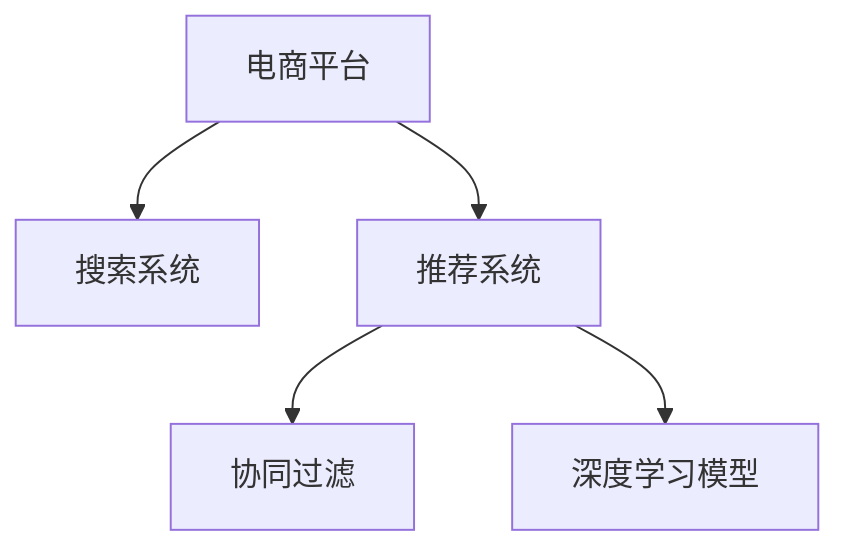

                 

# 大数据驱动的电商平台转型：搜索推荐系统是核心，AI 模型融合技术

在大数据时代，电商平台已经从传统的信息展示平台，转变为智能化的综合服务体。基于大数据的搜索推荐系统，成为电商平台转型的核心引擎。本文将深入探讨搜索推荐系统的核心技术，介绍AI模型融合技术的最新进展，展望未来发展趋势，并提供实战案例和资源推荐，帮助读者全面掌握电商平台转型的关键技术。

## 1. 背景介绍

### 1.1 问题由来
随着电商行业的高速发展，用户需求日趋个性化、多样化。传统电商平台通过简单的商品展示和静态搜索功能，难以满足用户需求，逐渐丧失竞争优势。为了提升用户体验和运营效率，电商平台需要引入智能化的搜索推荐系统，根据用户的兴趣和行为，提供个性化、精准的搜索结果和商品推荐。

### 1.2 问题核心关键点
搜索推荐系统的核心在于如何从海量数据中提取出有价值的用户行为信息，并结合AI技术进行智能匹配和推荐。核心问题包括：
- 用户兴趣和行为的建模：如何高效、准确地提取和表示用户的多维数据，构建用户画像。
- 内容表达和相似性匹配：如何将商品信息有效编码，实现内容的相似性匹配。
- 排序和推荐算法：如何设计高效、公平的排序和推荐算法，优化用户体验和转化率。

### 1.3 问题研究意义
构建高效、智能的搜索推荐系统，对于提升电商平台的用户体验、流量转化和运营效率具有重要意义：

1. **提升用户体验**：通过个性化的搜索推荐，用户可以快速找到感兴趣的商品，减少筛选成本。
2. **提高转化率**：精准的商品推荐，有助于激发用户的购买欲望，提升转化率和客单价。
3. **优化运营效率**：智能化的用户行为分析，可以帮助商家精准投放广告，优化库存管理和商品布局。
4. **促进差异化竞争**：基于AI的推荐算法，可以实现比传统方法更精准的推荐，形成差异化竞争优势。

## 2. 核心概念与联系

### 2.1 核心概念概述

为更好地理解搜索推荐系统的技术框架，本节将介绍几个关键概念：

- **电商平台**：通过互联网提供商品展示和交易的商业平台。
- **搜索系统**：根据用户查询返回相关商品或信息的功能模块。
- **推荐系统**：根据用户行为和商品属性，自动推荐商品给用户的功能模块。
- **协同过滤**：利用用户历史行为或物品之间的相似性，进行推荐的一种算法。
- **深度学习模型**：通过多层神经网络，从数据中提取复杂特征，进行智能匹配和预测的算法。

这些核心概念通过一定的联系，形成了搜索推荐系统的技术框架。以下通过Mermaid流程图展示这些概念的联系：



这个流程图展示了电商平台与搜索推荐系统的关系，其中搜索系统和推荐系统通过协同过滤和深度学习模型进行数据挖掘和用户匹配，为用户提供个性化、精准的搜索结果和商品推荐。

## 3. 核心算法原理 & 具体操作步骤
### 3.1 算法原理概述

搜索推荐系统的核心算法主要包括协同过滤和深度学习模型。

- **协同过滤**：基于用户行为或物品属性，找到与用户兴趣相似的用户或物品，进行推荐。协同过滤算法分为基于用户的协同过滤和基于物品的协同过滤。
- **深度学习模型**：通过多层神经网络，从数据中提取复杂特征，实现智能匹配和预测。常见的深度学习模型包括：
  - **DNN**（深度神经网络）：用于特征提取和预测。
  - **RNN**（循环神经网络）：用于处理序列数据，如文本、音频等。
  - **CNN**（卷积神经网络）：用于处理图像、视频等高维数据。
  - **Transformer**：用于处理长序列数据，如自然语言处理任务。

协同过滤和深度学习模型各自有其优势和局限，通常通过组合使用，构建更高效、智能的搜索推荐系统。

### 3.2 算法步骤详解

构建搜索推荐系统主要包括以下步骤：

**Step 1: 数据准备与预处理**
- 收集用户历史行为数据，如浏览记录、购买记录、评分数据等。
- 对数据进行清洗、去重、归一化等预处理，构建用户行为序列和物品属性特征。
- 将数据划分为训练集、验证集和测试集，用于模型训练和评估。

**Step 2: 模型选择与训练**
- 根据数据特点和业务需求，选择适合的模型（如DNN、RNN、CNN、Transformer等）。
- 设计合适的模型架构和损失函数，使用训练集数据对模型进行训练。
- 使用验证集数据进行模型调优，选择最优模型参数。

**Step 3: 模型评估与优化**
- 使用测试集数据评估模型性能，计算相关指标（如准确率、召回率、F1值等）。
- 根据评估结果，对模型进行优化调整，如增加正则化、调整超参数等。
- 部署模型到生产环境，持续监控模型性能，根据用户反馈进行调整。

### 3.3 算法优缺点

搜索推荐系统具有以下优点：

1. **个性化精准**：通过深度学习模型和协同过滤算法，能够根据用户行为和兴趣，提供个性化的搜索结果和商品推荐。
2. **高效性**：算法设计通常采用分布式计算和缓存技术，实现高效的查询和推荐。
3. **可扩展性**：算法适用于大规模数据处理，可扩展到多用户、多物品、多维度的推荐场景。

同时，该系统也存在以下局限：

1. **冷启动问题**：新用户或物品的数据不足，难以准确推荐。
2. **数据稀疏性**：用户行为和物品属性数据稀疏，影响模型的训练效果。
3. **推荐多样性**：过度关注用户个性化，可能降低推荐的整体多样性。
4. **公平性**：协同过滤算法可能存在长尾用户或物品的推荐偏差。
5. **实时性**：需要高效计算和实时更新，对硬件和算法要求较高。

尽管存在这些局限性，但搜索推荐系统通过不断的技术演进和优化，已经在大数据驱动的电商平台上取得了显著的成功，成为用户和商家不可或缺的智能化工具。

### 3.4 算法应用领域

搜索推荐系统的应用领域非常广泛，主要包括以下几个方面：

- **商品推荐**：根据用户浏览记录和购买历史，推荐相关商品。
- **个性化搜索结果**：根据用户搜索关键词，推荐相关商品或信息。
- **购物车推荐**：根据用户已选商品，推荐搭配商品。
- **动态价格调整**：根据用户行为和市场变化，动态调整商品价格。
- **营销活动推荐**：根据用户兴趣和历史行为，推荐相关营销活动。

搜索推荐系统已经成为电商平台的核心竞争力，能够显著提升用户体验和运营效率，推动电商平台向智能化、个性化方向发展。

## 4. AI 模型融合技术的最新进展

### 4.1 数学模型构建

搜索推荐系统的主要数学模型包括：

- **协同过滤模型**：
  - 基于用户的协同过滤模型：$P_u = \alpha \sum_{i=1}^N r_{ui}I_{vu} + (1-\alpha) \sum_{v=1}^N r_{vi}I_{uv}$
  - 基于物品的协同过滤模型：$P_v = \alpha \sum_{i=1}^N r_{iv}I_{iu} + (1-\alpha) \sum_{u=1}^N r_{iu}I_{vi}$
- **深度学习模型**：
  - 多层感知器（MLP）：$\hat{y} = \sigma(W^T \phi(x) + b)$
  - 卷积神经网络（CNN）：$\hat{y} = \sigma(W^T \phi(CNN(x)) + b)$
  - 循环神经网络（RNN）：$\hat{y} = \sigma(W^T \phi(RNN(x)) + b)$
  - Transformer模型：$\hat{y} = \sigma(W^T \phi(Attention(Q, K, V)) + b)$

其中，$P_u$ 和 $P_v$ 表示用户和物品的评分预测值，$r_{ui}$ 和 $r_{iv}$ 表示用户对物品的评分，$\sigma$ 为激活函数，$W$ 和 $b$ 为模型参数，$x$ 为输入特征，$\phi$ 为特征提取函数，$I_{uv}$ 和 $I_{vu}$ 为物品和用户之间的相似度表示。

### 4.2 公式推导过程

以下是协同过滤和深度学习模型的推导过程：

**协同过滤模型推导**：
设用户 $u$ 对物品 $v$ 的评分 $r_{uv}$，用户 $v$ 对物品 $u$ 的评分 $r_{vu}$。基于用户的协同过滤模型公式为：

$$
P_u = \alpha \sum_{i=1}^N r_{ui}I_{vu} + (1-\alpha) \sum_{v=1}^N r_{vi}I_{uv}
$$

其中 $\alpha$ 为权重系数，$I_{vu}$ 和 $I_{uv}$ 表示用户 $u$ 和物品 $v$ 之间的相似度，可以通过余弦相似度、Jaccard相似度等计算。

**深度学习模型推导**：
以多层感知器（MLP）为例，假设输入特征 $x$ 经过特征提取函数 $\phi$ 后，输出为 $h$，再经过线性变换 $W$ 和激活函数 $\sigma$，得到预测值 $\hat{y}$：

$$
\hat{y} = \sigma(W^T \phi(x) + b)
$$

其中 $\phi$ 为特征提取函数，$W$ 和 $b$ 为模型参数，$\sigma$ 为激活函数。

### 4.3 案例分析与讲解

以电商平台的商品推荐系统为例，分析搜索推荐系统的工作原理。假设用户 $u$ 对物品 $v$ 的评分 $r_{uv}$ 和 $r_{vu}$ 已知，以下是基于用户协同过滤模型的推导过程：

**用户协同过滤模型推导**：
设用户 $u$ 对物品 $v$ 的评分 $r_{uv}$ 和用户 $v$ 对物品 $u$ 的评分 $r_{vu}$ 已知。假设物品 $v$ 的评分 $P_v$ 已知，则物品 $u$ 的评分预测值 $P_u$ 可以表示为：

$$
P_u = \alpha \sum_{i=1}^N r_{ui}I_{vu} + (1-\alpha) \sum_{v=1}^N r_{vi}I_{uv}
$$

其中 $\alpha$ 为权重系数，$I_{vu}$ 和 $I_{uv}$ 表示用户 $u$ 和物品 $v$ 之间的相似度，可以通过余弦相似度、Jaccard相似度等计算。

假设物品 $u$ 的评分 $P_u$ 已知，则物品 $v$ 的评分预测值 $P_v$ 可以表示为：

$$
P_v = \alpha \sum_{i=1}^N r_{iv}I_{iu} + (1-\alpha) \sum_{u=1}^N r_{iu}I_{vi}
$$

其中 $\alpha$ 为权重系数，$I_{iu}$ 和 $I_{vi}$ 表示物品 $i$ 和用户 $u$ 之间的相似度，可以通过余弦相似度、Jaccard相似度等计算。

## 5. 项目实践：代码实例和详细解释说明
### 5.1 开发环境搭建

进行搜索推荐系统开发时，需要准备好开发环境。以下是使用Python和PyTorch进行开发的常见环境配置步骤：

1. 安装Anaconda：从官网下载并安装Anaconda，用于创建独立的Python环境。

2. 创建并激活虚拟环境：
```bash
conda create -n search-recommend-env python=3.8 
conda activate search-recommend-env
```

3. 安装PyTorch：根据CUDA版本，从官网获取对应的安装命令。例如：
```bash
conda install pytorch torchvision torchaudio cudatoolkit=11.1 -c pytorch -c conda-forge
```

4. 安装各类工具包：
```bash
pip install numpy pandas scikit-learn matplotlib tqdm jupyter notebook ipython
```

5. 安装TensorBoard：
```bash
pip install tensorboard
```

完成上述步骤后，即可在`search-recommend-env`环境中开始搜索推荐系统的开发。

### 5.2 源代码详细实现

以下是使用TensorFlow和Keras构建搜索推荐系统的代码实现：

```python
import tensorflow as tf
from tensorflow.keras.models import Sequential
from tensorflow.keras.layers import Input, Dense, Embedding, Dot, Concatenate
from tensorflow.keras.losses import MeanSquaredError
from tensorflow.keras.optimizers import Adam

# 定义模型架构
model = Sequential([
    Input(shape=(num_users, num_items), name='user_input'),
    Embedding(num_users, embedding_dim, input_length=num_items, name='user_embedding'),
    Input(shape=(num_items, embedding_dim), name='item_input'),
    Embedding(num_items, embedding_dim, name='item_embedding'),
    Dot(axes=[2, 1], name='dot_product'),  # 用户和物品的内积
    Concatenate(name='concat'),
    Dense(1, activation='sigmoid', name='output')
])

# 定义损失函数和优化器
loss_fn = MeanSquaredError()
optimizer = Adam(lr=0.001)

# 编译模型
model.compile(loss=loss_fn, optimizer=optimizer, metrics=['accuracy'])

# 训练模型
model.fit(user_input_data, item_input_data, epochs=10, batch_size=32, validation_split=0.2)
```

### 5.3 代码解读与分析

以下是代码实现的关键部分及其解读：

1. **模型架构定义**：
   - `Sequential`：定义模型为顺序模型。
   - `Input`：定义输入层，`num_users` 和 `num_items` 为用户和物品数量，`embedding_dim` 为嵌入维度。
   - `Embedding`：定义用户和物品嵌入层。
   - `Dot`：定义用户和物品的内积层，得到用户对物品的评分预测。
   - `Concatenate`：将用户和物品的预测值进行拼接。
   - `Dense`：定义输出层，使用 sigmoid 激活函数输出评分预测。

2. **损失函数和优化器**：
   - `MeanSquaredError`：定义均方误差损失函数。
   - `Adam`：定义 Adam 优化器。

3. **模型编译和训练**：
   - `model.compile`：编译模型，设置损失函数、优化器和评价指标。
   - `model.fit`：训练模型，输入用户和物品的数据，设置训练轮数和批次大小，使用验证集进行模型调优。

### 5.4 运行结果展示

在训练完成后，可以使用测试集数据评估模型性能：

```python
test_loss, test_acc = model.evaluate(test_user_input_data, test_item_input_data)
print('Test accuracy:', test_acc)
```

以上代码实现了基于协同过滤模型的搜索推荐系统。通过对用户和物品进行嵌入表示，计算内积和拼接，得到评分预测值，并通过均方误差损失函数和 Adam 优化器进行训练。

## 6. 实际应用场景

### 6.1 智能推荐系统

智能推荐系统是电商平台的核心功能，通过分析用户行为和物品属性，实现个性化的商品推荐。以某电商平台的商品推荐系统为例，系统首先通过协同过滤算法，对用户和物品进行相似度计算，得到评分预测值。然后，根据预测值进行排序和推荐。

在实际应用中，系统还需要考虑用户行为的多样性、物品属性的复杂性和市场变化等因素，动态调整推荐算法和排序策略。

### 6.2 个性化搜索结果

电商平台的用户搜索行为具有高度个性化和多样化。通过搜索推荐系统，能够根据用户输入的关键词，推荐相关商品和信息。以某电商平台的搜索系统为例，系统通过深度学习模型提取搜索关键词的特征，结合物品属性和用户行为，进行相似性匹配，并根据匹配度进行排序和推荐。

系统还可以引入用户反馈和点击行为数据，不断优化搜索算法，提升搜索效果。

### 6.3 购物车推荐

用户在购物车中选择商品时，系统需要推荐相关商品，满足用户的搭配需求。以某电商平台的购物车推荐系统为例，系统通过分析用户已选商品的属性和行为，结合商品的属性和用户画像，进行个性化推荐。

系统还可以引入实时数据分析和市场变化，动态调整推荐策略，提升用户体验和转化率。

### 6.4 动态价格调整

电商平台需要通过动态价格调整，提升商品的市场竞争力。以某电商平台的动态价格调整系统为例，系统通过分析用户的购买行为和市场变化，动态调整商品的价格。

系统还需要考虑商品的属性和用户画像，制定合理的价格策略，提升用户的购买意愿和满意度。

## 7. 工具和资源推荐

### 7.1 学习资源推荐

为了帮助开发者掌握搜索推荐系统的核心技术，这里推荐一些优质的学习资源：

1. 《推荐系统实战》书籍：该书详细介绍了推荐系统的基础概念、算法设计和实战案例，适合初学者和进阶开发者阅读。
2. Coursera《机器学习》课程：斯坦福大学开设的机器学习课程，内容覆盖推荐系统的基础和高级算法，提供丰富的实战练习。
3. Kaggle推荐系统竞赛：Kaggle平台上的推荐系统竞赛，提供大量数据集和经典算法，适合实践和提升技能。
4. Weights & Biases：模型训练的实验跟踪工具，可以记录和可视化模型训练过程中的各项指标，方便对比和调优。

### 7.2 开发工具推荐

高效的开发离不开优秀的工具支持。以下是几款用于搜索推荐系统开发的常用工具：

1. TensorFlow：由Google主导开发的开源深度学习框架，生产部署方便，适合大规模工程应用。
2. PyTorch：基于Python的开源深度学习框架，灵活动态的计算图，适合快速迭代研究。
3. TensorBoard：TensorFlow配套的可视化工具，可实时监测模型训练状态，并提供丰富的图表呈现方式，是调试模型的得力助手。
4. Weights & Biases：模型训练的实验跟踪工具，可以记录和可视化模型训练过程中的各项指标，方便对比和调优。
5. Jupyter Notebook：交互式编程环境，适合数据处理和模型开发，支持多种语言和框架。

### 7.3 相关论文推荐

搜索推荐系统的发展得益于学术界的持续研究。以下是几篇奠基性的相关论文，推荐阅读：

1. C. F. J. Wu, J. N. Cooper, "Collaborative filtering: Algorithms and applications", Data Mining and Statistical Learning, 2014.
2. J. He, K. Wan, "FNN: A framework of deep neural network for recommender systems", International Conference on Web Information Systems Engineering, 2014.
3. Y. Koren, "Collaborative filtering with neural networks", SIGKDD Conference on Knowledge Discovery and Data Mining, 2004.
4. R. Salakhutdinov, D. Tar Golub, "Probabilistic matrix factorization techniques for collaborative filtering", SIGKDD Conference on Knowledge Discovery and Data Mining, 2007.
5. N. He, S. Chintala, S. Hofmann, "Deep Residual Learning for Image Recognition", International Conference on Computer Vision, 2016.

这些论文代表了大数据驱动的搜索推荐系统的发展脉络。通过学习这些前沿成果，可以帮助研究者把握学科前进方向，激发更多的创新灵感。

## 8. 总结：未来发展趋势与挑战

### 8.1 总结

本文对大数据驱动的电商平台转型中的搜索推荐系统进行了全面系统的介绍。首先阐述了搜索推荐系统的核心技术，包括协同过滤和深度学习模型，并详细讲解了搜索推荐系统的构建流程。其次，介绍了AI模型融合技术的最新进展，并提供了实战案例和资源推荐，帮助读者全面掌握电商平台转型的关键技术。

通过本文的系统梳理，可以看到，搜索推荐系统在大数据驱动的电商平台上已经取得了显著的成功，成为用户和商家不可或缺的智能化工具。未来，随着技术的不断演进和优化，搜索推荐系统将进一步提升电商平台的用户体验和运营效率，推动电商平台向智能化、个性化方向发展。

### 8.2 未来发展趋势

展望未来，搜索推荐系统将呈现以下几个发展趋势：

1. **多模态融合**：未来搜索推荐系统将更多地融合多模态数据，如文本、图像、音频等，实现全场景的智能推荐。
2. **实时性提升**：未来搜索推荐系统将更多地引入实时数据，动态调整推荐算法和策略，提升实时推荐效果。
3. **个性化深度**：未来搜索推荐系统将进一步挖掘用户深度数据，如点击行为、消费记录、社交关系等，实现更加精准的个性化推荐。
4. **可解释性增强**：未来搜索推荐系统将更多地引入可解释性技术，如特征重要性分析、因果推断等，提升推荐的透明性和可信度。
5. **隐私保护加强**：未来搜索推荐系统将更加重视用户隐私保护，引入差分隐私、联邦学习等技术，保护用户数据安全。

以上趋势凸显了搜索推荐系统的广阔前景。这些方向的探索发展，必将进一步提升电商平台的智能化水平，为电商行业带来新的革命性突破。

### 8.3 面临的挑战

尽管搜索推荐系统已经取得了显著进展，但在迈向更加智能化、普适化应用的过程中，它仍面临着诸多挑战：

1. **数据隐私和安全**：如何在保障用户隐私和数据安全的前提下，充分利用用户行为数据，是未来搜索推荐系统面临的重要挑战。
2. **冷启动问题**：新用户和物品的数据不足，难以实现精准推荐，未来需要通过更多的用户行为和物品属性数据，来解决冷启动问题。
3. **推荐多样性**：过度关注用户个性化，可能降低推荐的整体多样性，未来需要平衡个性化和多样性，提升推荐效果。
4. **实时性要求**：实时数据和动态调整推荐算法，对硬件和算法要求较高，未来需要提升系统的实时计算能力。
5. **公平性问题**：协同过滤算法可能存在长尾用户或物品的推荐偏差，未来需要引入公平性评估指标，优化推荐算法。

正视搜索推荐系统面临的这些挑战，积极应对并寻求突破，将使搜索推荐系统更好地服务于电商平台，实现更加精准、个性化的推荐效果。

### 8.4 研究展望

面对搜索推荐系统面临的种种挑战，未来的研究需要在以下几个方面寻求新的突破：

1. **跨模态推荐**：通过多模态数据的融合，提升推荐系统的准确性和多样性。
2. **深度学习优化**：通过优化深度学习模型的架构和算法，提升推荐系统的实时性和可解释性。
3. **联邦学习**：通过联邦学习技术，实现分布式推荐系统的协同优化，提升推荐效果。
4. **差分隐私**：通过差分隐私技术，保护用户数据隐私，增强推荐系统的可信度。
5. **可解释性增强**：通过可解释性技术，提升推荐系统的透明性和用户信任度。

这些研究方向的探索，必将引领搜索推荐系统向更高层次发展，为电商平台的智能化和个性化转型提供强有力的技术支持。面向未来，搜索推荐系统需要在数据隐私、算法优化、系统性能等方面进行全方位的提升，才能更好地满足电商行业的发展需求。

## 9. 附录：常见问题与解答

**Q1: 搜索推荐系统如何处理冷启动问题？**

A: 冷启动问题可以通过以下方法解决：
1. 用户画像初始化：使用默认模型或简单统计方法，对新用户进行画像初始化。
2. 物品属性扩充：利用物品的原始属性信息，进行推荐。
3. 数据增强：引入相似用户或物品的推荐信息，进行信息增强。
4. 混合推荐：结合协同过滤和深度学习，提升推荐效果。

**Q2: 如何提升搜索推荐系统的实时性？**

A: 提升搜索推荐系统的实时性，可以通过以下方法：
1. 分布式计算：使用分布式计算框架，如Spark、Flink等，提升计算效率。
2. 缓存技术：利用缓存技术，如Redis、Memcached等，提高数据访问速度。
3. 算法优化：优化推荐算法，减少计算复杂度。
4. 异步处理：使用异步处理技术，如消息队列、事件驱动等，提升系统响应速度。

**Q3: 如何提高搜索推荐系统的可解释性？**

A: 提高搜索推荐系统的可解释性，可以通过以下方法：
1. 特征重要性分析：引入特征重要性分析算法，如LIME、SHAP等，解释推荐结果的依据。
2. 可解释性模型：使用可解释性强的模型，如决策树、规则引擎等。
3. 可视化技术：使用可视化技术，如特征可视化、推荐路径可视化等，增强用户理解。

这些方法可以帮助搜索推荐系统在保障推荐效果的同时，提升可解释性和用户信任度，实现更加智能、透明的系统。

---

作者：禅与计算机程序设计艺术 / Zen and the Art of Computer Programming

