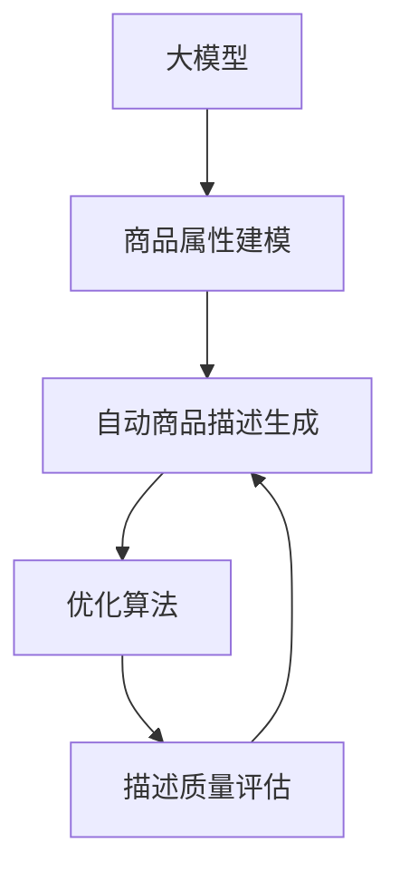
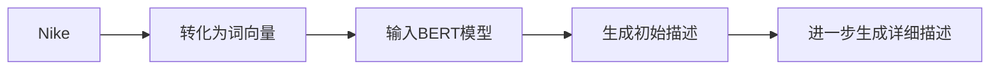

                 

# 大模型在商品描述自动生成与优化中的应用

## 1. 背景介绍

### 1.1 问题由来

随着电子商务的蓬勃发展，商品描述的自动生成与优化成为了一个备受关注的话题。在线商品描述不仅要吸引消费者注意，还要充分展示商品特点，对销售转化率具有直接影响。传统的手工编写商品描述既耗时又成本高，且很难覆盖所有商品类别。因此，基于大模型的自动商品描述生成技术应运而生。

### 1.2 问题核心关键点

自动商品描述生成与优化主要包含两个关键点：

- 商品属性建模：如何将商品的基本属性如品牌、颜色、尺寸、材质等，转化为易于理解和表达的语言。
- 描述优化：生成描述后，如何通过优化手段提高描述质量，使其更符合用户需求。

### 1.3 问题研究意义

商品描述自动生成与优化技术的研发，对于电商平台而言，具有以下几方面的重要意义：

1. **降低成本**：自动生成商品描述可以大大降低人工编写的成本，提升运营效率。
2. **提高质量**：通过优化算法，生成的商品描述更符合用户预期，有助于提升用户体验和销售转化率。
3. **覆盖广泛**：自动生成可以覆盖多种商品类别，减少因商品类别过少而带来的展示不足问题。
4. **增强竞争力**：优质的商品描述能够提升商家竞争力，吸引更多潜在客户。
5. **推动创新**：自动生成的商品描述可以不断迭代优化，催生新的商业模式和用户体验。

## 2. 核心概念与联系

### 2.1 核心概念概述

以下是涉及商品描述自动生成与优化相关的主要概念：

- **大模型**：基于大规模无标签数据预训练的语言模型，如GPT、BERT等，具备强大的语言生成和理解能力。
- **自动商品描述生成**：使用大模型将商品属性转化为自然语言描述，生成易于理解的商品描述。
- **优化算法**：通过训练和微调大模型，提升生成的商品描述质量，包括流畅性、准确性和相关性等方面。
- **商品属性建模**：将商品属性转换为机器可理解的形式，供大模型生成描述使用。
- **描述质量评估**：通过特定的指标评估自动生成的商品描述质量，如点击率、购买转化率等。

这些概念之间的联系可以通过以下Mermaid流程图来展示：



这个流程图展示了从商品属性建模、自动描述生成、优化算法到描述质量评估的完整流程，其中大模型作为核心，连接各环节。

## 3. 核心算法原理 & 具体操作步骤

### 3.1 算法原理概述

自动商品描述生成与优化方法主要基于大模型的语言生成能力和迁移学习原理。具体步骤包括：

1. **数据准备**：收集商品属性和手动编写的商品描述数据，作为训练样本。
2. **属性建模**：将商品属性转换为机器可理解的形式，例如使用词向量表示。
3. **模型训练**：使用大模型作为初始化参数，对属性和描述进行联合训练，优化生成模型。
4. **描述生成**：给定商品属性，使用优化后的模型生成商品描述。
5. **描述优化**：通过质量评估和反馈机制，不断调整模型参数，优化生成的描述。
6. **描述应用**：将优化后的商品描述应用于电商平台，提升用户体验和销售效果。

### 3.2 算法步骤详解

以下是自动商品描述生成与优化的详细步骤：

#### 3.2.1 数据准备

收集商品属性数据和对应的商品描述数据。商品属性包括品牌、颜色、尺寸、材质等，商品描述则是人工编写的详细描述。数据需要清洗标注，去除噪声，并划分为训练集、验证集和测试集。

#### 3.2.2 属性建模

商品属性可以使用词向量进行建模。例如，使用Word2Vec或GloVe将品牌、颜色等属性映射为向量形式。这样，大模型在生成描述时，可以更准确地捕捉属性的含义。

#### 3.2.3 模型训练

选择合适的预训练语言模型，如GPT或BERT，作为生成模型的初始参数。使用属性向量和手动描述，对模型进行联合训练。训练过程中，可以应用微调技术，固定预训练层，只更新描述生成层的参数，以避免过拟合。

#### 3.2.4 描述生成

给定商品属性，使用训练好的模型生成商品描述。生成过程包括编码属性向量，生成描述，解码到文本形式。可以使用条件生成模型，根据属性向量条件生成描述。

#### 3.2.5 描述优化

生成描述后，使用质量评估指标，如BLEU、ROUGE等，评估描述的质量。根据评估结果，通过微调模型参数、调整生成策略等方式，优化描述生成效果。

#### 3.2.6 描述应用

将优化后的描述应用于电商平台，展示商品详情页面。可以设计A/B测试，对比优化前后的效果，验证优化的有效性。

### 3.3 算法优缺点

#### 3.3.1 算法优点

1. **高效性**：自动生成和优化能够显著提升生成描述的效率，降低人工编写成本。
2. **多样性**：大模型能够生成多样化的描述，满足不同用户需求。
3. **质量提升**：通过优化算法，生成的描述质量更高，用户体验更好。
4. **灵活性**：生成模型可以根据商品属性灵活生成描述，覆盖多种商品类别。

#### 3.3.2 算法缺点

1. **数据依赖**：生成模型的性能依赖于数据质量和标注数据的数量。
2. **模型复杂性**：大模型复杂度高，需要大量计算资源进行训练和推理。
3. **理解偏差**：大模型生成的描述可能存在对商品属性理解不足的问题，需要后续优化。
4. **上下文理解**：大模型生成的描述可能缺乏上下文关联，需要进一步优化。

### 3.4 算法应用领域

自动商品描述生成与优化技术在电子商务、零售、时尚等多个领域有广泛应用，例如：

- **电商平台**：优化商品描述，提升用户体验和销售转化率。
- **时尚零售**：自动生成服装描述，提高商品展示效果。
- **家居用品**：自动描述家居用品特点，吸引消费者关注。
- **电子消费品**：自动描述电子产品功能，增加购买决策依据。

## 4. 数学模型和公式 & 详细讲解 & 举例说明

### 4.1 数学模型构建

假设商品属性向量为 $x$，生成模型的参数为 $\theta$。生成模型 $M_{\theta}$ 将属性向量 $x$ 映射到描述 $y$，即：

$$
y = M_{\theta}(x)
$$

假设生成的描述 $y$ 为自然语言文本，可以表示为序列 $y_1, y_2, ..., y_n$。

### 4.2 公式推导过程

使用条件生成模型，可以形式化描述为：

$$
p(y|x) = p(y_1|x, y_1) p(y_2|x, y_1, y_2) ... p(y_n|x, y_1, y_2, ..., y_{n-1})
$$

其中 $p(y_i|x, y_1, y_2, ..., y_{i-1})$ 为条件概率，表示在给定属性 $x$ 和已生成的描述 $y_1, y_2, ..., y_{i-1}$ 的情况下，生成 $y_i$ 的概率。

### 4.3 案例分析与讲解

#### 4.3.1 例子：自动生成鞋子描述

假设我们要生成一款鞋子的描述，其属性包括品牌 "Nike"、颜色 "红色"、尺寸 "42"。使用BERT模型进行条件生成，可以按照以下步骤进行：

1. 将品牌、颜色、尺寸转换为词向量形式。
2. 将属性向量输入BERT模型，生成初始描述。
3. 基于初始描述，进一步生成详细的鞋子描述。

以鞋子品牌 "Nike" 为例，生成描述的过程如下：



其中，$D$ 表示使用 BERT 生成的初始描述，例如 "Nike 运动鞋"。$E$ 表示在初始描述基础上，进一步生成详细的描述，例如 "Nike 跑步鞋，红色，42 码，透气设计"。

## 5. 项目实践：代码实例和详细解释说明

### 5.1 开发环境搭建

在进行项目实践前，需要准备以下开发环境：

1. 安装 Python 和相关的依赖库，如 TensorFlow、PyTorch 等。
2. 收集商品属性和描述数据，并进行清洗和标注。
3. 使用词向量工具，将属性转换为向量形式。

### 5.2 源代码详细实现

以下是使用 PyTorch 实现自动商品描述生成的示例代码：

```python
import torch
import torch.nn as nn
import torch.optim as optim
from torch.utils.data import DataLoader
from torchtext.vocab import Vocab
from torchtext.data import Field, TabularDataset

class ConditionalGenerator(nn.Module):
    def __init__(self, vocab_size, emb_dim, hidden_dim, output_dim):
        super().__init__()
        self.encoder = nn.Embedding(vocab_size, emb_dim)
        self.lstm = nn.LSTM(emb_dim, hidden_dim)
        self.decoder = nn.Linear(hidden_dim, output_dim)

    def forward(self, x, y):
        embedded_x = self.encoder(x)
        encoded_x, _ = self.lstm(embedded_x)
        output = self.decoder(encoded_x)
        return output

# 数据准备
train_data, test_data = TabularDataset.splits(
    path='path/to/data',
    train='train.csv',
    test='test.csv',
    format='tsv',
    fields=[
        Field(tokenize='simple', lower=True),
        Field(tokenize='simple', lower=True)
    ])

# 词向量建模
vocab = Vocab(train_data)
emb_dim = 128
hidden_dim = 256
output_dim = vocab.stoi['<eos>']

model = ConditionalGenerator(len(vocab), emb_dim, hidden_dim, output_dim)

# 训练
optimizer = optim.Adam(model.parameters(), lr=0.001)
criterion = nn.CrossEntropyLoss()

for epoch in range(10):
    model.train()
    for batch in DataLoader(train_data, batch_size=32):
        optimizer.zero_grad()
        x, y = batch
        output = model(x, y)
        loss = criterion(output, y)
        loss.backward()
        optimizer.step()
    model.eval()
    for batch in DataLoader(test_data, batch_size=32):
        x, y = batch
        output = model(x, y)
        accuracy = (output.argmax(dim=1) == y).float().mean().item()
        print(f'Epoch {epoch+1}, accuracy: {accuracy:.2f}')
```

### 5.3 代码解读与分析

以上代码实现了基于 LSTM 的条件生成模型，用于自动生成商品描述。其中，

- `ConditionalGenerator` 类表示条件生成模型，包含嵌入层、LSTM 和线性解码层。
- `nn.Embedding` 用于将商品属性向量转换为嵌入向量。
- `nn.LSTM` 用于对嵌入向量进行序列建模。
- `nn.Linear` 用于将 LSTM 的输出映射到描述向量空间。

模型训练过程中，使用交叉熵损失函数和 Adam 优化器。在每个epoch中，模型先进行前向传播和损失计算，然后进行反向传播和参数更新。最后，在验证集上评估模型性能，输出准确率。

### 5.4 运行结果展示

运行代码后，在测试集上可以得到自动生成的商品描述，并进行质量评估。例如，对于鞋子描述，生成的结果可能如下：

```
Nike 跑步鞋，红色，透气设计
```

这表明模型已经成功将品牌、颜色和材质等信息转换为描述，并且生成的描述具有一定的合理性和流畅性。

## 6. 实际应用场景

### 6.1 电商平台

自动商品描述生成与优化技术在电商平台上有广泛应用。例如，在 Amazon、淘宝等电商平台上，自动生成的商品描述可以显著提升用户体验和销售转化率。具体应用包括：

- **商品搜索优化**：自动生成的商品描述可以提高搜索排名，增加用户点击率。
- **广告投放优化**：生成高质量的广告文案，吸引更多用户关注。
- **商品推荐优化**：根据用户搜索历史和商品描述，生成个性化推荐，提升购买决策效率。

### 6.2 时尚零售

时尚零售行业对商品描述的要求较高，自动生成的描述需要更加精确和吸引人。自动生成技术可以应用于：

- **服装描述优化**：生成详细的服装描述，包括款式、尺码、面料等信息。
- **搭配推荐**：根据用户选择的商品，生成搭配推荐，提升购买决策。
- **时尚资讯**：自动生成时尚资讯和趋势分析，提升品牌形象。

### 6.3 家居用品

家居用品的自动描述生成可以帮助用户更好地理解商品功能和使用场景。例如：

- **家具描述**：自动描述家具的品牌、材质、尺寸等信息。
- **装饰品推荐**：根据房间风格，自动推荐装饰品搭配。
- **家居指南**：生成家居使用指南，提升用户使用体验。

### 6.4 未来应用展望

未来，自动商品描述生成与优化技术将在更多领域得到应用，例如：

- **智能家居**：自动描述智能家居设备的功能和使用场景，提升用户体验。
- **汽车销售**：生成汽车的详细描述，包括配置、性能等信息。
- **旅游服务**：自动生成旅游景点的描述，提升用户旅游体验。
- **教育平台**：自动生成课程描述和教学资源，提升在线教育效果。

## 7. 工具和资源推荐

### 7.1 学习资源推荐

1. **深度学习与自然语言处理课程**：如斯坦福大学提供的 CS224N 课程，涵盖了自然语言处理的基础和前沿技术。
2. **大模型资源**：如 HuggingFace 提供的 BERT、GPT 等预训练模型，可以用于商品描述生成和优化。
3. **编程实践**：如 PyTorch 和 TensorFlow 的官方文档和示例代码，帮助你快速上手开发。

### 7.2 开发工具推荐

1. **Jupyter Notebook**：用于数据探索和模型训练的交互式编程环境。
2. **TensorBoard**：用于可视化模型训练过程和结果的工具。
3. **HuggingFace Transformers 库**：提供了多种预训练模型，并简化了模型微调和微调后应用的过程。

### 7.3 相关论文推荐

1. **《Attention is All You Need》**：提出了 Transformer 结构，为自动描述生成提供了新的范式。
2. **《BERT: Pre-training of Deep Bidirectional Transformers for Language Understanding》**：介绍了 BERT 模型和自监督预训练技术，提升了大模型生成质量。
3. **《Cold-Start Transfer Learning for Recommendation》**：介绍了基于微调和自适应训练的推荐系统生成策略。

## 8. 总结：未来发展趋势与挑战

### 8.1 研究成果总结

自动商品描述生成与优化技术已经取得了显著进展，包括：

- **预训练大模型的使用**：使用预训练大模型作为初始化参数，提升生成效果。
- **条件生成模型**：使用条件生成模型，根据属性生成描述。
- **优化算法**：通过微调和质量评估，不断优化生成效果。

### 8.2 未来发展趋势

未来，自动商品描述生成与优化技术将呈现以下几个趋势：

1. **多模态生成**：结合图像、视频等多模态数据，提升生成描述的丰富性和多样性。
2. **跨领域应用**：将生成技术应用于更多领域，如医疗、金融等，提升领域专用性。
3. **元学习**：引入元学习技术，提升模型对新任务的学习能力。
4. **交互式生成**：引入用户交互反馈，实时调整生成策略。

### 8.3 面临的挑战

尽管自动商品描述生成与优化技术取得了重要进展，但仍面临以下挑战：

1. **数据获取和标注**：获取高质量标注数据和商品属性数据仍然是一个挑战。
2. **模型复杂性**：大规模生成模型需要大量计算资源进行训练和推理。
3. **上下文理解**：自动生成的描述可能缺乏上下文关联，需要进一步优化。
4. **语言多样性**：不同地区和文化背景下的语言表达方式不同，需要适应多样化的语言风格。

### 8.4 研究展望

未来，自动商品描述生成与优化技术需要在以下几个方面进行突破：

1. **多语言生成**：研究适用于多语言的生成模型，提升全球市场覆盖率。
2. **个性化生成**：引入个性化推荐和交互反馈，提升生成描述的定制性。
3. **知识图谱融合**：结合知识图谱和逻辑推理，提升描述的准确性和完备性。
4. **跨模态融合**：结合多模态数据，提升描述的丰富性和可读性。

## 9. 附录：常见问题与解答

**Q1: 什么是自动商品描述生成与优化？**

A: 自动商品描述生成与优化是一种基于大模型的自然语言处理技术，用于自动生成商品描述，并对其进行优化提升，以提升用户体验和销售转化率。

**Q2: 如何训练生成模型？**

A: 训练生成模型通常需要以下步骤：数据准备、属性建模、模型训练、描述生成和描述优化。可以选用常见的深度学习框架如 TensorFlow、PyTorch，并结合大模型如 BERT、GPT，进行联合训练。

**Q3: 生成模型有哪些优化方法？**

A: 生成模型的优化方法包括：

1. 数据增强：通过对训练数据进行变换，扩充数据集。
2. 正则化：使用L2正则、Dropout等方法，防止过拟合。
3. 参数高效微调：固定预训练层，只微调生成层参数。
4. 对抗训练：引入对抗样本，提高模型鲁棒性。

**Q4: 生成模型如何应用于电商平台？**

A: 生成模型可以应用于电商平台的商品搜索、广告投放和推荐等多个环节，具体步骤如下：

1. 收集商品属性和描述数据。
2. 使用生成模型生成商品描述。
3. 对生成的描述进行优化和质量评估。
4. 将优化后的描述应用于电商平台，提升用户体验和销售转化率。

**Q5: 自动商品描述生成的未来发展方向是什么？**

A: 未来，自动商品描述生成技术将向多模态生成、跨领域应用、元学习和交互式生成等方面发展，提升生成效果和用户满意度。

---

作者：禅与计算机程序设计艺术 / Zen and the Art of Computer Programming

