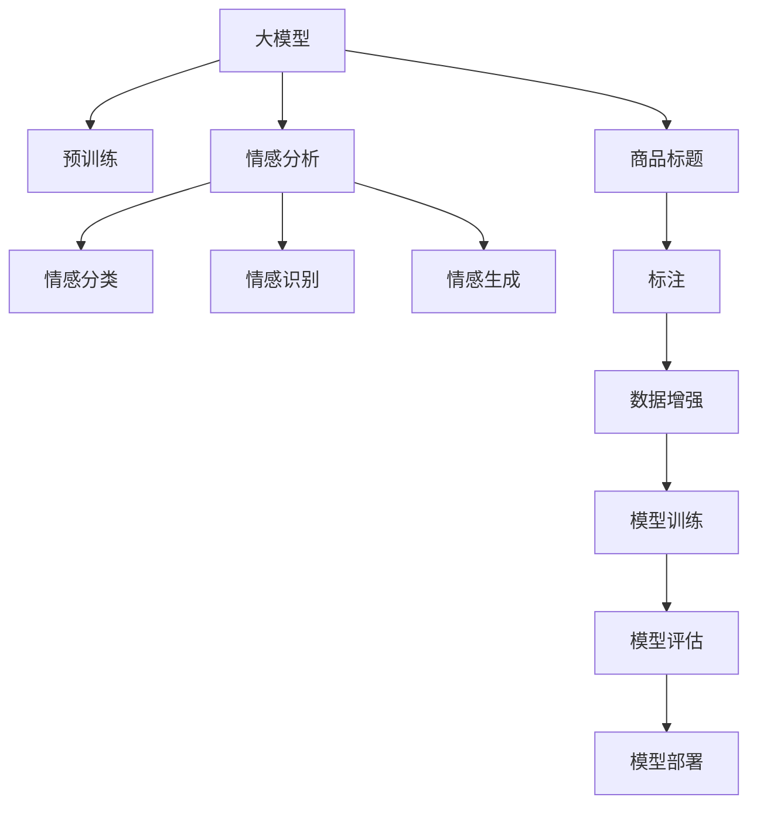

                 

# 大模型在商品标题情感倾向分析中的应用

> 关键词：大模型, 情感分析, 商品标题, 自然语言处理(NLP), 深度学习, Transformers, 情感分类, 产品推荐

## 1. 背景介绍

### 1.1 问题由来
随着电子商务的发展，商家在商品标题和描述中使用的语言越来越丰富，表达方式也更加多样。在电商平台上，用户往往会通过阅读商品标题来快速判断商品是否符合自己的需求。然而，大量的商品标题信息无法手动筛选，如何自动识别商品标题中的情感倾向，帮助用户快速做出购买决策，成为了电商平台和营销商家面临的重要问题。

情感分析（Sentiment Analysis）是一种自然语言处理（Natural Language Processing, NLP）技术，通过分析文本中的情感信息，将文本分为积极、消极或中性三种情感类别。在电商领域，通过情感分析可以评估用户对商品的态度，进而优化产品推荐系统，提升用户体验，增加销售额。

### 1.2 问题核心关键点
情感分析的核心在于从文本中识别出情感信息。主要挑战包括：
1. 文本数据的多样性和复杂性：商品标题语言风格多样，包含品牌、型号、价格等不同信息，增加了情感分析的难度。
2. 情感表达的细微差异：同一段文本中可能包含多种情感，如“性价比高”可能同时包含积极和满意情绪。
3. 动态语境的影响：用户情绪可能随时间和上下文变化，单一的情感模型难以捕捉到这种动态性。
4. 标注数据的稀缺性：优质的标注数据对于训练高质量情感分析模型至关重要，但收集和标注大量的商品标题数据非常耗时。

## 2. 核心概念与联系

### 2.1 核心概念概述

为了更好地理解情感分析在商品标题中的应用，本节将介绍几个关键概念及其联系：

- **大模型**：如BERT、GPT-3等，通过大规模无标签数据预训练得到的语言模型，具备强大的文本处理能力。
- **情感分析**：NLP领域中的一种任务，旨在分析文本的情感倾向。
- **商品标题**：电商平台中商品的名称和描述，包含丰富的信息，包括商品特点、价格、品牌等。
- **自然语言处理（NLP）**：涉及文本数据的处理、分析和生成的一系列技术，包括分词、词性标注、句法分析、语义理解等。
- **深度学习**：一种基于神经网络的机器学习范式，能够从数据中自动提取特征，实现复杂的模式识别和分类。
- **Transformer**：一种用于序列到序列学习的神经网络架构，广泛应用于语言模型和文本生成任务。
- **情感分类**：将文本分为积极、消极或中性情感类别的过程，通常采用分类器的形式实现。

这些概念之间的逻辑关系可以通过以下Mermaid流程图来展示：



这个流程图展示了大模型在商品标题情感分析中的应用路径：

1. 大模型通过预训练学习到丰富的语言知识。
2. 情感分析技术从商品标题中提取情感信息。
3. 情感分类将文本情感分为积极、消极或中性类别。
4. 情感识别确定文本中具体的情感类型。
5. 情感生成使用情感模型生成相应的情感文本。
6. 商品标题和标注数据作为训练集的输入，训练模型。
7. 训练好的模型用于评估和部署。

## 3. 核心算法原理 & 具体操作步骤
### 3.1 算法原理概述

基于大模型的情感分析方法，主要利用已经在大规模无标签文本数据上进行预训练的模型，通过微调等方式适应特定任务（如商品标题情感分析）的特征。该方法基于监督学习，通过在标注数据上训练分类器来识别文本的情感类别。

形式化地，假设预训练模型为 $M_{\theta}$，其中 $\theta$ 为预训练得到的模型参数。给定标注数据集 $D=\{(x_i,y_i)\}_{i=1}^N$，其中 $x_i$ 为商品标题，$y_i$ 为对应的情感标签（积极、消极、中性）。情感分析的目标是找到最优的模型参数 $\theta^*$，使得：

$$
\theta^* = \mathop{\arg\min}_{\theta} \mathcal{L}(M_{\theta},D)
$$

其中 $\mathcal{L}$ 为针对任务设计的损失函数，通常使用交叉熵损失。

### 3.2 算法步骤详解

基于大模型的情感分析主要包括以下几个关键步骤：

**Step 1: 数据准备**
- 收集商品标题数据，并手工标注情感类别。
- 对商品标题进行数据预处理，如去除停用词、进行词干提取等。

**Step 2: 模型选择与微调**
- 选择合适的预训练模型，如BERT、GPT-2等。
- 在商品标题数据集上微调模型，更新模型参数以适应商品标题的情感表达。

**Step 3: 模型评估**
- 使用验证集对微调后的模型进行评估，选择表现最优的模型。
- 对测试集进行情感分析，输出情感分类结果。

**Step 4: 结果应用**
- 将情感分析结果应用到产品推荐系统中，调整商品推荐策略。
- 为电商商家提供情感倾向报告，辅助决策。

### 3.3 算法优缺点

基于大模型的情感分析方法具有以下优点：
1. 效率高：利用预训练模型，不需要从头训练分类器，训练时间短。
2. 精度高：大模型具备强大的语言理解能力，情感分析精度高。
3. 适用性广：适用于各类自然语言文本的情感分析，包括商品标题、评论、新闻等。
4. 可扩展性强：可以方便地应用到新的任务上，只需新增标注数据即可。

同时，该方法也存在一些缺点：
1. 依赖标注数据：情感分析的精度很大程度上依赖于标注数据的质量和数量，标注数据收集成本高。
2. 过拟合风险：模型可能在训练集上过拟合，泛化性能不足。
3. 模型复杂度高：大模型的计算资源消耗大，推理速度慢。
4. 动态情感识别困难：动态语境下的情感分析仍是一个难点，需要进一步研究。

### 3.4 算法应用领域

基于大模型的情感分析方法在电商领域有着广泛的应用前景，具体包括：

- **产品推荐**：通过情感分析优化推荐算法，提高推荐的精准度。
- **用户画像**：分析用户的购买行为和评价，构建个性化用户画像。
- **广告投放**：根据广告内容情感倾向，调整投放策略，提升广告效果。
- **客户服务**：实时监测用户反馈，及时调整服务策略，提升用户体验。

## 4. 数学模型和公式 & 详细讲解 & 举例说明
### 4.1 数学模型构建

形式化地，情感分析的任务可以描述为如下二分类问题：给定商品标题 $x$，预测其情感类别 $y \in \{0, 1\}$，其中 $0$ 表示中性，$1$ 表示情感倾向。假设预训练模型为 $M_{\theta}$，其输入为商品标题文本 $x$，输出为情感分类概率 $p(y|x)$。则情感分类问题可以表示为最大化分类器预测概率与真实标签之间的KL散度：

$$
\theta^* = \mathop{\arg\min}_{\theta} -\sum_{i=1}^N y_i \log p(y_i|x_i)
$$

其中 $p(y_i|x_i)$ 为模型在商品标题 $x_i$ 上预测情感为 $y_i$ 的概率，$y_i$ 为真实标签。

### 4.2 公式推导过程

根据上述定义，我们定义分类器的输出为情感分类概率 $p(y|x)$，则分类器的损失函数可以表示为：

$$
\mathcal{L}(\theta) = -\frac{1}{N}\sum_{i=1}^N y_i \log p(y_i|x_i)
$$

利用梯度下降等优化算法求解上述最优化问题，即：

$$
\theta \leftarrow \theta - \eta \nabla_{\theta}\mathcal{L}(\theta)
$$

其中 $\eta$ 为学习率，$\nabla_{\theta}\mathcal{L}(\theta)$ 为损失函数对模型参数 $\theta$ 的梯度，可以通过反向传播算法计算。

### 4.3 案例分析与讲解

以商品标题“高效多功能厨房刀具套装”为例，假设我们使用BERT模型进行情感分析。我们将该商品标题输入到模型中，得到其情感分类概率 $p(y|x)$。假设模型预测该商品标题为积极情感（即 $y=1$），则损失函数可以表示为：

$$
\mathcal{L}(\theta) = -\log p(1|x) = \log(1-p(0|x))
$$

在训练过程中，我们通过反向传播算法计算梯度，更新模型参数，最小化损失函数。

## 5. 项目实践：代码实例和详细解释说明
### 5.1 开发环境搭建

在进行情感分析实践前，我们需要准备好开发环境。以下是使用Python进行PyTorch开发的环境配置流程：

1. 安装Anaconda：从官网下载并安装Anaconda，用于创建独立的Python环境。

2. 创建并激活虚拟环境：
```bash
conda create -n pytorch-env python=3.8 
conda activate pytorch-env
```

3. 安装PyTorch：根据CUDA版本，从官网获取对应的安装命令。例如：
```bash
conda install pytorch torchvision torchaudio cudatoolkit=11.1 -c pytorch -c conda-forge
```

4. 安装相关工具包：
```bash
pip install numpy pandas scikit-learn torchtext transformers
```

完成上述步骤后，即可在`pytorch-env`环境中开始情感分析实践。

### 5.2 源代码详细实现

下面我们以商品标题情感分析为例，给出使用Transformers库对BERT模型进行情感分析的PyTorch代码实现。

首先，定义情感分析任务的数据处理函数：

```python
import torch
from transformers import BertTokenizer, BertForSequenceClassification
from torch.utils.data import Dataset, DataLoader
from sklearn.metrics import accuracy_score

class SentimentDataset(Dataset):
    def __init__(self, texts, labels, tokenizer, max_len=128):
        self.texts = texts
        self.labels = labels
        self.tokenizer = tokenizer
        self.max_len = max_len
        
    def __len__(self):
        return len(self.texts)
    
    def __getitem__(self, item):
        text = self.texts[item]
        label = self.labels[item]
        
        encoding = self.tokenizer(text, return_tensors='pt', max_length=self.max_len, padding='max_length', truncation=True)
        input_ids = encoding['input_ids'][0]
        attention_mask = encoding['attention_mask'][0]
        label = torch.tensor([label], dtype=torch.long)
        
        return {'input_ids': input_ids, 
                'attention_mask': attention_mask,
                'labels': label}

# 定义标签与id的映射
label2id = {'positive': 1, 'neutral': 0, 'negative': 2}
id2label = {v: k for k, v in label2id.items()}

# 创建dataset
tokenizer = BertTokenizer.from_pretrained('bert-base-cased')

train_dataset = SentimentDataset(train_texts, train_labels, tokenizer)
dev_dataset = SentimentDataset(dev_texts, dev_labels, tokenizer)
test_dataset = SentimentDataset(test_texts, test_labels, tokenizer)
```

然后，定义模型和优化器：

```python
from transformers import AdamW

model = BertForSequenceClassification.from_pretrained('bert-base-cased', num_labels=len(label2id))

optimizer = AdamW(model.parameters(), lr=2e-5)
```

接着，定义训练和评估函数：

```python
from tqdm import tqdm

device = torch.device('cuda') if torch.cuda.is_available() else torch.device('cpu')
model.to(device)

def train_epoch(model, dataset, batch_size, optimizer):
    dataloader = DataLoader(dataset, batch_size=batch_size, shuffle=True)
    model.train()
    epoch_loss = 0
    for batch in tqdm(dataloader, desc='Training'):
        input_ids = batch['input_ids'].to(device)
        attention_mask = batch['attention_mask'].to(device)
        labels = batch['labels'].to(device)
        model.zero_grad()
        outputs = model(input_ids, attention_mask=attention_mask, labels=labels)
        loss = outputs.loss
        epoch_loss += loss.item()
        loss.backward()
        optimizer.step()
    return epoch_loss / len(dataloader)

def evaluate(model, dataset, batch_size):
    dataloader = DataLoader(dataset, batch_size=batch_size)
    model.eval()
    preds, labels = [], []
    with torch.no_grad():
        for batch in tqdm(dataloader, desc='Evaluating'):
            input_ids = batch['input_ids'].to(device)
            attention_mask = batch['attention_mask'].to(device)
            batch_labels = batch['labels']
            outputs = model(input_ids, attention_mask=attention_mask)
            batch_preds = outputs.logits.argmax(dim=1).to('cpu').tolist()
            batch_labels = batch_labels.to('cpu').tolist()
            for pred, label in zip(batch_preds, batch_labels):
                preds.append(pred)
                labels.append(label)
                
    print('Accuracy:', accuracy_score(labels, preds))
```

最后，启动训练流程并在测试集上评估：

```python
epochs = 5
batch_size = 16

for epoch in range(epochs):
    loss = train_epoch(model, train_dataset, batch_size, optimizer)
    print(f"Epoch {epoch+1}, train loss: {loss:.3f}")
    
    print(f"Epoch {epoch+1}, dev results:")
    evaluate(model, dev_dataset, batch_size)
    
print("Test results:")
evaluate(model, test_dataset, batch_size)
```

以上就是使用PyTorch对BERT进行商品标题情感分析的完整代码实现。可以看到，得益于Transformers库的强大封装，我们可以用相对简洁的代码完成BERT模型的加载和情感分析。

### 5.3 代码解读与分析

让我们再详细解读一下关键代码的实现细节：

**SentimentDataset类**：
- `__init__`方法：初始化文本、标签、分词器等关键组件，同时对文本进行分词和编码。
- `__len__`方法：返回数据集的样本数量。
- `__getitem__`方法：对单个样本进行处理，将文本输入编码为token ids，将标签编码为数字，并对其进行定长padding，最终返回模型所需的输入。

**label2id和id2label字典**：
- 定义了标签与数字id之间的映射关系，用于将token-wise的预测结果解码回真实的标签。

**训练和评估函数**：
- 使用PyTorch的DataLoader对数据集进行批次化加载，供模型训练和推理使用。
- 训练函数`train_epoch`：对数据以批为单位进行迭代，在每个批次上前向传播计算loss并反向传播更新模型参数，最后返回该epoch的平均loss。
- 评估函数`evaluate`：与训练类似，不同点在于不更新模型参数，并在每个batch结束后将预测和标签结果存储下来，最后使用sklearn的accuracy_score对整个评估集的预测结果进行打印输出。

**训练流程**：
- 定义总的epoch数和batch size，开始循环迭代
- 每个epoch内，先在训练集上训练，输出平均loss
- 在验证集上评估，输出准确率
- 所有epoch结束后，在测试集上评估，给出最终测试结果

可以看到，PyTorch配合Transformers库使得BERT情感分析的代码实现变得简洁高效。开发者可以将更多精力放在数据处理、模型改进等高层逻辑上，而不必过多关注底层的实现细节。

当然，工业级的系统实现还需考虑更多因素，如模型的保存和部署、超参数的自动搜索、更灵活的任务适配层等。但核心的情感分析范式基本与此类似。

## 6. 实际应用场景
### 6.1 电商平台应用

在电商平台中，商品标题情感分析有着广泛的应用场景。电商平台上商品数量众多，用户浏览商品时往往仅通过商品标题获取商品信息。情感分析能够帮助用户快速筛选商品，提高决策效率。

例如，电商平台可以根据用户对商品标题的情感反馈，动态调整商品排序策略。对于评价较高的商品，优先推荐给用户，提高商品曝光率。同时，通过情感分析，可以识别出有问题的商品，及时下架处理，保护用户权益。

### 6.2 广告投放优化

在广告投放过程中，广告文案的情感倾向对用户点击率有重要影响。通过情感分析，电商商家可以分析不同情感倾向的广告效果，优化广告投放策略。例如，对于积极情感的广告，可以扩大投放范围，增加曝光率；对于消极情感的广告，需要优化广告文案，提升用户满意度。

### 6.3 用户行为分析

电商商家可以通过情感分析了解用户对商品的态度，进而优化商品推荐和营销策略。例如，分析用户对商品的积极评价，可以识别出热销商品，进行重点推荐。同时，对于用户反馈的负面情感，及时处理，优化商品质量和服务。

### 6.4 未来应用展望

未来，随着深度学习和自然语言处理技术的进一步发展，情感分析技术将更加成熟，应用范围将进一步扩大。以下是一些可能的未来发展方向：

1. **多情感分类**：当前情感分析通常只能分为积极、消极、中性三类，未来可以考虑引入更细粒度的情感分类，如积极、中性、消极、混合情感等。
2. **情感生成**：通过情感分析，可以生成相应的情感文本，如将中性评论转化为积极评论，提高用户满意度。
3. **情感联动**：通过情感分析，可以发现不同商品之间的情感联动关系，优化商品组合推荐策略。
4. **情感驱动的个性化推荐**：通过情感分析，可以为不同情感倾向的用户提供个性化的产品推荐，提升用户体验。

总之，情感分析在电商领域的应用前景广阔，未来将随着技术的进步，为电商商家带来更多创新点。

## 7. 工具和资源推荐
### 7.1 学习资源推荐

为了帮助开发者系统掌握情感分析的理论基础和实践技巧，这里推荐一些优质的学习资源：

1. 《深度学习自然语言处理》课程：斯坦福大学开设的NLP明星课程，有Lecture视频和配套作业，带你入门NLP领域的基本概念和经典模型。

2. 《自然语言处理综述》书籍：全面介绍了NLP领域的各个方面，包括文本分类、情感分析、机器翻译等。

3. 《Transformer从原理到实践》系列博文：由大模型技术专家撰写，深入浅出地介绍了Transformer原理、BERT模型、情感分析等前沿话题。

4. HuggingFace官方文档：提供了大量的预训练模型和情感分析样例代码，是上手实践的必备资料。

5. 《NLP实战指南》书籍：实战性强，涵盖情感分析、文本生成、情感分类等NLP任务。

通过对这些资源的学习实践，相信你一定能够快速掌握情感分析的精髓，并用于解决实际的NLP问题。
###  7.2 开发工具推荐

高效的开发离不开优秀的工具支持。以下是几款用于情感分析开发的常用工具：

1. PyTorch：基于Python的开源深度学习框架，灵活动态的计算图，适合快速迭代研究。

2. TensorFlow：由Google主导开发的开源深度学习框架，生产部署方便，适合大规模工程应用。

3. Transformers库：HuggingFace开发的NLP工具库，集成了多个SOTA语言模型，支持PyTorch和TensorFlow，是进行情感分析开发的利器。

4. Weights & Biases：模型训练的实验跟踪工具，可以记录和可视化模型训练过程中的各项指标，方便对比和调优。

5. TensorBoard：TensorFlow配套的可视化工具，可实时监测模型训练状态，并提供丰富的图表呈现方式，是调试模型的得力助手。

6. Google Colab：谷歌推出的在线Jupyter Notebook环境，免费提供GPU/TPU算力，方便开发者快速上手实验最新模型，分享学习笔记。

合理利用这些工具，可以显著提升情感分析任务的开发效率，加快创新迭代的步伐。

### 7.3 相关论文推荐

情感分析技术的发展源于学界的持续研究。以下是几篇奠基性的相关论文，推荐阅读：

1. Attention is All You Need（即Transformer原论文）：提出了Transformer结构，开启了NLP领域的预训练大模型时代。

2. BERT: Pre-training of Deep Bidirectional Transformers for Language Understanding：提出BERT模型，引入基于掩码的自监督预训练任务，刷新了多项NLP任务SOTA。

3. Sentence-Level Sentiment Analysis via Weighted Sum of Embeddings: An Ensemble Approach：提出基于向量加权的情感分析方法，获得了较好的效果。

4. Multi-Aspect Sentiment Analysis with Deep Attention：提出多方面情感分析方法，考虑了多个方面的情感特征，提升了情感分类的准确率。

5. A Multi-Task Learning Approach for Sequence Labeling：提出多任务学习的情感分析方法，提升了情感分类的效果。

这些论文代表了大情感分析技术的发展脉络。通过学习这些前沿成果，可以帮助研究者把握学科前进方向，激发更多的创新灵感。

## 8. 总结：未来发展趋势与挑战
### 8.1 总结

本文对大模型在商品标题情感分析中的应用进行了全面系统的介绍。首先阐述了情感分析在电商领域的应用背景和重要性，明确了商品标题情感分析的核心挑战。其次，从原理到实践，详细讲解了基于大模型的情感分析数学模型和算法步骤，给出了情感分析任务开发的完整代码实例。同时，本文还广泛探讨了情感分析方法在电商平台、广告投放、用户行为分析等多个场景中的应用前景，展示了情感分析技术的巨大潜力。

通过本文的系统梳理，可以看到，基于大模型的情感分析方法正在成为电商领域的重要工具，极大地提升了用户决策效率和商家营销效果。未来，伴随情感分析技术的持续演进，相信在更多领域，情感分析都将发挥更加重要的作用。

### 8.2 未来发展趋势

展望未来，情感分析技术将呈现以下几个发展趋势：

1. **多模态情感分析**：将文本、语音、图像等多模态信息结合，进行综合情感分析，提升分析精度。
2. **动态情感分析**：考虑上下文变化，实时动态调整情感分类模型，适应不同情感状态。
3. **情感生成与演化**：通过情感分析，生成相应的情感文本，并预测情感演化趋势。
4. **跨领域情感分析**：将情感分析应用于不同领域，如医疗、金融、教育等，拓展应用场景。
5. **情感驱动的个性化推荐**：通过情感分析，为不同情感倾向的用户提供个性化的产品推荐，提升用户体验。
6. **情感数据生成**：利用预训练模型生成伪标注数据，提升训练样本的多样性和数量。

以上趋势凸显了情感分析技术的广阔前景。这些方向的探索发展，必将进一步提升情感分析系统的性能和应用范围，为电商商家带来更多创新点。

### 8.3 面临的挑战

尽管情感分析技术已经取得了一定进展，但在迈向更加智能化、普适化应用的过程中，它仍面临着诸多挑战：

1. **标注数据依赖**：情感分析的精度很大程度上依赖于标注数据的质量和数量，标注数据收集和标注成本高。
2. **多情感识别困难**：同一段文本中可能包含多种情感，多情感识别仍是一个难点。
3. **动态情感识别困难**：用户情感可能随时间和上下文变化，单一的情感模型难以捕捉到这种动态性。
4. **模型泛化性能不足**：模型可能在新数据上表现不佳，泛化性能不足。
5. **模型计算资源消耗大**：大规模预训练模型的计算资源消耗大，推理速度慢。

### 8.4 研究展望

面对情感分析面临的这些挑战，未来的研究需要在以下几个方面寻求新的突破：

1. **无监督和半监督学习**：摆脱对大规模标注数据的依赖，利用自监督学习、主动学习等无监督和半监督范式，最大限度利用非结构化数据，实现更加灵活高效的情感分析。
2. **多情感识别技术**：开发多情感识别算法，考虑同一段文本中可能包含多种情感，提升情感分析精度。
3. **动态情感分析方法**：引入动态情感分析模型，考虑上下文变化，实时动态调整情感分类模型，适应不同情感状态。
4. **情感生成技术**：利用情感分析，生成相应的情感文本，提高用户满意度。
5. **多模态情感分析方法**：将文本、语音、图像等多模态信息结合，进行综合情感分析，提升分析精度。

这些研究方向的探索，必将引领情感分析技术迈向更高的台阶，为构建安全、可靠、可解释、可控的智能系统铺平道路。面向未来，情感分析技术还需要与其他人工智能技术进行更深入的融合，如知识表示、因果推理、强化学习等，多路径协同发力，共同推动自然语言理解和智能交互系统的进步。只有勇于创新、敢于突破，才能不断拓展情感分析的边界，让智能技术更好地造福人类社会。

## 9. 附录：常见问题与解答
**Q1：如何处理商品标题中的停用词？**

A: 商品标题中的停用词如“打折”、“优惠”等，可能会对情感分析产生干扰。可以采用词干提取、停用词过滤等方法，去除无用词汇，保留核心情感词汇，提升情感分析效果。

**Q2：情感分析模型如何处理负面的评价？**

A: 负面的评价通常含有较复杂的情感表达，可以通过情感分类器对负面评价进行分类，如“不满意”、“一般”、“非常满意”等，进而针对不同类别的负面评价采取不同的处理策略，如及时反馈给商家改进产品质量。

**Q3：情感分析模型如何处理数据不平衡问题？**

A: 商品标题情感分布可能不均衡，如积极评价远多于消极评价。可以通过引入重采样、类别权重等方法，平衡训练样本，避免模型偏向于多数类别。

**Q4：情感分析模型如何处理噪音数据？**

A: 商品标题中可能包含无关的字符或干扰词汇，如特殊符号、网址等，可以通过正则表达式清洗数据，去除噪音信息，提升情感分析效果。

**Q5：情感分析模型如何处理长文本？**

A: 长文本的情感分析可以采用分词、句子分割等方法，将文本分成多个片段，进行分段情感分析，提升情感分析效果。

通过回答这些常见问题，我们能够更好地理解商品标题情感分析的实现细节，提升情感分析的准确性和实用性。

