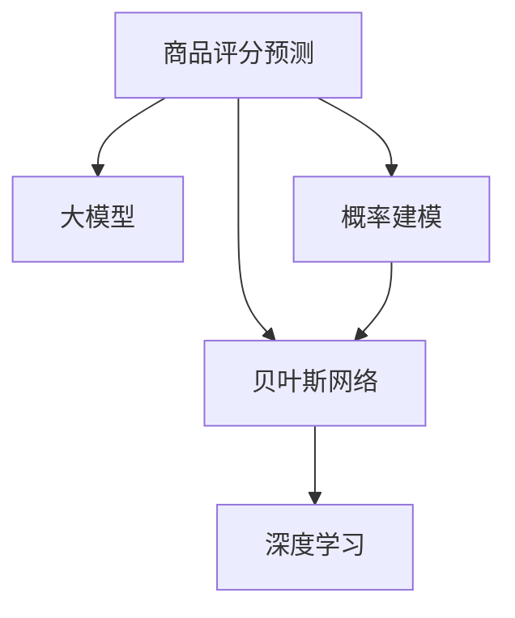

                 

# 大模型在商品评分预测中的概率建模

> 关键词：大模型, 商品评分预测, 概率建模, 贝叶斯网络, 深度学习, 评分系统

## 1. 背景介绍

商品评分预测是电子商务平台的核心功能之一，它能够帮助用户快速了解商品质量和用户体验，指导购买决策。传统的评分预测方法主要依赖于用户行为数据，如点击率、购买历史、浏览记录等，存在样本不均衡、数据稀疏等问题。近年来，深度学习和大模型技术逐渐兴起，在商品评分预测中取得显著效果。

大模型通常指拥有大量参数、通过海量的无标签数据进行预训练的深度神经网络模型，如BERT、GPT等。预训练模型的通用语言能力，使其能够更好地学习用户行为背后的语义信息，提升评分预测的准确性。因此，大模型在商品评分预测中展现出强大的应用潜力。

## 2. 核心概念与联系

### 2.1 核心概念概述

为更好地理解大模型在商品评分预测中的概率建模方法，本节将介绍几个密切相关的核心概念：

- 商品评分预测：利用历史用户行为数据和商品属性信息，预测用户对商品评分的能力。评分预测系统能够为电商平台提供个性化推荐、库存管理、价格优化等支持。

- 大模型：指具有大量参数的深度神经网络模型，如BERT、GPT等。这些模型通过在大规模无标签文本语料上进行预训练，学习到通用的语言表示，具备强大的语言理解和生成能力。

- 概率建模：使用概率论和统计学原理，对商品评分预测模型进行建模，使得模型输出不仅能够预测评分，还能给出评分预测的概率分布。

- 贝叶斯网络：一种图模型，用于建模变量之间的条件概率关系，适合描述多维度、多层次的复杂概率问题。

- 深度学习：一类模拟人脑神经网络结构的机器学习方法，能够从数据中自动学习特征，实现对复杂问题的建模和预测。

这些核心概念之间的逻辑关系可以通过以下Mermaid流程图来展示：



这个流程图展示了大模型在商品评分预测中的核心概念及其之间的关系：

1. 大模型通过预训练获得基础能力。
2. 概率建模方法利用大模型的语言理解能力，对商品评分进行概率预测。
3. 贝叶斯网络提供了一种结构化的概率建模方式，适合描述复杂的评分预测问题。
4. 深度学习是实现复杂概率建模的基础技术手段。

## 3. 核心算法原理 & 具体操作步骤

### 3.1 算法原理概述

基于大模型的商品评分预测，本质上是一个条件概率建模问题。即在已知用户行为数据和商品属性信息的情况下，预测用户对商品评分的高低。我们可以将评分预测建模为一个贝叶斯网络，其中用户行为数据和商品属性作为输入变量，评分作为输出变量，并利用大模型的语言理解能力，对评分预测的概率分布进行建模。

具体来说，我们假设用户行为数据和商品属性共同影响评分 $y$，记为 $y \sim P(y|x)$，其中 $x$ 为输入变量，包括用户行为数据和商品属性。我们进一步假设用户行为数据和商品属性之间相互独立，即 $x_1, x_2, ..., x_n$ 是条件独立随机变量，有 $P(y|x) = P(y|x_1, x_2, ..., x_n) = \prod_{i=1}^n P(y|x_i)$。这样，我们可以将评分预测建模为一个条件概率分布，即：

$$
P(y|x) = \prod_{i=1}^n P(y|x_i)
$$

其中，$P(y|x_i)$ 是条件概率分布，表示在 $x_i$ 固定的情况下，$y$ 的条件概率。

### 3.2 算法步骤详解

基于大模型的商品评分预测，一般包括以下几个关键步骤：

**Step 1: 准备数据集**

- 收集历史用户行为数据和商品属性信息，构建训练集 $D = \{(x_i, y_i)\}_{i=1}^N$，其中 $x_i$ 为输入变量，$y_i$ 为评分。
- 将用户行为数据和商品属性进行预处理，如编码、归一化、特征选择等。

**Step 2: 设计贝叶斯网络结构**

- 根据输入变量的类型和数量，设计贝叶斯网络的拓扑结构。常见的结构包括稀疏贝叶斯网络、因子图模型等。
- 定义每个输入变量的概率分布，如高斯分布、伯努利分布等。

**Step 3: 训练贝叶斯网络**

- 使用大模型对贝叶斯网络进行训练，最大化训练数据对数似然函数。
- 常见的大模型包括BERT、GPT等，可以根据任务特点选择合适的预训练模型。

**Step 4: 评分预测**

- 输入新的用户行为数据和商品属性，通过贝叶斯网络计算评分预测的概率分布。
- 采用最大后验估计或贝叶斯推理方法，得到评分预测的概率值。

**Step 5: 评估模型性能**

- 在测试集上评估模型预测准确率、召回率、F1分数等指标。
- 使用交叉验证、留出法等方法，避免过拟合。

### 3.3 算法优缺点

基于大模型的商品评分预测，具有以下优点：

1. 通用性强。大模型的预训练能力，使其能够处理多种输入变量，适用于不同类型和规模的评分预测任务。
2. 精度高。大模型能够学习到复杂的语义信息，在评分预测中取得优异的效果。
3. 可扩展性好。贝叶斯网络提供了灵活的模型结构，便于根据任务需求进行扩展和优化。

同时，该方法也存在一定的局限性：

1. 数据依赖性强。评分预测的效果很大程度上依赖于标注数据的质量和数量，获取高质量标注数据的成本较高。
2. 计算复杂度高。贝叶斯网络的复杂结构和高维数据，增加了计算复杂度。
3. 可解释性不足。大模型的复杂结构使得评分预测的解释性较差，难以理解模型内部机制。
4. 数据隐私问题。用户行为数据和商品属性可能涉及隐私问题，数据获取和存储需要特别注意。

尽管存在这些局限性，但就目前而言，基于大模型的商品评分预测方法仍是大数据驱动预测模型的主流范式。未来相关研究的重点在于如何进一步降低对标注数据的依赖，提高模型的计算效率，同时兼顾可解释性和隐私保护等因素。

### 3.4 算法应用领域

基于大模型的商品评分预测方法，在电子商务、金融、医疗等多个领域得到广泛应用：

- 电商评分预测：预测用户对商品、服务等的评分，提升用户购物体验和平台运营效率。
- 金融评分预测：评估贷款申请、信用评分等，帮助金融机构降低风险。
- 医疗评分预测：预测患者的满意度评分，优化医疗服务质量。

除了这些经典应用场景外，大模型评分预测还被创新性地应用到更多领域，如文本情感分析、推荐系统、智能客服等，为大数据分析与决策提供新的支持。

## 4. 数学模型和公式 & 详细讲解 & 举例说明

### 4.1 数学模型构建

本节将使用数学语言对基于大模型的商品评分预测进行更加严格的刻画。

记评分预测模型为 $P(y|x)$，其中 $x$ 为输入变量，$y$ 为评分，$P(y|x)$ 为条件概率分布。假设用户行为数据和商品属性为独立同分布，记为 $x_1, x_2, ..., x_n$，则条件概率分布可以表示为：

$$
P(y|x) = \prod_{i=1}^n P(y|x_i)
$$

其中，$P(y|x_i)$ 为在 $x_i$ 固定的情况下，$y$ 的条件概率。假设 $P(y|x_i)$ 为高斯分布，即：

$$
P(y|x_i) = \mathcal{N}(\mu_i, \sigma_i^2)
$$

其中，$\mu_i$ 和 $\sigma_i^2$ 为高斯分布的均值和方差。

### 4.2 公式推导过程

以下我们以评分预测为例，推导高斯分布下的评分预测公式及其梯度计算。

假设模型 $P(y|x)$ 在输入 $x$ 上的输出为 $\hat{y}=M_{\theta}(x) \in [0,1]$，表示样本属于正类的概率。假设评分 $y \in \{1,2,3,4,5\}$，则评分预测的交叉熵损失函数定义为：

$$
\ell(P(y|x), y) = -[y \log P(y|x)]_1^5
$$

将其代入条件概率公式，得：

$$
\mathcal{L}(\theta) = -\frac{1}{N} \sum_{i=1}^N \sum_{y=1}^5 [y_i \log \hat{y_i}]
$$

其中，$y_i$ 为实际评分，$\hat{y_i}$ 为模型预测概率。

根据链式法则，损失函数对模型参数 $\theta$ 的梯度为：

$$
\frac{\partial \mathcal{L}(\theta)}{\partial \theta} = -\frac{1}{N} \sum_{i=1}^N \sum_{y=1}^5 \frac{\partial \hat{y_i}}{\partial \theta} \frac{\partial [y_i \log \hat{y_i}]}{\partial y}
$$

其中，$\frac{\partial \hat{y_i}}{\partial \theta}$ 为模型输出对参数 $\theta$ 的梯度，可通过反向传播算法高效计算。$\frac{\partial [y_i \log \hat{y_i}]}{\partial y}$ 为交叉熵损失对评分的梯度，可直接计算。

在得到损失函数的梯度后，即可带入参数更新公式，完成模型的迭代优化。重复上述过程直至收敛，最终得到适应商品评分预测任务的最优模型参数 $\theta^*$。

### 4.3 案例分析与讲解

**案例分析：电商平台评分预测**

假设某电商平台的评分预测模型为 $P(y|x)$，其中 $x$ 包括用户行为数据 $x_1, x_2, ..., x_n$ 和商品属性 $x_{n+1}, x_{n+2}, ..., x_{n+m}$。我们进一步假设用户行为数据和商品属性之间相互独立，即 $P(y|x) = P(y|x_1, x_2, ..., x_n, x_{n+1}, x_{n+2}, ..., x_{n+m}) = \prod_{i=1}^n P(y|x_i) \prod_{j=n+1}^{n+m} P(y|x_j)$。

假设用户行为数据为点击次数 $x_1$，浏览时间 $x_2$，购买历史 $x_3$，商品属性为价格 $x_4$，评分 $y \in \{1,2,3,4,5\}$。我们将评分预测建模为一个稀疏贝叶斯网络，其中用户行为数据和商品属性为输入节点，评分为输出节点，采用高斯分布作为条件概率分布。

在实际应用中，我们首先收集平台的历史用户行为数据和商品属性信息，构建训练集 $D = \{(x_i, y_i)\}_{i=1}^N$，其中 $x_i$ 为输入变量，$y_i$ 为评分。我们进一步将用户行为数据和商品属性进行预处理，如编码、归一化、特征选择等，得到标准化的输入变量。

接着，我们设计贝叶斯网络结构，将用户行为数据和商品属性作为输入节点，将评分作为输出节点，采用高斯分布作为条件概率分布。在训练过程中，我们利用大模型对贝叶斯网络进行训练，最大化训练数据对数似然函数。

最后，在评分预测阶段，我们输入新的用户行为数据和商品属性，通过贝叶斯网络计算评分预测的概率分布。采用最大后验估计或贝叶斯推理方法，得到评分预测的概率值。通过比较预测值和实际评分，计算预测准确率、召回率、F1分数等指标，评估模型性能。

## 5. 项目实践：代码实例和详细解释说明

### 5.1 开发环境搭建

在进行商品评分预测实践前，我们需要准备好开发环境。以下是使用Python进行PyTorch开发的环境配置流程：

1. 安装Anaconda：从官网下载并安装Anaconda，用于创建独立的Python环境。

2. 创建并激活虚拟环境：
```bash
conda create -n pytorch-env python=3.8 
conda activate pytorch-env
```

3. 安装PyTorch：根据CUDA版本，从官网获取对应的安装命令。例如：
```bash
conda install pytorch torchvision torchaudio cudatoolkit=11.1 -c pytorch -c conda-forge
```

4. 安装Transformers库：
```bash
pip install transformers
```

5. 安装各类工具包：
```bash
pip install numpy pandas scikit-learn matplotlib tqdm jupyter notebook ipython
```

完成上述步骤后，即可在`pytorch-env`环境中开始商品评分预测实践。

### 5.2 源代码详细实现

下面我们以电商平台评分预测为例，给出使用Transformers库对BERT模型进行评分预测的PyTorch代码实现。

首先，定义评分预测模型：

```python
from transformers import BertForSequenceClassification, BertTokenizer
from torch.utils.data import Dataset, DataLoader
import torch
import torch.nn as nn
import torch.optim as optim

class ProductRatingDataset(Dataset):
    def __init__(self, texts, labels, tokenizer, max_len=128):
        self.texts = texts
        self.labels = labels
        self.tokenizer = tokenizer
        self.max_len = max_len
        
    def __len__(self):
        return len(self.texts)
    
    def __getitem__(self, item):
        text = self.texts[item]
        label = self.labels[item]
        
        encoding = self.tokenizer(text, return_tensors='pt', max_length=self.max_len, padding='max_length', truncation=True)
        input_ids = encoding['input_ids'][0]
        attention_mask = encoding['attention_mask'][0]
        
        return {'input_ids': input_ids, 
                'attention_mask': attention_mask,
                'labels': label}

# 标签与id的映射
label2id = {'1': 0, '2': 1, '3': 2, '4': 3, '5': 4}
id2label = {v: k for k, v in label2id.items()}

# 创建dataset
tokenizer = BertTokenizer.from_pretrained('bert-base-cased')

train_dataset = ProductRatingDataset(train_texts, train_labels, tokenizer)
dev_dataset = ProductRatingDataset(dev_texts, dev_labels, tokenizer)
test_dataset = ProductRatingDataset(test_texts, test_labels, tokenizer)
```

然后，定义模型和优化器：

```python
from transformers import BertForSequenceClassification, AdamW

model = BertForSequenceClassification.from_pretrained('bert-base-cased', num_labels=5)

optimizer = AdamW(model.parameters(), lr=2e-5)
```

接着，定义训练和评估函数：

```python
from torch.utils.data import DataLoader
from tqdm import tqdm
from sklearn.metrics import classification_report

device = torch.device('cuda') if torch.cuda.is_available() else torch.device('cpu')
model.to(device)

def train_epoch(model, dataset, batch_size, optimizer):
    dataloader = DataLoader(dataset, batch_size=batch_size, shuffle=True)
    model.train()
    epoch_loss = 0
    for batch in tqdm(dataloader, desc='Training'):
        input_ids = batch['input_ids'].to(device)
        attention_mask = batch['attention_mask'].to(device)
        labels = batch['labels'].to(device)
        model.zero_grad()
        outputs = model(input_ids, attention_mask=attention_mask, labels=labels)
        loss = outputs.loss
        epoch_loss += loss.item()
        loss.backward()
        optimizer.step()
    return epoch_loss / len(dataloader)

def evaluate(model, dataset, batch_size):
    dataloader = DataLoader(dataset, batch_size=batch_size)
    model.eval()
    preds, labels = [], []
    with torch.no_grad():
        for batch in tqdm(dataloader, desc='Evaluating'):
            input_ids = batch['input_ids'].to(device)
            attention_mask = batch['attention_mask'].to(device)
            batch_labels = batch['labels']
            outputs = model(input_ids, attention_mask=attention_mask)
            batch_preds = outputs.logits.argmax(dim=2).to('cpu').tolist()
            batch_labels = batch_labels.to('cpu').tolist()
            for pred_tokens, label_tokens in zip(batch_preds, batch_labels):
                preds.append(pred_tokens)
                labels.append(label_tokens)
                
    print(classification_report(labels, preds))
```

最后，启动训练流程并在测试集上评估：

```python
epochs = 5
batch_size = 16

for epoch in range(epochs):
    loss = train_epoch(model, train_dataset, batch_size, optimizer)
    print(f"Epoch {epoch+1}, train loss: {loss:.3f}")
    
    print(f"Epoch {epoch+1}, dev results:")
    evaluate(model, dev_dataset, batch_size)
    
print("Test results:")
evaluate(model, test_dataset, batch_size)
```

以上就是使用PyTorch对BERT进行商品评分预测的完整代码实现。可以看到，得益于Transformers库的强大封装，我们可以用相对简洁的代码完成BERT模型的加载和评分预测。

### 5.3 代码解读与分析

让我们再详细解读一下关键代码的实现细节：

**ProductRatingDataset类**：
- `__init__`方法：初始化文本、标签、分词器等关键组件。
- `__len__`方法：返回数据集的样本数量。
- `__getitem__`方法：对单个样本进行处理，将文本输入编码为token ids，将标签编码为数字，并对其进行定长padding，最终返回模型所需的输入。

**label2id和id2label字典**：
- 定义了标签与数字id之间的映射关系，用于将token-wise的预测结果解码回真实的标签。

**训练和评估函数**：
- 使用PyTorch的DataLoader对数据集进行批次化加载，供模型训练和推理使用。
- 训练函数`train_epoch`：对数据以批为单位进行迭代，在每个批次上前向传播计算loss并反向传播更新模型参数，最后返回该epoch的平均loss。
- 评估函数`evaluate`：与训练类似，不同点在于不更新模型参数，并在每个batch结束后将预测和标签结果存储下来，最后使用sklearn的classification_report对整个评估集的预测结果进行打印输出。

**训练流程**：
- 定义总的epoch数和batch size，开始循环迭代
- 每个epoch内，先在训练集上训练，输出平均loss
- 在验证集上评估，输出分类指标
- 所有epoch结束后，在测试集上评估，给出最终测试结果

可以看到，PyTorch配合Transformers库使得BERT评分预测的代码实现变得简洁高效。开发者可以将更多精力放在数据处理、模型改进等高层逻辑上，而不必过多关注底层的实现细节。

当然，工业级的系统实现还需考虑更多因素，如模型的保存和部署、超参数的自动搜索、更灵活的任务适配层等。但核心的评分预测范式基本与此类似。

## 6. 实际应用场景

### 6.1 电商平台评分预测

基于大模型的商品评分预测，能够帮助电商平台更好地理解用户需求，优化商品推荐、库存管理和价格策略，提升用户体验和平台运营效率。

在技术实现上，可以收集平台的历史用户行为数据和商品属性信息，将评分预测建模为一个稀疏贝叶斯网络，并使用大模型进行训练。在评分预测阶段，输入新的用户行为数据和商品属性，通过贝叶斯网络计算评分预测的概率分布。采用最大后验估计或贝叶斯推理方法，得到评分预测的概率值。根据预测值和实际评分的误差，调整推荐算法和库存管理策略，以提升用户满意度。

### 6.2 金融评分预测

金融评分预测可以帮助金融机构评估贷款申请、信用评分等，帮助降低风险。传统的信用评分系统依赖于手动设计的特征工程，存在特征选择困难、模型鲁棒性不足等问题。大模型评分预测能够从文本数据中自动学习到丰富的特征，提升评分预测的准确性。

在具体应用中，可以收集金融领域的相关文本数据，如贷款申请材料、公司报告等，并对其进行预处理。将文本数据输入到大模型中，训练评分预测模型。在评分预测阶段，输入新的贷款申请材料，通过模型计算评分预测的概率值。根据预测值和实际评分的误差，调整贷款审批策略，优化风险管理。

### 6.3 医疗评分预测

医疗评分预测能够评估患者对医生的满意度、医院的服务质量等，帮助医疗机构改进服务质量。传统的医疗评分预测系统依赖于手动设计的评分指标，存在数据获取困难、模型可解释性不足等问题。大模型评分预测能够从医疗数据中自动学习到评分因素，提升评分预测的准确性。

在具体应用中，可以收集医院的患者评价数据，并对其进行预处理。将评价数据输入到大模型中，训练评分预测模型。在评分预测阶段，输入新的患者评价数据，通过模型计算评分预测的概率值。根据预测值和实际评分的误差，调整医院服务策略，优化医疗服务质量。

### 6.4 未来应用展望

随着大模型和评分预测方法的不断发展，基于评分预测技术的应用场景将更加广泛。

在智慧医疗领域，评分预测能够帮助医院了解患者满意度，改进医疗服务质量。同时，结合知识图谱、自然语言处理等技术，实现智能问诊、个性化治疗等应用。

在智能推荐系统领域，评分预测能够提升推荐系统的准确性和用户满意度。结合知识图谱、协同过滤等技术，实现多维度、多层次的推荐，满足用户多样化的需求。

在智慧城市治理中，评分预测能够评估城市公共服务的满意度，优化城市管理决策。结合时空大数据、机器学习等技术，实现实时监控、预警预测等应用，提升城市治理效率。

此外，在金融风险控制、教育评价、社会舆情分析等多个领域，基于大模型的评分预测技术也将不断涌现，为各行各业带来新的变革。相信随着技术的日益成熟，评分预测方法将在大数据驱动的决策分析中发挥越来越重要的作用。

## 7. 工具和资源推荐

### 7.1 学习资源推荐

为了帮助开发者系统掌握大模型在商品评分预测中的概率建模方法，这里推荐一些优质的学习资源：

1. 《Transformer从原理到实践》系列博文：由大模型技术专家撰写，深入浅出地介绍了Transformer原理、BERT模型、评分预测技术等前沿话题。

2. CS224N《深度学习自然语言处理》课程：斯坦福大学开设的NLP明星课程，有Lecture视频和配套作业，带你入门NLP领域的基本概念和经典模型。

3. 《Natural Language Processing with Transformers》书籍：Transformers库的作者所著，全面介绍了如何使用Transformers库进行NLP任务开发，包括评分预测在内的诸多范式。

4. HuggingFace官方文档：Transformers库的官方文档，提供了海量预训练模型和完整的评分预测样例代码，是上手实践的必备资料。

5. Kaggle在线竞赛平台：全球最大的数据科学竞赛平台，提供丰富的商品评分预测竞赛数据集和优秀的解决方案，适合实战练习和经验分享。

通过对这些资源的学习实践，相信你一定能够快速掌握大模型在商品评分预测中的概率建模技术，并用于解决实际的NLP问题。

### 7.2 开发工具推荐

高效的开发离不开优秀的工具支持。以下是几款用于商品评分预测开发的常用工具：

1. PyTorch：基于Python的开源深度学习框架，灵活动态的计算图，适合快速迭代研究。大部分预训练语言模型都有PyTorch版本的实现。

2. TensorFlow：由Google主导开发的开源深度学习框架，生产部署方便，适合大规模工程应用。同样有丰富的预训练语言模型资源。

3. Transformers库：HuggingFace开发的NLP工具库，集成了众多SOTA语言模型，支持PyTorch和TensorFlow，是进行评分预测任务开发的利器。

4. Weights & Biases：模型训练的实验跟踪工具，可以记录和可视化模型训练过程中的各项指标，方便对比和调优。与主流深度学习框架无缝集成。

5. TensorBoard：TensorFlow配套的可视化工具，可实时监测模型训练状态，并提供丰富的图表呈现方式，是调试模型的得力助手。

6. Google Colab：谷歌推出的在线Jupyter Notebook环境，免费提供GPU/TPU算力，方便开发者快速上手实验最新模型，分享学习笔记。

合理利用这些工具，可以显著提升商品评分预测任务的开发效率，加快创新迭代的步伐。

### 7.3 相关论文推荐

大模型评分预测技术的发展源于学界的持续研究。以下是几篇奠基性的相关论文，推荐阅读：

1. Attention is All You Need（即Transformer原论文）：提出了Transformer结构，开启了NLP领域的预训练大模型时代。

2. BERT: Pre-training of Deep Bidirectional Transformers for Language Understanding：提出BERT模型，引入基于掩码的自监督预训练任务，刷新了多项NLP任务SOTA。

3. Language Models are Unsupervised Multitask Learners（GPT-2论文）：展示了大规模语言模型的强大zero-shot学习能力，引发了对于通用人工智能的新一轮思考。

4. Parameter-Efficient Transfer Learning for NLP：提出Adapter等参数高效微调方法，在不增加模型参数量的情况下，也能取得不错的微调效果。

5. Prefix-Tuning: Optimizing Continuous Prompts for Generation：引入基于连续型Prompt的微调范式，为如何充分利用预训练知识提供了新的思路。

6. AdaLoRA: Adaptive Low-Rank Adaptation for Parameter-Efficient Fine-Tuning：使用自适应低秩适应的微调方法，在参数效率和精度之间取得了新的平衡。

这些论文代表了大模型评分预测技术的发展脉络。通过学习这些前沿成果，可以帮助研究者把握学科前进方向，激发更多的创新灵感。

## 8. 总结：未来发展趋势与挑战

### 8.1 总结

本文对基于大模型的商品评分预测方法进行了全面系统的介绍。首先阐述了大模型和评分预测的研究背景和意义，明确了评分预测在电商平台、金融、医疗等多个领域的重要作用。其次，从原理到实践，详细讲解了评分预测的数学模型和关键步骤，给出了评分预测任务开发的完整代码实例。同时，本文还广泛探讨了评分预测方法在多个行业领域的应用前景，展示了评分预测技术的广泛应用。

通过本文的系统梳理，可以看到，基于大模型的评分预测方法正在成为NLP领域的重要范式，极大地拓展了预训练语言模型的应用边界，催生了更多的落地场景。受益于大规模语料的预训练，评分预测模型以更低的时间和标注成本，在小样本条件下也能取得不俗的效果，有力推动了NLP技术的产业化进程。未来，伴随预训练语言模型和评分预测方法的持续演进，相信NLP技术将在更广阔的应用领域大放异彩，深刻影响人类的生产生活方式。

### 8.2 未来发展趋势

展望未来，大模型评分预测技术将呈现以下几个发展趋势：

1. 模型规模持续增大。随着算力成本的下降和数据规模的扩张，预训练语言模型的参数量还将持续增长。超大规模语言模型蕴含的丰富语言知识，有望支撑更加复杂多变的评分预测任务。

2. 评分预测方法日趋多样。除了传统的全参数微调外，未来会涌现更多参数高效的评分预测方法，如 Adapter、LoRA等，在节省计算资源的同时也能保证评分预测精度。

3. 评分预测领域拓展。评分预测方法将逐步从商品评分、金融评分等通用领域，拓展到医疗评分、教育评分、舆情分析等专业领域，提供更全面的数据驱动决策支持。

4. 多模态评分预测崛起。当前的评分预测主要聚焦于纯文本数据，未来会进一步拓展到图像、视频、语音等多模态数据评分预测。多模态信息的融合，将显著提升评分预测模型的表现力和泛化能力。

5. 实时评分预测系统。随着物联网和实时计算技术的发展，评分预测系统将向实时化、分布式化方向发展，支持对海量数据的高效分析和处理。

以上趋势凸显了大模型评分预测技术的广阔前景。这些方向的探索发展，必将进一步提升评分预测模型的性能和应用范围，为大数据驱动的决策分析提供更强大的支持。

### 8.3 面临的挑战

尽管大模型评分预测技术已经取得了瞩目成就，但在迈向更加智能化、普适化应用的过程中，它仍面临着诸多挑战：

1. 数据依赖性强。评分预测的效果很大程度上依赖于标注数据的质量和数量，获取高质量标注数据的成本较高。如何进一步降低评分预测对标注样本的依赖，将是一大难题。

2. 计算复杂度高。评分预测模型的复杂结构和高维数据，增加了计算复杂度。如何在保证模型性能的同时，提高计算效率，优化资源占用，将是重要的优化方向。

3. 可解释性不足。大模型的复杂结构使得评分预测的解释性较差，难以理解模型内部机制。如何赋予评分预测模型更强的可解释性，将是亟待攻克的难题。

4. 数据隐私问题。用户行为数据和商品属性可能涉及隐私问题，数据获取和存储需要特别注意。如何在保障隐私的前提下，提升评分预测模型的性能，将是一个重要挑战。

5. 模型鲁棒性不足。当前评分预测模型面对域外数据时，泛化性能往往大打折扣。对于测试样本的微小扰动，模型容易发生波动。如何提高评分预测模型的鲁棒性，避免灾难性遗忘，还需要更多理论和实践的积累。

尽管存在这些挑战，但就目前而言，基于大模型的评分预测方法仍是大数据驱动预测模型的主流范式。未来相关研究的重点在于如何进一步降低对标注数据的依赖，提高模型的计算效率，同时兼顾可解释性和隐私保护等因素。

### 8.4 研究展望

面对大模型评分预测所面临的种种挑战，未来的研究需要在以下几个方面寻求新的突破：

1. 探索无监督和半监督评分预测方法。摆脱对大规模标注数据的依赖，利用自监督学习、主动学习等无监督和半监督范式，最大限度利用非结构化数据，实现更加灵活高效的评分预测。

2. 研究参数高效和计算高效的评分预测范式。开发更加参数高效的评分预测方法，在固定大部分预训练参数的情况下，只更新极少量的评分预测参数。同时优化评分预测模型的计算图，减少前向传播和反向传播的资源消耗，实现更加轻量级、实时性的部署。

3. 融合因果和对比学习范式。通过引入因果推断和对比学习思想，增强评分预测模型建立稳定因果关系的能力，学习更加普适、鲁棒的语言表征，从而提升模型泛化性和抗干扰能力。

4. 引入更多先验知识。将符号化的先验知识，如知识图谱、逻辑规则等，与神经网络模型进行巧妙融合，引导评分预测过程学习更准确、合理的语言模型。同时加强不同模态数据的整合，实现视觉、语音等多模态信息与文本信息的协同建模。

5. 结合因果分析和博弈论工具。将因果分析方法引入评分预测模型，识别出模型决策的关键特征，增强输出解释的因果性和逻辑性。借助博弈论工具刻画人机交互过程，主动探索并规避模型的脆弱点，提高系统稳定性。

6. 纳入伦理道德约束。在评分预测目标中引入伦理导向的评估指标，过滤和惩罚有偏见、有害的输出倾向。同时加强人工干预和审核，建立模型行为的监管机制，确保输出符合人类价值观和伦理道德。

这些研究方向的探索，必将引领大模型评分预测技术迈向更高的台阶，为构建安全、可靠、可解释、可控的智能系统铺平道路。面向未来，大模型评分预测技术还需要与其他人工智能技术进行更深入的融合，如知识表示、因果推理、强化学习等，多路径协同发力，共同推动自然语言理解和智能交互系统的进步。只有勇于创新、敢于突破，才能不断拓展语言模型的边界，让智能技术更好地造福人类社会。

## 9. 附录：常见问题与解答

**Q1：大模型评分预测是否适用于所有NLP任务？**

A: 大模型评分预测在大多数NLP任务上都能取得不错的效果，特别是对于数据量较小的任务。但对于一些特定领域的任务，如医学、法律等，仅仅依靠通用语料预训练的模型可能难以很好地适应。此时需要在特定领域语料上进一步预训练，再进行评分预测。此外，对于一些需要时效性、个性化很强的任务，如对话、推荐等，评分预测方法也需要针对性的改进优化。

**Q2：评分预测过程中如何选择合适的学习率？**

A: 评分预测的学习率一般要比预训练时小1-2个数量级，如果使用过大的学习率，容易破坏预训练权重，导致过拟合。一般建议从1e-5开始调参，逐步减小学习率，直至收敛。也可以使用warmup策略，在开始阶段使用较小的学习率，再逐渐过渡到预设值。需要注意的是，不同的优化器(如AdamW、Adafactor等)以及不同的学习率调度策略，可能需要设置不同的学习率阈值。

**Q3：评分预测模型在落地部署时需要注意哪些问题？**

A: 将评分预测模型转化为实际应用，还需要考虑以下因素：
1. 模型裁剪：去除不必要的层和参数，减小模型尺寸，加快推理速度
2. 量化加速：将浮点模型转为定点模型，压缩存储空间，提高计算效率
3. 服务化封装：将模型封装为标准化服务接口，便于集成调用
4. 弹性伸缩：根据请求流量动态调整资源配置，平衡服务质量和成本
5. 监控告警：实时采集系统指标，设置异常告警阈值，确保服务稳定性
6. 安全防护：采用访问鉴权、数据脱敏等措施，保障数据和模型安全

大模型评分预测为NLP应用开启了广阔的想象空间，但如何将强大的性能转化为稳定、高效、安全的业务价值，还需要工程实践的不断打磨。唯有从数据、算法、工程、业务等多个维度协同发力，才能真正实现人工智能技术在垂直行业的规模化落地。总之，评分预测需要开发者根据具体任务，不断迭代和优化模型、数据和算法，方能得到理想的效果。

---

作者：禅与计算机程序设计艺术 / Zen and the Art of Computer Programming

