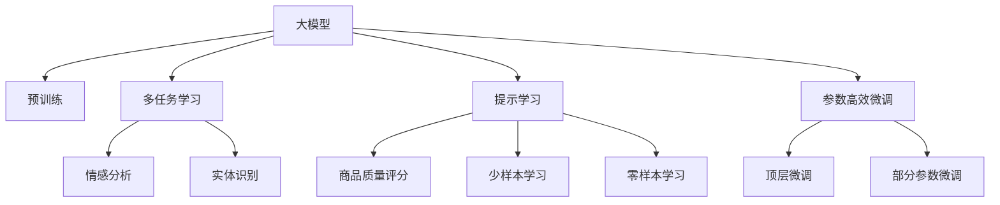
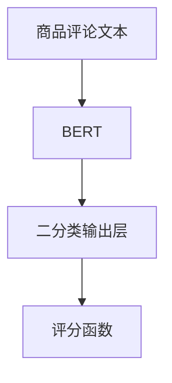

                 

# 大模型在商品评论质量自动评估中的应用

> 关键词：大模型, 商品评论, 自然语言处理(NLP), 情感分析, 质量评估, 质量控制

## 1. 背景介绍

### 1.1 问题由来

随着电商平台的迅猛发展，商品评论已成为消费者获取产品信息的重要来源。高质量的商品评论不仅能够帮助消费者更好地了解产品特性，还对商家的商品推荐、售后服务等环节有着深远影响。然而，大量的商品评论质量参差不齐，混杂着虚假宣传、恶意评价、无关信息等多种噪音，给商家和消费者带来了诸多困扰。因此，高效、准确地识别商品评论质量，成为了电商平台亟需解决的问题。

近年来，深度学习技术和大规模预训练语言模型在自然语言处理(NLP)领域取得了突破性进展。大模型能够利用海量数据训练出强大的语言理解能力，应用于商品评论质量评估这一特定任务，能够从文本中自动识别出真实有用和虚假无用的信息，从而显著提升评论质量判断的效率和准确性。

### 1.2 问题核心关键点
大模型在商品评论质量评估的应用主要依赖以下几个核心关键点：

- 大模型预训练：利用大规模无标签文本数据进行预训练，学习通用的语言表示，构建出强大的文本理解能力。
- 多任务学习：在大模型上引入商品评论相关的监督任务，如情感分析、实体识别等，通过多任务学习增强模型在特定任务上的表现。
- 提示学习：通过精心设计的提示模板，引导大模型理解评论内容，输出相关的质量评分。
- 参数高效微调：在固定大部分预训练权重的情况下，只微调顶层或部分相关参数，避免过度拟合和资源浪费。
- 实时性要求：评论质量评估需具备高实时性，能够在用户生成评论后快速判断其质量，及时进行产品优化或修改。

这些关键点共同构成了大模型在商品评论质量评估中的应用框架，使得模型能够在大规模数据和高效实时性的要求下，准确识别出优质评论。

## 2. 核心概念与联系

### 2.1 核心概念概述

为更好地理解大模型在商品评论质量评估中的应用，本节将介绍几个密切相关的核心概念：

- 大模型(Large Model)：如GPT、BERT等，指通过大规模数据预训练得到的语言模型。这些模型具备强大的语言理解和生成能力。
- 预训练(Pre-training)：指在大规模无标签文本数据上，通过自监督学习任务训练语言模型的过程。预训练使得模型学习到通用的语言表示。
- 多任务学习(Multi-task Learning)：指在同一模型上学习多个相关任务的策略，通过共同优化提升模型在特定任务上的性能。
- 提示学习(Prompt Learning)：通过在输入文本中添加提示模板，引导大模型理解输入内容，输出特定的预测结果。提示学习通常不更新模型参数，避免了微调过程的计算成本。
- 参数高效微调(Parameter-Efficient Fine-Tuning, PEFT)：指在微调过程中，只更新少量模型参数，而固定大部分预训练权重不变，以提高微调效率和避免过拟合。

这些核心概念之间的逻辑关系可以通过以下Mermaid流程图来展示：



这个流程图展示了这些核心概念之间的联系：

1. 大模型通过预训练获得基础能力。
2. 多任务学习通过引入商品评论相关的监督任务，提升模型在特定任务上的表现。
3. 提示学习通过精心设计的输入模板，引导模型进行特定任务的推理和生成。
4. 参数高效微调通过只更新少量参数，提高微调效率，避免过拟合。
5. 少样本学习和零样本学习通过少量示例，实现模型的快速适应。

这些概念共同构成了大模型在商品评论质量评估中的应用框架，使得模型能够在大规模数据和高效实时性的要求下，准确识别出优质评论。

## 3. 核心算法原理 & 具体操作步骤
### 3.1 算法原理概述

基于大模型的商品评论质量评估，本质上是一种监督学习的微调过程。其核心思想是：将大模型视作一个强大的特征提取器，通过在标注的商品评论数据上，有监督地训练模型对评论质量的评分，从而获得针对特定任务优化的模型。

具体来说，假设已有标注的商品评论数据集 $D=\{(x_i,y_i)\}_{i=1}^N$，其中 $x_i$ 为商品评论文本，$y_i \in \{1, 0\}$ 为评论质量评分。在大模型上，定义一个评分函数 $f_\theta(x)$，其中 $\theta$ 为模型的参数。微调的目标是最小化评分函数与真实标签之间的差异，即：

$$
\min_{\theta} \mathcal{L}(f_\theta, D)
$$

其中 $\mathcal{L}$ 为损失函数，常用的损失函数包括交叉熵损失、均方误差损失等。通过梯度下降等优化算法，微调过程不断更新模型参数 $\theta$，最小化损失函数 $\mathcal{L}$，使得模型输出逼近真实标签。

### 3.2 算法步骤详解

基于大模型的商品评论质量评估，一般包括以下几个关键步骤：

**Step 1: 准备预训练模型和数据集**
- 选择合适的预训练语言模型，如BERT、GPT等。
- 准备商品评论数据集 $D$，划分为训练集、验证集和测试集。数据集中的评论文本和标签需经过标注和清洗。

**Step 2: 添加任务适配层**
- 根据任务类型，在预训练模型顶层设计合适的输出层和损失函数。
- 对于二分类任务，通常在顶层添加线性分类器和交叉熵损失函数。
- 对于多分类任务，可以设计多输出分类器，例如基于评分矩阵的损失函数。

**Step 3: 设置微调超参数**
- 选择合适的优化算法及其参数，如 AdamW、SGD 等，设置学习率、批大小、迭代轮数等。
- 设置正则化技术及强度，包括权重衰减、Dropout、Early Stopping 等。
- 确定冻结预训练参数的策略，如仅微调顶层，或全部参数都参与微调。

**Step 4: 执行梯度训练**
- 将训练集数据分批次输入模型，前向传播计算损失函数。
- 反向传播计算参数梯度，根据设定的优化算法和学习率更新模型参数。
- 周期性在验证集上评估模型性能，根据性能指标决定是否触发 Early Stopping。
- 重复上述步骤直到满足预设的迭代轮数或 Early Stopping 条件。

**Step 5: 测试和部署**
- 在测试集上评估微调后模型 $f_{\hat{\theta}}$ 的性能，对比微调前后的精度提升。
- 使用微调后的模型对新商品评论进行质量评分，集成到实际的商品推荐、售后服务等环节。
- 持续收集新的数据，定期重新微调模型，以适应数据分布的变化。

以上是基于大模型的商品评论质量评估的一般流程。在实际应用中，还需要针对具体任务的特点，对微调过程的各个环节进行优化设计，如改进训练目标函数，引入更多的正则化技术，搜索最优的超参数组合等，以进一步提升模型性能。

### 3.3 算法优缺点

基于大模型的商品评论质量评估方法具有以下优点：
1. 准确性高。通过在大规模数据上进行微调，模型能够学习到丰富的评论特征，提高评分判断的准确性。
2. 泛化能力强。大模型预训练得到的通用语言表示，使得模型对新评论具有较强的泛化能力，能够处理多变的文本表达。
3. 实时性好。利用大模型进行评分，可以在商品评论生成后实时判断，快速响应评论质量的变化。
4. 参数高效。通过参数高效微调方法，可以在较小的计算资源下，获得较高的微调效果。

同时，该方法也存在一些局限性：
1. 标注成本高。获取高质商品评论数据集需要较多的人力物力，标注成本较高。
2. 微调依赖于数据。模型的性能很大程度上取决于数据质量和多样性，数据偏差可能影响模型的泛化能力。
3. 资源消耗大。大模型通常需要较多的计算资源，微调过程对计算硬件要求较高。
4. 可解释性不足。大模型作为黑盒模型，其内部决策过程难以解释，不利于理解模型性能和改进。

尽管存在这些局限性，但基于大模型的商品评论质量评估方法仍具有巨大的应用潜力。未来研究的方向可能包括：降低微调对标注数据的依赖，提高模型的跨领域泛化能力，减少计算资源消耗，增强模型的可解释性等。

### 3.4 算法应用领域

基于大模型的商品评论质量评估方法，已经在电商平台的商品推荐、售后服务、舆情分析等多个环节得到了广泛应用。具体应用领域包括：

- 商品推荐系统：通过评估商品评论质量，选择优质的商品推荐给用户，提升用户体验。
- 售后服务系统：分析用户对商品质量的反馈，及时进行调整和优化，提升售后服务质量。
- 舆情监测系统：实时监测用户对商品的质量评价，及时发现和解决潜在问题，防止负面舆论扩散。
- 智能客服系统：通过评论质量评估，判断用户对商品的真实评价，辅助智能客服系统进行更准确的问答和推荐。
- 用户画像构建：分析用户评论的多样性和质量，构建用户画像，实现个性化推荐和精准营销。

除了上述这些主要应用，大模型在商品评论质量评估的方法还可能拓展到更多场景，如市场趋势分析、广告效果评估、产品优化建议等，为电商平台的运营和发展提供全方位的支持。

## 4. 数学模型和公式 & 详细讲解 & 举例说明
### 4.1 数学模型构建

本节将使用数学语言对基于大模型的商品评论质量评估过程进行更加严格的刻画。

假设已有标注的商品评论数据集 $D=\{(x_i,y_i)\}_{i=1}^N$，其中 $x_i$ 为商品评论文本，$y_i \in \{1, 0\}$ 为评论质量评分。定义评分函数 $f_\theta(x)$，其中 $\theta$ 为模型的参数。微调的目标是最小化评分函数与真实标签之间的差异，即：

$$
\min_{\theta} \mathcal{L}(f_\theta, D) = \frac{1}{N}\sum_{i=1}^N \ell(f_\theta(x_i),y_i)
$$

其中 $\ell$ 为损失函数，常用的损失函数包括交叉熵损失：

$$
\ell(f_\theta(x_i),y_i) = -y_i\log f_\theta(x_i) - (1-y_i)\log (1-f_\theta(x_i))
$$

### 4.2 公式推导过程

下面以二分类任务为例，推导交叉熵损失函数的计算过程。

假设评分函数 $f_\theta(x)$ 在输入 $x$ 上的输出为 $\hat{y}=f_\theta(x)$，表示模型预测商品评论的评分。真实标签 $y \in \{1, 0\}$。则二分类交叉熵损失函数定义为：

$$
\ell(f_\theta(x),y) = -y\log \hat{y} - (1-y)\log (1-\hat{y})
$$

将其代入经验风险公式，得：

$$
\mathcal{L}(\theta) = -\frac{1}{N}\sum_{i=1}^N [y_i\log f_\theta(x_i)+(1-y_i)\log(1-f_\theta(x_i))]
$$

根据链式法则，损失函数对参数 $\theta_k$ 的梯度为：

$$
\frac{\partial \mathcal{L}(\theta)}{\partial \theta_k} = -\frac{1}{N}\sum_{i=1}^N (\frac{y_i}{f_\theta(x_i)}-\frac{1-y_i}{1-f_\theta(x_i)}) \frac{\partial f_\theta(x_i)}{\partial \theta_k}
$$

其中 $\frac{\partial f_\theta(x_i)}{\partial \theta_k}$ 可进一步递归展开，利用自动微分技术完成计算。

### 4.3 案例分析与讲解

以下我们以电商商品评论质量评估为例，给出基于大模型的微调实现。

假设电商平台上已有的商品评论数据集为 $D=\{(x_i,y_i)\}_{i=1}^N$，其中 $x_i$ 为商品评论文本，$y_i \in \{1, 0\}$ 为评论质量评分。我们可以利用预训练语言模型BERT进行微调，评估商品评论质量。

首先，将数据集 $D$ 划分为训练集、验证集和测试集，分别用于训练、调参和评估。然后，在BERT模型的顶层添加一个二分类输出层，使用交叉熵损失函数作为评分函数。模型的结构如下：



在模型训练过程中，首先选择合适的优化算法和超参数，如 AdamW 优化器，设置学习率为 $2e-5$，批大小为 $32$，迭代轮数为 $10$ 轮。然后，将训练集数据分批次输入模型，前向传播计算损失函数，反向传播计算参数梯度，更新模型参数。在每个epoch结束后，计算验证集上的损失函数，根据性能指标判断是否需要触发 Early Stopping。最终，使用测试集评估微调后的评分函数 $f_{\hat{\theta}}$ 的性能，对比微调前后的精度提升。

在实际应用中，微调后的评分函数可以集成到电商平台的商品推荐、售后服务等环节，实时评估新商品评论的质量，及时进行调整和优化。这样，电商平台能够更好地了解用户需求，提升商品质量和服务水平，增强用户体验。

## 5. 项目实践：代码实例和详细解释说明
### 5.1 开发环境搭建

在进行商品评论质量评估的微调实践前，我们需要准备好开发环境。以下是使用Python进行PyTorch开发的环境配置流程：

1. 安装Anaconda：从官网下载并安装Anaconda，用于创建独立的Python环境。

2. 创建并激活虚拟环境：
```bash
conda create -n pytorch-env python=3.8 
conda activate pytorch-env
```

3. 安装PyTorch：根据CUDA版本，从官网获取对应的安装命令。例如：
```bash
conda install pytorch torchvision torchaudio cudatoolkit=11.1 -c pytorch -c conda-forge
```

4. 安装Transformers库：
```bash
pip install transformers
```

5. 安装各类工具包：
```bash
pip install numpy pandas scikit-learn matplotlib tqdm jupyter notebook ipython
```

完成上述步骤后，即可在`pytorch-env`环境中开始微调实践。

### 5.2 源代码详细实现

这里我们以商品评论质量评估为例，给出使用Transformers库对BERT模型进行微调的PyTorch代码实现。

首先，定义商品评论质量评估的数据处理函数：

```python
from transformers import BertTokenizer
from torch.utils.data import Dataset
import torch

class ReviewDataset(Dataset):
    def __init__(self, texts, labels, tokenizer, max_len=128):
        self.texts = texts
        self.labels = labels
        self.tokenizer = tokenizer
        self.max_len = max_len
        
    def __len__(self):
        return len(self.texts)
    
    def __getitem__(self, item):
        text = self.texts[item]
        label = self.labels[item]
        
        encoding = self.tokenizer(text, return_tensors='pt', max_length=self.max_len, padding='max_length', truncation=True)
        input_ids = encoding['input_ids'][0]
        attention_mask = encoding['attention_mask'][0]
        
        # 对label进行one-hot编码
        encoded_labels = torch.tensor([1.0 if label == 1 else 0.0], dtype=torch.float32)
        
        return {'input_ids': input_ids, 
                'attention_mask': attention_mask,
                'labels': encoded_labels}

# 标签编码
labels = torch.tensor([0, 1], dtype=torch.float32)

# 创建dataset
tokenizer = BertTokenizer.from_pretrained('bert-base-cased')

train_dataset = ReviewDataset(train_texts, labels, tokenizer)
dev_dataset = ReviewDataset(dev_texts, labels, tokenizer)
test_dataset = ReviewDataset(test_texts, labels, tokenizer)
```

然后，定义模型和优化器：

```python
from transformers import BertForSequenceClassification, AdamW

model = BertForSequenceClassification.from_pretrained('bert-base-cased', num_labels=2)

optimizer = AdamW(model.parameters(), lr=2e-5)
```

接着，定义训练和评估函数：

```python
from torch.utils.data import DataLoader
from tqdm import tqdm
from sklearn.metrics import classification_report

device = torch.device('cuda') if torch.cuda.is_available() else torch.device('cpu')
model.to(device)

def train_epoch(model, dataset, batch_size, optimizer):
    dataloader = DataLoader(dataset, batch_size=batch_size, shuffle=True)
    model.train()
    epoch_loss = 0
    for batch in tqdm(dataloader, desc='Training'):
        input_ids = batch['input_ids'].to(device)
        attention_mask = batch['attention_mask'].to(device)
        labels = batch['labels'].to(device)
        model.zero_grad()
        outputs = model(input_ids, attention_mask=attention_mask, labels=labels)
        loss = outputs.loss
        epoch_loss += loss.item()
        loss.backward()
        optimizer.step()
    return epoch_loss / len(dataloader)

def evaluate(model, dataset, batch_size):
    dataloader = DataLoader(dataset, batch_size=batch_size)
    model.eval()
    preds, labels = [], []
    with torch.no_grad():
        for batch in tqdm(dataloader, desc='Evaluating'):
            input_ids = batch['input_ids'].to(device)
            attention_mask = batch['attention_mask'].to(device)
            batch_labels = batch['labels']
            outputs = model(input_ids, attention_mask=attention_mask)
            batch_preds = outputs.logits.argmax(dim=1).to('cpu').tolist()
            batch_labels = batch_labels.to('cpu').tolist()
            for pred, label in zip(batch_preds, batch_labels):
                preds.append(pred)
                labels.append(label)
                
    print(classification_report(labels, preds))
```

最后，启动训练流程并在测试集上评估：

```python
epochs = 5
batch_size = 16

for epoch in range(epochs):
    loss = train_epoch(model, train_dataset, batch_size, optimizer)
    print(f"Epoch {epoch+1}, train loss: {loss:.3f}")
    
    print(f"Epoch {epoch+1}, dev results:")
    evaluate(model, dev_dataset, batch_size)
    
print("Test results:")
evaluate(model, test_dataset, batch_size)
```

以上就是使用PyTorch对BERT进行商品评论质量评估微调的完整代码实现。可以看到，得益于Transformers库的强大封装，我们可以用相对简洁的代码完成BERT模型的加载和微调。

### 5.3 代码解读与分析

让我们再详细解读一下关键代码的实现细节：

**ReviewDataset类**：
- `__init__`方法：初始化商品评论文本、标签、分词器等关键组件。
- `__len__`方法：返回数据集的样本数量。
- `__getitem__`方法：对单个样本进行处理，将商品评论输入编码为token ids，将标签编码为数字，并对其进行定长padding，最终返回模型所需的输入。

**标签编码**：
- 将标签 $y \in \{1, 0\}$ 编码为一维浮点数 $[0.0, 1.0]$，便于模型处理。

**训练和评估函数**：
- 使用PyTorch的DataLoader对数据集进行批次化加载，供模型训练和推理使用。
- 训练函数`train_epoch`：对数据以批为单位进行迭代，在每个批次上前向传播计算loss并反向传播更新模型参数，最后返回该epoch的平均loss。
- 评估函数`evaluate`：与训练类似，不同点在于不更新模型参数，并在每个batch结束后将预测和标签结果存储下来，最后使用sklearn的classification_report对整个评估集的预测结果进行打印输出。

**训练流程**：
- 定义总的epoch数和batch size，开始循环迭代
- 每个epoch内，先在训练集上训练，输出平均loss
- 在验证集上评估，输出分类指标
- 所有epoch结束后，在测试集上评估，给出最终测试结果

可以看到，PyTorch配合Transformers库使得BERT微调的代码实现变得简洁高效。开发者可以将更多精力放在数据处理、模型改进等高层逻辑上，而不必过多关注底层的实现细节。

当然，工业级的系统实现还需考虑更多因素，如模型的保存和部署、超参数的自动搜索、更灵活的任务适配层等。但核心的微调范式基本与此类似。

## 6. 实际应用场景
### 6.1 智能客服系统

基于大模型的商品评论质量评估，可以应用于智能客服系统的构建。智能客服系统通过分析用户对商品的评论质量，能够及时发现并解决用户的问题，提升用户体验。

在技术实现上，可以收集电商平台的商品评论数据，将评论文本和标签作为监督数据，在预训练大模型上进行微调。微调后的模型能够自动判断评论是否真实有用，进而辅助客服系统进行更精准的问答和推荐。对于用户提出的新问题，还可以接入检索系统实时搜索相关内容，动态组织生成回答。如此构建的智能客服系统，能够大幅提升客户咨询体验和问题解决效率。

### 6.2 商品推荐系统

商品推荐系统通过分析商品评论的质量，选择优质的商品推荐给用户，提升用户体验。

在实际应用中，微调后的评分函数可以集成到商品推荐系统中，实时评估新商品评论的质量，及时进行调整和优化。通过评分函数的输出，推荐系统可以根据评论质量的不同，动态调整推荐策略，选择更优质的商品进行推荐。同时，评分函数还能帮助推荐系统识别出虚假评论和恶意评价，避免误导用户。

### 6.3 市场舆情分析

电商平台的市场舆情分析系统通过分析商品评论质量，实时监测市场舆论动向，及时发现和解决潜在问题，防止负面舆论扩散。

在技术实现上，可以收集市场评论数据，将评论文本和标签作为监督数据，在预训练大模型上进行微调。微调后的模型能够自动判断评论是否真实有用，进而分析市场的整体情绪和趋势。系统可以根据评论质量的不同，对市场数据进行加权处理，更准确地反映市场真实情况。同时，系统还能预测市场趋势，帮助商家制定合理的营销策略。

### 6.4 未来应用展望

随着大语言模型和微调方法的不断发展，基于微调范式将在更多领域得到应用，为电商平台的运营和发展提供全方位的支持。

在智慧物流领域，基于微调的商品评论质量评估系统，可以用于评估物流服务的质量，及时发现并解决物流问题，提升物流效率。

在智能零售领域，基于微调的商品评论质量评估系统，可以用于评估商品的展示效果，帮助商家优化商品展示策略，提升销售转化率。

在智能金融领域，基于微调的商品评论质量评估系统，可以用于评估金融产品的用户体验，帮助金融机构提升产品设计和服务水平。

此外，在教育、医疗、旅游等众多领域，基于大模型的商品评论质量评估系统也将不断拓展，为各行各业提供智能化支持。相信随着技术的日益成熟，微调方法将成为电商平台落地应用的重要范式，推动人工智能技术在垂直行业的规模化落地。

## 7. 工具和资源推荐
### 7.1 学习资源推荐

为了帮助开发者系统掌握大语言模型微调的理论基础和实践技巧，这里推荐一些优质的学习资源：

1. 《Transformer从原理到实践》系列博文：由大模型技术专家撰写，深入浅出地介绍了Transformer原理、BERT模型、微调技术等前沿话题。

2. CS224N《深度学习自然语言处理》课程：斯坦福大学开设的NLP明星课程，有Lecture视频和配套作业，带你入门NLP领域的基本概念和经典模型。

3. 《Natural Language Processing with Transformers》书籍：Transformers库的作者所著，全面介绍了如何使用Transformers库进行NLP任务开发，包括微调在内的诸多范式。

4. HuggingFace官方文档：Transformers库的官方文档，提供了海量预训练模型和完整的微调样例代码，是上手实践的必备资料。

5. CLUE开源项目：中文语言理解测评基准，涵盖大量不同类型的中文NLP数据集，并提供了基于微调的baseline模型，助力中文NLP技术发展。

通过对这些资源的学习实践，相信你一定能够快速掌握大语言模型微调的精髓，并用于解决实际的NLP问题。
###  7.2 开发工具推荐

高效的开发离不开优秀的工具支持。以下是几款用于大语言模型微调开发的常用工具：

1. PyTorch：基于Python的开源深度学习框架，灵活动态的计算图，适合快速迭代研究。大部分预训练语言模型都有PyTorch版本的实现。

2. TensorFlow：由Google主导开发的开源深度学习框架，生产部署方便，适合大规模工程应用。同样有丰富的预训练语言模型资源。

3. Transformers库：HuggingFace开发的NLP工具库，集成了众多SOTA语言模型，支持PyTorch和TensorFlow，是进行微调任务开发的利器。

4. Weights & Biases：模型训练的实验跟踪工具，可以记录和可视化模型训练过程中的各项指标，方便对比和调优。与主流深度学习框架无缝集成。

5. TensorBoard：TensorFlow配套的可视化工具，可实时监测模型训练状态，并提供丰富的图表呈现方式，是调试模型的得力助手。

6. Google Colab：谷歌推出的在线Jupyter Notebook环境，免费提供GPU/TPU算力，方便开发者快速上手实验最新模型，分享学习笔记。

合理利用这些工具，可以显著提升大语言模型微调任务的开发效率，加快创新迭代的步伐。

### 7.3 相关论文推荐

大语言模型和微调技术的发展源于学界的持续研究。以下是几篇奠基性的相关论文，推荐阅读：

1. Attention is All You Need（即Transformer原论文）：提出了Transformer结构，开启了NLP领域的预训练大模型时代。

2. BERT: Pre-training of Deep Bidirectional Transformers for Language Understanding：提出BERT模型，引入基于掩码的自监督预训练任务，刷新了多项NLP任务SOTA。

3. Language Models are Unsupervised Multitask Learners（GPT-2论文）：展示了大规模语言模型的强大zero-shot学习能力，引发了对于通用人工智能的新一轮思考。

4. Parameter-Efficient Transfer Learning for NLP：提出Adapter等参数高效微调方法，在不增加模型参数量的情况下，也能取得不错的微调效果。

5. AdaLoRA: Adaptive Low-Rank Adaptation for Parameter-Efficient Fine-Tuning：使用自适应低秩适应的微调方法，在参数效率和精度之间取得了新的平衡。

这些论文代表了大语言模型微调技术的发展脉络。通过学习这些前沿成果，可以帮助研究者把握学科前进方向，激发更多的创新灵感。

## 8. 总结：未来发展趋势与挑战
### 8.1 总结

本文对基于大模型的商品评论质量评估方法进行了全面系统的介绍。首先阐述了大模型和微调技术的研究背景和意义，明确了微调在拓展预训练模型应用、提升特定任务性能方面的独特价值。其次，从原理到实践，详细讲解了基于大模型的商品评论质量评估的数学原理和关键步骤，给出了微调任务开发的完整代码实例。同时，本文还广泛探讨了微调方法在电商平台的商品推荐、售后服务、市场舆情分析等多个环节的应用前景，展示了微调范式的巨大潜力。

通过本文的系统梳理，可以看到，基于大模型的商品评论质量评估方法正在成为电商平台的智能运营的重要范式，极大地提升商品评论的甄别效率和质量判断的准确性，为电商平台的运营和发展提供了有力的技术支持。

### 8.2 未来发展趋势

展望未来，大语言模型微调技术将呈现以下几个发展趋势：

1. 模型规模持续增大。随着算力成本的下降和数据规模的扩张，预训练语言模型的参数量还将持续增长。超大规模语言模型蕴含的丰富语言知识，有望支撑更加复杂多变的商品评论质量评估任务。

2. 微调方法日趋多样。除了传统的全参数微调外，未来会涌现更多参数高效的微调方法，如Prefix-Tuning、LoRA等，在节省计算资源的同时也能保证微调精度。

3. 持续学习成为常态。随着数据分布的不断变化，微调模型也需要持续学习新知识以保持性能。如何在不遗忘原有知识的同时，高效吸收新样本信息，将成为重要的研究课题。

4. 标注样本需求降低。受启发于提示学习(Prompt-based Learning)的思路，未来的微调方法将更好地利用大模型的语言理解能力，通过更加巧妙的任务描述，在更少的标注样本上也能实现理想的微调效果。

5. 实时性要求更高。在电商平台中，商品评论的生成和更新非常频繁，大语言模型微调需要具备高实时性，能够快速响应评论质量的变化，实时更新评分函数。

6. 多模态微调崛起。当前的微调主要聚焦于纯文本数据，未来会进一步拓展到图像、视频、语音等多模态数据微调。多模态信息的融合，将显著提升大语言模型对商品评论的全面理解能力。

以上趋势凸显了大语言模型微调技术的广阔前景。这些方向的探索发展，必将进一步提升商品评论质量评估的性能和应用范围，为电商平台运营提供更加精准、高效的智能支持。

### 8.3 面临的挑战

尽管大语言模型微调技术已经取得了瞩目成就，但在迈向更加智能化、普适化应用的过程中，它仍面临着诸多挑战：

1. 标注成本瓶颈。获取高质商品评论数据集需要较多的人力物力，标注成本较高。如何降低微调对标注数据的依赖，将是一大难题。

2. 模型鲁棒性不足。当前微调模型面对域外数据时，泛化性能往往大打折扣。对于测试样本的微小扰动，微调模型的预测也容易发生波动。如何提高微调模型的鲁棒性，避免灾难性遗忘，还需要更多理论和实践的积累。

3. 资源消耗大。大模型通常需要较多的计算资源，微调过程对计算硬件要求较高。如何优化计算资源，提高模型的推理效率，是重要的优化方向。

4. 可解释性不足。大模型作为黑盒模型，其内部决策过程难以解释，不利于理解模型性能和改进。如何赋予微调模型更强的可解释性，将是亟待攻克的难题。

5. 安全性有待保障。预训练语言模型难免会学习到有偏见、有害的信息，通过微调传递到商品评论质量评估中，可能产生误导性、歧视性的输出，给实际应用带来安全隐患。如何从数据和算法层面消除模型偏见，避免恶意用途，确保输出的安全性，也将是重要的研究课题。

6. 知识整合能力不足。现有的微调模型往往局限于任务内数据，难以灵活吸收和运用更广泛的先验知识。如何让微调过程更好地与外部知识库、规则库等专家知识结合，形成更加全面、准确的信息整合能力，还有很大的想象空间。

正视微调面临的这些挑战，积极应对并寻求突破，将是大语言模型微调走向成熟的必由之路。相信随着学界和产业界的共同努力，这些挑战终将一一被克服，大语言模型微调必将在构建人机协同的智能系统方面发挥越来越重要的作用。

### 8.4 研究展望

面对大语言模型微调所面临的种种挑战，未来的研究需要在以下几个方面寻求新的突破：

1. 探索无监督和半监督微调方法。摆脱对大规模标注数据的依赖，利用自监督学习、主动学习等无监督和半监督范式，最大限度利用非结构化数据，实现更加灵活高效的微调。

2. 研究参数高效和计算高效的微调范式。开发更加参数高效的微调方法，在固定大部分预训练参数的同时，只更新极少量的任务相关参数。同时优化微调模型的计算图，减少前向传播和反向传播的资源消耗，实现更加轻量级、实时性的部署。

3. 融合因果和对比学习范式。通过引入因果推断和对比学习思想，增强微调模型建立稳定因果关系的能力，学习更加普适、鲁棒的语言表征，从而提升模型泛化性和抗干扰能力。

4. 引入更多先验知识。将符号化的先验知识，如知识图谱、逻辑规则等，与神经网络模型进行巧妙融合，引导微调过程学习更准确、合理的语言模型。同时加强不同模态数据的整合，实现视觉、语音等多模态信息与文本信息的协同建模。

5. 结合因果分析和博弈论工具。将因果分析方法引入微调模型，识别出模型决策的关键特征，增强输出解释的因果性和逻辑性。借助博弈论工具刻画人机交互过程，主动探索并规避模型的脆弱点，提高系统稳定性。

6. 纳入伦理道德约束。在模型训练目标中引入伦理导向的评估指标，过滤和惩罚有偏见、有害的输出倾向。同时加强人工干预和审核，建立模型行为的监管机制，确保输出符合人类价值观和伦理道德。

这些研究方向的探索，必将引领大语言模型微调技术迈向更高的台阶，为构建安全、可靠、可解释、可控的智能系统铺平道路。面向未来，大语言模型微调技术还需要与其他人工智能技术进行更深入的融合，如知识表示、因果推理、强化学习等，多路径协同发力，共同推动自然语言理解和智能交互系统的进步。只有勇于创新、敢于突破，才能不断拓展语言模型的边界，让智能技术更好地造福人类社会。

## 9. 附录：常见问题与解答
**Q1：大模型在商品评论质量评估中是否适用于所有商品类别？**

A: 大模型在商品评论质量评估中的表现与商品类别有一定关系。不同商品类别的评论文本特点可能不同，因此微调时需要根据具体商品类别进行优化。例如，对于电子产品，可以加入更多专业术语和性能指标；对于食品，可以关注口味、质量等非技术因素。因此，在应用大模型进行商品评论质量评估时，需要对不同商品类别进行针对性地微调和优化。

**Q2：微调过程中如何处理评论文本中的噪音信息？**

A: 评论文本中的噪音信息，如拼写错误、语法错误、无关内容等，可能会影响模型的判断。处理这些噪音信息的方法包括：
1. 数据清洗：去除无关信息，如非文本内容、无关评论等。
2. 正则化：使用正则表达式过滤掉噪音文本。
3. 数据增强：通过同义词替换、回译等方式扩充数据集，增强模型对噪音文本的鲁棒性。
4. 对抗训练：引入对抗样本，训练模型识别并过滤噪音。

这些方法通常需要根据具体任务和数据特点进行灵活组合，以提高模型对噪音的识别能力。

**Q3：微调过程中如何避免过拟合？**

A: 过拟合是微调过程中常见的问题。避免过拟合的方法包括：
1. 数据增强：通过回译、近义替换等方式扩充训练集，增强模型泛化能力。
2. 正则化：使用L2正则、Dropout等方法，减少模型复杂度，避免过拟合。
3. Early Stopping：设置Early Stopping阈值，避免模型在训练过程中过拟合。
4. 多模型集成：训练多个微调模型，取平均输出，抑制过拟合。

这些方法通常需要根据具体任务和数据特点进行灵活组合，以提高模型的泛化能力。

**Q4：微调后模型是否会引入新的偏见？**

A: 大模型微调可能会引入新的偏见，主要原因包括：
1. 数据偏见：如果微调数据存在偏见，模型可能学习到这些偏见，从而在评估商品评论时表现出类似偏见。
2. 模型设计：如果模型设计存在偏见，如使用特定的损失函数或任务适配层，可能会引入新的偏见。

为了避免引入新的偏见，可以采取以下措施：
1. 数据平衡：在微调数据集中，尽量平衡各类评论的比例，避免某一类评论过多或过少。
2. 模型公正性设计：在任务适配层的设计中，考虑模型的公平性，避免引入特定的偏见。
3. 模型评估：定期评估模型在实际应用中的表现，及时发现和修正偏见。

这些措施需要从数据、模型、评估等多个维度进行综合考虑，才能最大限度地减少微调过程中引入的偏见。

**Q5：大模型微调对计算资源的要求有哪些？**

A: 大模型微调对计算资源的要求较高，主要体现在以下几个方面：
1. 大模型参数量：大模型通常拥有数十亿甚至上百亿的参数，需要强大的计算资源进行训练和推理。
2. 硬件要求：需要使用高性能的GPU/TPU等设备，才能满足大模型微调的要求。
3. 计算复杂度：大模型微调的计算复杂度较高，需要优化计算图和优化算法，减少计算资源消耗。

为了降低计算资源消耗，可以采用以下方法：
1. 参数高效微调：只更新极少量的任务相关参数，避免不必要的计算。
2. 分布式训练：使用多台计算设备进行分布式训练，提高训练效率。
3. 模型压缩：对大模型进行压缩和量化，减少存储空间和计算量。
4. 算法优化：优化计算图和优化算法，减少计算复杂度。

通过这些方法，可以在有限的计算资源下，实现高效的大模型微调。

---

作者：禅与计算机程序设计艺术 / Zen and the Art of Computer Programming

