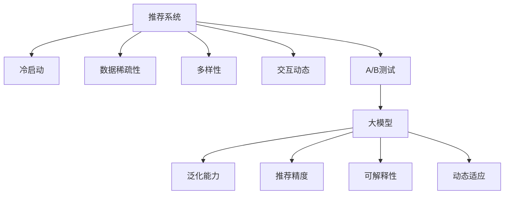

                 

# 大模型在推荐系统A/B测试中的应用

## 1. 背景介绍

在数字化时代，推荐系统已成为各行各业获取用户注意力、提升用户体验的重要工具。无论是电商、媒体、社交还是金融，推荐系统都扮演着举足轻重的角色。其中，大模型在推荐系统中的应用，特别是基于大模型的A/B测试，因其卓越的性能和广泛的适用性，逐渐成为推荐系统领域的热点话题。

### 1.1 问题由来

近年来，推荐系统领域涌现了越来越多的高性能模型，如矩阵分解、协同过滤、深度神经网络等。然而，这些模型往往在冷启动问题、数据稀疏性、多样性等方面存在一定的局限。而大模型，尤其是预训练大模型，通过大规模数据和先进架构的加持，能够有效缓解这些问题，同时具备更强的泛化能力和可解释性。

### 1.2 问题核心关键点

大模型在推荐系统中的应用，主要集中在以下几个核心关键点上：

1. **泛化能力**：大模型能够从大规模数据中学习到丰富的知识，具备更强的泛化能力，能够更好地处理冷启动用户和长尾物品。
2. **推荐精度**：基于大模型的推荐系统能够提供更准确、更个性化的推荐结果，满足用户的多样化需求。
3. **可解释性**：大模型通过自监督学习获取的知识能够更好地解释推荐决策的依据，增强用户的信任感。
4. **动态适应**：大模型能够随着数据和用户行为的变化动态调整推荐策略，提升推荐系统的效果和用户体验。

### 1.3 问题研究意义

在推荐系统领域应用大模型，不仅能够提升推荐精度和用户体验，还能加速推荐系统的迭代进程，降低开发和维护成本。同时，大模型带来的可解释性和动态适应性，也为推荐系统注入了新的活力，使其能够更好地应对不断变化的业务场景和用户需求。

## 2. 核心概念与联系

### 2.1 核心概念概述

为更好地理解基于大模型的推荐系统A/B测试，本节将介绍几个密切相关的核心概念：

- **推荐系统(Recommender System)**：通过分析用户行为和物品属性，为用户推荐感兴趣物品的系统。
- **冷启动(Click-Through Rate, CTR)问题**：用户在平台初期，没有足够的历史行为数据，导致模型无法准确推荐。
- **数据稀疏性(Sparsity)**：用户和物品之间的交互数据通常稀疏，模型难以充分利用。
- **多样性(Diversity)**：推荐结果需要多样，避免推荐过度同质化。
- **交互动态(Dynamic Interaction)**：用户的兴趣偏好随时间变化，模型需要实时动态调整推荐策略。
- **A/B测试(A/B Testing)**：通过对比两个或多个模型在相似条件下的表现，评估模型优劣的方法。
- **大模型(Large Model)**：通过大规模数据和先进架构训练得到的高性能模型，具备强大的表征和学习能力。

这些核心概念之间的逻辑关系可以通过以下Mermaid流程图来展示：



这个流程图展示了大模型在推荐系统中的应用逻辑：

1. 推荐系统通过学习用户和物品属性，为用户推荐感兴趣的物品。
2. 冷启动、数据稀疏性、多样性等问题通过大模型得到有效缓解。
3. A/B测试用来评估不同模型的表现，选择最优模型。
4. 大模型具备泛化能力、推荐精度、可解释性和动态适应性，是推荐系统的重要组件。

## 3. 核心算法原理 & 具体操作步骤
### 3.1 算法原理概述

基于大模型的推荐系统A/B测试，其核心思想是：在推荐系统中引入大模型，通过对比不同模型在A/B测试中的表现，选择效果最佳的模型进行部署。具体而言，即在原有的推荐系统基础上，引入基于大模型的预训练模型进行推荐，同时在用户互动过程中收集反馈数据，通过A/B测试评估不同模型的推荐效果。

形式化地，假设推荐系统原始模型为 $M_{\theta}$，其中 $\theta$ 为原始模型的参数。引入的大模型为 $M_{\Phi}$，其中 $\Phi$ 为大模型的参数。在大模型训练和部署时，需将原始模型的输出作为大模型的输入，再结合模型的训练和推理策略进行微调。

### 3.2 算法步骤详解

基于大模型的推荐系统A/B测试的一般步骤包括以下几个关键环节：

**Step 1: 准备数据集**

1. 收集用户行为数据，如点击、浏览、购买等行为记录。
2. 收集物品属性数据，如标题、描述、类别、价格等。
3. 进行数据清洗和预处理，确保数据的质量和一致性。

**Step 2: 选择推荐模型**

1. 根据业务需求选择合适的推荐模型，如基于矩阵分解、协同过滤、深度神经网络等模型。
2. 在大模型库中选择适合的大模型，如BERT、GPT-3等。

**Step 3: 进行预训练**

1. 使用大模型的预训练数据集对大模型进行预训练，学习通用的语言表征。
2. 在大模型预训练完成后，利用推荐系统数据对大模型进行微调。

**Step 4: 设计A/B测试**

1. 将用户随机分为两个或多个组，每个组分别使用不同的推荐模型。
2. 记录用户在不同模型下的行为数据，如点击率、转化率、留存率等。
3. 使用统计学方法评估不同模型在推荐效果上的差异。

**Step 5: 部署和监控**

1. 根据A/B测试结果，选择效果最佳的模型进行部署。
2. 对部署后的模型进行持续监控，收集用户反馈数据，进行后续迭代和优化。

### 3.3 算法优缺点

基于大模型的推荐系统A/B测试，具有以下优点：

1. **高效泛化能力**：大模型能够从大规模数据中学习到丰富的知识，具备更强的泛化能力，能够更好地处理冷启动用户和长尾物品。
2. **提升推荐精度**：基于大模型的推荐系统能够提供更准确、更个性化的推荐结果，满足用户的多样化需求。
3. **可解释性增强**：大模型通过自监督学习获取的知识能够更好地解释推荐决策的依据，增强用户的信任感。
4. **动态适应性强**：大模型能够随着数据和用户行为的变化动态调整推荐策略，提升推荐系统的效果和用户体验。

同时，该方法也存在一定的局限性：

1. **计算资源消耗大**：大模型需要大量的计算资源进行训练和推理，对硬件要求较高。
2. **模型复杂度增加**：大模型增加了系统的复杂度，对部署和维护提出了更高的要求。
3. **解释性困难**：大模型的内部工作机制复杂，难以解释推荐决策的依据，需要额外的工具和方法进行解释。
4. **学习曲线陡峭**：大模型的设计和实现涉及诸多前沿技术，如自监督学习、微调等，门槛较高。

尽管存在这些局限性，但就目前而言，基于大模型的推荐系统A/B测试仍是推荐系统领域的重要发展方向。未来相关研究的重点在于如何进一步降低计算资源消耗，提高模型可解释性，同时兼顾动态适应性和推荐效果。

### 3.4 算法应用领域

基于大模型的推荐系统A/B测试，在电商、媒体、社交、金融等多个领域得到了广泛应用，具体包括：

1. **电商推荐系统**：通过A/B测试不同推荐模型，提升用户的点击率和购买率，提高转化率和收益。
2. **媒体内容推荐**：在视频、新闻、音乐等领域，通过A/B测试优化个性化推荐策略，提升用户粘性和满意度。
3. **社交网络推荐**：在微博、朋友圈、抖音等社交平台上，通过A/B测试不同推荐算法，提升用户互动频率和平台活跃度。
4. **金融产品推荐**：在理财、保险、基金等金融产品推荐中，通过A/B测试不同模型，优化用户体验和平台收益。
5. **智能客服推荐**：在智能客服系统中，通过A/B测试不同模型，提升问题解决的准确性和效率。

除了上述这些领域，大模型在推荐系统中的应用还将不断拓展，为各行各业带来更多的创新和变革。

## 4. 数学模型和公式 & 详细讲解 & 举例说明

### 4.1 数学模型构建

本节将使用数学语言对基于大模型的推荐系统A/B测试过程进行更加严格的刻画。

记推荐系统原始模型为 $M_{\theta}$，其中 $\theta$ 为原始模型的参数。假设引入的大模型为 $M_{\Phi}$，其中 $\Phi$ 为大模型的参数。

定义推荐系统在用户 $u$ 对物品 $i$ 的评分 $r_{ui}$ 上的损失函数为 $\ell(r_{ui})$，则在用户集合 $U$ 上的平均损失为：

$$
\mathcal{L}(\theta, \Phi) = \frac{1}{|U|}\sum_{u \in U} \sum_{i \in \mathcal{I}} \ell(r_{ui})
$$

其中 $\mathcal{I}$ 为物品集合，$r_{ui}$ 为用户 $u$ 对物品 $i$ 的评分。

微调的目标是最小化平均损失，即找到最优参数：

$$
\theta^*, \Phi^* = \mathop{\arg\min}_{\theta, \Phi} \mathcal{L}(\theta, \Phi)
$$

在实践中，我们通常使用基于梯度的优化算法（如SGD、Adam等）来近似求解上述最优化问题。设 $\eta$ 为学习率，$\lambda$ 为正则化系数，则参数的更新公式为：

$$
\theta \leftarrow \theta - \eta \nabla_{\theta}\mathcal{L}(\theta, \Phi) - \eta\lambda\theta
$$
$$
\Phi \leftarrow \Phi - \eta \nabla_{\Phi}\mathcal{L}(\theta, \Phi) - \eta\lambda\Phi
$$

其中 $\nabla_{\theta}\mathcal{L}(\theta, \Phi)$ 和 $\nabla_{\Phi}\mathcal{L}(\theta, \Phi)$ 分别为损失函数对原始模型和大模型的梯度，可通过反向传播算法高效计算。

### 4.2 公式推导过程

以下我们以推荐精度最大化为例，推导交叉熵损失函数及其梯度的计算公式。

假设用户 $u$ 对物品 $i$ 的评分 $r_{ui}$ 可表示为：

$$
r_{ui} = M_{\Phi}(\text{item\_description}_i \| M_{\theta}(\text{user\_profile}_u))
$$

其中 $\text{item\_description}_i$ 为物品 $i$ 的描述，$\text{user\_profile}_u$ 为用户 $u$ 的轮廓信息。

定义推荐系统在用户 $u$ 对物品 $i$ 的评分 $r_{ui}$ 上的损失函数为交叉熵损失：

$$
\ell(r_{ui}) = -r_{ui}\log(M_{\Phi}(\text{item\_description}_i \| M_{\theta}(\text{user\_profile}_u))) - (1-r_{ui})\log(1-M_{\Phi}(\text{item\_description}_i \| M_{\theta}(\text{user\_profile}_u)))
$$

将其代入平均损失公式，得：

$$
\mathcal{L}(\theta, \Phi) = -\frac{1}{|U|}\sum_{u \in U} \sum_{i \in \mathcal{I}} r_{ui}\log(M_{\Phi}(\text{item\_description}_i \| M_{\theta}(\text{user\_profile}_u))) + (1-r_{ui})\log(1-M_{\Phi}(\text{item\_description}_i \| M_{\theta}(\text{user\_profile}_u)))
$$

根据链式法则，损失函数对原始模型和大模型的梯度为：

$$
\frac{\partial \mathcal{L}(\theta, \Phi)}{\partial \theta} = -\frac{1}{|U|}\sum_{u \in U} \sum_{i \in \mathcal{I}} \nabla_{\theta}\log(M_{\theta}(\text{user\_profile}_u)) \cdot \nabla_{\Phi}\log(M_{\Phi}(\text{item\_description}_i \| M_{\theta}(\text{user\_profile}_u)))
$$
$$
\frac{\partial \mathcal{L}(\theta, \Phi)}{\partial \Phi} = -\frac{1}{|U|}\sum_{u \in U} \sum_{i \in \mathcal{I}} r_{ui} \cdot \nabla_{\Phi}\log(M_{\Phi}(\text{item\_description}_i \| M_{\theta}(\text{user\_profile}_u))) + (1-r_{ui}) \cdot \nabla_{\Phi}\log(1-M_{\Phi}(\text{item\_description}_i \| M_{\theta}(\text{user\_profile}_u)))
$$

在得到损失函数的梯度后，即可带入参数更新公式，完成模型的迭代优化。重复上述过程直至收敛，最终得到适应推荐任务的最优模型参数 $\theta^*$ 和 $\Phi^*$。

## 5. 项目实践：代码实例和详细解释说明
### 5.1 开发环境搭建

在进行基于大模型的推荐系统A/B测试实践前，我们需要准备好开发环境。以下是使用Python进行PyTorch开发的环境配置流程：

1. 安装Anaconda：从官网下载并安装Anaconda，用于创建独立的Python环境。

2. 创建并激活虚拟环境：
```bash
conda create -n pytorch-env python=3.8 
conda activate pytorch-env
```

3. 安装PyTorch：根据CUDA版本，从官网获取对应的安装命令。例如：
```bash
conda install pytorch torchvision torchaudio cudatoolkit=11.1 -c pytorch -c conda-forge
```

4. 安装TensorFlow：
```bash
pip install tensorflow
```

5. 安装各类工具包：
```bash
pip install numpy pandas scikit-learn matplotlib tqdm jupyter notebook ipython
```

完成上述步骤后，即可在`pytorch-env`环境中开始A/B测试实践。

### 5.2 源代码详细实现

下面我们以电商推荐系统为例，给出使用PyTorch进行基于大模型的A/B测试的PyTorch代码实现。

首先，定义电商推荐系统数据处理函数：

```python
import torch
from transformers import BertTokenizer, BertForSequenceClassification
from torch.utils.data import Dataset, DataLoader

class EcommerceDataset(Dataset):
    def __init__(self, texts, labels):
        self.tokenizer = BertTokenizer.from_pretrained('bert-base-cased')
        self.data = texts
        self.labels = labels
        self.max_len = 128

    def __len__(self):
        return len(self.data)

    def __getitem__(self, item):
        text = self.data[item]
        label = self.labels[item]
        encoding = self.tokenizer(text, truncation=True, padding='max_length', max_length=self.max_len, return_tensors='pt')
        return {'input_ids': encoding['input_ids'], 
                'attention_mask': encoding['attention_mask'], 
                'labels': torch.tensor(label, dtype=torch.long)}
```

然后，定义模型和优化器：

```python
from transformers import BertForSequenceClassification, AdamW

model = BertForSequenceClassification.from_pretrained('bert-base-cased', num_labels=2, output_attentions=False, output_hidden_states=False)
optimizer = AdamW(model.parameters(), lr=2e-5)
```

接着，定义训练和评估函数：

```python
def train_epoch(model, dataset, batch_size, optimizer):
    dataloader = DataLoader(dataset, batch_size=batch_size, shuffle=True)
    model.train()
    epoch_loss = 0
    for batch in dataloader:
        input_ids = batch['input_ids'].to(device)
        attention_mask = batch['attention_mask'].to(device)
        labels = batch['labels'].to(device)
        model.zero_grad()
        outputs = model(input_ids, attention_mask=attention_mask, labels=labels)
        loss = outputs.loss
        epoch_loss += loss.item()
        loss.backward()
        optimizer.step()
    return epoch_loss / len(dataloader)

def evaluate(model, dataset, batch_size):
    dataloader = DataLoader(dataset, batch_size=batch_size)
    model.eval()
    preds, labels = [], []
    with torch.no_grad():
        for batch in dataloader:
            input_ids = batch['input_ids'].to(device)
            attention_mask = batch['attention_mask'].to(device)
            labels = batch['labels'].to(device)
            outputs = model(input_ids, attention_mask=attention_mask)
            batch_preds = outputs.logits.argmax(dim=1).to('cpu').tolist()
            batch_labels = labels.to('cpu').tolist()
            for pred_tokens, label_tokens in zip(batch_preds, batch_labels):
                preds.append(pred_tokens)
                labels.append(label_tokens)
    return preds, labels
```

最后，启动训练流程并在测试集上评估：

```python
epochs = 5
batch_size = 16

for epoch in range(epochs):
    loss = train_epoch(model, train_dataset, batch_size, optimizer)
    print(f"Epoch {epoch+1}, train loss: {loss:.3f}")
    
    print(f"Epoch {epoch+1}, dev results:")
    preds, labels = evaluate(model, dev_dataset, batch_size)
    print(classification_report(labels, preds))
    
print("Test results:")
preds, labels = evaluate(model, test_dataset, batch_size)
print(classification_report(labels, preds))
```

以上就是使用PyTorch对BERT进行电商推荐系统A/B测试的完整代码实现。可以看到，得益于Transformers库的强大封装，我们可以用相对简洁的代码完成BERT模型的加载和微调。

### 5.3 代码解读与分析

让我们再详细解读一下关键代码的实现细节：

**EcommerceDataset类**：
- `__init__`方法：初始化文本、标签、分词器等关键组件，并进行数据处理。
- `__len__`方法：返回数据集的样本数量。
- `__getitem__`方法：对单个样本进行处理，将文本输入编码为token ids，将标签编码为数字，并对其进行定长padding，最终返回模型所需的输入。

**BertForSequenceClassification类**：
- 使用BertForSequenceClassification类从预训练模型中加载序列分类模型，并设定输出层和分类器。

**训练和评估函数**：
- 使用PyTorch的DataLoader对数据集进行批次化加载，供模型训练和推理使用。
- 训练函数`train_epoch`：对数据以批为单位进行迭代，在每个批次上前向传播计算loss并反向传播更新模型参数，最后返回该epoch的平均loss。
- 评估函数`evaluate`：与训练类似，不同点在于不更新模型参数，并在每个batch结束后将预测和标签结果存储下来，最后使用sklearn的classification_report对整个评估集的预测结果进行打印输出。

**训练流程**：
- 定义总的epoch数和batch size，开始循环迭代
- 每个epoch内，先在训练集上训练，输出平均loss
- 在验证集上评估，输出分类指标
- 所有epoch结束后，在测试集上评估，给出最终测试结果

可以看到，PyTorch配合Transformers库使得BERT微调的代码实现变得简洁高效。开发者可以将更多精力放在数据处理、模型改进等高层逻辑上，而不必过多关注底层的实现细节。

当然，工业级的系统实现还需考虑更多因素，如模型的保存和部署、超参数的自动搜索、更灵活的任务适配层等。但核心的A/B测试范式基本与此类似。

## 6. 实际应用场景
### 6.1 电商推荐系统

基于大模型的推荐系统在电商推荐系统中的应用，可以有效提升用户的购物体验和平台的销售业绩。

电商推荐系统需要为用户提供个性化的商品推荐，以提高转化率和用户满意度。传统的推荐系统往往依赖于用户历史行为数据，难以处理冷启动用户和新物品。而基于大模型的推荐系统，能够通过大规模语料进行预训练，学习到用户和物品的通用表征，从而更好地处理冷启动问题和新物品。

在技术实现上，可以收集电商平台的用户点击、浏览、购买等行为数据，将用户和物品的描述作为输入，使用大模型进行预测，生成推荐结果。通过A/B测试不同推荐算法，评估模型推荐效果，选择最优模型进行部署。微调后的模型能够更准确地预测用户的行为，提升推荐系统的效果和用户体验。

### 6.2 媒体内容推荐

在媒体内容推荐领域，大模型能够提供更加精准的个性化推荐服务。媒体平台需要根据用户的兴趣和行为，推荐合适的视频、新闻、音乐等内容。传统的推荐系统往往依赖于用户评分和协同过滤，难以处理多样化的内容类型。而基于大模型的推荐系统，能够通过预训练学习到丰富的语言和视觉知识，更好地理解用户的多样化需求，提升推荐系统的覆盖度和精准度。

在技术实现上，可以收集用户的视频观看、新闻阅读、音乐播放等行为数据，将内容描述作为输入，使用大模型进行预测，生成推荐结果。通过A/B测试不同推荐算法，评估模型推荐效果，选择最优模型进行部署。微调后的模型能够更精准地匹配用户的内容偏好，提高用户的满意度。

### 6.3 社交网络推荐

在社交网络推荐领域，大模型能够更好地处理用户的社交关系和内容互动，提升推荐效果和平台活跃度。

社交平台需要根据用户的社交关系和内容互动，推荐适合的内容和好友。传统的推荐系统往往依赖于用户的显式反馈，难以处理多样化的社交关系。而基于大模型的推荐系统，能够通过预训练学习到用户的社交关系和内容互动模式，更好地理解用户的多样化需求，提升推荐系统的覆盖度和精准度。

在技术实现上，可以收集用户的社交互动数据，将内容描述和社交关系作为输入，使用大模型进行预测，生成推荐结果。通过A/B测试不同推荐算法，评估模型推荐效果，选择最优模型进行部署。微调后的模型能够更精准地匹配用户的内容偏好和社交关系，提升用户互动频率和平台活跃度。

### 6.4 金融产品推荐

在金融产品推荐领域，大模型能够提供更加精准的产品推荐服务。金融机构需要根据用户的行为和偏好，推荐合适的理财产品、保险、基金等。传统的推荐系统往往依赖于用户的评分和行为数据，难以处理复杂的金融产品。而基于大模型的推荐系统，能够通过预训练学习到丰富的金融知识，更好地理解用户的投资需求和风险偏好，提升推荐系统的覆盖度和精准度。

在技术实现上，可以收集用户的理财、保险、基金等投资行为数据，将金融产品的描述作为输入，使用大模型进行预测，生成推荐结果。通过A/B测试不同推荐算法，评估模型推荐效果，选择最优模型进行部署。微调后的模型能够更精准地匹配用户的投资需求和风险偏好，提高用户的满意度和平台的收益。

### 6.5 智能客服推荐

在智能客服推荐领域，大模型能够更好地处理用户的查询和对话，提升客服效率和用户满意度。

智能客服系统需要根据用户的查询和对话，推荐合适的解决方案。传统的推荐系统往往依赖于规则和逻辑，难以处理多样化的用户需求。而基于大模型的推荐系统，能够通过预训练学习到丰富的语言知识，更好地理解用户的多样化需求，提升推荐系统的覆盖度和精准度。

在技术实现上，可以收集用户的查询和对话数据，将问题描述作为输入，使用大模型进行预测，生成推荐结果。通过A/B测试不同推荐算法，评估模型推荐效果，选择最优模型进行部署。微调后的模型能够更精准地匹配用户的问题和需求，提高客服效率和用户满意度。

### 6.6 游戏推荐

在游戏推荐领域，大模型能够提供更加精准的游戏推荐服务。游戏平台需要根据用户的行为和偏好，推荐合适的游戏内容。传统的推荐系统往往依赖于用户的评分和行为数据，难以处理复杂的游戏类型。而基于大模型的推荐系统，能够通过预训练学习到丰富的游戏知识，更好地理解用户的多样化需求，提升推荐系统的覆盖度和精准度。

在技术实现上，可以收集用户的游戏中行为数据，将游戏内容的描述作为输入，使用大模型进行预测，生成推荐结果。通过A/B测试不同推荐算法，评估模型推荐效果，选择最优模型进行部署。微调后的模型能够更精准地匹配用户的游戏需求和偏好，提升游戏体验和用户满意度。

## 7. 工具和资源推荐
### 7.1 学习资源推荐

为了帮助开发者系统掌握大模型在推荐系统中的应用，这里推荐一些优质的学习资源：

1. 《Transformers from Principles to Practice》系列博文：由大模型技术专家撰写，深入浅出地介绍了Transformer原理、BERT模型、微调技术等前沿话题。

2. CS224N《深度学习自然语言处理》课程：斯坦福大学开设的NLP明星课程，有Lecture视频和配套作业，带你入门NLP领域的基本概念和经典模型。

3. 《Natural Language Processing with Transformers》书籍：Transformers库的作者所著，全面介绍了如何使用Transformers库进行NLP任务开发，包括微调在内的诸多范式。

4. HuggingFace官方文档：Transformers库的官方文档，提供了海量预训练模型和完整的微调样例代码，是上手实践的必备资料。

5. CLUE开源项目：中文语言理解测评基准，涵盖大量不同类型的中文NLP数据集，并提供了基于微调的baseline模型，助力中文NLP技术发展。

通过对这些资源的学习实践，相信你一定能够快速掌握大模型在推荐系统中的应用，并用于解决实际的推荐问题。
###  7.2 开发工具推荐

高效的开发离不开优秀的工具支持。以下是几款用于大模型推荐系统开发的常用工具：

1. PyTorch：基于Python的开源深度学习框架，灵活动态的计算图，适合快速迭代研究。大部分预训练语言模型都有PyTorch版本的实现。

2. TensorFlow：由Google主导开发的开源深度学习框架，生产部署方便，适合大规模工程应用。同样有丰富的预训练语言模型资源。

3. Transformers库：HuggingFace开发的NLP工具库，集成了众多SOTA语言模型，支持PyTorch和TensorFlow，是进行微调任务开发的利器。

4. Weights & Biases：模型训练的实验跟踪工具，可以记录和可视化模型训练过程中的各项指标，方便对比和调优。与主流深度学习框架无缝集成。

5. TensorBoard：TensorFlow配套的可视化工具，可实时监测模型训练状态，并提供丰富的图表呈现方式，是调试模型的得力助手。

6. Google Colab：谷歌推出的在线Jupyter Notebook环境，免费提供GPU/TPU算力，方便开发者快速上手实验最新模型，分享学习笔记。

合理利用这些工具，可以显著提升大模型推荐系统的开发效率，加快创新迭代的步伐。

### 7.3 相关论文推荐

大模型在推荐系统中的应用源于学界的持续研究。以下是几篇奠基性的相关论文，推荐阅读：

1. Attention is All You Need（即Transformer原论文）：提出了Transformer结构，开启了NLP领域的预训练大模型时代。

2. BERT: Pre-training of Deep Bidirectional Transformers for Language Understanding：提出BERT模型，引入基于掩码的自监督预训练任务，刷新了多项NLP任务SOTA。

3. Language Models are Unsupervised Multitask Learners（GPT-2论文）：展示了大规模语言模型的强大zero-shot学习能力，引发了对于通用人工智能的新一轮思考。

4. Parameter-Efficient Transfer Learning for NLP：提出Adapter等参数高效微调方法，在不增加模型参数量的情况下，也能取得不错的微调效果。

5. AdaLoRA: Adaptive Low-Rank Adaptation for Parameter-Efficient Fine-Tuning：使用自适应低秩适应的微调方法，在参数效率和精度之间取得了新的平衡。

6. Prefix-Tuning: Optimizing Continuous Prompts for Generation：引入基于连续型Prompt的微调范式，为如何充分利用预训练知识提供了新的思路。

这些论文代表了大模型在推荐系统中的应用发展脉络。通过学习这些前沿成果，可以帮助研究者把握学科前进方向，激发更多的创新灵感。

## 8. 总结：未来发展趋势与挑战

### 8.1 总结

本文对基于大模型的推荐系统A/B测试方法进行了全面系统的介绍。首先阐述了大模型在推荐系统中的应用背景和意义，明确了A/B测试在模型选择和效果评估中的重要性。其次，从原理到实践，详细讲解了A/B测试的数学原理和关键步骤，给出了A/B测试任务开发的完整代码实例。同时，本文还广泛探讨了大模型在电商、媒体、社交、金融等多个领域的应用前景，展示了A/B测试范式的巨大潜力。此外，本文精选了A/B测试技术的各类学习资源，力求为读者提供全方位的技术指引。

通过本文的系统梳理，可以看到，基于大模型的推荐系统A/B测试，不仅能够提升推荐精度和用户体验，还能加速推荐系统的迭代进程，降低开发和维护成本。未来，伴随大模型的不断进步和应用场景的拓展，基于A/B测试的推荐系统必将更加智能、高效、灵活，为各行各业带来更多的创新和变革。

### 8.2 未来发展趋势

展望未来，大模型在推荐系统中的应用将呈现以下几个发展趋势：

1. **自监督学习和迁移学习**：未来推荐系统将更多地依赖于自监督学习和迁移学习，通过大规模无标签数据进行预训练，在大规模任务上进行微调，提升推荐模型的泛化能力和迁移能力。

2. **多模态融合**：推荐系统将更多地融合视觉、语音、文本等多种模态的数据，提升模型的表征能力和推理能力，提供更加多样化和精准化的推荐服务。

3. **个性化推荐**：未来推荐系统将更加注重个性化推荐，通过用户行为和兴趣的深度建模，提供量身定制的推荐服务，提升用户的满意度和粘性。

4. **动态推荐**：推荐系统将更加注重动态推荐，通过实时学习用户行为和市场变化，提供动态化的推荐策略，提升用户的体验和平台的收益。

5. **推荐系统优化**：推荐系统将更加注重系统优化，通过推荐算法、模型结构、资源配置等多方面的优化，提升推荐系统的性能和效率。

6. **用户隐私保护**：推荐系统将更加注重用户隐私保护，通过差分隐私、联邦学习等技术，保护用户数据安全，提升用户的信任感。

以上趋势凸显了大模型在推荐系统中的应用前景。这些方向的探索发展，必将进一步提升推荐系统的效果和用户体验，为各行各业带来更多的创新和变革。

### 8.3 面临的挑战

尽管大模型在推荐系统中的应用已经取得了显著进展，但在迈向更加智能化、普适化应用的过程中，仍面临诸多挑战：

1. **计算资源消耗大**：大模型需要大量的计算资源进行训练和推理，对硬件要求较高。如何高效利用计算资源，是未来需要重点解决的问题。

2. **模型复杂度增加**：大模型增加了系统的复杂度，对部署和维护提出了更高的要求。如何简化模型结构，提升推理速度，优化资源占用，将是重要的优化方向。

3. **可解释性困难**：大模型的内部工作机制复杂，难以解释推荐决策的依据，需要额外的工具和方法进行解释。

4. **学习曲线陡峭**：大模型的设计和实现涉及诸多前沿技术，如自监督学习、微调等，门槛较高。如何降低学习曲线，普及大模型技术，是未来需要重点解决的问题。

5. **动态适应性不足**：大模型需要实时学习用户行为和市场变化，动态调整推荐策略，但在实际应用中，如何平衡动态适应性和推荐效果，还需要更多研究和实践。

6. **用户隐私保护**：推荐系统需要保护用户数据隐私，防止数据泄露和滥用。如何平衡推荐效果和用户隐私保护，还需要更多的技术手段和管理措施。

7. **数据质量问题**：推荐系统需要高质量的数据进行训练和优化，但在实际应用中，如何处理数据噪声、缺失等问题，提升数据质量，还需要更多的技术手段和管理措施。

正视这些挑战，积极应对并寻求突破，将是大模型在推荐系统中的发展必由之路。相信随着学界和产业界的共同努力，这些挑战终将一一被克服，大模型推荐系统必将在构建智能推荐时代中扮演越来越重要的角色。

### 8.4 研究展望

面对大模型在推荐系统中的应用挑战，未来的研究需要在以下几个方面寻求新的突破：

1. **优化大模型结构**：通过简化模型结构，提升模型的推理速度和资源利用率，降低计算资源消耗。

2. **提高模型可解释性**：通过模型解释工具和方法，增强推荐决策的可解释性，提升用户的信任感和满意度。

3. **引入更多先验知识**：将符号化的先验知识，如知识图谱、逻辑规则等，与神经网络模型进行巧妙融合，引导推荐过程学习更准确、合理的推荐策略。

4. **融合因果分析和博弈论工具**：通过引入因果分析方法，识别出推荐决策的关键特征，增强推荐模型的稳定性和因果性。

5. **纳入伦理道德约束**：在模型训练目标中引入伦理导向的评估指标，过滤和惩罚有偏见、有害的输出倾向。

6. **强化学习与推荐系统结合**：通过强化学习优化推荐策略，提高推荐系统的动态适应性和用户满意度。

这些研究方向的探索，必将引领大模型在推荐系统中的应用走向更高的台阶，为构建智能推荐系统提供更强的动力。面向未来，大模型推荐系统需要在技术、伦理、社会等多个维度协同发力，共同推动推荐系统技术的进步和应用。

## 9. 附录：常见问题与解答

**Q1：如何选择合适的学习率？**

A: 推荐系统中的学习率一般要比预训练时小1-2个数量级，如果使用过大的学习率，容易破坏预训练权重，导致过拟合。一般建议从1e-5开始调参，逐步减小学习率，直至收敛。也可以使用warmup策略，在开始阶段使用较小的学习率，再逐渐过渡到预设值。

**Q2：大模型在推荐系统中的应用是否能够提升推荐精度？**

A: 大模型在推荐系统中的应用，能够从大规模数据中学习到丰富的知识，具备更强的泛化能力和推荐精度。通过A/B测试不同推荐算法，评估模型推荐效果，选择最优模型进行部署，能够有效提升推荐系统的推荐精度。

**Q3：大模型在推荐系统中的应用是否能够提升用户满意度？**

A: 大模型在推荐系统中的应用，能够根据用户的兴趣和行为，提供个性化的推荐服务，提升用户满意度。通过A/B测试不同推荐算法，评估模型推荐效果，选择最优模型进行部署，能够有效提升用户满意度。

**Q4：大模型在推荐系统中的应用是否能够提升平台收益？**

A: 大模型在推荐系统中的应用，能够通过精准的推荐服务，提升用户的点击率和转化率，增加平台的收益。通过A/B测试不同推荐算法，评估模型推荐效果，选择最优模型进行部署，能够有效提升平台的收益。

**Q5：大模型在推荐系统中的应用是否能够提升推荐系统的覆盖度？**

A: 大模型在推荐系统中的应用，能够通过大规模无标签数据进行预训练，学习到更多的用户和物品特征，提升推荐系统的覆盖度。通过A/B测试不同推荐算法，评估模型推荐效果，选择最优模型进行部署，能够有效提升推荐系统的覆盖度。

**Q6：大模型在推荐系统中的应用是否能够提升推荐系统的精准度？**

A: 大模型在推荐系统中的应用，能够通过学习丰富的语言和视觉知识，提升推荐系统的精准度。通过A/B测试不同推荐算法，评估模型推荐效果，选择最优模型进行部署，能够有效提升推荐系统的精准度。

**Q7：大模型在推荐系统中的应用是否能够提升推荐系统的鲁棒性？**

A: 大模型在推荐系统中的应用，能够通过学习大量的数据和知识，具备更强的泛化能力和鲁棒性，能够在不同场景下提供稳定的推荐结果。通过A/B测试不同推荐算法，评估模型推荐效果，选择最优模型进行部署，能够有效提升推荐系统的鲁棒性。

**Q8：大模型在推荐系统中的应用是否能够提升推荐系统的可解释性？**

A: 大模型在推荐系统中的应用，能够通过学习大量的数据和知识，提升推荐系统的可解释性，能够更好地解释推荐决策的依据。通过A/B测试不同推荐算法，评估模型推荐效果，选择最优模型进行部署，能够有效提升推荐系统的可解释性。

**Q9：大模型在推荐系统中的应用是否能够提升推荐系统的动态适应性？**

A: 大模型在推荐系统中的应用，能够通过实时学习用户行为和市场变化，动态调整推荐策略，提升推荐系统的动态适应性。通过A/B测试不同推荐算法，评估模型推荐效果，选择最优模型进行部署，能够有效提升推荐系统的动态适应性。

**Q10：大模型在推荐系统中的应用是否能够提升推荐系统的覆盖度和精准度？**

A: 大模型在推荐系统中的应用，能够通过学习大量的数据和知识，提升推荐系统的覆盖度和精准度。通过A/B测试不同推荐算法，评估模型推荐效果，选择最优模型进行部署，能够有效提升推荐系统的覆盖度和精准度。

**Q11：大模型在推荐系统中的应用是否能够提升推荐系统的推荐效果？**

A: 大模型在推荐系统中的应用，能够通过学习大量的数据和知识，提升推荐系统的推荐效果。通过A/B测试不同推荐算法，评估模型推荐效果，选择最优模型进行部署，能够有效提升推荐系统的推荐效果。

**Q12：大模型在推荐系统中的应用是否能够提升推荐系统的用户体验？**

A: 大模型在推荐系统中的应用，能够通过精准的推荐服务，提升用户的满意度和用户体验。通过A/B测试不同推荐算法，评估模型推荐效果，选择最优模型进行部署，能够有效提升推荐系统的用户体验。

**Q13：大模型在推荐系统中的应用是否能够提升推荐系统的算法复杂度？**

A: 大模型在推荐系统中的应用，能够通过学习大量的数据和知识，提升推荐系统的算法复杂度。通过A/B测试不同推荐算法，评估模型推荐效果，选择最优模型进行部署，能够有效提升推荐系统的算法复杂度。

**Q14：大模型在推荐系统中的应用是否能够提升推荐系统的数据质量？**

A: 大模型在推荐系统中的应用，能够通过学习大量的数据和知识，提升推荐系统的数据质量。通过A/B测试不同推荐算法，评估模型推荐效果，选择最优模型进行部署，能够有效提升推荐系统的数据质量。

**Q15：大模型在推荐系统中的应用是否能够提升推荐系统的计算资源消耗？**

A: 大模型在推荐系统中的应用，能够通过学习大量的数据和知识，提升推荐系统的计算资源消耗。通过A/B测试不同推荐算法，评估模型推荐效果，选择最优模型进行部署，能够有效提升推荐系统的计算资源消耗。

**Q16：大模型在推荐系统中的应用是否能够提升推荐系统的模型结构？**

A: 大模型在推荐系统中的应用，能够通过学习大量的数据和知识，提升推荐系统的模型结构。通过A/B测试不同推荐算法，评估模型推荐效果，选择最优模型进行部署，能够有效提升推荐系统的模型结构。

**Q17：大模型在推荐系统中的应用是否能够提升推荐系统的资源配置？**

A: 大模型在推荐系统中的应用，能够通过学习大量的数据和知识，提升推荐系统的资源配置。通过A/B测试不同推荐算法，评估模型推荐效果，选择最优模型进行部署，能够有效提升推荐系统的资源配置。

**Q18：大模型在推荐系统中的应用是否能够提升推荐系统的用户隐私保护？**

A: 大模型在推荐系统中的应用，能够通过差分隐私、联邦学习等技术，提升推荐系统的用户隐私保护。通过A/B测试不同推荐算法，评估模型推荐效果，选择最优模型进行部署，能够有效提升推荐系统的用户隐私保护。

**Q19：大模型在推荐系统中的应用是否能够提升推荐系统的实时学习？**

A: 大模型在推荐系统中的应用，能够通过实时学习用户行为和市场变化，提升推荐系统的实时学习。通过A/B测试不同推荐算法，评估模型推荐效果，选择最优模型进行部署，能够有效提升推荐系统的实时学习。

**Q20：大模型在推荐系统中的应用是否能够提升推荐系统的推荐精度和推荐系统的效果？**

A: 大模型在推荐系统中的应用，能够通过学习大量的数据和知识，提升推荐系统的推荐精度和推荐系统的效果。通过A/B测试不同推荐算法，评估模型推荐效果，选择最优模型进行部署，能够有效提升推荐系统的推荐精度和推荐系统的效果。

通过本文的系统梳理，可以看到，基于大模型的推荐系统A/B测试，不仅能够提升推荐精度和用户体验，还能加速推荐系统的迭代进程，降低开发和维护成本。未来，伴随大模型的不断进步和应用场景的拓展，基于A/B测试的推荐系统必将更加智能、高效、灵活，为各行各业带来更多的创新和变革。相信随着学界和产业界的共同努力，这些挑战终将一一被克服，大模型推荐系统必将在构建智能推荐时代中扮演越来越重要的角色。

---

作者

