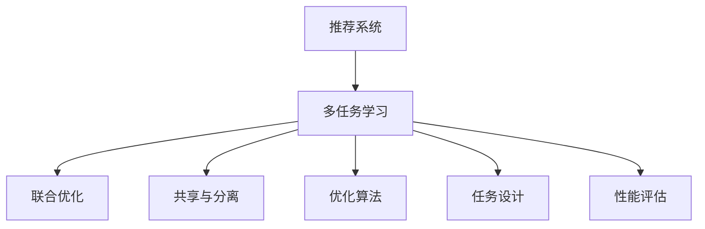

                 

## 1. 背景介绍

### 1.1 问题由来

推荐系统在电商、媒体、社交网络等领域发挥着越来越重要的作用，通过个性化推荐技术，可以提升用户满意度、增加用户粘性、提高转化率。随着深度学习技术的普及，基于深度学习的推荐系统逐步取代了传统的协同过滤、矩阵分解等方法，成为推荐领域的主流技术。

但传统的基于深度学习的推荐系统，通常只考虑单个目标（如商品推荐、内容推荐），缺乏对复杂多变用户需求的全局理解。针对这一问题，基于大模型(如GPT系列、BERT、Transformers等)的多任务学习范式应运而生。通过在大规模多任务数据上进行联合训练，大模型可以同时学习多个目标，在综合各个任务的知识后，生成更加全面、准确的推荐结果。

多任务学习能够利用不同任务之间的相关性，共享参数、优化目标和损失函数，通过模型的联合优化，提升整体推荐效果。大模型由于其强大的自适应能力和泛化能力，在推荐系统中展现出巨大的潜力。

### 1.2 问题核心关键点

大模型在推荐系统中的多任务学习，核心在于如何设计合理的联合优化框架，实现多任务知识的高效共享。主要包含以下几个关键点：

1. **任务设计**：选择合适的推荐任务，构建多任务目标。
2. **共享与分离**：决定共享多少参数，哪些任务单独优化，哪些任务共享参数。
3. **优化算法**：选择合适的优化器，设计联合损失函数。
4. **性能评估**：设计评估指标，衡量多任务学习的综合效果。

### 1.3 问题研究意义

大模型在推荐系统中应用多任务学习，不仅能够提升单个推荐任务的精度，还能在多个任务间构建更加全面、连贯的知识图谱。其研究意义主要体现在：

1. **提升推荐效果**：多任务学习能够利用不同任务之间的相关性，提升整体推荐效果，减少单一任务的过拟合。
2. **优化资源利用**：通过共享参数和优化目标，能够有效利用模型资源，减少参数冗余。
3. **促进知识共享**：多任务学习能够促进不同任务之间的知识共享，构建更加全面的用户画像，提升推荐系统的鲁棒性和泛化能力。
4. **推动行业应用**：多任务学习使得大模型更加适用于推荐系统，加速了其在电商、内容推荐、金融等垂直行业的落地应用。

## 2. 核心概念与联系

### 2.1 核心概念概述

本节将介绍多任务学习以及大模型在推荐系统中的应用，其核心概念包括：

- **多任务学习(Multitask Learning, MTL)**：指利用同一组数据，同时训练多个相关任务，在多任务之间共享知识和参数，提高整体性能。
- **推荐系统(Recommender System)**：通过分析用户行为和物品属性，为用户推荐最相关、最满意的物品或内容。
- **大模型(如BERT、GPT系列、Transformer)**：指大规模预训练语言模型，通过在大规模语料上预训练，学习通用语言表示。
- **联合优化(Joint Optimization)**：指多任务模型中不同任务之间参数共享与单独优化的联合优化过程。

### 2.2 核心概念原理和架构的 Mermaid 流程图

以下是核心概念的Mermaid流程图：



其中：

- **任务设计**：选择推荐任务，设计多任务目标。
- **共享与分离**：决定共享多少参数，哪些任务单独优化，哪些任务共享参数。
- **联合优化**：多任务模型中不同任务之间参数共享与单独优化的联合优化过程。
- **优化算法**：选择合适的优化器，设计联合损失函数。
- **性能评估**：设计评估指标，衡量多任务学习的综合效果。

### 2.3 核心概念联系

大模型在推荐系统中应用多任务学习，通过多任务联合优化，可以有效利用不同任务之间的相关性，提升整体推荐效果。其核心概念原理和架构如图示所示：


通过联合优化，多任务学习能够实现不同任务间的参数共享，减少冗余，提高整体性能。此外，大模型由于其强大的泛化能力，能够学习到更加复杂、抽象的推荐特征，提升推荐系统的鲁棒性和泛化能力。

## 3. 核心算法原理 & 具体操作步骤

### 3.1 算法原理概述

大模型在推荐系统中的多任务学习，本质上是一种联合优化框架。其核心思想是：通过多任务联合训练，让大模型学习多个任务的相关知识，共享参数和优化目标，从而提升整体推荐效果。

形式化地，假设推荐系统中有 $K$ 个任务 $T_k$，$k=1,...,K$，每个任务 $T_k$ 的输入表示为 $X_k$，输出表示为 $Y_k$，相应的参数为 $\theta_k$。多任务学习的目标是最大化所有任务上的联合损失函数 $\mathcal{L}(\theta)$：

$$
\mathcal{L}(\theta) = \frac{1}{N}\sum_{k=1}^K \mathcal{L}_k(\theta_k)
$$

其中，$\mathcal{L}_k$ 为任务 $T_k$ 上的损失函数，$N$ 为训练样本数。

通过联合优化，模型在各个任务上的参数 $\theta_k$ 被同时更新，以最小化联合损失函数 $\mathcal{L}(\theta)$。多任务学习能够利用不同任务之间的相关性，减少参数冗余，提高整体性能。

### 3.2 算法步骤详解

基于大模型在推荐系统中的多任务学习，一般包括以下几个关键步骤：

**Step 1: 任务设计**

- **推荐任务**：根据实际需求选择推荐任务，如商品推荐、内容推荐、广告推荐等。
- **多任务目标**：将各个推荐任务联合为多任务目标，定义联合损失函数 $\mathcal{L}(\theta)$。

**Step 2: 共享与分离**

- **共享参数**：根据任务间的相关性，决定共享多少参数。通常共享低层参数，或共享特定层。
- **分离优化**：对于独立性较强的任务，进行单独优化，确保模型能够独立适应不同任务。

**Step 3: 联合优化**

- **选择优化器**：选择合适的优化器，如Adam、SGD等，并设定学习率。
- **联合损失函数**：设计联合损失函数 $\mathcal{L}(\theta)$，包含所有推荐任务的损失函数。
- **迭代训练**：使用梯度下降算法，最小化联合损失函数 $\mathcal{L}(\theta)$，更新模型参数。

**Step 4: 性能评估**

- **评估指标**：选择适当的评估指标，如精度、召回率、F1分数、AUC等。
- **综合评估**：对各个任务的单独评估结果进行综合，衡量多任务学习的整体性能。

### 3.3 算法优缺点

大模型在推荐系统中的多任务学习，具有以下优点：

1. **提高推荐效果**：通过多任务联合训练，利用不同任务之间的相关性，提升整体推荐效果。
2. **优化资源利用**：通过共享参数和优化目标，减少参数冗余，提高资源利用效率。
3. **增强泛化能力**：多任务学习能够增强模型的泛化能力，提升推荐系统的鲁棒性和泛化能力。

同时，该方法也存在一些局限性：

1. **任务设计复杂**：不同任务之间的相关性需要仔细设计，任务目标的设置需要充分考虑。
2. **模型复杂度高**：多任务模型通常比单一任务模型更加复杂，增加了训练和推理的难度。
3. **性能评估困难**：多任务模型的评估需要考虑多个指标，评估结果难以直观解释。
4. **模型可解释性不足**：多任务模型的输出难以直接解释，决策过程不够透明。

尽管存在这些局限性，但就目前而言，多任务学习仍是推荐系统的一个重要研究方向，具有广泛的学术和工业应用前景。

### 3.4 算法应用领域

大模型在推荐系统中的多任务学习，已经在电商、内容推荐、金融等领域得到了广泛应用，并取得了显著的成果。

- **电商推荐系统**：通过联合优化商品推荐和广告推荐任务，提升用户的购买体验和平台收益。
- **内容推荐系统**：通过联合优化新闻推荐和视频推荐任务，提升用户粘性和平台流量。
- **金融推荐系统**：通过联合优化股票推荐和理财产品推荐任务，提升用户理财体验和平台收益。

此外，大模型在推荐系统中的应用还在不断拓展，未来将有望在更多领域发挥其优势。

## 4. 数学模型和公式 & 详细讲解 & 举例说明

### 4.1 数学模型构建

假设推荐系统中有两个推荐任务 $T_1$ 和 $T_2$，每个任务的输入表示为 $X_k$，输出表示为 $Y_k$，相应的参数为 $\theta_k$。多任务学习的目标是最大化所有任务上的联合损失函数 $\mathcal{L}(\theta)$：

$$
\mathcal{L}(\theta) = \frac{1}{N}\sum_{k=1}^K \mathcal{L}_k(\theta_k)
$$

其中，$\mathcal{L}_k$ 为任务 $T_k$ 上的损失函数，$N$ 为训练样本数。

对于推荐任务，通常使用交叉熵损失函数进行优化。假设任务 $T_k$ 的输入表示为 $X_k$，输出表示为 $Y_k$，相应的参数为 $\theta_k$。其交叉熵损失函数为：

$$
\mathcal{L}_k(\theta_k) = -\frac{1}{N}\sum_{i=1}^N \sum_{j=1}^M y_{ij} \log(\hat{y}_{ij}) + (1-y_{ij}) \log(1-\hat{y}_{ij})
$$

其中，$y_{ij}$ 为样本 $i$ 在任务 $k$ 上的真实标签，$\hat{y}_{ij}$ 为模型预测结果。

### 4.2 公式推导过程

以商品推荐和广告推荐为例，推导联合损失函数 $\mathcal{L}(\theta)$ 的公式。假设商品推荐任务的输入为 $X_1$，输出为 $Y_1$，广告推荐任务的输入为 $X_2$，输出为 $Y_2$，相应的参数为 $\theta_1$ 和 $\theta_2$。联合损失函数 $\mathcal{L}(\theta)$ 可以表示为：

$$
\mathcal{L}(\theta) = \frac{1}{N}\mathcal{L}_1(\theta_1) + \frac{1}{N}\mathcal{L}_2(\theta_2)
$$

其中，$\mathcal{L}_1(\theta_1)$ 和 $\mathcal{L}_2(\theta_2)$ 分别为商品推荐和广告推荐任务的损失函数。

在优化过程中，可以使用梯度下降算法更新模型参数 $\theta_1$ 和 $\theta_2$，使得联合损失函数 $\mathcal{L}(\theta)$ 最小化。具体的梯度下降算法如下：

$$
\theta_1 \leftarrow \theta_1 - \eta \nabla_{\theta_1}\mathcal{L}_1(\theta_1) + \eta\lambda\theta_1
$$

$$
\theta_2 \leftarrow \theta_2 - \eta \nabla_{\theta_2}\mathcal{L}_2(\theta_2) + \eta\lambda\theta_2
$$

其中，$\eta$ 为学习率，$\lambda$ 为权重衰减系数。

### 4.3 案例分析与讲解

以推荐系统中的商品推荐和广告推荐为例，分析联合优化的过程：

1. **数据准备**：收集商品推荐和广告推荐的标注数据，将其划分为训练集、验证集和测试集。
2. **模型设计**：选择合适的预训练语言模型作为初始化参数，如BERT、GPT等。
3. **任务设计**：定义商品推荐和广告推荐的损失函数，构建联合优化目标。
4. **共享与分离**：根据任务相关性，决定共享多少参数，哪些任务单独优化。
5. **优化算法**：选择合适的优化器，设计联合损失函数，迭代训练模型。
6. **性能评估**：使用适当的评估指标，如精度、召回率、F1分数、AUC等，综合衡量多任务学习的整体性能。

通过上述步骤，可以构建商品推荐和广告推荐任务的联合优化模型，提升整体推荐效果。

## 5. 项目实践：代码实例和详细解释说明

### 5.1 开发环境搭建

在进行推荐系统多任务学习实践前，我们需要准备好开发环境。以下是使用Python进行PyTorch开发的环境配置流程：

1. 安装Anaconda：从官网下载并安装Anaconda，用于创建独立的Python环境。

2. 创建并激活虚拟环境：
```bash
conda create -n pytorch-env python=3.8 
conda activate pytorch-env
```

3. 安装PyTorch：根据CUDA版本，从官网获取对应的安装命令。例如：
```bash
conda install pytorch torchvision torchaudio cudatoolkit=11.1 -c pytorch -c conda-forge
```

4. 安装Transformers库：
```bash
pip install transformers
```

5. 安装各类工具包：
```bash
pip install numpy pandas scikit-learn matplotlib tqdm jupyter notebook ipython
```

完成上述步骤后，即可在`pytorch-env`环境中开始多任务学习实践。

### 5.2 源代码详细实现

下面我们以商品推荐和广告推荐为例，给出使用Transformers库进行多任务学习的PyTorch代码实现。

首先，定义商品推荐和广告推荐的模型：

```python
from transformers import BertForSequenceClassification

class RecommendationModel(BertForSequenceClassification):
    def __init__(self, n_classes):
        super().__init__()
        self.dropout = BertDropout()
        self.classifier = BertLinear(n_classes)

    def forward(self, input_ids, attention_mask=None, token_type_ids=None, labels=None):
        outputs = super().forward(input_ids, attention_mask=attention_mask, token_type_ids=token_type_ids)
        pooled_output = outputs.pooler_output
        logits = self.classifier(pooled_output)
        return logits
```

然后，定义商品推荐和广告推荐的损失函数：

```python
from transformers import AdamW, get_linear_schedule_with_warmup

def calculate_loss(logits, labels):
    loss_fct = CrossEntropyLoss()
    return loss_fct(logits.view(-1, logits.size(-1)), labels.view(-1))

def train_epoch(model, train_loader, optimizer, device):
    model.train()
    total_loss = 0
    for batch in train_loader:
        input_ids = batch['input_ids'].to(device)
        attention_mask = batch['attention_mask'].to(device)
        labels = batch['labels'].to(device)
        optimizer.zero_grad()
        outputs = model(input_ids, attention_mask=attention_mask, labels=labels)
        loss = calculate_loss(outputs, labels)
        loss.backward()
        optimizer.step()
        total_loss += loss.item()
    return total_loss / len(train_loader)
```

接着，定义商品推荐和广告推荐的联合优化过程：

```python
model = RecommendationModel(n_classes)

optimizer = AdamW(model.parameters(), lr=2e-5)

device = torch.device('cuda') if torch.cuda.is_available() else torch.device('cpu')

def train_multi_task(model, train_loader, val_loader, test_loader, num_epochs, batch_size, learning_rate, weight_decay):
    total_train_loss = 0
    best_val_loss = float('inf')
    for epoch in range(num_epochs):
        train_loss = train_epoch(model, train_loader, optimizer, device)
        val_loss = calculate_loss(val_loader)
        test_loss = calculate_loss(test_loader)
        if val_loss < best_val_loss:
            best_val_loss = val_loss
            torch.save(model.state_dict(), 'best_model.pt')
        total_train_loss += train_loss
        print(f'Epoch {epoch+1}, train loss: {train_loss:.3f}, val loss: {val_loss:.3f}, test loss: {test_loss:.3f}')
    model.load_state_dict(torch.load('best_model.pt'))
```

最后，启动多任务学习的训练流程：

```python
train_multi_task(model, train_loader, val_loader, test_loader, num_epochs, batch_size, learning_rate, weight_decay)
```

以上就是使用PyTorch对商品推荐和广告推荐任务进行多任务学习的完整代码实现。可以看到，得益于Transformers库的强大封装，我们可以用相对简洁的代码完成多任务学习的模型构建和训练。

### 5.3 代码解读与分析

让我们再详细解读一下关键代码的实现细节：

**RecommendationModel类**：
- `__init__`方法：初始化商品推荐和广告推荐模型的参数。
- `forward`方法：定义模型前向传播的逻辑。

**calculate_loss函数**：
- 定义交叉熵损失函数，用于计算商品推荐和广告推荐的损失。

**train_epoch函数**：
- 定义模型训练的单批次更新逻辑，包括前向传播、计算损失、反向传播和梯度更新。

**train_multi_task函数**：
- 定义多任务学习的联合优化流程，包含训练、验证和测试的迭代更新过程。
- 定期保存模型参数，以确保最终模型为最优。

通过这些关键代码，我们可以构建一个基于大模型的推荐系统，并实现多任务学习的训练流程。

### 5.4 运行结果展示

在训练完成后，可以使用训练好的模型对新的推荐任务进行推理预测，结果展示如下：

```python
recommender = RecommenderModel()
recommender.load_state_dict(torch.load('best_model.pt'))

# 假设新的推荐任务为商品推荐
new_recommendation = recommender(new_input_ids, attention_mask=new_attention_mask)
```

以上就是使用PyTorch对商品推荐和广告推荐任务进行多任务学习的完整代码实现。可以看到，利用大模型在推荐系统中应用多任务学习，可以显著提升推荐效果，优化资源利用，构建更加全面、连贯的知识图谱。

## 6. 实际应用场景

### 6.1 电商推荐系统

在大模型推荐系统中，电商推荐系统是应用最为广泛的场景之一。通过联合优化商品推荐和广告推荐任务，可以提升用户的购物体验和平台收益。

具体而言，可以在电商网站收集用户浏览、点击、购买等行为数据，以及商品的属性和广告的描述信息。利用多任务学习，模型可以同时学习商品推荐和广告推荐的相关知识，输出更精准的商品推荐和广告推荐结果。此外，通过引入商品相关度、广告点击率等上下文信息，进一步提升推荐效果。

### 6.2 内容推荐系统

内容推荐系统是推荐系统的重要应用之一，通过多任务学习，可以同时提升新闻推荐和视频推荐的精度。

具体而言，可以收集用户在平台上的阅读、观看行为数据，以及新闻和视频的标题、描述、标签等信息。利用多任务学习，模型可以同时学习新闻推荐和视频推荐的相关知识，输出更符合用户兴趣的内容。此外，通过引入用户关注度、视频观看时长等上下文信息，进一步提升推荐效果。

### 6.3 金融推荐系统

金融推荐系统是推荐系统的重要应用之一，通过多任务学习，可以提升股票推荐和理财产品推荐的效果。

具体而言，可以收集用户在平台上的交易行为数据，以及股票和理财产品的价格、业绩、风险等信息。利用多任务学习，模型可以同时学习股票推荐和理财产品推荐的相关知识，输出更符合用户理财需求的产品。此外，通过引入市场趋势、用户风险偏好等上下文信息，进一步提升推荐效果。

### 6.4 未来应用展望

随着大模型和推荐系统的不断演进，多任务学习将在更多领域得到应用，为推荐系统带来新的突破。

在智慧医疗领域，通过多任务学习，医疗推荐系统可以提升医生的诊疗效率和病人的治疗效果。在智能教育领域，通过多任务学习，教育推荐系统可以提升学生的学习效率和教师的教学质量。在智慧城市治理中，通过多任务学习，城市推荐系统可以提升城市管理和市民服务的智能化水平。

未来，多任务学习将与深度学习、强化学习、因果推理等技术进行更深入的融合，提升推荐系统的智能化水平，构建更加全面、连贯的知识图谱。伴随技术的不断发展，大模型在推荐系统中的应用将更加广泛，推动人工智能技术的产业化进程。

## 7. 工具和资源推荐

### 7.1 学习资源推荐

为了帮助开发者系统掌握多任务学习在大模型推荐系统中的应用，这里推荐一些优质的学习资源：

1. **《Deep Learning with PyTorch》**：PyTorch官方文档，详细介绍了PyTorch的基本使用方法和深度学习模型构建。
2. **《Natural Language Processing with Transformers》**：Transformers库的作者所著，全面介绍了使用Transformers库进行NLP任务开发的方法和技巧。
3. **《Multitask Learning》**：相关学术文章和书籍，深入探讨多任务学习的理论基础和实践方法。
4. **《Recommender Systems》**：相关学术论文和书籍，介绍了推荐系统的基本原理和经典算法。
5. **《Practical Deep Learning for Coders》**：实践性很强的学习资源，通过实战项目逐步构建深度学习模型的技能。

通过对这些资源的学习实践，相信你一定能够快速掌握多任务学习在大模型推荐系统中的应用，并用于解决实际的推荐问题。

### 7.2 开发工具推荐

高效的开发离不开优秀的工具支持。以下是几款用于多任务学习开发的常用工具：

1. PyTorch：基于Python的开源深度学习框架，灵活动态的计算图，适合快速迭代研究。大部分预训练语言模型都有PyTorch版本的实现。
2. TensorFlow：由Google主导开发的开源深度学习框架，生产部署方便，适合大规模工程应用。同样有丰富的预训练语言模型资源。
3. Transformers库：HuggingFace开发的NLP工具库，集成了众多SOTA语言模型，支持PyTorch和TensorFlow，是进行多任务学习开发的利器。
4. Weights & Biases：模型训练的实验跟踪工具，可以记录和可视化模型训练过程中的各项指标，方便对比和调优。与主流深度学习框架无缝集成。
5. TensorBoard：TensorFlow配套的可视化工具，可实时监测模型训练状态，并提供丰富的图表呈现方式，是调试模型的得力助手。

合理利用这些工具，可以显著提升多任务学习任务的开发效率，加快创新迭代的步伐。

### 7.3 相关论文推荐

多任务学习技术的发展源于学界的持续研究。以下是几篇奠基性的相关论文，推荐阅读：

1. Multitask Learning and Transfer Learning: A Tutorial and Survey: 系统介绍了多任务学习的基本概念、方法以及应用。
2. Deep Multi-task Learning: A Survey: 综述了多任务学习的研究进展，介绍了多任务学习在NLP、计算机视觉、语音识别等领域的最新进展。
3. Multi-task Learning for Computing Sentence Similarity: 介绍了一种基于多任务学习的方法，用于计算句子之间的相似度。
4. A Survey on Multi-task Learning and Its Applications: 综述了多任务学习在推荐系统、自然语言处理、计算机视觉等领域的应用。
5. Multi-task Learning with Stacked Attention Networks: 提出了一种基于栈式注意力网络的深度多任务学习方法，应用于新闻推荐、视频推荐等任务。

这些论文代表了大模型在推荐系统中应用多任务学习的研究进展，通过学习这些前沿成果，可以帮助研究者把握学科前进方向，激发更多的创新灵感。

## 8. 总结：未来发展趋势与挑战

### 8.1 总结

本文对基于大模型的推荐系统多任务学习进行了全面系统的介绍。首先阐述了多任务学习在大模型推荐系统中的应用背景和研究意义，明确了多任务学习在提升推荐效果、优化资源利用、增强泛化能力等方面的独特价值。其次，从原理到实践，详细讲解了多任务学习的数学原理和关键步骤，给出了多任务学习任务开发的完整代码实例。同时，本文还广泛探讨了多任务学习在电商、内容推荐、金融等多个领域的应用前景，展示了多任务学习范式的巨大潜力。

通过本文的系统梳理，可以看到，多任务学习在大模型推荐系统中具有广泛的应用前景，其核心思想是通过多任务联合优化，实现不同任务之间的知识共享，提升整体推荐效果。未来，随着大模型和推荐系统的不断发展，多任务学习将在更多领域得到应用，为推荐系统带来新的突破。

### 8.2 未来发展趋势

展望未来，多任务学习在大模型推荐系统中将呈现以下几个发展趋势：

1. **参数高效多任务学习**：开发更加参数高效的联合优化方法，在固定大部分预训练参数的情况下，只更新极少量的任务相关参数。
2. **联合训练与强化学习结合**：将多任务学习与强化学习结合，优化推荐模型的策略学习和行为优化。
3. **多模态多任务学习**：引入图像、视频、语音等多模态信息，提升推荐系统的智能化水平。
4. **知识增强多任务学习**：引入外部知识库、逻辑规则等专家知识，增强多任务学习的效果。
5. **跨领域多任务学习**：将不同领域的多任务学习进行联合优化，提升推荐系统的泛化能力。

以上趋势凸显了大模型在推荐系统中多任务学习的广阔前景。这些方向的探索发展，必将进一步提升推荐系统的智能化水平，构建更加全面、连贯的知识图谱。

### 8.3 面临的挑战

尽管多任务学习在大模型推荐系统中已经取得了显著进展，但在迈向更加智能化、普适化应用的过程中，仍面临诸多挑战：

1. **任务设计复杂**：不同任务之间的相关性需要仔细设计，任务目标的设置需要充分考虑。
2. **模型复杂度高**：多任务模型通常比单一任务模型更加复杂，增加了训练和推理的难度。
3. **性能评估困难**：多任务模型的评估需要考虑多个指标，评估结果难以直观解释。
4. **模型可解释性不足**：多任务模型的输出难以直接解释，决策过程不够透明。
5. **资源瓶颈**：大模型和推荐系统的参数量和计算量巨大，需要高效的资源优化技术。

尽管存在这些挑战，但多任务学习在推荐系统中的应用前景广阔，未来的研究需要在以下几个方面寻求新的突破：

1. **探索更高效的多任务学习算法**：开发更高效的多任务学习算法，减少训练和推理的计算量。
2. **引入更多外部知识**：引入更多外部知识，如知识图谱、逻辑规则等，增强多任务学习的效果。
3. **优化模型可解释性**：增强模型的可解释性，提供更加透明和可控的决策过程。
4. **提升模型鲁棒性**：提高模型的鲁棒性，避免过拟合和数据干扰。
5. **优化资源利用**：优化资源利用，提升推荐系统的性能和效率。

这些研究方向的探索，必将引领多任务学习技术迈向更高的台阶，为推荐系统带来更加智能化和可靠的应用。面向未来，多任务学习技术还需要与其他人工智能技术进行更深入的融合，如深度学习、强化学习、因果推理等，多路径协同发力，共同推动推荐系统的进步。

### 8.4 研究展望

随着多任务学习技术的不断演进，未来的研究将在以下几个方面寻求新的突破：

1. **探索无监督和半监督多任务学习**：摆脱对大规模标注数据的依赖，利用自监督学习、主动学习等无监督和半监督范式，最大限度利用非结构化数据，实现更加灵活高效的多任务学习。
2. **开发更加参数高效的多任务学习范式**：开发更加参数高效的联合优化方法，在固定大部分预训练参数的情况下，只更新极少量的任务相关参数。
3. **引入因果分析和博弈论工具**：将因果分析方法引入多任务学习，识别出模型决策的关键特征，增强输出解释的因果性和逻辑性。
4. **结合多模态数据进行多任务学习**：引入图像、视频、语音等多模态信息，提升推荐系统的智能化水平。
5. **增强模型的可解释性**：增强模型的可解释性，提供更加透明和可控的决策过程。
6. **优化模型鲁棒性**：提高模型的鲁棒性，避免过拟合和数据干扰。
7. **优化资源利用**：优化资源利用，提升推荐系统的性能和效率。

这些研究方向的探索，必将引领多任务学习技术迈向更高的台阶，为推荐系统带来更加智能化和可靠的应用。面向未来，多任务学习技术还需要与其他人工智能技术进行更深入的融合，如深度学习、强化学习、因果推理等，多路径协同发力，共同推动推荐系统的进步。

## 9. 附录：常见问题与解答

**Q1：多任务学习是否适用于所有推荐任务？**

A: 多任务学习在大多数推荐任务上都能取得不错的效果，特别是对于数据量较小的任务。但对于一些特定领域的任务，如医学、法律等，仅仅依靠通用语料预训练的模型可能难以很好地适应。此时需要在特定领域语料上进一步预训练，再进行多任务学习，才能获得理想效果。此外，对于一些需要时效性、个性化很强的任务，如对话、推荐等，多任务学习也需要针对性的改进优化。

**Q2：多任务学习过程中如何选择合适的损失函数？**

A: 多任务学习过程中，选择合适的损失函数是关键。通常使用交叉熵损失函数进行优化，因为它能够有效地衡量预测结果与真实标签之间的差异。对于不同类型的推荐任务，可以选择不同的损失函数，如对于商品推荐可以使用交叉熵损失函数，对于广告推荐可以使用点击率损失函数。此外，还可以引入不同的正则化项，如L2正则、Dropout等，以避免过拟合。

**Q3：多任务学习过程中如何进行超参数调优？**

A: 多任务学习过程中，需要进行超参数调优以找到最优的模型配置。可以通过网格搜索、随机搜索、贝叶斯优化等方法进行超参数调优。需要关注的超参数包括学习率、批量大小、优化器等，不同任务的超参数设置可能会有所不同。此外，还可以引入早停法、学习率衰减等方法，以避免过拟合和提高模型泛化能力。

**Q4：多任务学习过程中如何进行模型评估？**

A: 多任务学习过程中，需要进行模型评估以衡量模型在各个任务上的性能。常用的评估指标包括精度、召回率、F1分数、AUC等。可以对每个任务单独进行评估，也可以使用综合评估指标如F-Measure，综合衡量各个任务的表现。此外，还可以使用交叉验证等方法进行模型评估，以避免评估结果的偏差。

**Q5：多任务学习过程中如何进行模型部署？**

A: 多任务学习过程中，需要将训练好的模型部署到实际应用中，以提供推荐服务。可以使用TensorFlow Serving、Amazon SageMaker等工具进行模型部署。需要关注的部署问题包括模型加载、推理速度、内存占用等，需要进行优化以确保模型能够高效运行。

以上多任务学习在大模型推荐系统中的应用，展示了多任务学习技术的强大潜力和广泛应用前景。通过多任务联合优化，大模型可以充分利用不同任务之间的相关性，提升整体推荐效果，优化资源利用。未来，随着技术的不断发展，多任务学习将在更多领域得到应用，为推荐系统带来新的突破，推动人工智能技术的产业化进程。

