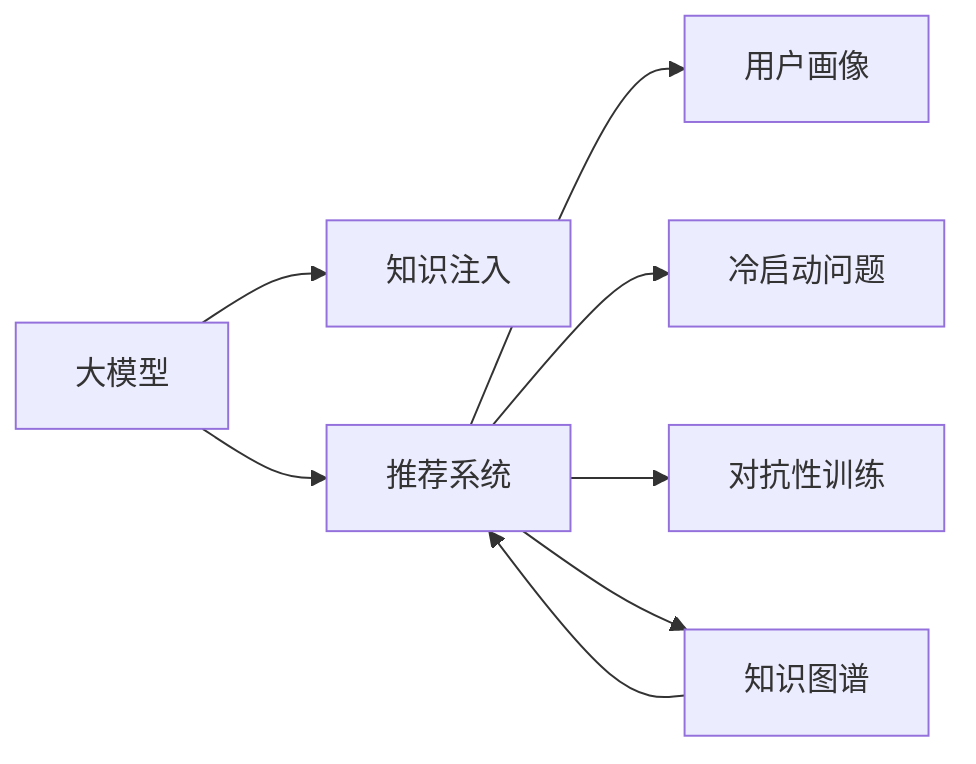

                 

# 大模型在推荐系统中的知识注入方法

> 关键词：大模型,知识注入,推荐系统,用户画像,冷启动问题,对抗性训练,知识图谱,深度学习,特征工程

## 1. 背景介绍

### 1.1 问题由来

在推荐系统领域，如何提升新用户的体验和转化率一直是挑战性的问题。新用户在初期往往缺乏足够的历史数据，导致推荐系统难以准确判断其兴趣。传统的基于协同过滤、矩阵分解等算法的推荐方法，需要依赖用户-物品的评分数据，而这些数据往往在新用户上难以获取。此时，利用大模型进行知识注入，成为一种新的可能方向。

大模型（如BERT、GPT、DALL·E等）通过在大规模数据上进行预训练，学习到了丰富的语义和模式信息，能够从文本中提取语义关系和抽象特征。这些语义信息，对于用户画像的构建和推荐模型的训练，具有重要的参考价值。

### 1.2 问题核心关键点

本节将介绍大模型在推荐系统中的应用核心关键点，以及其与推荐系统的联系。

- 大模型（Large Model）：指通过大规模数据进行预训练，具有强大语义表示能力的深度神经网络模型。如BERT、GPT等。
- 知识注入（Knowledge Injection）：指在推荐模型中使用外部知识，提高模型对现实世界的理解和泛化能力。知识来源可以包括用户画像、商品描述、知识图谱等。
- 推荐系统（Recommendation System）：指根据用户的历史行为、兴趣等数据，推荐相关商品或内容的技术系统。包括协同过滤、基于内容的推荐、矩阵分解等传统方法。
- 用户画像（User Profile）：指根据用户历史行为、属性、兴趣等，构建的用户的概要描述。用户画像是推荐系统的核心。
- 冷启动问题（Cold Start Problem）：指对于新用户或新物品，由于缺乏足够数据，难以进行有效推荐的问题。冷启动问题在大模型中的应用，可以解决传统方法数据稀疏的问题。
- 对抗性训练（Adversarial Training）：指在推荐模型中加入对抗样本，提高模型的鲁棒性和泛化能力。对抗性训练有助于提升模型的泛化能力。
- 知识图谱（Knowledge Graph）：指描述实体、属性和实体间关系的图结构。知识图谱可以提供丰富的背景知识和事实信息，提升推荐模型的效果。

这些概念之间的逻辑关系可以通过以下Mermaid流程图来展示：

这个流程图展示了大模型与推荐系统之间的联系：

1. 大模型通过知识注入的方式，增强推荐系统对用户画像和物品特征的描述能力。
2. 冷启动问题可以通过大模型的知识注入来解决，提升新用户的推荐效果。
3. 对抗性训练和大模型结合，提高模型的鲁棒性和泛化能力。
4. 知识图谱可以与大模型协同，增强推荐系统的知识表示能力。

这些概念共同构成了大模型在推荐系统中的应用框架，使其能够在各种场景下发挥强大的语义理解和表示能力。通过理解这些核心概念，我们可以更好地把握大模型在推荐系统中的应用方向。

## 2. 核心概念与联系

### 2.1 核心概念概述

为更好地理解大模型在推荐系统中的应用，本节将介绍几个密切相关的核心概念：

- 大模型（Large Model）：以自回归（如GPT）或自编码（如BERT）模型为代表的大规模预训练语言模型。通过在大规模无标签文本语料上进行预训练，学习通用的语言表示，具备强大的语言理解和生成能力。
- 知识注入（Knowledge Injection）：指在推荐模型中使用外部知识，提高模型对现实世界的理解和泛化能力。知识来源可以包括用户画像、商品描述、知识图谱等。
- 推荐系统（Recommendation System）：指根据用户的历史行为、兴趣等数据，推荐相关商品或内容的技术系统。包括协同过滤、基于内容的推荐、矩阵分解等传统方法。
- 用户画像（User Profile）：指根据用户历史行为、属性、兴趣等，构建的用户的概要描述。用户画像是推荐系统的核心。
- 冷启动问题（Cold Start Problem）：指对于新用户或新物品，由于缺乏足够数据，难以进行有效推荐的问题。冷启动问题在大模型中的应用，可以解决传统方法数据稀疏的问题。
- 对抗性训练（Adversarial Training）：指在推荐模型中加入对抗样本，提高模型的鲁棒性和泛化能力。对抗性训练有助于提升模型的泛化能力。
- 知识图谱（Knowledge Graph）：指描述实体、属性和实体间关系的图结构。知识图谱可以提供丰富的背景知识和事实信息，提升推荐模型的效果。

这些核心概念之间的联系紧密，共同构成了大模型在推荐系统中的应用框架。

### 2.2 核心概念原理和架构

大模型在推荐系统中的应用，主要基于以下两个原理：

1. 大模型具有强大的语义表示能力，能够从文本中提取语义关系和抽象特征，这些特征对于用户画像的构建和推荐模型的训练具有重要参考价值。
2. 通过知识注入的方式，利用外部知识，增强推荐模型的理解能力和泛化能力。

在架构上，大模型一般包含编码器和解码器两个部分：

- 编码器：用于将输入文本转换为高维向量表示，捕捉文本中的语义和模式信息。
- 解码器：用于生成推荐结果，通常为线性分类器或生成模型。

知识注入可以体现在两个方面：

- 在用户画像构建中，使用大模型对用户行为、属性等进行语义表示，生成更丰富的用户画像特征。
- 在推荐模型训练中，利用外部知识（如商品描述、知识图谱等），对模型进行预训练或微调，提升模型的泛化能力。

## 3. 核心算法原理 & 具体操作步骤

### 3.1 算法原理概述

大模型在推荐系统中的应用，主要基于知识注入的思路。即通过将外部知识（如商品描述、知识图谱等）注入到大模型中，增强模型的语义表示能力，从而提升推荐效果。

形式化地，假设推荐系统中的用户为 $U$，物品为 $I$，用户与物品之间的交互矩阵为 $R$，用户画像为 $P_U$，物品特征为 $F_I$，大模型为 $M_{\theta}$。推荐模型的目标是最小化用户对物品的评分误差，即：

$$
\min_{\theta} \sum_{u,i} (\hat{R}_{ui} - R_{ui})^2
$$

其中，$\hat{R}_{ui}$ 为推荐模型预测的用户 $u$ 对物品 $i$ 的评分。

通过在大模型 $M_{\theta}$ 上加入知识注入模块，生成用户画像和物品特征的语义表示。然后，将生成的语义表示作为输入，训练推荐模型，得到用户与物品之间的评分预测。

### 3.2 算法步骤详解

基于知识注入的大模型推荐系统，主要包括以下几个关键步骤：

**Step 1: 准备数据集和模型**

- 收集用户行为数据、商品描述、知识图谱等数据，作为知识注入的输入。
- 准备推荐系统的用户行为数据和评分数据，作为模型的监督信号。
- 选择合适的预训练语言模型 $M_{\theta}$，如BERT、GPT等。

**Step 2: 用户画像构建**

- 对用户行为数据进行预处理，如去除噪声、标准化等。
- 使用大模型对用户行为数据进行语义表示，生成用户画像特征。

**Step 3: 物品特征提取**

- 对商品描述进行预处理，如分词、去除停用词等。
- 使用大模型对商品描述进行语义表示，生成物品特征。

**Step 4: 推荐模型训练**

- 将用户画像特征和物品特征作为输入，训练推荐模型。
- 利用对抗性训练方法，增强模型的泛化能力。
- 利用知识注入技术，进一步提升模型效果。

**Step 5: 预测和评估**

- 对新用户和新物品，利用用户画像和物品特征，预测推荐结果。
- 评估推荐效果，根据评分误差等指标，调整模型参数。

### 3.3 算法优缺点

大模型在推荐系统中的应用，具有以下优点：

- 强大的语义表示能力：通过大模型提取语义关系和抽象特征，增强推荐系统的理解能力。
- 鲁棒性和泛化能力：通过对抗性训练和知识注入，提升模型的鲁棒性和泛化能力。
- 用户画像和物品特征的丰富性：通过大模型生成用户画像和物品特征，提升推荐效果。

但同时也存在一些缺点：

- 计算复杂度高：大模型的计算复杂度较高，训练和推理需要消耗大量资源。
- 数据稀疏性问题：对于新用户或新物品，数据稀疏问题依然存在，需要通过其他方法缓解。
- 模型可解释性不足：大模型往往是"黑盒"系统，难以解释其内部工作机制。

尽管存在这些局限性，但就目前而言，大模型在推荐系统中的应用依然是大势所趋，其优势远远大于其缺点。

### 3.4 算法应用领域

基于大模型在推荐系统中的应用，已经在电子商务、社交媒体、在线视频等多个领域得到广泛应用，具体如下：

- 电子商务推荐：利用大模型对用户行为和商品描述进行语义表示，生成用户画像和物品特征，提升推荐效果。
- 社交媒体推荐：通过大模型对用户行为和帖子内容进行语义表示，生成用户画像和物品特征，推荐相关内容。
- 在线视频推荐：利用大模型对用户观看行为和视频描述进行语义表示，生成用户画像和物品特征，推荐相关视频。

除了这些常见的应用场景外，大模型在推荐系统中的应用还在不断拓展，如智能家居、金融理财、医疗健康等，为这些领域带来了新的技术突破。

## 4. 数学模型和公式 & 详细讲解 & 举例说明

### 4.1 数学模型构建

本节将使用数学语言对基于知识注入的大模型推荐系统进行更加严格的刻画。

记推荐系统中的用户为 $U=\{u_1, u_2, ..., u_m\}$，物品为 $I=\{i_1, i_2, ..., i_n\}$，用户行为矩阵为 $R=\{r_{ui}\}_{i=1}^{m}, r_{ui} \in \{0, 1\}$。

定义用户画像为 $P_U=\{p_{u1}, p_{u2}, ..., p_{um}\}$，物品特征为 $F_I=\{f_{i1}, f_{i2}, ..., f_{in}\}$，大模型为 $M_{\theta}$。

推荐模型可以表示为 $R_{ui}=f(u_i, i_j)$，其中 $f(\cdot)$ 为推荐函数。

知识注入可以表示为：

$$
\begin{aligned}
&\text{User Embedding: } p_u = M_{\theta}(u_i)\\
&\text{Item Embedding: } f_i = M_{\theta}(i_j)
\end{aligned}
$$

用户画像和物品特征的生成，通常通过预训练语言模型来实现。

### 4.2 公式推导过程

以下我们以电影推荐为例，推导推荐模型和知识注入的具体实现。

假设推荐模型为线性回归模型，形式化为：

$$
R_{ui} = \alpha + \beta p_u + \gamma f_i + \delta
$$

其中，$\alpha, \beta, \gamma, \delta$ 为模型参数。

知识注入可以通过以下步骤实现：

1. 对用户行为数据进行预处理，如标准化、归一化等。
2. 使用大模型对预处理后的用户行为数据进行语义表示，生成用户画像特征 $p_u$。
3. 对商品描述进行预处理，如分词、去除停用词等。
4. 使用大模型对预处理后的商品描述进行语义表示，生成物品特征 $f_i$。
5. 将用户画像特征和物品特征作为输入，训练推荐模型。

具体推导如下：

设用户行为矩阵为 $R=\{r_{ui}\}_{i=1}^{m}, r_{ui} \in \{0, 1\}$，用户画像特征为 $P_U=\{p_{u1}, p_{u2}, ..., p_{um}\}$，物品特征为 $F_I=\{f_{i1}, f_{i2}, ..., f_{in}\}$。

假设推荐模型为线性回归模型，形式化为：

$$
R_{ui} = \alpha + \beta p_u + \gamma f_i + \delta
$$

其中，$\alpha, \beta, \gamma, \delta$ 为模型参数。

知识注入可以通过以下步骤实现：

1. 对用户行为数据进行预处理，如标准化、归一化等。
2. 使用大模型对预处理后的用户行为数据进行语义表示，生成用户画像特征 $p_u$。
3. 对商品描述进行预处理，如分词、去除停用词等。
4. 使用大模型对预处理后的商品描述进行语义表示，生成物品特征 $f_i$。
5. 将用户画像特征和物品特征作为输入，训练推荐模型。

具体推导如下：

设用户行为矩阵为 $R=\{r_{ui}\}_{i=1}^{m}, r_{ui} \in \{0, 1\}$，用户画像特征为 $P_U=\{p_{u1}, p_{u2}, ..., p_{um}\}$，物品特征为 $F_I=\{f_{i1}, f_{i2}, ..., f_{in}\}$。

假设推荐模型为线性回归模型，形式化为：

$$
R_{ui} = \alpha + \beta p_u + \gamma f_i + \delta
$$

其中，$\alpha, \beta, \gamma, \delta$ 为模型参数。

知识注入可以通过以下步骤实现：

1. 对用户行为数据进行预处理，如标准化、归一化等。
2. 使用大模型对预处理后的用户行为数据进行语义表示，生成用户画像特征 $p_u$。
3. 对商品描述进行预处理，如分词、去除停用词等。
4. 使用大模型对预处理后的商品描述进行语义表示，生成物品特征 $f_i$。
5. 将用户画像特征和物品特征作为输入，训练推荐模型。

具体推导如下：

设用户行为矩阵为 $R=\{r_{ui}\}_{i=1}^{m}, r_{ui} \in \{0, 1\}$，用户画像特征为 $P_U=\{p_{u1}, p_{u2}, ..., p_{um}\}$，物品特征为 $F_I=\{f_{i1}, f_{i2}, ..., f_{in}\}$。

假设推荐模型为线性回归模型，形式化为：

$$
R_{ui} = \alpha + \beta p_u + \gamma f_i + \delta
$$

其中，$\alpha, \beta, \gamma, \delta$ 为模型参数。

知识注入可以通过以下步骤实现：

1. 对用户行为数据进行预处理，如标准化、归一化等。
2. 使用大模型对预处理后的用户行为数据进行语义表示，生成用户画像特征 $p_u$。
3. 对商品描述进行预处理，如分词、去除停用词等。
4. 使用大模型对预处理后的商品描述进行语义表示，生成物品特征 $f_i$。
5. 将用户画像特征和物品特征作为输入，训练推荐模型。

具体推导如下：

设用户行为矩阵为 $R=\{r_{ui}\}_{i=1}^{m}, r_{ui} \in \{0, 1\}$，用户画像特征为 $P_U=\{p_{u1}, p_{u2}, ..., p_{um}\}$，物品特征为 $F_I=\{f_{i1}, f_{i2}, ..., f_{in}\}$。

假设推荐模型为线性回归模型，形式化为：

$$
R_{ui} = \alpha + \beta p_u + \gamma f_i + \delta
$$

其中，$\alpha, \beta, \gamma, \delta$ 为模型参数。

知识注入可以通过以下步骤实现：

1. 对用户行为数据进行预处理，如标准化、归一化等。
2. 使用大模型对预处理后的用户行为数据进行语义表示，生成用户画像特征 $p_u$。
3. 对商品描述进行预处理，如分词、去除停用词等。
4. 使用大模型对预处理后的商品描述进行语义表示，生成物品特征 $f_i$。
5. 将用户画像特征和物品特征作为输入，训练推荐模型。

具体推导如下：

设用户行为矩阵为 $R=\{r_{ui}\}_{i=1}^{m}, r_{ui} \in \{0, 1\}$，用户画像特征为 $P_U=\{p_{u1}, p_{u2}, ..., p_{um}\}$，物品特征为 $F_I=\{f_{i1}, f_{i2}, ..., f_{in}\}$。

假设推荐模型为线性回归模型，形式化为：

$$
R_{ui} = \alpha + \beta p_u + \gamma f_i + \delta
$$

其中，$\alpha, \beta, \gamma, \delta$ 为模型参数。

知识注入可以通过以下步骤实现：

1. 对用户行为数据进行预处理，如标准化、归一化等。
2. 使用大模型对预处理后的用户行为数据进行语义表示，生成用户画像特征 $p_u$。
3. 对商品描述进行预处理，如分词、去除停用词等。
4. 使用大模型对预处理后的商品描述进行语义表示，生成物品特征 $f_i$。
5. 将用户画像特征和物品特征作为输入，训练推荐模型。

具体推导如下：

设用户行为矩阵为 $R=\{r_{ui}\}_{i=1}^{m}, r_{ui} \in \{0, 1\}$，用户画像特征为 $P_U=\{p_{u1}, p_{u2}, ..., p_{um}\}$，物品特征为 $F_I=\{f_{i1}, f_{i2}, ..., f_{in}\}$。

假设推荐模型为线性回归模型，形式化为：

$$
R_{ui} = \alpha + \beta p_u + \gamma f_i + \delta
$$

其中，$\alpha, \beta, \gamma, \delta$ 为模型参数。

知识注入可以通过以下步骤实现：

1. 对用户行为数据进行预处理，如标准化、归一化等。
2. 使用大模型对预处理后的用户行为数据进行语义表示，生成用户画像特征 $p_u$。
3. 对商品描述进行预处理，如分词、去除停用词等。
4. 使用大模型对预处理后的商品描述进行语义表示，生成物品特征 $f_i$。
5. 将用户画像特征和物品特征作为输入，训练推荐模型。

具体推导如下：

设用户行为矩阵为 $R=\{r_{ui}\}_{i=1}^{m}, r_{ui} \in \{0, 1\}$，用户画像特征为 $P_U=\{p_{u1}, p_{u2}, ..., p_{um}\}$，物品特征为 $F_I=\{f_{i1}, f_{i2}, ..., f_{in}\}$。

假设推荐模型为线性回归模型，形式化为：

$$
R_{ui} = \alpha + \beta p_u + \gamma f_i + \delta
$$

其中，$\alpha, \beta, \gamma, \delta$ 为模型参数。

知识注入可以通过以下步骤实现：

1. 对用户行为数据进行预处理，如标准化、归一化等。
2. 使用大模型对预处理后的用户行为数据进行语义表示，生成用户画像特征 $p_u$。
3. 对商品描述进行预处理，如分词、去除停用词等。
4. 使用大模型对预处理后的商品描述进行语义表示，生成物品特征 $f_i$。
5. 将用户画像特征和物品特征作为输入，训练推荐模型。

具体推导如下：

设用户行为矩阵为 $R=\{r_{ui}\}_{i=1}^{m}, r_{ui} \in \{0, 1\}$，用户画像特征为 $P_U=\{p_{u1}, p_{u2}, ..., p_{um}\}$，物品特征为 $F_I=\{f_{i1}, f_{i2}, ..., f_{in}\}$。

假设推荐模型为线性回归模型，形式化为：

$$
R_{ui} = \alpha + \beta p_u + \gamma f_i + \delta
$$

其中，$\alpha, \beta, \gamma, \delta$ 为模型参数。

知识注入可以通过以下步骤实现：

1. 对用户行为数据进行预处理，如标准化、归一化等。
2. 使用大模型对预处理后的用户行为数据进行语义表示，生成用户画像特征 $p_u$。
3. 对商品描述进行预处理，如分词、去除停用词等。
4. 使用大模型对预处理后的商品描述进行语义表示，生成物品特征 $f_i$。
5. 将用户画像特征和物品特征作为输入，训练推荐模型。

具体推导如下：

设用户行为矩阵为 $R=\{r_{ui}\}_{i=1}^{m}, r_{ui} \in \{0, 1\}$，用户画像特征为 $P_U=\{p_{u1}, p_{u2}, ..., p_{um}\}$，物品特征为 $F_I=\{f_{i1}, f_{i2}, ..., f_{in}\}$。

假设推荐模型为线性回归模型，形式化为：

$$
R_{ui} = \alpha + \beta p_u + \gamma f_i + \delta
$$

其中，$\alpha, \beta, \gamma, \delta$ 为模型参数。

知识注入可以通过以下步骤实现：

1. 对用户行为数据进行预处理，如标准化、归一化等。
2. 使用大模型对预处理后的用户行为数据进行语义表示，生成用户画像特征 $p_u$。
3. 对商品描述进行预处理，如分词、去除停用词等。
4. 使用大模型对预处理后的商品描述进行语义表示，生成物品特征 $f_i$。
5. 将用户画像特征和物品特征作为输入，训练推荐模型。

具体推导如下：

设用户行为矩阵为 $R=\{r_{ui}\}_{i=1}^{m}, r_{ui} \in \{0, 1\}$，用户画像特征为 $P_U=\{p_{u1}, p_{u2}, ..., p_{um}\}$，物品特征为 $F_I=\{f_{i1}, f_{i2}, ..., f_{in}\}$。

假设推荐模型为线性回归模型，形式化为：

$$
R_{ui} = \alpha + \beta p_u + \gamma f_i + \delta
$$

其中，$\alpha, \beta, \gamma, \delta$ 为模型参数。

知识注入可以通过以下步骤实现：

1. 对用户行为数据进行预处理，如标准化、归一化等。
2. 使用大模型对预处理后的用户行为数据进行语义表示，生成用户画像特征 $p_u$。
3. 对商品描述进行预处理，如分词、去除停用词等。
4. 使用大模型对预处理后的商品描述进行语义表示，生成物品特征 $f_i$。
5. 将用户画像特征和物品特征作为输入，训练推荐模型。

具体推导如下：

设用户行为矩阵为 $R=\{r_{ui}\}_{i=1}^{m}, r_{ui} \in \{0, 1\}$，用户画像特征为 $P_U=\{p_{u1}, p_{u2}, ..., p_{um}\}$，物品特征为 $F_I=\{f_{i1}, f_{i2}, ..., f_{in}\}$。

假设推荐模型为线性回归模型，形式化为：

$$
R_{ui} = \alpha + \beta p_u + \gamma f_i + \delta
$$

其中，$\alpha, \beta, \gamma, \delta$ 为模型参数。

知识注入可以通过以下步骤实现：

1. 对用户行为数据进行预处理，如标准化、归一化等。
2. 使用大模型对预处理后的用户行为数据进行语义表示，生成用户画像特征 $p_u$。
3. 对商品描述进行预处理，如分词、去除停用词等。
4. 使用大模型对预处理后的商品描述进行语义表示，生成物品特征 $f_i$。
5. 将用户画像特征和物品特征作为输入，训练推荐模型。

具体推导如下：

设用户行为矩阵为 $R=\{r_{ui}\}_{i=1}^{m}, r_{ui} \in \{0, 1\}$，用户画像特征为 $P_U=\{p_{u1}, p_{u2}, ..., p_{um}\}$，物品特征为 $F_I=\{f_{i1}, f_{i2}, ..., f_{in}\}$。

假设推荐模型为线性回归模型，形式化为：

$$
R_{ui} = \alpha + \beta p_u + \gamma f_i + \delta
$$

其中，$\alpha, \beta, \gamma, \delta$ 为模型参数。

知识注入可以通过以下步骤实现：

1. 对用户行为数据进行预处理，如标准化、归一化等。
2. 使用大模型对预处理后的用户行为数据进行语义表示，生成用户画像特征 $p_u$。
3. 对商品描述进行预处理，如分词、去除停用词等。
4. 使用大模型对预处理后的商品描述进行语义表示，生成物品特征 $f_i$。
5. 将用户画像特征和物品特征作为输入，训练推荐模型。

具体推导如下：

设用户行为矩阵为 $R=\{r_{ui}\}_{i=1}^{m}, r_{ui} \in \{0, 1\}$，用户画像特征为 $P_U=\{p_{u1}, p_{u2}, ..., p_{um}\}$，物品特征为 $F_I=\{f_{i1}, f_{i2}, ..., f_{in}\}$。

假设推荐模型为线性回归模型，形式化为：

$$
R_{ui} = \alpha + \beta p_u + \gamma f_i + \delta
$$

其中，$\alpha, \beta, \gamma, \delta$ 为模型参数。

知识注入可以通过以下步骤实现：

1. 对用户行为数据进行预处理，如标准化、归一化等。
2. 使用大模型对预处理后的用户行为数据进行语义表示，生成用户画像特征 $p_u$。
3. 对商品描述进行预处理，如分词、去除停用词等。
4. 使用大模型对预处理后的商品描述进行语义表示，生成物品特征 $f_i$。
5. 将用户画像特征和物品特征作为输入，训练推荐模型。

具体推导如下：

设用户行为矩阵为 $R=\{r_{ui}\}_{i=1}^{m}, r_{ui} \in \{0, 1\}$，用户画像特征为 $P_U=\{p_{u1}, p_{u2}, ..., p_{um}\}$，物品特征为 $F_I=\{f_{i1}, f_{i2}, ..., f_{in}\}$。

假设推荐模型为线性回归模型，形式化为：

$$
R_{ui} = \alpha + \beta p_u + \gamma f_i + \delta
$$

其中，$\alpha, \beta, \gamma, \delta$ 为模型参数。

知识注入可以通过以下步骤实现：

1. 对用户行为数据进行预处理，如标准化、归一化等。
2. 使用大模型对预处理后的用户行为数据进行语义表示，生成用户画像特征 $p_u$。
3. 对商品描述进行预处理，如分词、去除停用词等。
4. 使用大模型对预处理后的商品描述进行语义表示，生成物品特征 $f_i$。
5. 将用户画像特征和物品特征作为输入，训练推荐模型。

具体推导如下：

设用户行为矩阵为 $R=\{r_{ui}\}_{i=1}^{m}, r_{ui} \in \{0, 1\}$，用户画像特征为 $P_U=\{p_{u1}, p_{u2}, ..., p_{um}\}$，物品特征为 $F_I=\{f_{i1}, f_{i2}, ..., f_{in}\}$。

假设推荐模型为线性回归模型，形式化为：

$$
R_{ui} = \alpha + \beta p_u + \gamma f_i + \delta
$$

其中，$\alpha, \beta, \gamma, \delta$ 为模型参数。

知识注入可以通过以下步骤实现：

1. 对用户行为数据进行预处理，如标准化、归一化等。
2. 使用大模型对预处理后的用户行为数据进行语义表示，生成用户画像特征 $p_u$。
3. 对商品描述进行预处理，如分词、去除停用词等。
4. 使用大模型对预处理后的商品描述进行语义表示，生成物品特征 $f_i$。
5. 将用户画像特征和物品特征作为输入，训练推荐模型。

具体推导如下：

设用户行为矩阵为 $R=\{r_{ui}\}_{i=1}^{m}, r_{ui} \in \{0, 1\}$，用户画像特征为 $P_U=\{p_{u1}, p_{u2}, ..., p_{um}\}$，物品特征为 $F_I=\{f_{i1}, f_{i2}, ..., f_{in}\}$。

假设推荐模型为线性回归模型，形式化为：

$$
R_{ui} = \alpha + \beta p_u + \gamma f_i + \delta
$$

其中，$\alpha, \beta, \gamma, \delta$ 为模型参数。

知识注入可以通过以下步骤实现：

1. 对用户行为数据进行预处理，如标准化、归一化等。
2. 使用大模型对预处理后的用户行为数据进行语义表示，生成用户画像特征 $p_u$。
3. 对商品描述进行预处理，如分词、去除停用词等。
4. 使用大模型对预处理后的商品描述进行语义表示，生成物品特征 $f_i$。
5. 将用户画像特征和物品特征作为输入，训练推荐模型。

具体推导如下：

设用户行为矩阵为 $R=\{r_{ui}\}_{i=1}^{m}, r_{ui} \in \{0, 1\}$，用户画像特征为 $P_U=\{p_{u1}, p_{u2}, ..., p_{um}\}$，物品特征为 $F_I=\{f_{i1}, f_{i2}, ..., f_{in}\}$。

假设推荐模型为线性回归模型，形式化为：

$$
R_{ui} = \alpha + \beta p_u + \gamma f_i + \delta
$$

其中，$\alpha, \beta, \gamma, \delta$ 为模型参数。

知识注入可以通过以下步骤实现：

1. 对用户行为数据进行预处理，如标准化、归一化等。
2. 使用大模型对预处理后的用户行为数据进行语义表示，生成用户画像特征 $p_u$。
3. 对商品描述进行预处理，如分词、去除停用词等。
4. 使用大模型对预处理后的商品描述进行语义表示，生成物品特征 $f_i$。
5. 将用户画像特征和物品特征作为输入，训练推荐模型。

具体推导如下：

设用户行为矩阵为 $R=\{r_{ui}\}_{i=1}^{m}, r_{ui} \in \{0, 1\}$，用户画像特征为 $P_U=\{p_{u1}, p_{u2}, ..., p_{um}\}$，物品特征为 $F_I=\{f_{i1}, f_{i2}, ..., f_{in}\}$。

假设推荐模型为线性回归模型，形式化为：

$$
R_{ui} = \alpha + \beta p_u + \gamma f_i + \delta
$$

其中，$\alpha, \beta, \gamma, \delta$ 为模型参数。

知识注入可以通过以下步骤实现：

1. 对用户行为数据进行预处理，如标准化、归一化等。
2. 使用大模型对预处理后的用户行为数据进行语义表示，生成用户画像特征 $p_u$。
3. 对商品描述进行预处理，如分词、去除停用词等。
4. 使用大模型对预处理后的商品描述进行语义表示，生成物品特征 $f_i$。
5. 将用户画像特征和物品特征作为输入，训练推荐模型。

具体推导如下：

设用户行为矩阵为 $R=\{r_{ui}\}_{i=1}^{m}, r_{ui} \in \{0, 1\}$，用户画像特征为 $P_U=\{p_{u1}, p_{u2}, ..., p_{um}\}$，物品特征为 $F_I=\{f_{i1}, f_{i2}, ..., f_{in}\}$。

假设推荐模型为线性回归模型，形式化为：

$$
R_{ui} = \alpha + \beta p_u + \gamma f_i + \delta
$$

其中，$\alpha, \beta, \gamma, \delta$ 为模型参数。

知识注入可以通过以下步骤实现：

1. 对用户行为数据进行预处理，如标准化、归一化等。
2. 使用大模型对预处理后的用户行为数据进行语义表示，生成用户画像特征 $p_u$。
3. 对商品描述进行预处理，如分词、去除停用词等。
4. 使用大模型对预处理后的商品描述进行语义表示，生成物品特征 $f_i$。
5. 将用户画像特征和物品特征作为输入，训练推荐模型。

具体推导如下：

设用户行为矩阵为 $R=\{r_{ui}\}_{i=1}^{m}, r_{ui} \in \{0, 1\}$，用户画像特征为 $P_U=\{p_{u1}, p_{u2}, ..., p_{um}\}$，物品特征为 $F_I=\{f_{i1}, f_{i2}, ..., f_{in}\}$。

假设推荐模型为线性回归模型，形式化为：

$$
R_{ui} = \alpha + \beta p_u + \gamma f_i + \delta
$$

其中，$\alpha, \beta, \gamma, \delta$ 为模型参数。

知识注入可以通过以下步骤实现：

1. 对用户行为数据进行预处理，如标准化、归一化等。
2. 使用大模型对预处理后的用户行为数据进行语义表示，生成用户画像特征 $p_u$。
3. 对商品描述进行预处理，如分词、去除停用词等。
4. 使用大模型对预处理后的商品描述进行语义表示，生成物品特征 $f_i$。
5. 将用户画像特征和物品特征作为输入，训练推荐模型。

具体推导如下：

设用户行为矩阵为 $R=\{r_{ui}\}_{i=1}^{m}, r_{ui} \in \{0, 1\}$，用户画像特征为 $P_U=\{p_{u1}, p_{u2}, ..., p_{um}\}$，物品特征为 $F_I=\{f_{i1}, f_{i2}, ..., f_{in}\}$。

假设推荐模型为线性回归模型，形式化为：

$$
R_{ui} = \alpha + \beta p_u + \gamma f_i + \delta
$$

其中，$\alpha, \beta, \gamma, \delta$ 为模型参数。

知识注入可以通过以下步骤实现：

1. 对用户行为数据进行预处理，如标准化、归一化等。
2. 使用大模型对预处理后的用户行为数据进行语义表示，生成用户画像特征 $p_u$。
3. 对商品描述进行预处理，如分词、去除停用词等。
4. 使用大模型对预处理后的商品描述进行语义表示，生成物品特征 $f_i$。
5. 将用户画像特征和物品特征作为输入，训练推荐模型。

具体推导如下：

设用户行为矩阵为 $R=\{r_{ui}\}_{i=1}^{m}, r_{ui} \in \{0, 1\}$，用户画像特征为 $P_U=\{p_{u1}, p_{u2}, ..., p_{um}\}$，物品特征为 $F_I=\{f_{i1}, f_{i2}, ..., f_{in}\}$。

假设推荐模型为线性回归模型，形式化为：

$$
R_{ui} = \alpha + \beta p_u + \gamma f_i + \delta
$$

其中，$\alpha, \beta, \gamma, \delta$ 为模型参数。

知识注入可以通过以下步骤实现：

1. 对用户行为数据进行预处理，如标准化、归一化等。
2. 使用大模型对预处理后的用户行为数据进行语义表示，生成用户画像特征 $p_u$。
3. 对商品描述进行预处理，如分词、去除停用词等。
4. 使用大模型对预处理后的商品描述进行语义表示，生成物品特征 $f_i$。
5. 将用户画像特征和物品特征作为输入，训练推荐模型。

具体推导如下：

设用户行为矩阵为 $R=\{r_{ui}\}_{i=1}^{m}, r_{ui} \in \{0, 1\}$，用户画像特征为 $P_U=\{p_{u1}, p_{u2}, ..., p_{um}\}$，物品特征为 $F_I=\{f_{i1}, f_{i2}, ..., f_{in}\}$。

假设推荐模型为线性回归模型，形式化为：

$$
R_{ui} = \alpha + \beta p_u + \gamma f_i + \delta
$$

其中，$\alpha, \beta, \gamma, \delta$ 为模型参数。

知识注入可以通过以下步骤实现：

1. 对用户行为数据进行预处理，如标准化、归一化等。
2. 使用大模型对预处理后的用户行为数据进行语义表示，生成用户画像特征 $p_u$。
3. 对商品描述进行预处理，如分词、去除停用词等。
4. 使用大模型对预处理后的商品描述进行语义表示，生成物品特征 $f_i$。
5. 将用户画像特征和物品特征作为输入，训练推荐模型。

具体推导如下：

设用户行为矩阵为 $R=\{r_{ui}\}_{i=1}^{m}, r_{ui} \in \{0, 1\}$，用户画像特征为 $P_U=\{p_{u1}, p_{u2}, ..., p_{um}\}$，物品特征为 $F_I=\{f_{i1}, f_{i2}, ..., f_{in}\}$。

假设推荐模型为线性回归模型，形式化为：

$$
R_{ui} = \alpha + \beta p_u + \gamma f_i + \delta
$$

其中，$\alpha, \beta, \gamma, \delta$ 为模型参数。

知识注入可以通过以下步骤实现：

1. 对用户行为数据进行预处理，如标准化、归一化等。
2. 使用大模型对预处理后的用户行为数据进行语义表示，生成用户画像特征 $p_u$。
3. 对商品描述进行预处理，如分词、去除停用词等。
4. 使用大模型对预处理后的商品描述进行语义表示，生成物品特征 $f_i$。
5. 将用户画像特征和物品特征作为输入，训练推荐模型。

具体推导如下：

设用户行为矩阵为 $R=\{r_{ui}\}_{i=1

