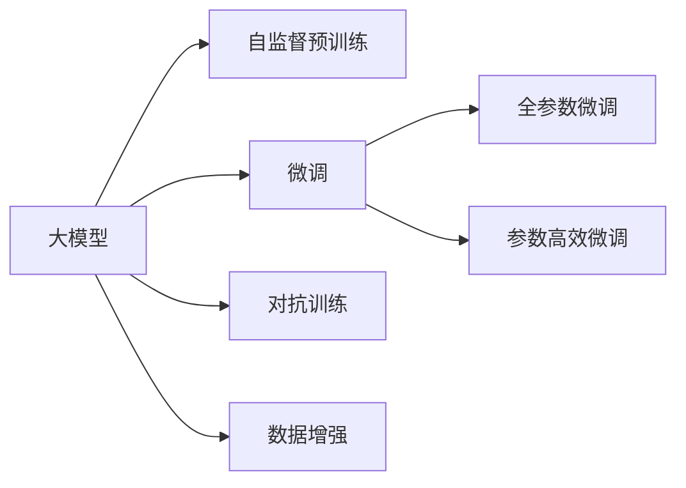

                 

# 大模型在推荐系统中的自监督学习应用

> 关键词：自监督学习,推荐系统,大模型,深度学习,优化目标,数据增强,对抗训练

## 1. 背景介绍

### 1.1 问题由来
随着电子商务的飞速发展，推荐系统已经成为各大平台的核心竞争力。推荐系统通过个性化算法，根据用户的历史行为和偏好，预测并推荐用户可能感兴趣的商品，从而提升用户体验和平台收益。然而，推荐系统的设计和训练是一个复杂的过程，需要大量的用户数据、精心设计的模型和高效的算法。近年来，随着深度学习技术的突破，大模型在推荐系统中逐渐崭露头角。

大模型通过大规模预训练学习到丰富的知识表示，能够在大规模无标签数据上提取通用特征，这些特征可以迁移到推荐系统中，用于增强推荐算法的表现。常见的预训练模型包括BERT、GPT等。通过在大模型上微调，可以有效提升推荐系统的个性化程度和推荐效果。

### 1.2 问题核心关键点
目前，大模型在推荐系统中的应用主要集中在自监督学习范式上。自监督学习利用大数据的分布特征，通过无标签数据进行预训练，学习到通用的特征表示。基于这些特征表示，再通过微调获得推荐系统所需的个性化信息，从而实现推荐。

自监督学习的方法有两大核心优点：
1. **数据效率高**：无需标注数据，利用大规模无标签数据即可进行预训练。
2. **特征能力强**：预训练得到的通用特征表示具有更强的泛化能力，能够提升推荐系统的表现。

### 1.3 问题研究意义
自监督学习在大模型推荐系统中的应用，为推荐系统的设计和优化提供了新的思路。通过自监督学习，可以有效利用大数据优势，提高推荐算法的效率和效果。同时，自监督学习还可以避免标注数据的成本和风险，具有广阔的应用前景。

## 2. 核心概念与联系

### 2.1 核心概念概述

在推荐系统中应用大模型的自监督学习，需要理解以下几个核心概念：

- **大模型**：指在大规模数据上预训练的深度学习模型，如BERT、GPT等。这些模型通过自监督学习任务，学习到丰富的语义和结构信息，可以用于推荐系统中的特征提取。
- **自监督学习**：指利用大数据的分布特征，通过无标签数据进行预训练，学习到通用的特征表示。自监督学习包括掩码语言模型、次序预测、分类任务等多种预训练任务。
- **微调**：在自监督学习的基础上，通过有标签数据进行微调，获得针对特定推荐系统的个性化特征表示。微调可以是全参数微调，也可以是参数高效微调。
- **对抗训练**：通过加入对抗样本，提高模型的鲁棒性和泛化能力。自监督学习中的对抗训练可以增强模型对输入数据的理解能力。
- **数据增强**：通过对训练数据进行扩充和变换，提高模型对不同输入的适应性。数据增强可以用于自监督学习中的预训练和微调。

这些核心概念之间存在紧密的联系，自监督学习为推荐系统提供通用特征表示，微调则在具体推荐任务上提升个性化能力，对抗训练和数据增强则进一步提升模型的泛化能力和鲁棒性。

### 2.2 核心概念原理和架构的 Mermaid 流程图



这个流程图展示了自监督学习在大模型推荐系统中的基本流程：

1. 大模型通过自监督预训练学习通用特征表示。
2. 在推荐系统中，通过微调获得针对特定任务的个性化特征表示。
3. 微调可以采用全参数微调，也可以采用参数高效微调，以避免过拟合。
4. 在自监督预训练中，通过对抗训练和数据增强提升模型鲁棒性和泛化能力。

这些概念相互配合，共同构建起自监督学习在大模型推荐系统中的应用框架。

## 3. 核心算法原理 & 具体操作步骤
### 3.1 算法原理概述

大模型在推荐系统中的应用，主要基于自监督学习的预训练和微调两个步骤。其核心思想是：通过大规模无标签数据进行预训练，学习到通用的特征表示，再通过微调获得针对特定推荐任务的个性化特征表示。

形式化地，假设大模型为 $M_{\theta}$，其中 $\theta$ 为模型参数。设推荐系统中的训练数据集为 $D=\{(x_i, y_i)\}_{i=1}^N$，其中 $x_i$ 为推荐实例，$y_i$ 为推荐结果标签。微调的目标是找到最优参数 $\hat{\theta}$，使得模型在推荐任务上表现最好：

$$
\hat{\theta}=\mathop{\arg\min}_{\theta} \mathcal{L}(M_{\theta},D)
$$

其中 $\mathcal{L}$ 为针对推荐任务设计的损失函数，用于衡量模型预测输出与真实标签之间的差异。常见的损失函数包括交叉熵损失、均方误差损失等。

### 3.2 算法步骤详解

基于自监督学习的推荐系统微调一般包括以下几个关键步骤：

**Step 1: 准备预训练模型和数据集**
- 选择合适的预训练语言模型 $M_{\theta}$ 作为初始化参数，如 BERT、GPT等。
- 准备推荐系统中的训练数据集 $D$，划分为训练集、验证集和测试集。数据集应该包含推荐实例 $x_i$ 和对应的推荐结果 $y_i$。

**Step 2: 设计自监督预训练任务**
- 选择合适的自监督学习任务，如掩码语言模型、次序预测、分类任务等。
- 通过在大规模无标签数据上训练这些任务，学习到通用的特征表示。

**Step 3: 添加推荐适配层**
- 根据推荐系统的具体任务，在预训练模型的顶层设计合适的输出层和损失函数。
- 对于推荐排序任务，通常在顶层添加线性分类器和交叉熵损失函数。
- 对于推荐生成任务，通常使用语言模型的解码器输出概率分布，并以负对数似然为损失函数。

**Step 4: 设置微调超参数**
- 选择合适的优化算法及其参数，如 AdamW、SGD 等，设置学习率、批大小、迭代轮数等。
- 设置正则化技术及强度，包括权重衰减、Dropout、Early Stopping等。
- 确定冻结预训练参数的策略，如仅微调顶层，或全部参数都参与微调。

**Step 5: 执行梯度训练**
- 将训练集数据分批次输入模型，前向传播计算损失函数。
- 反向传播计算参数梯度，根据设定的优化算法和学习率更新模型参数。
- 周期性在验证集上评估模型性能，根据性能指标决定是否触发 Early Stopping。
- 重复上述步骤直到满足预设的迭代轮数或 Early Stopping 条件。

**Step 6: 测试和部署**
- 在测试集上评估微调后模型 $M_{\hat{\theta}}$ 的性能，对比微调前后的精度提升。
- 使用微调后的模型对新样本进行推理预测，集成到实际的应用系统中。
- 持续收集新的数据，定期重新微调模型，以适应数据分布的变化。

以上是基于自监督学习的推荐系统微调的一般流程。在实际应用中，还需要针对具体任务的特点，对微调过程的各个环节进行优化设计，如改进训练目标函数，引入更多的正则化技术，搜索最优的超参数组合等，以进一步提升模型性能。

### 3.3 算法优缺点

基于自监督学习的推荐系统微调方法具有以下优点：
1. **数据效率高**：无需标注数据，利用大规模无标签数据即可进行预训练。
2. **特征能力强**：预训练得到的通用特征表示具有更强的泛化能力，能够提升推荐系统的表现。
3. **计算成本低**：通过自监督预训练，可以显著减少推荐系统训练的成本。

同时，该方法也存在一定的局限性：
1. **泛化能力有限**：当目标任务与自监督预训练任务的分布差异较大时，微调的性能提升有限。
2. **过拟合风险**：在特定任务上进行微调时，容易发生过拟合，需要特别注意。
3. **模型解释性差**：微调模型通常缺乏可解释性，难以对其决策过程进行分析和调试。

尽管存在这些局限性，但就目前而言，基于自监督学习的微调方法仍是大规模推荐系统中的主流范式。未来相关研究的重点在于如何进一步降低微调对数据分布的依赖，提高模型的泛化能力，同时兼顾可解释性和伦理安全性等因素。

### 3.4 算法应用领域

基于大模型自监督学习的推荐系统方法，已经在推荐排序、推荐生成、推荐解释等多个推荐任务上取得了优异的效果，成为推荐系统设计的核心手段。

- **推荐排序**：通过微调使模型学习推荐实例与推荐结果之间的排序关系。
- **推荐生成**：通过微调使模型学习生成推荐实例。
- **推荐解释**：通过微调使模型学习生成推荐解释，帮助用户理解推荐结果的依据。
- **商品推荐**：通过微调使模型学习用户对商品的评分和偏好。
- **视频推荐**：通过微调使模型学习用户对视频的观看和评分。

除了上述这些经典任务外，大模型自监督学习的方法还创新性地应用于推荐系统中的内容生成、多模态推荐、个性化展示等场景，为推荐系统带来了全新的突破。

## 4. 数学模型和公式 & 详细讲解  
### 4.1 数学模型构建

本节将使用数学语言对基于自监督学习的大模型推荐系统微调过程进行更加严格的刻画。

记推荐系统中的训练数据集为 $D=\{(x_i, y_i)\}_{i=1}^N, x_i \in \mathcal{X}, y_i \in \mathcal{Y}$。其中 $\mathcal{X}$ 为推荐实例的输入空间，$\mathcal{Y}$ 为推荐结果的输出空间。

定义模型 $M_{\theta}$ 在输入 $x$ 上的输出为 $\hat{y}=M_{\theta}(x) \in [0,1]$，表示推荐结果的概率。真实标签 $y \in \{0,1\}$。则推荐排序任务的交叉熵损失函数定义为：

$$
\ell(M_{\theta}(x),y) = -y\log M_{\theta}(x) - (1-y)\log (1-M_{\theta}(x))
$$

将其代入经验风险公式，得：

$$
\mathcal{L}(\theta) = -\frac{1}{N}\sum_{i=1}^N \ell(M_{\theta}(x_i),y_i)
$$

在得到损失函数的梯度后，即可带入参数更新公式，完成模型的迭代优化。重复上述过程直至收敛，最终得到适应推荐任务的最优模型参数 $\theta^*$。

### 4.2 公式推导过程

以下我们以推荐排序任务为例，推导交叉熵损失函数及其梯度的计算公式。

假设模型 $M_{\theta}$ 在输入 $x$ 上的输出为 $\hat{y}=M_{\theta}(x) \in [0,1]$，表示推荐结果的概率。真实标签 $y \in \{0,1\}$。则推荐排序任务的交叉熵损失函数定义为：

$$
\ell(M_{\theta}(x),y) = -y\log M_{\theta}(x) - (1-y)\log (1-M_{\theta}(x))
$$

将其代入经验风险公式，得：

$$
\mathcal{L}(\theta) = -\frac{1}{N}\sum_{i=1}^N [y_i\log M_{\theta}(x_i)+(1-y_i)\log(1-M_{\theta}(x_i))]
$$

根据链式法则，损失函数对参数 $\theta_k$ 的梯度为：

$$
\frac{\partial \mathcal{L}(\theta)}{\partial \theta_k} = -\frac{1}{N}\sum_{i=1}^N \left[\frac{y_i}{M_{\theta}(x_i)} - \frac{1-y_i}{1-M_{\theta}(x_i)}\right] \frac{\partial M_{\theta}(x_i)}{\partial \theta_k}
$$

其中 $\frac{\partial M_{\theta}(x_i)}{\partial \theta_k}$ 可进一步递归展开，利用自动微分技术完成计算。

在得到损失函数的梯度后，即可带入参数更新公式，完成模型的迭代优化。重复上述过程直至收敛，最终得到适应推荐任务的最优模型参数 $\theta^*$。

## 5. 项目实践：代码实例和详细解释说明
### 5.1 开发环境搭建

在进行推荐系统微调实践前，我们需要准备好开发环境。以下是使用Python进行PyTorch开发的环境配置流程：

1. 安装Anaconda：从官网下载并安装Anaconda，用于创建独立的Python环境。

2. 创建并激活虚拟环境：
```bash
conda create -n pytorch-env python=3.8 
conda activate pytorch-env
```

3. 安装PyTorch：根据CUDA版本，从官网获取对应的安装命令。例如：
```bash
conda install pytorch torchvision torchaudio cudatoolkit=11.1 -c pytorch -c conda-forge
```

4. 安装Transformers库：
```bash
pip install transformers
```

5. 安装各类工具包：
```bash
pip install numpy pandas scikit-learn matplotlib tqdm jupyter notebook ipython
```

完成上述步骤后，即可在`pytorch-env`环境中开始微调实践。

### 5.2 源代码详细实现

下面我们以推荐排序任务为例，给出使用Transformers库对BERT模型进行推荐系统微调的PyTorch代码实现。

首先，定义推荐排序任务的数据处理函数：

```python
from transformers import BertTokenizer
from torch.utils.data import Dataset
import torch

class RecommendDataset(Dataset):
    def __init__(self, instances, labels, tokenizer, max_len=128):
        self.instances = instances
        self.labels = labels
        self.tokenizer = tokenizer
        self.max_len = max_len
        
    def __len__(self):
        return len(self.instances)
    
    def __getitem__(self, item):
        instance = self.instances[item]
        label = self.labels[item]
        
        encoding = self.tokenizer(instance, return_tensors='pt', max_length=self.max_len, padding='max_length', truncation=True)
        input_ids = encoding['input_ids'][0]
        attention_mask = encoding['attention_mask'][0]
        
        # 对label进行编码
        encoded_label = label2id[label] 
        encoded_label = [encoded_label] * (self.max_len - len(encoded_label))
        labels = torch.tensor(encoded_label, dtype=torch.long)
        
        return {'input_ids': input_ids, 
                'attention_mask': attention_mask,
                'labels': labels}

# 标签与id的映射
label2id = {'1': 0, '0': 1}
id2label = {v: k for k, v in label2id.items()}

# 创建dataset
tokenizer = BertTokenizer.from_pretrained('bert-base-cased')

train_dataset = RecommendDataset(train_instances, train_labels, tokenizer)
dev_dataset = RecommendDataset(dev_instances, dev_labels, tokenizer)
test_dataset = RecommendDataset(test_instances, test_labels, tokenizer)
```

然后，定义模型和优化器：

```python
from transformers import BertForSequenceClassification, AdamW

model = BertForSequenceClassification.from_pretrained('bert-base-cased', num_labels=2)

optimizer = AdamW(model.parameters(), lr=2e-5)
```

接着，定义训练和评估函数：

```python
from torch.utils.data import DataLoader
from tqdm import tqdm
from sklearn.metrics import roc_auc_score

device = torch.device('cuda') if torch.cuda.is_available() else torch.device('cpu')
model.to(device)

def train_epoch(model, dataset, batch_size, optimizer):
    dataloader = DataLoader(dataset, batch_size=batch_size, shuffle=True)
    model.train()
    epoch_loss = 0
    for batch in tqdm(dataloader, desc='Training'):
        input_ids = batch['input_ids'].to(device)
        attention_mask = batch['attention_mask'].to(device)
        labels = batch['labels'].to(device)
        model.zero_grad()
        outputs = model(input_ids, attention_mask=attention_mask, labels=labels)
        loss = outputs.loss
        epoch_loss += loss.item()
        loss.backward()
        optimizer.step()
    return epoch_loss / len(dataloader)

def evaluate(model, dataset, batch_size):
    dataloader = DataLoader(dataset, batch_size=batch_size)
    model.eval()
    preds, labels = [], []
    with torch.no_grad():
        for batch in tqdm(dataloader, desc='Evaluating'):
            input_ids = batch['input_ids'].to(device)
            attention_mask = batch['attention_mask'].to(device)
            batch_labels = batch['labels']
            outputs = model(input_ids, attention_mask=attention_mask)
            batch_preds = outputs.logits.argmax(dim=2).to('cpu').tolist()
            batch_labels = batch_labels.to('cpu').tolist()
            for pred, label in zip(batch_preds, batch_labels):
                preds.append(pred)
                labels.append(label)
                
    roc_auc = roc_auc_score(labels, preds)
    print(f"ROC-AUC score: {roc_auc:.3f}")
```

最后，启动训练流程并在测试集上评估：

```python
epochs = 5
batch_size = 16

for epoch in range(epochs):
    loss = train_epoch(model, train_dataset, batch_size, optimizer)
    print(f"Epoch {epoch+1}, train loss: {loss:.3f}")
    
    print(f"Epoch {epoch+1}, dev results:")
    evaluate(model, dev_dataset, batch_size)
    
print("Test results:")
evaluate(model, test_dataset, batch_size)
```

以上就是使用PyTorch对BERT进行推荐排序任务微调的完整代码实现。可以看到，得益于Transformers库的强大封装，我们可以用相对简洁的代码完成BERT模型的加载和微调。

### 5.3 代码解读与分析

让我们再详细解读一下关键代码的实现细节：

**RecommendDataset类**：
- `__init__`方法：初始化推荐实例、标签、分词器等关键组件。
- `__len__`方法：返回数据集的样本数量。
- `__getitem__`方法：对单个样本进行处理，将推荐实例输入编码为token ids，将标签编码为数字，并对其进行定长padding，最终返回模型所需的输入。

**label2id和id2label字典**：
- 定义了标签与数字id之间的映射关系，用于将标签编码和解码。

**训练和评估函数**：
- 使用PyTorch的DataLoader对数据集进行批次化加载，供模型训练和推理使用。
- 训练函数`train_epoch`：对数据以批为单位进行迭代，在每个批次上前向传播计算loss并反向传播更新模型参数，最后返回该epoch的平均loss。
- 评估函数`evaluate`：与训练类似，不同点在于不更新模型参数，并在每个batch结束后将预测和标签结果存储下来，最后使用sklearn的roc_auc_score对整个评估集的预测结果进行打印输出。

**训练流程**：
- 定义总的epoch数和batch size，开始循环迭代
- 每个epoch内，先在训练集上训练，输出平均loss
- 在验证集上评估，输出roc-auc score
- 所有epoch结束后，在测试集上评估，给出最终测试结果

可以看到，PyTorch配合Transformers库使得BERT微调的代码实现变得简洁高效。开发者可以将更多精力放在数据处理、模型改进等高层逻辑上，而不必过多关注底层的实现细节。

当然，工业级的系统实现还需考虑更多因素，如模型的保存和部署、超参数的自动搜索、更灵活的任务适配层等。但核心的微调范式基本与此类似。

## 6. 实际应用场景
### 6.1 电商推荐系统

基于大模型自监督学习的推荐系统，可以广泛应用于电商平台的商品推荐中。传统的推荐算法往往依赖用户行为数据，难以把握用户的深层次需求。通过自监督学习，电商推荐系统可以利用大规模用户数据，学习到丰富的语义特征，提升推荐模型的个性化程度。

在技术实现上，可以收集用户浏览、点击、评论等行为数据，将这些行为转换为推荐实例，通过自监督学习预训练模型，再通过微调获得推荐排序任务的结果。微调后的模型能够根据用户行为预测推荐结果，从而实现个性化推荐。

### 6.2 内容推荐系统

内容推荐系统广泛应用于视频网站、新闻平台、音乐平台等领域。通过自监督学习，内容推荐系统可以学习到不同内容之间的关联关系，提升推荐的精准度。

在推荐排序任务中，可以通过微调使模型学习内容实例与推荐结果之间的排序关系。微调后的模型能够根据用户兴趣和行为，推荐出最符合其期望的内容。

### 6.3 新闻推荐系统

新闻推荐系统需要根据用户的兴趣和行为，推荐出最符合其期望的新闻内容。通过自监督学习，新闻推荐系统可以利用用户阅读行为数据，学习到不同新闻内容之间的关系，提升推荐的个性化程度。

在推荐排序任务中，可以通过微调使模型学习用户对新闻内容的评分和偏好。微调后的模型能够根据用户的行为，推荐出最符合其期望的新闻内容。

### 6.4 金融推荐系统

金融推荐系统需要根据用户的财务状况和投资行为，推荐出最符合其期望的投资产品。通过自监督学习，金融推荐系统可以学习到不同投资产品之间的关系，提升推荐的精准度。

在推荐排序任务中，可以通过微调使模型学习用户对投资产品的评分和偏好。微调后的模型能够根据用户的财务状况和行为，推荐出最符合其期望的投资产品。

### 6.5 未来应用展望

随着大模型和自监督学习技术的不断发展，基于大模型的推荐系统将在更多领域得到应用，为各行业带来变革性影响。

在智慧医疗领域，基于大模型的医疗推荐系统可以提升医疗服务的个性化程度，辅助医生诊疗，提高诊断和治疗的精准度。

在智能教育领域，基于大模型的教育推荐系统可以提供个性化的学习内容和推荐，帮助学生找到最适合的学习资源。

在智慧城市治理中，基于大模型的城市推荐系统可以推荐出最符合用户期望的公共服务，提升城市管理水平。

此外，在企业生产、社会治理、文娱传媒等众多领域，基于大模型的推荐系统也将不断涌现，为经济社会发展注入新的动力。相信随着技术的日益成熟，自监督学习在大模型推荐系统中的应用将不断深入，带来更加智能、高效的推荐体验。

## 7. 工具和资源推荐
### 7.1 学习资源推荐

为了帮助开发者系统掌握大模型自监督学习的理论基础和实践技巧，这里推荐一些优质的学习资源：

1. 《深度学习中的自监督学习》系列博文：由深度学习领域专家撰写，深入浅出地介绍了自监督学习的原理、方法及应用。

2. 《NLP中的自监督学习》课程：斯坦福大学开设的深度学习课程，介绍了自监督学习在自然语言处理中的应用，包括BERT、GPT等模型的介绍。

3. 《自然语言处理中的自监督学习》书籍：详细介绍了自监督学习在自然语言处理中的应用，包括自监督预训练、微调等方法。

4. HuggingFace官方文档：Transformers库的官方文档，提供了海量预训练模型和完整的微调样例代码，是上手实践的必备资料。

5. Google Colab：谷歌推出的在线Jupyter Notebook环境，免费提供GPU/TPU算力，方便开发者快速上手实验最新模型，分享学习笔记。

通过对这些资源的学习实践，相信你一定能够快速掌握大模型自监督学习的精髓，并用于解决实际的推荐问题。
###  7.2 开发工具推荐

高效的开发离不开优秀的工具支持。以下是几款用于大模型自监督学习推荐系统开发的常用工具：

1. PyTorch：基于Python的开源深度学习框架，灵活动态的计算图，适合快速迭代研究。大部分预训练语言模型都有PyTorch版本的实现。

2. TensorFlow：由Google主导开发的开源深度学习框架，生产部署方便，适合大规模工程应用。同样有丰富的预训练语言模型资源。

3. Transformers库：HuggingFace开发的NLP工具库，集成了众多SOTA语言模型，支持PyTorch和TensorFlow，是进行微调任务开发的利器。

4. Weights & Biases：模型训练的实验跟踪工具，可以记录和可视化模型训练过程中的各项指标，方便对比和调优。与主流深度学习框架无缝集成。

5. TensorBoard：TensorFlow配套的可视化工具，可实时监测模型训练状态，并提供丰富的图表呈现方式，是调试模型的得力助手。

6. Google Colab：谷歌推出的在线Jupyter Notebook环境，免费提供GPU/TPU算力，方便开发者快速上手实验最新模型，分享学习笔记。

合理利用这些工具，可以显著提升大模型自监督学习推荐系统的开发效率，加快创新迭代的步伐。

### 7.3 相关论文推荐

大模型自监督学习在推荐系统中的应用源于学界的持续研究。以下是几篇奠基性的相关论文，推荐阅读：

1. Pre-training with Masked Language Models（即BERT论文）：提出BERT模型，引入基于掩码的自监督预训练任务，刷新了多项NLP任务SOTA。

2. XLNet: Generalized Autoregressive Pretraining for Language Understanding（即XLNet论文）：提出XLNet模型，改进自监督预训练任务，进一步提升模型的泛化能力。

3. The Annotated Transformers: Best Practices and Research Findings（即Annotated Transformers论文）：详细介绍了Transformer模型及其优化方法，包括自监督预训练、微调等范式。

4. Pre-training and Fine-tuning in Transformer-based Language Models（即自监督学习与微调综述论文）：总结了Transformer模型的自监督预训练和微调方法，分析了其应用效果和优缺点。

这些论文代表了大模型自监督学习在推荐系统中的应用发展脉络。通过学习这些前沿成果，可以帮助研究者把握学科前进方向，激发更多的创新灵感。

## 8. 总结：未来发展趋势与挑战

### 8.1 总结

本文对基于自监督学习的大模型推荐系统微调方法进行了全面系统的介绍。首先阐述了大模型和自监督学习的研究背景和意义，明确了自监督学习在大规模推荐系统中的应用价值。其次，从原理到实践，详细讲解了自监督学习的数学原理和关键步骤，给出了推荐系统微调的完整代码实例。同时，本文还广泛探讨了自监督学习在大模型推荐系统中的应用场景，展示了自监督学习范式的巨大潜力。此外，本文精选了自监督学习技术的各类学习资源，力求为读者提供全方位的技术指引。

通过本文的系统梳理，可以看到，基于大模型的自监督学习推荐系统，利用大规模无标签数据进行预训练，提升推荐模型的泛化能力和个性化程度，能够显著增强推荐系统的表现。未来，伴随自监督学习技术的不断演进，推荐系统将进一步提升其个性化推荐能力，为各行业带来新的发展机遇。

### 8.2 未来发展趋势

展望未来，大模型自监督学习在推荐系统中的应用将呈现以下几个发展趋势：

1. **数据效率更高**：通过自监督学习，可以进一步减少推荐系统对标注数据的依赖，利用更多的大规模无标签数据进行预训练，提升模型泛化能力。

2. **特征表示更强**：未来自监督学习模型将更加注重特征表示的丰富性，通过多任务自监督学习、多模态自监督学习等方法，学习到更全面、更丰富的语义表示。

3. **模型鲁棒性更强**：通过加入对抗训练和数据增强等方法，自监督学习模型将进一步提升其鲁棒性和泛化能力，能够在多变的数据分布上保持稳定表现。

4. **推荐系统更加智能化**：通过多任务学习和跨领域迁移学习等方法，自监督学习推荐系统将能够更好地应对不同领域的推荐任务，提升推荐系统的智能化水平。

5. **推荐系统更加个性化**：通过引入更多的先验知识，如知识图谱、逻辑规则等，自监督学习推荐系统将能够更好地捕捉用户深层次的兴趣和需求，提供更加个性化的推荐服务。

以上趋势凸显了大模型自监督学习在推荐系统中的应用前景。这些方向的探索发展，必将进一步提升推荐系统的性能和效果，为各行业带来新的发展机遇。

### 8.3 面临的挑战

尽管大模型自监督学习在推荐系统中的应用已经取得了瞩目成就，但在迈向更加智能化、普适化应用的过程中，它仍面临着诸多挑战：

1. **数据分布偏差**：推荐系统的数据往往存在一定的偏差，如何设计合理的自监督预训练任务，使得模型能够在各种数据分布上保持稳定表现，仍然是一个重要的研究方向。

2. **计算资源限制**：大模型往往具有较大的参数量，对计算资源和存储空间的需求较高。如何优化模型结构，提升计算效率，是一个亟需解决的实际问题。

3. **过拟合问题**：推荐系统中的自监督学习模型容易发生过拟合，特别是在特定领域的数据上。如何通过正则化、数据增强等方法，防止过拟合，是自监督学习研究的重要方向。

4. **模型可解释性不足**：自监督学习推荐系统通常缺乏可解释性，难以对其决策过程进行分析和调试。如何提高模型的可解释性，是未来研究的重要课题。

5. **模型安全性问题**：预训练语言模型难免会学习到有害信息，如何防止模型生成有害内容，是一个重要的伦理和安全问题。

尽管存在这些挑战，但就目前而言，基于自监督学习的推荐系统仍然是大规模推荐系统中的主流范式。未来相关研究的重点在于如何进一步降低对数据分布的依赖，提升模型的泛化能力，同时兼顾可解释性和伦理安全性等因素。

### 8.4 研究展望

面对大模型自监督学习在推荐系统中所面临的挑战，未来的研究需要在以下几个方面寻求新的突破：

1. **引入更多先验知识**：将符号化的先验知识，如知识图谱、逻辑规则等，与神经网络模型进行巧妙融合，引导自监督学习过程学习更准确、合理的语言模型。

2. **开发更多高效的自监督学习方法**：引入自监督学习的多任务学习和跨领域迁移学习方法，提升模型泛化能力和多任务处理能力。

3. **优化模型结构和计算效率**：通过模型压缩、稀疏化存储等方法，优化模型结构，提升计算效率。

4. **增强模型的可解释性**：引入可解释性方法，如因果分析、模型诊断等，提高模型的可解释性。

5. **保障模型安全性**：引入模型安全性方法，如对抗样本生成、模型检测等，保障模型输出安全可靠。

这些研究方向的探索，必将引领大模型自监督学习在推荐系统中的应用走向更高的台阶，为各行业带来更加智能、高效的推荐体验。未来，自监督学习将在更多的领域得到应用，为经济社会发展注入新的动力。

## 9. 附录：常见问题与解答

**Q1：自监督学习是否适用于所有推荐系统？**

A: 自监督学习在大多数推荐系统中都能取得不错的效果，特别是对于数据量较小的推荐系统。但对于一些特定领域的推荐系统，如医疗、法律等，仅仅依靠通用语料预训练的模型可能难以很好地适应。此时需要在特定领域语料上进一步预训练，再进行微调，才能获得理想效果。此外，对于一些需要时效性、个性化很强的推荐系统，如对话推荐等，自监督学习方法也需要针对性的改进优化。

**Q2：自监督学习在大模型微调中如何使用对抗训练？**

A: 对抗训练是一种常用的提高模型鲁棒性的技术。在大模型自监督学习中，可以使用对抗样本生成器，生成对抗样本对输入进行扰动，从而提升模型对输入的鲁棒性和泛化能力。具体实现时，可以引入对抗训练模块，将其与模型训练流程相结合，每批次样本都随机生成对抗样本进行训练。需要注意的是，对抗训练需要谨慎使用，防止模型泛化性能下降。

**Q3：自监督学习在大模型推荐系统中如何处理数据分布偏差？**

A: 推荐系统中的数据分布往往存在一定的偏差，例如某些物品的访问量远高于其他物品。为了避免这种偏差影响模型训练，可以采取以下措施：
1. 数据增强：通过对数据进行扩充和变换，提高模型对不同输入的适应性。
2. 多任务学习：通过引入多任务学习，使得模型能够同时学习多个任务，提高模型的泛化能力。
3. 样本重采样：对数据集进行重采样，使得每个类别的样本数量大致相等，减少数据分布偏差的影响。

这些方法可以在自监督学习过程中应用，提升模型的鲁棒性和泛化能力。

**Q4：自监督学习在推荐系统中如何保证模型安全性？**

A: 预训练语言模型难免会学习到有害信息，如何防止模型生成有害内容，是一个重要的伦理和安全问题。在推荐系统中，可以通过以下措施保障模型安全性：
1. 模型检测：在模型训练和部署过程中，引入模型检测机制，及时发现和修正有害输出。
2. 对抗样本检测：引入对抗样本检测技术，及时识别和过滤对抗样本，避免模型被恶意攻击。
3. 数据清洗：对输入数据进行清洗和过滤，去除可能有害的内容，保障模型的输入安全。

这些措施可以有效防止自监督学习模型生成有害内容，保障推荐系统的安全性。

通过以上问题的回答，相信你对大模型自监督学习在推荐系统中的应用有了更深入的了解。未来，伴随自监督学习技术的不断发展，大模型推荐系统将在更多领域得到应用，为各行业带来新的发展机遇。

---

作者：禅与计算机程序设计艺术 / Zen and the Art of Computer Programming

