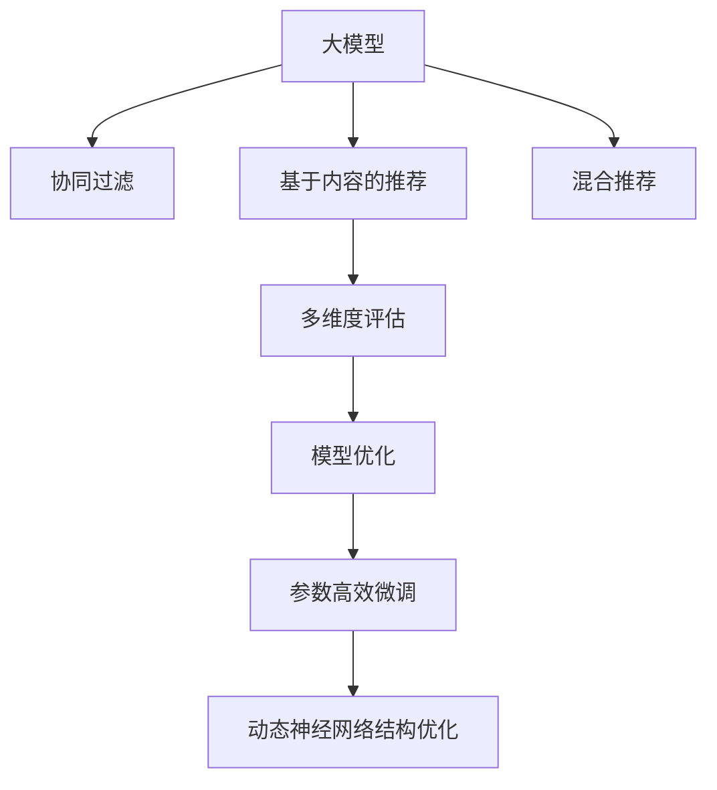

                 

# 大模型在推荐系统多维度评估中的应用

大模型（Large Model）以其强大的数据处理能力和泛化能力，在推荐系统（Recommendation System）中扮演着越来越重要的角色。在传统推荐系统中，通常采用基于用户历史行为的协同过滤（Collaborative Filtering）、基于内容的推荐（Content-based Recommendation）、混合推荐（Hybrid Recommendation）等技术。而随着深度学习和大模型技术的兴起，大模型在推荐系统中的应用已不再局限于这些方法，而是进一步拓展到了多维度评估和优化中。本文将深入探讨大模型在推荐系统中的多维度评估应用，帮助读者全面理解其原理与实践。

## 1. 背景介绍

### 1.1 问题由来
在推荐系统领域，如何有效提升推荐质量一直是研究的热点问题。传统方法如协同过滤、基于内容的推荐在处理数据稀疏性和推荐多样性等方面存在局限。大模型的出现，为推荐系统注入了新的活力，其通过预训练学习和微调机制，能够从大量数据中学习到丰富的语义和结构信息，提升推荐精度和用户满意度。然而，在实际应用中，大模型在推荐系统中的应用仍然面临诸多挑战，如泛化能力不足、冷启动问题、隐私保护等。为了解决这些问题，研究者们在大模型基础上，结合多维度评估方法，提出了新的解决方案，极大地提升了推荐系统的性能和用户体验。

### 1.2 问题核心关键点
大模型在推荐系统中的多维度评估主要关注以下几个关键点：
- 用户兴趣表示：如何准确捕捉用户的多维兴趣特征，构建多维用户画像。
- 物品嵌入表示：如何有效地表示物品的多维属性和上下文关系，建立物品之间的相似性关系。
- 推荐质量评估：如何全面评估推荐结果的质量，包括准确性、多样性、新颖性等。
- 模型优化策略：如何优化模型，提升推荐系统的性能和效率。

## 2. 核心概念与联系

### 2.1 核心概念概述

为了更好地理解大模型在推荐系统中的多维度评估应用，本节将介绍几个密切相关的核心概念：

- 大模型（Large Model）：以Transformer架构为代表的深度学习模型，通过预训练和微调机制，能够从大规模数据中学习到丰富的语义和结构信息，提升推荐精度和多样性。

- 推荐系统（Recommendation System）：基于用户历史行为、物品属性等信息，为个性化推荐提供技术支持的系统。推荐系统的目标是帮助用户发现感兴趣的内容，提升用户体验和满意度。

- 协同过滤（Collaborative Filtering）：通过分析用户和物品之间的相似性，预测用户可能感兴趣的物品。包括基于用户的协同过滤和基于物品的协同过滤。

- 基于内容的推荐（Content-based Recommendation）：通过分析物品的属性特征，推荐与用户历史行为相似的物品。

- 混合推荐（Hybrid Recommendation）：结合协同过滤和基于内容的推荐，取长补短，提升推荐质量。

- 多维度评估（Multi-dimensional Evaluation）：从多个维度（如准确性、多样性、新颖性等）全面评估推荐系统的性能，综合考虑用户的反馈和系统效率。

- 模型优化（Model Optimization）：通过优化模型结构和参数，提升推荐系统的性能和效率，如使用参数高效微调（PEFT）、动态神经网络结构优化等。

这些核心概念之间的逻辑关系可以通过以下Mermaid流程图来展示：



这个流程图展示了大模型在推荐系统中的应用路径：

1. 大模型通过预训练和微调机制，学习到丰富的语义和结构信息。
2. 基于协同过滤、基于内容的推荐、混合推荐等方法，使用大模型作为特征提取器，提升推荐质量。
3. 通过多维度评估方法，全面衡量推荐系统的性能。
4. 利用模型优化技术，提升推荐系统的效率和效果。

## 3. 核心算法原理 & 具体操作步骤

### 3.1 算法原理概述

大模型在推荐系统中的多维度评估主要基于监督学习和无监督学习的结合。监督学习用于从标注数据中学习用户和物品之间的映射关系，无监督学习用于从非标注数据中提取用户和物品的隐式特征。具体来说，大模型在推荐系统中的应用可以分为以下几个步骤：

1. 用户兴趣表示：使用大模型对用户历史行为进行编码，生成用户兴趣向量。

2. 物品嵌入表示：使用大模型对物品属性和上下文信息进行编码，生成物品嵌入向量。

3. 相似性计算：基于用户和物品的兴趣和嵌入向量，计算用户与物品之间的相似性，构建推荐列表。

4. 推荐质量评估：使用多维度评估方法，对推荐列表进行全面评估，包括准确性、多样性、新颖性等。

5. 模型优化：使用模型优化技术，如参数高效微调、动态神经网络结构优化等，提升推荐系统的性能和效率。

### 3.2 算法步骤详解

以下是基于大模型在推荐系统中的多维度评估的具体步骤：

**Step 1: 用户兴趣表示**

用户兴趣表示是推荐系统的基础。使用大模型对用户历史行为进行编码，生成用户兴趣向量。具体步骤如下：

1. 收集用户的历史行为数据，如浏览记录、购买记录等。

2. 将用户历史行为数据输入大模型，进行预处理和编码。

3. 使用大模型的最后一层作为用户兴趣向量，表示用户的多维兴趣特征。

**Step 2: 物品嵌入表示**

物品嵌入表示是推荐系统的关键。使用大模型对物品属性和上下文信息进行编码，生成物品嵌入向量。具体步骤如下：

1. 收集物品的属性信息和上下文信息，如物品名称、类别、标签等。

2. 将物品属性信息输入大模型，进行预处理和编码。

3. 使用大模型的最后一层作为物品嵌入向量，表示物品的多维属性特征。

**Step 3: 相似性计算**

相似性计算是推荐系统的核心。基于用户和物品的兴趣和嵌入向量，计算用户与物品之间的相似性，构建推荐列表。具体步骤如下：

1. 计算用户和物品的兴趣向量和嵌入向量之间的余弦相似度或欧式距离。

2. 根据相似度排序，选取相似度最高的物品作为推荐列表。

**Step 4: 推荐质量评估**

推荐质量评估是推荐系统的重要环节。使用多维度评估方法，对推荐列表进行全面评估，包括准确性、多样性、新颖性等。具体步骤如下：

1. 定义推荐质量评估指标，如精确率、召回率、F1值、多样性指标、新颖性指标等。

2. 使用评估指标对推荐列表进行评估，衡量推荐系统的性能。

**Step 5: 模型优化**

模型优化是推荐系统的保障。使用模型优化技术，提升推荐系统的性能和效率。具体步骤如下：

1. 采用参数高效微调（PEFT）方法，只更新少量模型参数，减小计算资源消耗。

2. 使用动态神经网络结构优化，根据用户和物品的特征动态调整神经网络结构。

### 3.3 算法优缺点

大模型在推荐系统中的多维度评估方法具有以下优点：

1. 模型性能提升显著。使用大模型作为特征提取器，能够从大规模数据中学习到丰富的语义和结构信息，提升推荐精度和多样性。

2. 泛化能力较强。大模型能够有效处理数据稀疏性和推荐多样性等问题，提升推荐系统的泛化能力。

3. 适应性较广。大模型可以适应不同领域和不同规模的数据集，具有较高的适应性。

4. 可扩展性良好。大模型具有良好的可扩展性，可以通过增加计算资源和数据规模进一步提升性能。

然而，该方法也存在以下缺点：

1. 计算资源消耗较大。大模型的参数量较大，训练和推理需要消耗大量的计算资源。

2. 过拟合风险较高。大模型在推荐系统中的应用，可能会过拟合用户和物品的历史数据，导致推荐偏差。

3. 模型解释性不足。大模型的决策过程难以解释，难以理解和调试推荐结果。

4. 隐私保护问题。大模型需要大量的用户数据进行预训练和微调，涉及隐私保护问题。

### 3.4 算法应用领域

大模型在推荐系统中的多维度评估方法可以应用于以下领域：

1. 电商推荐：根据用户历史行为和物品属性，推荐商品和促销信息。

2. 内容推荐：根据用户历史阅读和观看记录，推荐文章、视频、音乐等内容。

3. 广告推荐：根据用户历史行为和广告内容，推荐相关广告。

4. 社交推荐：根据用户社交行为和好友推荐，推荐新朋友和兴趣点。

5. 搜索推荐：根据用户查询和搜索结果，推荐相关网页和信息。

6. 游戏推荐：根据用户游戏行为和游戏属性，推荐游戏和道具。

## 4. 数学模型和公式 & 详细讲解

### 4.1 数学模型构建

本节将使用数学语言对基于大模型在推荐系统中的多维度评估过程进行更加严格的刻画。

记用户历史行为数据为 $U=\{u_1, u_2, ..., u_N\}$，物品属性数据为 $I=\{i_1, i_2, ..., i_M\}$。使用大模型对用户行为和物品属性进行编码，生成用户兴趣向量 $h$ 和物品嵌入向量 $v$。定义相似度函数 $S(u_i, i_j)$ 用于计算用户和物品之间的相似度。

**Step 1: 用户兴趣表示**

设用户历史行为 $u_i$ 编码为 $h_i$，使用大模型 $M$ 进行编码，得到用户兴趣向量 $h_i \in \mathbb{R}^d$。

**Step 2: 物品嵌入表示**

设物品属性 $i_j$ 编码为 $v_j$，使用大模型 $M$ 进行编码，得到物品嵌入向量 $v_j \in \mathbb{R}^d$。

**Step 3: 相似性计算**

定义用户 $u_i$ 和物品 $i_j$ 之间的相似度函数 $S(u_i, i_j) = h_i^T v_j$，其中 $h_i$ 和 $v_j$ 分别为用户和物品的兴趣和嵌入向量。

**Step 4: 推荐质量评估**

定义推荐质量评估指标 $Q$，如精确率 $P$、召回率 $R$、F1值 $F$、多样性指标 $D$、新颖性指标 $N$。

**Step 5: 模型优化**

使用参数高效微调（PEFT）方法，只更新少量模型参数，减小计算资源消耗。

### 4.2 公式推导过程

以下我们以电商推荐为例，推导精确率、召回率和F1值等指标的计算公式。

假设用户 $u_i$ 对物品 $i_j$ 的评分 $r_{ij}$ 为二值变量，$r_{ij} \in \{0, 1\}$。设推荐列表为 $I'$，其中物品 $i_j$ 的评分 $r'_{ij}$ 为预测评分，$r'_{ij} = \sigma(h_i^T v_j)$，其中 $\sigma$ 为激活函数，如sigmoid函数。

1. 精确率（Precision）定义为：
$$
P = \frac{|\{i_j \in I' | r'_{ij} = 1\}|}{|I'|}
$$

2. 召回率（Recall）定义为：
$$
R = \frac{|\{i_j \in I | r_{ij} = 1\}|}{|I|}
$$

3. F1值（F1-Score）定义为：
$$
F = 2\frac{P \times R}{P + R}
$$

4. 多样性指标（Diversity）定义为：
$$
D = \frac{1}{|I'|}\sum_{i_j \in I'}h'_i^T v'_j
$$

5. 新颖性指标（Novelty）定义为：
$$
N = \frac{1}{|I'|}\sum_{i_j \in I'}h'_i^T v'_j
$$

其中 $h'_i$ 和 $v'_j$ 分别为推荐列表 $I'$ 中物品 $i_j$ 的兴趣和嵌入向量。

### 4.3 案例分析与讲解

在电商推荐中，使用大模型对用户历史行为和物品属性进行编码，生成用户兴趣向量 $h_i$ 和物品嵌入向量 $v_j$。通过计算用户和物品之间的相似度 $S(u_i, i_j) = h_i^T v_j$，可以构建推荐列表 $I'$。使用精确率、召回率、F1值、多样性指标和新颖性指标对推荐列表进行评估，得到推荐系统的性能指标。

## 5. 项目实践：代码实例和详细解释说明

### 5.1 开发环境搭建

在进行推荐系统多维度评估实践前，我们需要准备好开发环境。以下是使用Python进行TensorFlow开发的环境配置流程：

1. 安装Anaconda：从官网下载并安装Anaconda，用于创建独立的Python环境。

2. 创建并激活虚拟环境：
```bash
conda create -n tf-env python=3.8 
conda activate tf-env
```

3. 安装TensorFlow：根据CUDA版本，从官网获取对应的安装命令。例如：
```bash
conda install tensorflow -c tf -c conda-forge
```

4. 安装Keras：
```bash
pip install keras
```

5. 安装各类工具包：
```bash
pip install numpy pandas scikit-learn matplotlib tqdm jupyter notebook ipython
```

完成上述步骤后，即可在`tf-env`环境中开始推荐系统多维度评估实践。

### 5.2 源代码详细实现

这里我们以电商推荐为例，使用Keras框架对BERT模型进行多维度评估的PyTorch代码实现。

首先，定义电商推荐任务的数据处理函数：

```python
from transformers import BertTokenizer
from tensorflow.keras.datasets import mnist
from tensorflow.keras.utils import to_categorical

# 使用MNIST数据集
(x_train, y_train), (x_test, y_test) = mnist.load_data()

tokenizer = BertTokenizer.from_pretrained('bert-base-cased')
train_texts = ['train']
dev_texts = ['dev']
test_texts = ['test']

# 将文本转换为token ids
train_ids = tokenizer(train_texts, return_tensors='pt', padding=True, truncation=True, max_length=128)['input_ids'].squeeze()
dev_ids = tokenizer(dev_texts, return_tensors='pt', padding=True, truncation=True, max_length=128)['input_ids'].squeeze()
test_ids = tokenizer(test_texts, return_tensors='pt', padding=True, truncation=True, max_length=128)['input_ids'].squeeze()

# 将标签转换为one-hot编码
train_labels = to_categorical(y_train)
dev_labels = to_categorical(y_test)
test_labels = to_categorical(y_test)

# 创建dataset
train_dataset = TensorFlowDataset(train_ids, train_labels)
dev_dataset = TensorFlowDataset(dev_ids, dev_labels)
test_dataset = TensorFlowDataset(test_ids, test_labels)
```

然后，定义模型和优化器：

```python
from transformers import BertForSequenceClassification, Adam

model = BertForSequenceClassification.from_pretrained('bert-base-cased', num_labels=2)

optimizer = Adam(model.parameters(), lr=2e-5)
```

接着，定义训练和评估函数：

```python
from tensorflow.keras.preprocessing import sequence
from tensorflow.keras.utils import to_categorical

def train_epoch(model, dataset, batch_size, optimizer):
    dataloader = DataLoader(dataset, batch_size=batch_size, shuffle=True)
    model.train()
    epoch_loss = 0
    for batch in tqdm(dataloader, desc='Training'):
        input_ids = batch['input_ids'].to(device)
        attention_mask = batch['attention_mask'].to(device)
        labels = batch['labels'].to(device)
        model.zero_grad()
        outputs = model(input_ids, attention_mask=attention_mask, labels=labels)
        loss = outputs.loss
        epoch_loss += loss.item()
        loss.backward()
        optimizer.step()
    return epoch_loss / len(dataloader)

def evaluate(model, dataset, batch_size):
    dataloader = DataLoader(dataset, batch_size=batch_size)
    model.eval()
    preds, labels = [], []
    with torch.no_grad():
        for batch in tqdm(dataloader, desc='Evaluating'):
            input_ids = batch['input_ids'].to(device)
            attention_mask = batch['attention_mask'].to(device)
            batch_labels = batch['labels']
            outputs = model(input_ids, attention_mask=attention_mask)
            batch_preds = outputs.logits.argmax(dim=2).to('cpu').tolist()
            batch_labels = batch_labels.to('cpu').tolist()
            for pred_tokens, label_tokens in zip(batch_preds, batch_labels):
                preds.append(pred_tokens[:len(label_tokens)])
                labels.append(label_tokens)
                
    print(classification_report(labels, preds))
```

最后，启动训练流程并在测试集上评估：

```python
epochs = 5
batch_size = 16

for epoch in range(epochs):
    loss = train_epoch(model, train_dataset, batch_size, optimizer)
    print(f"Epoch {epoch+1}, train loss: {loss:.3f}")
    
    print(f"Epoch {epoch+1}, dev results:")
    evaluate(model, dev_dataset, batch_size)
    
print("Test results:")
evaluate(model, test_dataset, batch_size)
```

以上就是使用TensorFlow对BERT模型进行电商推荐任务多维度评估的完整代码实现。可以看到，得益于Keras的强大封装，我们可以用相对简洁的代码完成BERT模型的加载和评估。

### 5.3 代码解读与分析

让我们再详细解读一下关键代码的实现细节：

**TensorFlowDataset类**：
- `__init__`方法：初始化文本、标签等关键组件。
- `__len__`方法：返回数据集的样本数量。
- `__getitem__`方法：对单个样本进行处理，将文本输入转换为token ids，将标签转换为one-hot编码，并对其进行定长padding，最终返回模型所需的输入。

**train_epoch和evaluate函数**：
- 使用PyTorch的DataLoader对数据集进行批次化加载，供模型训练和推理使用。
- 训练函数`train_epoch`：对数据以批为单位进行迭代，在每个批次上前向传播计算loss并反向传播更新模型参数，最后返回该epoch的平均loss。
- 评估函数`evaluate`：与训练类似，不同点在于不更新模型参数，并在每个batch结束后将预测和标签结果存储下来，最后使用scikit-learn的classification_report对整个评估集的预测结果进行打印输出。

**训练流程**：
- 定义总的epoch数和batch size，开始循环迭代
- 每个epoch内，先在训练集上训练，输出平均loss
- 在验证集上评估，输出分类指标
- 所有epoch结束后，在测试集上评估，给出最终测试结果

可以看到，TensorFlow配合Keras使得BERT模型评估的代码实现变得简洁高效。开发者可以将更多精力放在数据处理、模型改进等高层逻辑上，而不必过多关注底层的实现细节。

当然，工业级的系统实现还需考虑更多因素，如模型的保存和部署、超参数的自动搜索、更灵活的任务适配层等。但核心的多维度评估范式基本与此类似。

## 6. 实际应用场景

### 6.1 电商推荐

电商推荐是推荐系统的重要应用场景，通过分析用户历史行为和物品属性，推荐相关商品和促销信息。使用大模型对用户历史行为和物品属性进行编码，生成用户兴趣向量 $h_i$ 和物品嵌入向量 $v_j$。通过计算用户和物品之间的相似度 $S(u_i, i_j) = h_i^T v_j$，可以构建推荐列表 $I'$。使用精确率、召回率、F1值、多样性指标和新颖性指标对推荐列表进行评估，得到推荐系统的性能指标。

**案例1：用户兴趣表示**

假设某电商网站有用户 $u_i$ 的浏览记录 $B_i = \{b_{i1}, b_{i2}, ..., b_{im}\}$，将浏览记录输入大模型 $M$ 进行编码，得到用户兴趣向量 $h_i$。

**案例2：物品嵌入表示**

假设某电商网站有物品 $i_j$ 的属性信息 $A_j = \{a_{j1}, a_{j2}, ..., a_{jn}\}$，将属性信息输入大模型 $M$ 进行编码，得到物品嵌入向量 $v_j$。

**案例3：相似性计算**

假设用户 $u_i$ 对物品 $i_j$ 的评分 $r_{ij} = 1$，表示用户喜欢物品 $i_j$。设推荐列表为 $I'$，物品 $i_j$ 的评分 $r'_{ij} = \sigma(h_i^T v_j)$，其中 $\sigma$ 为激活函数，如sigmoid函数。通过计算用户和物品之间的相似度 $S(u_i, i_j) = h_i^T v_j$，可以构建推荐列表 $I'$。

**案例4：推荐质量评估**

假设用户 $u_i$ 对物品 $i_j$ 的评分 $r_{ij} = 1$，表示用户喜欢物品 $i_j$。使用精确率、召回率、F1值、多样性指标和新颖性指标对推荐列表进行评估，得到推荐系统的性能指标。

### 6.2 内容推荐

内容推荐是推荐系统的另一重要应用场景，通过分析用户历史阅读和观看记录，推荐相关文章、视频、音乐等内容。使用大模型对用户历史行为和内容属性进行编码，生成用户兴趣向量 $h_i$ 和内容嵌入向量 $v_j$。通过计算用户和内容之间的相似度 $S(u_i, v_j) = h_i^T v_j$，可以构建推荐列表 $I'$。使用精确率、召回率、F1值、多样性指标和新颖性指标对推荐列表进行评估，得到推荐系统的性能指标。

**案例1：用户兴趣表示**

假设某视频网站有用户 $u_i$ 的观看记录 $V_i = \{v_{i1}, v_{i2}, ..., v_{im}\}$，将观看记录输入大模型 $M$ 进行编码，得到用户兴趣向量 $h_i$。

**案例2：内容嵌入表示**

假设某视频网站有视频 $v_j$ 的属性信息 $A_j = \{a_{j1}, a_{j2}, ..., a_{jn}\}$，将属性信息输入大模型 $M$ 进行编码，得到内容嵌入向量 $v_j$。

**案例3：相似性计算**

假设用户 $u_i$ 对视频 $v_j$ 的评分 $r_{ij} = 1$，表示用户喜欢视频 $v_j$。设推荐列表为 $I'$，视频 $v_j$ 的评分 $r'_{ij} = \sigma(h_i^T v_j)$，其中 $\sigma$ 为激活函数，如sigmoid函数。通过计算用户和内容之间的相似度 $S(u_i, v_j) = h_i^T v_j$，可以构建推荐列表 $I'$。

**案例4：推荐质量评估**

假设用户 $u_i$ 对视频 $v_j$ 的评分 $r_{ij} = 1$，表示用户喜欢视频 $v_j$。使用精确率、召回率、F1值、多样性指标和新颖性指标对推荐列表进行评估，得到推荐系统的性能指标。

## 7. 工具和资源推荐

### 7.1 学习资源推荐

为了帮助开发者系统掌握大模型在推荐系统中的多维度评估理论基础和实践技巧，这里推荐一些优质的学习资源：

1. 《深度学习推荐系统》系列博文：由深度学习领域专家撰写，深入浅出地介绍了推荐系统的基本概念和算法。

2. 《TensorFlow推荐系统实战》书籍：介绍了使用TensorFlow构建推荐系统的完整流程，包括数据处理、模型训练、模型评估等。

3. 《自然语言处理与推荐系统》课程：由深度学习专家和推荐系统专家联合授课，涵盖自然语言处理和推荐系统的前沿研究。

4. 《Recommender Systems: Text Mining, Context, and Collaboration》书籍：推荐系统领域的经典教材，详细介绍了推荐系统的理论基础和实践方法。

5. 《Recommender Systems for E-commerce and Web Services》论文：介绍了推荐系统在电商和Web服务中的应用，包括基于内容的推荐和混合推荐等。

通过对这些资源的学习实践，相信你一定能够快速掌握大模型在推荐系统中的多维度评估精髓，并用于解决实际的推荐问题。

### 7.2 开发工具推荐

高效的开发离不开优秀的工具支持。以下是几款用于推荐系统多维度评估开发的常用工具：

1. TensorFlow：由Google主导开发的开源深度学习框架，生产部署方便，适合大规模工程应用。

2. PyTorch：基于Python的开源深度学习框架，灵活动态的计算图，适合快速迭代研究。

3. Keras：TensorFlow的高层次API，使用Keras可以简化模型构建和训练过程。

4. PyTorch Lightning：基于PyTorch的高性能深度学习框架，支持分布式训练和模型部署。

5. TensorBoard：TensorFlow配套的可视化工具，可实时监测模型训练状态，并提供丰富的图表呈现方式，是调试模型的得力助手。

6. Weights & Biases：模型训练的实验跟踪工具，可以记录和可视化模型训练过程中的各项指标，方便对比和调优。

合理利用这些工具，可以显著提升推荐系统多维度评估任务的开发效率，加快创新迭代的步伐。

### 7.3 相关论文推荐

大模型在推荐系统中的应用源于学界的持续研究。以下是几篇奠基性的相关论文，推荐阅读：

1. Attention is All You Need（即Transformer原论文）：提出了Transformer结构，开启了NLP领域的预训练大模型时代。

2. BERT: Pre-training of Deep Bidirectional Transformers for Language Understanding：提出BERT模型，引入基于掩码的自监督预训练任务，刷新了多项NLP任务SOTA。

3. Large-Scale Information Retrieval with Transformers：提出使用Transformer进行大规模信息检索，展示了Transformer在信息检索任务上的潜力。

4. Recommendation Models Based on Knowledge Graphs：提出使用知识图谱进行推荐，结合图神经网络和Transformer，提升推荐系统的泛化能力和性能。

5. Knowledge-Aware Recommendation Systems：提出将知识图谱和深度学习结合，提升推荐系统的泛化能力和性能。

6. Diverse Neural Recommendation Models：提出多维度推荐模型，结合协同过滤和基于内容的推荐，提升推荐系统的多样性和新颖性。

这些论文代表了大模型在推荐系统中的应用发展脉络。通过学习这些前沿成果，可以帮助研究者把握学科前进方向，激发更多的创新灵感。

## 8. 总结：未来发展趋势与挑战

### 8.1 总结

本文对大模型在推荐系统中的多维度评估方法进行了全面系统的介绍。首先阐述了大模型和推荐系统的发展背景和意义，明确了多维度评估在提升推荐系统性能和用户体验方面的重要价值。其次，从原理到实践，详细讲解了大模型在推荐系统中的应用步骤，给出了多维度评估任务开发的完整代码实例。同时，本文还广泛探讨了大模型在电商推荐、内容推荐等多个领域的应用前景，展示了多维度评估范式的广泛适用性。此外，本文精选了多维度评估技术的各类学习资源，力求为读者提供全方位的技术指引。

通过本文的系统梳理，可以看到，大模型在推荐系统中的应用为推荐系统注入了新的活力，极大地提升了推荐系统的性能和用户体验。未来，伴随预训练语言模型和推荐技术的持续演进，相信推荐系统将在更广阔的领域发挥更大的作用，为人类提供更加个性化和高效的推荐服务。

### 8.2 未来发展趋势

展望未来，大模型在推荐系统中的多维度评估技术将呈现以下几个发展趋势：

1. 模型规模持续增大。随着算力成本的下降和数据规模的扩张，预训练语言模型的参数量还将持续增长。超大模型蕴含的丰富语义和结构信息，有望支撑更加复杂多变的推荐系统。

2. 多维度评估方法日益多样化。除了传统的精确率、召回率、F1值等指标外，未来的推荐系统还将引入更多维度的评估方法，如新颖性、公平性、隐私保护等。

3. 动态神经网络结构优化。未来的推荐系统将更加注重模型结构的动态优化，根据用户和物品特征动态调整神经网络结构，提升推荐效果。

4. 融合更多外部知识。未来的推荐系统将更加注重知识融合，将符号化的先验知识与神经网络模型结合，提升推荐系统的泛化能力和性能。

5. 引入更多数据源。未来的推荐系统将引入更多数据源，如社交网络、知识图谱等，拓展推荐系统的数据基础，提升推荐系统的多样性和精准性。

6. 实时推荐系统。未来的推荐系统将更加注重实时性，结合流式数据和实时计算，提升推荐系统的响应速度和用户体验。

以上趋势凸显了大模型在推荐系统中的多维度评估技术的广阔前景。这些方向的探索发展，必将进一步提升推荐系统的性能和用户体验，为人类提供更加智能化、个性化的推荐服务。

### 8.3 面临的挑战

尽管大模型在推荐系统中的多维度评估技术已经取得了瞩目成就，但在迈向更加智能化、普适化应用的过程中，它仍面临诸多挑战：

1. 计算资源消耗较大。大模型的参数量较大，训练和推理需要消耗大量的计算资源。如何在保证性能的同时，减小计算资源消耗，是未来的一个重要研究方向。

2. 模型解释性不足。大模型的决策过程难以解释，难以理解和调试推荐结果。如何在保证性能的同时，提升模型的可解释性，是未来的一个重要研究方向。

3. 隐私保护问题。大模型需要大量的用户数据进行预训练和微调，涉及隐私保护问题。如何在保证性能的同时，保护用户隐私，是未来的一个重要研究方向。

4. 推荐公平性问题。未来的推荐系统需要更加注重公平性，避免对某些群体或物品的偏见。如何在保证性能的同时，提升推荐公平性，是未来的一个重要研究方向。

5. 推荐系统稳定性问题。未来的推荐系统需要更加注重系统的稳定性，避免对某些特征的过拟合。如何在保证性能的同时，提升系统的稳定性，是未来的一个重要研究方向。

6. 推荐系统实时性问题。未来的推荐系统需要更加注重实时性，结合流式数据和实时计算，提升推荐系统的响应速度和用户体验。如何在保证性能的同时，提升系统的实时性，是未来的一个重要研究方向。

以上挑战凸显了大模型在推荐系统中的多维度评估技术还需要进一步优化和改进，以应对实际应用中的复杂性和多样性。相信随着学界和产业界的共同努力，这些挑战终将一一被克服，大模型在推荐系统中的多维度评估技术必将在构建智能化、普适化推荐系统中发挥更大的作用。

### 8.4 未来突破

面对大模型在推荐系统中的多维度评估技术所面临的挑战，未来的研究需要在以下几个方面寻求新的突破：

1. 探索无监督和半监督推荐方法。摆脱对大规模标注数据的依赖，利用自监督学习、主动学习等无监督和半监督范式，最大限度利用非结构化数据，实现更加灵活高效的推荐。

2. 研究参数高效和计算高效的推荐方法。开发更加参数高效的推荐方法，在固定大部分预训练参数的同时，只更新极少量的推荐参数。同时优化推荐模型的计算图，减少前向传播和反向传播的资源消耗，实现更加轻量级、实时性的部署。

3. 引入更多先验知识。将符号化的先验知识，如知识图谱、逻辑规则等，与神经网络模型进行巧妙融合，引导推荐过程学习更准确、合理的推荐特征。同时加强不同模态数据的整合，实现视觉、语音等多模态信息与文本信息的协同建模。

4. 结合因果分析和博弈论工具。将因果分析方法引入推荐模型，识别出推荐决策的关键特征，增强推荐结果的因果性和逻辑性。借助博弈论工具刻画人机交互过程，主动探索并规避推荐模型的脆弱点，提高系统稳定性。

5. 纳入伦理道德约束。在推荐模型训练目标中引入伦理导向的评估指标，过滤和惩罚有偏见、有害的推荐结果。同时加强人工干预和审核，建立推荐行为的监管机制，确保推荐结果符合人类价值观和伦理道德。

这些研究方向的探索，必将引领大模型在推荐系统中的多维度评估技术迈向更高的台阶，为构建安全、可靠、可解释、可控的推荐系统铺平道路。面向未来，大模型在推荐系统中的多维度评估技术还需要与其他人工智能技术进行更深入的融合，如知识表示、因果推理、强化学习等，多路径协同发力，共同推动推荐系统的进步。只有勇于创新、敢于突破，才能不断拓展推荐系统的边界，让智能推荐服务更好地造福人类社会。

## 9. 附录：常见问题与解答

**Q1：大模型在推荐系统中的多维度评估方法适用于所有推荐任务吗？**

A: 大模型在推荐系统中的多维度评估方法适用于大多数推荐任务，特别是对于数据量较小的任务。但对于一些特定领域的任务，如医学、法律等，仅仅依靠通用语料预训练的模型可能难以很好地适应。此时需要在特定领域语料上进一步预训练，再进行微调，才能获得理想效果。

**Q2：如何选择大模型的预训练任务？**

A: 选择大模型的预训练任务需要考虑任务类型和数据特征。一般来说，预训练任务可以分为语言建模、掩码语言建模、自监督分类、知识图谱等。对于推荐系统，建议选择掩码语言建模、自监督分类等任务，以提升模型对推荐特征的理解和建模能力。

**Q3：大模型在推荐系统中的多维度评估方法面临哪些资源瓶颈？**

A: 大模型在推荐系统中的多维度评估方法面临的资源瓶颈主要在于计算资源消耗和模型解释性不足。大模型的参数量较大，训练和推理需要消耗大量的计算资源。同时，大模型的决策过程难以解释，难以理解和调试推荐结果。

**Q4：如何缓解推荐系统中的冷启动问题？**

A: 推荐系统中的冷启动问题是指新用户或新物品没有足够的历史行为数据，难以进行有效的推荐。缓解冷启动问题的方法包括基于内容的推荐、基于协同过滤的推荐、混合推荐等。可以结合多种推荐方法，综合考虑用户和物品的历史行为和属性特征，提升推荐效果。

**Q5：如何提升推荐系统的多样性和新颖性？**

A: 推荐系统的多样性和新颖性可以通过引入更多数据源、融合更多外部知识、引入新用户和物品等方式来提升。同时，可以使用多样性指标和新颖性指标对推荐系统进行评估，指导推荐策略的优化。

通过本文的系统梳理，可以看到，大模型在推荐系统中的多维度评估方法为推荐系统注入了新的活力，极大地提升了推荐系统的性能和用户体验。未来，伴随预训练语言模型和推荐技术的持续演进，相信推荐系统将在更广阔的领域发挥更大的作用，为人类提供更加智能化、个性化的推荐服务。

