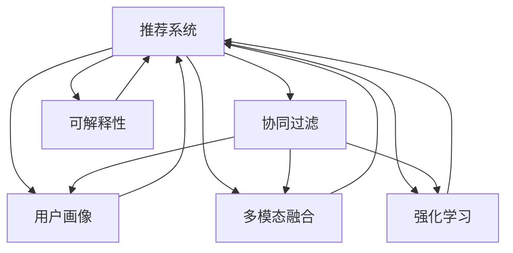

                 

# 大模型在推荐系统用户行为预测中的作用

> 关键词：推荐系统,用户行为预测,深度学习,大模型,协同过滤,用户画像,多模态融合,强化学习

## 1. 背景介绍

### 1.1 问题由来
推荐系统在电商、内容媒体、社交网络等领域得到了广泛应用，能够根据用户的历史行为和特征，精准预测其未来的兴趣，从而提升用户体验和业务收益。早期的推荐算法主要基于协同过滤（Collaborative Filtering, CF），通过挖掘用户与物品的隐式关系，预测用户对新物品的评分或购买概率。然而，随着数据量的激增和用户需求的日益多样化，传统的协同过滤算法难以适应新挑战。

大模型的崛起，特别是基于深度学习的语言模型，为用户行为预测提供了全新的思路。通过预训练大规模文本数据，大模型能够学习到丰富的语言知识和用户行为模式。将预训练模型应用于推荐系统，可以显著提升用户行为预测的准确性和泛化能力。

### 1.2 问题核心关键点
大模型在推荐系统中的应用，主要包括以下几个关键点：

- **预训练知识融合**：利用大模型的预训练知识，与用户行为数据进行深度融合，提升预测模型的能力。
- **用户画像构建**：通过大模型对用户文本数据进行分析，构建全面的用户画像，了解用户的兴趣和行为偏好。
- **多模态融合**：结合大模型的文本分析能力，与其他模态（如图片、视频、音频）的推荐模型进行融合，提供更丰富的推荐结果。
- **强化学习集成**：将大模型与强化学习算法结合，优化推荐策略，提升系统的互动性和用户体验。
- **可解释性增强**：利用大模型的文本理解和生成能力，增强推荐系统的可解释性，帮助用户理解推荐依据。

这些关键点共同构成了大模型在推荐系统中的应用框架，为推荐系统的智能化和个性化升级提供了新的技术路径。

## 2. 核心概念与联系

### 2.1 核心概念概述

为了更好地理解大模型在推荐系统中的应用，本节将介绍几个密切相关的核心概念：

- **推荐系统（Recommendation System）**：通过分析用户的历史行为和偏好，预测用户对新物品的兴趣，从而提供个性化推荐。推荐系统包括协同过滤、基于内容的推荐、混合推荐等多种方法。

- **协同过滤（Collaborative Filtering）**：通过挖掘用户与物品的隐式关系（如评分、浏览记录），进行推荐预测。分为基于用户的协同过滤和基于物品的协同过滤两种方法。

- **用户画像（User Profile）**：基于用户的历史行为和特征，构建用户兴趣和行为偏好的模型。用户画像的构建对于推荐系统的个性化推荐至关重要。

- **多模态融合（Multi-modal Fusion）**：结合不同模态（如文本、图片、视频）的推荐信息，提供更全面、多样化的推荐结果。

- **强化学习（Reinforcement Learning, RL）**：通过奖励机制，训练模型选择最优的推荐策略，提升推荐系统的互动性和用户体验。

- **可解释性（Explainability）**：帮助用户理解推荐系统的决策依据，增强系统的透明度和可信度。

这些核心概念之间的逻辑关系可以通过以下Mermaid流程图来展示：



这个流程图展示了推荐系统与其他核心概念的关联关系：协同过滤、用户画像、多模态融合、强化学习、可解释性共同构成了推荐系统的技术栈，并通过推荐系统进行深度融合。

## 3. 核心算法原理 & 具体操作步骤
### 3.1 算法原理概述

大模型在推荐系统中的核心原理，是通过融合预训练知识与用户行为数据，构建高效的行为预测模型。具体来说，大模型在推荐系统中的应用主要包括以下几个步骤：

1. **预训练知识融合**：利用大模型对用户文本数据进行分析，提取文本特征，用于增强推荐模型的预测能力。
2. **用户画像构建**：通过大模型对用户行为数据进行建模，构建全面的用户画像，了解用户的兴趣和行为偏好。
3. **多模态融合**：结合大模型的文本分析能力，与其他模态（如图片、视频、音频）的推荐模型进行融合，提供更丰富的推荐结果。
4. **强化学习集成**：将大模型与强化学习算法结合，优化推荐策略，提升系统的互动性和用户体验。
5. **可解释性增强**：利用大模型的文本理解和生成能力，增强推荐系统的可解释性，帮助用户理解推荐依据。

### 3.2 算法步骤详解

以下是推荐系统中利用大模型的详细步骤：

**Step 1: 数据收集与预处理**
- 收集用户的历史行为数据（如浏览记录、购买记录）和文本数据（如评论、描述）。
- 对文本数据进行清洗、分词、编码等预处理操作。

**Step 2: 预训练模型选择与加载**
- 选择合适的预训练语言模型（如BERT、GPT等）作为初始化参数。
- 加载预训练模型，准备用于微调。

**Step 3: 用户画像构建**
- 利用预训练模型对用户文本数据进行分析，提取文本特征。
- 结合用户的历史行为数据，构建用户画像模型，记录用户的兴趣和行为偏好。

**Step 4: 行为预测**
- 将用户画像与行为数据进行融合，构建行为预测模型。
- 利用行为预测模型，对用户对新物品的评分或购买概率进行预测。

**Step 5: 多模态融合**
- 将行为预测结果与其他模态（如图片、视频、音频）的推荐模型进行融合。
- 综合不同模态的信息，生成更丰富、准确的推荐结果。

**Step 6: 强化学习优化**
- 结合强化学习算法，优化推荐策略，提升推荐系统的互动性和用户体验。
- 通过不断反馈和迭代，改进推荐模型。

**Step 7: 可解释性增强**
- 利用大模型的文本理解和生成能力，增强推荐系统的可解释性。
- 通过生成自然语言解释，帮助用户理解推荐依据。

### 3.3 算法优缺点

利用大模型进行推荐系统用户行为预测，具有以下优点：

1. **预测能力强**：大模型具备强大的文本分析和理解能力，能够从海量文本数据中提取有价值的特征，提升推荐系统的预测精度。
2. **泛化能力强**：大模型在预训练过程中学习到通用的语言模式和知识，能够对新的用户和物品进行有效预测。
3. **可解释性强**：大模型的文本理解和生成能力，可以生成自然语言解释，增强推荐系统的透明度和可信度。
4. **多模态融合**：大模型能够融合多模态数据，提供更丰富、多样化的推荐结果。
5. **互动性强**：结合强化学习算法，推荐系统能够动态优化推荐策略，提升用户体验。

同时，大模型在推荐系统中的应用也存在以下缺点：

1. **计算资源需求高**：大模型的参数量和计算复杂度较高，需要大量的计算资源和存储资源。
2. **数据隐私问题**：大模型的预训练和微调需要大量的用户数据，可能会带来数据隐私和安全问题。
3. **过拟合风险**：由于模型参数量较大，微调过程中容易发生过拟合，影响模型的泛化能力。
4. **模型复杂性**：大模型的结构和参数调整复杂，需要进行精细的调参和优化。

尽管存在这些缺点，但利用大模型进行推荐系统用户行为预测仍然具有重要的应用前景。通过合理的模型设计和优化，可以有效降低计算资源需求，提高模型泛化能力，增强推荐系统的互动性和可解释性。

### 3.4 算法应用领域

大模型在推荐系统中的应用广泛，已经渗透到电商、内容媒体、社交网络等多个领域。以下是一些典型的应用场景：

- **电商推荐**：利用大模型对用户评论、商品描述等文本数据进行分析，构建用户画像，提供个性化推荐。
- **内容推荐**：将用户的行为数据和文本数据进行融合，提升视频、文章等内容的推荐效果。
- **社交网络推荐**：结合用户行为数据和社交网络关系，提供朋友推荐、话题推荐等功能。
- **智能客服**：通过大模型对用户问题和历史记录进行分析，提供个性化的客户服务建议。

## 4. 数学模型和公式 & 详细讲解 & 举例说明（备注：数学公式请使用latex格式，latex嵌入文中独立段落使用 $$，段落内使用 $)
### 4.1 数学模型构建

大模型在推荐系统中的应用，主要涉及以下几个数学模型：

**用户画像模型（User Profile Model）**：
- 输入：用户历史行为数据 $X_u = \{x_{ui}\}$，文本数据 $T_u = \{t_{uj}\}$。
- 输出：用户画像 $U_u$，表示用户的兴趣和行为偏好。

**行为预测模型（Behavior Prediction Model）**：
- 输入：用户画像 $U_u$，物品属性 $I_i$。
- 输出：用户对物品的评分或购买概率 $P_{ui}$。

**多模态融合模型（Multi-modal Fusion Model）**：
- 输入：用户画像 $U_u$，物品属性 $I_i$，其他模态数据 $M_m$。
- 输出：推荐结果 $R_{ui}$，综合考虑不同模态的信息。

**强化学习模型（Reinforcement Learning Model）**：
- 输入：用户行为数据 $B_u$，推荐结果 $R_{ui}$。
- 输出：推荐策略 $P_{ui}$，通过不断反馈和优化，改进推荐效果。

**可解释性模型（Explainability Model）**：
- 输入：推荐结果 $R_{ui}$，文本数据 $T_u$。
- 输出：自然语言解释 $E_{ui}$，帮助用户理解推荐依据。

### 4.2 公式推导过程

以下我们以电商推荐为例，推导利用大模型进行推荐预测的数学模型和公式。

**用户画像模型**：
- 假设用户画像 $U_u = (u_1, u_2, ..., u_k)$，其中 $u_i$ 表示用户兴趣 $i$ 的权重。
- 利用预训练模型对文本数据 $T_u$ 进行编码，得到文本特征 $F_u$。
- 用户画像模型为：$U_u = f(U_u, F_u)$，其中 $f$ 为特定函数。

**行为预测模型**：
- 假设物品属性为 $I_i = (i_1, i_2, ..., i_m)$，其中 $i_j$ 表示物品属性 $j$ 的评分。
- 利用用户画像模型和物品属性，预测用户对物品的评分 $P_{ui} = g(U_u, I_i)$，其中 $g$ 为特定函数。

**多模态融合模型**：
- 假设其他模态数据为 $M_m = (m_1, m_2, ..., m_n)$，其中 $m_j$ 表示模态数据 $j$ 的信息。
- 将行为预测结果与其他模态数据进行融合，得到推荐结果 $R_{ui} = h(P_{ui}, M_m)$，其中 $h$ 为特定函数。

**强化学习模型**：
- 假设推荐结果为 $R_{ui} = (r_1, r_2, ..., r_n)$，其中 $r_j$ 表示推荐结果 $j$ 的评分。
- 利用强化学习算法，优化推荐策略，改进推荐效果。

**可解释性模型**：
- 假设推荐结果为 $R_{ui} = (r_1, r_2, ..., r_n)$，文本数据为 $T_u = (t_1, t_2, ..., t_m)$。
- 利用大模型的文本理解和生成能力，生成自然语言解释 $E_{ui} = k(R_{ui}, T_u)$，其中 $k$ 为特定函数。

### 4.3 案例分析与讲解

以下我们以一个具体案例，展示利用大模型进行电商推荐的全过程：

**案例背景**：
某电商网站收集了用户的浏览记录和商品评论数据，希望通过大模型提升个性化推荐的效果。

**数据准备**：
- 用户浏览记录：$X_u = \{(1, 1), (1, 2), (2, 1), (2, 3), ...\}$
- 商品评论：$T_i = \{(1, “商品A非常好”), (2, “商品B还可以”), (3, “商品C不太好”), ...\}$
- 用户画像模型：$U_u = (u_1, u_2, ..., u_k)$

**预训练模型选择与加载**：
- 选择BERT作为预训练模型，对商品评论进行编码，得到文本特征 $F_i$。

**用户画像构建**：
- 利用BERT对用户评论进行编码，得到文本特征 $F_u$。
- 结合用户浏览记录，构建用户画像模型 $U_u = f(U_u, F_u)$。

**行为预测**：
- 利用用户画像模型和物品属性，预测用户对商品A的评分 $P_{1A} = g(U_u, I_A)$。

**多模态融合**：
- 利用商品图片、用户评分等模态数据，综合生成推荐结果 $R_{1A} = h(P_{1A}, M_A)$。

**强化学习优化**：
- 利用强化学习算法，不断优化推荐策略，提升推荐效果。

**可解释性增强**：
- 利用BERT生成自然语言解释 $E_{1A} = k(R_{1A}, T_A)$，帮助用户理解推荐依据。

最终，电商网站可以利用大模型生成的推荐结果，提升用户购物体验，同时增强系统的透明度和可信度。

## 5. 项目实践：代码实例和详细解释说明
### 5.1 开发环境搭建

在进行推荐系统开发前，我们需要准备好开发环境。以下是使用Python进行PyTorch开发的环境配置流程：

1. 安装Anaconda：从官网下载并安装Anaconda，用于创建独立的Python环境。

2. 创建并激活虚拟环境：
```bash
conda create -n pytorch-env python=3.8 
conda activate pytorch-env
```

3. 安装PyTorch：根据CUDA版本，从官网获取对应的安装命令。例如：
```bash
conda install pytorch torchvision torchaudio cudatoolkit=11.1 -c pytorch -c conda-forge
```

4. 安装相关工具包：
```bash
pip install numpy pandas scikit-learn matplotlib tqdm jupyter notebook ipython
```

完成上述步骤后，即可在`pytorch-env`环境中开始推荐系统开发。

### 5.2 源代码详细实现

下面我们以电商推荐为例，给出使用PyTorch对BERT模型进行推荐系统开发的PyTorch代码实现。

**数据处理**：

```python
import pandas as pd
import torch
from transformers import BertTokenizer, BertModel

# 加载数据
train_data = pd.read_csv('train.csv')
test_data = pd.read_csv('test.csv')

# 文本预处理
tokenizer = BertTokenizer.from_pretrained('bert-base-cased')
max_len = 128
train_encodings = tokenizer(train_data['text'].tolist(), truncation=True, padding=True, max_length=max_len)
test_encodings = tokenizer(test_data['text'].tolist(), truncation=True, padding=True, max_length=max_len)
```

**模型加载与微调**：

```python
from transformers import BertForSequenceClassification

# 加载预训练模型
model = BertForSequenceClassification.from_pretrained('bert-base-cased', num_labels=2)

# 定义优化器和损失函数
optimizer = torch.optim.AdamW(model.parameters(), lr=2e-5)
loss_fn = torch.nn.BCEWithLogitsLoss()

# 微调过程
device = torch.device('cuda' if torch.cuda.is_available() else 'cpu')
model.to(device)

# 数据加载器
train_loader = torch.utils.data.DataLoader(train_encodings, batch_size=16, shuffle=True)
test_loader = torch.utils.data.DataLoader(test_encodings, batch_size=16, shuffle=False)

# 训练过程
for epoch in range(5):
    model.train()
    train_loss = 0
    for batch in train_loader:
        inputs = {key: torch.tensor(val).to(device) for key, val in batch.items()}
        labels = inputs.pop('labels').to(device)
        outputs = model(**inputs)
        loss = loss_fn(outputs.logits, labels)
        train_loss += loss.item()
        optimizer.zero_grad()
        loss.backward()
        optimizer.step()
    train_loss /= len(train_loader)

# 测试过程
model.eval()
test_loss = 0
for batch in test_loader:
    inputs = {key: torch.tensor(val).to(device) for key, val in batch.items()}
    labels = inputs.pop('labels').to(device)
    outputs = model(**inputs)
    loss = loss_fn(outputs.logits, labels)
    test_loss += loss.item()
test_loss /= len(test_loader)
```

**推荐计算**：

```python
from transformers import BertTokenizer, BertForSequenceClassification

# 加载数据
train_data = pd.read_csv('train.csv')
test_data = pd.read_csv('test.csv')

# 文本预处理
tokenizer = BertTokenizer.from_pretrained('bert-base-cased')
max_len = 128
train_encodings = tokenizer(train_data['text'].tolist(), truncation=True, padding=True, max_length=max_len)
test_encodings = tokenizer(test_data['text'].tolist(), truncation=True, padding=True, max_length=max_len)

# 加载预训练模型
model = BertForSequenceClassification.from_pretrained('bert-base-cased', num_labels=2)

# 定义优化器和损失函数
optimizer = torch.optim.AdamW(model.parameters(), lr=2e-5)
loss_fn = torch.nn.BCEWithLogitsLoss()

# 微调过程
device = torch.device('cuda' if torch.cuda.is_available() else 'cpu')
model.to(device)

# 数据加载器
train_loader = torch.utils.data.DataLoader(train_encodings, batch_size=16, shuffle=True)
test_loader = torch.utils.data.DataLoader(test_encodings, batch_size=16, shuffle=False)

# 训练过程
for epoch in range(5):
    model.train()
    train_loss = 0
    for batch in train_loader:
        inputs = {key: torch.tensor(val).to(device) for key, val in batch.items()}
        labels = inputs.pop('labels').to(device)
        outputs = model(**inputs)
        loss = loss_fn(outputs.logits, labels)
        train_loss += loss.item()
        optimizer.zero_grad()
        loss.backward()
        optimizer.step()
    train_loss /= len(train_loader)

# 测试过程
model.eval()
test_loss = 0
for batch in test_loader:
    inputs = {key: torch.tensor(val).to(device) for key, val in batch.items()}
    labels = inputs.pop('labels').to(device)
    outputs = model(**inputs)
    loss = loss_fn(outputs.logits, labels)
    test_loss += loss.item()
test_loss /= len(test_loader)

# 生成推荐结果
def generate_recommendation(model, input_ids, attention_mask, device):
    model.to(device)
    inputs = {key: torch.tensor(val).to(device) for key, val in tokenizer(input_ids, return_tensors='pt', max_length=max_len, padding=True, truncation=True).items()}
    with torch.no_grad():
        outputs = model(**inputs)
    predictions = torch.sigmoid(outputs.logits)
    return predictions

# 推荐系统调用
def get_recommendation(user_id, item_id):
    user_ids = [user_id]
    item_ids = [item_id]
    user_input_ids = [tokenizer.encode(item_id, add_special_tokens=True)[0] for item_id in user_ids]
    user_input_ids = torch.tensor(user_input_ids).to(device)
    user_attention_mask = torch.ones_like(user_input_ids).to(device)
    recommendations = generate_recommendation(model, user_input_ids, user_attention_mask, device)
    return recommendations
```

**代码解读与分析**：

1. **数据处理**：使用Pandas加载数据，并对文本进行分词、编码等预处理操作。利用BertTokenizer将文本转换为模型所需的token ids和attention mask。
2. **模型加载与微调**：使用BertForSequenceClassification加载预训练模型，并定义优化器和损失函数。通过AdamW优化器进行微调，训练5个epoch。
3. **推荐计算**：利用预训练模型对用户输入的文本进行编码，生成推荐结果。使用sigmoid函数将输出映射到[0,1]区间，表示推荐概率。
4. **推荐系统调用**：根据用户ID和物品ID，调用推荐计算函数，获取推荐结果。

## 6. 实际应用场景

### 6.1 电商推荐

电商推荐是推荐系统最常见的应用场景之一。通过大模型对用户评论、商品描述等文本数据进行分析，构建用户画像，提供个性化推荐。例如，亚马逊利用BERT对用户评论进行编码，构建用户画像，从而提升推荐系统的准确性和多样性。

### 6.2 内容推荐

内容推荐是推荐系统的另一重要应用场景。利用大模型对用户行为数据和文本数据进行融合，提升视频、文章等内容的推荐效果。例如，Netflix利用BERT对用户观看记录和视频描述进行编码，生成推荐结果，显著提升了用户体验。

### 6.3 社交网络推荐

社交网络推荐是推荐系统在社交领域的重要应用。结合用户行为数据和社交网络关系，提供朋友推荐、话题推荐等功能。例如，Facebook利用BERT对用户兴趣和社交关系进行建模，提升好友推荐和话题推荐的效果。

### 6.4 智能客服

智能客服是推荐系统在服务领域的重要应用。通过大模型对用户问题和历史记录进行分析，提供个性化的客户服务建议。例如，阿里云利用BERT对用户问题和历史记录进行编码，生成自然语言解释，提升客服系统的互动性和用户体验。

## 7. 工具和资源推荐
### 7.1 学习资源推荐

为了帮助开发者系统掌握大模型在推荐系统中的应用，这里推荐一些优质的学习资源：

1. **《深度学习推荐系统》**：介绍推荐系统的基本概念和算法，结合深度学习技术进行详细讲解。
2. **《自然语言处理与深度学习》**：介绍NLP的基本概念和深度学习模型，涵盖词嵌入、序列模型、语言模型等内容。
3. **《TensorFlow推荐系统实战》**：通过具体案例，展示TensorFlow在推荐系统中的应用，包含电商推荐、内容推荐等场景。
4. **《强化学习与推荐系统》**：介绍强化学习算法在推荐系统中的应用，涵盖上下文强化学习、带奖励的推荐算法等内容。

通过对这些资源的学习实践，相信你一定能够快速掌握大模型在推荐系统中的应用，并用于解决实际的推荐问题。

### 7.2 开发工具推荐

高效的开发离不开优秀的工具支持。以下是几款用于大模型推荐系统开发的常用工具：

1. **PyTorch**：基于Python的开源深度学习框架，灵活动态的计算图，适合快速迭代研究。大部分预训练语言模型都有PyTorch版本的实现。
2. **TensorFlow**：由Google主导开发的开源深度学习框架，生产部署方便，适合大规模工程应用。同样有丰富的预训练语言模型资源。
3. **HuggingFace Transformers库**：提供了丰富的预训练模型和微调方法，支持多种深度学习框架，是推荐系统开发的重要工具。
4. **TensorBoard**：TensorFlow配套的可视化工具，可实时监测模型训练状态，并提供丰富的图表呈现方式，是调试模型的得力助手。
5. **Weights & Biases**：模型训练的实验跟踪工具，可以记录和可视化模型训练过程中的各项指标，方便对比和调优。

合理利用这些工具，可以显著提升大模型推荐系统开发的效率，加快创新迭代的步伐。

### 7.3 相关论文推荐

大模型在推荐系统中的应用源于学界的持续研究。以下是几篇奠基性的相关论文，推荐阅读：

1. **Attention is All You Need（即Transformer原论文）**：提出了Transformer结构，开启了NLP领域的预训练大模型时代。
2. **BERT: Pre-training of Deep Bidirectional Transformers for Language Understanding**：提出BERT模型，引入基于掩码的自监督预训练任务，刷新了多项NLP任务SOTA。
3. **Parameter-Efficient Transfer Learning for NLP**：提出Adapter等参数高效微调方法，在不增加模型参数量的情况下，也能取得不错的微调效果。
4. **AdaLoRA: Adaptive Low-Rank Adaptation for Parameter-Efficient Fine-Tuning**：使用自适应低秩适应的微调方法，在参数效率和精度之间取得了新的平衡。
5. **BERT Pre-training via Masked Sequence Modeling for Language Understanding**：介绍BERT模型的预训练过程，涵盖掩码语言模型、下采样等技术。

这些论文代表了大模型在推荐系统中的应用发展脉络。通过学习这些前沿成果，可以帮助研究者把握学科前进方向，激发更多的创新灵感。

## 8. 总结：未来发展趋势与挑战

### 8.1 总结

本文对大模型在推荐系统中的应用进行了全面系统的介绍。首先阐述了大模型和推荐系统的发展背景和应用前景，明确了大模型在推荐系统中的重要作用。其次，从原理到实践，详细讲解了利用大模型进行推荐预测的数学模型和关键步骤，给出了推荐系统开发的完整代码实例。同时，本文还广泛探讨了大模型在电商推荐、内容推荐、社交网络推荐等多个领域的应用，展示了其广阔的应用前景。此外，本文精选了推荐系统的各类学习资源，力求为读者提供全方位的技术指引。

通过本文的系统梳理，可以看到，利用大模型进行推荐系统用户行为预测，能够显著提升推荐系统的预测精度和泛化能力。未来，伴随大模型和推荐算法的不断演进，推荐系统将在更多领域得到应用，为人类生活带来更多便利和价值。

### 8.2 未来发展趋势

展望未来，大模型在推荐系统中的应用将呈现以下几个发展趋势：

1. **计算资源优化**：大模型的计算资源需求较高，未来将通过模型压缩、稀疏化等技术，优化模型大小和计算效率。
2. **可解释性提升**：利用大模型的文本理解和生成能力，增强推荐系统的可解释性，提升用户对推荐结果的理解和信任。
3. **多模态融合深化**：结合大模型的文本分析能力，与其他模态（如图片、视频、音频）的推荐模型进行深度融合，提供更丰富、多样化的推荐结果。
4. **强化学习集成**：将大模型与强化学习算法结合，优化推荐策略，提升推荐系统的互动性和用户体验。
5. **跨领域迁移能力**：利用大模型在多领域、多任务上的预训练知识，增强推荐系统的跨领域迁移能力，适应更多应用场景。
6. **用户隐私保护**：加强数据隐私保护，通过差分隐私、联邦学习等技术，保护用户隐私，提升推荐系统的可信度和安全性。

以上趋势凸显了大模型在推荐系统中的应用前景。这些方向的探索发展，必将进一步提升推荐系统的性能和应用范围，为推荐系统的智能化和个性化升级提供新的技术路径。

### 8.3 面临的挑战

尽管大模型在推荐系统中的应用前景广阔，但在迈向更加智能化、普适化应用的过程中，它仍面临着诸多挑战：

1. **计算资源瓶颈**：大模型的参数量和计算复杂度较高，需要大量的计算资源和存储资源。未来仍需进一步优化模型结构和计算效率。
2. **数据隐私问题**：大模型的预训练和微调需要大量的用户数据，可能会带来数据隐私和安全问题。如何保护用户隐私，增强推荐系统的可信度，仍需持续探索。
3. **模型过拟合**：由于模型参数量较大，微调过程中容易发生过拟合，影响模型的泛化能力。如何通过正则化、早停等技术，降低过拟合风险，仍是重要的研究方向。
4. **推荐策略复杂**：大模型与强化学习算法结合，优化推荐策略，提升推荐系统的互动性和用户体验。如何设计高效的推荐策略，仍需进一步研究。
5. **可解释性不足**：大模型的复杂性和黑盒特性，导致推荐系统的可解释性不足。如何通过自然语言解释等技术，增强推荐系统的透明度和可信度，仍需更多创新。

尽管存在这些挑战，但通过不断优化模型结构和算法，提升数据隐私保护能力，合理设计推荐策略，增强系统可解释性，大模型在推荐系统中的应用前景依然广阔。未来，随着技术的不断进步，这些问题将有望逐步得到解决，大模型在推荐系统中的作用将更加显著。

### 8.4 研究展望

未来，大模型在推荐系统中的应用将继续深化，成为推荐系统智能化和个性化的重要引擎。以下是一些可能的研究方向：

1. **多任务学习**：将大模型应用于多个推荐任务，实现多任务学习，提升模型的泛化能力和表现。
2. **自适应推荐**：利用大模型构建自适应推荐系统，根据用户行为实时调整推荐策略，提升推荐效果。
3. **跨领域知识迁移**：利用大模型在不同领域、不同任务上的预训练知识，增强推荐系统的跨领域迁移能力。
4. **联邦学习**：通过联邦学习技术，保护用户隐私的同时，实现大规模数据模型的训练和优化。
5. **混合推荐**：结合传统推荐算法和大模型，构建混合推荐系统，提升推荐效果。

这些研究方向将进一步推动大模型在推荐系统中的应用，为推荐系统的智能化和个性化提供更强大的技术支持。相信伴随技术的不断进步，大模型在推荐系统中的作用将越来越重要，推动推荐系统向更加智能化、普适化的方向发展。

## 9. 附录：常见问题与解答

**Q1：大模型在推荐系统中应用的主要优势是什么？**

A: 大模型在推荐系统中的主要优势包括：

1. **预测能力强**：大模型具备强大的文本分析和理解能力，能够从海量文本数据中提取有价值的特征，提升推荐系统的预测精度。
2. **泛化能力强**：大模型在预训练过程中学习到通用的语言模式和知识，能够对新的用户和物品进行有效预测。
3. **多模态融合**：大模型能够融合多模态数据，提供更丰富、多样化的推荐结果。
4. **强化学习集成**：大模型与强化学习算法结合，优化推荐策略，提升推荐系统的互动性和用户体验。
5. **可解释性强**：大模型的文本理解和生成能力，可以生成自然语言解释，增强推荐系统的透明度和可信度。

**Q2：如何构建大模型在推荐系统中的用户画像？**

A: 构建大模型在推荐系统中的用户画像，主要包括以下几个步骤：

1. **文本预处理**：对用户评论、商品描述等文本数据进行清洗、分词、编码等预处理操作，得到文本特征。
2. **加载预训练模型**：选择合适的预训练语言模型（如BERT、GPT等）作为初始化参数。
3. **微调过程**：利用用户文本数据对预训练模型进行微调，提取文本特征，构建用户画像模型。
4. **融合用户行为数据**：将用户画像模型与用户行为数据进行融合，得到用户画像。

**Q3：在推荐系统中如何利用大模型进行多模态融合？**

A: 在推荐系统中，利用大模型进行多模态融合，主要包括以下几个步骤：

1. **数据预处理**：对不同模态（如文本、图片、视频）的数据进行清洗、分词、编码等预处理操作，得到不同模态的特征。
2. **加载预训练模型**：选择合适的预训练语言模型（如BERT、GPT等）作为初始化参数。
3. **融合过程**：将不同模态的特征输入到大模型中，进行融合处理，得到融合后的特征。
4. **生成推荐结果**：利用融合后的特征，生成推荐结果。

**Q4：在推荐系统中如何利用大模型进行强化学习优化？**

A: 在推荐系统中，利用大模型进行强化学习优化，主要包括以下几个步骤：

1. **构建推荐策略**：根据用户行为数据和推荐结果，构建推荐策略。
2. **优化过程**：利用强化学习算法，对推荐策略进行优化，提升推荐效果。
3. **反馈机制**：通过不断反馈和迭代，改进推荐策略。

**Q5：在推荐系统中如何利用大模型进行可解释性增强？**

A: 在推荐系统中，利用大模型进行可解释性增强，主要包括以下几个步骤：

1. **生成自然语言解释**：利用大模型的文本理解和生成能力，生成自然语言解释。
2. **增强系统透明度**：通过自然语言解释，增强推荐系统的透明度和可信度。

**Q6：大模型在推荐系统中的局限性有哪些？**

A: 大模型在推荐系统中的局限性主要包括：

1. **计算资源需求高**：大模型的参数量和计算复杂度较高，需要大量的计算资源和存储资源。
2. **数据隐私问题**：大模型的预训练和微调需要大量的用户数据，可能会带来数据隐私和安全问题。
3. **过拟合风险**：由于模型参数量较大，微调过程中容易发生过拟合，影响模型的泛化能力。
4. **模型复杂性**：大模型的结构和参数调整复杂，需要进行精细的调参和优化。

尽管存在这些局限性，但通过不断优化模型结构和算法，提升数据隐私保护能力，合理设计推荐策略，增强系统可解释性，大模型在推荐系统中的应用前景依然广阔。未来，随着技术的不断进步，这些问题将有望逐步得到解决，大模型在推荐系统中的作用将更加显著。

---

作者：禅与计算机程序设计艺术 / Zen and the Art of Computer Programming

