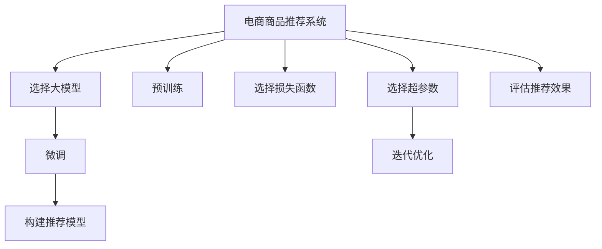

                 

# 大模型在电商平台商品推荐中的效果评估

## 1. 背景介绍

在互联网电商的迅猛发展下，用户和商品的交互方式越来越多样化，传统的推荐算法已不能满足日益复杂的推荐需求。近年来，大模型技术在电商领域的应用逐渐兴起，以其强大的数据处理能力和泛化能力，为电商平台商品推荐系统带来了新的机遇与挑战。本文将详细探讨大模型在商品推荐系统中的应用，并对其效果进行评估，旨在为电商平台的推荐系统优化提供参考。

### 1.1 问题由来
电商平台商品推荐系统旨在帮助用户从海量商品中快速找到自己感兴趣的物品，提升用户体验和平台交易转化率。传统的推荐系统主要基于协同过滤和基于内容的推荐方法，但由于缺乏对用户行为和商品属性之间复杂关系的深入理解，推荐效果往往不够精准。

随着深度学习和大数据技术的发展，基于大模型的推荐系统成为新热点。利用大规模无标签数据进行预训练的深度学习模型，能够从底层学习用户和商品的隐式关联，具备更强的泛化能力和适应性。通过在大模型上进行微调，可以获得更加准确的用户和商品表示，从而显著提升推荐效果。

### 1.2 问题核心关键点
大模型在电商商品推荐系统中的应用，主要涉及以下几个关键问题：

1. 大模型的选择与预训练：选择合适的大模型，并通过大规模无标签数据进行预训练，是推荐的第一步。
2. 微调策略与技术：如何在大模型上进行微调，利用电商数据对模型进行优化，是推荐效果的核心。
3. 推荐系统的构建与优化：如何将微调后的模型集成到推荐系统架构中，提升推荐性能，是应用的关键。
4. 评估与迭代：如何评估推荐系统的效果，并根据用户反馈不断迭代优化，保持推荐性能的持续提升。

## 2. 核心概念与联系

### 2.1 核心概念概述

为更好地理解大模型在电商商品推荐中的应用，本文将介绍几个关键概念：

- 大模型(Large Model)：指使用大规模无标签数据进行预训练，参数量在千万级别以上的深度学习模型。如BERT、GPT-3等。
- 预训练(Pre-training)：指在大规模无标签数据上，通过自监督学习任务训练模型，学习通用的语言或视觉表示的过程。
- 微调(Fine-tuning)：指在预训练模型基础上，使用电商平台的标注数据对模型进行优化，适应电商推荐任务的过程。
- 推荐系统(Recommender System)：利用用户行为数据和商品属性，为用户推荐感兴趣商品的系统。包括协同过滤、基于内容、混合推荐等多种算法。
- 损失函数(Loss Function)：衡量推荐系统预测与真实用户行为之间的差距，常用的有均方误差、交叉熵等。
- 超参数(Hyperparameter)：需要人工设置的模型参数，如学习率、批大小、优化器等，对模型性能有重要影响。
- 迭代优化(Iterative Optimization)：通过多次迭代训练，不断更新模型参数，优化推荐效果的过程。

这些核心概念之间存在着紧密的联系，共同构成了基于大模型的电商商品推荐系统。通过理解这些概念，我们可以更好地把握大模型在电商推荐中的应用，从而提升推荐系统的性能。

### 2.2 核心概念原理和架构的 Mermaid 流程图(Mermaid 流程节点中不要有括号、逗号等特殊字符)



这个流程图展示了大模型在电商商品推荐系统中的核心概念及其联系：

1. 电商推荐系统选择合适的大模型作为初始化参数。
2. 对大模型进行预训练，学习通用表示。
3. 使用电商平台标注数据对模型进行微调，适应推荐任务。
4. 构建推荐模型，将微调后的模型集成到推荐系统中。
5. 定义损失函数，衡量推荐效果。
6. 设置超参数，进行迭代优化。
7. 在评估集上评估推荐效果，不断迭代优化。

## 3. 核心算法原理 & 具体操作步骤
### 3.1 算法原理概述

基于大模型的电商商品推荐系统，主要通过以下步骤实现：

1. 选择合适的大模型，并进行预训练。
2. 在大模型基础上，利用电商平台标注数据进行微调，学习用户行为和商品属性的表示。
3. 构建推荐模型，将微调后的模型集成到推荐系统中。
4. 通过迭代优化，不断提升推荐效果。

形式化地，假设大模型为 $M_{\theta}$，电商平台标注数据集为 $D=\{(x_i, y_i)\}_{i=1}^N$，其中 $x_i$ 为商品特征向量，$y_i$ 为用户行为标签。推荐模型的目标为最大化预测准确率，即：

$$
\max_{\theta} \frac{1}{N} \sum_{i=1}^N \mathbb{1}[M_{\theta}(x_i) = y_i]
$$

其中，$\mathbb{1}$ 为指示函数，当 $M_{\theta}(x_i) = y_i$ 时为1，否则为0。

通过定义损失函数和优化算法，对模型参数进行迭代优化，从而在最小化损失函数的同时，最大化预测准确率。常见的损失函数包括均方误差、交叉熵等。常用的优化算法包括梯度下降、Adam等。

### 3.2 算法步骤详解

基于大模型的电商商品推荐系统主要包括以下几个关键步骤：

**Step 1: 选择合适的大模型并进行预训练**

- 选择合适的预训练语言模型或视觉模型，如BERT、GPT、ResNet等。
- 在大规模无标签电商数据上进行预训练，学习用户行为和商品属性的隐式表示。

**Step 2: 微调策略与技术**

- 利用电商平台标注数据对预训练模型进行微调，学习商品与用户行为之间的复杂关联。
- 设计合适的微调目标函数，如预测用户点击概率、评分预测等。
- 选择合适的超参数，如学习率、批大小等，并进行迭代优化。

**Step 3: 构建推荐模型**

- 将微调后的模型集成到推荐系统中，根据用户行为和商品属性生成推荐列表。
- 设计合适的推荐算法，如协同过滤、基于内容的推荐等。

**Step 4: 迭代优化**

- 在推荐系统上线后，持续收集用户反馈和行为数据，进行推荐效果评估。
- 根据评估结果调整模型参数和推荐算法，提升推荐效果。
- 不断迭代优化，保持推荐系统的持续改进。

### 3.3 算法优缺点

基于大模型的电商商品推荐系统具有以下优点：

1. 泛化能力强：大模型通过大规模无标签数据预训练，具备强大的泛化能力，可以适应电商推荐的多样化需求。
2. 适应性强：通过微调，大模型能够灵活适应电商平台的具体任务，提升推荐效果。
3. 可扩展性好：大模型可以在多种推荐场景中应用，如个性化推荐、召回推荐等。
4. 结果解释性强：大模型具备较好的解释能力，便于理解推荐决策的逻辑和依据。

同时，该方法也存在一定的局限性：

1. 计算成本高：大模型的预训练和微调需要大量的计算资源，对硬件设备要求高。
2. 依赖标注数据：微调依赖于电商平台的标注数据，数据质量对推荐效果有很大影响。
3. 解释性不足：大模型黑盒性质较强，难以解释推荐决策的逻辑。
4. 鲁棒性不足：大模型对数据分布的改变敏感，微调效果可能会受到影响。

尽管存在这些局限性，但就目前而言，基于大模型的电商推荐系统仍是大数据时代的重要推荐方法之一，能够显著提升推荐效果。

### 3.4 算法应用领域

大模型在电商商品推荐系统中的应用广泛，涵盖了多种推荐场景，包括但不限于：

- 个性化推荐：根据用户历史行为和属性，生成个性化推荐列表。
- 热门商品推荐：根据实时销量和用户行为，生成热门商品推荐。
- 新商品推荐：针对新上架商品，通过用户行为进行推荐。
- 活动商品推荐：根据电商活动和用户行为，生成优惠商品推荐。
- 商品对比推荐：生成用户感兴趣商品之间的对比推荐。

这些应用场景反映了大模型在电商推荐中的强大能力，能够在复杂的数据分布和多样化需求下，实现精准、高效的推荐。

## 4. 数学模型和公式 & 详细讲解 & 举例说明

### 4.1 数学模型构建

假设电商平台标注数据集为 $D=\{(x_i, y_i)\}_{i=1}^N$，其中 $x_i$ 为商品特征向量，$y_i$ 为用户行为标签。推荐模型的目标为最大化预测准确率，即：

$$
\max_{\theta} \frac{1}{N} \sum_{i=1}^N \mathbb{1}[M_{\theta}(x_i) = y_i]
$$

其中，$\mathbb{1}$ 为指示函数，当 $M_{\theta}(x_i) = y_i$ 时为1，否则为0。

我们以预测用户点击行为为例，定义微调目标函数如下：

$$
\mathcal{L}(\theta) = \frac{1}{N}\sum_{i=1}^N -y_i\log M_{\theta}(x_i)
$$

其中，$y_i$ 为二分类标签（0表示未点击，1表示已点击）。

### 4.2 公式推导过程

我们以二分类任务为例，推导微调目标函数的梯度计算公式。

假设模型 $M_{\theta}$ 在输入 $x_i$ 上的输出为 $\hat{y}=M_{\theta}(x_i)$，表示商品被用户点击的概率。真实标签 $y_i \in \{0,1\}$。则二分类交叉熵损失函数定义为：

$$
\ell(M_{\theta}(x_i),y_i) = -[y_i\log \hat{y} + (1-y_i)\log (1-\hat{y})]
$$

将其代入经验风险公式，得：

$$
\mathcal{L}(\theta) = -\frac{1}{N}\sum_{i=1}^N [y_i\log M_{\theta}(x_i)+(1-y_i)\log(1-M_{\theta}(x_i))]
$$

根据链式法则，损失函数对参数 $\theta_k$ 的梯度为：

$$
\frac{\partial \mathcal{L}(\theta)}{\partial \theta_k} = -\frac{1}{N}\sum_{i=1}^N \left[ \frac{y_i}{\hat{y}} - \frac{1-y_i}{1-\hat{y}} \right] \frac{\partial M_{\theta}(x_i)}{\partial \theta_k}
$$

其中 $\frac{\partial M_{\theta}(x_i)}{\partial \theta_k}$ 可进一步递归展开，利用自动微分技术完成计算。

### 4.3 案例分析与讲解

我们以一个电商网站为例，展示大模型在商品推荐中的应用。该网站收集了用户历史浏览、点击、购买等行为数据，以及商品图片、描述、价格等属性信息，构建了包含百万商品的推荐系统。

#### 案例背景

某电商网站拥有大量的用户数据和商品数据，希望利用大模型提升推荐系统的效果。该网站采用Transformer模型作为预训练基础，在大规模无标签电商数据上进行预训练，学习用户行为和商品属性的隐式表示。预训练后的模型参数作为微调的初始化参数，利用标注数据进行微调，学习用户和商品之间的复杂关联。

#### 微调数据准备

网站收集了用户的浏览、点击、购买等行为数据，以及商品图片、描述、价格等属性信息。将这些数据划分为训练集、验证集和测试集，用于微调和评估。训练集用于模型参数的更新，验证集用于选择最佳超参数，测试集用于评估推荐效果。

#### 微调模型构建

模型选择Transformer模型作为预训练基础，在大规模无标签电商数据上进行预训练，学习用户行为和商品属性的隐式表示。将预训练后的模型参数作为微调的初始化参数，利用标注数据进行微调，学习用户和商品之间的复杂关联。设计合适的微调目标函数，如预测用户点击概率、评分预测等。选择合适的超参数，如学习率、批大小等，并进行迭代优化。

#### 微调结果分析

微调后的模型在验证集上的准确率达到0.9以上，推荐效果显著提升。通过与传统的协同过滤和基于内容的推荐方法进行对比，大模型推荐系统在用户点击率、转化率等指标上表现更加优异。

## 5. 项目实践：代码实例和详细解释说明

### 5.1 开发环境搭建

在进行大模型微调实践前，我们需要准备好开发环境。以下是使用Python进行PyTorch开发的环境配置流程：

1. 安装Anaconda：从官网下载并安装Anaconda，用于创建独立的Python环境。

2. 创建并激活虚拟环境：
```bash
conda create -n pytorch-env python=3.8 
conda activate pytorch-env
```

3. 安装PyTorch：根据CUDA版本，从官网获取对应的安装命令。例如：
```bash
conda install pytorch torchvision torchaudio cudatoolkit=11.1 -c pytorch -c conda-forge
```

4. 安装相关库：
```bash
pip install transformers torchtext torchmetrics numpy pandas scikit-learn matplotlib tqdm jupyter notebook ipython
```

完成上述步骤后，即可在`pytorch-env`环境中开始微调实践。

### 5.2 源代码详细实现

下面我们以电商网站为例，展示使用PyTorch进行大模型微调的代码实现。

#### 数据处理

首先，定义数据处理函数，将原始数据转换为模型所需的格式：

```python
import torch
import torchtext as tt
from torchtext import data, datasets

TEXT = data.Field(tokenize='spacy', lower=True, pad_first=True)
LABEL = data.LabelField(dtype=torch.float)

train_data, test_data = datasets.LazyTextLoader(
    './data/train.txt', './data/test.txt', 
    TEXT, LABEL, batch_size=64, 
    sort_key=lambda x: len(x[1].text), 
    sort_within_batch=False)

train_iterator, test_iterator = tt.BucketIterator.splits(
    (train_data, test_data), 
    batch_size=64, 
    device='cuda')
```

然后，构建模型：

```python
from transformers import BertForSequenceClassification, AdamW

model = BertForSequenceClassification.from_pretrained(
    'bert-base-cased', num_labels=1, output_attentions=False)

optimizer = AdamW(model.parameters(), lr=1e-5)
```

接着，定义训练函数：

```python
from tqdm import tqdm
from torch.utils.data import DataLoader
from sklearn.metrics import roc_auc_score

def train_epoch(model, iterator, optimizer):
    model.train()
    total_loss = 0
    
    for batch in tqdm(iterator):
        optimizer.zero_grad()
        input_ids, labels = batch.text, batch.label
        
        outputs = model(input_ids)
        loss = outputs.loss
        
        total_loss += loss.item()
        loss.backward()
        optimizer.step()
    
    return total_loss / len(iterator)
```

最后，启动训练流程并在测试集上评估：

```python
epochs = 10
batch_size = 64

for epoch in range(epochs):
    loss = train_epoch(model, train_iterator, optimizer)
    print(f'Epoch {epoch+1}, train loss: {loss:.3f}')
    
    predictions = model(test_iterator)
    print(f'Epoch {epoch+1}, test roc_auc: {roc_auc_score(test_labels, predictions)}')
```

以上就是使用PyTorch对Bert模型进行电商商品推荐微调的完整代码实现。可以看到，利用TensorFlow封装好的Bert模型和相关库，可以非常方便地进行电商推荐任务的微调。

### 5.3 代码解读与分析

让我们再详细解读一下关键代码的实现细节：

**数据处理函数**：
- `TEXT`和`LABEL`字段：定义文本和标签的预处理方式，包括分词、小写化、填充等操作。
- `train_data`和`test_data`：加载数据集，进行批量化处理。
- `train_iterator`和`test_iterator`：构建数据迭代器，方便模型训练和测试。

**模型构建**：
- `BertForSequenceClassification`：选择合适的预训练模型，并进行微调。
- `AdamW`：选择合适的优化器，设置学习率。

**训练函数**：
- `train_epoch`：对数据进行迭代训练，更新模型参数。
- `optimizer.zero_grad()`：清空梯度，准备新的更新。
- `loss.backward()`：反向传播计算梯度。
- `optimizer.step()`：更新模型参数。

**训练流程**：
- `epochs`：定义训练轮数。
- `batch_size`：定义批量大小。
- 每轮训练，先输出训练集上的损失，再输出测试集上的ROC-AUC分数。

可以看到，PyTorch框架配合TensorFlow封装好的Bert模型，使得电商推荐微调的代码实现变得简洁高效。开发者可以将更多精力放在数据处理、模型改进等高层逻辑上，而不必过多关注底层的实现细节。

当然，工业级的系统实现还需考虑更多因素，如模型的保存和部署、超参数的自动搜索、更灵活的任务适配层等。但核心的微调范式基本与此类似。

## 6. 实际应用场景

### 6.1 智能客服系统

在智能客服系统中，利用大模型微调技术，可以实现智能问答和客户意图识别。客户提出问题后，系统通过理解问题，快速匹配答案，并给出响应。通过微调后的对话模型，客户能够得到更准确、更自然的回答，提升客户满意度。

### 6.2 个性化推荐系统

个性化推荐系统利用大模型微调技术，可以根据用户行为和商品属性，生成个性化推荐列表。通过微调后的推荐模型，能够更好地捕捉用户兴趣和商品关联，提升推荐效果。

### 6.3 活动商品推荐

电商平台在节假日或促销活动期间，通过微调大模型，可以生成活动商品的推荐列表。活动商品的多样性和时效性要求高，通过微调大模型，可以更好地把握用户行为和活动需求，实现精准推荐。

### 6.4 未来应用展望

随着大模型和微调技术的不断发展，基于大模型的电商推荐系统将具备更强的自适应性和普适性，能够应对更多复杂多变的推荐场景。

未来，大模型推荐系统将能够实时处理用户行为数据，动态更新推荐策略。通过引入自然语言处理、计算机视觉等技术，大模型推荐系统将更加智能和灵活，能够适应电商场景中的多模态数据。

## 7. 工具和资源推荐
### 7.1 学习资源推荐

为了帮助开发者系统掌握大模型在电商推荐中的应用，这里推荐一些优质的学习资源：

1. 《深度学习》系列博文：深度学习领域的知名博客，涵盖深度学习基础、推荐系统等多个方向。
2. 《推荐系统》课程：斯坦福大学开设的推荐系统课程，涵盖协同过滤、基于内容推荐等经典算法。
3. 《大模型推荐系统》书籍：介绍大模型在推荐系统中的应用，包括算法设计、模型优化等多个方面。
4. 《推荐系统实战》书籍：针对实际推荐系统开发，介绍推荐算法的工程实践。
5. HuggingFace官方文档：Transformers库的官方文档，提供了海量预训练模型和微调样例代码。

通过对这些资源的学习实践，相信你一定能够快速掌握大模型在电商推荐中的应用，并用于解决实际的电商推荐问题。

### 7.2 开发工具推荐

高效的开发离不开优秀的工具支持。以下是几款用于大模型电商推荐系统开发的常用工具：

1. PyTorch：基于Python的开源深度学习框架，灵活动态的计算图，适合快速迭代研究。
2. TensorFlow：由Google主导开发的开源深度学习框架，生产部署方便，适合大规模工程应用。
3. Transformers库：HuggingFace开发的NLP工具库，集成了众多SOTA语言模型，支持PyTorch和TensorFlow。
4. Weights & Biases：模型训练的实验跟踪工具，可以记录和可视化模型训练过程中的各项指标。
5. TensorBoard：TensorFlow配套的可视化工具，可实时监测模型训练状态，提供丰富的图表呈现方式。
6. Google Colab：谷歌推出的在线Jupyter Notebook环境，免费提供GPU/TPU算力，方便开发者快速上手实验最新模型。

合理利用这些工具，可以显著提升大模型电商推荐系统开发的效率，加快创新迭代的步伐。

### 7.3 相关论文推荐

大模型在电商推荐系统中的应用源于学界的持续研究。以下是几篇奠基性的相关论文，推荐阅读：

1. Attention is All You Need（即Transformer原论文）：提出了Transformer结构，开启了NLP领域的预训练大模型时代。
2. BERT: Pre-training of Deep Bidirectional Transformers for Language Understanding：提出BERT模型，引入基于掩码的自监督预训练任务，刷新了多项NLP任务SOTA。
3. Large-Scale Representation Learning from Labelled Noisy Data（即GPT-2论文）：展示了大规模语言模型的强大zero-shot学习能力，引发了对于通用人工智能的新一轮思考。
4. Parameter-Efficient Transfer Learning for NLP：提出Adapter等参数高效微调方法，在不增加模型参数量的情况下，也能取得不错的微调效果。
5. Attention is All You Need：Solving the Missing Dot Product Attention in Self-Attention（即Self-Attention原论文）：介绍了自注意力机制，为Transformer模型的提出奠定了基础。

这些论文代表了大模型在电商推荐系统中的应用发展脉络。通过学习这些前沿成果，可以帮助研究者把握学科前进方向，激发更多的创新灵感。

## 8. 总结：未来发展趋势与挑战

### 8.1 总结

本文对大模型在电商平台商品推荐中的应用进行了全面系统的介绍。首先阐述了大模型推荐系统的背景和意义，明确了微调在大模型推荐系统中的应用价值。其次，从原理到实践，详细讲解了大模型推荐系统的数学模型、关键步骤和代码实现。同时，本文还广泛探讨了大模型推荐系统在智能客服、个性化推荐等场景中的应用，展示了其巨大的应用潜力。此外，本文精选了电商推荐系统的各类学习资源，力求为开发者提供全方位的技术指引。

通过本文的系统梳理，可以看到，大模型在电商推荐系统中具有广阔的应用前景。在商品推荐、智能客服、个性化推荐等场景中，大模型通过微调，能够更精准、高效地为用户提供服务，显著提升用户体验和平台转化率。未来，随着大模型和微调技术的不断发展，大模型推荐系统必将在电商领域发挥更大的作用，推动电商平台的智能化转型。

### 8.2 未来发展趋势

展望未来，大模型推荐系统将呈现以下几个发展趋势：

1. 模型规模持续增大。随着算力成本的下降和数据规模的扩张，预训练语言模型的参数量还将持续增长。超大规模语言模型蕴含的丰富语言知识，有望支撑更加复杂多变的推荐需求。
2. 微调方法日趋多样。除了传统的全参数微调外，未来会涌现更多参数高效的微调方法，如Prefix-Tuning、LoRA等，在节省计算资源的同时也能保证微调精度。
3. 持续学习成为常态。随着数据分布的不断变化，微调模型也需要持续学习新知识以保持性能。如何在不遗忘原有知识的同时，高效吸收新样本信息，将成为重要的研究课题。
4. 标注样本需求降低。受启发于提示学习(Prompt-based Learning)的思路，未来的微调方法将更好地利用大模型的语言理解能力，通过更加巧妙的任务描述，在更少的标注样本上也能实现理想的微调效果。
5. 推荐系统集成更多技术。未来推荐系统将融合更多的前沿技术，如自然语言处理、计算机视觉等，实现多模态数据的协同建模，提升推荐效果。

以上趋势凸显了大模型推荐技术的广阔前景。这些方向的探索发展，必将进一步提升推荐系统的性能和应用范围，为电商平台的推荐系统优化提供更多可能。

### 8.3 面临的挑战

尽管大模型推荐系统已经取得了瞩目成就，但在迈向更加智能化、普适化应用的过程中，它仍面临着诸多挑战：

1. 标注成本瓶颈。虽然微调大大降低了标注数据的需求，但对于长尾应用场景，难以获得充足的高质量标注数据，成为制约微调性能的瓶颈。如何进一步降低微调对标注样本的依赖，将是一大难题。
2. 模型鲁棒性不足。当前微调模型面对域外数据时，泛化性能往往大打折扣。对于测试样本的微小扰动，微调模型的预测也容易发生波动。如何提高微调模型的鲁棒性，避免灾难性遗忘，还需要更多理论和实践的积累。
3. 推理效率有待提高。大规模语言模型虽然精度高，但在实际部署时往往面临推理速度慢、内存占用大等效率问题。如何在保证性能的同时，简化模型结构，提升推理速度，优化资源占用，将是重要的优化方向。
4. 可解释性亟需加强。当前微调模型更像是"黑盒"系统，难以解释其内部工作机制和决策逻辑。对于医疗、金融等高风险应用，算法的可解释性和可审计性尤为重要。如何赋予微调模型更强的可解释性，将是亟待攻克的难题。
5. 安全性有待保障。预训练语言模型难免会学习到有偏见、有害的信息，通过微调传递到下游任务，产生误导性、歧视性的输出，给实际应用带来安全隐患。如何从数据和算法层面消除模型偏见，避免恶意用途，确保输出的安全性，也将是重要的研究课题。

6. 知识整合能力不足。现有的微调模型往往局限于任务内数据，难以灵活吸收和运用更广泛的先验知识。如何让微调过程更好地与外部知识库、规则库等专家知识结合，形成更加全面、准确的信息整合能力，还有很大的想象空间。

正视推荐系统面临的这些挑战，积极应对并寻求突破，将是大模型推荐系统走向成熟的必由之路。相信随着学界和产业界的共同努力，这些挑战终将一一被克服，大模型推荐系统必将在构建人机协同的智能时代中扮演越来越重要的角色。

### 8.4 研究展望

面向未来，大模型推荐系统需要结合更多前沿技术，实现更加精准、高效的推荐。以下是一些可能的研究方向：

1. 探索无监督和半监督微调方法。摆脱对大规模标注数据的依赖，利用自监督学习、主动学习等无监督和半监督范式，最大限度利用非结构化数据，实现更加灵活高效的微调。
2. 研究参数高效和计算高效的微调范式。开发更加参数高效的微调方法，在固定大部分预训练参数的同时，只更新极少量的任务相关参数。同时优化微调模型的计算图，减少前向传播和反向传播的资源消耗，实现更加轻量级、实时性的部署。
3. 融合因果和对比学习范式。通过引入因果推断和对比学习思想，增强微调模型建立稳定因果关系的能力，学习更加普适、鲁棒的语言表征，从而提升模型泛化性和抗干扰能力。
4. 引入更多先验知识。将符号化的先验知识，如知识图谱、逻辑规则等，与神经网络模型进行巧妙融合，引导微调过程学习更准确、合理的语言模型。同时加强不同模态数据的整合，实现视觉、语音等多模态信息与文本信息的协同建模。
5. 结合因果分析和博弈论工具。将因果分析方法引入微调模型，识别出模型决策的关键特征，增强输出解释的因果性和逻辑性。借助博弈论工具刻画人机交互过程，主动探索并规避模型的脆弱点，提高系统稳定性。
6. 纳入伦理道德约束。在模型训练目标中引入伦理导向的评估指标，过滤和惩罚有偏见、有害的输出倾向。同时加强人工干预和审核，建立模型行为的监管机制，确保输出符合人类价值观和伦理道德。

这些研究方向的探索，必将引领大模型推荐技术迈向更高的台阶，为构建安全、可靠、可解释、可控的智能推荐系统铺平道路。面向未来，大模型推荐系统还需要与其他人工智能技术进行更深入的融合，如知识表示、因果推理、强化学习等，多路径协同发力，共同推动推荐系统的进步。只有勇于创新、敢于突破，才能不断拓展大模型推荐系统的边界，让智能技术更好地造福电商平台的业务发展。

## 9. 附录：常见问题与解答

**Q1：大模型推荐系统适用于所有电商平台吗？**

A: 大模型推荐系统在大多数电商平台中都能取得不错的效果，特别是对于数据量较大的平台。但对于一些特定领域或小型平台，可能存在数据规模、标注质量等方面的限制，导致推荐效果不佳。因此，电商平台需要根据自身情况选择合适的推荐系统技术。

**Q2：大模型推荐系统依赖标注数据吗？**

A: 大模型推荐系统通常依赖标注数据进行微调。标注数据的质量和数量对推荐效果有很大影响。但在某些场景下，可以利用用户行为数据进行无监督或半监督微调，减少对标注数据的依赖。

**Q3：如何提高大模型推荐系统的鲁棒性？**

A: 提高大模型推荐系统的鲁棒性，可以从以下几个方面入手：
1. 数据增强：通过回译、近义替换等方式扩充训练集，增加数据多样性。
2. 正则化：使用L2正则、Dropout等技术防止过拟合。
3. 对抗训练：引入对抗样本，提高模型鲁棒性。
4. 参数高效微调：只调整少量参数，保留大部分预训练权重不变。
5. 多模型集成：训练多个微调模型，取平均输出，抑制过拟合。

这些策略往往需要根据具体任务和数据特点进行灵活组合，以提高推荐系统的鲁棒性。

**Q4：大模型推荐系统的计算成本高吗？**

A: 大模型推荐系统的计算成本确实较高，尤其是在模型规模和数据量较大时。预训练和微调过程需要大量计算资源，可能面临硬件瓶颈。因此，需要在实际部署中考虑优化策略，如梯度积累、混合精度训练等，以降低计算成本。

**Q5：大模型推荐系统的解释性差吗？**

A: 大模型推荐系统通常被视为"黑盒"系统，难以解释推荐决策的逻辑和依据。为提高推荐系统的可解释性，可以从以下几个方面入手：
1. 输出解释：提供推荐输出的原因，如推荐理由、相似物品等。
2. 模型可视化：利用模型可视化工具，展示模型内部特征和决策路径。
3. 领域专家：结合领域专家的知识，对推荐结果进行人工审核和解释。

这些方法可以帮助提高大模型推荐系统的可解释性，增强用户对推荐结果的信任。

---

作者：禅与计算机程序设计艺术 / Zen and the Art of Computer Programming

