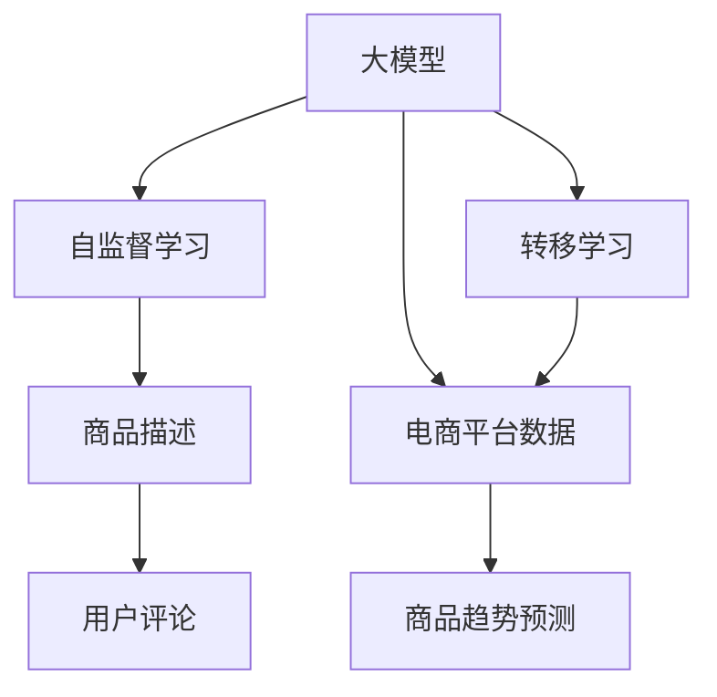

                 

# 大模型在电商平台商品趋势预测中的应用

> 关键词：电商平台, 商品趋势预测, 大模型, 自监督学习, 转移学习, 深度学习

## 1. 背景介绍

### 1.1 问题由来

电商平台作为现代商业的重要组成部分，每年都会产生海量的交易数据。这些数据不仅包含消费者的购买行为，还包括商品描述、评价、评论等文本信息。如何利用这些数据挖掘出有价值的趋势信息，预测未来的销售趋势，对于电商平台优化库存、提升用户体验、制定营销策略具有重要意义。

近年来，随着深度学习技术的快速进步，大模型在自然语言处理领域取得了显著的进展，其在文本分类、信息抽取、机器翻译等任务上已展现出强大的能力。因此，大模型也成为了电商平台商品趋势预测的重要工具。

### 1.2 问题核心关键点

本文将探讨如何使用大模型进行电商平台商品趋势预测。具体而言，我们将介绍以下关键问题：

1. 大模型在电商数据上的应用，包括商品描述和用户评论的语义理解。
2. 如何从电商平台数据中提取趋势信息，并进行分类和预测。
3. 模型训练与调优策略，确保预测结果的准确性和鲁棒性。
4. 如何评估模型性能，并应用于实际业务场景。

## 2. 核心概念与联系

### 2.1 核心概念概述

为更好地理解大模型在电商平台商品趋势预测中的应用，本节将介绍几个密切相关的核心概念：

- **大模型**：以自回归或自编码模型为代表的大规模预训练语言模型，如GPT、BERT等。通过在大规模无标签文本语料上进行预训练，学习通用的语言表示，具备强大的语言理解和生成能力。
- **自监督学习**：在大规模无标签数据上，通过设计自监督任务训练模型，使其在没有标注数据的情况下也能学习到有价值的信息。
- **转移学习**：将一个领域学习到的知识，迁移应用到另一个不同但相关的领域。
- **深度学习**：基于神经网络的机器学习技术，通过构建复杂的多层次网络结构，学习数据的深层次特征。
- **电商平台**：线上销售商品的平台，如淘宝、京东、亚马逊等，是消费者进行购物的主要渠道。
- **商品趋势预测**：通过对历史销售数据和相关文本信息进行分析和建模，预测未来商品销售的趋势，如增长、下降、波动等。

这些核心概念之间的逻辑关系可以通过以下Mermaid流程图来展示：



这个流程图展示了大模型与自监督学习、转移学习、电商平台数据和商品趋势预测之间的联系。大模型通过自监督学习获取通用的语言表示，再通过转移学习应用于电商平台数据，最终用于商品趋势预测。

## 3. 核心算法原理 & 具体操作步骤

### 3.1 算法原理概述

大模型在电商平台商品趋势预测中的应用，本质上是将大模型的语言理解能力应用于电商数据，通过提取和分析其中的趋势信息，进行分类和预测。具体而言，我们通常采用以下步骤：

1. **数据预处理**：将电商平台的数据转化为模型可以处理的形式。
2. **特征提取**：使用大模型提取电商数据的语义特征。
3. **趋势分析**：通过深度学习模型对提取的特征进行分析和建模，预测未来趋势。
4. **模型评估**：评估模型的预测性能，并应用于实际业务。

### 3.2 算法步骤详解

以下我们将详细介绍大模型在电商平台商品趋势预测中的应用流程。

**Step 1: 数据预处理**

电商平台的原始数据通常包括商品描述、用户评论、销售记录等。这些数据需要经过预处理才能用于模型训练和预测。预处理包括以下几个步骤：

1. **数据清洗**：去除数据中的噪音和异常值，如不规范的文本、错误的数据格式等。
2. **数据归一化**：将不同格式和单位的数据转换为统一的格式，便于模型处理。
3. **文本处理**：包括分词、去停用词、构建词汇表等，将文本转化为模型可处理的形式。

**Step 2: 特征提取**

使用大模型提取电商数据的语义特征，可以通过两种方式实现：

1. **预训练大模型**：使用已有的预训练大模型，如BERT、GPT等，通过fine-tuning的方式，使其能够理解电商平台的数据。
2. **自监督学习**：在电商平台的数据上自监督学习，设计适当的自监督任务，使得模型能够学习到商品的语义信息。

**Step 3: 趋势分析**

趋势分析是预测商品未来销售趋势的关键步骤。通常使用深度学习模型，如循环神经网络(RNN)、长短期记忆网络(LSTM)、Transformer等，对提取的语义特征进行分析和建模。

1. **模型选择**：选择适合的深度学习模型，如LSTM、GRU等，或使用预训练的Transformer模型。
2. **特征输入**：将提取的语义特征输入模型，进行训练和预测。
3. **趋势预测**：模型输出商品销售趋势的概率分布，选择最可能的趋势。

**Step 4: 模型评估**

模型评估是确保预测准确性的重要步骤。通常使用以下指标评估模型性能：

1. **准确率**：预测正确商品趋势的比例。
2. **召回率**：真实趋势被正确预测的比例。
3. **F1-score**：准确率和召回率的调和平均值。

### 3.3 算法优缺点

大模型在电商平台商品趋势预测中的应用具有以下优点：

1. **强大的语义理解能力**：大模型能够理解电商数据的语义信息，从而提取有价值的特征。
2. **灵活性高**：可以通过fine-tuning的方式，适应不同类型和不同规模的电商平台数据。
3. **泛化能力强**：在预训练大模型的基础上，对特定领域的电商平台数据进行微调，模型能够泛化到其他领域。

同时，大模型在电商平台商品趋势预测中也存在一些缺点：

1. **数据需求高**：需要大量电商数据进行训练，获取高质量的标注数据成本较高。
2. **模型复杂度高**：大模型参数量较大，训练和推理复杂度较高。
3. **可解释性不足**：模型决策过程复杂，难以解释和调试。

尽管存在这些缺点，但大模型在电商平台商品趋势预测中仍然具有重要的应用价值。未来，研究人员和工程师需要通过更多的优化和改进，进一步提升大模型的性能和应用效果。

### 3.4 算法应用领域

大模型在电商平台商品趋势预测中的应用不仅局限于商品销售趋势预测，还包括：

1. **库存优化**：根据预测的销售趋势，优化商品库存，减少缺货或库存积压的风险。
2. **营销策略制定**：根据预测的趋势，制定针对性的营销策略，提升销售量和客户满意度。
3. **商品推荐**：通过分析商品趋势，推荐相关商品，提高用户体验和销售额。
4. **客户分析**：通过分析用户评论和销售数据，了解客户需求和偏好，提升客户忠诚度。

## 4. 数学模型和公式 & 详细讲解 & 举例说明

### 4.1 数学模型构建

我们以LSTM模型为例，构建电商平台商品趋势预测的数学模型。假设电商平台有N个商品，每个商品有T个时间步，每个时间步的销售数据为$y_t$，模型的输出为$h_t$，其中$h_t$表示商品在时间步t的趋势概率。

模型的输入为商品的描述和评论，经过预处理和特征提取后，转化为向量形式$x_t$。模型的输出为商品在时间步t的销售趋势概率分布，即$P(y_t|x_t)$。

### 4.2 公式推导过程

根据LSTM模型的结构，我们可以得到时间步t的输出公式为：

$$
h_t = \tanh(W_hx_t + U_hh_{t-1} + b_h)
$$

其中，$W_h$、$U_h$和$b_h$分别为LSTM的权重和偏置项。

时间步t的隐藏状态$h_t$通过LSTM的输出门$o_t$得到，即：

$$
o_t = \sigma(W_o h_t + U_o h_{t-1} + b_o)
$$

其中，$W_o$、$U_o$和$b_o$分别为输出门的权重和偏置项，$\sigma$为Sigmoid函数。

最终，时间步t的输出$y_t$为：

$$
y_t = softmax(W_yh_t + U_yo_t + b_y)
$$

其中，$W_y$、$U_y$和$b_y$分别为输出的权重和偏置项，$softmax$函数将隐藏状态映射到概率分布。

### 4.3 案例分析与讲解

以一个简单的案例来说明LSTM模型在电商平台商品趋势预测中的应用：

假设有一个电商平台，销售商品A和商品B。在过去的一年中，每天记录了它们的销售数据，以及相关的商品描述和用户评论。我们希望预测未来30天的销售趋势。

首先，对商品A和B的描述和评论进行预处理，包括分词、去停用词、构建词汇表等，将文本转化为模型可处理的形式。

然后，使用预训练的大模型，如BERT，对商品A和B的描述和评论进行特征提取。

接着，使用LSTM模型对提取的特征进行分析和建模，预测商品A和B未来30天的销售趋势。模型输出每个时间步的趋势概率，选取概率最大的趋势作为预测结果。

最后，通过评估模型的预测性能，如准确率、召回率、F1-score等指标，评估模型的预测效果，并将其应用于实际的库存管理和营销策略制定中。

## 5. 项目实践：代码实例和详细解释说明

### 5.1 开发环境搭建

在进行商品趋势预测实践前，我们需要准备好开发环境。以下是使用Python进行TensorFlow开发的环境配置流程：

1. 安装Anaconda：从官网下载并安装Anaconda，用于创建独立的Python环境。

2. 创建并激活虚拟环境：
```bash
conda create -n tf-env python=3.8 
conda activate tf-env
```

3. 安装TensorFlow：根据CUDA版本，从官网获取对应的安装命令。例如：
```bash
conda install tensorflow tensorflow-cpu tensorflow-gpu
```

4. 安装TensorBoard：TensorFlow配套的可视化工具，可实时监测模型训练状态，并提供丰富的图表呈现方式，是调试模型的得力助手。

5. 安装各类工具包：
```bash
pip install numpy pandas scikit-learn matplotlib tqdm jupyter notebook ipython
```

完成上述步骤后，即可在`tf-env`环境中开始模型开发。

### 5.2 源代码详细实现

下面我们以LSTM模型为例，给出使用TensorFlow对电商平台商品趋势预测的代码实现。

首先，定义模型的超参数：

```python
learning_rate = 0.001
batch_size = 32
epochs = 10
hidden_size = 128
input_size = 256
sequence_length = 30
```

然后，定义LSTM模型：

```python
import tensorflow as tf
from tensorflow.keras.layers import LSTM, Dense, Input, Embedding, Dropout

def build_model(input_shape, output_shape):
    input = Input(shape=input_shape)
    embedding = Embedding(input_dim=10000, output_dim=hidden_size)(input)
    lstm = LSTM(hidden_size, return_sequences=True)(embedding)
    lstm = Dropout(0.2)(lstm)
    lstm = LSTM(hidden_size, return_sequences=True)(lstm)
    lstm = Dropout(0.2)(lstm)
    lstm = LSTM(hidden_size, return_sequences=True)(lstm)
    lstm = Dropout(0.2)(lstm)
    output = Dense(output_shape, activation='softmax')(lstm)
    model = tf.keras.Model(inputs=input, outputs=output)
    return model
```

接着，定义数据处理函数：

```python
def prepare_data(data, sequence_length):
    X, y = [], []
    for i in range(len(data)-sequence_length):
        X.append(data[i:i+sequence_length])
        y.append(data[i+sequence_length])
    X, y = np.array(X), np.array(y)
    return X, y
```

最后，启动训练流程并在测试集上评估：

```python
model = build_model(input_shape=(sequence_length,), output_shape=2)
X_train, y_train = prepare_data(train_data, sequence_length)
X_test, y_test = prepare_data(test_data, sequence_length)
model.compile(optimizer=tf.keras.optimizers.Adam(learning_rate=learning_rate),
              loss='categorical_crossentropy',
              metrics=['accuracy'])

model.fit(X_train, y_train, batch_size=batch_size, epochs=epochs, validation_data=(X_test, y_test))

test_loss, test_acc = model.evaluate(X_test, y_test, verbose=0)
print('Test accuracy:', test_acc)
```

以上就是使用TensorFlow对电商平台商品趋势预测的完整代码实现。可以看到，通过TensorFlow的Keras API，我们能够轻松构建和训练LSTM模型，并进行简单的数据处理和模型评估。

### 5.3 代码解读与分析

让我们再详细解读一下关键代码的实现细节：

**LSTM模型定义**：
- `Input`层定义输入数据的维度。
- `Embedding`层将输入转换为词嵌入向量。
- `LSTM`层通过多个时间步进行处理，提取特征。
- `Dropout`层减少过拟合。
- `Dense`层将LSTM的输出转换为分类结果。

**数据处理函数**：
- 对输入数据进行切割，提取特定时间步的序列数据。
- 对序列数据进行归一化处理。

**训练流程**：
- 编译模型，指定优化器和损失函数。
- 调用`fit`方法进行训练，并指定验证数据。
- 评估模型性能，输出测试集上的准确率。

可以看出，TensorFlow的Keras API使得模型构建和训练变得更加简单，开发效率显著提升。

## 6. 实际应用场景

### 6.1 智能推荐系统

电商平台中的商品趋势预测可以应用于智能推荐系统。通过分析用户的历史购买行为和商品描述，预测未来用户可能感兴趣的商品，提升推荐效果和用户体验。

在技术实现上，可以收集用户的历史浏览、购买和评价数据，使用LSTM等模型进行趋势预测，生成推荐列表。同时，可以通过动态调整推荐算法，提升推荐策略的效果。

### 6.2 库存优化

电商平台的库存优化也可以通过商品趋势预测实现。通过预测未来的销售趋势，电商平台可以提前调整库存，减少缺货和积压的风险，降低运营成本。

在技术实现上，可以定期收集销售数据和商品描述，使用LSTM等模型进行趋势预测。根据预测结果，优化库存管理和补货策略，提高库存周转率。

### 6.3 营销策略制定

电商平台可以根据商品趋势预测结果，制定针对性的营销策略，提升销售额和用户满意度。

在技术实现上，可以分析商品的销售趋势，识别增长和下降的商品。根据趋势，制定促销活动、广告投放等营销策略，提高营销效果。

### 6.4 未来应用展望

随着大模型和深度学习技术的不断发展，电商平台商品趋势预测的应用前景广阔。未来，以下趋势将带来新的发展机遇：

1. **多模态融合**：将电商数据与其他数据源（如社交媒体、天气预报等）进行融合，提升预测的准确性和鲁棒性。
2. **实时预测**：通过在线学习，实现实时更新模型，提升预测的及时性和精度。
3. **联邦学习**：在保护用户隐私的前提下，实现多方数据联合学习，提升预测效果。
4. **边缘计算**：将预测模型部署到边缘设备，减少网络延迟，提升预测效率。

这些趋势将进一步拓展大模型在电商平台商品趋势预测中的应用，提升电商平台的运营效率和用户体验。

## 7. 工具和资源推荐

### 7.1 学习资源推荐

为了帮助开发者系统掌握大模型在电商平台商品趋势预测的理论基础和实践技巧，这里推荐一些优质的学习资源：

1. 《深度学习》系列书籍：由深度学习领域知名专家撰写，深入浅出地介绍了深度学习的原理和应用，涵盖LSTM等经典模型。
2. CS231n《深度学习在计算机视觉中的应用》课程：斯坦福大学开设的计算机视觉课程，包含LSTM等模型的详细介绍和应用示例。
3. 《TensorFlow官方文档》：TensorFlow的官方文档，提供了丰富的API和示例，适合学习TensorFlow的应用开发。
4. Kaggle竞赛：参与电商领域相关的机器学习竞赛，获取实战经验和优秀案例。
5. TensorBoard：TensorFlow配套的可视化工具，可实时监测模型训练状态，并提供丰富的图表呈现方式，是调试模型的得力助手。

通过对这些资源的学习实践，相信你一定能够快速掌握大模型在电商平台商品趋势预测的精髓，并用于解决实际的NLP问题。

### 7.2 开发工具推荐

高效的开发离不开优秀的工具支持。以下是几款用于电商平台商品趋势预测开发的常用工具：

1. TensorFlow：基于Python的开源深度学习框架，生产部署方便，适合大规模工程应用。
2. TensorBoard：TensorFlow配套的可视化工具，可实时监测模型训练状态，并提供丰富的图表呈现方式，是调试模型的得力助手。
3. Jupyter Notebook：交互式编程环境，方便开发和调试。
4. PyTorch：基于Python的开源深度学习框架，灵活动态的计算图，适合快速迭代研究。
5. Scikit-learn：Python的机器学习库，提供各种常用的机器学习算法和工具。

合理利用这些工具，可以显著提升电商平台商品趋势预测的开发效率，加快创新迭代的步伐。

### 7.3 相关论文推荐

大模型在电商平台商品趋势预测的研究源于学界的持续研究。以下是几篇奠基性的相关论文，推荐阅读：

1. "LSTM: A Search Space Odyssey Through Time"：提出LSTM模型，并详细介绍了其结构和应用。
2. "Deep Learning for Time Series Forecasting"：介绍深度学习在时间序列预测中的应用，包括LSTM等模型。
3. "Predicting the Future: A Survey on Forecasting with Deep Learning"：综述深度学习在时间序列预测中的最新进展。
4. "A Survey on Sequence Prediction: From Time Series to Sequence Generation"：综述序列预测的相关研究，包括LSTM等模型。
5. "Large-Scale Sequence Prediction with Recurrent Neural Networks"：介绍大规模序列预测的研究，包括LSTM等模型。

这些论文代表了大模型在电商平台商品趋势预测的研究进展，通过学习这些前沿成果，可以帮助研究者把握学科前进方向，激发更多的创新灵感。

## 8. 总结：未来发展趋势与挑战

### 8.1 总结

本文对大模型在电商平台商品趋势预测中的应用进行了全面系统的介绍。首先阐述了电商数据的特点和商品趋势预测的重要性，明确了大模型在电商数据上的应用优势。其次，从原理到实践，详细讲解了大模型在电商平台商品趋势预测中的应用流程，包括数据预处理、特征提取、趋势分析、模型评估等关键步骤，给出了完整代码实现。同时，本文还广泛探讨了大模型在电商平台商品趋势预测中的多个应用场景，展示了其广泛的应用前景。

通过本文的系统梳理，可以看到，大模型在电商平台商品趋势预测中具有重要的应用价值。其强大的语义理解能力、灵活性和泛化能力，使得模型能够适应不同的电商数据，预测未来的商品销售趋势。未来，伴随大模型和深度学习技术的不断发展，电商平台商品趋势预测将进入新的发展阶段，为电商平台提供更加智能化的决策支持。

### 8.2 未来发展趋势

展望未来，大模型在电商平台商品趋势预测中将呈现以下几个发展趋势：

1. **多模态融合**：将电商数据与其他数据源进行融合，提升预测的准确性和鲁棒性。
2. **实时预测**：通过在线学习，实现实时更新模型，提升预测的及时性和精度。
3. **联邦学习**：在保护用户隐私的前提下，实现多方数据联合学习，提升预测效果。
4. **边缘计算**：将预测模型部署到边缘设备，减少网络延迟，提升预测效率。
5. **自监督学习**：在无标注数据上自监督学习，提升模型的泛化能力和鲁棒性。

这些趋势将进一步拓展大模型在电商平台商品趋势预测中的应用，提升电商平台的运营效率和用户体验。

### 8.3 面临的挑战

尽管大模型在电商平台商品趋势预测中已经取得了显著进展，但在迈向更加智能化、普适化应用的过程中，仍面临以下挑战：

1. **数据需求高**：需要大量电商数据进行训练，获取高质量的标注数据成本较高。
2. **模型复杂度高**：大模型参数量较大，训练和推理复杂度较高。
3. **可解释性不足**：模型决策过程复杂，难以解释和调试。
4. **隐私保护**：电商数据涉及用户隐私，如何在保护隐私的同时进行预测，仍是一个重要的挑战。
5. **鲁棒性不足**：模型面对异常数据和噪声，泛化能力有待提升。

这些挑战需要研究人员和工程师在模型设计、数据处理、算法优化等方面不断进行优化和改进，才能更好地满足电商平台的实际需求。

### 8.4 研究展望

面对大模型在电商平台商品趋势预测中面临的挑战，未来的研究需要在以下几个方面寻求新的突破：

1. **多模态数据融合**：将电商数据与其他数据源（如社交媒体、天气预报等）进行融合，提升预测的准确性和鲁棒性。
2. **模型压缩与加速**：通过模型压缩和加速技术，提高模型训练和推理效率。
3. **自监督学习**：在无标注数据上自监督学习，提升模型的泛化能力和鲁棒性。
4. **隐私保护技术**：研究隐私保护技术，如差分隐私、联邦学习等，保护用户隐私。
5. **鲁棒性提升**：通过对抗训练、正则化等技术，提升模型的鲁棒性和泛化能力。

这些研究方向的探索，将进一步提升大模型在电商平台商品趋势预测中的应用效果，为电商平台提供更加智能化的决策支持。

## 9. 附录：常见问题与解答

**Q1：电商平台的数据预处理包括哪些步骤？**

A: 电商平台的数据预处理包括以下几个步骤：
1. **数据清洗**：去除数据中的噪音和异常值，如不规范的文本、错误的数据格式等。
2. **数据归一化**：将不同格式和单位的数据转换为统一的格式，便于模型处理。
3. **文本处理**：包括分词、去停用词、构建词汇表等，将文本转化为模型可处理的形式。

**Q2：大模型在电商平台商品趋势预测中存在哪些局限性？**

A: 大模型在电商平台商品趋势预测中存在以下局限性：
1. **数据需求高**：需要大量电商数据进行训练，获取高质量的标注数据成本较高。
2. **模型复杂度高**：大模型参数量较大，训练和推理复杂度较高。
3. **可解释性不足**：模型决策过程复杂，难以解释和调试。

**Q3：如何提升大模型在电商平台商品趋势预测中的泛化能力？**

A: 可以通过以下方法提升大模型在电商平台商品趋势预测中的泛化能力：
1. **数据增强**：通过回译、近义替换等方式扩充训练集。
2. **正则化**：使用L2正则、Dropout等防止过拟合。
3. **对抗训练**：引入对抗样本，提高模型鲁棒性。
4. **联邦学习**：在保护用户隐私的前提下，实现多方数据联合学习，提升模型泛化能力。

**Q4：电商平台中的商品趋势预测有哪些应用场景？**

A: 电商平台中的商品趋势预测有以下应用场景：
1. **智能推荐系统**：通过分析用户的历史购买行为和商品描述，预测未来用户可能感兴趣的商品，提升推荐效果和用户体验。
2. **库存优化**：通过预测未来的销售趋势，电商平台可以提前调整库存，减少缺货和积压的风险，降低运营成本。
3. **营销策略制定**：电商平台可以根据商品趋势预测结果，制定针对性的营销策略，提升销售额和用户满意度。

**Q5：如何评估电商平台商品趋势预测模型的性能？**

A: 电商平台商品趋势预测模型的性能可以通过以下指标进行评估：
1. **准确率**：预测正确商品趋势的比例。
2. **召回率**：真实趋势被正确预测的比例。
3. **F1-score**：准确率和召回率的调和平均值。

**Q6：电商平台商品趋势预测中的数据隐私保护有哪些方法？**

A: 电商平台商品趋势预测中的数据隐私保护可以采用以下方法：
1. **差分隐私**：通过加入随机噪声，保护用户隐私。
2. **联邦学习**：在保护用户隐私的前提下，实现多方数据联合学习。
3. **数据匿名化**：将数据中的敏感信息去除或替换，保护用户隐私。

**Q7：如何在大模型中实现参数高效微调？**

A: 参数高效微调可以通过以下方法实现：
1. **使用Adapter等参数高效微调方法**：在固定大部分预训练参数的情况下，只更新极少量的任务相关参数。
2. **使用自适应低秩适应技术**：在微调过程中，自适应地调整模型参数，减小过拟合风险。
3. **使用知识蒸馏技术**：将大模型学习到的知识蒸馏到小模型中，提升小模型的性能。

**Q8：电商平台商品趋势预测中的模型压缩与加速有哪些方法？**

A: 电商平台商品趋势预测中的模型压缩与加速可以采用以下方法：
1. **模型剪枝**：去除模型中的冗余参数，减小模型大小。
2. **量化压缩**：将浮点模型转为定点模型，压缩存储空间。
3. **模型并行**：通过分布式计算，提高模型训练和推理效率。

通过这些方法的优化，可以有效提升大模型在电商平台商品趋势预测中的性能和效率，更好地满足电商平台的实际需求。

---

作者：禅与计算机程序设计艺术 / Zen and the Art of Computer Programming

